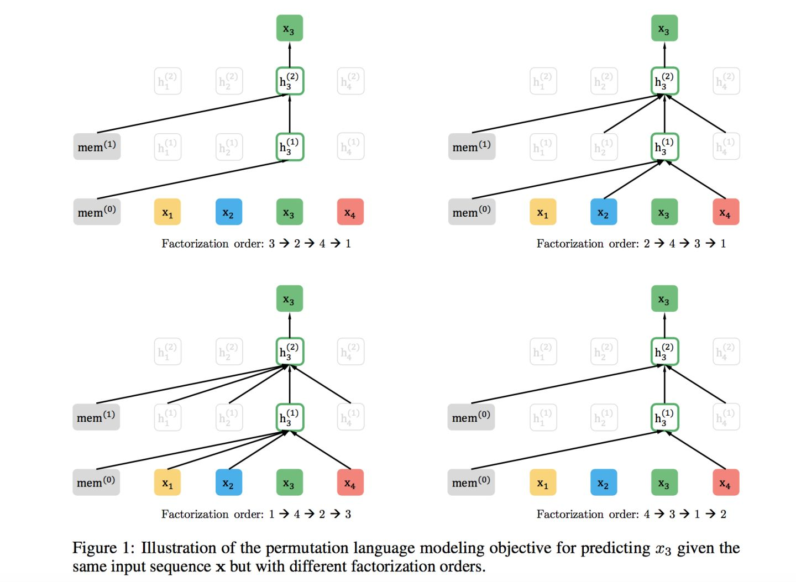
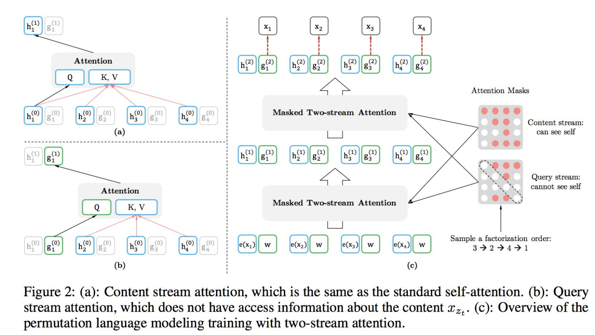
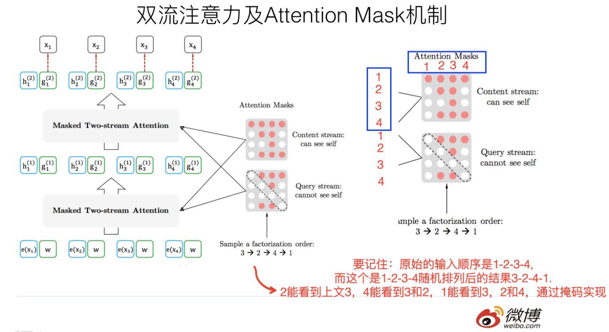
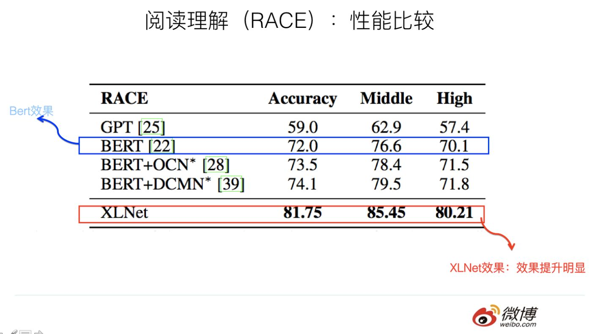
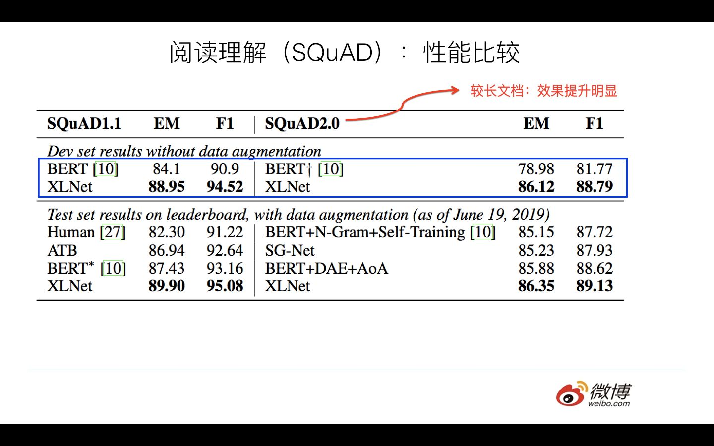
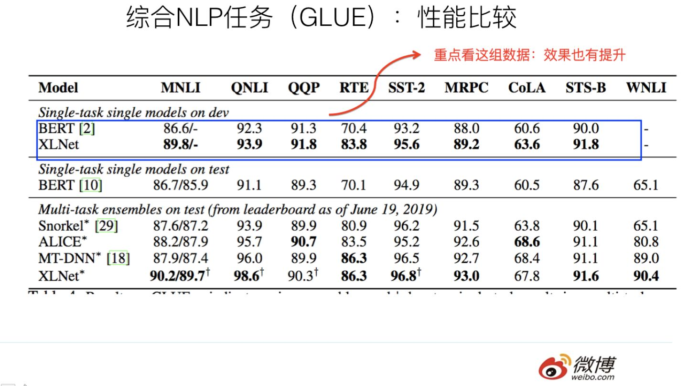
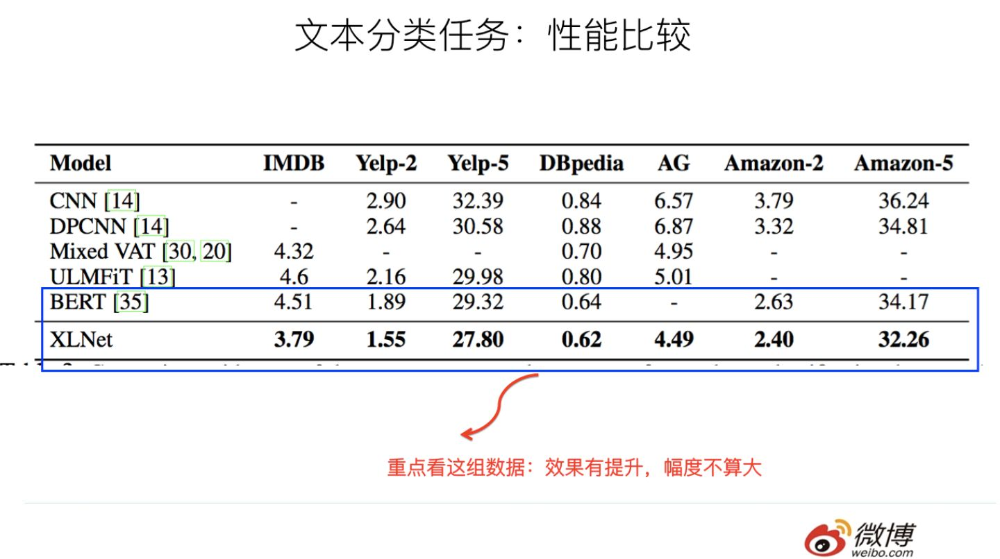
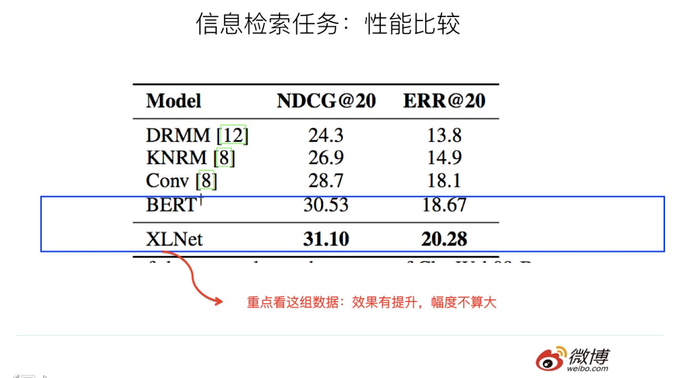
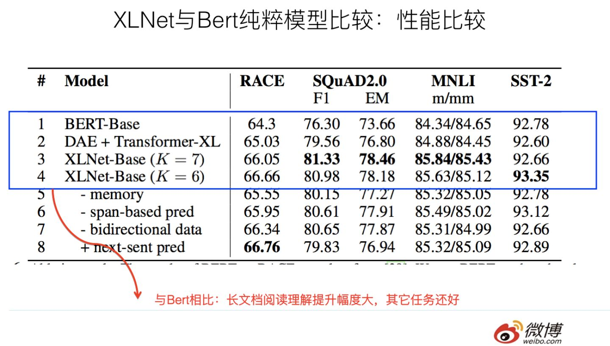

# XLNet:运行机制及和Bert的异同比较

这两天，XLNet貌似也引起了NLP圈的极大关注，从实验数据看，在某些场景下，确实XLNet相对Bert有很大幅度的提升。就像我们之前说的，感觉Bert打开两阶段模式的魔法盒开关后，在这条路上，会有越来越多的同行者，而XLNet就是其中比较引人注目的一位。当然，我估计很快我们会看到更多的这个模式下的新工作。未来两年，在两阶段新模式（预训练+Finetuning）下，应该会有更多的好工作涌现出来。根本原因在于：这个模式的潜力还没有被充分挖掘，貌似还有很大的提升空间。当然，这也意味着NLP在未来两年会有各种技术或者应用的突破，现在其实是进入NLP领域非常好的时机。原因有两个，一个是NLP正面临一个技术栈大的改朝换代的时刻，有很多空白等着你去填补，容易出成绩；另外一点，貌似Bert+Transformer有统一NLP各个应用领域的趋向，这意味着此时进入NLP领域，具备学习成本非常低的好处，和之前相比，投入产出比非常合算。这是两个原因。当然，即使如此，想要学好NLP，持续的精力投入是必不可少的。有句老话说得好：“永恒的爱大约持续三个月”，这句话其实对于很多对NLP感兴趣的同学也成立：“对NLP的永恒的热情大约能够持续3到5天”，希望真的有兴趣的同学能坚持一下，起码持续7到8天，凑够一个星期…..

那么XLNet和Bert比，有什么异同？有什么模型方面的改进？在哪些场景下特别有效？原因又是什么？本文通过论文思想解读及实验结果分析，试图回答上述问题。

首先，XLNet引入了自回归语言模型以及自编码语言模型的提法，这个思维框架我觉得挺好的，可以先简单说明下。

**自回归语言模型（Autoregressive LM）**

   在ELMO／BERT出来之前，大家通常讲的语言模型其实是根据上文内容预测下一个可能跟随的单词，就是常说的自左向右的语言模型任务，或者反过来也行，就是根据下文预测前面的单词，这种类型的LM被称为自回归语言模型。GPT 就是典型的自回归语言模型。ELMO尽管看上去利用了上文，也利用了下文，但是本质上仍然是自回归LM，这个跟模型具体怎么实现有关系。ELMO是做了两个方向（从左到右以及从右到左两个方向的语言模型），但是是分别有两个方向的自回归LM，然后把LSTM的两个方向的隐节点状态拼接到一起，来体现双向语言模型这个事情的。所以其实是两个自回归语言模型的拼接，本质上仍然是自回归语言模型。

自回归语言模型有优点有缺点，缺点是只能利用上文或者下文的信息，不能同时利用上文和下文的信息，当然，貌似ELMO这种双向都做，然后拼接看上去能够解决这个问题，因为融合模式过于简单，所以效果其实并不是太好。它的优点，其实跟下游NLP任务有关，比如生成类NLP任务，比如文本摘要，机器翻译等，在实际生成内容的时候，就是从左向右的，自回归语言模型天然匹配这个过程。而Bert这种DAE模式，在生成类NLP任务中，就面临训练过程和应用过程不一致的问题，导致生成类的NLP任务到目前为止都做不太好。

**自编码语言模型（Autoencoder LM）**

自回归语言模型只能根据上文预测下一个单词，或者反过来，只能根据下文预测前面一个单词。相比而言，Bert通过在输入X中随机Mask掉一部分单词，然后预训练过程的主要任务之一是根据上下文单词来预测这些被Mask掉的单词，如果你对Denoising Autoencoder比较熟悉的话，会看出，这确实是典型的DAE的思路。那些被Mask掉的单词就是在输入侧加入的所谓噪音。类似Bert这种预训练模式，被称为DAE LM。

这种DAE LM的优缺点正好和自回归LM反过来，它能比较自然地融入双向语言模型，同时看到被预测单词的上文和下文，这是好处。缺点是啥呢？主要在输入侧引入[Mask]标记，导致预训练阶段和Fine-tuning阶段不一致的问题，因为Fine-tuning阶段是看不到[Mask]标记的。DAE吗，就要引入噪音，[Mask] 标记就是引入噪音的手段，这个正常。

XLNet的出发点就是：能否融合自回归LM和DAE LM两者的优点。就是说如果站在自回归LM的角度，如何引入和双向语言模型等价的效果；如果站在DAE LM的角度看，它本身是融入双向语言模型的，如何抛掉表面的那个[Mask]标记，让预训练和Fine-tuning保持一致。当然，XLNet还讲到了一个Bert被Mask单词之间相互独立的问题，我相信这个不太重要，原因后面会说。当然，我认为这点不重要的事情，纯粹是个人观点，出错难免，看看就完了，不用较真。

## **XLNet做了些什么**

上文说过，Bert这种自编码语言模型的好处是：能够同时利用上文和下文，所以信息利用充分。对于很多NLP任务而言，典型的比如阅读理解，在解决问题的时候，是能够同时看到上文和下文的，所以当然应该把下文利用起来。在Bert原始论文中，与GPT1.0的实验对比分析也可以看出来，BERT相对GPT 1.0的性能提升，主要来自于双向语言模型与单向语言模型的差异。这是Bert的好处，很明显，Bert之后的改进模型，如果不能把双向语言模型用起来，那明显是很吃亏的。当然，GPT 2.0的作者不信这个邪，坚持沿用GPT 1.0 单向语言模型的旧瓶，装进去了更高质量更大规模预训练数据的新酒，而它的实验结果也说明了，如果想改善预训练语言模型，走这条扩充预序列模型训练数据的路子，是个多快好但是不省钱的方向。这也进一步说明了，预训练LM这条路，还远远没有走完，还有很大的提升空间，比如最简单的提升方法就是加大数据规模，提升数据质量。

但是Bert的自编码语言模型也有对应的缺点，就是XLNet在文中指出的，第一个预训练阶段因为采取引入[Mask]标记来Mask掉部分单词的训练模式，而Fine-tuning阶段是看不到这种被强行加入的Mask标记的，所以两个阶段存在使用模式不一致的情形，这可能会带来一定的性能损失；另外一个是，Bert在第一个预训练阶段，假设句子中多个单词被Mask掉，这些被Mask掉的单词之间没有任何关系，是条件独立的，而有时候这些单词之间是有关系的，XLNet则考虑了这种关系（关于这点原因是否可靠，后面会专门分析）。

上面两点是XLNet在第一个预训练阶段，相对Bert来说要解决的两个问题。

其实从另外一个角度更好理解XLNet的初衷和做法，我觉得这个估计是XLNet作者真正的思考出发点，是啥呢？就是说自回归语言模型有个缺点，要么从左到右，要么从右到左，尽管可以类似ELMO两个都做，然后再拼接的方式。但是跟Bert比，效果明显不足够好（这里面有RNN弱于Transformer的因素，也有双向语言模型怎么做的因素）。那么，能不能类似Bert那样，比较充分地在自回归语言模型中，引入双向语言模型呢？因为Bert已经证明了这是非常关键的一点。这一点，想法简单，但是看上去貌似不太好做，因为从左向右的语言模型，如果我们当前根据上文，要预测某个单词Ti，那么看上去它没法看到下文的内容。具体怎么做才能让这个模型：看上去仍然是从左向右的输入和预测模式，但是其实内部已经引入了当前单词的下文信息呢？XLNet在模型方面的主要贡献其实是在这里。

那么XLNet是怎么做到这一点的呢？其实思路也比较简洁，可以这么思考：XLNet仍然遵循两阶段的过程，第一个阶段是语言模型预训练阶段；第二阶段是任务数据Fine-tuning阶段。它主要希望改动第一个阶段，就是说不像Bert那种带Mask符号的Denoising-autoencoder的模式，而是采用自回归LM的模式。就是说，看上去输入句子X仍然是自左向右的输入，看到Ti单词的上文Context_before，来预测Ti这个单词。但是又希望在Context_before里，不仅仅看到上文单词，也能看到Ti单词后面的下文Context_after里的下文单词，这样的话，Bert里面预训练阶段引入的Mask符号就不需要了，于是在预训练阶段，看上去是个标准的从左向右过程，Fine-tuning当然也是这个过程，于是两个环节就统一起来。当然，这是目标。剩下是怎么做到这一点的问题。

那么，怎么能够在单词Ti的上文中Contenxt_before中揉入下文Context_after的内容呢？你可以想想。XLNet是这么做的，在预训练阶段，引入Permutation Language Model的训练目标。什么意思呢？就是说，比如包含单词Ti的当前输入的句子X，由顺序的几个单词构成，比如x1,x2,x3,x4四个单词顺序构成。我们假设，其中，要预测的单词Ti是x3，位置在Position 3，要想让它能够在上文Context_before中，也就是Position 1或者Position 2的位置看到Position 4的单词x4。可以这么做：假设我们固定住x3所在位置，就是它仍然在Position 3，之后随机排列组合句子中的4个单词，在随机排列组合后的各种可能里，再选择一部分作为模型预训练的输入X。比如随机排列组合后，抽取出x4,x2，x3,x1这一个排列组合作为模型的输入X。于是，x3就能同时看到上文x2，以及下文x4的内容了。这就是XLNet的基本思想，所以说，看了这个就可以理解上面讲的它的初衷了吧：看上去仍然是个自回归的从左到右的语言模型，但是其实通过对句子中单词排列组合，把一部分Ti下文的单词排到Ti的上文位置中，于是，就看到了上文和下文，但是形式上看上去仍然是从左到右在预测后一个单词。

当然，上面讲的仍然是基本思想。难点其实在于具体怎么做才能实现上述思想。首先，需要强调一点，尽管上面讲的是把句子X的单词排列组合后，再随机抽取例子作为输入，但是，实际上你是不能这么做的，因为Fine-tuning阶段你不可能也去排列组合原始输入。所以，就必须让预训练阶段的输入部分，看上去仍然是x1,x2,x3,x4这个输入顺序，但是可以在Transformer部分做些工作，来达成我们希望的目标。具体而言，XLNet采取了Attention掩码的机制，你可以理解为，当前的输入句子是X，要预测的单词Ti是第i个单词，前面1到i-1个单词，在输入部分观察，并没发生变化，该是谁还是谁。但是在Transformer内部，通过Attention掩码，从X的输入单词里面，也就是Ti的上文和下文单词中，随机选择i-1个，放到Ti的上文位置中，把其它单词的输入通过Attention掩码隐藏掉，于是就能够达成我们期望的目标（当然这个所谓放到Ti的上文位置，只是一种形象的说法，其实在内部，就是通过Attention Mask，把其它没有被选到的单词Mask掉，不让它们在预测单词Ti的时候发生作用，如此而已。看着就类似于把这些被选中的单词放到了上文Context_before的位置了）。具体实现的时候，XLNet是用“双流自注意力模型”实现的，细节可以参考论文，但是基本思想就如上所述，双流自注意力机制只是实现这个思想的具体方式，理论上，你可以想出其它具体实现方式来实现这个基本思想，也能达成让Ti看到下文单词的目标。

这里简单说下“双流自注意力机制”，一个是内容流自注意力，其实就是标准的Transformer的计算过程；主要是引入了Query流自注意力，这个是干嘛的呢？其实就是用来代替Bert的那个[Mask]标记的，因为XLNet希望抛掉[Mask]标记符号，但是比如知道上文单词x1,x2，要预测单词x3，此时在x3对应位置的Transformer最高层去预测这个单词，但是输入侧不能看到要预测的单词x3，Bert其实是直接引入[Mask]标记来覆盖掉单词x3的内容的，等于说[Mask]是个通用的占位符号。而XLNet因为要抛掉[Mask]标记，但是又不能看到x3的输入，于是Query流，就直接忽略掉x3输入了，只保留这个位置信息，用参数w来代表位置的embedding编码。其实XLNet只是扔了表面的[Mask]占位符号，内部还是引入Query流来忽略掉被Mask的这个单词。和Bert比，只是实现方式不同而已。

上面说的Attention掩码，我估计你还是没了解它的意思，我再用例子解释一下。Attention Mask的机制，核心就是说，尽管当前输入看上去仍然是x1->x2->x3->x4，但是我们已经改成随机排列组合的另外一个顺序x3->x2->x4->x1了，如果用这个例子用来从左到右训练LM，意味着当预测x2的时候，它只能看到上文x3；当预测x4的时候，只能看到上文x3和x2，以此类推……这样，比如对于x2来说，就看到了下文x3了。这种在输入侧维持表面的X句子单词顺序，但是其实在Transformer内部，看到的已经是被重新排列组合后的顺序，是通过Attention掩码来实现的。如上图所示，输入看上去仍然是x1,x2,x3,x4，可以通过不同的掩码矩阵，让当前单词Xi只能看到被排列组合后的顺序x3->x2->x4->x1中自己前面的单词。这样就在内部改成了被预测单词同时看到上下文单词，但是输入侧看上去仍然维持原先的单词顺序了。关键要看明白上图右侧那个掩码矩阵，我相信很多人刚开始没看明白，因为我刚开始也没看明白，因为没有标出掩码矩阵的单词坐标，它的坐标是1-2-3-4，就是表面那个X的单词顺序，通过掩码矩阵，就能改成你想要的排列组合，并让当前单词看到它该看到的所谓上文，其实是掺杂了上文和下文的内容。这是attention mask来实现排列组合的背后的意思。

上面讲的Permutation Language Model是XLNet的主要理论创新，所以介绍的比较多，从模型角度讲，这个创新还是挺有意思的，因为它开启了自回归语言模型如何引入下文的一个思路，相信对于后续工作会有启发。当然，XLNet不仅仅做了这些，它还引入了其它的因素，也算是一个当前有效技术的集成体。感觉XLNet就是Bert、GPT 2.0和Transformer XL的综合体变身，首先，它通过PLM预训练目标，吸收了Bert的双向语言模型；然后，GPT2.0的核心其实是更多更高质量的预训练数据，这个明显也被XLNet吸收进来了；再然后，Transformer XL的主要思想也被吸收进来，它的主要目标是解决Transformer对于长文档NLP应用不够友好的问题。

以上是XLNet的几个主要改进点，有模型创新方面的，有其它模型引入方面的，也有数据扩充方面的。那么，这些因素各自起到了什么作用呢？在后面我们会谈。在谈不同因素各自作用之前，我们先分析下XLNet和Bert的异同问题。

## **与Bert的预训练过程的异同问题**

  尽管看上去，XLNet在预训练机制引入的Permutation Language Model这种新的预训练目标，和Bert采用Mask标记这种方式，有很大不同。其实你深入思考一下，会发现，两者本质是类似的。区别主要在于：Bert是直接在输入端显示地通过引入Mask标记，在输入侧隐藏掉一部分单词，让这些单词在预测的时候不发挥作用，要求利用上下文中其它单词去预测某个被Mask掉的单词；而XLNet则抛弃掉输入侧的Mask标记，通过Attention Mask机制，在Transformer内部随机Mask掉一部分单词（这个被Mask掉的单词比例跟当前单词在句子中的位置有关系，位置越靠前，被Mask掉的比例越高，位置越靠后，被Mask掉的比例越低），让这些被Mask掉的单词在预测某个单词的时候不发生作用。所以，本质上两者并没什么太大的不同，只是Mask的位置，Bert更表面化一些，XLNet则把这个过程隐藏在了Transformer内部而已。这样，就可以抛掉表面的[Mask]标记，解决它所说的预训练里带有[Mask]标记导致的和Fine-tuning过程不一致的问题。至于说XLNet说的，Bert里面被Mask掉单词的相互独立问题，也就是说，在预测某个被Mask单词的时候，其它被Mask单词不起作用，这个问题，你深入思考一下，其实是不重要的，因为XLNet在内部Attention Mask的时候，也会Mask掉一定比例的上下文单词，只要有一部分被Mask掉的单词，其实就面临这个问题。而如果训练数据足够大，其实不靠当前这个例子，靠其它例子，也能弥补被Mask单词直接的相互关系问题，因为总有其它例子能够学会这些单词的相互依赖关系。

我相信，通过改造Bert的预训练过程，其实是可以模拟XLNet的Permutation Language Model过程的：Bert目前的做法是，给定输入句子X，随机Mask掉15%的单词，然后要求利用剩下的85%的单词去预测任意一个被Mask掉的单词，被Mask掉的单词在这个过程中相互之间没有发挥作用。如果我们把Bert的预训练过程改造成：对于输入句子，随机选择其中任意一个单词Ti，只把这个单词改成Mask标记，假设Ti在句子中是第i个单词，那么此时随机选择X中的任意i个单词，只用这i个单词去预测被Mask掉的单词。当然，这个过程理论上也可以在Transformer内采用attention mask来实现。如果是这样，其实Bert的预训练模式就和XLNet是基本等价的了。

或者换个角度思考，假设仍然利用Bert目前的Mask机制，但是把Mask掉15%这个条件极端化，改成，每次一个句子只Mask掉一个单词，利用剩下的单词来预测被Mask掉的单词。那么，这个过程其实跟XLNet的PLM也是比较相像的，区别主要在于每次预测被Mask掉的单词的时候，利用的上下文更多一些（XLNet在实现的时候，为了提升效率，其实也是选择每个句子最后末尾的1/K单词被预测，假设K=7，意味着一个句子X，只有末尾的1/7的单词会被预测，这意味着什么呢？意味着至少保留了6/7的Context单词去预测某个单词，对于最末尾的单词，意味着保留了所有的句子中X的其它单词，这其实和上面提到的Bert只保留一个被Mask单词是一样的）。或者我们站在Bert预训练的角度来考虑XLNet，如果XLNet改成对于句子X，只需要预测句子中最后一个单词，而不是最后的1/K（就是假设K特别大的情况），那么其实和Bert每个输入句子只Mask掉一个单词，两者基本是等价的。

当然，XLNet这种改造，维持了表面看上去的自回归语言模型的从左向右的模式，这个Bert做不到，这个有明显的好处，就是对于生成类的任务，能够在维持表面从左向右的生成过程前提下，模型里隐含了上下文的信息。所以看上去，XLNet貌似应该对于生成类型的NLP任务，会比Bert有明显优势。另外，因为XLNet还引入了Transformer XL的机制，所以对于长文档输入类型的NLP任务，也会比Bert有明显优势。

## **哪些因素在起作用？**

如上分析，XLNet有个好处，但是感觉同时也是个问题，那就是：XLNet其实同时引入了很多因素在模型里。说是好处，因为实验证明了这样效果确实好，即使是跟Bert_Large这种非常强的基准模型比也是，尤其是长文档任务，这个效果提升比较明显；说是问题，是因为其实应该在实验部分充分说明，如果模型起了作用，这些因素各自发挥了多大作用，尤其是在跟Bert进行对比的时候，感觉应该把数据规模这个变量磨平进行比较，因为这才是单纯的模型差异导致的性能差异，而不是训练数据量引发的差异。当然，XLNet最后一组实验是把这个预训练数据规模差异磨平后，和Bert比较的，所以信息含量更大些。而前面的几组实验，因为天然存在预训练数据量的差异，所以模型导致的差异到底有多大，看得不太明显。

我们上文提到过，XLNet起作用的，如果宏观归纳一下，共有三个因素；

1. 与Bert采取De-noising Autoencoder方式不同的新的预训练目标：Permutation Language Model(简称PLM)；这个可以理解为在自回归LM模式下，如何采取具体手段，来融入双向语言模型。这个是XLNet在模型角度比较大的贡献，确实也打开了NLP中两阶段模式潮流的一个新思路。

2. 引入了Transformer-XL的主要思路：相对位置编码以及分段RNN机制。实践已经证明这两点对于长文档任务是很有帮助的；

3. 加大增加了预训练阶段使用的数据规模；Bert使用的预训练数据是BooksCorpus和英文Wiki数据，大小13G。XLNet除了使用这些数据外，另外引入了Giga5，ClueWeb以及Common Crawl数据，并排掉了其中的一些低质量数据，大小分别是16G,19G和78G。可以看出，在预训练阶段极大扩充了数据规模，并对质量进行了筛选过滤。这个明显走的是GPT2.0的路线。

所以实验部分需要仔细分析，提升到底是上述哪个因素或者是哪几个因素导致的性能提升？

我们把实验分成几个部分来分析。

首先，给人最大的印象是：XLNet对于阅读理解类任务，相对Bert，性能有极大幅度地提升。下面是论文报道的实验结果：

其中，RACE和SQuAD 2.0是文档长度较长的阅读理解任务，任务难度也相对高。可以看出，在这两个任务中，XLNet相对 Bert_Large，确实有大幅性能提升（Race提升13.5%,SQuAD 2.0 F1指标提升8.6）。在Squad1.1上提升尽管稍微小些，F1提升3.9%，但是因为基准高，所以提升也比较明显。

说XLNet在阅读理解，尤其是长文档的阅读理解中，性能大幅超过Bert，这个是没疑问的。但是，因为XLNet融入了上文说的三个因素，所以不确定每个因素在其中起的作用有多大，而对于长文档，Transformer XL的引入肯定起了比较大的作用，Bert天然在这种类型任务中有缺点，其它两类因素的作用不清楚。感觉这里应该增加一个基准，就是Bert用与XLNet相同大小的预训练数据做，这样抹平数据量差异，更好比较模型差异带来的效果差异。当然，我觉得即使是这样，XLNet应该仍然是比Bert效果好的，只是可能不会差距这么大，因为XLNet的长文档优势肯定会起作用。

下面我们看下其它类型的NLP任务。

GLUE是个综合的NLP任务集合，包含各种类型的任务，因为ensemble模式里面包含了各种花式的trick，所以重点看上面一组实验，这里比较单纯。从实验数据看，XLNet相对Bert也有性能提升，当然不像阅读理解提升那么大，而且性能提升比较大的集中在RTE，MNLI和COLA数据集合，其它任务提升效果还好。而我一直觉得，RTE在GLUE里，是个神奇的存在，如果没有它，很多论文的效果可能没法看，这个是闲话，先不讲了，后面我会单说。

 当然，仍然不确定这种性能提升主要来自于XLNet的哪个因素，或者哪几个因素各自的贡献，尤其是如果Bert加大预训练数据规模后，两者性能差异有多大。感觉这里Transformer XL的因素可能发挥的作用不会太大，其它两个因素在起作用，但是作用未知，这里感觉应该补充其它实验。

上面是文本分类任务和信息检索任务，可以看出，相对Bert，XLNet效果有提升，但是幅度不算大。仍然是上面的考虑，起作用的三个因素，到底哪个发挥多大作用，从数据方面看不太出来。

下面一组实验可以仔细分析一下，这组实验是排除掉上述第三个数据规模因素的实验的对比，就是说XLNet用的是和Bert相同规模的预训练数据，所以与Bert对比更具备模型方面的可比较性，而没有数据规模的影响。实验结果如下：

如果仔细分析实验数据，实验结果说明：

因为和Bert比较，XLNet使用相同的预训练数据。所以两者的性能差异来自于：Permutation Language Model预训练目标以及Transformer XL的长文档因素。而从中可以看出，DAE+Transformer XL体现的是长文档因素的差异，和Bert比，Race提升1个点，SQuAD F1提升3个点，MNLI提升0.5个点，SST-2性能稍微下降。这是Transformer XL因素解决长文档因素带来的收益，很明显，长文档阅读理解任务提升比较明显，其它任务提升不太明显。

 而通过XLNet进一步和DAE+Transformer XL及Bert比，这一点应该拆解出Permutation Language Model和Mask的方式差异。可以看出：XLNet相对DAE+Transformer XL来说，Race进一步提升1个点左右；SQuAD进一步提升1.8个点左右，NMLI提升1个点左右，SST-B提升不到1个点。虽然不精准，但是大致是能说明问题的，这个应该大致是PLM带来的模型收益。可以看出，PLM还是普遍有效的，但是提升幅度并非特别巨大。

 如果我们结合前面Race和SQuAD的实验结果看（上面两组实验是三个因素的作用，后面是排除掉数据量差异的结果，所以两者的差距，很可能就是第三个因素：数据规模导致的差异，当然，因为一个是Bert_base，一个是Bert_Large，所以不具备完全可比性，但是大致估计不会偏离真实结论太远），Race数据集合三因素同时具备的XLNet，超过Bert绝对值大约9个多百分点，Transformer因素+PLM因素估计贡献大约在2到4个点之间，那么意味着预训练数据量导致的差异大概在4到5个点左右；类似的，可以看出，SQuAD 2.0中，预训练数据量导致的差异大约在2到3个点左右，也就是说，估计训练数据量带来的提升，在阅读理解任务中大约占比30%到40%左右。 

  如果从实验结果归纳一下的话，可以看出：XLNet综合而言，效果是优于Bert的，尤其是在长文档类型任务，效果提升明显。如果进一步拆解的话，因为对比实验不足，只能做个粗略的结论：预训练数据量的提升，大概带来30%左右的性能提升，其它两个模型因素带来剩余的大约70%的性能提升。当然，这个主要指的是XLNet性能提升比较明显的阅读理解类任务而言。对于其它类型任务，感觉Transformer XL的因素贡献估计不会太大，主要应该是其它两个因素在起作用。

## **对NLP应用任务的影响**

 XLNet其实本质上还是ELMO／GPT／Bert这一系列两阶段模型的进一步延伸。在将自回归LM方向引入双向语言模型方面，感觉打开了一个新思路，这点还是非常对人有启发的。当然，如果深入思考，其实和Bert并没有太大的不同。

 如果让我推论下XLNet的出现，对后续NLP工作的影响，我觉得跟Bert比，最直接的影响应该有两个，一个是对于Bert长文档的应用，因为Transformer天然对长文档任务处理有弱点，所以XLNet对于长文档NLP任务相比Bert应该有直接且比较明显的性能提升作用，它在论文中也证明了这点。所以，以后长文档类型的NLP应用，XLNet明显跟Bert比占优势。当然，你说我把Transformer XL的因素引入Bert，然后继续在Bert上做改进，明显这也是可以的。

 第二点，对于生成类的NLP任务，到目前为止，尽管出了一些改进模型，但是从效果看，Bert仍然不能很好地处理。而因为XLNet的预训练模式天然符合下游任务序列生成结果，所以按理说能够直接通过引入XLNet来改进生成类NLP任务的效果。所以，这点估计是XLNet会明显占优势的一个领域。

 可以预计的是，很快我们就会看到XLNet在文本摘要，机器翻译，信息检索…..等符合上述XLNet应用领域特点和优势领域的应用结果，以及在这些任务上的进一步改进模型。当然，这个有点比手速的意思，有意者请尽快动手把结果扔出来。