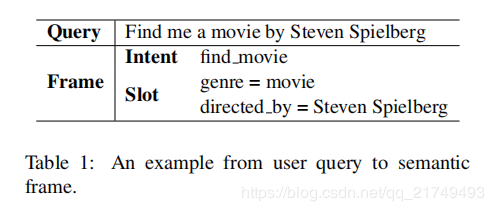
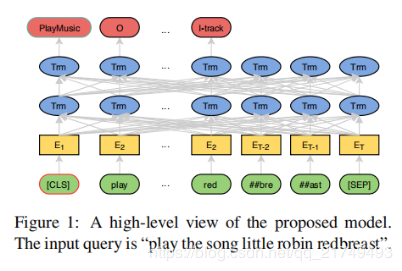
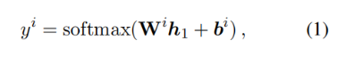
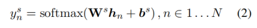
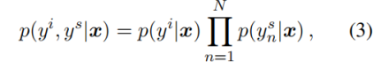
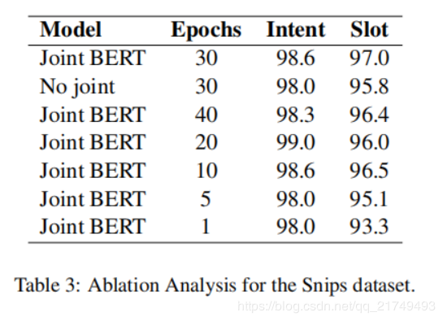
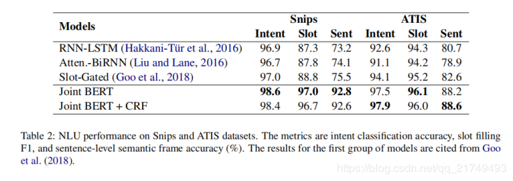
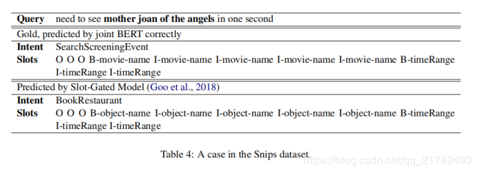

# BERT for Joint Intent Classification and Slot Filling

## Abstract
意图分类和插槽填充是自然语言理解的两个基本任务。他们经常受到小规模的人工标签训练数据的影响，导致泛化能力差，尤其是对于低频单词。最近，一种新的语言表示模型BERT (Bidirectional Encoder Representations from Transformers)，有助于在大型未标记的语料库上进行预训练深层的双向表示，并在经过简单的微调之后为各种自然语言处理任务创建了最新的模型。但是，并没有太多的工作探索Bert 在自然语言理解中的使用。在这项工作中，我们提出了一种基于BERT的联合意图分类和插槽填充模型。实验结果表明，与基于注意力的递归神经网络模型和插槽门控模型相比，我们提出的模型在多个公共基准数据集上的意图分类准确性，狭缝填充F1和句子级语义框架准确性均取得了显着提高。

## 1.Introduction
近年来，已经出现了各种智能对话系统并取得了巨大的成功，例如Google Home，Amazon Echo，Tmall Genie，它们促进了面向目标的对话并帮助用户通过语音交互来完成任务。自然语言理解（NLU）对于面向目标的口语对话系统的性能至关重要。NLU通常包括意图分类和插槽填充任务，旨在为用户话语做出语义解析。意图分类侧重于预测查询的意图，而插槽填充则提取语义概念。表1显示了针对用户查询“Find me a movie by Steven Spielberg.”的意图分类和插槽填充的示例。

意图分类是一个预测意图标签yi的分类问题，而插槽填充是一个序列标注任务，该任务将输入单词序列x =（x1，x2，…，xT）标记为插槽标签序列ys =（ys 1，ys 2，···，ys T）。基于递归神经网络（RNN）的方法，特别是门控神经单元（GRU）和长短期记忆网络（LSTM）模型，已经实现了意图分类和插槽填充的SOTA表现。最近，几种用于意图分类和插槽填充的联合学习方法被提出，以利用和建模两个任务之间的依赖关系，并获得了高于独立模型的性能(Guo et al., 2014;Hakkani-Tur et al. ¨ , 2016; Liu and Lane, 2016; Gooet al., 2018)。先前的工作表明，注意力机制（Bahdanau等人，2014）可帮助RNN处理长期依赖关系。因此，基于注意力的联合学习方法被提出，并实现了联合意图分类和插槽填充的SOTA表现(Liu and Lane, 2016; Goo et al., 2018)。

缺少用于NLU和其他自然语言处理（NLP）任务的手工标记数据会导致泛化能力较差。为了解决数据稀疏性挑战，已经提出了多种技术使用大量未标记的文本来训练通用语言表示模型，例如ELMo(Peters et al., 2018)和Generative Pre-trained Transformer (GPT) (Radford et al., 2018)。可以针对NLP任务对预训练的模型进行微调，并且与针对特定任务的带标签数据的训练相比，已取得了显著改善。最近，有人提出了一种预训练技术，即Bidirectional Encoder Representations from Transformers (BERT) (Devlinet al., 2018)，并为包括问答（SQuAD v1）在内的各种NLP任务创建了最先进的模型。

但是，对于探索Bert在NLU的使用并没有太多相关工作。这项工作的技术贡献有两个方面：1）我们探索了BERT预训练模型来解决NLU泛化能力差的问题；2）我们提出了一种基于BERT的联合意图分类和插槽填充模型，并证明了该模型与基于注意力的RNN模型和槽填充门机制模型相比，在意图分类准确性，插槽填充F1分数和句子级语义框架准确性方面有显著提高。

## 2.Related Work

深度学习模型已在NLU中广泛使用。根据意图分类和插槽填充是分别建模还是联合建模，我们将NLU模型分为独立建模方法和联合建模方法。包含CNN (Kim, 2014; Zhang et al., 2015),LSTM (Ravuri and Stolcke, 2015), attentionbased CNN (Zhao and Wu, 2016), hierarchical
attention networks (Yang et al., 2016), adversarial multi-task learning (Liu et al., 2017)。插槽填充的方法包括CNN (Vu,2016), deep LSTM (Yao et al., 2014), RNNEM (Peng et al., 2015), encoder-labeler deepLSTM (Kurata et al., 2016), and joint pointer and attention (Zhao and Feng, 2018).

## 3.Proposed Approach

我们首先简要描述BERT模型 (Devlinet al., 2018)，然后介绍基于BERT的联合模型。图1展示了所提出模型的高层视图。

### 3.1 BERT
BERT的模型架构是基于Transformer model (Vaswani et al., 2017)中的多层双向Transformer编码器.输入表示形式是WordPiece embeddings (Wu et al., 2016)，positional embeddings和 the segment embedding。特别地，对于单句分类和标记任务，the segment embedding没有区别。特殊embedding([CLS])作为第一个token，embedding（[SEP]）作为最终token。给定输入序列x =（x1，…，xT），BERT的输出为H =（h1，…，hT）。
BERT模型在大型未标记文本上使用两个策略进行预训练，即masked language model和next sentence prediction。预训练的BERT模型提供了功能强大的上下文相关语句表示形式，可通过微调过程用于各种目标任务，例如意图分类和空位填充，类似于用于其他NLP任务的方式 。

Bert 基础了解： https://bigganbing.github.io/2019/10/12/Learning-Bert/

### 3.2 Joint Intent Classification and Slot Filling

BERT可以轻松扩展到意图分类和插槽填充联合模型。基于第一个特殊token（[CLS]）的隐藏状态，其表示为h1，其意图预测为：

对于插槽填充，我们为其他token 的隐藏状态h2，…，hT准备了softmax layer ，以对插槽填充标签进行分类。为了使该过程与WordPiece tokenization兼容，我们将每个标记化的输入词送入WordPiece标记器，并使用与第一个子标记相对应的隐藏状态作为softmax分类器的输入。

hn是与单词xn的第一个子标记相对应的隐藏状态。
为了联合建模意图分类和插槽填充，目标公式为：

学习目标是最大化 条件概率p，通过最小化交叉熵损失来对模型进行端到端微调。

### 3.3 Conditional Random Field
插槽标签的预测取决于周围单词的预测。已经表明，结构化预测模型可以改善插槽填充性能，例如条件随机场（CRF）。Zhou and Xu（2015）通过为BiLSTM编码器添加CRF层来改进语义角色标记。在这里，我们研究了在联合BERT模型的基础上添加CRF来建模插槽标签依赖性的功效。

## 4 Experiments and Analysis
我们在ATIS和Snips上评估提出的模型。
### 4.1 Data
ATIS数据集 (Tur et al. ¨ , 2010)被广泛用于NLU研究，其中包括预订航班的录音。我们使用与 Goo et al. (2018)等人相同的数据划分方法进行训练，开发和测试集分别包含4,478、500和893句话。数据集有120个插槽标签和21种意图类型。我们还使用Snips（Coucke等人，2018），该软件是从Snips个人语音助手收集的。训练集，开发集和测试集分别包含13,084、700和700句话。训练集有72个插槽标签和7种意图类型。

### 4.2 Training Details
我们使用英语无大小写的BERT-Base模型1，该模型具有12层，768维的隐藏状态和12个头。BERT在BooksCorpus(800M words) (Zhu et al., 2015) and EnglishWikipedia (2,500M words).上接受了预培训。为了进行微调，所有超参数都在开发集上进行了微调。最大长度为50。批量大小为128。Adam（Kingma和Ba，2014）用于优化，初始学习率为5e-5。丢弃概率为0.1。最大训练次数选自[1、5、10、20、30、40]。

### 4.3 Results

表2显示了Snips和ATIS数据集的模型性能，如插槽填充F1，意图分类准确率和句子级语义框架精度。

第一组模型是baseline，由最新的联合意图分类和插槽填充模型组成：使用BiLSTM的基于序列的联合模型（Hakkani-Tur¨等，2016），基于注意力的 （Liu and Lane，2016）和插槽门控模型（Goo et al。，2018）。
第二组模型包括我们提出的BERT联合模型。从表2中可以看出，联合BERT模型在两个数据集上均明显优于baseline模型。在Snips上，联合BERT的意图分类准确率达到98.6％（原为97.0％），插槽填充F1为97.0％（原为88.8％）和句子级语义框架准确度为92.8％（原为75.5％）。在ATIS上，联合BERT的意图分类准确率达到了97.5％（原为94.1％），插槽填充F1为96.1％（原为95.2％）以及句子级语义框架准确度为88.2％（原为82.6％）。联合BERT + CRF用CRF取代了softmax分类器，它的性能与BERT相当，这可能是由于Transformer中的自注意机制可能已经对标签结构进行了充分建模。
与ATIS相比，Snips包含多个域，并且词汇量更大。
对于更复杂的Snips数据集，联合BERT在句子级语义框架准确性上获得了很大的提高，从75.5％到92.8％（相对值为22.9％）。考虑到它是对来自不匹配的域和类型（书籍和维基百科）的大规模文本进行预训练的。这表明联合BERT模型具有很强的泛化能力，在ATIS上，联合BERT的句子级语义框架准确性也得到了显着提高，从82.6％提高到88.2％（相对为6.8％）。

### 4.4 Ablation Analysis and Case Study
我们对Snips进行了消融分析，如表3所示。如果没有联合学习，意图分类的准确度将从98.6％下降到98.0％，槽填充的F1分数从97.0下降到95.8％。我们还将联合BERT模型与不同的微调训练次数进行了比较。仅用1个次数进行微调的联合BERT模型已经优于表2中的第一组模型。我们进一步从Snips中选择一个案例，如表4所示，该案例通过利用BERT的语言表示能力来提高泛化能力，显示联合BERT如何胜过插槽门控模型（Goo等人，2018）。在这种情况下，插槽门控模型错误地预测了“mother joan of the angels”作为对象名称，并且意图也是错误的。但是，联合BERT可以正确预测槽标签和意图，因为“mother joan of the angels”是维基百科中的电影条目。BERT模型已部分在维基上进行了预训练，并且可能通过此稀有短语学习了此信息。

## 5.结论
我们提出了一种基于BERT的联合意图分类和插槽填充模型，旨在解决传统NLU模型泛化能力差的问题。实验结果表明，我们提出的联合BERT模型优于分别建模意图分类和插槽填充的BERT模型，证明了利用这两个任务之间的关系的有效性。我们提出的联合BERT模型在ATIS和Snips数据集上的意图分类准确率，插槽填充F1和句子级语义框架准确度都比以前的最新模型有了显着提高。未来的工作包括对其他大规模和更复杂的NLU数据集上所提出的方法进行评估，并探索将外部知识与BERT结合的效果。
