## BERT模型的标准调优和花式调优

**{新智元导读}**BERT预训练模型就如宰好待烹的猪，则finetune便是烹饪之法，猪头能用来做成香糯浓醇的烧猪头肉，猪蹄能用来做成劲道十足的红烧猪蹄，身上的梅花肉，五花肉，里脊肉也各有各的做法。于是对于 Bert finetune，也就有各种料理之法。

自去年 BERT 论文发出，正巧半年，不光各大榜单上尽是 BERT 之名，最近公布 NAACL 最佳长论文也给了 BERT，正所谓实至名归。

正巧在读 BERT 相关论文， 顺便总结下，给大家介绍 BERT论文发出半年后的今天，大概都有哪些与 BERT finetune 相关的研究。

先来简单介绍 BERT，再进入正题。

BERT全称Bidirectional Encoder Representations from Transformers（Transformer 双向编码器特征），缩写为芝麻街的主角之一 BERT。

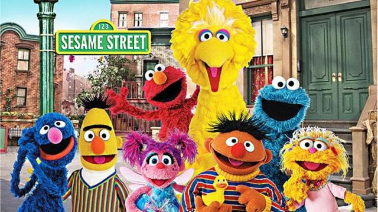

取名的恶趣味，导致之后微软，百度的改进模型，都叫 Big-Bird 和 ERNIE，俨然走错片场，进入了芝麻街的世界。

BERT最主要是开创性地提出同时用 Masked Language Model （掩语言模型） 和 Next Sentence Prediction（下句预测）两个任务，加上大量的数据，来预训练出一个大型的 Transformer 模型。

而这个模型，也就是今天的主角 BERT。

BERT主要部件

既然要各自 finetune，那便得先了解 BERT 这头大肥猪的主要部位。

首先是最关键的输入部分，之后大部分 finetune 和这部分联系很大。

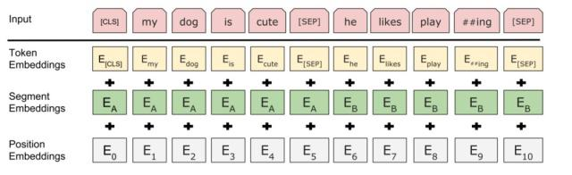

自上向下一一可知，BERT 输入最主要组成部分便是，词（token 这里姑且理解为词）向量、段（segment）向量、位置向量。

**词向量**很好理解，也是模型中关于词最主要信息所在；

**段向量**是因为 BERT 里有下句预测任务，所以会有两句拼接起来，上句与下句，上句有上句段向量，下句则有下句段向量，也就是图中 A 与 B。此外，句子末尾都有加 [SEP] 结尾符，两句拼接开头有 [CLS] 符；

而位置向量则是因为 Transformer 模型不能记住时序，所以人为加入表示位置的向量。

之后这三个向量拼接起来的输入会喂入 BERT 模型，输出各个位置的表示向量。

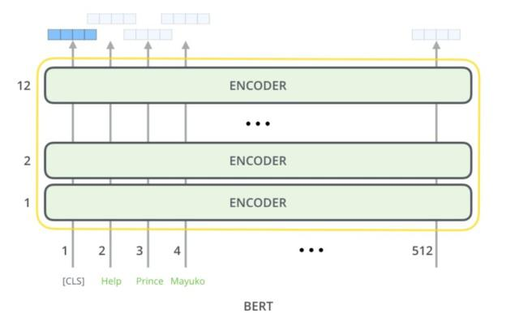

Finetune 标准四法

关于 Finetune，这里定义 BERT 论文上提到的四种方法为标准法，而此外各种方法，则定义为花式。而如果只是对标准法轻微改动，也归入标准。

标准四法第一法，**双句分类任务**。

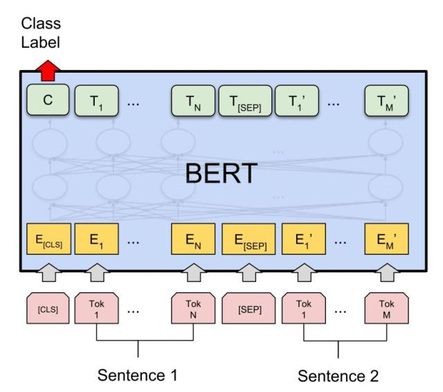

很简单就像 BERT 的设定一般，两句拼起来，加上 [CLS] 和 [SEP]，直接取 [CLS] 位置输出向量预测，进行 finetune。

标准四法第二法，**单句分类任务**。

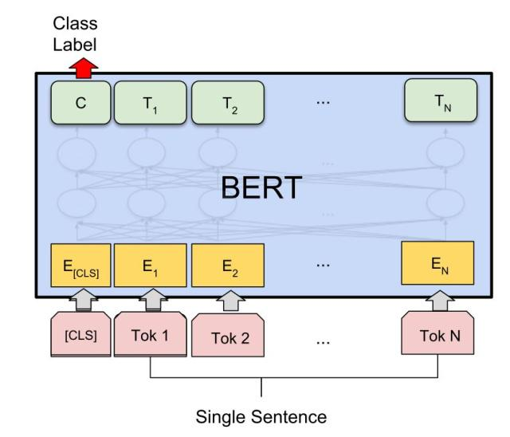

和双句不同的是，直接拿单句，前面加入 [CLS] 输入，之后同样取 [CLS] 位置输出来预测，进行 finetune。

标准四法第三法，**问答（QA）任务**。

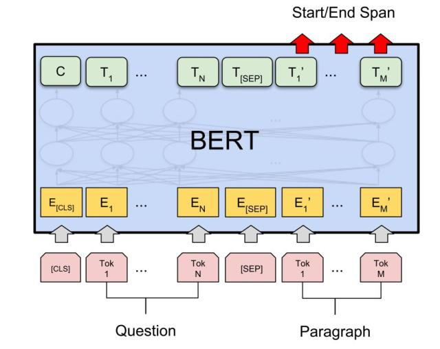

将问题和答题所需上下文分别作为上句与下句，加入 [CLS] 和 [SEP] 特殊符，之后通过在上下文部分预测答案所在位置开头 (Start) 与结尾 (End)，进行 finetune。

标准四法第四法，**单句标注任务**。

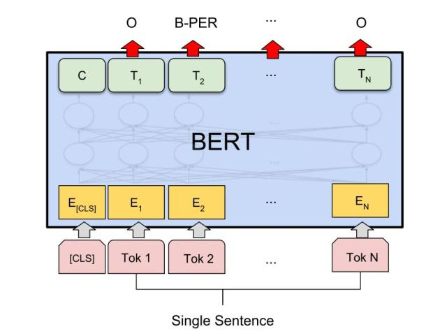

之前单句分类，先加入 [CLS]，但是最后取其他位置输出，预测相应标注，进行 finetune。

Finetune 之标准篇

先来介绍论文中用到标准法的。

**双句分类**

标准法的双句分类，在类似文档检索任务中，将 query 与文档作为上下句，拿 [CLS] 的输出来预测，finetune。

有这两篇论文：

Simple Applications of BERT for Ad Hoc Document RetrievalPassage Re-ranking with BERT

如果说这样的文档检索主要有三步：

第一，先用工具或算法（BM25 等）获得最初候选；

第二，用方法对 query 与候选匹配重新打分，按照分数重新排序；

第三，最上面多少条作为所需。

这里最主要是对第二步处理。

Simple Applications of BERT for Ad Hoc Document Retrieval

主要测试了两个任务，首先是 Microblog 的句级别检索匹配，用 Anserini IR toolkit 工具先根据 query 召回 1000 条候选，然后候选和 query 拼接喂入 BERT 得到分数，之后取 BERT 分数和 Anserini 分数的线性插值，作为结果分数，重新排序。

然后在 newswire 上长片段检索，文档长度拼接 query 会大于 BERT 预训练模型最大长度 512 个 token。其实大体步骤与句级别相同，不过会先在句级别 finetune，之后，计算文档分句后各句分数，取 top n 加权，再和 Anserini 的分数插值，重新排序。

**Passage Re-ranking with BERT**

大体和上篇类似，数据集有些不同，也是先第一步用 BM25 算法，获得 1000 篇相关候选，然后把 query 作为上句候选作为下句，BERT 打分，最后对候选重新排序。

和上面做法不同的是，对于 query 超过 64 个 token 部分截断，以及 query 和候选拼接总长超过 512 部分截掉。训练时，拿 1000 个中相关的作为正例，不相关作为负例，取 [CLS] 向量二分类 finetune。

**单句标注**

Google 公开的 BERT 预训练模型，根据语言，可分为英文，中文，多语言（104 种语言）。这里介绍的大部分论文都是拿英文模型直接 finetune，而中文没有，这一篇是唯一一篇用多语言 finetune 的。

75 Languages, 1 Model: Parsing Universal Dependencies Universally

这篇论文用到的是斯坦福的 Universal Dependencies 数据集，里面包含了多达 75 种语言的语料，任务和标注也涵盖了从形态学，到 POS，再到依存关系等等多级任务。

最早入门 NLP，本人拿来第一个练手的数据集也是这个，深知这个数据集的困难，诸多语言有些闻所未闻，里面还有各种设定（无标注，低资源），多任务训练如何设定...

而这篇文章，直接用 BERT 多语言预训练模型在所有语言上，所有任务上，进行 finetune。

首先，多语言里一个大问题是如何将词分开，因为如此多语言，词表会非常大，这里作者用 BERT 自带 WordPiece 直接分词，然后用分完后第一个子词位置的输出向量来预测。

关于多任务，对 UPOS，UFeats 是直接各位置 softmax 输出，Lemmas 也类似标注任务，不过会有后处理，Deps 则是用了 Manning 组提出的 “graph-based biaffine attention parser”。

最后 finetune 时，直接拿单句加上 [CLS] 输入，但要注意的是，这里拿的不是最上一层的输出，而是用到一个可学习各层权重的 "Layer Attention" 来对不同层加和。

如此操作是因为之前多个研究表面，低层任务（比如 POS）特征主要在网络底层，而高层任务特征（比如依存）主要在高层。之后结果也表明这一点，如下图。

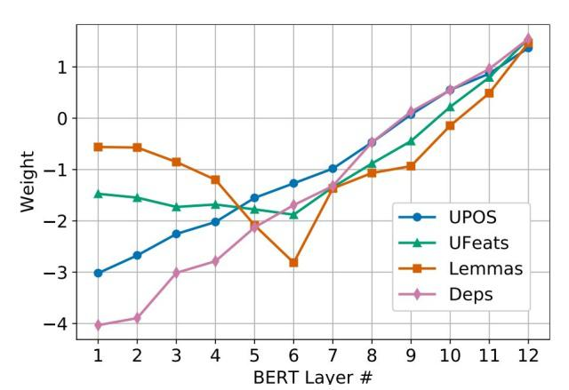

为避免过于依赖某层，还加入 Layer Dropout，训练中随机会不用某层输出。

结果在依存任务上超过之前 SOTA，其他任务达到匹敌程度。还有在低资源 finetune 的结果提升最明显。

**双句分类 + 问答**

还有些论文可能一个标准法不够，所有拿两个同时进行，其实也可理解为一种多任务学习。

A BERT Baseline for the Natural Questions

主要针对谷歌自己的 Natural Questions 数据集，给出相应的 fintune 方法。

Natural Question 数据集，也是个问答任务，简单介绍就是 query 会是 google 搜索时的 query，而答案可能在给出的相关维基百科页面。其中问题分好几种答案，long，short，yes/no，还可能没答案。

其实它这里的做法和原论文中的问答比较像，不过增加了问题分类环节。将页面文档分成多个片段，和 query 拼接，然后同时对几个问题，用 [CLS] 进行预测问题种类，而其他 token 的位置预测所在范围，最后将一个大页面中的所有片段的分数排序，挑出最高者。

**单句分类 + 标注**

这篇来自达摩院。

BERT for Joint Intent Classification and Slot Filling

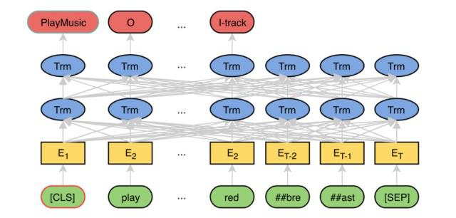

其实很简单，就是在最上面一层直接拿两个任务进行 finetune。Finetune 时用多任务，也就是 joint 训练。[CLS] 对 Intent Classification 进行预测，而其他的 token 则对 Slot Filling 预测标注。

**火力全开**

既然可以两个任务同时进行多任务 finetune，那能不能把四种标准法都用上进行 finetune 呢。当然可以。

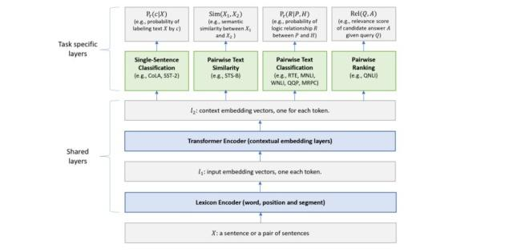

Multi-Task Deep Neural Networks for Natural Language Understanding

这篇来自微软的 MTDNN 就是先 pretrain，然后拿 GLUE 数据集中的任务同时进行 finetune，最后发现多任务对性能的帮组。

关于详细如何训练，可参考论文。

Finetune 之花式

这里会介绍一些用到异于上述标准 finetune 法的论文，因为方法各异，故冠名花式。

Fine-tune BERT for Extractive Summarization

这篇将 BERT 用于抽取式文本摘要，主要是选择性抽取文本中的句子作为最后的摘要。这个任务最大的问题是如何获得每个句子向量，然后把向量用于二分类，判断去留。而 BERT 原模型只能生成单句的句子向量，或者句子对的。

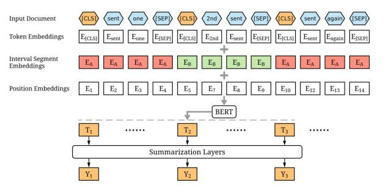

于是，作者们的第一个改进是，简单粗暴地将文档中每句话前加 [CLS] 后加 [SEP]，然后输入 BERT，而每个 [CLS] 对应的位置就是每句的句向量。

为了进一步增加句之间的互动，作者们又在 BERT 之上加了一层 Transformer 的 Summarization Layer，只输入每个 [CLS] 的向量，最后输出预测当前句是否保留，finetune。

Utilizing BERT for Aspect-Based Sentiment Analysis via Constructing Auxiliary Sentence

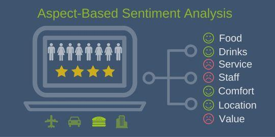

该篇中了 NAACL2019.

用于基于方面 (aspect) 的情感分析（ABSA）任务，主要通过构建附加句，将 ABSA 任务转换成了句子对分类任务。方法和最早看 GPT2 非监督一样，出奇简单，却有效。

虽然之后 finetune 过程和标准法里的双句分类相似，但因其构建下句的方法特别，所以拿到花式来讲。

具体做法是，通过把原句作为 BERT 上句，然后人为构建下句，分四种情况（假设句中方面用 [ASP] 而其对应分类为 [C]）：

QA-M：在句后加上 " what do you think of the [C] of [ASP] ?"NLI-M: 在后面加一个 "[ASP]-[C]" 的拟句QA-B: 在后面加肯定句 “the polarity of the aspect [C] of [ASP] is positive”，转换成二分类任务NLI-B: 同样在拟句后面直接加标签 "[ASP]-[C]-positive"

之后用在这几种方法分别在 BERT 上进行双句分类 finetune，然后比较结果。结果是在不同评估指标上各有优劣，详见论文。

Conditional BERT Contextual Augmentation

这篇比较好玩的是，不像之前论文是拿词向量进行一些修改，而是拿段 (segment) 向量进行修改。

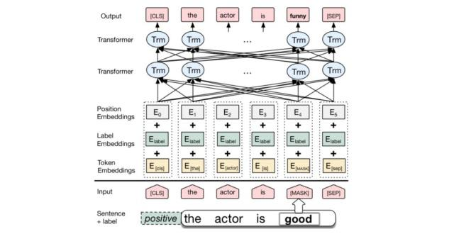

作者的做法是将 BERT 原有的 segment 向量替换成 label 向量，然后用单句分类任务进行 finetune。比如说可以根据情感识别里的标签，positive 或 negative 来作为 label。

最后通过将 positive 的向量替换成 negative，或者反过来，输出预测结果，进行数据增强，这样子它就会只替换情感最强烈部分让意思反过来，而大体结构不变。该研究与文本的风格迁移也相关。

VideoBERT: A Joint Model for Video and Language Representation Learning

最后拿这篇来自 BERT 东家谷歌我心目中觉得最棒的来压轴吧。

这篇通过用 BERT 在语言和视频多模态上进行 finetune，学习了视觉和语言之间的联系。

数据利用了 Youtube 的烹饪类视频（因为语言与动作更吻合），文本信息用 ASR（语音识别）自动生成，而视频用 Vector Quantization （矢量量化）来表示。特别值得指出的是这都是无监督的。

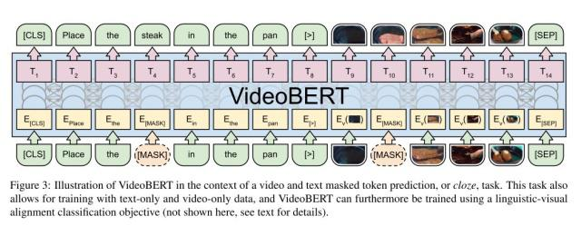

首先，用 ASR 获得的文本作为 BERT 输入的上句；之后，再对视频特征向量进行 tokenize，作为下句；最后用最初的 [CLS] 来判断是否文字与视频一致。

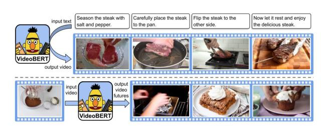

***\*岗位详情请戳：\****

## 作者最新文章[新冠或致个人年内死亡率翻倍！哥大校友用机器学习飞速筛选抗体](https://mbd.baidu.com/newspage/data/landingsuper?context={"nid"%3A"news_10305820786185493728"}&n_type=1&p_from=3)[国外小哥为遛狗出动无人机，法国派遣去广播，只有中国用来消毒！](https://mbd.baidu.com/newspage/data/landingsuper?context={"nid"%3A"news_10009884770436669090"}&n_type=1&p_from=3)[挑战马斯克Neuralink！斯坦福全新脑机接口，直连大脑和硅基芯片](https://mbd.baidu.com/newspage/data/landingsuper?context={"nid"%3A"news_9681828867511874417"}&n_type=1&p_from=3)

## 相关文章

- ### [“瘦身成功”的ALBERT，能取代BERT吗？](https://mbd.baidu.com/newspage/data/landingsuper?context={"nid"%3A"news_9677105623357854361"}&n_type=1&p_from=4)

  

- ### [复旦邱锡鹏超全NLP预训练模型综述论文：两张图带你梳理完整脉络](https://mbd.baidu.com/newspage/data/landingsuper?context={"nid"%3A"news_9936700881392759619"}&n_type=1&p_from=4)

  [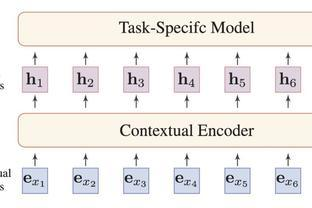](https://mbd.baidu.com/newspage/data/landingsuper?context={"nid"%3A"news_9936700881392759619"}&n_type=1&p_from=4)

- ### [已撤资830亿美元！新兴市场面临有史以来最大规模资本外流](https://mbd.baidu.com/newspage/data/landingsuper?context={"nid"%3A"news_9011803412263243512"}&n_type=1&p_from=4)

  

- ### [日媒：避免与北京冬奥冲突，东京奥运推迟时间不会超过一年](https://mbd.baidu.com/newspage/data/landingsuper?context={"nid"%3A"news_8283459271731394577"}&n_type=1&p_from=4)

  

- 