## 如何科学评价对话系统

首先我们思考一个问题：人为什么需要对话？第一种情况，我要借助其他人的能力帮助我完成某件事情，那我就需要通过信息的正向传递来让其他人了解我的意图，这种情况我们通常称为任务型对话；第二种情况，我们希望从别人手里获取知识，信息反向输入，这种情况通常属于问答型及推荐型对话；第三种情况，我们并没有明确的目的，只是希望随机的交换一些信息，这种情况一般被归类为闲聊。的确对话系统也一般被分为以上三大类来实现。还有一些其他分类标准，把问答型也归类到任务型对话中，因为有部分底层技术比如知识图谱等在一定程度上是相通的，而且对知识的查询本质上也是一种任务。

要更好地评价对话系统，那么就需要对其实现逻辑有个基本的了解。对话系统本质上分为三个大的模块，首先是**自然语言的理解（NLU）**，然后是**回复的生成（NLG）**，最后是**对话管理（DM）**。

首先我们来了解自然语言理解部分。

我们可以从人类的角度出发思考，一个人理解一句话是怎样的过程？对于单独的一句话，我们需要对其本身做理解，会尝试提出主干部分，来搞清楚这句话的意图到底是什么，比如“我想听刘德华的冰雨”，我们会根据“听”和“冰雨”的上位词“音乐”，来判断意图是要听音乐。在实际应用场景中，意图有很多分类也非常复杂，对于稍微大一些的任务型对话系统，能够细化分类的意图可能会成百上千，因此一般情况下会分为领域识别加意图识别两个步骤来做，本质上相当于一种剪枝策略。

有了意图之后我们会找出query中的关键词，在上述例子中，歌手是刘德华，歌曲是冰雨，这样我们就可以去资源池中找到对应的资源了。不过有很多情况下我们还需要依赖上下文信息，比如“我还想听他的忘情水”，这里面的“他”到底指代的是谁就需要参考上下文的情况来完成。还有环境因素也是重要的参考，比如“我想听他前两天演唱会唱过的歌”，这里就需要通过环境因素找到前两天刘德华演唱会的内容。

那我们用机器来实现该如何做呢，首先单句的解析模块是必须要有的，还有上下文管理的模块，需要时刻记录更新当前上下文中出现的关键信息，此外还有环境查询模块，如果问句中需要查询有关环境的内容，就需要环境查询模块来提供答案，最最关键的，需要一个决策模块，负责把所有的信息整合起来，输出最终的决策结果。通常而言，自然语言理解部分会有多个可能的解读返回，通过到各个子服务模块来获取结果，最终在生成阶段来选择最优的结果输出。

接下来我们来了解自然语言生成部分。

我们已经理解了提问者的意图之后，就需要给他一个满意的回复。为了组装正确的回复，我们有时候还需要到各个子服务中得到我们需要的资源，比如音乐服务中的音乐播放地址，天气服务中的天气信息，因此子服务群这个模块是一定需要的。此外，我们要组装回复，自然需要回复生成模块来完成结构化信息到自然语言的转化。目前而言大部分对话系统都是检索式的回复策略，生成式模型存在一定的可控性风险，而且不能保证生成的自然语言完全合理，大部分产品还是不太愿意启用。

对于闲聊和一些简单的问答的实现方案，通常是不太需要自然语言理解的模块，只需要一个检索引擎能够从预先准备好的qa对中找出合适的答案即可。生成式的模型，一般也是通过end2end的模型来直接获取最终的回复结果。因此关于闲聊和简单问答，我们直接归到自然语言生成部分。

关于推荐型的对话，通常是机器更为主动一些，猜测用户需要的信息，然后跳过自然语言理解直接进入自然语言生成部分。比如，“最近有新上映的电影XXX，您要不要看看“，只需要等待用户一个肯定或者否定的应答就可以继续下一步的操作。

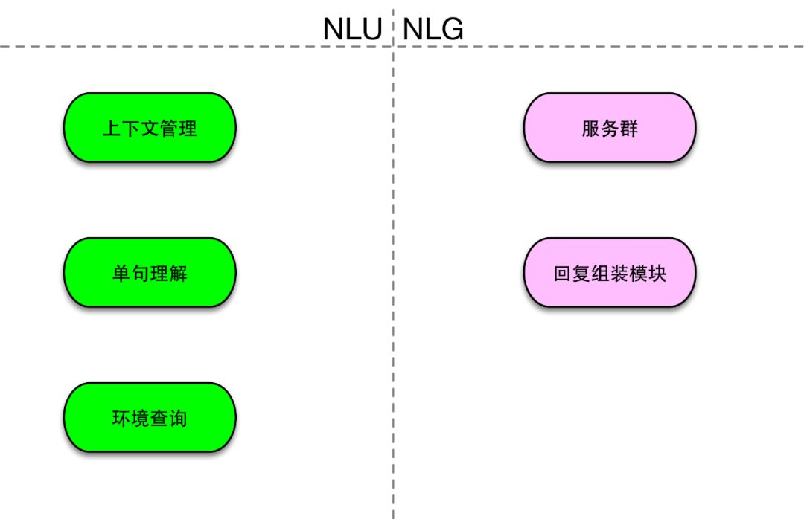

对话管理模块贯穿在NLU和NLG之间，为NLU和NLG提供信息支持，在NLU的上下文管理模块和环境查询模块中都起到了至关重要的作用，同时也在NLG中的回复组装部分中扮演重要的角色。对话管理模块主要关注的是多轮对话场景下的理解和回复能力。

针对基本的对话系统，我们的评价工作也会集中在两个方面来评价：对自然语言理解的准不准；生成的回复好不好。具体下文开始详述。

## **2、自然语言理解能力的评价指标**

针对自然语言理解，我们要评判的主要有单轮请求中的领域意图识别和槽位填充两个能力，和多轮请求中的领域继承，指代消解等相关能力。

### **2.1 领域识别能力**

领域识别是意图识别的第一阶段，抽象来看领域识别本质上是个多类分类器。经验而言，多类分类器一般都可以用softmax层来计算概率分布。然而在领域分类场景下确有所不同，不同领域的空间分布不尽相同，而且领域中存在一个其他领域，分布更是非常零散，因此用softmax分类器会有所不妥。还有一个主要原因是，一句话有可能存在多个领域，比如”给我放个三生三世“，有可能是音乐领域，也可能是视频领域，合理的方案是将二者都输出，如果用softmax来做会导致概率分布的失衡。因此领域分类，比较合理的方案还是通过sigmoid来对每个类型给出其概率，然后按照阈值向量来输出领域分类的结果和具体的概率值。

我们要判断识别的领域是否正确，那就需要一套标注标准。我们采用了多人交叉验证的方式来做人工标注，即每一条语料都会通过两人的交叉标注，当两人标注不一致的时候，将人群基数扩大到10人来标注，最终保留标注分布占比。

传统分类器的指标一般以准确率/召回率/F1为分类性能指标输出。我们对指标做了一些精简，简化为通过率(Passing Rate, PR)，每个领域的通过率就是我们考量在该领域下的落域能力，本质上就是只看召回情况。那么做了简化之后实际上会带来一个问题，准确率没有直接考量，那么我们通过设置一个non-task的领域来表示其他领域，从而给出non-task域的通过率，即可从侧面反映出准确率的指标。本质上如果想计算准确率也是可以的，只需要将其他领域中误分到目标领域的case数量加起来即可。

如果系统的predict也存在多个选项，那么宽松一点的判断方式就是只要其中一个在我们的标注中，就认为通过。严谨一些的，就看是不是等于predict的第一个，并且标注的结果都否包含在系统输出的结果之中。

Predict 单输出的场景：

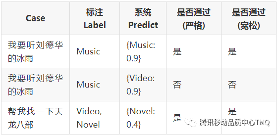

Predict 多输出的场景：

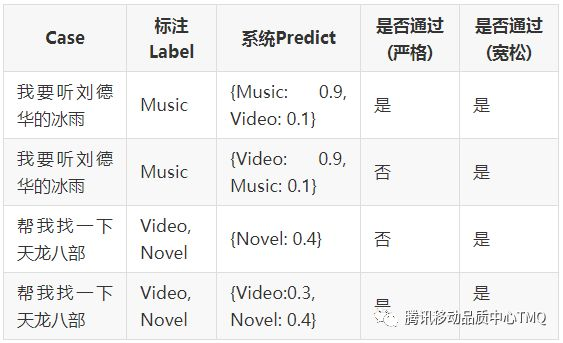

### **2.2 意图识别能力**

意图识别紧接着领域识别之后，跟领域判断有所不同，意图主要是确定用户希望执行的动作，比如”我要听刘德华的冰雨“，领域是音乐(music)，意图是播放(play)。不过和领域一样，意图的识别也是一个分类任务，因此判断指标和领域基本相同，我们依然采用通过率(PR)来刻画意图分类器的能力。

Predict 单输出的场景：

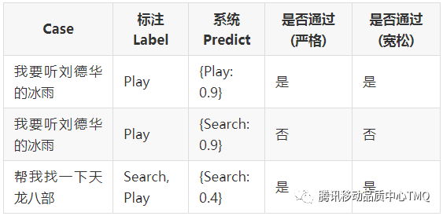

Predict 多输出的场景：

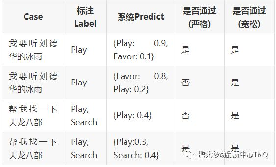

**2.3 槽位填充能力**

每个意图下，都存在着待填充的参数，我们可以通过抽取query中本身存在的参数，将待填充的模板补充完整，然后就可以获取到相应的服务。如果必填的参数没有完成填充，还可以通过追问等方式来进一步补充，就涉及到多轮对话的评测，后面会专门讲解。

针对槽位填充能力，自然就是看从query中抽取的参数是否正确、是否完整。在我们的通过率指标体系中，认为提取的完整即为通过，对多提取出来的参数则忽略处理。主要原因在于填槽操作中，只会将需要的槽位参数填进去，对于不需要的参数会自动忽略，因此我们在此处的判断中只判断召回的完整性。

正常情况下，拿到领域意图和槽位填充的结果，就已经完成了基本的NLU步骤，然而我们要从评测的角度来看待整个系统，那就需要考虑到所有的边边角角，将所有现实世界中可能面对的情况都考虑到，并且给出评价指标。

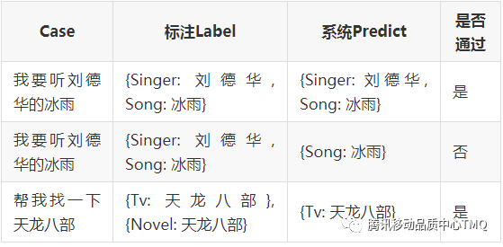

### **2.4 语义容错能力**

由于用户本身的发音不标准，并且业界目前的语音识别(ASR)水平亦存在瓶颈，很多带有语音识别模块的对话系统都面临同样的问题，就是ASR识别带来的错字错词情况，基本上句错率超过10%是家常便饭，因此对一个对话系统的容错能力的评价是非常必要的。

如何评价一个系统的容错能力呢，我们首先对错误类型做出分类:

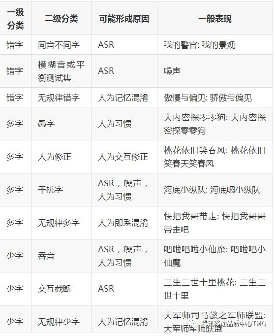

以上错误可以发生在实体中，也可以发生在非实体中，这两个难度是截然不同的，我们也应当分别来建设评测数据集。针对评测指标，也很简单，只要系统存在纠错组件，并且在NLU结果中提取的槽位是完成了正确纠错的，我们就认为该case是通过的。

除此之外，还有一些query本身是不应该纠错的结果被系统误纠错，称之为误纠率。评价误纠率需要一些不需要纠错的负例来作为评测集，转化为通过率就是在负例中，没有纠错动作的就认为是通过。

### **2.5 同义词转换能力**

除了容错之外，还有一个很重要的能力就是同义词的容忍能力。在实体层面，比如”我要看复联3“中的”复联”是“复仇者联盟“的简称，那么我们就需要在NLU部分把它转化回来。在非实体层面，”我要听最近比较火的歌曲“，那么”最近比较火“本质意思为”热门“，在NLU的部分有必要将其映射到标准词汇上。

如何评测这个方面的能力呢？我们需要特殊建设一批数据集，具体类型如下：

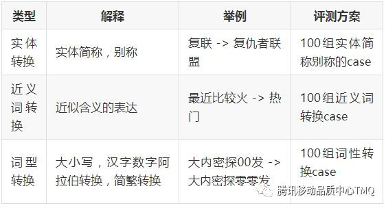

同样为了测试误转换情况，所以同样需要一些负例来给出误转换率。

对于整个NLU部分而言，如果把实体转换放在这一步来做，就需要大规模的实体库和转换映射来支持，本质上来说会给NLU系统来带很大的复杂度。因此有一些系统会选择把实体转换的支持透传到服务层面来解决，”复联“映射为”复仇者联盟“这类知识会在视频服务这一环节来完成，这样会让NLU的规模保持一个通用化的小规模，而让服务层面来承担这部分能力。

### **2.6 逻辑门支持能力**

谈到逻辑门，简化来说就是”与或非“，所以只需要按照与或非的方式来构建评测语料即可。

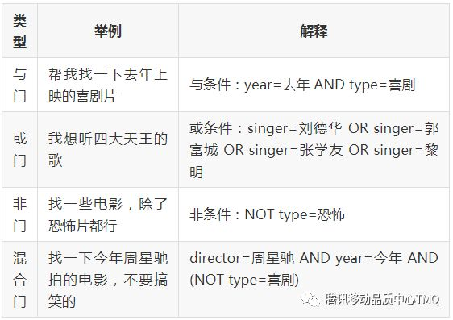

在通过率体系下的判断逻辑，根据具体 NLU 输出的格式来判断。

### **2.7 条件假设支持能力**

条件假设的情况主要指执行任务之前存在前提条件，比如”如果明天下雨，提醒我带伞“，前提条件是”明天下雨“，只有满足前提条件的时候才会执行相应的任务。

针对条件假设能力的评测比较困难，因为从NLU的结果上来看是不一定能体现出服务是否正确执行的，因此我们可以拆解来输出两个指标，一个是NLU部分是否能够把前提条件转化成固定格式而非丢弃，另外一个则从端到端的指标上来看是否真正能够按照要求完成条件假设的任务。

### **2.8 高阶问法支持能力**

高阶问法的定义在于查询中需要嵌套子查询来递归求解，比如”我要听陈小春老婆唱的歌“，就需要首先求解出陈小春的老婆是应采儿，然后再查询应采儿唱过的歌，属于二阶查询。更复杂的还有三阶四阶，不过实际使用场景中，很少有用户会这么发问。

对于高阶问法的实现，是需要拆解步骤的，一般可用递归思路来求解，首先我们可以提取出 singer=陈小春老婆，然后我们再通过问答服务的知识图谱提取三元组（陈小春，老婆，应采儿），就可以在NLU部分最终给出 singer=应采儿 的结果。上文所述的”四大天王“的例子本质上也是一个二阶问法，不过很多系统会借助简称别名来简化一部分高阶问法。

此外，还有一种多领域联动的情况，本质上可以看做是高阶问法的一种泛化，比如”帮我建一个明天C罗比赛的提醒“，首先需要在体育赛事中查找”明天C罗比赛“的时间点，然后再建设一个查询到的时间点的提醒。

### **2.9 多任务支持能力**

多任务的情况也是比较复杂的，但是在实际使用场景中却是经常会遇到，比如”我想知道本赛季梅西和c罗进了多少个球“，其实是包含两个任务的：梅西的进球数+C罗的进球数。由于初始设计的原因，很多系统基本上只会提取到其中一个参数从而只给出其中之一的执行。更复杂一点的有”帮我播放音乐并将声音调到5“，存在着两个不同的意图。

我们要评测多任务的支持能力，在输出的格式上是需要一定改进的，在NLU部分是需要以list形式给出的，并且是与的关系并非概率关系。在验证支持情况的过程中，就需要判断是否能将多个任务的参数和意图都完整提取出来。

### **2.10 方言口音支持能力**

方言对语音识别部分是一个巨大的挑战，但是由于方言本身带来的发音不标准以及习惯性说法在语义层面也会带来不小的挑战。举个例子，川渝口音通常说”第二个“的时候会说成”第二一个“，在很多对话系统中是无法支持到的，给用体验造成了不小的影响。因此我们需要构建一批各地方言和习惯性高频说法来针对方言和习惯性说法做出科学的评测。

------

这里需要说明一点，上面有一些指标是系统返回的中间结果支持，那么如果要针对性的评测竞品，该如何知道这些中间数据呢？要做到完整评估肯定是非常难的，但是我们可以通过一些专业性的分析来预估竞品的中间结果，比如我们问“我要听荷塘春色”，bot回复“没有找到这首歌曲”，说明至少落域这个环节是对了，如果回复“我没有听懂”，那基本上就可以断定落域的步骤就没有完成。要完整这种断言分析需要培训一些专业的标注人员，成本还是有一些高的。

## **3、自然语言回复能力的评价指标**

自然语言回复的部分包含的模块主要有服务查询部分、自然语言组装部分和对话管理中的追问模块。我们要关注的评测点有两个方向，一个是任务是否顺利完成，另一个是回复的质量是否令人满意，在评测回复能力的时候，前提假设NLU部分的结果完全正确。

------

首先关于任务型对话系统的评测，我们首先需要保证任务顺利完成，评测时机在于一个完整的对话session，并且在其中涉及到执行的阶段都进行评测。主要关注的指标如下：

### **3.1 任务型-任务完成能力**

判断一个任务是否完成可以近似看做是客观任务，需要通过人工标注来验证是否给出了符合预期的结果。比如”我要听林志炫的浮夸“，结果本来在曲库中存在林志炫的浮夸结果却播放的是陈奕迅的浮夸，就不能算作完成任务，因为在系统的能力范围之内没有满足用户的预期。但是”我要听刘德华的浮夸“，播放了陈奕迅的浮夸就没问题，因为刘德华本身没有唱过浮夸，用户的预期本身是一个假命题。再比如，”放个欢快一些的音乐“，什么是欢快的音乐本身界限就不是很明显，而且每次推荐的音乐又不尽相同，要准确判断是否满足用户预期是一件很难的事情。

任务是否完成看起来是个简单的判断，实际上充满着模棱两可的判断逻辑，并且存在一些主观性，要给出完善的任务完成判断标准，还是需要一份复杂的判断逻辑表的。举一个具体的例子：

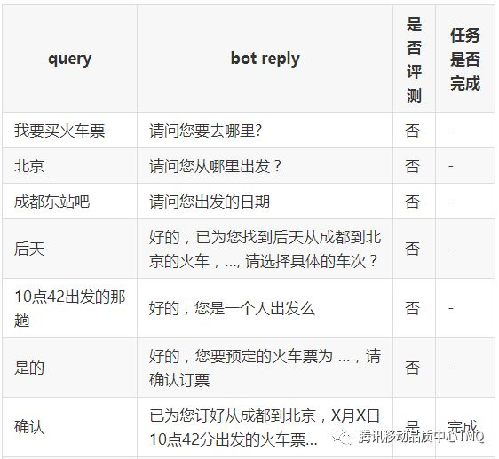

综上，上述对话中有两个任务，完成了一个。根据这种评测方案来测算最终的任务完成率。

**3.2 任务型-任务完成代价**

任务完成是存在代价的，其中最常用的指标是完成任务所需对话轮数，在上述的例子中，两个任务分别的对话轮数为7轮和6轮，不过对话轮数一般只看任务完成的情况。

对话轮数作为评测指标依然存在误差，比如当bot选择同时问“您是要订从哪里到哪里几点出发的火车票”，用户很可能一次性会把三个槽位都返回来，那么对话轮数就会短很多，其实用户体验方面并不太友好。

不过单次对话轮数的评价方法依然存在很大的不确定性，我们可以考虑引入蒙特卡洛模拟方法来刻画系统在当前这个任务下的价值函数。比如我们可以设置一个虚拟用户，存在一定的概率返回某些确定的答案，也会有较小概率返回不合理回复，那么我们可以通过N次模拟策略执行，拿到平均对话轮数，这个值的准确性比单次的模拟效果会好很多。

### **3.3 任务型-资源覆盖率**

众所周知，我们要完成任务型的对话，背后需要依赖各个领域的资源支持，比如叮当的音乐服务来自qq音乐的支持，视频服务来自腾讯视频的支持，有了多个服务小伙伴的强大后盾，叮当才能具备完整的任务服务能力。

不过，任何资源站都不能覆盖世界上所有的资源，存在各种版权以及收录成本的问题，所以对资源覆盖率的评测也成为了对话系统服务能力的一个重要体现。

我们的评测方法也比较简单，评测集分为两种：第一种属于离线评测方案吗，方法为找到多个不同的数据源，然后随机抽取其中的数据加以重组形成我们的评测集合；第二种为在线评测，也就是直接将线上数据中出现的资源都标注下来，作为真实用户的评测集，以此来计算资源覆盖率。

------

上述是任务型的一些指标，针对问答型的对话，从实现方面有两种，一种是通过知识图谱来构造的，SPO三元组结构，一种是直接通过问答对来建设的索引。因此我们需要关注的指标有：

### **3.4 问答型-图谱-三元组提取能力**

针对知识图谱型的问答，一般都是通过三元组提取来作为中间结果，然后组装sql来查询知识图谱的。那么评价三元组提取的准确程度也就成为了对中间结果的度量手段。三元组的形式大致如下：

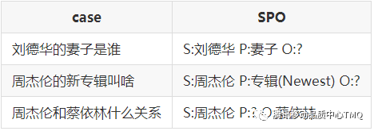

评价中，我们简单的取三元组提取的准确率作为衡量指标即可。

**3.5 问答型-问答对-检索能力**

对于问答对类型的问答，我们需要评测是问题检索的能力，包含了检索准确性和问题覆盖度的评价，这里一般可以通过系统输出topN结果来作为评测的方法，我们的评测表达如下：

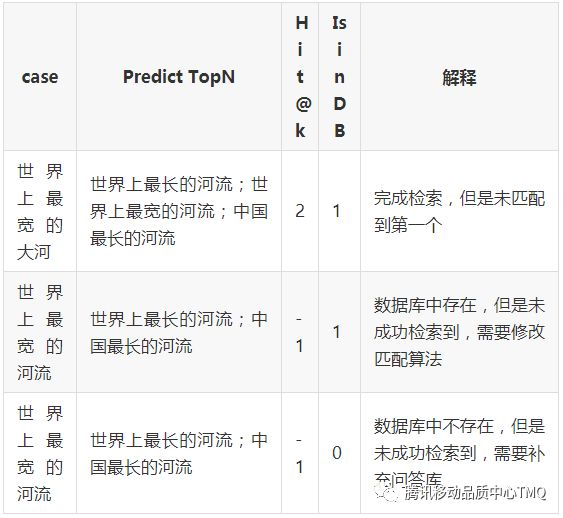

在评价过程中，我们可以将检索能力提取到两个指标中：一个是检索本身的准确程度，以 hit@K 为指标；另一个是问答库的覆盖度，以资源覆盖率作为指标。

**3.6 问答型-信息准确率**

所谓问答，自然最核心的一点就是保证问答的准确性，因此要做好评测，还是需要创造一批具备正确答案的评测集合，这个收集成本自然要更高一些，需要跟系统本身所用的知识图谱不同源，并且还得手动验证一遍其准确性。实际评价中依然采用通过率来评价问答系统的信息准确率，只有满足答案完全准确才算作通过。

------

对于闲聊的评测在学术界和工业界都是一个很有挑战的课题，我们目前所采用的主要是相关性评价方法。

### **3.7 闲聊型-相关性评分**

相关性评分主要有3分制和5分制，相对而言判断1-5分的主观性非常大，因此我们采用了3分制来判断，评判标准为：

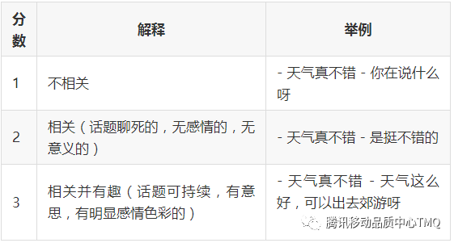

### **3.8 闲聊型-对话持续轮数**

相关性是针对单轮对话的评价指标，那么一个好的闲聊的概念是什么呢？有一个很简单的衡量标准就是，在真实与人对话中，对话持续轮数越长越好。这就对闲聊的开发有两个要求，一个是基于当前话题能够不断提问和回答或者发表见解并且保持足够高的兴趣，第二个就是当前话题词穷的时候能够提出新的话题。

## **4、对话管理能力的评价指标**

对话管理部分在对话系统中承担贯穿主线的任务，通过对上下文的记录，用户画像的提取，环境因素的解读，对自然语言理解提供丰富的信息来更好的理解用户意图。

评测对话管理能力需要一个完整的对话session，并且有很大可能还需要一些背景环境知识依赖。

### **4.1 槽位补充能力**

槽位的补充是多轮中非常重要的一种情况，指的是在任务的执行过程中缺少某些信息，就需要通过反复的提问和确认来补充必须的槽位。最常见的例子便是订票：

除了通过对话来获取，还有一些槽位是包含默认值的，可以从环境因素中获取，比如导航场景下说：“我要去东大街”。实际上环境因素中的位置服务会默认将用户当前的位置填充到出发地的槽位中。因此无需进一步确认就可以给出用户当前位置到东大街的导航线路，其中交通工具和路线偏好也都从默认值中加载。

还有一种槽位填充的方式是通过用户本身的信息，比如“我要回家”，其中“家”要转换成目的地，就需要通过用户信息查询的服务来判断用户的“家”具体指的什么poi地点。我们通常会将用户信息抽象为显式的用户画像，跟用户画像服务放置在同一个存储逻辑中。

那我们继续来说填充能力如何评测，首先第一要素就是针对一个特定任务，是否能通过询问来将槽位补充完整，并且补充到正确的位置。这并不是一件简单的事，因为用户的回答不是机械的，存在很多不确定性，比如如下是一个做的很差的系统错误的填充样例：

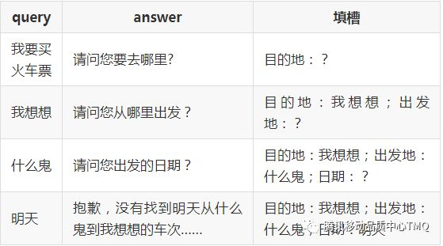

**在这个case中，两个槽位填充错误，导致任务未能顺利完成，在评测中记录为session未通过。****在离线过程中，我们通过模拟用户来测试槽位填充能力，模拟用户会有多种不同的回复方式，也就产生了不同路径的蒙特卡洛树，我们如果控制分支数量不会太多的时候可以遍历来评价槽位填充能力，如果分支太多，也可以参考蒙特卡洛方法来做指标输出。**

**4.2 槽位修改能力**

我们说完了填充，很快就会想到，要是槽位填错怎么办？这里就涉及到槽位的修改逻辑，还是上文中的case，我们来看好的系统和差一些的系统的不同表现情况：

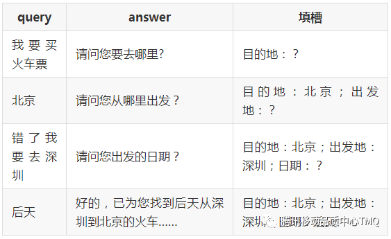

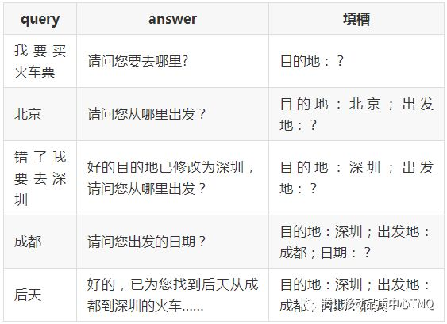

孰优孰劣显而易见，不过涉及到槽位修改能力的评价，却充满挑战，如何能够最大限度的反应系统修改槽位的能力？那么就需要在多轮的每个环节都需要创造类似的主动修改槽位的回复，这些数据因为在实际线上也不会特别多，要收录下来也实属不易。

上面这个例子属于比较简单的直接修改，还有一种情况是滞后修改，就是再补充了很多槽位之后，突然提出修改之前的某个槽位，中间可能已经间隔了好几轮对话，这种对语义理解能力是一个很大的条件，需要完整的识别用户的意图到底是修改哪个槽位。

指标计算这里比较简单，依然采用通过率体系，完成了正确的修改记为通过，否则都属于不通过。

### **4.3 领域意图继承能力**

在真实使用场景中，对话中的很多情况是非常依赖上下文才能理解的，比如“下一个”，在播放音乐的意图下指的就是下一首，在讲笑话的时候就是下一个笑话，播放视频的时候就是下一个视频，不同的上下文有不同的理解。因此领域意图继承能力是一个好的对话系统必须具备的能力。

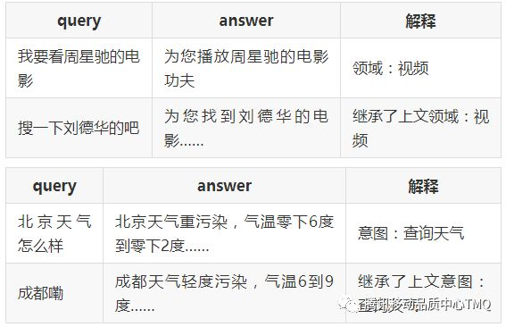和槽位填充不同的是，槽位继承往往是产生一个新的任务，只是继承了上文的一些信息作为默认值，针对领域，意图，槽位都可以完成继承。

那么如何评价槽位继承能力呢，我们依然需要构建一批专业性的语料来完成继承能力的评测，判断标准就是是否能准确落到我们预期的领域和意图中，以及槽位的继承是否准确，这部分语料更为稀缺，因此需要做的小而精。

### **4.4 指代消解能力**

指代消解是自然语言处理中的常规任务之一，也有很多方法可以实现，简单一些的规则匹配，复杂一些的深度学习的方法，都可以达到相同的目的。

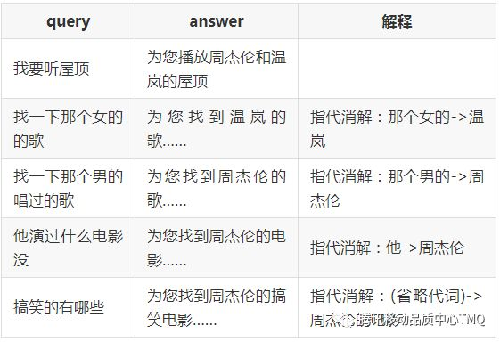

最简单的指代消解方法就是将第三人称代词替换成上文中最后出现的响应的主语。显然仅仅做到这一点是完全不够的，指代代词形式变化多样，甚至可以是省略形态，而被指代的对象也是多种多样，可以指人也可以指物品。要完整的评测指代消解能力，需要非常大的测试集，因此我们将选取一些典型的指代消解形态，并借助半人工的方法过滤出一批，作为指代消解的评测集。

指代消解的实现中，通常会在最终语义结果输出的前一步完成，可以在槽位抽取之前也可以在之后。针对指代消解的评测，我们也在槽位抽取阶段来评判，核心指标依然是通过率，不过我们会在case分析阶段转化为两个阶段的结果，首先是是否完成指代，然后是指代结果是否正确。

### **4.5 意图暂时跳出支持**

意图的暂时切换是多轮对话场景中非常常见的一种情况，通常在对话过程中会穿插一些其他的意图，然后需要切换回来。

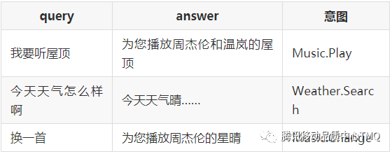

上述例子是一个典型的case，人来理解会比较简单，几乎可以肯定用户希望换的是歌曲而不是天气。但是让模型来判断到底需要继承的是哪个意图，却是一件不那么容易的事情。一般的方法会尝试继承前N句的结果，然后通过概率计算来rank，取最可能的意图继承结果。在这里，位置优先级、当前query领域概率、继承关系概率形成了三个主要的参考因素，具体取舍可以通过调整权重来实现。

关于评测，我们可以通过在正常的连续对话中，穿插一些单轮的需求来建设评测数据集，以此来评估意图暂时跳出的返回能力。

### **4.6 增值评测指标**

对话系统属于自然语言处理领域中的应用层，基本上包装包装就可以当做产品输出，那么用户体验也就成为了一个非常重要的评测指标参考。基于用户体验层面的考量，我们设计了一些可以一定程度上反映用户体验的指标，称为增值评测指标。

#### **4.6.1 个性一致性评测**

对于一个合格的智能助手，我们都希望它越像人类越好，那我们就需要赋予它一个合理的个性设定。个性层面目前市面上看到平安机器人安安算是一个典型的“有个性”的代表。那我们怎样衡量一个智能助手“有个性”呢？

首先是个人的信息必须保持一致，比如设定为女性角色，然后在聊天中又说自己只是个小机器人，这就有些不符合个性设定。

还有一个就是回复语气的一致性，尤其在闲聊中，因为很多语料来自不同的人撰写，很容易出现性格不一致的情况，偶尔感觉是个萌妹子，偶尔又像是个调皮的小孩。这种在用户体验上会打折扣的。

#### **4.6.2 回复惊艳程度**

无论是闲聊还是任务完成过程中的语言组织，如果都是干巴巴的“已为您找到XXX”这种机械化的回复，在用户体验上还是不能达到非常理想的标准，那么如果通过回复的语言本身来让用户感觉自己是跟一个真实存在的人在交谈，也是对话系统产品中需要考量的一个重要因素。

具体如何设定指标呢？我们依然采用人工评分法，取3分制，可以如此定义：

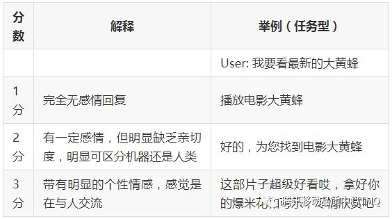

**涉及到人工评分，总会存在判断误差，因此条件允许的话，最好采取多人标注取均值的方法。**

**4.6.3 延续对话能力**

延续对话的需求需要分两个不同场景来区分，在任务型的对话场景中，如果可以顺利完成任务，那就不需要延续对话，如果未能完成任务，那就需要通过相近的推荐来让用户获取相近的信息：

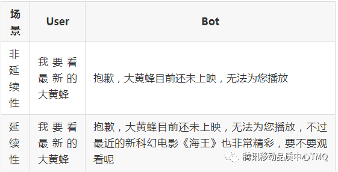

在闲聊型的对话场景中，延续对话能力是非常重要的，因为在闲聊的评价指标中，如上文所述，对话持续轮数也是一个常见的指标，因此这部分的衡量将在闲聊型对话场景中考虑。

## **5、 总结展望**

### **5.1 业界对话系统的评价回顾**

对于任务型对话系统的评价，实际操作中发现对话系统的成功率和对话的长度基本可以说是最重要的两个指标，后来的研究也往往将最大化成功率与最小化对话长度作为任务型对话系统评测的指标。后续的各种评价方式大致也分为三大类：1)通过构造某种特定形式的用户模拟系统进行评价;2)人工评价; 3)在动态部署的系统中进行评价。

关于开放域也就是闲聊的评价，客观指标有 BLEU、METEOR、ROUGE，还有Embedding-based 以词向量本身的语义距离来衡量的指标，后续也有基于GAN的评价结构，基于RNN的ADEM等基于机器学习的评价模型。

具体的内容请参考对话系统评价方法综述，本文不再赘述。

### **5.2 对话系统评价的未来考量**

关于对话系统评价的未来，我个人认为依然会以人工评价为主，机器评分作为辅助拟合的方案来进行。毕竟当前NLP还是学术界工业界的最大难题之一，加上神经网络深度学习的发展也逐渐趋缓，要针对对话系统本身提出科学合理又近乎完美的指标几无可能，所以人工评价方式依然是未来的评价主流。

不过未来的研究依然有一个很挑战的课题，那就是如何借助机器学习的力量，在可接受的误差范围内，尽可能减少人工评判的成本。这一点，将对NLP相关的学术研究和工业生产起到至关重要的作用。