BERT 等模型的进展已让 GLUE 基准在新模型的评估方面日渐乏力，为推动 NLP 技术的进一步发展，有必要对 GLUE 指标进行更新。为此，纽约大学、Facebook 人工智能研究所、华盛顿大学和剑桥大学的多名研究者联合整理发布了 SuperGLUE 基准，其中保留了两项 GLUE 任务，另外又加入了其它五项新任务。相关工具包和数据集将于五月初发布。

GLUE 基准与 SuperGLUE 发布地址：https://gluebenchmark.com

论文：https://w4ngatang.github.io/static/papers/superglue.pdf

过去一年来，机器学习模型在 NLP 领域很多语言理解任务上的表现都获得了极大提升。Elmo、BERT、ALICE、之前被称为 BigBird 的模型（现在叫做 MT-DNN）都取得了显著进展，OpenAI GPT 也有一种非常有效的方案，即将用简单的多任务在大量文本数据集上预训练的语言建模方法与将所得模型适应到下游应用的迁移学习技术结合起来。

一年前发布的 GLUE 是用于评估这些方案的一套基准和工具包。GLUE 是九种（英语）语言理解任务的集合，包括文本蕴涵、情感分析和语法判断等。其设计目的是覆盖足够大的 NLP 领域，以使得只有开发出足够通用的工具，才能在这一基准上表现良好；这样也有助于解决未来可能新遇到的语言理解问题。

**基于 GLUE 基准的进展**

在 GLUE 基准上表现最佳的模型已经非常接近人类在这些任务上的水平：

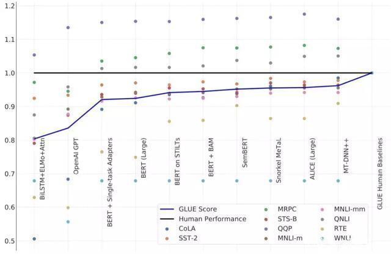不同模型相对于人类水平的 GLUE 进展。

随着 GPT 和 BERT 的出现，模型水平大幅提升；而且随着研究者持续开发更好的算法以将 BERT 用于其它任务，模型的表现正在稳步追赶人类水平。在三个 GLUE 任务（QNLI、 MRPC 和 QQP）上，最佳的模型已经超过了人类基准，但这并不意味着机器已掌握英语。比如，WNLI 任务涉及到确定一个句子「John couldn』t fit the trophy in the suitcase because it was too big.（约翰没法把奖杯放进箱子，因为它太大了。）」究竟是指「奖杯太大」还是「箱子太大」。人类可以完美地解决这一任务，而机器的表现还和随机乱猜差不多。

在创造能够理解自然语言的机器之路上，我们显然还有很大的进步空间，但 GLUE 在进一步发展的道路上已不适合作为评估基准了。

**进入 SuperGLUE 时代**

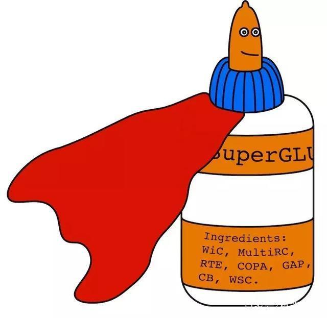吉祥物的诞生，来自 Nikita Nangia

SuperGLUE 与 GLUE 类似，是一个用于评估通用 NLP 模型的基准，同样也基于在多种不同语言理解任务集上的评估。

为了发现新的挑战性任务集，SuperGLUE 提出者向更广泛的 NLP 社区发起了任务提议征集，得到了一个包含约 30 种不同 NLP 任务的列表。在选择 SuperGLUE 的任务时，提出者考虑了多项设计原则，包括必须涉及到语言理解、这些任务还无法通过已有的方法解决、存在公开的训练数据、任务格式以及证书。经过验证，最终得到了一个包含七个任务的集合。

**革新之处**

SuperGLUE 遵照了 GLUE 的基本设计：包含一个围绕这七个语言理解任务构建的公开排行榜、基于已有数据的抽取、一个单个数值的表现指标和一套分析工具包。

SuperGLUE 与 GLUE 也有很多差异：

SuperGLUE 仅保留了 GLUE 九项任务中的两项（其中一项还经过修改），还引入了五个难度更大的新任务。这些任务的选择标准包括为了实现难度和多样性的最大化。初始的 SuperGLUE 基准版本即包含了人类水平估计结果。在 SuperGLUE 中这些被选中的任务上，基于 BERT 的强基线与人类水平之间还存在显著的差距。任务格式（API）的集合在 GLUE 中的句子和句子对分类上进行了扩展，SuperGLUE 另外还包含共指消解、句子完成和问答。为了促使研究者针对这种多样性的任务集合开发统一的新方法，与 SuperGLUE 一起发布的还有一套用于操作 NLP 的预训练、多任务学习和迁移学习的模块化建模工具包。这套工具包基于 PyTorch 和 AllenNLP。管理 SuperGLUE 排行榜的规则有多个地方不同于 GLUE 排行榜的管理规则，这些变化都是为了确保该排行榜竞争公平、信息丰富，并能充分体现数据和任务创建者的贡献。SuperGLUE 与 GLUE 的两项共同任务是：识别文本蕴涵（RTE）和 Winograd 模式挑战赛（WSC）。此外，SuperGLUE 还添加了测试模型问答、执行共指消解和执行常识推理能力的任务。下表给出了 SuperGLUE 包含的任务：

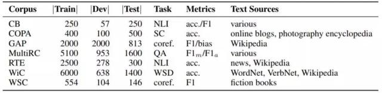

SuperGLUE 包含的任务。WSD 是词义消岐、NLI 是自然语言推理、coref. 是共指消解、SC 是句子完成、QA 是问答。其中，MultiRC 列出了 456/83/166 个 train/dev/test 问题的总答案数。

下面对这些任务进行更详细的说明和示例介绍：

CB：CommitmentBank（De Marneffe et al., 2019）是一个短文本语料库，其中至少有一个句子包含一个嵌入从句。其中每个嵌入从句都标注了该从句的预期的真实性程度。所得到的任务框架是三类文本蕴涵（three-class textual entailment），其样本来自《华尔街日报（Wall Street Journal）》、英国国家语料库（British National Corpus）的小说、Switchboard。每个样本都包含一个含有一个嵌入从句的前提（premise），对应的假设（hypothesis）则是该从句的提取。SuperCLUE 使用了该数据集的一个子集，该子集中注释之间的一致程度超过 0.85。这些数据不很平衡（中性样本相对较少），所以评估指标是准确度和 F1 分数，其中多类 F1 分数是每类 F1 分数的不加权的平均值。

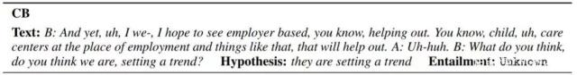

COPA：Choice Of Plausible Alternatives（Roemmele et al., 2011）数据集代表了一项因果推理任务，其会向系统提供一个前提句子和两个可能的可选项。系统必须选择与前提句子有更可信因果关系的可选项。用于构建可选项的方法要确保需要因果推理才能解决该任务。样本要么针对前提句子的可能原因，要么则是可能结果，再加上模型的两个实例类型之间的简单问题消岐。所有的样本都是人工设计的，关注的主题有网络博客和与摄影相关的百科内容。根据 COPA 作者的建议，SuperCLUE 使用准确度作为评估指标。

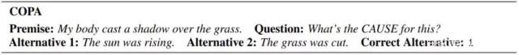

GAP：Gendered Ambiguous Pronoun Coreference（Webster et al., 2018）是一个性别方面平衡的语料库，其测试的是识别有歧义代词的指代目标的能力。给定一个句子、该句子中的一个特定代词以及该句子中的两个名词短语，任务目标是预测哪个名词短语（或两者同时）与那个代词共指。SuperCLUE 将其中公开可用的开发集用于训练，公开可用的测试集用于验证，另外 GAP 作者还提供了一个私有的测试集。评估指标为 F1 分数和偏见（bias），即在测试样本的男性代词和女性代词子集上的 F1 分数的比值。

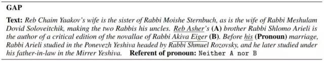

MultiRC：Multi-Sentence Reading Comprehension 数据集（Khashabi et al., 2018）代表了一项真假问答任务。每个样本都包含一个上下文段落、一个有关该段落的问题和一个该问题的可能答案的列表，这些答案必须标注了「真（true）」或「假（false）」。问答是很常见的问题，有很多数据集。这里选择 MultiRC 的原因包括：（1）每个问题都可以有多个可能的正确答案，所以每个问答对都必须独立于其它问答对进行评估；（2）问题的设计方式使得每个问题的解答都需要从多个上下文句子中提取事实；（3）相比于基于范围的抽取型问答，这个数据集的问答对格式更匹配其它 SuperGLUE 任务的 API。这些段落取自七个领域，包括新闻、小说和历史文本。评估指标是每个问题的正确答案集的 macro-average F1 分数（F1m）和在所有答案选项上的 binary F1 分数（F1a）。

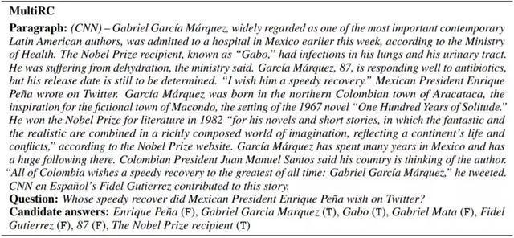

RTE：Recognizing Textual Entailment 数据集来自一系列文本蕴涵方面的年度竞赛。文本蕴涵任务是要预测给定的前提句子是否蕴涵给定的假设句子（也称为自然语言推理/NLI）。GLUE 之前就已包含 RTE。SuperGLUE 使用了一样的数据和格式：融合了来自 RTE1 (Dagan et al., 2006)、 RTE2 (Bar Haim et al., 2006)、RTE3 (Giampiccolo et al., 2007) 和 RTE5 (Bentivogli et al., 2009) 的数据。所有数据集经过组合，并被转换成了两类分类问题：entailment 和 not_entailment。相比于其它 GLUE 任务，RTE 是从迁移学习获益最多的任务，准确度表现水平从 GLUE 发布时的接近随机（约 56%）提升至了目前的 85%，但这一表现与人类水平仍有 8 个百分点的差距，所以还值得进一步研究探索。

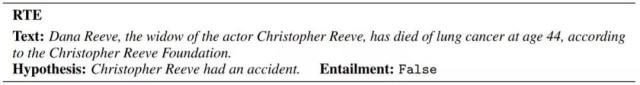

WiC：Word-in-Context（Pilehvar and Camacho-Collados, 2019）数据集针对的是词义消岐任务，该任务被设定成了在句子对上的二元分类问题。给定两个句子和一个出现在这两个句子中的多义词（歧义词），任务目标是决定该词在这两个句子中是否含义相同。数据集中句子取自 WordNet (Miller, 1995)、VerbNet (Schuler, 2005) 和维基百科。这项任务的评估指标是准确度。

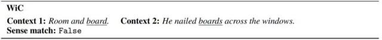

WSC：Winograd Schema Challenge（Levesque et al., 2012）是一个阅读理解任务，其中系统必须阅读一个带有一个代词的句子，并从一个选项列表中选择该代词所代指的目标。GLUE 中就已包含 WSC 任务，这个任务难度颇大，仍有很大的进步空间。SuperGLUE 中的 WSC 数据集被重新设定成了其共指形式，任务则被设定成了一个二元分类问题，而不再是 N 项多选题；这样做的目的是单独验证模型理解句子中共指链接的能力，而不会涉及到多选题环境中可能用到的其它策略。

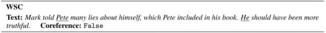

综合以上各项任务，SuperGLUE 基准也设置了一个总体评估指标：SuperGLUE 分数。该分数即是在以上所有任务上所得分数的平均。对于 Commitment Bank 和 MultiRC，会首先先取该任务在各项指标上的平均，比如对于 MultiRC，会首先先平均 F1m 和 F1a，之后在整体平均时将所得结果作为单个数值纳入计算。另外，GAP 的偏见（bias）分数不会纳入 SuperGLUE 分数的计算；原因是在性别平衡的 GAP 上训练的大多数系统在偏见分数上都表现良好。

**模型基准与人类水平**

SuperGLUE 提出者已经提供了在其中七项任务上的基准结果，这些结果是使用基于 BERT 的方法得到的，因为 BERT 在 GLUE 上是当前最成功的方法。具体而言，基准结果来自 BERT-LARGE-CASED variant.11，遵照了 Devlin et al. (2019) 的标准实践方法。对于每个任务，所选择的架构都是基于 BERT 的尽可能最简单的架构。下表给出了得到的基准结果：

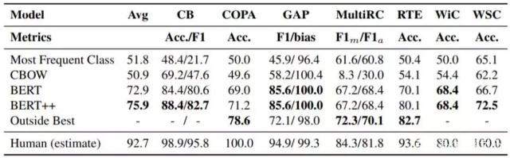

在 SuperGLUE 各项任务的测试集上得到的初步基准结果，加粗数值是机器在该任务上的当前最佳水平；最后一行是估计的人类水平。

可以看到，最佳的预训练基准结果仍大幅落后于人类水平。平均而言，BERT++ 的结果与人类水平相差 16.8；其中在 WSC 上差距最大，为 27.5，而人类在这一任务上表现完美。期待未来的新思路和新方法进一步减小这些差距，甚至解决这些任务。