# 深度学习中的注意力模型（2017版）

注意力模型最近几年在深度学习各个领域被广泛使用，无论是图像处理、语音识别还是自然语言处理的各种不同类型的任务中，都很容易遇到注意力模型的身影。所以，了解注意力机制的工作原理对于关注深度学习技术发展的技术人员来说有很大的必要。

**人类的视觉注意力**

从注意力模型的命名方式看，很明显其借鉴了人类的注意力机制，因此，我们首先简单介绍人类视觉的选择性注意力机制。

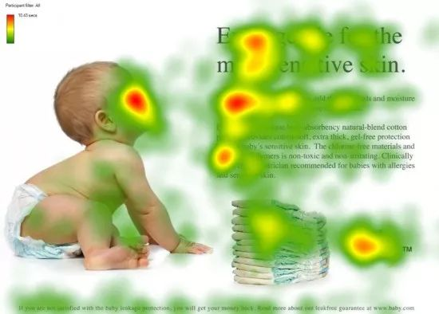

图1 人类的视觉注意力

视觉注意力机制是人类视觉所特有的大脑信号处理机制。人类视觉通过快速扫描全局图像，获得需要重点关注的目标区域，也就是一般所说的注意力焦点，而后对这一区域投入更多注意力资源，以获取更多所需要关注目标的细节信息，而抑制其他无用信息。

这是人类利用有限的注意力资源从大量信息中快速筛选出高价值信息的手段，是人类在长期进化中形成的一种生存机制，人类视觉注意力机制极大地提高了视觉信息处理的效率与准确性。

图1形象化展示了人类在看到一副图像时是如何高效分配有限的注意力资源的，其中红色区域表明视觉系统更关注的目标，很明显对于图1所示的场景，人们会把注意力更多投入到人的脸部，文本的标题以及文章首句等位置。

深度学习中的注意力机制从本质上讲和人类的选择性视觉注意力机制类似，核心目标也是从众多信息中选择出对当前任务目标更关键的信息。

**Encoder-Decoder框架**

要了解深度学习中的注意力模型，就不得不先谈Encoder-Decoder框架，因为目前大多数注意力模型附着在Encoder-Decoder框架下，当然，其实注意力模型可以看作一种通用的思想，本身并不依赖于特定框架，这点需要注意。

Encoder-Decoder框架可以看作是一种深度学习领域的研究模式，应用场景异常广泛。图2是文本处理领域里常用的Encoder-Decoder框架最抽象的一种表示。

图2 抽象的文本处理领域的Encoder-Decoder框架

文本处理领域的Encoder-Decoder框架可以这么直观地去理解：可以把它看作适合处理由一个句子（或篇章）生成另外一个句子（或篇章）的通用处理模型。对于句子对<Source,Target>，我们的目标是给定输入句子Source，期待通过Encoder-Decoder框架来生成目标句子Target。Source和Target可以是同一种语言，也可以是两种不同的语言。而Source和Target分别由各自的单词序列构成：

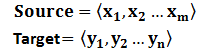

Encoder顾名思义就是对输入句子Source进行编码，将输入句子通过非线性变换转化为中间语义表示C：

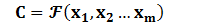

对于解码器Decoder来说，其任务是根据句子Source的中间语义表示C和之前已经生成的历史信息

来生成i时刻要生成的单词

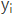

：

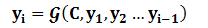

每个yi都依次这么产生，那么看起来就是整个系统根据输入句子Source生成了目标句子Target。如果Source是中文句子，Target是英文句子，那么这就是解决机器翻译问题的Encoder-Decoder框架；如果Source是一篇文章，Target是概括性的几句描述语句，那么这是文本摘要的Encoder-Decoder框架；如果Source是一句问句，Target是一句回答，那么这是问答系统或者对话机器人的Encoder-Decoder框架。由此可见，在文本处理领域，Encoder-Decoder的应用领域相当广泛。

Encoder-Decoder框架不仅仅在文本领域广泛使用，在语音识别、图像处理等领域也经常使用。比如对于语音识别来说，图2所示的框架完全适用，区别无非是Encoder部分的输入是语音流，输出是对应的文本信息；而对于“图像描述”任务来说，Encoder部分的输入是一副图片，Decoder的输出是能够描述图片语义内容的一句描述语。一般而言，文本处理和语音识别的Encoder部分通常采用RNN模型，图像处理的Encoder一般采用CNN模型。

**Attention模型**

本节先以机器翻译作为例子讲解最常见的Soft Attention模型的基本原理，之后抛离Encoder-Decoder框架抽象出了注意力机制的本质思想，然后简单介绍最近广为使用的Self Attention的基本思路。

**Soft Attention模型**

图2中展示的Encoder-Decoder框架是没有体现出“注意力模型”的，所以可以把它看作是注意力不集中的分心模型。为什么说它注意力不集中呢？请观察下目标句子Target中每个单词的生成过程如下：

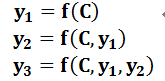

其中f是Decoder的非线性变换函数。从这里可以看出，在生成目标句子的单词时，不论生成哪个单词，它们使用的输入句子Source的语义编码C都是一样的，没有任何区别。

而语义编码C是由句子Source的每个单词经过Encoder编码产生的，这意味着不论是生成哪个单词，y1,y2还是y3，其实句子Source中任意单词对生成某个目标单词yi来说影响力都是相同的，这是为何说这个模型没有体现出注意力的缘由。这类似于人类看到眼前的画面，但是眼中却没有注意焦点一样。

如果拿机器翻译来解释这个分心模型的Encoder-Decoder框架更好理解，比如输入的是英文句子：Tom chase Jerry，Encoder-Decoder框架逐步生成中文单词：“汤姆”，“追逐”，“杰瑞”。

在翻译“杰瑞”这个中文单词的时候，分心模型里面的每个英文单词对于翻译目标单词“杰瑞”贡献是相同的，很明显这里不太合理，显然“Jerry”对于翻译成“杰瑞”更重要，但是分心模型是无法体现这一点的，这就是为何说它没有引入注意力的原因。

没有引入注意力的模型在输入句子比较短的时候问题不大，但是如果输入句子比较长，此时所有语义完全通过一个中间语义向量来表示，单词自身的信息已经消失，可想而知会丢失很多细节信息，这也是为何要引入注意力模型的重要原因。

上面的例子中，如果引入Attention模型的话，应该在翻译“杰瑞”的时候，体现出英文单词对于翻译当前中文单词不同的影响程度，比如给出类似下面一个概率分布值：

（Tom,0.3）(Chase,0.2) (Jerry,0.5)

每个英文单词的概率代表了翻译当前单词“杰瑞”时，注意力分配模型分配给不同英文单词的注意力大小。这对于正确翻译目标语单词肯定是有帮助的，因为引入了新的信息。

同理，目标句子中的每个单词都应该学会其对应的源语句子中单词的注意力分配概率信息。这意味着在生成每个单词yi的时候，原先都是相同的中间语义表示C会被替换成根据当前生成单词而不断变化的Ci。理解Attention模型的关键就是这里，即由固定的中间语义表示C换成了根据当前输出单词来调整成加入注意力模型的变化的Ci。增加了注意力模型的Encoder-Decoder框架理解起来如图3所示。

图3 引入注意力模型的Encoder-Decoder框架

即生成目标句子单词的过程成了下面的形式：

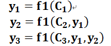

而每个Ci可能对应着不同的源语句子单词的注意力分配概率分布，比如对于上面的英汉翻译来说，其对应的信息可能如下：

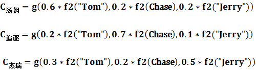

其中，f2函数代表Encoder对输入英文单词的某种变换函数，比如如果Encoder是用的RNN模型的话，这个f2函数的结果往往是某个时刻输入xi后隐层节点的状态值；g代表Encoder根据单词的中间表示合成整个句子中间语义表示的变换函数，一般的做法中，g函数就是对构成元素加权求和，即下列公式：

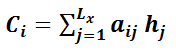

其中，Lx代表输入句子Source的长度，aij代表在Target输出第i个单词时Source输入句子中第j个单词的注意力分配系数，而hj则是Source输入句子中第j个单词的语义编码。假设下标i就是上面例子所说的“汤姆”，那么Lx就是3，h1=f(“Tom”)，h2=f(“Chase”),h3=f(“Jerry”)分别是输入句子每个单词的语义编码，对应的注意力模型权值则分别是0.6,0.2,0.2，所以g函数本质上就是个加权求和函数。如果形象表示的话，翻译中文单词“汤姆”的时候，数学公式对应的中间语义表示Ci的形成过程类似图4。

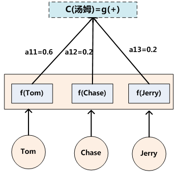

图4 Attention的形成过程

这里还有一个问题：生成目标句子某个单词，比如“汤姆”的时候，如何知道Attention模型所需要的输入句子单词注意力分配概率分布值呢？就是说“汤姆”对应的输入句子Source中各个单词的概率分布：(Tom,0.6) (Chase,0.2) (Jerry,0.2) 是如何得到的呢？

为了便于说明，我们假设对图2的非Attention模型的Encoder-Decoder框架进行细化，Encoder采用RNN模型，Decoder也采用RNN模型，这是比较常见的一种模型配置，则图2的框架转换为图5。

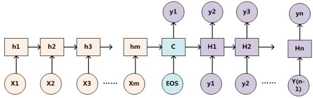

图5 RNN作为具体模型的Encoder-Decoder框架

那么用图6可以较为便捷地说明注意力分配概率分布值的通用计算过程。

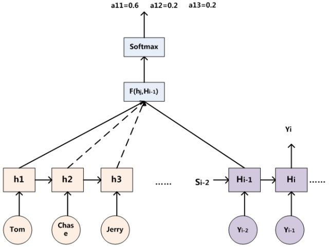

图6 注意力分配概率计算

对于采用RNN的Decoder来说，在时刻i，如果要生成yi单词，我们是可以知道Target在生成Yi之前的时刻i-1时，隐层节点i-1时刻的输出值Hi-1的，而我们的目的是要计算生成Yi时输入句子中的单词“Tom”、“Chase”、“Jerry”对Yi来说的注意力分配概率分布，那么可以用Target输出句子i-1时刻的隐层节点状态Hi-1去一一和输入句子Source中每个单词对应的RNN隐层节点状态hj进行对比，即通过函数F(hj,Hi-1)来获得目标单词yi和每个输入单词对应的对齐可能性，这个F函数在不同论文里可能会采取不同的方法，然后函数F的输出经过Softmax进行归一化就得到了符合概率分布取值区间的注意力分配概率分布数值。

绝大多数Attention模型都是采取上述的计算框架来计算注意力分配概率分布信息，区别只是在F的定义上可能有所不同。图7可视化地展示了在英语-德语翻译系统中加入Attention机制后，Source和Target两个句子每个单词对应的注意力分配概率分布。

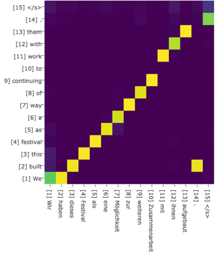

图7 英语-德语翻译的注意力概率分布

上述内容就是经典的Soft Attention模型的基本思想，那么怎么理解Attention模型的物理含义呢？一般在自然语言处理应用里会把Attention模型看作是输出Target句子中某个单词和输入Source句子每个单词的对齐模型，这是非常有道理的。

目标句子生成的每个单词对应输入句子单词的概率分布可以理解为输入句子单词和这个目标生成单词的对齐概率，这在机器翻译语境下是非常直观的：传统的统计机器翻译一般在做的过程中会专门有一个短语对齐的步骤，而注意力模型其实起的是相同的作用。

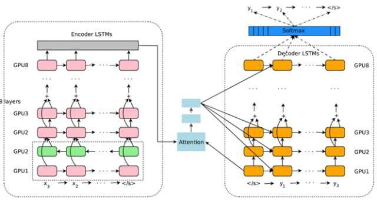

图8 Google 神经网络机器翻译系统结构图

图8所示即为Google于2016年部署到线上的基于神经网络的机器翻译系统，相对传统模型翻译效果有大幅提升，翻译错误率降低了60%，其架构就是上文所述的加上Attention机制的Encoder-Decoder框架，主要区别无非是其Encoder和Decoder使用了8层叠加的LSTM模型。

**Attention机制的本质思想**

如果把Attention机制从上文讲述例子中的Encoder-Decoder框架中剥离，并进一步做抽象，可以更容易看懂Attention机制的本质思想。

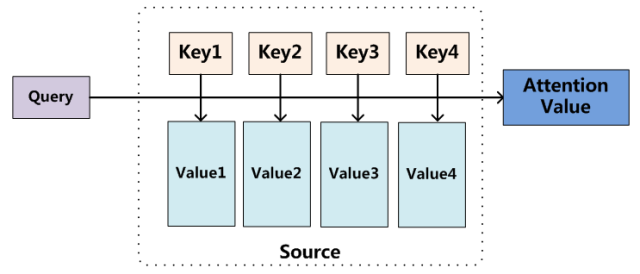

图9 Attention机制的本质思想

我们可以这样来看待Attention机制（参考图9）：将Source中的构成元素想象成是由一系列的<Key,Value>数据对构成，此时给定Target中的某个元素Query，通过计算Query和各个Key的相似性或者相关性，得到每个Key对应Value的权重系数，然后对Value进行加权求和，即得到了最终的Attention数值。所以本质上Attention机制是对Source中元素的Value值进行加权求和，而Query和Key用来计算对应Value的权重系数。即可以将其本质思想改写为如下公式：

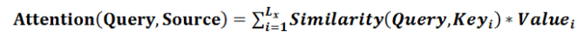

其中，Lx=||Source||代表Source的长度，公式含义即如上所述。上文所举的机器翻译的例子里，因为在计算Attention的过程中，Source中的Key和Value合二为一，指向的是同一个东西，也即输入句子中每个单词对应的语义编码，所以可能不容易看出这种能够体现本质思想的结构。

当然，从概念上理解，把Attention仍然理解为从大量信息中有选择地筛选出少量重要信息并聚焦到这些重要信息上，忽略大多不重要的信息，这种思路仍然成立。聚焦的过程体现在权重系数的计算上，权重越大越聚焦于其对应的Value值上，即权重代表了信息的重要性，而Value是其对应的信息。

从图9可以引出另外一种理解，也可以将Attention机制看作一种软寻址（Soft Addressing）:Source可以看作存储器内存储的内容，元素由地址Key和值Value组成，当前有个Key=Query的查询，目的是取出存储器中对应的Value值，即Attention数值。通过Query和存储器内元素Key的地址进行相似性比较来寻址，之所以说是软寻址，指的不像一般寻址只从存储内容里面找出一条内容，而是可能从每个Key地址都会取出内容，取出内容的重要性根据Query和Key的相似性来决定，之后对Value进行加权求和，这样就可以取出最终的Value值，也即Attention值。所以不少研究人员将Attention机制看作软寻址的一种特例，这也是非常有道理的。

至于Attention机制的具体计算过程，如果对目前大多数方法进行抽象的话，可以将其归纳为两个过程：第一个过程是根据Query和Key计算权重系数，第二个过程根据权重系数对Value进行加权求和。而第一个过程又可以细分为两个阶段：第一个阶段根据Query和Key计算两者的相似性或者相关性；第二个阶段对第一阶段的原始分值进行归一化处理；这样，可以将Attention的计算过程抽象为如图10展示的三个阶段。

图10 三阶段计算Attention过程

在第一个阶段，可以引入不同的函数和计算机制，根据Query和某个Key_i，计算两者的相似性或者相关性，最常见的方法包括：求两者的向量点积、求两者的向量Cosine相似性或者通过再引入额外的神经网络来求值，即如下方式：

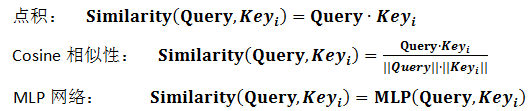

第一阶段产生的分值根据具体产生的方法不同其数值取值范围也不一样，第二阶段引入类似SoftMax的计算方式对第一阶段的得分进行数值转换，一方面可以进行归一化，将原始计算分值整理成所有元素权重之和为1的概率分布；另一方面也可以通过SoftMax的内在机制更加突出重要元素的权重。即一般采用如下公式计算：

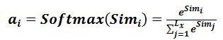

第二阶段的计算结果a_i即为value_i对应的权重系数，然后进行加权求和即可得到Attention数值：

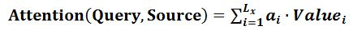

通过如上三个阶段的计算，即可求出针对Query的Attention数值，目前绝大多数具体的注意力机制计算方法都符合上述的三阶段抽象计算过程。

**Self Attention模型**

通过上述对Attention本质思想的梳理，我们可以更容易理解本节介绍的Self Attention模型。Self Attention也经常被称为intra Attention（内部Attention），最近一年也获得了比较广泛的使用，比如Google最新的机器翻译模型内部大量采用了Self Attention模型。

在一般任务的Encoder-Decoder框架中，输入Source和输出Target内容是不一样的，比如对于英-中机器翻译来说，Source是英文句子，Target是对应的翻译出的中文句子，Attention机制发生在Target的元素Query和Source中的所有元素之间。而Self Attention顾名思义，指的不是Target和Source之间的Attention机制，而是Source内部元素之间或者Target内部元素之间发生的Attention机制，也可以理解为Target=Source这种特殊情况下的注意力计算机制。其具体计算过程是一样的，只是计算对象发生了变化而已，所以此处不再赘述其计算过程细节。

如果是常规的Target不等于Source情形下的注意力计算，其物理含义正如上文所讲，比如对于机器翻译来说，本质上是目标语单词和源语单词之间的一种单词对齐机制。那么如果是Self Attention机制，一个很自然的问题是：通过Self Attention到底学到了哪些规律或者抽取出了哪些特征呢？或者说引入Self Attention有什么增益或者好处呢？我们仍然以机器翻译中的Self Attention来说明，图11和图12是可视化地表示Self Attention在同一个英语句子内单词间产生的联系。

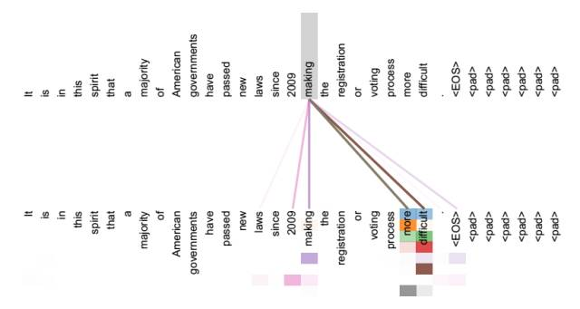

图11 可视化Self Attention实例

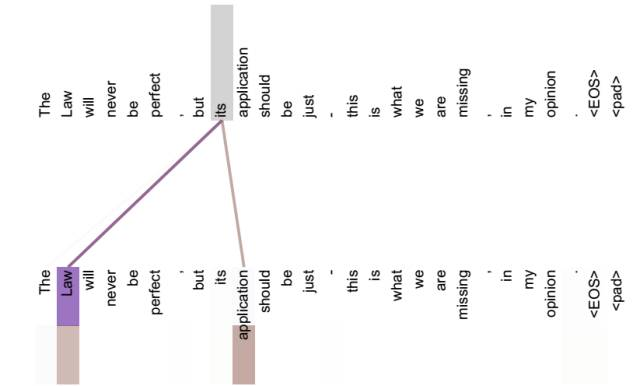

图12 可视化Self Attention实例

从两张图（图11、图12）可以看出，Self Attention可以捕获同一个句子中单词之间的一些句法特征（比如图11展示的有一定距离的短语结构）或者语义特征（比如图12展示的its的指代对象Law）。

很明显，引入Self Attention后会更容易捕获句子中长距离的相互依赖的特征，因为如果是RNN或者LSTM，需要依次序序列计算，对于远距离的相互依赖的特征，要经过若干时间步步骤的信息累积才能将两者联系起来，而距离越远，有效捕获的可能性越小。

但是Self Attention在计算过程中会直接将句子中任意两个单词的联系通过一个计算步骤直接联系起来，所以远距离依赖特征之间的距离被极大缩短，有利于有效地利用这些特征。除此外，Self Attention对于增加计算的并行性也有直接帮助作用。这是为何Self Attention逐渐被广泛使用的主要原因。

**Attention机制的应用**

前文有述，Attention机制在深度学习的各种应用领域都有广泛的使用场景。上文在介绍过程中我们主要以自然语言处理中的机器翻译任务作为例子，下面分别再从图像处理领域和语音识别选择典型应用实例来对其应用做简单说明。

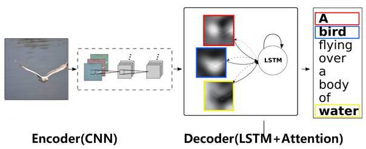

图13 图片-描述任务的Encoder-Decoder框架

图片描述（Image-Caption）是一种典型的图文结合的深度学习应用，输入一张图片，人工智能系统输出一句描述句子，语义等价地描述图片所示内容。很明显这种应用场景也可以使用Encoder-Decoder框架来解决任务目标，此时Encoder输入部分是一张图片，一般会用CNN来对图片进行特征抽取，Decoder部分使用RNN或者LSTM来输出自然语言句子（参考图13）。

此时如果加入Attention机制能够明显改善系统输出效果，Attention模型在这里起到了类似人类视觉选择性注意的机制，在输出某个实体单词的时候会将注意力焦点聚焦在图片中相应的区域上。图14给出了根据给定图片生成句子“A person is standing on a beach with a surfboard.”过程时每个单词对应图片中的注意力聚焦区域。

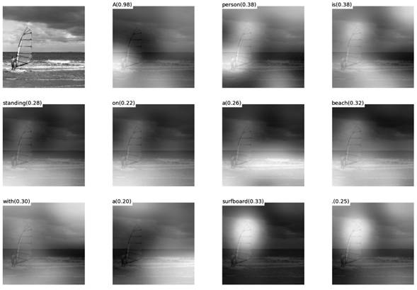

图14 图片生成句子中每个单词时的注意力聚焦区域

图15给出了另外四个例子形象地展示了这种过程，每个例子上方左侧是输入的原图，下方句子是人工智能系统自动产生的描述语句，上方右侧图展示了当AI系统产生语句中划横线单词的时候，对应图片中聚焦的位置区域。比如当输出单词dog的时候，AI系统会将注意力更多地分配给图片中小狗对应的位置。

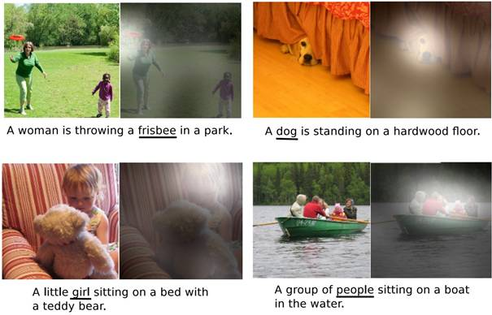

图15 图像描述任务中Attention机制的聚焦作用

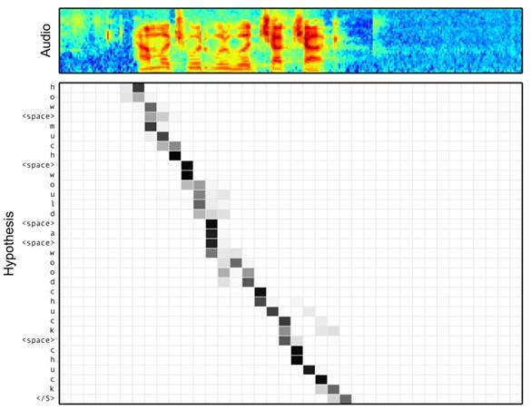

图16 语音识别中音频序列和输出字符之间的Attention

语音识别的任务目标是将语音流信号转换成文字，所以也是Encoder-Decoder的典型应用场景。Encoder部分的Source输入是语音流信号，Decoder部分输出语音对应的字符串流。

图16可视化地展示了在Encoder-Decoder框架中加入Attention机制后，当用户用语音说句子 how much would a woodchuck chuck 时，输入部分的声音特征信号和输出字符之间的注意力分配概率分布情况，颜色越深代表分配到的注意力概率越高。从图中可以看出，在这个场景下，Attention机制起到了将输出字符和输入语音信号进行对齐的功能。

上述内容仅仅选取了不同AI领域的几个典型Attention机制应用实例，Encoder-Decoder加Attention架构由于其卓越的实际效果，目前在深度学习领域里得到了广泛的使用，了解并熟练使用这一架构对于解决实际问题会有极大帮助。