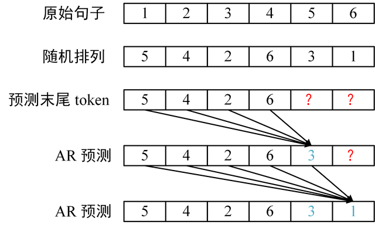
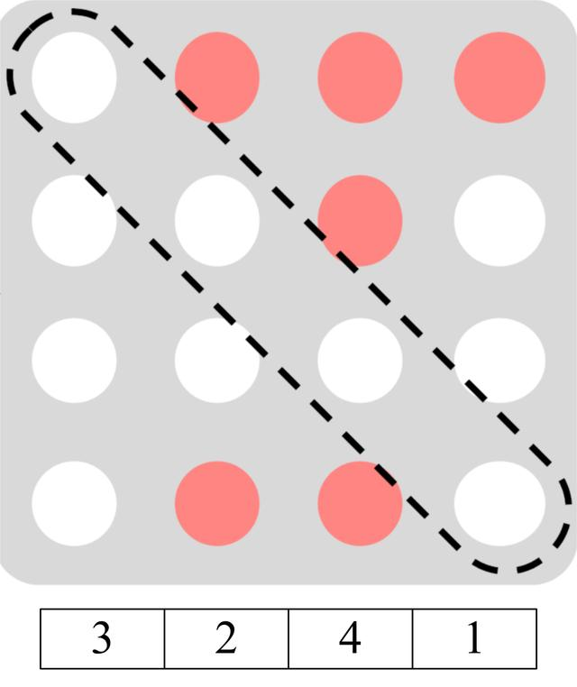
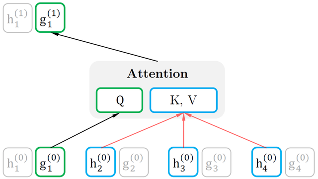
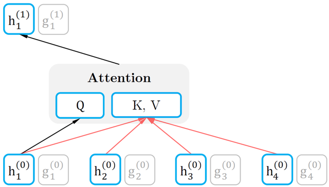
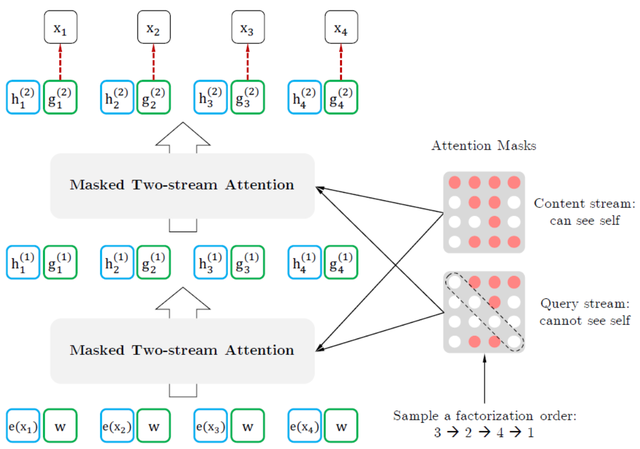
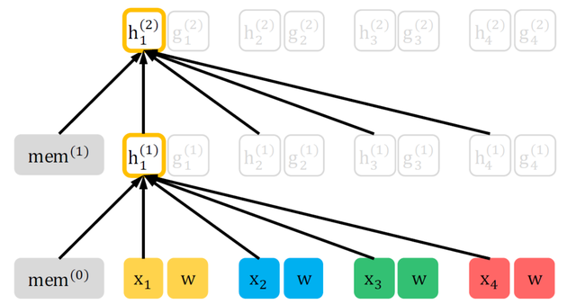
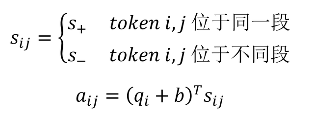

## 比 BERT 效果更好的 XLNet 详解

BERT 训练时将部分单词 mask 起来，使模型能够利用句子双向的信息，在很多 NLU 任务上取得很好的效果。但是 BERT 忽略了 mask 单词之间的关系，且微调过程与预训练过程不一致 (微调时没有 mask 的单词)。XLNet 采用了 PLM (Permutation Language Model) ，将句子随机排列，然后用自回归的方法训练，从而获得双向信息并且可以学习 token 之间的依赖关系。另外 XLNet 使用了 Transformer-XL，使用了更广阔的上下文信息。

**1.前言**

XLNet 论文中首先提出了一种比较有意思的观点，将当前预训练模型分为了两类 AR (Auto Regression，自回归) 和 AE (Auto Encoder，自编码器)。

GPT 就是一种 AR 方法，不断地使用当前得到的信息预测下一个输出 (自回归)。而 BERT 是一种 AE 方法，将输入句子的某些单词 mask 掉，然后再通过 BERT 还原数据，这一过程类似去噪自编码器 (Denoising AutoEncoder，DAE)。不熟悉 GPT 和 BERT 的童鞋可以参考前面的文章，OpenAI GPT 和 GPT2 模型详解和彻底理解 Google BERT 模型。

AR 的方法可以更好地学习 token 之间的依赖关系，而 AE 的方法可以更好地利用深层的双向信息。因此 XLNet 希望将 AR 和 AE 两种方法的优点结合起来，XLNet 使用了 **Permutation Language Model (PLM)**实现这一目的。

Permutation 指排列组合的意思，XLNet 将句子中的 token 随机排列，然后采用 AR 的方式预测末尾的几个 token。这样一来，在预测 token 的时候就可以同时利用该 token 双向的信息，并且能学到 token 间的依赖，如下图所示。

XLNet PLM 例子

接下来介绍 XLNet 中的实现细节，其中 XLNet 为了实现 PLM，提出了 Two-Stream Self-Attention 和 Partial Prediction。另外 XLNet 还使用了 Transformer-XL 中的 Segment Recurrence Mechanism 和 Relative Positional Encoding，不熟悉 Transformer-XL 的童鞋可以参考前面的文章，Transformer-XL 语言模型。

**2.Permutation Language Model**

PLM (Permutation Language Model) 是 XLNet 的核心思想，首先将句子的 token 随机排列，然后采用 AR 的方式预测句子末尾的单词，这样 XLNet 即可同时拥有 AE 和 AR 的优势。

**2.1 PLM 介绍**

**XLNet 中通过 Attention Mask 实现 PLM，而无需真正修改句子 token 的顺序。**例如原来的句子是 [1,2,3,4]，如果随机生成的序列时 [3,2,4,1]，则输入到 XLNet 的句子仍然是 [1,2,3,4]，但是掩码需要修改成下图。

PLM mask 矩阵

图中的掩码矩阵，红色表示不遮掩，白色表示遮掩。第 1 行表示 token 1 的掩码，可以看到，1 是句子的最后一个 token，因此可以看到之前的所有 token (3,2,4)。3 是句子的第一个 token，看不到句子的任何信息，因此第 3 行都是白色的 (表示遮掩)。

**2.2 Two-Stream Self-Attention**

**Two-Stream 概念**

XLNet 打乱了句子的顺序，这时在预测的时候 token 的位置信息会非常重要，同时在预测的时候也必须将 token 的内容信息遮掩起来 (否则输入包含了要预测的内容信息，模型就无法学到知识)。**也就是说 XLNet 需要看到 token 的位置信息，但是又不能看到 token 的内容信息**，因此 XLNet 采用了两个 Stream 实现这一目的：

**Query Stream**，对于每一个 token，其对应的 Query Stream 只包含了该 token 的位置信息，注意是 token 在原始句子的位置信息，不是重新排列的位置信息。**Content Stream**，对于每一个 token，其对应的 Content Stream 包含了该 token 的内容信息。**Query Stream 计算**

Query Stream 用 **g**表示，Content Stream 用 **h** 表示，使用 Query Stream 对要预测的位置进行预测的时候，Q (Query) 向量是用 **g** 计算得到的，包含该位置的位置信息，而 K (Key) 和 V (Value) 是用 **h** 计算的，包含其他 token 的内容信息。下图展示了如何通过当前层的 **g** 计算下一层 **g** 的过程，图中的排列是 [3,2,4,1]，计算的 token 是 1。

Query Stream 计算过程

可以看到在计算 token 1 的 Q 向量时，只使用了 token 1 的 Query Stream **g**，即模型只得到 token 1 的位置信息。而向量 K，V 使用 token 3, 2, 4 进行计算，所以模型可以得到 token 3, 2, 4 的内容信息。因为 token 1 是排列 [3,2,4,1] 的最后一位。这一个过程的掩码矩阵和上一节的是一样的 ，对角线上都为白色，即遮掩当前预测位置的内容信息 **h**。

Query Stream Mask 矩阵

**Content Stream 计算**

Content Stream 包含了 token 的内容信息，因为 XLNet 的层数很多，需要将 token 的内容传递到下一层。这一层的 Q, K, V 都是利用 **h** 计算的。Content Stream 的计算如下图所示。

Content Stream 计算过程

可以看到，在计算下一层的 **h1**时，也会利用 token 1 当前的内容信息，这样就可以将 token 的内容传递到下一层，但是注意 XLNet 在预测时只是用 **g** (Query Stream)。计算 Content Stream 时候的掩码矩阵如下图所示。

Content Stream Mask 矩阵

和 Query Stream 的掩码矩阵区别在于对角线，Content Stream 不遮掩对角线，使得当前 token 的信息可以传递到下一层。

**Query Stream 和 Content Stream 组合**

XLNet 将 Query Stream 和 Content Stream 组合在一起，如下图所示。

XLNet 整体结构

图中最下面的一层是输入层，其中 e(x) 是单词的词向量，表示输入的 Content Stream，而 w 表示输入的位置信息，即 Query Stream。

**2.3 Partial Prediction**

XLNet 将句子重新排列，然后根据排列后的顺序使用 AR 方式预测，但是由于句子是随机排列的，会导致优化比较困难且收敛速度慢。因此 XLNet 采用了 Partial Prediction (部分预测) 的方式进行训练，对于排列后的句子，只预测句子末尾的 1/K 个 token。

例如 K=4，就是只预测最后 1/4 的 token。给定句子 [1,2,3,4,5,6,7,8] 和一种随机排列 [2,8,3,4,5,1,7,6]，则只预测 7 和 6。论文中训练 XLNet-Large 时使用的 K 为 6，大约是预测末尾 **14.3%**的 token。

**3.XLNet 优化技巧**

**3.1 Transformer-XL**

XLNet 使用了 Transformer-XL 中的 **Segment Recurrence Mechanism**(段循环) 和 **Relative Positional Encoding** (相对位置编码) 进行优化。

Segment Recurrence Mechanism 段循环的机制会将上一段文本输出的信息保存下来，用于当前文本的计算，使模型可以拥有更广阔的上下文信息。

在引入上一段信息后，可能会有两个 token 拥有相同的位置信息，例如上一段的第一个单词和当前段的第一个单词位置信息都是一样的。因此 Transformer-XL 采用了 Relative Positional Encoding (相对位置编码) ，不使用固定的位置，而是采用单词之间的相对位置进行编码。在之前的文章《Transformer-XL 语言模型》中有比较详细的介绍，感兴趣的童鞋可以参考一下。

XLNet 使用了 Transformer-XL 后如下图所示。**mem**表示的就是前一个 XLNet 段的内容信息，而 XLNet 中输入的 Query Stream 为 w，保存位置信息，采用的是 Relative Positional Encoding。

XLNet 使用 Transformer-XL 优化

**3.2 Relative Segment Encodings**

XLNet 希望像 BERT 一样采用 **[A, SEP, B, SEP, CLS]**的形式处理句子任务，在 BERT 中有两个表征向量 **EA** 和 **EB** 分别表示句子 A 和 B。但是 XLNet 采用 Transformer-XL 的段循环机制后会出现问题，两个段都有句子 A 和 B，则两个句子 A 属于不同的段，但是却会有相同的 Segment 向量。

XLNet 提出了 Relative Segment Encodings，对于每一个 attention head 都添加 3 个可训练的向量 **s+**, **s-**, **b**，然后利用以下公式计算 attention score。

Relative Segment Encodings

其中 **q**就是 Query 向量，这个计算得到的 attention score 会加到原来的 attention score 上，再计算 softmax。Relative Segment Encodings 加上了一个偏置向量 **b**，同时 Relative Segment Encodings 也可以用于一些超过两段输入句子的任务上。

**4.总结**

XLNet 的核心思想是 PLM，排列原来的句子，然后预测末尾的单词。这样可以学习到单词之间的依赖关系，而且可以利用 token 前后向的信息。

XLNet PLM 的实现需要用到 Two-Stream Self-Attention，包含两个 Stream，Query Stream 用于预测，只包含当前位置的位置信息。而 Content Stream 保存了 token 的内容。

XLNet 还使用了 Transformer-XL 的优化方式。

**5.参考文献**

XLNet: Generalized Autoregressive Pretraining for Language Understanding