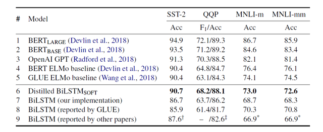

## BERT 模型蒸馏 Distillation BERT

BERT 在很多 NLP 任务上都取得不错的效果，但是其模型体积与计算量都很大，而且现在出现了更多越来越大的模型，例如 roBERTa 和 GPT2。由于这些模型的太大，难以用于一些性能没那么好的机器上，也不能很好地用于实时性要求高的应用中。因此有不少针对 BERT 模型压缩的研究，其中模型蒸馏 Distillation 是一种比较好的解决方法，本文介绍两种基于模型蒸馏的 BERT 模型压缩方法。

**1.前言**

不同模型的参数量

上图展示了很多基于 Transformer 的模型，模型下方的数字对应了模型的参数数量，单位是百万，可以看到这些模型变得越来越大。这些模型的体积也限制了其在现实世界中的使用，因为各方面因素：

这种模型的训练花费大量的金钱，需要使用昂贵的 GPU 服务器才能提供大规模的服务。模型太大导致 inference 的时间也变长，不能用于一些实时性要求高的任务中。现在有不少机器学习任务需要运行在终端上，例如智能手机，这种情况也必须使用轻量级的模型。基于以上的原因，不少研究开始针对 BERT 模型压缩进行，常见的模型压缩方法有以下几种：

模型蒸馏 Distillation，使用**大模型**的学到的知识训练**小模型**，从而让小模型具有大模型的泛化能力。量化 Quantization，降低大模型的精度，减小模型。剪枝 Pruning，去掉模型中作用比较小的连接。参数共享，共享网络中部分参数，降低模型参数数量。前一篇文章RoBERTa 和 ALBERT中介绍的 ALBERT 也是一种 BERT 压缩方法，主要是用了参数共享和矩阵分解的方法压缩 BERT，但是 ALBERT 只减少模型的参数，并不能减少其 inference 的时间。

接下来介绍两种使用模型蒸馏压缩 BERT 的算法，第一种是 DistilBERT，将 12 层的 BERT-base 模型蒸馏到 6 层的 BERT 模型；第二种是将 BERT 模型蒸馏到 BiLSTM 模型。

**2.模型蒸馏 Distillation**

首先介绍模型蒸馏的概念，模型蒸馏是一种模型压缩的方法，由 Hinton 在论文《Distilling the Knowledge in a Neural Network》中提出，下面是模型蒸馏的要点：

首先需要训练一个大的模型，这个大模型也称为 teacher 模型。利用 teacher 模型输出的概率分布训练小模型，小模型称为 student 模型。训练 student 模型时，包含两种 label，soft label 对应了 teacher 模型输出的概率分布，而 hard label 是原来的 one-hot label。模型蒸馏训练的**小模型会学习到大模型的表现以及泛化能力**。在有监督训练中，模型会有一个预测的目标，通常是 one-hot label，模型在训练时需要最大化对应 label 的概率 (softmax 或者 logits)。在模型预测时的概率分布中，应该是正确的类别概率最大，而其他类别的概率都比较小，但是那些**小概率类别之间的概率大小应该也是存在差异的**，例如将一只狗预测成狼的概率比预测成树木的概率应该更大。这种概率之间的差异在一定程度上表明了模型的泛化能力，一个好的模型不是拟合训练集好的模型，而是具有泛化能力的模型。

模型蒸馏希望 student 模型学习到 teacher 模型的泛化能力，因此在训练模型时采用的 target 是 teacher 模型输出的概率分布，这也称为 soft target。有些模型蒸馏的方法在训练的时候也会使用原来的 one-hot label，称为 hard target。

为了更好地学习到 teacher 模型的泛化能力，Hinton 提出了 softmax-temperature，公式如下:

softmax-temperature

softmax-temperature 在 softmax 基础上添加了一个参数 T，T 越接近 0，则分布越接近 one-hot，T 越接近无穷大，则分布越接近平均分布。即 T 越大，分布会越平滑，选择合适的 T 可以让更加 student 模型更能观察到 teacher 模型的类别分布多样性。在训练的过程中，teacher 模型和 student 模型使用同样的参数 T，而后续使用 student 模型推断时，T 设置回 1，变成标准的 softmax。

**3.DistilBERT**

DistilBERT 模型是 HuggingFace 发布的，论文是《DistilBERT, a distilled version of BERT: smaller, faster, cheaper and lighter》。DistilBERT 模型与 BERT 模型类似，但是 DistilBERT 只有 6 层，而 BERT-base 有 12 层，DistilBERT 只有 6600 万参数，而 BERT-base 有 1.1 亿参数。DistilBERT 在减少 BERT 参数和层数的情况下， 仍然可以保持比较好的性能，在 GLUE 上保留了 BERT 95% 的性能。

**3.1 DistilBERT 训练**

DistilBERT 使用 KL 散度作为损失函数，q 表示 student 模型的分布，而 p 表示 teacher 模型输出的分布，损失函数如下：

KL散度

DistilBERT 最终的损失函数由 KL 散度 (蒸馏损失) 和 MLM (遮蔽语言建模) 损失两部分线性组合得到。DistilBERT 移除了 BERT 模型的 token 类型 embedding 和 NSP (下一句预测任务)，保留了 BERT 的其他机制，然后把 BERT 的层数减少为原来的 1/2。

此外 DistilBERT 的作者还使用了一些优化的 trick，例如使用了 teacher 模型的参数对 DistilBERT 模型进行初始化；采用 RoBERTa 中的一些训练方法，例如大的 batch，动态 Mask 等。

**3.2 DistilBERT 实验结果**

DistilBERT 在 GLUE 基准集的结果

上图是 DistilBERT 在 GLUE 基准开发集上的实验结果，可以看到在所有的数据集上，DistilBERT 的效果都比 ELMo 好，在一些数据集上效果甚至比 BERT 还好，整体上性能也达到了 BERT 的 97%，但是 DistilBERT 的参数量只有 BERT 的 60 %。

DistilBERT 参数量及时间

上图是不同模型参数以及推断时间的对比，可以看到 DistilBERT 的参数比 ELMo 和 BERT-base 都少很多，而且推断时间也大大缩短。

**4.将 BERT 蒸馏到 BiLSTM**

另一篇文章《Distilling Task-Specific Knowledge from BERT into Simple Neural Networks》则尝试将 BERT 模型蒸馏到 BiLSTM 模型中，称为 Distilled BiLSTM。即 teacher 模型是 BERT，而 student 模型是 BiLSTM。文章提出了两种模型，其中一个是针对单个句子的分类；另一个是针对两个句子做匹配。

**4.1 Distilled BiLSTM 模型**

Distilled BiLSTM 第一种模型

上图是第一种 BiLSTM 模型，用于单个句子的分类，将句子的所有单词的词向量输入一个 BiLSTM，然后将前向和后向 LSTM 的隐藏层向量拼接在一起，传入全连接网络中进行分类。

Distilled BiLSTM 第二种模型

上面是第二种 BiLSTM 模型，用于两个句子的匹配，两个 BiLSTM 输出的隐藏向量分别为 h1 和 h2，则需要用将两个向量拼接在一起，再进行分类。h1 和 h2 拼接的公式如下：

**4.2 Distilled BiLSTM 训练**

将 BERT 蒸馏到 BiLSTM 模型，使用的损失函数包含两个部分：

一部分是 hard target，直接使用 one-hot 类别与 BiLSTM 输出的概率值计算交叉熵。一部分是 soft target，使用 teacher 模型 (BERT) 输出的概率值与 BiLSTM 输出的概率值计算均方误差 MSE。

在训练过程中，太小的数据集不足以让 student 模型学习到 teacher 模型的所有知识，所以作者提出了三种数据增强的方法扩充数据：

Masking，使用 [mask] 标签随机替换一个单词，例如 "I have a cat"，替换成 "I [mask] a cat"。POS-guided word replacement，将一个单词替换成另一个具有相同 POS 的单词，例如将 "I have a cat" 替换成 "I have a dog"。n-gram，在 1-5 中随机采样得到 n，然后采用 n-gram，去掉其他单词。**4.3 Distilled BiLSTM 实验结果**

Distilled BiLSTM 在 GLUE 基准结果

上面是 Distilled BiLSTM 模型的结果，可以看到比单纯使用 BiLSTM 模型的效果好很多，在 SST 和 QQP 数据集上的效果甚至比 ELMo 好，说明模型能够学习到一部分 BERT 的泛化能力。但是 Distilled BiLSTM 的效果还是比 BERT 差了很多，说明还是有很多知识不能迁移到 BiLSTM 中。

Distilled BiLSTM 参数量及时间

上面是 Distilled BiLSTM 的参数和推断时间，BiLSTM 的参数要远远少于 BERT-large，比 BERT-large 少了 335倍，推断时间比 BERT-large 快了 434 倍。压缩效果还是比较明显的。

**5.总结**

DistilBERT 模型的效果相对更好，而 Distilled BiLSTM 压缩得更小。

DistilBERT 模型使用了 KL 散度计算 soft target，而 Distilled BiLSTM 使用 MSE 计算。HuggingFace 在博客中给出的原因是，DistilBERT 训练的是语言模型，而 Distilled BiLSTM 针对下游分类任务，语言模型的输出空间维度要大很多，这种时候使用 MSE 可能不同 logit 之间会相互抵消。

**6.参考文献**

DistilBERT, a distilled version of BERT: smaller, faster, cheaper and lighter

Distilling Task-Specific Knowledge from BERT into Simple Neural Networks

Distilling the Knowledge in a Neural Network