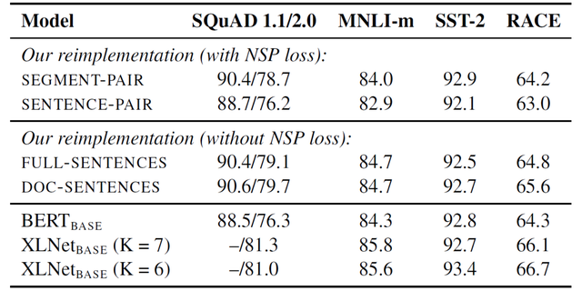
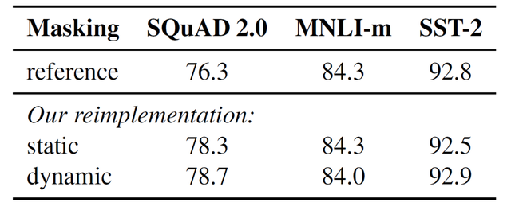
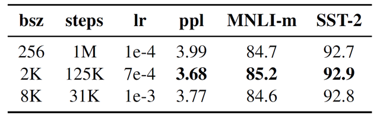
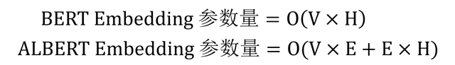
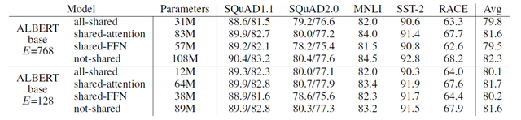
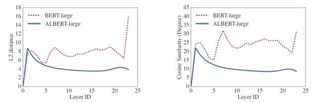

## RoBERTa 和 ALBERT

BERT 模型是 2018 年提出的，并在很多自然语言处理任务有前所未有的提升。因此 2019 年就有很多工作是围绕着 BERT 展开的，其中出现了两个 BERT 的改进版模型，RoBERTa 和 ALBERT。RoBERTa 在更大的数据集和最优的参数中训练 BERT，使 BERT 的性能再次提升；ALBERT 主要是对 BERT 进行压缩，通过共享所有层的参数以及 Embedding 分解减少 BERT 的参数量。

**1. 前言**

本文主要介绍 BERT 的两种改进模型 RoBERTa 和 ALBERT，关于 BERT 模型可以参考之前的文章 彻底理解 Google BERT 模型,首先总体看一下 RoBERTa 和 ALBERT 的一些特点。

RoBERTa：

更大的训练集，更大的 batch。不需要使用 NSP Loss。使用更长的训练 Sequence。动态 Mask。ALBERT：

分解 Embedding 矩阵，减少维度。所有 Transformer 层共享参数。使用 SOP (Sentence Order Prediction) 替代 NSP。**2. RoBERTa**

RoBERTa 主要试验了 BERT 中的一些训练设置 (例如 NSP Loss 是否有意义，batch 的大小等)，并找出最好的设置，然后再更大的数据集上训练 BERT。

**2.1 更大的数据集**

原来的 BERT 只使用了 16G 的数据集，而 RoBERTa 在更大的数据集上训练 BERT，使用了 160G 的语料：

BOOKCORPUS，16G，原来 BERT 的训练数据集CC-NEWS，76GOPENWEBTEXT，38GSTORIES，31G**2.2 去掉 NSP Loss**

BERT 在训练的过程中采用了 NSP Loss，原本用意是为了让模型能够更好地捕捉到文本的语义，给定两段语句 X = [x1, x2, ..., xN] 和 Y = [y1, y2, ...., yM]，BERT 中的 NSP 任务需要预测 Y 是不是 出现在 X 的后面。

但是 NSP Loss 受到不少文章的质疑 ，例如 XLNet，RoBERTa 采用了一个实验验证 NSP Loss 的实用性。实验中采用了四种组合：

**Segment-Pair + NSP：**这个是原来 BERT 的训练方法，使用 NSP Loss，输入的两段文字 X 和 Y 可以包含多个句子，但是 X + Y 的长度要小于 512。

**Sentence-Pair + NSP：**与上一个基本类似，也使用 NSP Loss，但是输入的两段文字 X 和 Y 都分别是一个句子，因此一个输入包含的 token 通常比 Segment-Pair 少，所以要增大 batch，使总的 token 数量和 Sentence-Pair 差不多。

**Full-Sentences：**不使用 NSP，直接从一个或者多个文档中采样多个句子，直到总长度到达 512。当采样到一个文档末尾时，会在序列中添加一个文档分隔符 token，然后再从下一个文档采样。

**Doc-Sentences：**与 Full-Sentences 类似，不使用 NSP，但是只能从一个文档中采样句子，所以输入的长度可能会少于 512。Doc-Sentences 也需要动态调整 batch 大小，使其包含的 token 数量和 Full-Sentences 差不多。

RoBERTa 对于 NSP 的实验

上图是实验结果，最上面的两行是使用 NSP 的，可以看到使用 Segment-Pair (多个句子) 要好于 Sentence-Pair (单个句子)，实验结果显示使用单个句子会使 BERT 在下游任务的性能下降，主要原因可能是使用单个句子导致模型不能很好地学习长期的依赖关系。

中间两行是不使用 NSP Loss 的结果，可以看到两种方式都是比使用 NSP 效果要好的，这说明了 NSP Loss 实际上没什么作用，因此在 RoBERTa 中丢弃了 NSP Loss。

**2.3 动态 Mask**

原始的 BERT 在训练之前就把数据 Mask 了，然后在整个训练过程中都是保持数据不变的，称为 Static Mask。即同一个句子在整个训练过程中，Mask 掉的单词都是一样的。

RoBERTa 使用了一种 Dynamic Mask 的策略，将整个数据集复制 10 次，然后在 10 个数据集上都 Mask 一次，也就是每一个句子都会有 10 种 Mask 结果。使用 10 个数据集训练 BERT。

下图是实验结果，可以看到使用 Dynamic Mask 的结果会比原来的 Static Mask 稍微好一点，所以 RoBERTa 也使用了 Dynamic Mask。

RoBERTa Dynamic Mask

**2.4 更大的 batch**

之前的一些关于神经网络翻译的研究显示了使用一个大的 batch 并相应地增大学习率，可以加速优化并且提升性能。RoBERTa 也对 batch 大小进行了实验，原始的 BERT 使用的 batch = 256，训练步数为 1M，这与 batch = 2K，训练步数 125K 的计算量是一样的，与 batch = 8K 和训练步数为 31K 也是一样的。下图是使用不同 batch 的实验结果，不同 batch 学习率是不同的，可以看到使用 batch = 2K 时的效果最好。

RoBERTa batch 大小

**3. ALBERT**

BERT 的预训练模型参数量很多，训练时候的时间也比较久。ALBERT 是一个对 BERT 进行压缩后的模型，降低了 BERT 的参数量，减少了训练所需的时间。

**注意 ALBERT 只是减少 BERT 的参数量，而不减少其计算量。ALBERT 能减少训练时间，这是因为减少了参数之后可以降低分布式训练时候的通讯量；ALBERT 不能减少 inference 的时间，因为 inference 的时候经过的 Transformer 计算量和 BERT 还是一样的。**

下面介绍 ALBERT 的一些优化方法。

**3.1 Factorized embedding parameterization**

这是对 Embedding 进行分解，从而减少参数。在 BERT 中，Embedding 的维度和 Transformer 隐藏层维度是一样的，都是 H。假设词库的大小为 V，则单词的 Embedding 矩阵参数量就有 VH，如果词库很大，则参数量会很多。

因此，ALBERT 使用了一种基于 Factorized 的方法，不是直接把单词的 one-hot 矩阵映射到 H 维的向量，而是先映射到一个低维空间 (E 维)，再映射到 H 维的空间，这个过程类似于做了一次矩阵分解。

ALBERT 分解 Embedding 矩阵

**3.2 Cross-layer parameter sharing**

这个是参数共享机制，即所有 Transformer 层共享一套参数，Transformer 包括 Multi-Head Attention 的参数和 Feed-Forward 的参数。针对不同部分的参数，ALBERT 采用了四种方式实验。

**all-shared：**共享所有的 Transformer 参数。

**shared-attention：**只共享 Transformer 中 Multi-Head Attention 的参数。

**shared-FFN：**只共享 Transformer 中 Feed-Forward 的参数。

**not-shared：**不共享参数。

ALBERT 共享参数

上图显示了不同共享方式模型的参数量，可以看到共享所有参数之后的模型要远远小于不共享参数的模型。当 E = 768 时，not-shared 的参数量其实就是 BERT-base 的参数量，等于 108M，而共享所有参数后，模型的参数量变为 31M。

通过共享参数可以有效地减少模型的参数量，另外共享参数还可以帮助模型稳定网络中的参数。作者对比了 ALBERT 和 BERT 每一层 Transformer 的输入和输出的 L2 距离，发现 ALBERT 的效果更加平滑，如下图所示。

**3.3 使用 SOP 替换 NSP**

如 RoBERTa 结果显示的，NSP Loss 对于模型并没有什么用处，因此 ALBERT 也对 NSP 进行了一些思考。

ALBERT 认为 BERT 中使用的 NSP 任务过于简单了，因为 NSP 的反例是随机采样得到的，这些反例的句子通常属于不同的主题，例如前面的句子是来自体育新闻，而后面的句子来自于娱乐新闻。因此 BERT 在进行 NSP 任务时，通常是不需要真正学习句子之间的语义以及顺序的，只需要判断它们的主题类型。

ALBERT 将 NSP 替换成了 SOP (sentence order prediction)，预测两个句子是否被交换了顺序。即输入的两个句子是来自同一文档的连续句子，并随机对这两个句子的顺序进行调换，让模型预测句子是否被调换过。这样可以让模型更好地学习句子语义信息和相互关系。

**4. 总结**

RoBERTa 更像是一个经过仔细调参后得到的 BERT 模型，并且使用了更大的数据集进行训练。

ALBERT 对 BERT 的参数量进行了压缩，并且能够减少分布式训练的开销。但是 ALBERT 并不能减少需要的计算量，因此模型在 inference 时的速度没有提升。

**参考文献**

\1. RoBERTa: A Robustly Optimized BERT Pretraining Approach

\2. ALBERT: A LITE BERT FOR SELF-SUPERVISED LEARNING OF LANGUAGE REPRESENTATIONS