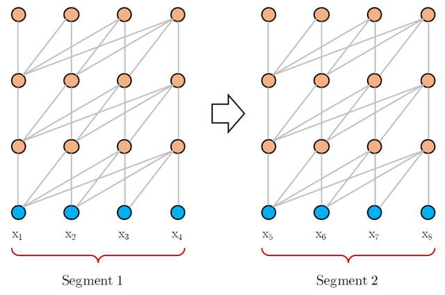
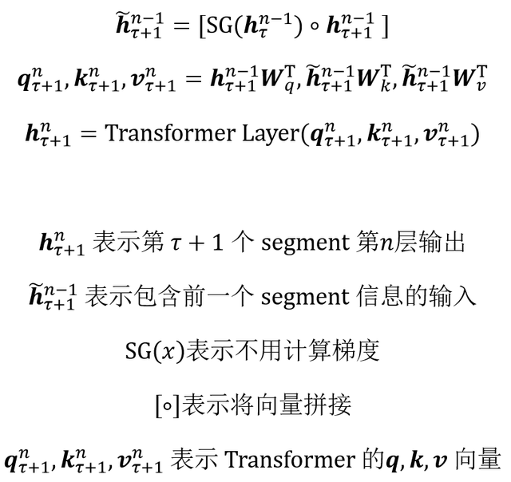
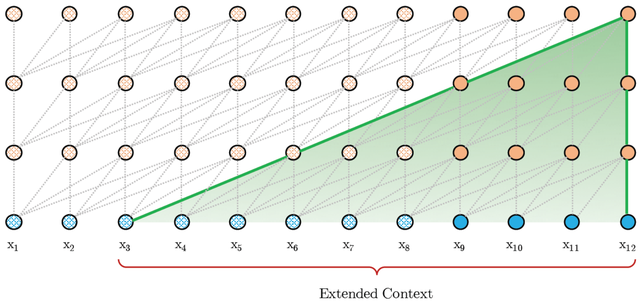
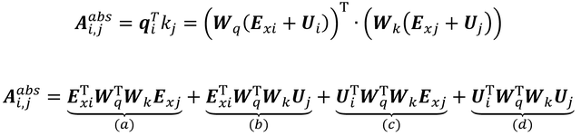
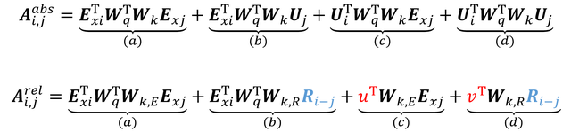
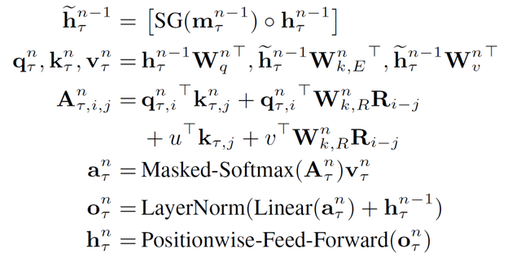

## Transformer-XL 语言模型

Transformer 是 Google 提出的一种先进的 NLP 模型，在很多任务上都取得比传统 RNN 更好的效果。Transformer 使用了 Self-Attention 机制，让单词之间可以直接建立联系，因此编码信息和学习特征的能力比 RNN 强。但是 Transformer 在学习长距离依赖信息的能力仍然有一些限制，Transformer-XL 是一种语言模型，可以提高 Transformer 学习长期依赖信息的能力。

**1. vanilla Transformer**

在介绍 Transformer-XL 之前，我们先了解另一种基于 Transformer 的训练语言模型的方法 **vanilla Transformer**，对 Transformer 不熟悉的童鞋可以参考之前的文章Transformer 模型详解。vanilla Transformer 在论文《Character-Level Language Modeling with Deeper Self-Attention》中被提出，下面介绍 vanilla Transformer 的训练过程和评估过程，从而了解其缺陷。

**1.1 vanilla Transformer 训练过程**

vanilla Transformer 训练过程

上图是 vanilla Transformer 训练语言模型的过程，可以看到，vanilla Transformer 训练语言模型时会根据之前的信息预测下一刻信息，例如在得到 [x1, x2, x3] 后可以预测 x3 对应的输出，此时会将 x3 之后的信息 mask 掉。

**但是 vanilla Transformer 训练的语言模型存在一个缺陷，它训练的过程中是将预料分为一段段训练的**，上图的训练数据分成两个 segment [x1, x2, x3, x4] 和 [x5, x6, x7, x8]。在训练第二个 segment 时，模型并不知道第一个 segment 的信息。例如有两个相连的句子，"我有一只猫" 和 "它不喜欢吃鱼"，如果 vanilla Transformer 把这两个句子分为两个 segment 分别训练，则训练第二个句子的时候，模型并不知道句子中的 "它" 的确切意思。

**1.2 vanilla Transformer 评估过程**

vanilla Transformer 评估过程

上图是 vanilla Transformer 在评估时的过程，可以看到，在预测输出的时候，模型每次需要向右移动一步，并根据新的上文序列预测此刻单词，例如第一幅图会根据 [x1, x2, x3, x4] 预测下一刻输出，第二幅图会根据 [x2, x3, x4, x5] 预测下一刻输出。

vanilla Transformer 会使用当前序列并从头开始预测，导致预测速度比较慢，且没有利用到更早的信息。例如上面的第二幅图，使用 [x2, x3, x4, x5] 进行预测，没有使用 x1 的信息。从头预测是指 Transformer 会走一遍训练时候的流程，先使用 x2 预测 x3，然后用 x2, x3 预测 x4，最后用 x2, x3, x4, x5 预测下一刻输出。

**1.3 vanilla Transformer 缺陷**

**长期依赖受限：**vanilla Transformer 将数据分段进行训练，每个 segment 中单词能得到的依赖关系限制在本这个 segment 中，无法使用长期依赖的信息。

**分段数据语义不完整：**vanilla Transformer 将数据分段的时候，是直接按照固定的长度划分语料库里面的句子，而不考虑句子的边界，使得分割出来的 segment 语义不完整。也就是说会将一个句子分到两个 segment 里面。

**评估时候速度慢：**在评估模型时，每预测一个单词，都要将该单词的上文重新计算一次，效率低下。

**2. Transformer-XL**

Transformer-XL 是 Google 在 2019 年提出的一种语言模型训练方法，为了解决 Transformer 长期依赖的问题，其论文是《Transformer-XL: Attentive Language Models Beyond a Fixed-Length Context》。Transformer-XL 主要有两个创新点：

第一、提出了 **Segment-Level Recurrence**，在 Transformer 中引入了循环机制，在训练当前 segment 的时候，会保存并使用上一个 segment 每一层的输出向量。这样就可以利用到之前 segment 的信息，提高 Transformer 长期依赖的能力，在训练时前一个 segment 的输出只参与前向计算，而不用进行反向传播。

第二、提出 **Relative Positional Encodings**，Transformer 为了表示每一个单词的位置，会在单词的 Embedding 中加入位置 Embedding，位置 Embedding 可以用三角函数计算或者学习得到。但是在 Transformer-XL 中不能使用这种方法，因为每一个 segment 都会存在相同位置的 Embedding，这样两个 segment 中同样位置的 Embedding 是一样的。因此 Transformer-XL 提出了一种新的位置编码方式，相对位置编码 (Relative Positional Encodings)。

**2.1 Segment-Level Recurrence**

Transformer-XL 的训练过程

上图是 Transformer-XL 的训练过程，可以看到 Transformer-XL 在训练一个新的 segment 时，会利用前一个 segment 的信息，如果内存或显存允许，也可以保留多个 segment。图中绿色的线段表示当前 segment 利用前一个 segment 的信息。

因此在训练一个 segment **τ+1**的时候，Transformer-XL 中第 **n** 层的输入包括：

segment **τ** 第 **n-1** 层的输出，图中绿色线段，不计算反向梯度。segment **τ+1** 第 **n-1** 层的输出，图中灰色线段，计算反向梯度。训练第 **τ+1** 个 segment 的时候，Transformer-XL 第 **n** 层的输出用下面的公式计算：

可以看到在训练第 **τ+1**个 segment 的时候，会使用前一个 segment 的信息计算 **k**, **v** 向量。注意计算第 n 个 Transformer 层的向量 **q** 时只利用了第 **τ+1** segment 的信息，即第 n-1 层的输出。

Transformer-XL 评估过程

上图是 Transformer-XL 评估阶段的示意图，在上一节我们了解到 vanilla Transformer 在评估的时候，一次只能往右前进一步输出一个单词，并且需要重头开始计算。而在 Transformer-XL 中，每次可以前进一个 segment，并且利用前面的 segment 预测当前的输出。

**Transformer-XL 可以支持的最长依赖近似于 O(NL)**，L 是一个 segment 的长度，N 是Transformer 的层数。Transformer-XL 支持的最长依赖如上图绿色区域所示。

**2.2 Relative Positional Encodings**

传统的 Transformer 使用位置 Embedding 来表示单词的位置，位置 Embedding 可以用三角函数计算或者通过训练得到。但是在 Transformer-XL 中利用了前一个 segment 的信息，如果采用传统的位置 Embedding 会导致模型无法区分当前 segment 和前一 segment 的单词，如下公式所示。

**E**表示单词的词向量，**U** 是位置向量，可以看到当前segment **τ+1** 的词向量与前一个 segment **τ** 的词向量相同位置的位置 Embedding 都是一样的。模型就不能判断某一个位置的词是属于哪个 segment。

为了解决这一问题，Transformer-XL 提出了**相对位置 Embedding**，首先看一下传统 Transformer 中计算 attention 分数的方法：

上面是 Transformer 计算 attention 分数的方法，**U**i 表示第 i 个位置的 Embedding，**U**j 表示第 j 个位置的 Embedding。Transformer-XL 去除了公式中的 **U**i 和 **U**j，因为 **U**i 和 **U**j 是对于固定位置的，所以 Transformer-XL 对公式进行如下改变。

Transformer-XL 将 Attention 分数计算公式进行了一些改变，去掉了里面所有**绝对位置 Embedding U 都去掉**了。

将公式中 (b) (d) 项中计算向量 **k** 的 **U**j 替换成了相对位置 Embedding **R**i-j，即只关心单词之间相对的位置。**R** 使用三角函数公式计算。在公式的 (c) (d) 项里面，向量 **q** 的计算部分替换成了两个可训练的向量 **u** 和 **v**，因为查询向量 **q** 对于每一个查询位置都是一样的，意味着无论查询位置在哪里，对不同单词注意力的偏向应该保持不变。将 **k** 向量的权重变换矩阵 **W**k 分成了两个，**W**k,E 和 **W**k,R，分别用于单词内容和单词位置。**2.3 Transformer-XL 整体计算公式**

经过上述两个机制 Segment-Level Recurrence 和 Relative Positional Encodings 后，Transformer-XL 的整体计算公式如下。

**3. Transformer-XL 总结**

Transformer-XL 在 vanilla Transformer 模型基础上改进，引入了 Segment-Level Recurrence 和 Relative Positional Encodings 两种机制使 Transformer 具有学习长期依赖的能力。Transformer-XL 可以支持的最长依赖近似于 O(NL)。后续 Google 提出的 XLNet 模型也利用 Transformer-XL 的结构。

**参考文献**

Character-Level Language Modeling with Deeper Self-Attention

Transformer-XL: Attentive Language Models Beyond a Fixed-Length Context