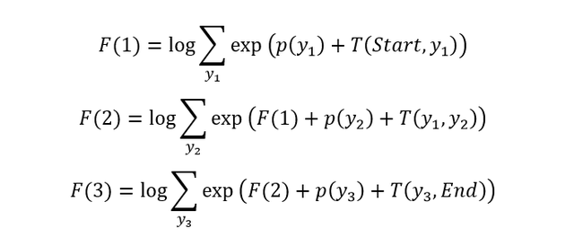
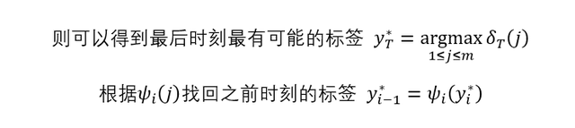

CRF 是一种常用的序列标注算法，可用于词性标注，分词，命名实体识别等任务。BiLSTM+CRF 是目前比较流行的序列标注算法，其将 BiLSTM 和 CRF 结合在一起，使模型即可以像 CRF 一样考虑序列前后之间的关联性，又可以拥有 LSTM 的特征抽取及拟合能力。

**1.前言**

在之前的文章CRF 条件随机场学习笔记中，介绍了条件随机场 CRF，描述了 CRF 和 LSTM 的区别。我们以分词为例，每个字对应的标签可以是 s, b, m, e 四种。

给定一个句子 "什么是地摊经济"，其正确的分词方式是 "什么 / 是 / 地摊 / 经济"，每个字对应的分词标签是 "be / s / be / be"。从下面的图片可以看出 LSTM 在做序列标注时的问题。

BiLSTM+CRF 分词

BiLSTM 可以预测出每一个字属于不同标签的概率，然后使用 Softmax 得到概率最大的标签，作为该位置的预测值。这样在预测的时候会忽略了标签之间的关联性，如上图中 BiLSTM 把第一个词预测成 s，把第二个词预测成 e。但是实际上在分词时 s 后面是不会出现 e 的，因此 BiLSTM 没有考虑标签间联系。

因此 BiLSTM+CRF 在 BiLSTM 的输出层加上一个 CRF，使得模型可以考虑类标之间的相关性，标签之间的相关性就是 CRF 中的转移矩阵，表示从一个状态转移到另一个状态的概率。假设 CRF 的转移矩阵如下图所示。

CRF 转移矩阵

则对于前两个字 "什么"，其标签为 "se" 的概率 =0.8×0×0.7=0，而标签为 "be" 的概率=0.6×0.5×0.7=0.21。

因此，BiLSTM+CRF 考虑的是整个类标路径的概率而不仅仅是单个类标的概率，在 BiLSTM 输出层加上 CRF 后，如下所示。

BiLSTM+CRF 分词

最终算得所有路径中，besbebe 的概率最大，因此预测结果为 besbebe。

**2.BiLSTM+CRF 模型**

CRF 包括两种特征函数，不熟悉的童鞋可以看下之前的文章。第一种特征函数是状态特征函数，也称为发射概率，表示字 x 对应标签 y 的概率。

在 BiLSTM+CRF 中，这一个特征函数 (发射概率) 直接使用 LSTM 的输出计算得到，如第一小节中的图所示，LSTM 可以计算出每一时刻位置对应不同标签的概率。

CRF 的第二个特征函数是状态转移特征函数，表示从一个状态 y1 转移到另一个状态 y2 的概率。

CRF 的状态转移特征函数可以用一个状态转移矩阵表示，在训练时需要调整状态转移矩阵的元素值。因此 BiLSTM+CRF 需要在 BiLSTM 的模型内增加一个状态转移矩阵。在代码中如下。

class BiLSTM_CRF(nn.Module):

def __init__(self, vocab_size, tag2idx, embedding_dim, hidden_dim):

self.word_embeds = nn.Embedding(vocab_size, embedding_dim)

self.lstm = nn.LSTM(embedding_dim, hidden_dim // 2,

num_layers=1, bidirectional=True)

\# 对应 CRF 的发射概率，即每一个位置对应不同类标的概率

self.hidden2tag = nn.Linear(hidden_dim, self.tagset_size)

\# 转移矩阵，维度等于标签数量，表示从一个标签转移到另一标签的概率

self.transitions = nn.Parameter(

torch.randn(len(tag2idx), len(tag2idx))

给定句子 x，其标签序列为 y 的概率用下面的公式计算。

公式中的 score 用下面的式子计算，其中 Emit 对应发射概率 (即 LSTM 输出的概率)，而 Trans 对应了转移概率 (即 CRF 转移矩阵对应的数值)

BiLSTM+CRF 采用最大似然法训练，对应的损失函数如下：

其中 score(x,y) 比较容易计算，而 Z(x) 是所有标签序列 (y) 打分的指数之和，如果序列的长度是 l，标签个数是 k，则序列的数量为 (k^l)。无法直接计算，因此要用前向算法进行计算。

用目前主流的深度学习框架，对 loss 进行求导和梯度下降，即可优化 BiLSTM+CRF。训练好模型之后可以采用 viterbi 算法 (动态规划) 找出最优的路径。

**3.损失函数计算**

计算 BiLSTM+CRF 损失函数的难点在于计算 log Z(x)，用 F 表示 log Z(x)，如下公式所示。

我们将 score 拆分，变成发射概率 p 和转移概率 T 的和。为了简化问题，我们假设序列的长度为3，则可以分别计算写出长度为 1、2、3 时候的 log Z 值，如下所示。

上式中 p 表示发射概率，T 表示转移概率，Start 表示开始，End 表示句子结束。F(3) 即是最终得到的 log Z(x) 值。通过对上式进行变换，可以将 F(3) 转成递归的形式，如下。

可以看到上式中每一步的操作都是一样的，操作包括 **log_sum_exp**，例如 F(1)：

首先需要计算 exp，对于所有 y1，计算 exp(p(y1)+T(Start,y1))求和，对上一步得到的 exp 值进行求和求 log，对求和的结果计算 log因此可以写出前向算法计算 log Z 的代码，如下所示：

def forward_algorithm(probs):

"""

probs: LSTM 输出的概率值，尺寸为 [seq_len, num_tags]，num_tags 是标签的个数

\# forward_var (可以理解为文章中的 F) 保存前一时刻的值，是一个向量，维度等于 num_tags

\# 初始时只有 Start 为 0，其他的都取一个很小的值 (-10000.)

forward_var = torch.full((1, num_tags), -10000.0) # [1, num_tags]

forward_var[0][Start] = 0.0

for p in probs: # probs [seq_len, num_tags]，遍历序列

alphas_t = [] # alphas_t 保存下一时刻取不同标签的累积概率值

for next_tag in range(num_tags): # 遍历标签

\# 下一时刻发射 next_tag 的概率

emit_score = p[next_tag].view(1, -1).expand(1, num_tags)

\# 从所有标签转移到 next_tag 的概率, transitions 是一个矩阵，长宽都是 num_tags

trans_score = transitions[next_tag].view(1, -1)

\# next_tag_ver = F(i-1) + p + T

next_tag_var = forward_var + trans_score + emit_score

alphas_t.append(log_sum_exp(next_tag_var).view(1))

forward_var = torch.cat(alphas_t).view(1, -1)

terminal_var = forward_var + self.transitions[Stop] # 最后转移到 Stop 表示句子结束

alpha = log_sum_exp(terminal_var)

return alpha

**4.viterbi 算法解码**

训练好模型后，预测过程需要用 viterbi 算法对序列进行解码，感兴趣的童鞋可以参看《统计学习方法》。下面介绍一下 viterbi 的公式，首先是一些符号的意义，如下：

然后可以得到 viterbi 算法的递推公式

最终可以根据 viterbi 计算得到的值，往前查找最合适的序列

最后推荐大家阅读 pytorch 官网的 BiLSTM+CRF 代码，通过代码更容易理解。

**5.参考文献**

ADVANCED: MAKING DYNAMIC DECISIONS AND THE BI-LSTM CRF