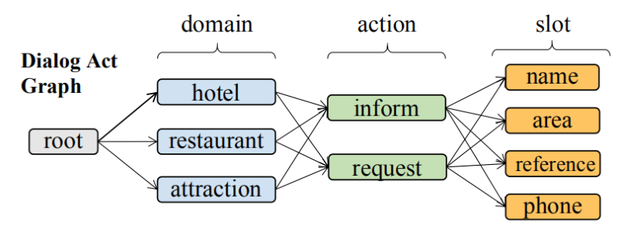
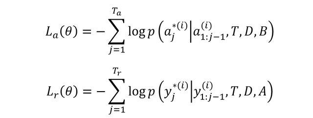

## MARCO 多领域任务型对话行为 (Act) 与回答 (Response) 同时生成

任务型对话指在特定领域 (domain) 中，预先定义好一些任务的行为 (Act，也称为意图) 和一些属性槽 (Slot)，然后根据用户的语句回答用户的问题。多领域任务型对话是指存在多个领域 (domains)。传统的方法通常是使用 pipeline，即先识别出用户语句中的行为 (Act)，然后再用识别的结果帮助生成回答 (Response)。本文介绍的 MARCO 是 2020 年提出的多领域对话算法，可以同时生成对话行为和回答。

**1.多领域任务型对话**

在一些特定的领域的对话系统中，通常需要根据一些预先定义好的行为 (Act) 和对象属性槽 (Slot) 来回答用户的咨询。例如在餐饮领域中，常见的行为有请求 (requeste) 、推荐 (recommend)、通知 (inform) 等，常见的对象属性槽有食物 (food)、区域 (area) 等。

而多领域任务型对话是指有多个领域 (domain)，即除了要预先定义好行为 (Act) 和对象属性槽 (Slot)，还要定义支持的领域，如餐饮 (restaurant)、酒店 (hotel)、出租车 (taxi) 等。多领域任务型对话通常包括两个部分，首先根据用户的输入判断 Domain-Act-Slot 三元组，然后根据三元组生成回答，如下图所示 (图中的 Belief State 保存当前已经确定的所有信息)。

多领域任务型对话例子

上图中，模型首先根据当前用户的输入和 Belief State 确定当前的 Domain-Act-Slot，上图中有三个三元组，restaurant-inform-area、restaurant-inform-choice、restaurant-request-food。inform 指通知，即返回一些信息给用户，这里需要通知的是 area 和 choice，因此系统回答中包含了 center 和 60 种选择。然后系统需要确定用户想吃什么类型的食物，因此需要 request (咨询) 用户食物的种类。

MultiWOZ 是一个多领域任务型对话数据集，里面包含多种 Domain、Act 和 Slot，下面是部分例子。

MultiWOZ 数据集例子

传统的方法在处理多领域任务型对话时，通常包含两个部分：Domain-Act-Slot 分类，回答生成。其中分类主要有层级分类和 Multiple Binary 分类两种，如下图所示：

层级分类

Multiple Binary 分类

但是上面的 Domain-Act-Slot 分类方法存在一些问题：

用户的每次输入通常对应了多个不同的 Act，分布在不同的子序列中。但是分类方法通常用一个 vector 来表示整个用户输入，不能很好地捕获 Act 之间的相互关系。不能灵活地用于后续的 Response 生成，特别是有多个 Act 的时候。为了解决上述问题，MARCO 算法对 Domain-Act-Slot 生成看成是一种序列生成问题，和 Response 生成类似，并且可以联合生成 Domain-Act-Slot 和 Response。通过序列生成的方法得到 Domain-Act-Slot 可以更好地保存 Domain、Act 和 Slot 的内在关系，并且可以与后续 Response 生成进行交互。Domain-Act-Slot 生成的示意图如下。

MARCO 生成 Act 序列

**2.MARCO**

MARCO 结构图

MARCO 的模型结构如上图所示，其主要包括三个部分，Encoder、Act Generator 和 Response Genterator，这三个部分都是基于 Transformer 的，不熟悉 Transformer 的童鞋可以参考之前的文章Transformer 模型详解。

Encoder 部分的输入是之前对话的内容和对应领域的数据库中的属性，然后生成 Encoder Transformer 隐藏向量。Act Generator 使用 Act 序列 (以 <SOS> 开头，类似语言模型一样进行预测) 和 Belief States 作为输入，结合 Encoder 的输出，生成 Act 序列和对应的 Transformer 隐藏向量。Response Generator 使用 <SOS> 开头进行 Response 预测，结合 Act 和 Encoder 输出的 Transformer 隐藏向量。

**2.1 Encoder**

Transformer 需要传入 Q、K、V 对应的向量矩阵 (输入，用于计算 Q、K、V)，然后经过 Multi-Head Attention 和 Feed Forward 层得到 Transformer 编码的隐藏向量，如下式，F 表示 Transformer 操作：

Transformer 操作

Encoder 采用的也是 Transformer 结构，其输入包括用户的历史信息 Ui 、系统的历史回答 Ri、用户当前时刻的输入 Ut 和对应数据库的属性。Encoder 的输入 E 如下：

Encoder 的输入 E

把 E 传入 Transformer 中，可以得到 Encoder 编码的信息 He：

Encoder 的输出

**2.2 Act Generator**

Act Generator 采用序列生成的方式得到 Domain-Act-Slot 的信息，如果三元组包括：restaurant-inform-area、restaurant-inform-choice、restaurant-request-food，则生成的序列应该为：[restaurant、inform、request、area、choice、food]。按照 Domain、Act、Slot 顺序排列，如果同一类的则按字典序排列。

以上面的序列为例，Act Generator 输入的序列应为 [<SOS>、restaurant、inform、request、area、choice]，输出的序列应为 [restaurant、inform、request、area、choice、food]。和语言模型的序列类似。用向量 A 表示 Act Generator 的输入序列：

Act Generator 输入序列

找出输入序列 A 的每一个 token 的 Embedding，然后加上 Belief States 中单词的 Embedding，就是 Act Generator 的输入：

Act Generator 输入

上面公式的 W 为线性变换，把 Ua 和 Encoder 的输出一起传到 Transformer Decoder 中，得到 Act 的输出表征 Ha：

Act Generator 输出

可以用输出表征 Ha 和 Softmax 预测 Act 的输出序列。

**2.3 Response Generator**

Response 序列预测时，输入的序列 R 如下：

Response Generator 输入序列

对于 t 时刻，可以得到对应的表征向量：

Response Generator t 时刻的表征向量

把 t 时刻的表征向量分别和 Encoder、Act Generator 的输出向量传入 Decoder，可以得到：

Response Generator 结合 Encoder 和 Act

最后拼接上述三个向量，预测 t 时刻输出的单词：

预测 t 时刻单词

**2.4 损失函数 Uncertainty Loss**

MARCO 的损失函数由两部分组成，Act Generator 损失和 Response Generator 损失：

MARCO 两个损失

作者使用了一种 Uncertainty Loss 把上面两部分结合在一起，包含两个可以训练的参数 σ，自适应地融合两部分损失：

Uncertainty Loss

**3.参考文献**

Multi-Domain Dialogue Acts and Response Co-Generation

MultiWOZ - A Large-Scale Multi-Domain Wizard-of-Oz Dataset for Task-Oriented Dialogue Modelling