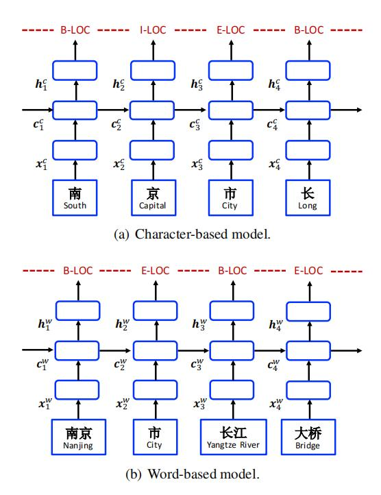
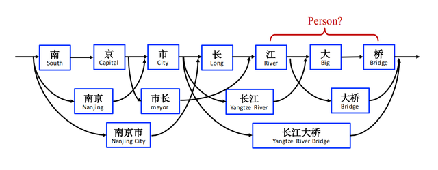
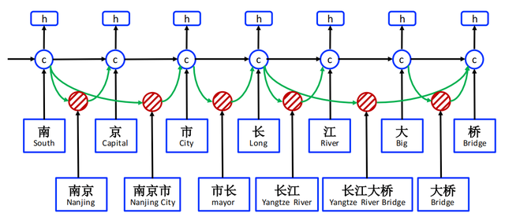
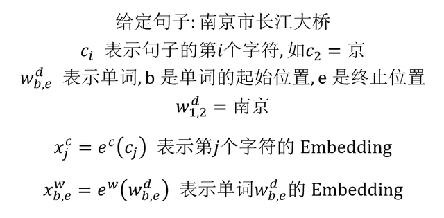
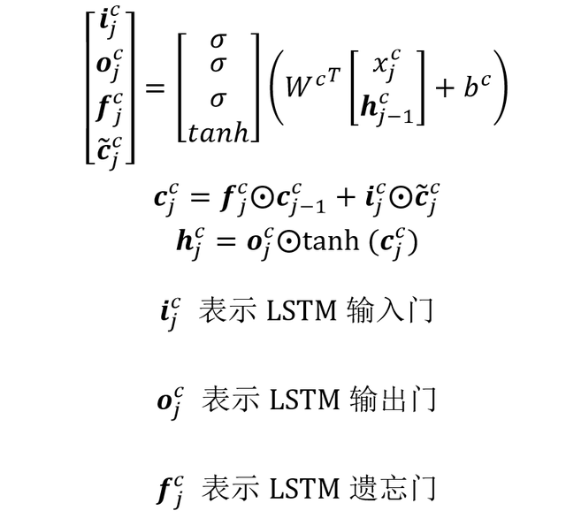
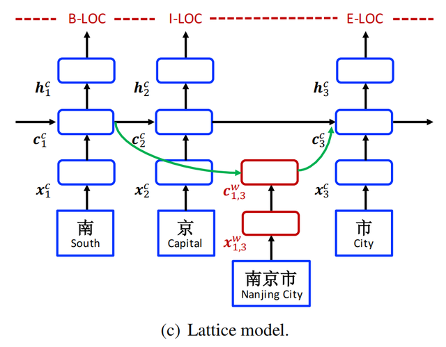
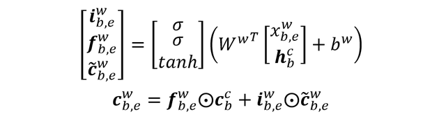
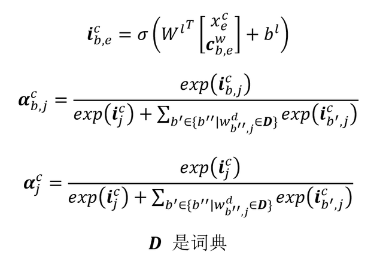
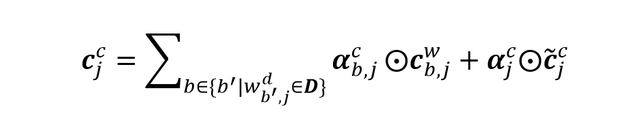

## 中文命名实体识别算法 Lattice LSTM

中文命名实体识别 (NER) 算法按照输入的类型，可以大致分为 Character-based (字符) 和 Word-based (单词) 两种。这两种方法都存在一些缺陷，Character-based 不能利用词汇和词汇序列信息；Word-based 需要分词，分词的错误会对 NER 结果产生较大影响。因此新加坡的研究者在 2018 年提出了一种 Lattice LSTM 的算法，可以利用词汇信息，也可以避免分词错误对模型的影响。

**1.前言**

基于字符和基于单词的 LSTM 模型

如上图所示，中文命名实体识别 NER 主要有 Character-based (基于字符) 方法和 Word-based (基于单词) 方法：基于单词的方法首先会利用分词模型对句子分词，然后把分好的单词序列传递到 NER 模型中预测实体。基于字符的方法不对句子分词，每一个 token 就是一个汉字，直接将 token 序列传递到 NER 模型预测实体。但是这两种方法都存在一些问题：

基于字符的方法不能利用词汇和词汇序列的信息，而这些信息对于实体识别通常很重要。基于单词的方法需要经过分词模型和 NER 模型，分词中产生的错误会传递到 NER 模型中。这种分词边界的错误会导致 NER 模型出错，这种情况在开放领域的 NER 任务中尤其严重。基于上面的原因，新加坡的研究人员于 2018 年提出了 Lattice LSTM 模型，论文《Chinese NER Using Lattice LSTM》。Lattice LSTM 会利用词典匹配句子中的单词，然后构造出字符和单词的网格 (Lattice)。Lattice LSTM 的神经元会同时接收字符和单词的信息，自动选择合适的字符或单词，实现消除歧义的功能，如下图所示。

单词-字符 Lattice

**2.Lattice LSTM**

Lattice LSTM 结构图

上图展示了 Lattice LSTM 的结构，可以看成是 Char-LSTM 的扩展版。Lattice LSTM 在 Char-LSTM 的基础上增加了 word-base cell 和额外的门结构，用于控制和选择信息流。

Lattice LSTM 用到的一些数学符号如下图所示：

Lattice LSTM 数学符号

我们首先看一下传统 Char-LSTM 的计算公式，对于 LSTM 不熟悉的童鞋可以参考之前的文章循环神经网络 RNN、LSTM、GRU。Char-LSTM 输出主要包括 cell state **c**和 hidden state **h**，计算公式如下：

传统 Char-LSTM 计算公式

上面是 Char-LSTM 的计算公式，Lattice LSTM 在这基础上增加了 word-base cell，用于计算单词子序列的 cell state **c**。下面的图展示了 word-base cell 的结构：

Lattice LSTM 细节图

Word-base cell 计算公式如下，生成一个包含单词信息的 cell state：

word-base cell 计算 cell state

在上式中，word-base cell 是不包括输出门向量的，因为 Lattice LSTM 只在 Char-LSTM 上输出。得到 word-base 的 cell state 后，Lattice 需要融合到 Char-LSTM 的 cell state 上，这一过程需要增加一个输入门向量，并且要对输入门向量进行归一化，如下所示：

输入门向量归一化

最终 Lattice LSTM 得到第 j 个字符的 cell state 如下：

Lattice LSTM cell state 计算

Lattice LSTM 的 hidden state **h**计算公式和 Char-LSTM 是一样的，最终把 **h** 传递到 CRF 层即可进行命名实体识别。

**3.总结**

Lattice LSTM 优点：

可以同时利用中文字符和单词的信息，通过增加 word-base cell 和控制门，对字符和单词的信息进行选择，消除歧义。Lattice LSTM 缺点：

因为字符之间增加单词节点的个数是不同的，因此 Lattice LSTM 不支持 batch 训练。如果句子中匹配的单词过多，会导致 Lattice LSTM 效果变差 (可能会退化成为基于单词的 LSTM)，受到分词错误的影响。**4.参考文献**

Chinese NER Using Lattice LSTM