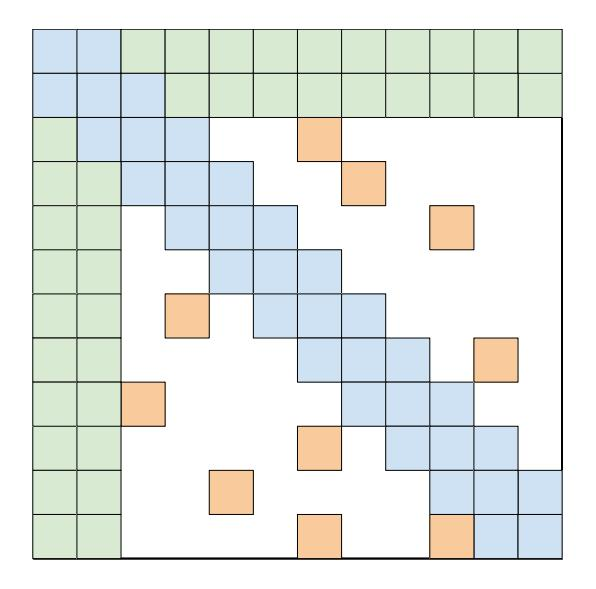
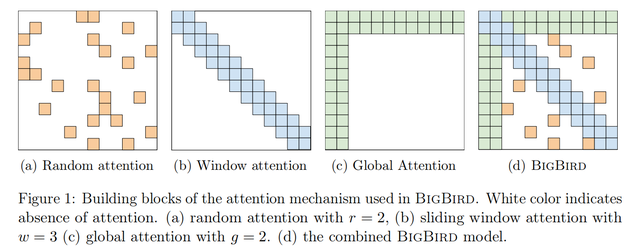
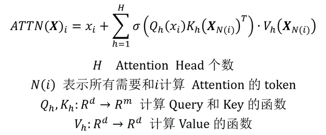
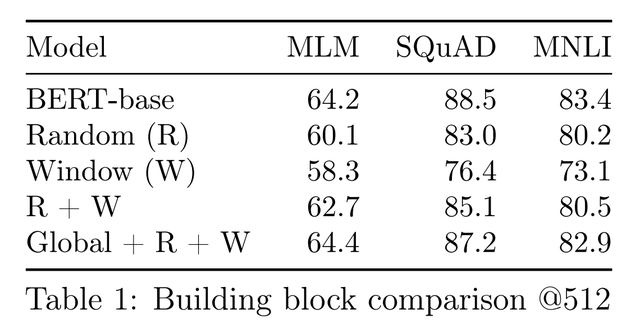
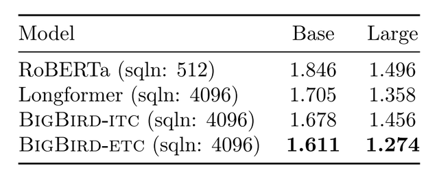

## Big Bird：支持更长序列的 Transformer

Transformer 是目前 NLP 研究领域中特别重要的模型，也衍生出了很多基于 Transformer 的方法，例如 BERT、GPT，在很多 NLP 任务中有很好的效果。但是这些模型也存在一些局限，其中包括 Self-Attention 的复杂度问题 (其复杂度是输入序列长度的平方)。Google 的研究人员提出了 Big Bird 模型，使用了稀疏注意力机制，将复杂度降到线性。

Big Bird 稀疏注意力

**1.前言**

Transformer 模型克服了 RNN 的限制，采用全局的 Attention，可以捕获序列所有 token 的信息。对于 Transformer 不熟悉的童鞋可以参考一下Transformer 模型详解。

由于使用了全局的 Attention，所以 Transformer 具有比较高的复杂度，其复杂度与序列长度的平方成正比，O(N^2)。导致 Transformer 不适合用于更长的序列 (原始的 Transformer 序列长度为 512)，而 NLP 领域有一些任务需要采用更长的序列，例如文章摘要，问答。

Big Bird 出自论文《Big Bird: Transformers for Longer Sequences》。其借鉴了图结构的稀疏化方法， 采用一种稀疏注意力机制，将复杂度下降到线性，即 O(N)。Big Bird 可以在 16 GB 内存下适应更长的序列 (Transformer 的 8 倍)，并且得到更好的性能。

**2.Big Bird**

Big Bird 稀疏注意力机制

上图是 Big Bird 稀疏注意力的示意图，主要包括三个部分的注意力：Random Attention (随机注意力)，Window Attention (局部注意力)，Global Attention (全局注意力)。这三部分注意力结合在一起就可以得到 Big Bird 注意力矩阵 **A**，如上图 d 所示。如果 **A**(i,j) = 1 则表示 token i 需要和 token j 计算注意力值。

**Random Attention:** 如上图 (a) 所示，对于每一个 token i，随机选择 r 个 token 计算注意力。

**Window Attention:** 用滑动窗口表示注意力计算的范围，如上图 (b) 所示，主要是捕获 token i 的局部信息，窗口大小为 w。

**Global Attention:** 全局 Attention，如上图 (c) 所示，Big Bird 将 g 个 token 设置为 global token，所有 token 都要和 global token 计算 Attention Score。global token有两种定义的方式：

BIGBIRD-ITC，在原始序列中选择 g 个 token 作为 global token。BIGBIRD-ETC，增加 g 个额外的 token，类似 BERT 中的 [CLS] token。Big Bird 的输入序列为 **X**，包含 N 个 token，每个 token 的向量长度为 d，如下所示：

Big Bird 输入序列

对于 token i，经过 Big Bird 稀疏注意力模块输出的向量用下面的公式计算：

Big Bird 注意力计算公式

**3.实验结果**

Big Bird 包含三部分 Attention：Random，Window，Global。作者验证了三种 Attention 对性能的影响，结果如下表所示，序列的长度为 512。使用全部三种 Attention 后，Big Bird 可以得到和 BERT-base 相近的性能。

Big Bird 三部分 Attention 对性能的影

然后作者在 MLM (masked languagemodeling) 任务上对比 Big Bird 和 RoBERTa 的性能，对 RoBERTa 不熟悉的童鞋可以参考一下RoBERTa 和 ALBERT。实验结果如下表所示，Big Bird 使用更长的序列 (4096)，取得更好的性能。

在 MLM 任务上的实验结果

作者也在问答，文本分类，文本摘要等任务上对比了 Big Bird 的性能，具体的可以查看原论文。总的来说 Big Bird 在一定程度上减少了 Transformer 的复杂度，使模型可以更好地用于长序列。

**4.参考文献**

Big Bird: Transformers for Longer Sequences