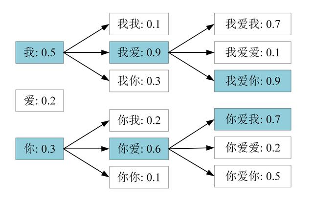
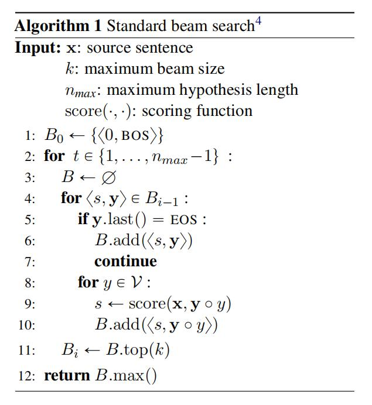
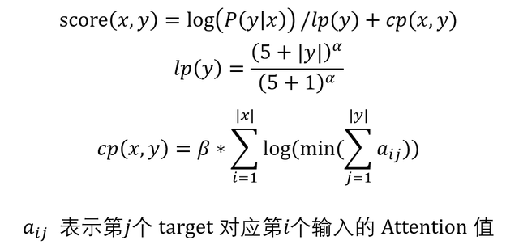
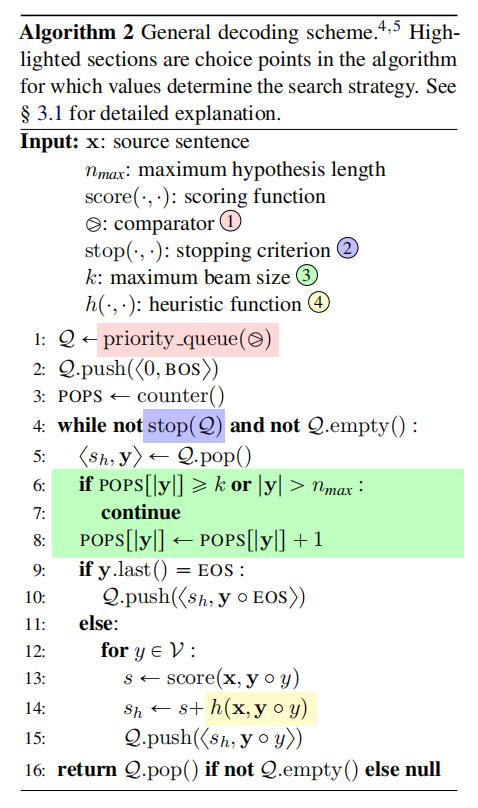
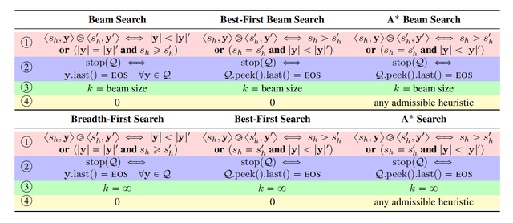

## 详细介绍 Beam Search 及其优化方法

Beam Search 是一种受限的宽度优先搜索方法，经常用在各种 NLP 生成类任务中，例如机器翻译、对话系统、文本摘要。本文首先介绍 Beam Search 的相关概念和得分函数优化方法，然后介绍一种新的 Best-First Beam Search 方法，Best-First Beam Search 结合了优先队列和 A* 启发式搜索方法，可以提升 Beam Search 的速度。

**1.Beam Search**

在生成文本的时候，通常需要进行解码操作，贪心搜索 (Greedy Search) 是比较简单的解码。假设要把句子 "I love you" 翻译成 "我爱你"。则贪心搜索的解码过程如下：

贪心搜索解码过程

贪心搜索每一时刻只选择当前最有可能的单词，例如在预测第一个单词时，"我" 的概率最大，则第一个单词预测为 "我"；预测第二个单词时，"爱" 的概率最大，则预测为 "爱"。贪心搜索具有比较高的运行效率，但是每一步考虑的均是局部最优，有时候不能得到全局最优解。

**Beam Search 对贪心搜索进行了改进，扩大了搜索空间**，更容易得到全局最优解。Beam Search 包含一个参数 beam size k，表示每一时刻均保留得分最高的 k 个序列，然后下一时刻用这 k 个序列继续生成。下图展示了 Beam Search 的过程，对应的 k=2：

Beam Search 解码过程

在第一个时刻，"我" 和 "你" 的预测分数最高，因此 Beam Search 会保留 "我" 和 "你"；在第二个时刻的解码过程中，会分别利用 "我" 和 "你" 生成序列，其中 "我爱" 和 "你爱" 的得分最高，因此 Beam Search 会保留 "我爱" 和 "你爱"；以此类推。

Beam Search 的伪代码如下：

Beam Search 伪代码

每一步 Beam Search 都会维护一个 k-最大堆 (即伪代码中的 B)，然后用上一步的 k 个最高得分的序列生成新序列，放入最大堆 B 里面，选出当前得分最高的 k 个序列。伪代码中的 score 是得分函数，通常是对数似然：

对数似然得分函数

**2.Beam Search 得分函数优化**

**2.1 length normalization 和 coverage penalty**

这个方法是论文《Google’s Neural Machine Translation System: Bridging the Gap between Human and Machine Translation》中提出的。包含两个部分 length normalization 和 coverage penalty。

在采用对数似然作为得分函数时，Beam Search 通常会倾向于更短的序列。因为对数似然是负数，越长的序列在计算 score 时得分越低 (加的负数越多)。在得分函数中引入 length normalization 对长度进行归一化可以解决这一问题。

coverage penalty 主要用于使用 Attention 的场合，通过 coverage penalty 可以让 Decoder 均匀地关注于输入序列 x 的每一个 token，防止一些 token 获得过多的 Attention。

把对数似然、length normalization 和 coverage penalty 结合在一起，可以得到新的得分函数，如下面的公式所示，其中 lp 是 length normalization，cp 是 coverage penalty：

length 和 coverage penalty

**2.2 互信息得分函数**

在对话模型中解码器通常会生成一些过于通用的回复，回复多样性不足。例如不管用户问什么，都回复 "我不知道"。为了解决对话模型多样性的问题，论文《A Diversity-Promoting Objective Function for Neural Conversation Models》中提出了采用最大化互信息 MMI (Maximum Mutual Information) 作为目标函数。其也可以作为 Beam Search 的得分函数，如下面的公式所示。

互信息得分函数

最大化上面的得分函数可以提高模型回复的多样性，即需要时 p(y|x) 远远大于 p(y)。这样子可以为每一个输入 x 找到一个专属的回复，而不是通用的回复。

**3.更高效的 Beam Search**

论文《Best-First Beam Search》关注于提升 Beam Search 的搜索效率，提出了 Best-First Beam Search 算法，Best-First Beam Search 可以在更短时间内得到和 Beam Search 相同的搜索结果。论文中提到 Beam Search 的时间和得分函数调用次数成正比，如下图所示，因此作者希望通过减少得分函数的调用次数，从而提升 Beam Search 效率。

运行时间和得分函数调用次数关系

Best-First Beam Search 使用了优先队列并定义新的比较运算符，从而可以减少调用得分函数的次数，更快停止搜索。另外 Best-First Beam Search 也可以结合 A* 搜索算法，在计算得分时加上一些启发函数，对于 A* 不了解的读者可以参考下之前的文章A* 路径搜索算法。

**3.1 减少调用得分函数的次数**

**Beam Search 使用的得分函数是对数似然 log p，log p 是一个负数，则 Beam Search 的得函数是一个关于序列长度 t 单调递减的函数，即 t 越大得分越低。**Best-First Beam Search 就是利用这一特性，不去搜索那些必定不是最大得分的路径。

传统的 Beam Search 每一个时刻 t 均会保留 k 个最大得分的序列，然后对于这 k 个序列分别生成 t+1 时刻的序列。但是其中有一些搜索是没有必要的，只需要一直搜索当前得分最大的序列 (如果有两个得分最大的序列，则搜索更短的那个序列) ，直到得分最大的序列已经结束 (即生成结束符)。

**3.2 通用的 Beam Search 伪代码**

作者给出了一种通用的 Beam Search 伪代码，伪代码包括 4 种可替换的关键成分。传统的 Beam Search、Best-First Beam Search 和 A* Beam Search 都可以通过修改伪代码的可替换成分得到。伪代码如下：

通用的 Beam Search 伪代码

伪代码包括 4 个可替换部分：

粉红色部分为优先队列 Q 的比较函数 comparator，通过 comparator 对比两个预测序列的优先级。预测序列用 <s,y> 表示，y 是序列，s 是序列对应的得分。紫色部分是停止搜索的条件。绿色部分是 beam size k，POPS 用于统计长度为 |y| 的序列个数，如果长度为 |y| 的序列超过 k 个，就不进行处理 (和传统 Beam Search 保留 k 个是一样的意思)。黄色部分是启发函数，A* Beam Search 才会使用。通过修改这 4 个部分，就可以分别得到 Beam Search、Best-First Beam Search 和 A* Beam Search，具体定义如下图所示。图中第一行的 3 种均是 Beam Search 方法，第二行的 3 种是传统的搜索方法 (即 k=∞)。我们首先看一下 Beam Search，Beam Search 的 comparator 如下：

不同 Beam Search 生成的方式

**3.3 实验结果**

Best-First Beam Search 实验结果

可以看到 Best-First Beam Search 可以减少得分函数的调用次数，k 值越大能够减少的次数越多。

**4.参考文献**

Best-First Beam Search

Google’s Neural Machine Translation System: Bridging the Gap between Human and Machine Translation

A Diversity-Promoting Objective Function for Neural Conversation Models