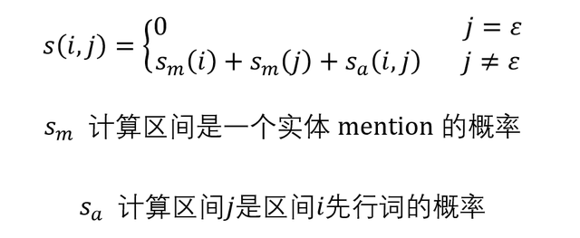
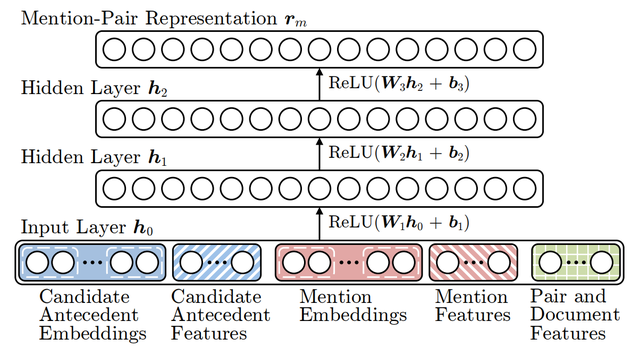

## 端到端指代消解算法 Coreference Resolution

指代消解 (Coreference Resolution) 是 NLP 里面一种常见的任务， 可以识别一段文本中指代相同对象的部分。在 2017 年之前指代消解通常要利用语法解析和手动特征工程等技术，效果不理想。本文介绍第一篇使用神经网络进行端到端指代消解的论文《End-to-end Neural Coreference Resolution》，该方法超越了之前的所有指代消解方法，后续很多技术都用到了这一论文的思想。

**1.前言**

指代消解 (Coreference Resolution) 是 NLP 里面一种常见的任务， 主要用于识别一段文本中指示相同实体的内容，通常是名字和代词。下面是指代消解的一个例子，句子中一共有三个实体对象 (我，姐姐，书)，其中 "姐姐" 和 "她" 都是指代同一实体：

指代消解例子

在 2017 年之前，主流的指代消解方法通常需要用到语法解析和手工构造特征，这种做法存在一些缺点：

语法解析出现的错误会传递到下一个模型中。手工构造特征不够灵活，也很难用于不同的语言中。《End-to-end Neural Coreference Resolution》是第一篇使用神经网络对指代消解进行端到端 (End-to-end) 处理的论文，其性能也超过了之前的模型。在介绍模型之前，首先看一下指代消解中的一些术语：

mention 可以理解为文本中的实体antecedent 指先行词，例如句子 "我的姐姐把她的书给了我" 中 "姐姐" 和 "她" 指代相同，"姐姐" 出现在 "她" 之前，因此 "姐姐" 是 "她" 的先行词。coreferent 共指关系，例如上面的 "姐姐" 和 "她" 之间存在共指关系。cluster 表示簇，一个簇里面的所有词指代同一个对象。

指代消解的一些术语

**2.端到端模型**

**2.1 模型的主要思想**

模型的主要思想是**把文本中所有区间 (span) 都考虑上，并计算两两区间指代同一对象的概率**。例如句子 "猫吃鱼" 里面包含 6 个区间 "猫"、"吃"、"鱼"、"猫吃"、"吃鱼"、"猫吃鱼"。假设句子的长度为 T，则区间总数 N = (T+1)T/2。

对于区间 i，它的起始位置用 START(i) 表示，结束位置用 END(i) 表示。区间按照 START 从小到大排序，如果 START 一样则按照 END 从小到大排序。区间 i 所有可能的先行词集合用 Y(i) 表示，如下面的公式所示，其中的 ε 表示区间 i 没有先行词。

区间 i 的所有可能的先行词

函数 s(i,j) 计算区间 i 和区间 j 指代同一对象的得分，其计算公式如下：

区间 i,j 指代同一对象的得分

模型需要最大化下面的条件概率：

最大化条件概率

**2.2 模型结构**

模型的结构主要分为两个部分，**第一部分 Span Representations**，负责计算每一个区间 (span) 的表征向量；**第二部分 Scoring Architecture**，负责计算该区间是一个实体的概率、两区间指代同一对象的概率。

模型第一部分 Span Representations 的结构图如下：

Span Representations

模型的输入是每一个单词的表征向量，表征向量包括两部分：固定的预训练词向量、对字母进行一维卷积得到的向量。作者认为区间的上下文信息和区间内部的信息都很重要，因此采用了 Bi-LSTM 编码区间内部和外部的信息。经过 Bi-LSTM 可以得到单词 t 双向的表征向量，下面公式中的 1 和 -1 分别代表 Bi-LSTM 的两个方向：

Bi-LSTM 的输出

作者采用了 Attention 机制计算区间内部的表征向量，区间 i 的表征向量计算公式如下：

计算区间内部表征向量

最终输出的区间表征向量为 g，如下面的公式，公式中前两项 START 和 END 保存了区间外部的上下文信息，第三项保存了区间内部信息，最后一项 Φ(i) 是一个额外的特征，用于编码区间 i 的尺寸。

区间表征向量

模型的第二部分负责计算区间是实体的概率以及两区间指代同一对象的概率，其结构如下：

Scoring Architecture

模型首先需要计算每一个区间是实体 (mention) 的得分 sm，即图中的黑色节点。然后需要计算该区间和之前区间指代同一对象的得分 sa，即图中白色节点。这两个得分的计算公式如下，公式中的 Φ(i,j) 是一些额外信息 (例如 speaker 和 genre) 的编码向量：

得分 sm 和 sa 计算公式

把这些相加就是区间 i 和区间 j 指代同一对象的得分：

区间 i,j 指代同一对象的得分

模型学习的复杂度为 O(T^4)，为了减小复杂度，作者使用了一些优化方式：

区间的长度不超过 L计算区间是一个实体分数 sm 后，只保留 λT 个得分最高的区间，T 为文本长度每个区间只考虑 K 个可能的先行词**3.实验结果**

作者和之前的指代消解算法进行了对比，结果如下，可以看到新方法的效果最好。ensemble 是作者结合了 5 个用不同的初始化训练的模型，single 是单一模型。

和不同算法的对比

作者也尝试移除模型中部分特征，对比不同特征的重要性，结果如下表所示。其中 distance and width feature、Glove embeddings、spearker and genre metadata、head-finding attention 这些特征是比较重要的，移除这些特征性能会有比较大的下降。

不同特征重要性实验

模型只保留 λT 个得分最高的区间，作者测试了不同 λ 对 Recall 值的影响，如下图所示。

不同 λ 对 Recall 值的影响

**4.参考文献**

End-to-end Neural Coreference Resolution

## 基于聚类的指代消解算法

指代消解 (Coreference Resolution) 任务主要是识别文本中代表同一对象的实体 (Mention)，例如 "小明告诉我他的想法" 里面的 "小明" 和 "他" 均指代小明。指代消解方法通常包括两个步骤：1. 识别 Mention；2.判断 Mention 之间是否指代相同对象。比较常见的判断方法是把两个 Mention 的特征传入神经网络，然后计算得分。本文介绍一种基于聚类的指代消解方法，每一个簇包含多个指代相同的 Mention，并利用簇的特征判断两个簇是否能融合。

**1.前言**

在之前的文章端到端指代消解算法 Coreference Resolution介绍了一种指代消解方法，其主要思想是把先判断文本的所有区间是否属于 Mention，然后再计算区间指代一致的得分。对于指代消解概念不熟悉的童鞋可以参考一下该文章。

本文主要介绍一种利用聚类的方法，通常指代消解任务包含两个部分：

第一部分是找出文本中的 Mention，即一些指代的实体，例如下图中红色框的内容。

找出 Mention

第二部分是利用 Mention 的特征向量，判断两个 Mention 是否指代相同的对象，如下图所示 "姐姐" 和 "她" 指代相同。

判断 Mention 是否指示相同对象

传统的方法采用了单个 Mention 的特征，而没有用到整个 Mention 簇的特征。但是这些簇特征包含更加丰富的语义信息，可以弥补单个 Mention 缺失的信息。 例如两个簇 {Bill Clinton} 和 {Clinton，She}，可以更加容易区分第二个簇代表希拉里。

因此《Improving Coreference Resolution by Learning Entity-Level Distributed Representations》中提出了一种生成 Cluster-Pair 向量的方法，并利用聚类的方式进行指代消解。

**2.基于聚类的模型**

模型整体结构

模型主要包括四个部分，如上面的图片所示，每部分的作用：

Mention-Pair Encoder，生成一对 Mention 的表征向量。Cluster-Pair Encoder，生成一对簇 Cluster 的表征向量。Cluster-Ranking Model，为传入的一对簇打分，表示这两个簇属于同一对象的得分，得分高则将两个簇融合在一起。Mention-Ranking Model，为一对 Mention 打分，表示这两个 Mention 属于同一对象的得分。训练得到的 Mention-Ranking 主要有两个功能：1. 对 Cluster-Ranking 的权值初始化。2. 对 Cluster-Ranking 的搜索空间进行剪枝。**2.1 Mention-Pair Encoder**

Mention-Pair Encoder

Mention-Pair Encoder 的结构如上图所示，给定一个 Mention m 和一个可能的先行词 a，可以利用，可以利用 Mention-Pair Encoder 获得 m 和 a 的联合表征向量。其输入的特征包括：

Embedding Features：获取与 Mention 有关联的词的词向量，例如 head word (Mention 中最重要的词)，dependency parent (句法分析后的依赖词)，first word (Mention 第一个词)，preceding words 和 following words (Mention 前面和后面的词)。Additional Mention Features：Mention 的类型 (名词，代词，人名等)，Mention 的位置 (Mention 的索引除以文本 Mention 总数)，Mention 单词数。Document Genre：文本的特征 (文本的体裁)。Distance Features：句子中 Mention 之间的距离。Speaker Features：这两个 Mention 是否由同一个人说出。String Matching Features：字符串匹配相关的特征。Mention-Pair 的特征经过三层全连接网络生成 Mention-Pair 的特征向量，用 rm(a, m) 表示。

生成 Mention-Pair 特征向量

**2.2 Cluster-Pair Encoder**

Cluster-Pair Encoder

Cluster-Pair Encoder 的结构如上图所示，给定两个簇 ci 和 cj，可以利用 Cluster-Pair Encoder 获得 ci 和 cj 的联合表征向量。每个簇包含多个 Mention，如下所示。

簇

生成 Cluster-Pair 的特征需要用到 Mention-Pair Encoder。从簇 ci 和 cj 中分别找出一个 Mention，可以形成多种不同的 Mention-Pair。然后利用 Mention-Pair Encoder 生成 Mention-Pair 特征，所有 Mention-Pair 特征的集合如下。

Mention-Pair 特征的集合

Cluster-Pair Encoder 对上述特征集合进行 pooling 操作，生成 Cluster-Pair 的特征向量 rc(ci, cj)。

生成 Cluster-Pair 特征向量

**2.3 Mention-Ranking Model**

作者首先训练和一个 Mention-Ranking Model，用于对 Mention-Pair 打分。主要原因有两个：

预训练 Mention-Ranking Model 模型可以初始化 Cluster-Ranking Model。通过 Mention-Ranking Model 预测 Mention-Pair 的得分，可以对 Cluster-Ranking Model 的搜索空间进行剪枝，直接去掉一些不可能的 Mention-Pair。Mention-Ranking Model 只包含一层全连接层，得分 sm(a, m) 的计算公式如下，其中 rm(a, m) 是 Mention-Pair Encoder 生成的向量：

Mention-Pair 得分

用 A(m) 表示 Mention m 所有可能的先行词集合，用 T(m) 表示 m 真实的先行词集合。通过计算一个 Mention 和所有 T(m) 的得分，可以找出一个得分最高的真实先行词，如下所示。

得分最高的真实先行词

作者用了下面的损失函数训练模型，损失函数针对不同的预测错误采用不同的学习权重，NA 表示 Mention 没有先行词。

Mention-Ranking 损失函数

**2.4 Cluster-Ranking Model**

用一个状态 x=（C, m) 表示当前的状态，其中 C={c1, c2, ...} 表示当前所有的簇，m 表示当前考虑的 Mention，cm 表示包含 Mention m 的簇。初始的时候每一个 Mention 单独成为一个簇。对于当前状态 x(c, m)，可以采用的行动 U(x) 包括：

MERGE[cm, c]，把包含 m 的簇 cm 和当前簇 c 融合成一个簇。PASS，不改变簇。Cluster-Ranking Model 需要计算两个簇指代相同的得分，也需要计算当前 m 所在簇不进行融合的得分。

计算 Cluster 得分

最终模型根据策略 π 采取下一步的行动。

Cluster 执行策略 π

Cluster-Ranking Model 的训练过程和传统的机器学习不同，因为其状态依赖于过去的行动，因此作者使用了一种 Learning to Search 的方法训练模型，如下所示。

Learning to Search

**3.参考文献**

Improving Coreference Resolution by Learning Entity-Level Distributed Representations