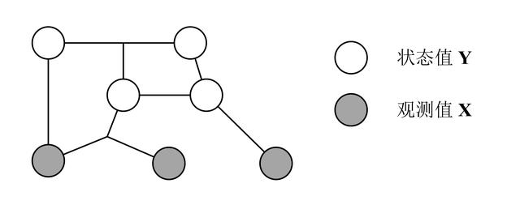
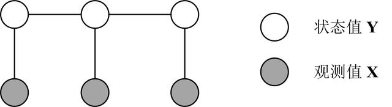
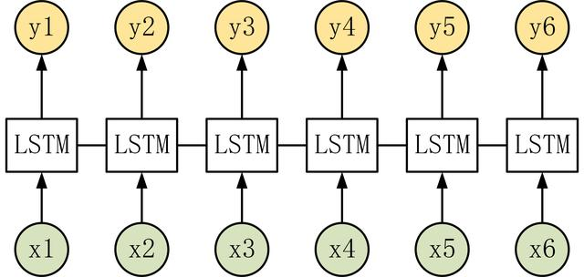
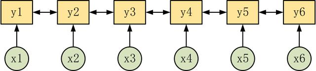
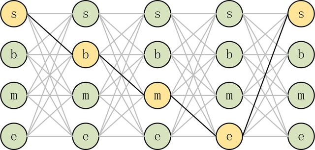
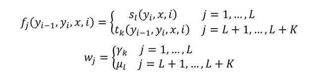
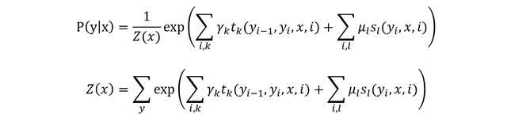
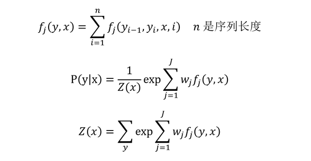
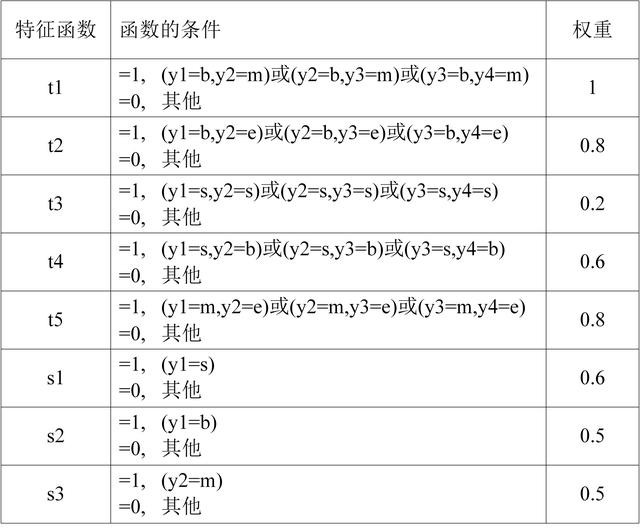

## CRF 条件随机场学习笔记

CRF 条件随机场算法通常用于序列标注的任务，例如给定一个输入序列 **X**= (x1, x2, x3, ..., xn)，求输出的序列 **Y** = (y1, y2, y3, ..., yn)。例如在中文分词中，**X** 即是输入的句子，**Y** 是句子中每一个单词对应的分词中的目标 (s, b, m, e)。因此 CRF 通常用于 NLP 的分词、词性标注、命名实体识别等任务，本文简单介绍一下 CRF。

**1.概念**

**X**：**X** = (x1, x2, x3, ..., xn) 表示输入的序列，也称为观测值，例如句子中所有单词。**Y**：**Y** = (y1, y2, y3, ..., yn) 表示输出的序列，也称为状态值，例如句子中每一个单词的词性。**随机场**：随机场是一种图模型，包含结点的集合和边的集合，结点表示一个随机变量，而边表示随机变量之间的依赖关系。如果按照某一种分布随机给图中每一个结点赋予一个值，则称为随机场。**马尔科夫随机场**：马尔科夫性质指某一个时刻 t 的输出值只和 t-1 时刻的输出有关系，和更早的输出没有关系。马尔科夫随机场则是一种特殊的随机场，其假设每一个结点的取值只和相邻的结点有关系，和不相邻结点无关。**条件随机场 CRF**：CRF 是一种特殊的马尔科夫随机场，CRF 假设模型中只有 **X** (观测值) 和 **Y** (状态值)。在 CRF 中每一个状态值 yi 只和其相邻的状态值有关，而观测值 x 不具有马尔科夫性质。注意观测序列 **X** 是作为一个整体影响 **Y** 计算，如下图所示。

条件随机场 CRF

**线性链条件随机场 Linear-chain CRF**：线性链条件随机场指序列 **Y** 和 **X** 都是线性链的条件随机场，如下图所示。

线性链条件随机场 Linear-chain CRF

**2.LSTM 和 CRF**

LSTM 和 CRF 都可以进行序列标注，用 LSTM 进行序列标注的时候就是对于每一个时刻的输入进行分类，例如 Softmax。

LSTM 序列标注

我们可以用 LSTM 进行序列标注，假设我们的输入序列为 n，则 LSTM 会进行 n 次预测，分别预测 n 个时刻的输出 yi。但是 LSTM 不能考虑输出的每一个元素的相关性，例如在分词时，s 表示单个字的词，则 s 之后是不能接 m 或者 e 的，而 LSTM 逐元素分类是不能考虑这种相关性的。

但是 CRF 可以考虑输出元素的前后关联性 (CRF 可以通过特征函数学习状态间的关联)，如下图所示。

CRF 序列标注

CRF 会计算出一个输出序列的分数，并用所有可能序列的分数之和进行归一化，如下图所示，sbmes 就是其中一个序列路径，CRF 会找出概率最大的路径作为预测序列。

**3.CRF 特征函数**

CRF 中主要有两种特征函数 (状态特征函数，状态转移函数)，特征函数有其对应的权重。CRF 特征函数的输出值是 0 或者 1，表示序列是否符合这个特征函数。

状态特征函数 s：s(yi, **X**, i)，状态特征函数只和当前结点 i 相关。用 μ 表示状态特征函数 s 的权重。

状态转移特征函数 t：t(yi-1, yi, **X**, i)，这个函数与结点的上下文相关，即与结点 i 和结点 i - 1 都有关系。用 γ 表示状态转移特征函数 t 的权重。

可以对特征函数进行简化，即将两种特征函数都用 f 表示，权重都用 w 表示。

**4.CRF 条件概率**

假设有 L 个状态特征函数 s1, ..., sL，其对应的权重分别是 μ1, ..., μL。还有 K 个状态转移特征函数 t1, ..., tK，其对应的权重分别是 γ1, ..., γK。

给定一个输入序列 **x**，可以计算出输出序列为 **y**的概率，如下公式所示。

其中 Z(k) 是泛化因子，可以看成是所有输出序列 的得分之和，对于某一个输出序列 **y**，其得分是所有满足条件的特征函数的权重之和。

也可以用第三节的简化方法进行简化。

**5.CRF 简单例子**

接下来是一个直观的 CRF 分词例子，假设我们的输入序列 **X**长度为 4，输出序列 **Y** 的状态值的集合为 {s,b,m,e}。下图是我们得到的特征函数和对应的权重。

则我们可以计算出输出序列 **sbme**的得分 (注意是未归一化之前的得分)，根据上图可知，特征函数 t1, t4, t5, s1 为 1，其余的都为 0。则得分等于 1+0.6+0.8+0.6=3。

**6.CRF 的三个问题**

CRF 条件随机场也有三个基本问题，本文主要简单描述一下，具体的可以参考《统计学习方法》。

评估问题，已知条件随机场 CRF 的特征函数和权重，给定输入序列 **X** 和输出序列 **Y**。计算出条件概率 P(yi|x) 和 P(yi-1, yi|x)。学习问题，给定特征函数和训练数据集 (即包含多个输出序列 **X** 和对应的输出序列 **Y**)，求解出每一个特征函数权重的大小。解码问题，已知 CRF 的特征函数和权重，求出使条件概率最大的输出序列 **Y**。**7.参考文献**

《统计学习方法》

《An Introduction to Conditional Random Fields》