## 情感目标和情感极性联合抽取算法 CMLA

情感目标 (Aspect) 和情感极性 (Opinion) 抽取是细粒度情感分析中的一个重要任务。Opinion 指用户的具体情感，而 Aspect 是用户情感所描述的对象。例如句子 "这家店的拉面很好吃，但是服务员态度不好" 中包含两个 Aspect："拉面" 和 "服务员"，对应的 Opinion 分别是："好吃" 和 "不好"。CMLA 是一种联合抽取 Aspect 和 Opinion 的算法。

**1.情感目标和情感极性抽取**

首先介绍 ABSA 任务 (Aspect-Based Sentiment Analysis)，给定一个待分析的句子 "这家店的拉面很好吃，但是服务员态度不好", ABSA 任务需要识别出句子中的 Aspect (情感目标)、Opinion (情感极性)、Aspect Category (情感分类)。对应到句子中的元素：

Aspect：拉面、服务员Opinion：好吃、不好Aspect Category：食物、服务通常 Aspect 和 Opinion 是从句子中抽取得到的，涉及到文本抽取问题；而 Aspect Category 是分类问题，区分是对于哪一方面的评价。本文主要介绍一种 **Aspect 和 Opinion 联合抽取的算法 CMLA (Coupled Multi-layer Attentions)**。CMLA 是 2017 年提出的，论文《Coupled Multi-Layer Attentions for Co-Extraction of Aspect and Opinion Terms》。

很多传统的算法会把抽取任务看成是序列标注或者序列单词分类任务，如 CRF (条件随机场)、LSTM 和 SVM (支持向量机) 等。这些方法存在一些缺陷，在识别时没有考虑到 Aspect 和 Opinion 通常是成对出现的，因此常常会把一些比较常见的实体识别为 Aspect。例如给定一个没有情感评价的句子 "我下午两点左右到了餐厅，点了一条鱼"，传统的方法很可能会把 "餐厅" 识别成一个 Aspect。

另外也有不少方法在抽取时会用上语法结构信息，如 RNCRF (和 CMLA 同作者)。RNCRF 认为句子依赖关系对于捕获 Aspect 和 Opinion 之间的关系有帮助，因此 RNCRF 使用了 Dependency-Tree RNN， 即一种基于依赖树的 RNN 网络。但是 RNCRF 也有一些缺点：1.比较适合用于简单句子，但对于复杂句子鲁棒性差；2.RNCRF 需要进行依赖关系树的解析，依赖关系树解析的错误会传递到 RNCRF。

CMLA 是一种联合抽取 Aspect 和 Opinion 的算法，主要的结构是成对的 attention (Aspect attention 和 Opinion attention)，通过成对 attention 结合 Aspect 和 Opinion 的信息，从而进行联合抽取。

**2.CMLA**

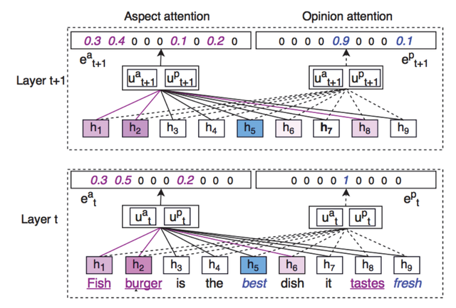CMLA 模型

上图是 CMLA 的模型图，图中粉红色的字表示 Aspect，蓝色字表示 Opinion。

**2.1 CMLA 的特点**

CMLA 采用成对的 attention (称为 coupled attention)，一个用来抽取 Aspect，另一个用来抽取 Opinion。

每一个 attention 都需要学习一个原型向量 (prototype vector，如上图中的向量 ua、up)，分为 Aspect 的原型向量和 Opinion 的原型向量。

attention 也会学习句子中每个 token 的特征向量以及每个 token 对应的 attention score。

CMLA 使用 tensor operator 计算出 token 和原型向量的相关性，如果一个 token 分数比较高，更有可能是 Aspect 或 Opinion。

作者认为，Aspect 和 Opinion 在依赖关系上不一定是直接相关的，如下图所示。使用 coupled attention 可以捕获 Aspect 和 Opinion 的直接关系，使用多层的 coupled attention 可以捕获 Aspect 和 Opinion 之间的间接关系。

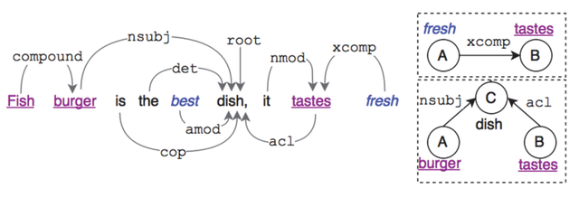Aspect 和 Opinion 的关系

**2.2 Attention with Tensor Operator**

CMLA 由成对的 attention 组成：Aspect attention 和 Opinion attention，用 attention 的值表示一个单词属于 Aspect 或者 Opinion 的概率。下图展示单个 Aspect attention 结构，红框标出的部分为 Tensor Operator (fa)。

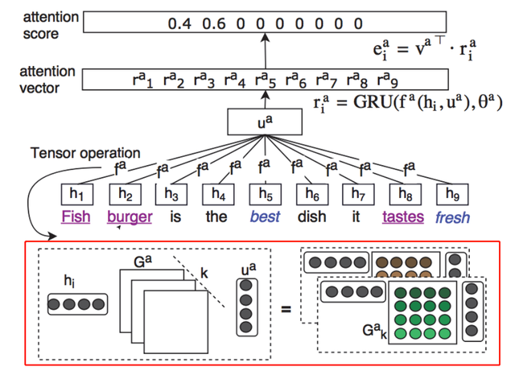Tensor Operator

在上面的 Aspect attention 结构图中，向量 h1~h9 为输入序列所有 token 的特征向量，维度等于 d。向量 ua 表示 Aspect 的原型向量 (可以当成是 Aspect 的通用向量)。

给定原型向量 ua (d维) 和 hi (d维)，可以通过 tensor operator (fa) 计算出 composition 向量 β，如下：

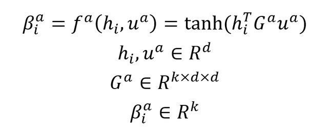计算 composition 向量 β

上式的 Ga 包含 k 个 d×d 的矩阵，每一个矩阵可以理解为 token i 和 Aspect 原型的一种组合方式，能够表示 token 和 Aspect 之间的复杂关系。β 向量编码了更加抽象的相关性特征。

得到每一个 token 的 composition 向量 β 后，可以传入 GRU 网络中计算出每个 token 的 attention 向量 r，经过 GRU 后向量 r 携带了 token 的上下文信息。大部分 Aspect 都包含不止一个 token，这些上下文信息有利于预测，向量 r 计算公式如下：

计算 attention 向量 r

得到 attention 向量 r 之后，可以计算每个 token 的 attention score，计算公式如下，va 是一个可以训练的权重向量，表示 r 每一个维度的重要性。

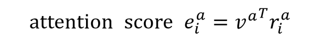计算每个 token 的 attention score

另外一点，向量 r 也是每一个 token 最终的表征向量，对 token 进行分类时，可以直接使用向量 r，如下式。

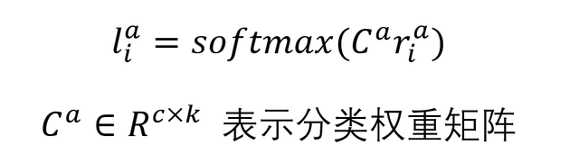token 分类

**2.3 Coupled Attentions**

CMLA 作者认为 Aspect (情感目标) 和 Opinion (情感极性) 联合抽取的关键是要充分利用 Aspect 和 Opinion 之间的关系信息，让信息在双方传递。传统的方法通常不能有效地利用它们之间的关系，因此 CMLA 采用了 Coupled attention (成对的 attention)。

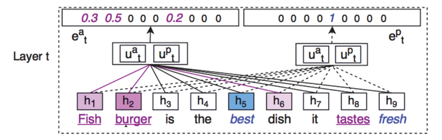Coupled attention

上图为 Coupled attention 示意图，图中的实线表示 Aspect attention，虚线表示 Opinion attention。两个 attention 均采用相同的 token 表征向量 h 和相同的原型向量 {ua，up}。ua 是 Aspect 原型，up 是 Opinion 原型。

因此，上一节描述的 tensor operator (即计算 composition 向量 β) 用下面的新公式：

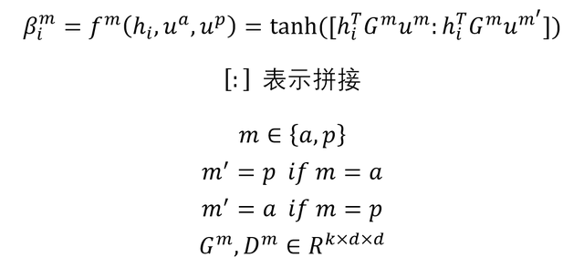

上面公式中 m 和 m‘ 表示 Aspect 和 Opinion，若 m 为 Aspect 则 m' 为 Opinion，若 m 为 Opinion 则 m' 为 Aspect。矩阵 G 用来编码 token 和原型 m 之间的关联信息，而矩阵 D 编码 token 和原型 m' 的关联信息，从而引入双方的信息。

得到向量 β 后，用上一节的公式计算 attention 向量和 attention score：

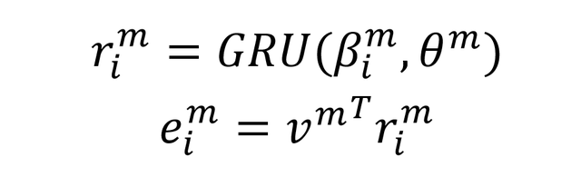

**2.4 Multi-Layer Coupled Attentions**

为了更好地捕获一些具有间接关系的 Aspect 和 Opinion，CMLA 可以采用多层的 Coupled attention，如下图所示。

Multi-Layer Coupled Attention

从上图可以看到 CMLA 每一层使用的 token 向量 h 都是一样的，但是原型向量会改变，t+1 层的原型向量用下面的公式计算：

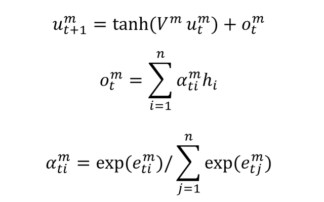

向量 o 由输入 token 的特征向量加权得到，得分越高的 token，其特征向量影响越大。最终对 token 进行分类时，采用下面的公式：

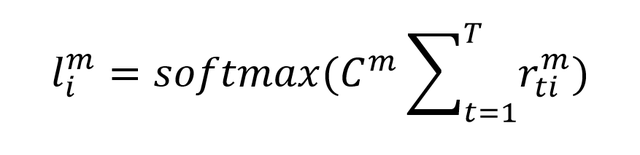

**3.参考文献**

Coupled Multi-Layer Attentions for Co-Extraction of Aspect and Opinion Terms