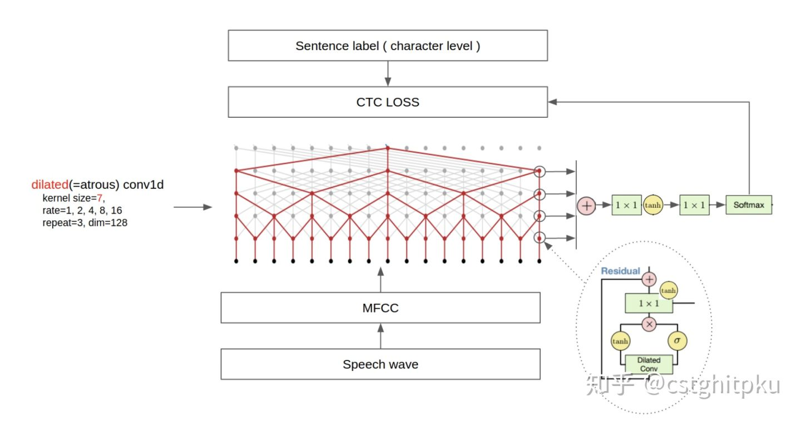

# 练手|常见30种NLP任务的练手项目

经常有人问我：老大让我完成xxx，我不会，他也不会，但是很着急。这个任务怎么实现啊？这个任务需要什么技术啊？这种情况我遇到有100+次了，而且很多时候问得问题跟具体需要的技术简直是驴唇不对马嘴。所以今天整理了常见的30种NLP任务非常适合练手的Project，我觉得有俩作用：研究+练手，加深理解，做到更专业；收藏起来，以备不时之需，不敢保证涵盖工业界所有NLP业务场景，但是涵盖95+%以上是完全没问题的。

还有一个原因，马上周末了，我发现大部分人周五晚上开始到周一上午都不看技术相关的内容，今天本来不打算发，但是被催更，那就发点不用过多思考的实践类的吧。如果精力充沛或是单身，最好周末还是保持学习状态，毕竟技术是无止境的，真的需要积累。

首先声明下，今天发的这些Project都是类似论文实现那样的demo级的，也不是传统的工程实现，用的方法一般比工业界的高端，非常适合练手用。

1.分词 Word Segmentation

[chqiwang/convseg](https://link.zhihu.com/?target=https%3A//github.com/chqiwang/convseg) ，基于CNN做中文分词，提供数据和代码。

对应的论文**[Convolutional Neural Network with Word Embeddings for Chinese Word Segmentation](https://link.zhihu.com/?target=https%3A//arxiv.org/pdf/1711.04411.pdf)** IJCNLP2017.

2.词预测 Word Prediction

[Kyubyong/word_prediction](https://link.zhihu.com/?target=https%3A//github.com/Kyubyong/word_prediction) ，基于CNN做词预测，提供数据和代码。

\3. 文本蕴涵 Textual Entailment

[Steven-Hewitt/Entailment-with-Tensorflow](https://link.zhihu.com/?target=https%3A//github.com/Steven-Hewitt/Entailment-with-Tensorflow)，基于Tensorflow做文本蕴涵，提供数据和代码。

\4. 语音识别 Automatic Speech Recognition

[buriburisuri/speech-to-text-wavenet](https://link.zhihu.com/?target=https%3A//github.com/buriburisuri/speech-to-text-wavenet)，基于DeepMind WaveNet和Tensorflow做句子级语音识别。

\5. 自动摘要 Automatic Summarisation

[PKULCWM/PKUSUMSUM](https://link.zhihu.com/?target=https%3A//github.com/PKULCWM/PKUSUMSUM)，北大万小军老师团队的自动摘要方法汇总，包含了他们大量paper的实现，支持单文档摘要、多文档摘要、topic-focused多文档摘要。

\6. 文本纠错 Text Correct

[atpaino/deep-text-corrector](https://link.zhihu.com/?target=https%3A//github.com/atpaino/deep-text-corrector)，基于深度学习做文本纠错，提供数据和代码。

7.字音转换 Grapheme to Phoneme

[cmusphinx/g2p-seq2seq](https://link.zhihu.com/?target=https%3A//github.com/cmusphinx/g2p-seq2seq)，基于网红transformer做， 提供数据和代码。

\8. 复述检测 Paraphrase Detection 和 问答 Question Answering

[Paraphrase-Driven Learning for Open Question Answering](https://link.zhihu.com/?target=http%3A//knowitall.cs.washington.edu/paralex/)， 基于复述驱动学习的开放域问答。

\9. 音汉互译 Pinyin-To-Chinese

[Kyubyong/neural_chinese_transliterator](https://link.zhihu.com/?target=https%3A//github.com/Kyubyong/neural_chinese_transliterator)，基于CNN做音汉互译。

\10. 情感分析 Sentiment Analysis

情感分析包括的内容太多了，目前没发现比较全的。推荐两个适合练手的吧：[Deeply Moving: Deep Learning for Sentiment Analysis](https://link.zhihu.com/?target=https%3A//nlp.stanford.edu/sentiment/)，[http://sentic.net/about/](https://link.zhihu.com/?target=http%3A//sentic.net/about/)。

\11. 手语识别 Sign Language Recognition

[Home - SignAll](https://link.zhihu.com/?target=http%3A//www.signall.us/)， 该项目在手语识别做的非常成熟。

\12. 词性标注（POS）、 命名实体识别（NER）、 句法分析（parser）、 语义角色标注（SRL） 等。

[HIT-SCIR/ltp](https://link.zhihu.com/?target=https%3A//github.com/HIT-SCIR/ltp)， 包括代码、模型、数据，还有详细的文档，而且效果还很好。

\13. 词干 Word Stemming

[snowballstem/snowball](https://link.zhihu.com/?target=https%3A//github.com/snowballstem/snowball)， 实现的词干效果还不错。

\14. 语言识别 Language Identification

[https://github.com/saffsd/langid.py](https://link.zhihu.com/?target=https%3A//github.com/saffsd/langid.py)，语言识别比较好的开源工具。

\15. 机器翻译 Machine Translation

[OpenNMT/OpenNMT-py](https://link.zhihu.com/?target=https%3A//github.com/OpenNMT/OpenNMT-py)， 基于PyTorch的神经机器翻译，很适合练手。

\16. 复述生成 Paraphrase Generation

[vsuthichai/paraphraser](https://link.zhihu.com/?target=https%3A//github.com/vsuthichai/paraphraser)，基于Tensorflow的句子级复述生成，适合练手。

\17. 关系抽取 Relationship Extraction

[ankitp94/relationship-extraction](https://link.zhihu.com/?target=https%3A//github.com/ankitp94/relationship-extraction)，基于核方法的关系抽取。

\18. 句子边界消歧 Sentence Boundary Disambiguation

[https://github.com/Orekhov/SentenceBreaking](https://link.zhihu.com/?target=https%3A//github.com/Orekhov/SentenceBreaking)，很有意思。

19.事件抽取 Event Extraction

[liuhuanyong/ComplexEventExtraction](https://link.zhihu.com/?target=https%3A//github.com/liuhuanyong/ComplexEventExtraction)， 中文复合事件抽取，包括条件事件、因果事件、顺承事件、反转事件等事件抽取，并形成事理图谱。

\20. 词义消歧 Word Sense Disambiguation

[alvations/pywsd](https://link.zhihu.com/?target=https%3A//github.com/alvations/pywsd)，代码不多，方法简单，适合练手。

\21. 命名实体消歧 Named Entity Disambiguation

[dice-group/AGDISTIS](https://link.zhihu.com/?target=https%3A//github.com/dice-group/AGDISTIS)，实体消歧是很重要的，尤其对于实体融合（比如知识图谱中多源数据融合）、实体链接。

\22. 幽默检测 Humor Detection

[pln-fing-udelar/pghumor](https://link.zhihu.com/?target=https%3A//github.com/pln-fing-udelar/pghumor)

\23. 讽刺检测 Sarcasm Detection

[AniSkywalker/SarcasmDetection](https://link.zhihu.com/?target=https%3A//github.com/AniSkywalker/SarcasmDetection)，基于神经网络的讽刺检测。

\24. 实体链接 Entity Linking

[hasibi/EntityLinkingRetrieval-ELR](https://link.zhihu.com/?target=https%3A//github.com/hasibi/EntityLinkingRetrieval-ELR)， 实体链接用途非常广，非常适合练手。

\25. 指代消歧 Coreference Resolution

[huggingface/neuralcoref](https://link.zhihu.com/?target=https%3A//github.com/huggingface/neuralcoref)，基于神经网络的指代消歧。

\26. 关键词/短语抽取和社会标签推荐 Keyphrase Extraction and Social Tag Suggestion

[thunlp/THUTag](https://link.zhihu.com/?target=https%3A//github.com/thunlp/THUTag), 用多种方法 实现了多种关键词/短语抽取和社会标签推荐。