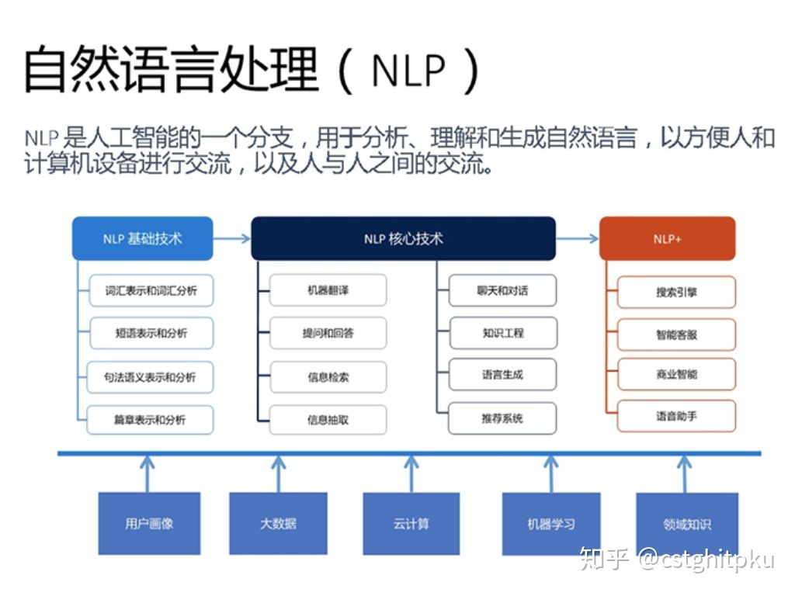

# 32项NLP任务及其评价指标和对应达到SOTA的paper

对于初学NLP的人，了解NLP的各项技术非常重要；对于想进阶的人，了解各项技术的评测指标、数据集很重要；对于想做学术和研究的人，了解各项技术在对应的评测数据集上达到SOTA效果的Paper非常重要，因为了解评测数据集、评测指标和目前最好的结果是NLP研究工作的基础。因此，本文整理了常见的32项NLP任务以及对应的评测数据、评测指标、目前的SOTA结果以及对应的Paper。

1. 先来看下按粒度对NLP任务进行划分：词粒度、短语粒度、句子粒度、篇章粒度以及对应的一些主要任务。以便于初学者能明确这些**NLP基础任务**之间的关系。

\2. 再来看看周明老师按基础任务、核心任务对[NLP的划分](https://link.zhihu.com/?target=http%3A//zhigu.news.cn/2017-06/08/c_129628590.htm)。

\3. 再来看看王海峰老师在AAAI2017的关于百度NLP的[keynote](https://link.zhihu.com/?target=http%3A//www.aaai.org/Conferences/AAAI/2017/aaai17inpractice.php)，主要是让大家明白NLP的基础、技术、应用之间的关系。

\4. 常见的32项NLP任务以及对应的评测数据、评测指标、目前的SOTA结果以及对应的Paper。

发布于 2018-11-24