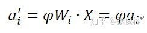
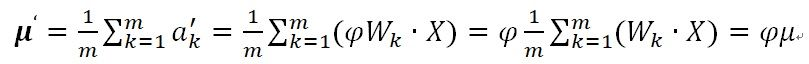
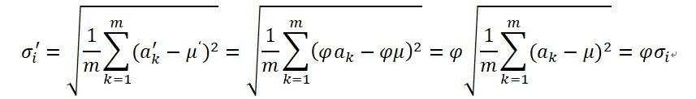

## 深度学习中的Normalization模型

作者：张俊林
链接：https://zhuanlan.zhihu.com/p/43200897
来源：知乎
著作权归作者所有。商业转载请联系作者获得授权，非商业转载请注明出处。

Batch Normalization（简称BN）自从提出之后，因为效果特别好，很快被作为深度学习的标准工具应用在了各种场合。BN大法虽然好，但是也存在一些局限和问题，诸如当BatchSize太小时效果不佳、对RNN等动态网络无法有效应用BN等。针对BN的问题，最近两年又陆续有基于BN思想的很多改进Normalization模型被提出。BN是深度学习进展中里程碑式的工作之一，无论是希望深入了解深度学习，还是在实践中解决实际问题，BN及一系列改进Normalization工作都是绕不开的重要环节。

**一.从Mini-Batch SGD说起**

 我们先从Mini-Batch SGD的优化过程讲起，因为这是下一步理解Batch Normalization中Batch所代表具体含义的知识基础。

我们知道，SGD是无论学术圈写文章做实验还是工业界调参跑模型最常用的模型优化算法，但是有时候容易被忽略的一点是：一般提到的SGD是指的Mini-batch SGD，而非原教旨意义下的单实例SGD。

​                          图1. Mini-Batch SGD 训练过程（假设Batch Size=2）

所谓“Mini-Batch”,是指的从训练数据全集T中随机选择的一个训练数据子集合。假设训练数据集合T包含N个样本，而每个Mini-Batch的Batch Size为b，于是整个训练数据可被分成N/b个Mini-Batch。在模型通过SGD进行训练时，一般跑完一个Mini-Batch的实例，叫做完成训练的一步（step）,跑完N/b步则整个训练数据完成一轮训练，则称为完成一个Epoch。完成一个Epoch训练过程后，对训练数据做随机Shuffle打乱训练数据顺序，重复上述步骤，然后开始下一个Epoch的训练，对模型完整充分的训练由多轮Epoch构成（参考图1）。

在拿到一个Mini-Batch进行参数更新时，首先根据当前Mini-Batch内的b个训练实例以及参数对应的损失函数的偏导数来进行计算，以获得参数更新的梯度方向，然后根据SGD算法进行参数更新，以此来达到本步（Step）更新模型参数并逐步寻优的过程。

​                       图2. Mini-Batch SGD优化过程

具体而言，如果我们假设机器学习任务的损失函数是平方损失函数：

那么，由Mini-Batch内训练实例可得出SGD优化所需的梯度方向为：

根据梯度方向即可利用标准SGD来更新模型参数：

其中， $\eta$是学习率。

由上述过程（参考图2）可以看出，对于Mini-Batch SGD训练方法来说，为了能够参数更新必须得先求出梯度方向，而为了能够求出梯度方向，需要对每个实例得出当前参数下映射函数的预测值，这意味着如果是用神经网络来学习映射函数 $h(x)$ 的话，Mini-Batch内的每个实例需要走一遍当前的网络，产生当前参数下神经网络的预测值，这点请注意，这是理解后续Batch Normalization的基础。

 至于Batch Size的影响，目前可以实验证实的是：batch size 设置得较小训练出来的模型相对大batch size训练出的模型泛化能力更强，在测试集上的表现更好，而太大的batch size往往不太Work，而且泛化能力较差。但是背后是什么原因造成的，目前还未有定论，持不同看法者各持己见。因为这不是文本的重点，所以先略过不表。

**二．Normalization到底是在做什么**

Normalization的中文翻译一般叫做“规范化”，是一种对数值的特殊函数变换方法，也就是说假设原始的某个数值是x，套上一个起到规范化作用的函数，对规范化之前的数值x进行转换，形成一个规范化后的数值，即：

 所谓规范化，是希望转换后的数值$\hat{\chi}$满足一定的特性，至于对数值具体如何变换，跟规范化目标有关，也就是说f()函数的具体形式，不同的规范化目标导致具体方法中函数所采用的形式不同。

其实我们生活中也有很多类似的规范化操作，知乎里面有个热帖，主题是：“为什么人大附中的学生那么爱穿校服？”，里面有人打趣地问：“请问人大附中的学生洗澡的时候脱不脱校服？”。这个问题我回答不了，要我猜大概率夏天洗澡的时候是会脱的，要不然洗澡的时候天太热人受不了，冬天则未必，穿着洗可能更保暖。跑题了，其实我想说的是：学校要求学生穿校服就是一种典型的规范化操作，学校的规范化目标是要求学生着装整齐划一，显得干练有风貌，所以定义了一个规范化函数：

就是说不论哪个学生，不论你平常的着装变量x=”香奈儿”还是x=“麻袋片”，经过这个规范化函数操作，统一都换成校服。这样就达到了学校的规范化目的。

​                                           图3. 神经元

在介绍深度学习Normalization前，我们先普及下神经元的活动过程。深度学习是由神经网络来体现对输入数据的函数变换的，而神经网络的基础单元就是网络神经元，一个典型的神经元对数据进行处理时包含两个步骤的操作（参考图3）：

 步骤一：对输入数据进行线性变换，产生净激活值

其中，x是输入，w是权重参数，b是偏置，w和b是需要进过训练学习的网络参数。

步骤二：套上非线性激活函数，神经网络的非线性能力来自于此，目前深度学习最常用的激活函数是Relu函数

$x=Relu(x)$

 如此一个神经元就完成了对输入数据的非线性函数变换。这里需要强调下，步骤一的输出一般称为净激活（Net Activation），第二步骤经过激活函数后得到的值为激活值。为了描述简洁，本文后续文字中使用激活的地方，其实指的是未经激活函数的净激活值，而非一般意义上的激活，这点还请注意。

   至于深度学习中的Normalization，因为神经网络里主要有两类实体：神经元或者连接神经元的边，所以按照规范化操作涉及对象的不同可以分为两大类，一类是对第L层每个神经元的激活值或者说对于第L+1层网络神经元的输入值进行Normalization操作，比如BatchNorm/LayerNorm/InstanceNorm/GroupNorm等方法都属于这一类；另外一类是对神经网络中连接相邻隐层神经元之间的边上的权重进行规范化操作，比如Weight Norm就属于这一类。广义上讲，一般机器学习里看到的损失函数里面加入的对参数的的L1/L2等正则项，本质上也属于这第二类规范化操作。L1正则的规范化目标是造成参数的稀疏化，就是争取达到让大量参数值取得0值的效果，而L2正则的规范化目标是有效减小原始参数值的大小。有了这些规范目标，通过具体的规范化手段来改变参数值，以达到避免模型过拟合的目的。

本文主要介绍第一类针对神经元的规范化操作方法，这是目前DNN做Normalization最主流的做法。

​                 图4. Normalization加入的位置

 那么对于第一类的Normalization操作，其在什么位置发挥作用呢？目前有两种在神经元中插入Normalization操作的地方（参考图4），第一种是原始BN论文提出的，放在激活函数之前；另外一种是后续研究提出的，放在激活函数之后，不少研究表明将BN放在激活函数之后效果更好。本文在讲解时仍然遵循BN原始论文，后续讲解都可以看成是将Normalization操作放在激活函数之前进行。

对于神经元的激活值来说，不论哪种Normalization方法，其规范化目标都是一样的，就是将其激活值规整为均值为0，方差为1的正态分布。即规范化函数统一都是如下形式：

写成两步的模式是为了方便讲解，如果写成一体的形式，则是如下形式：

​        其中，$a_{i}$为某个神经元原始激活值， $a_{i}^{norm}$为经过规范化操作后的规范后值。整个规范化过程可以分解为两步，第一步参考公式（1），是对激活值规整到均值为0，方差为1的正态分布范围内。其中， $\mu$ 是通过神经元集合S（至于S如何选取读者可以先不用关注，后文有述）中包含的m个神经元各自的激活值求出的均值，即：

 为根据均值和集合S中神经元各自激活值求出的激活值标准差：

 其中， $\varepsilon$是为了增加训练稳定性而加入的小的常量数据。

​     第二步参考公式（2），主要目标是让每个神经元在训练过程中学习到对应的两个调节因子，对规范到0均值，1方差的值进行微调。因为经过第一步操作后，Normalization有可能降低神经网络的非线性表达能力，所以会以此方式来补偿Normalization操作后神经网络的表达能力。

目前神经网络中常见的第一类Normalization方法包括Batch Normalization/Layer Normalization/Instance Normalization和Group Normalization，BN最早由Google研究人员于2015年提出，后面几个算法算是BN的改进版本。不论是哪个方法，其基本计算步骤都如上所述，大同小异，最主要的区别在于神经元集合S的范围怎么定，不同的方法采用了不同的神经元集合定义方法。

为什么这些Normalization需要确定一个神经元集合S呢？原因很简单，前面讲过，这类深度学习的规范化目标是将神经元的激活值 ![[公式]](https://www.zhihu.com/equation?tex=a_%7Bi%7D) 限定在均值为0方差为1的正态分布中。而为了能够对网络中某个神经元的激活值 规范到均值为0方差为1的范围，必须有一定的手段求出均值和方差，而均值和方差是个统计指标，要计算这两个指标一定是在一个集合范围内才可行，所以这就要求必须指定一个神经元组成的集合，利用这个集合里每个神经元的激活来统计出所需的均值和方差，这样才能达到预定的规范化目标。

​                                        图5. Normalization具体例子

 图5给出了这类Normalization的一个计算过程的具体例子，例子中假设网络结构是前向反馈网络，对于隐层的三个节点来说，其原初的激活值为[0.4,-0.6,0.7]，为了可以计算均值为0方差为1的正态分布，划定集合S中包含了这个网络中的6个神经元，至于如何划定集合S读者可以先不用关心，此时其对应的激活值如图中所示，根据这6个激活值，可以算出对应的均值和方差。有了均值和方差，可以利用公式3对原初激活值进行变换，如果r和b被设定为1，那么可以得到转换后的激活值[0.21，-0.75,0.50]，对于新的激活值经过非线性变换函数比如RELU，则形成这个隐层的输出值[0.21,0,0.50]。这个例子中隐层的三个神经元在某刻进行Normalization计算的时候共用了同一个集合S，在实际的计算中，隐层中的神经元可能共用同一个集合，也可能每个神经元采用不同的神经元集合S，并非一成不变，这点还请留心与注意。

 针对神经元的所有Normalization方法都遵循上述计算过程，唯一的不同在于如何划定计算统计量所需的神经元集合S上。读者可以自己思考下，如果你是BN或者其它改进模型的设计者，那么你会如何选取集合S？

**三.Batch Normalization如何做**

   我们知道，目前最常用的深度学习基础模型包括前向神经网络（MLP），CNN和RNN。目前BN在这些基础网络结构都有尝试，总体而言，BN在MLP和CNN是非常成功的，在RNN上效果不明显。下面我们分述前向神经网络以及CNN中如何应用BN，然后谈谈BN面临的一些困境。正是这些困境引发了后续的一系列改进模型的提出。

**3.1前向神经网络中的BN**

​                                     图6. 前向神经网络中的BatchNorm

 对于前向神经网络来说，BatchNorm在计算隐层某个神经元k激活的规范值的时候，对应的神经元集合S范围是如何划定呢？图6给出了示意。因为对于Mini-Batch训练方法来说，根据Loss更新梯度使用Batch中所有实例来做，所以对于神经元k来说，假设某个Batch包含n个训练实例，那么每个训练实例在神经元k都会产生一个激活值，也就是说Batch中n个训练实例分别通过同一个神经元k的时候产生了n个激活值，BatchNorm的集合S选择入围的神经元就是这n个同一个神经元被Batch不同训练实例激发的激活值。划定集合S的范围后，Normalization的具体计算过程与前文所述计算过程一样，采用公式3即可完成规范化操作。

**3.2 CNN网络中的BN**

了解了前向神经网络中的BatchNorm ，接下来介绍CNN中的BatchNorm，读者可以先自行思考下如果由你来主导设计，在CNN中究竟应该如何确定神经元集合S的势力范围。

我们知道，常规的CNN一般由卷积层、下采样层及全连接层构成。全连接层形式上与前向神经网络是一样的，所以可以采取前向神经网络中的BatchNorm方式，而下采样层本身不带参数所以可以忽略，所以CNN中主要关注卷积层如何计算BatchNorm。

​                  图7. CNN中的卷积核

CNN中的某个卷积层由m个卷积核构成，每个卷积核对三维的输入（通道数*长*宽）进行计算，激活及输出值是个二维平面（长*宽），对应一个输出通道（参考图7），由于存在m个卷积核，所以输出仍然是三维的，由m个通道及每个通道的二维平面构成。

​                     图8.  CNN中的BatchNorm过程

那么在卷积层中，如果要对通道激活二维平面中某个激活值进行Normalization操作，怎么确定集合S的范围呢？图8给出了示意图。类似于前向神经网络中的BatchNorm计算过程，对于Mini-Batch训练方法来说，反向传播更新梯度使用Batch中所有实例的梯度方向来进行，所以对于CNN某个卷积层对应的输出通道k来说，假设某个Batch包含n个训练实例，那么每个训练实例在这个通道k都会产生一个二维激活平面，也就是说Batch中n个训练实例分别通过同一个卷积核的输出通道k的时候产生了n个激活平面。假设激活平面长为5，宽为4，则激活平面包含20个激活值，n个不同实例的激活平面共包含20*n个激活值。那么BatchNorm的集合S的范围就是由这20*n个同一个通道被Batch不同训练实例激发的激活平面中包含的所有激活值构成（对应图8中所有标为蓝色的激活值）。划定集合S的范围后，激活平面中任意一个激活值都需进行Normalization操作，其Normalization的具体计算过程与前文所述计算过程一样，采用公式3即可完成规范化操作。这样即完成CNN卷积层的BatchNorm转换过程。

​             图9. CNN中Batch Norm的另外一种角度的理解

描述起来似乎有些复杂，但是从概念上，其实可以把CNN中的卷积层想象成前向神经网络中的一个隐层，然后把对应的某个卷积核想象成MLP隐层中的一个神经元节点，无非其输出是个二维激活平面而不像MLP的神经元输出是一个激活值，另外一个不同是这个神经元覆盖的输入部分不同，CNN的卷积核是局部覆盖输入，通过滑动窗口来实现输入的全覆盖，而MLP的神经元则是一步到位全局覆盖输入而已(参考图9示意)。如果从这个角度思考CNN和MLP中的BatchNorm的话，其实两者的做法是一致的。

从理论上讲，类似的BatchNorm操作也可以应用在RNN上，事实上也有不少研究做了尝试，但是各种实验证明其实这么做没什么用，所以本文就不展开讲RNN中的BN了。

BatchNorm目前基本已经成为各种网络（RNN除外）的标配，主要是因为效果好，比如可以加快模型收敛速度，不再依赖精细的参数初始化过程，可以调大学习率等各种方便，同时引入的随机噪声能够起到对模型参数进行正则化的作用，有利于增强模型泛化能力。

但是，BatchNorm这么好用的大杀器，仍然存在很多问题。

**3.3  Batch Norm的四大罪状**

  局限1：如果Batch Size太小，则BN效果明显下降。

​     BN是严重依赖Mini-Batch中的训练实例的，如果Batch Size比较小则任务效果有明显的下降。那么多小算是太小呢？图10给出了在ImageNet数据集下做分类任务时，使用ResNet的时候模型性能随着BatchSize变化时的性能变化情况，可以看出当BatchSize小于8的时候开始对分类效果有明显负面影响。之所以会这样，是因为在小的BatchSize意味着数据样本少，因而得不到有效统计量，也就是说噪音太大。这个很好理解，这就类似于我们国家统计局在做年均收入调查的时候，正好把你和马云放到一个Batch里算平均收入，那么当你为下个月房租发愁之际，突然听到你所在组平均年薪1亿美金时，你是什么心情，那小Mini-Batch里其它训练实例就是啥心情。

、

​                 图10. BN的Batch Size大小对ImageNet分类任务效果的影响（From GN论文）

​      BN的Batch Size大小设置是由调参师自己定的，调参师只要把Batch Size大小设置大些就可以避免上述问题。但是有些任务比较特殊，要求batch size必须不能太大，在这种情形下，普通的BN就无能为力了。比如BN无法应用在Online Learning中，因为在线模型是单实例更新模型参数的，难以组织起Mini-Batch结构。 

 局限2：对于有些像素级图片生成任务来说，BN效果不佳；

​     对于图片分类等任务，只要能够找出关键特征，就能正确分类，这算是一种粗粒度的任务，在这种情形下通常BN是有积极效果的。但是对于有些输入输出都是图片的像素级别图片生成任务，比如图片风格转换等应用场景，使用BN会带来负面效果，这很可能是因为在Mini-Batch内多张无关的图片之间计算统计量，弱化了单张图片本身特有的一些细节信息。

局限3：RNN等动态网络使用BN效果不佳且使用起来不方便

​        对于RNN来说，尽管其结构看上去是个静态网络，但在实际运行展开时是个动态网络结构，因为输入的Sequence序列是不定长的，这源自同一个Mini-Batch中的训练实例有长有短。对于类似RNN这种动态网络结构，BN使用起来不方便，因为要应用BN，那么RNN的每个时间步需要维护各自的统计量，而Mini-Batch中的训练实例长短不一，这意味着RNN不同时间步的隐层会看到不同数量的输入数据，而这会给BN的正确使用带来问题。假设Mini-Batch中只有个别特别长的例子，那么对较深时间步深度的RNN网络隐层来说，其统计量不方便统计而且其统计有效性也非常值得怀疑。另外，如果在推理阶段遇到长度特别长的例子，也许根本在训练阶段都无法获得深层网络的统计量。综上，在RNN这种动态网络中使用BN很不方便，而且很多改进版本的BN应用在RNN效果也一般。

 局限4：训练时和推理时统计量不一致

​        对于BN来说，采用Mini-Batch内实例来计算统计量，这在训练时没有问题，但是在模型训练好之后，在线推理的时候会有麻烦。因为在线推理或预测的时候，是单实例的，不存在Mini-Batch，所以就无法获得BN计算所需的均值和方差，一般解决方法是采用训练时刻记录的各个Mini-Batch的统计量的数学期望，以此来推算全局的均值和方差，在线推理时采用这样推导出的统计量。虽说实际使用并没大问题，但是确实存在训练和推理时刻统计量计算方法不一致的问题。

 上面所列BN的四大罪状，表面看是四个问题，其实深入思考，都指向了幕后同一个黑手，这个隐藏在暗处的黑手是谁呢？就是BN要求计算统计量的时候必须在同一个Mini-Batch内的实例之间进行统计，因此形成了Batch内实例之间的相互依赖和影响的关系。如何从根本上解决这些问题？一个自然的想法是：把对Batch的依赖去掉，转换统计集合范围。在统计均值方差的时候，不依赖Batch内数据，只用当前处理的单个训练数据来获得均值方差的统计量，这样因为不再依赖Batch内其它训练数据，那么就不存在因为Batch约束导致的问题。在BN后的几乎所有改进模型都是在这个指导思想下进行的。

 但是这个指导思路尽管会解决BN带来的问题，又会引发新的问题，新的问题是：我们目前已经没有Batch内实例能够用来求统计量了，此时统计范围必须局限在一个训练实例内，一个训练实例看上去孤零零的无依无靠没有组织，怎么看也无法求统计量，所以核心问题是对于单个训练实例，统计范围怎么算？

**四. Layer Normalization、Instance Normalization及Group Normalization**

**4.1 Layer Normalization**

为了能够在只有当前一个训练实例的情形下，也能找到一个合理的统计范围，一个最直接的想法是：MLP的同一隐层自己包含了若干神经元；同理，CNN中同一个卷积层包含k个输出通道，每个通道包含m*n个神经元，整个通道包含了k*m*n个神经元；类似的，RNN的每个时间步的隐层也包含了若干神经元。那么我们完全可以直接用同层隐层神经元的响应值作为集合S的范围来求均值和方差。这就是Layer Normalization的基本思想。图11、图12和图13分示了MLP、CNN和RNN的Layer Normalization的集合S计算范围，因为很直观，所以这里不展开详述。

​                                     图11.  MLP中的LayerNorm

​                                          图12.  CNN中的LayerNorm

​                                           图13.  RNN中的LayerNorm

前文有述，BN在RNN中用起来很不方便，而Layer Normalization这种在同隐层内计算统计量的模式就比较符合RNN这种动态网络，目前在RNN中貌似也只有LayerNorm相对有效，但Layer Normalization目前看好像也只适合应用在RNN场景下，在CNN等环境下效果是不如BatchNorm或者GroupNorm等模型的。从目前现状看，动态网络中的Normalization机制是非常值得深入研究的一个领域。

 **4.2 Instance Normalization**

从上述内容可以看出，Layer Normalization在抛开对Mini-Batch的依赖目标下，为了能够统计均值方差，很自然地把同层内所有神经元的响应值作为统计范围，那么我们能否进一步将统计范围缩小？对于CNN明显是可以的，因为同一个卷积层内每个卷积核会产生一个输出通道，而每个输出通道是一个二维平面，也包含多个激活神经元，自然可以进一步把统计范围缩小到单个卷积核对应的输出通道内部。图14展示了CNN中的Instance Normalization，对于图中某个卷积层来说，每个输出通道内的神经元会作为集合S来统计均值方差。对于RNN或者MLP，如果在同一个隐层类似CNN这样缩小范围，那么就只剩下单独一个神经元，输出也是单值而非CNN的二维平面，这意味着没有形成集合S，所以RNN和MLP是无法进行Instance Normalization操作的，这个很好理解。

​                                 图14   CNN中的Instance Normalization

 我们回想下图8代表的CNN中的Batch Normalization，可以设想一下：如果把BN中的Batch Size大小设定为1，此时和Instance Norm的图14比较一下，是否两者是等价的？也就是说，看上去Instance Normalization像是Batch Normalization的一种Batch Size=1的特例情况。但是仔细思考，你会发现两者还是有区别的，至于区别是什么读者可自行思考。

 Instance Normalization对于一些图片生成类的任务比如图片风格转换来说效果是明显优于BN的，但在很多其它图像类任务比如分类等场景效果不如BN。

 **4.3 Group Normalization**

从上面的Layer Normalization和Instance Normalization可以看出，这是两种极端情况，Layer Normalization是将同层所有神经元作为统计范围，而Instance Normalization则是CNN中将同一卷积层中每个卷积核对应的输出通道单独作为自己的统计范围。那么，有没有介于两者之间的统计范围呢？通道分组是CNN常用的模型优化技巧，所以自然而然会想到对CNN中某一层卷积层的输出或者输入通道进行分组，在分组范围内进行统计。这就是Group Normalization的核心思想，是Facebook何凯明研究组2017年提出的改进模型。

 图15展示了CNN中的Group Normalization。理论上MLP和RNN也可以引入这种模式，但是还没有看到相关研究，不过从道理上考虑，MLP和RNN这么做的话，分组内包含神经元太少，估计缺乏统计有效性，猜测效果不会太好。

​                  图15.  CNN中的Group Normalization

 Group Normalization在要求Batch Size比较小的场景下或者物体检测／视频分类等应用场景下效果是优于BN的。

  **4.4 用一个故事来总结**

 为了能够更直观地理解四种Normalization的异同，大家可以体会下面的故事以做类比：

 很久很久以前，在遥远的L国内有一个神奇的理发馆，理发馆里面有很多勤劳的理发师，来这里理发的顾客也很奇特，他们所有人都会要求理发师（神经元）理出和其他人差不多长的头发（求均值）。那么和其他人差不多长究竟是多长呢？这可难不倒我们可爱又聪明的理发师，于是理发师把自己最近24个小时服务过的顾客（Mini-Batch）进入理发店时的头发长度求个平均值，这个均值就是“和其他人差不多长”的长度。来这里的每个顾客都很满意，时间久了，人们尊称这些理发师为：BatchNorm理发师。

不幸总是突然的，有一天，理发馆里发生了一件怪事，所有理发师的记忆只能维持1分钟，他们再也记不住过去24小时中发生的事情了，自然也记不住过去服务客人的头发长度。但是每个顾客仍然要求剪出和其他人差不多长的头发长度，这可怎么办？聪明的理发师们又想出了一个办法：他们相互大声报出同一时刻在理发馆里自己手上客人的头发长度，每个理发师就可以用这些人的头发长度均值作为满足自己手上客人条件的长度。尽管这是一群得了失忆综合证的理发师，但是顾客对他们的服务仍然非常满意，于是人们改称他们为：LayerNorm理发师。

不幸总是突然的，有一天，理发馆里又发生了一件怪事，理发师们不仅得了失忆症，这次都突然失聪，再也听不到其它理发师的口头通知，而固执的客人仍然坚持要理出“和其他人差不多长”的头发。对了，忘了介绍了，理发馆是有隔间的，每个隔间有K个理发师同时给顾客理发，虽然我们可爱又聪明的理发师现在失忆又失聪，但是再大的困难也难不倒也叫不醒这群装睡的人，他们醒来后群策群力又发明了一个新方法：同一个隔间的理发师通过相互打手势来通知其它理发师自己手上顾客的头发长度。于是同一个隔间的理发师又可以剪出顾客满意的头发了。人们称这些身残志坚的理发师为：GroupNorm理发师。

不幸总是突然的，有一天，理发馆里又发生了一件怪事，不过这次不是天灾是人祸，理发馆老板出于好心，给每位理发师单独开个办公室给顾客理发，但是好心办了坏事，这样一来，失忆失聪又无法相互打手势的理发师们怎么应对顽固的顾客呢？怎样才能继续理出“和其他人差不多长”的头发呢？想必一般人这个时候基本无路可走了，但是我们可爱又聪明，同时失聪又失忆的理发师仍然想出了解决办法：他们看了看客人头上的头发，发现不同地方有长有短，于是就把同一个客人所有头发的平均长度作为难题的答案（CNN的InstanceNorm）。听起来这个解决方案匪夷所思，但是出人意料的是，有些客人居然仍然非常满意。人们管这些传说中的神奇理发师为：InstanceNorm理发师。

**五.Normalization操作的Re-Scaling不变性**

我们知道，当神经网络深度加深时，训练有较大困难，往往其原因在于随着网络加深，在反向传播训练模型时，存在梯度爆炸或者梯度消失问题，Loss信息不能有效传导到低层神经网络参数，所以导致参数无法更新，模型无法收敛或者收敛速度慢。而很多环节可能导致梯度爆炸或者梯度消失问题，比如非线性函数及其导数是什么形式以及网络参数是否过大过小等，以非线性函数来说，比如RELU是能极大缓解这个问题的（因为它的导数是个常数），这也是为何目前RELU大行其道的根本原因。从神经网络参数角度看，如果神经网络中的参数具备Re-Scaling 不变性，意味着参数值过大或者过小对神经元输出没什么影响，无疑这对缓解梯度爆炸或者梯度消失也有极大帮助作用，而Normalization确实具备几个不同角度的Re-Scaling不变性，这也许是Normalization为何应用在深度学习有效的原因之一，虽然可能并非本质原因。本节即讲述Normalization为何具备Re-Scaling 不变性这种优良特性。

我们考虑神经网络中的三种Re-Scaling情形：权重向量（Weight Vector）Re-Scaling，数据Re-Scaling和权重矩阵（Weight Matrix）Re-Scaling。

​                                               图16. 权重向量Re-Scaling

对于网络中某个神经元i来说，其对应的边权重向量假设为 $W_{i}$，所谓权重向量（Weight Vector）Re-Scaling，就是将 $W_{i}$ 乘上一个缩放因子$\varphi$ ，如果神经元i在进行权重向量 Re-Scaling之前和之后两种不同情况下做Normalization操作，若Normalization之后神经元i对应的激活值没发生变化，我们就说这种Normalization具备权重向量Re-Scaling不变性（参考图16）。

​                     图17. 数据Re-Scaling

所谓数据Re-Scaling，指的是把输入X乘上一个缩放因子$\varphi$ ，同样的，如果对输入做缩放前后两种情况下进行Normalization操作，若Normalization之后所有隐层神经元对应的激活值没发生变化，我们说这种Normalization具备数据Re-Scaling不变性（参考图17）。

​                      图18. 权重矩阵 Re-Scaling

而权重矩阵 Re-Scaling指的是：对于某两个隐层（L层vs L+1层）之间的所有边的权重参数 $W_{ij}$ 同时乘上相同的缩放因子 $\varphi$ ，如果在权重矩阵 Re-Scaling之前和之后两种情形下对(L+1)层隐层神经元做Normalization操作，若两种情况下隐层所有神经元激活值没有变化，我们说这种Normalization具备权重矩阵 Re-Scaling不变性（参考图18）。

在了解了三种Re-Scaling的含义及Normalization对应的三种不变性特性后，我们先归纳各种Normalization操作所对应的三种Re-Scaling的不变性特性如下表所示（Layer Normalization原始论文分析了LayerNorm及BatchNorm的Re-Scaling不变性，本文作者补充了InstanceNorm及GroupNorm的情况以及细化了推导过程）：

由表中可见，这四种不同的Normalization操作都同时具备权重矩阵Re-Scaling不变性和数据Re-Scaling不变性，但是不同的操作在权重向量Re-Scaling不变性这方面有差异，Batch Norm和Instance Norm具备权重向量Re-Scaling不变性，而另外两种Normalization不具备这个特性。

​    我们以Batch Normalization为例来说明为何BN具备权重向量Re-Scaling不变性。

​    对于某个神经元i的激活a来说，其值为：

（对于MLP和CNN来说，是一样的，都是这个公式，区别在于CNN是局部连接，MLP是全局连接，也就是说只有  $W_{i}$  的数量规模不同而已。）

其中， ![[公式]](https://www.zhihu.com/equation?tex=W_%7Bi%7D) 是与神经元i相连的边权重向量（Weight Vector），X是输入数据或是多层网络中前一层的输出向量， $b_{i}$ 是偏置。我们可以把偏置看作输入数据值为1的特殊边的权重，所以可以并入前项，简写上述公式为：

   现在假设我们开始re-scale边权重向量 ![[公式]](https://www.zhihu.com/equation?tex=W_%7Bi%7D) ，使得这些边的权重缩放因子为 ![[公式]](https://www.zhihu.com/equation?tex=%5Cvarphi) ，其对应的新的激活得到相同的缩放比例：

  而边的权重缩放后对应的均值变为：

   也就是说均值也被同比例缩放，这里的关键是因为BN的统计量取值范围是来自于同一个Mini-Batch的实例，所以经过的是用一个神经元，于是对应了相同的边权重向量，那么缩放因子相同，就可以提到求和公式之外。

​    类似的，如果我们忽略噪音因子，边权重缩放后对应的方差变为：

可见方差也被同比例缩放，因为

这是为何说BN具备权重向量Re-Scaling不变性的原因。

类似的，BN也具备数据Re-Scaling不变性，其推导过程与上述推导过程基本一样。因为如果将原始输入X乘以缩放因子，等价于某个神经元i的激活变为

其余推导类似上述的权重向量ReScaling的后续推导过程，其对应的均值和方差也会同比例缩放，于是得到了BN的数据Re-Scaling不变性。

同样的，很容易推出BN也具备权重矩阵Re-Scaling不变性，因为权重矩阵中所有边权重会使用相同的缩放因子 ![[公式]](https://www.zhihu.com/equation?tex=%5Cvarphi) ，意味着某个隐层所有神经元对应的权重向量都使用相同的缩放因子，而在进行BN操作时，同隐层内的神经元相互独立没什么关系，因为上面推导了对于某个神经元i来说，其具备权重向量Re-Scaling不变性,所以对于所有隐层神经元来说，整个权重矩阵缩放后，任意神经元的激活与未缩放时相同，所以BN具备权重矩阵Re-Scaling不变性。

对于其它三类Normalization，也就是Layer Norm／Instance Norm/Group Norm来说，都同时具备权重矩阵 Re-Scaling不变性及数据Re-Scaling不变性，推导过程也与上述推导过程类似，此处不赘述。

那么为何Layer Norm不具备权重向量Re-Scaling不变性呢？因为Layer Norm是在同隐层的神经元之间求统计量，我们考虑一种比较极端的情况，假设MLP的隐层只包含两个神经元：神经元i和神经元j，而神经元i对应的边权重向量 ![[公式]](https://www.zhihu.com/equation?tex=W_%7Bi%7D) 缩放因子是 $\varphi_{i}$，神经元j对应的边权重向量 $W_{j}$缩放因子是 。$\varphi_{j}$于是得出各自经过缩放后的激活值为：

对应的缩放后的均值为：

均值是无法提出公共缩放因子的，类似的方差也提不出公共缩放因子，所以不具备权重向量Re-Scaling不变性。那这又是为什么呢？根本原因是要进行求统计量计算的范围不是同一个神经元，而是不同的神经元，而每个神经元对应权重向量缩放因子不同，所以难以抽出公共缩放因子并相互抵消。除非同一隐层所有隐层神经元共享相同的缩放因子，这个情形其实就是权重矩阵 Re-Scaling能够满足的条件，所以可以看出Layer Norm具备权重矩阵 Re-Scaling不变性而不具备权重向量Re-Scaling不变性。Group Norm也是类似情况。

**六.Batch Normalization为何有效**

 正如上文所述，BN在提出后获得了巨大的成功，目前在各种深度学习场景下广泛应用，因为它能加快神经网络收敛速度，不再依赖精细的参数初始化过程，可以使用较大的学习率等很多好处，但是我们应该意识到，所讲的这些好处仅仅是引用BN带来的结果，那么更深层次的问题是：为什么BN能够给深度学习带来如此多的优点呢？它背后起作用的深层原因是什么呢？上文尽管从Normalization操作的Re-Scaling不变性角度有所说明，但其实还有更深层或更本质的原因。

原始的BN论文给出的解释是BN可以解决神经网络训练过程中的ICS（Internal Covariate Shift）问题，所谓ICS问题，指的是由于深度网络由很多隐层构成，在训练过程中由于底层网络参数不断变化，导致上层隐层神经元激活值的分布逐渐发生很大的变化和偏移，而这非常不利于有效稳定地训练神经网络。

​                                             图19. BN和ICS问题的关系

但是能够解决ICS问题其实并不是BN为何有效背后真正的原因，最近有一些研究对此作了探讨。那么ICS问题真实存在吗？ICS问题在较深的网络中确实是普遍存在的，但是这并非导致深层网络难以训练的根本原因。另外，BN解决了ICS问题了吗？其实也没有。实验一方面证明：即使是应用了BN，网络隐层中的输出仍然存在严重的ICS问题；另一方面也证明了：在BN层输出后人工加入噪音模拟ICS现象，并不妨碍BN的优秀表现（参考图19）。这两方面的证据互相佐证来看的话，其实侧面说明了BN和ICS问题并没什么关系。

​                                                      图20. 损失曲面

那么BN有效的真正原因到底是什么呢？这还要从深度网络的损失曲面（Loss Surface）说起，在深度网络叠加大量非线性函数方式来解决非凸复杂问题时，损失曲面形态异常复杂，大量空间坑坑洼洼相当不平整（参考图20），也有很多空间是由平坦的大量充满鞍点的曲面构成，训练过程就是利用SGD在这个复杂平面上一步一步游走，期望找到全局最小值，也就是曲面里最深的那个坑。所以在SGD寻优时，在如此复杂曲面上寻找全局最小值而不是落入局部最小值或者被困在鞍点动弹不得，可想而知难度有多高。

有了损失曲面的基本概念，我们回头来看为何BN是有效的。研究表明，BN真正的用处在于：通过上文所述的Normalization操作，使得网络参数重整（Reparametrize），它对于非线性非凸问题复杂的损失曲面有很好的平滑作用，参数重整后的损失曲面比未重整前的参数损失曲面平滑许多。我们可以用L-Lipschitz函数来评估损失曲面的平滑程度，L-Lipschitz函数定义如下：

含义也很直观，对于定义区间内的任意取值 ![[公式]](imgs/equation-20200319080551434) 和 ![[公式]](imgs/equation-20200319080551496) ，用它们的距离去和经过函数映射后的值（就是深度网络表达的损失函数）的距离进行比较，如果存在值L满足上述公式条件，也就是说函数映射后的距离一定在任意两个x差值的L倍以内，那么这个函数称为L-Lipschitz函数。而L的大小代表了函数曲面的平滑程度，很明显，L越小曲面越平滑，L越大，则曲面越凹凸不平，时而高峰时而波谷不断颠倒跳跃。举个例子，假设你一出门迈出一步才1米

，就突然掉到一个100米深的深沟

，那么要满足公式条件，L最小得是100；而假设你一出门迈出一步(

)踏上了一个0.3米的小台阶

，那么L最小等于0.3即可。

​                                           图21. 带BN与不带BN操作的L-Lipschitz情况

图21展示了用L-Lipschitz函数来衡量采用和不采用BN进行神经网络训练时两者的区别，可以看出未采用BN的训练过程中，L值波动幅度很大，而采用了BN后的训练过程L值相对比较稳定且值也比较小，尤其是在训练的初期，这个差别更明显。这证明了BN通过参数重整确实起到了平滑损失曲面及梯度的作用。

 前文提到了Normalization对参数的Re-Scaling不变性，这也是参数重整达到的效果之一，所以也许其Re-Scaling特性和Loss曲面平滑作用是Normalization的一体两面，共同发挥作用或者其实本身是一回事。事实的真相很可能是：Normalization通过对激活值进行正态分布化的参数重整，产生参数Re-Scaling不变的效果，因此缓解梯度消失或梯度爆炸问题，与其对应的重整后的损失曲面及梯度也因此变得更平滑，更有利于SGD寻优找到问题好的解决方案。当然这只是本文作者根据几方面研究现状做出的推测，目前并没有相关实证研究，还请读者谨慎对待此观点。

**七.结束语**

本文归纳了目前深度学习技术中针对神经元进行Normalization操作的若干种模型，可以看出，所有模型都采取了类似的步骤和过程，将神经元的激活值重整为均值为0方差为1的新数值，最大的不同在于计算统计量的神经元集合S的划分方法上。BN采用了同一个神经元，但是来自于Mini-Batch中不同训练实例导致的不同激活作为统计范围。而为了克服Mini-Batch带来的弊端，后续改进方法抛弃了Mini-Batch的思路，只用当前训练实例引发的激活来划分集合S的统计范围，概括而言，LayerNorm采用同隐层的所有神经元；InstanceNorm采用CNN中卷积层的单个通道作为统计范围，而GroupNorm则折衷两者，采用卷积层的通道分组，在划分为同一个分组的通道内来作为通道范围。

至于各种Normalization的适用场景，可以简洁归纳如下：对于RNN的神经网络结构来说，目前只有LayerNorm是相对有效的；如果是GAN等图片生成或图片内容改写类型的任务，可以优先尝试InstanceNorm；如果使用场景约束BatchSize必须设置很小，无疑此时考虑使用GroupNorm；而其它任务情形应该优先考虑使用BatchNorm。

看上去其实Normalization的各种改进模型思路都很直观，问题是：还有其它划分集合S的方法吗？很明显还有很多种其它方法，建议读者可以仔细思考下这个问题，如果你能找到一种新的集合划分方法且证明其有效，那么恭喜你，这意味着你找到了一种新的Normalization模型。还等什么，赶紧去发现它们吧。