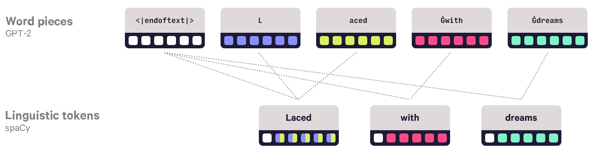

# spaCy遇到变形金刚：微调BERT，XLNet和GPT-2

2019年8月2日· **Matthew Honnibal和Ines Montani**

像BERT，GPT-2和XLNet这样的大型变压器模型已经为几乎每个NLP排行榜树立了准确性的新标准。现在，您可以通过我们开发的新接口库在[spaCy中](https://spacy.io/)使用这些模型，该接口库将spaCy连接到[Hugging Face](https://huggingface.co/)的出色实现。

在本文中，我们介绍了新的包装库[`spacy-transformers`](https://github.com/explosion/spacy-transformers)。它具有针对多个模型的一致且易于使用的界面，可以提取功能来为您的NLP管道提供动力。通过spaCy的标准培训API 提供了**对变压器模型**进行**微调的**支持`nlp.update`。该库还计算**与spaCy的语言标记化**的**对齐方式**，因此您可以将转换器功能与实际单词相关联，而不仅仅是单词。基于变压器的管道并不是每个用例都完美，但它们也不仅仅用于研究：即使您正在大规模处理文本，您的团队也可以通过多种方式利用这些巨大但高度复杂的管道准确的模型。

更新（2019年10月）该`spacy-transformers`程序包以前称为`spacy-pytorch-transformers`。自从发布此博客文章以来，Hugging Face已发布了更新且重命名的`transformers`软件包，该软件包现在同时支持PyTorch和TensorFlow2。我们已相应地更新了库和此博客文章。

## [变压器与转移学习](https://explosion.ai/blog/spacy-transformers#transformers-transfer-learning)

自然语言处理（NLP）系统面临着一个称为“知识获取瓶颈”的问题。深度神经网络通过构建在任务之间良好传递的**密集表示形式**，提供了一种解决方案。在过去的几年中，研究表明，只要网络足够大以表示稀有用法现象的长尾，就可以从未标记的文本中有效地获得语言知识。为了继续扩展网络的规模，研究特别集中在可以有效使用当前GPU和TPU硬件的模型以及支持高效并行训练的模型上。

其结果是一类新的体系结构，提供了与现有技术截然不同的一组权衡。变压器使用一种网络架构，该架构对有关字序和本地上下文重要性的较少假设进行硬编码。当模型很小或数据有限时，这种（略多于）“空白状态”的方法是一个缺点，但是有了足够大的模型和足够的示例，转换器可以对**语言信息**有更微妙的**理解**。变压器架构**使更大的模型更好**。使用以前的技术，如果您只是使模型变大（因此变慢），那么即使有足够的训练数据，您的准确性也会相当快地稳定下来。变压器还使您可以更好地利用昂贵的GPU和TPU硬件-另一个仅与较大型号有关的好处。

### [在生产中使用变压器模型](https://explosion.ai/blog/spacy-transformers#transformers-production)

即使变压器模型每个月都打破了新的精度记录，将它们直接应用于大多数实际问题也不容易。通常，如果NLP完全值得一做，那就值得快速采取行动：这些技术通常只适合需要处理大量文本或需要实时答案的应用程序。您的项目应该已经可以访问具有人类水平的自然语言理解能力的流程，但代价是运行时成本高且延迟长：[手动注释](https://explosion.ai/blog/supervised-learning-data-collection)。变压器模型提供了一个新的中间点：比手动注释便宜得多且延迟较低，但对于大多数直接应用而言仍然太慢。在某些问题上几乎与手动注释一样准确，但是具有不可预测的错误和难以推理的输出。

在最近在Google柏林的一次演讲中，Jacob Devlin描述了Google如何在内部使用他的[BERT架构](https://arxiv.org/abs/1810.04805)。这些模型**太大，无法在生产中使用**，但是可以用于**监督较小的生产模型**。基于（相当模糊的）市场营销副本，AWS可能在SageMaker中做了类似的事情。变压器模型的另一个离线用例是质量控制-这是[S＆P Global使用BERT的方式](https://www.youtube.com/watch?v=rdmaR4WRYEM&list=PLBmcuObd5An4UC6jvK_-eSl6jCvP1gwXc&index=9)，因为它们的应用环境要求严格的准确性保证。另一个潜在的用例是**监视**，作为一种“运行状况检查”，以评估生产模型如何对最新数据执行。

## [介绍spacy-transformers](https://explosion.ai/blog/spacy-transformers#spacy-transformers)

[托马斯·沃尔夫](https://twitter.com/Thom_Wolf)（[Thomas Wolf）](https://twitter.com/Thom_Wolf)和“ [拥抱脸”](https://huggingface.co/)（[Hugging Face）](https://huggingface.co/)的其他英雄已经在一个易于使用的软件包中实现了几种最新的变压器模型[`transformers`](https://github.com/huggingface/transformers)。这使得编写[包装库](https://github.com/explosion/spacy-transformers)变得容易，[该包装库](https://github.com/explosion/spacy-transformers)使您可以在spaCy管道中使用这些模型。我们还利用该`spacy package`命令构建了pip包，这些包提供了权重，入口点和所有要求。这样，您可以使用与其他模型包相同的工作流程下载和加载基于变压器的模型：

```bash
pip install spacy-transformers
python -m spacy download en_trf_bertbaseuncased_lg
```

| 空间模型包                                                   | 预训练模型               | 语言 | 作者                                                      |
| ------------------------------------------------------------ | ------------------------ | ---- | --------------------------------------------------------- |
| [`en_trf_bertbaseuncased_lg`](https://github.com/explosion/spacy-models/releases/tag/en_trf_bertbaseuncased_lg-2.2.0) | `bert-base-uncased`      | 英语 | [谷歌研究](https://github.com/google-research/bert)       |
| [`de_trf_bertbasecased_lg`](https://github.com/explosion/spacy-models/releases/tag/de_trf_bertbasecased_lg-2.2.0) | `bert-base-german-cased` | 德语 | [深层](https://deepset.ai/german-bert)                    |
| [`en_trf_xlnetbasecased_lg`](https://github.com/explosion/spacy-models/releases/tag/en_trf_xlnetbasecased_lg-2.2.0) | `xlnet-base-cased`       | 英语 | [CMU / Google Brain](https://github.com/zihangdai/xlnet/) |

**包装里有什么？**这些软件包包含配置设置，转换器模型的二进制权重以及用于词片标记化的映射表。

转换器管道具有一个`trf_wordpiecer`组件，该组件执行模型的字词预处理，以及一个`trf_tok2vec`组件，该组件在文档上运行转换器，并将结果保存到内置`doc.tensor`属性和几个[扩展属性中](https://github.com/explosion/spacy-transformers#extension-attributes)。


模型设置令牌矢量编码器组件[定制钩](https://spacy.io/usage/processing-pipelines#custom-components-user-hooks)出重载spaCy的默认行为的`.vector`属性，并`.similarity`在方法上`Token`，`Span`和`Doc`对象。默认情况下，这些通常引用单词向量表。自然地，在转换器模型中，我们宁愿使用该`doc.tensor`属性，因为该属性拥有更多信息，且与上下文相关。

```python
import spacy
import torch
import numpy
from numpy.testing import assert_almost_equal

is_using_gpu = spacy.prefer_gpu()
if is_using_gpu:
    torch.set_default_tensor_type("torch.cuda.FloatTensor")

nlp = spacy.load("en_trf_bertbaseuncased_lg")
doc = nlp("Here is some text to encode.")
assert doc.tensor.shape == (7, 768)  # Always has one row per token
doc._.trf_word_pieces_  # String values of the wordpieces
doc._.trf_word_pieces  # Wordpiece IDs (note: *not* spaCy's hash values!)
doc._.trf_alignment  # Alignment between spaCy tokens and wordpieces
# The raw transformer output has one row per wordpiece.
assert len(doc._.trf_last_hidden_state) == len(doc._.trf_word_pieces)
# To avoid losing information, we calculate the doc.tensor attribute such that
# the sum-pooled vectors match (apart from numeric error)
assert_almost_equal(doc.tensor.sum(axis=0), doc._.trf_last_hidden_state.sum(axis=0), decimal=5)
span = doc[2:4]
# Access the tensor from Span elements (especially helpful for sentences)
assert numpy.array_equal(span.tensor, doc.tensor[2:4])
# .vector and .similarity use the transformer outputs
apple1 = nlp("Apple shares rose on the news.")
apple2 = nlp("Apple sold fewer iPhones this quarter.")
apple3 = nlp("Apple pie is delicious.")
print(apple1[0].similarity(apple2[0]))  # 0.73428553
print(apple1[0].similarity(apple3[0]))  # 0.43365782
```

**有关性能的说明**Transformer体系结构并非旨在在CPU上有效运行，因此我们建议您提供可用于培训和使用的GPU。在内部，该库依赖于[PyTorch](https://pytorch.org/docs/stable/dlpack.html)和[Cupy](https://docs-cupy.chainer.org/en/stable/reference/generated/cupy.fromDlpack.html)支持的DLPack格式，该格式允许PyTorch与spaCy的机器学习库[Thinc](https://github.com/explosion/thinc)之间的零复制互操作。

这意味着包装器即使在不同库之间进行数组通信时，其开销也可以忽略不计。但是，包装策略确实存在一些当前的缺点。主要的问题是PyTorch和Cupy各自使用不同的分配缓存，从而导致工作负载内存不足错误，而仅使用PyTorch可能会很好。当前也不支持多个GPU。我们正在处理这两个问题。

最重要的功能是**变压器**的**原始输出**，可以在处进行访问`doc._.trf_outputs.last_hidden_state`。此变量为您提供了一个张量，每个单词令牌具有一行。该`doc.tensor`属性为每个spaCy令牌提供一行，如果您正在处理令牌级任务（例如词性标记或拼写更正），该属性将非常有用。我们已经在**计算**模型的各种词片标记方案与spaCy的[语言动机标记](https://spacy.io/usage/linguistic-features#tokenization)方案之间的一致性，并采用了加权方案以确保不会丢失任何信息。

我们还尝试确保对每个不同模型正确处理预处理细节，例如边界标记。似乎很小的细节（例如，应将“类”令牌放在句子的开头（对于BERT）还是结尾（对于XLNet），对于有效的微调可能会产生很大的不同。如果变压器的输入与预训练的方式不匹配，则它将不得不更多地依赖于您的带标签的小型训练语料库，从而降低准确性。我们希望为**变压器模型**提供更**统一的界面**还将帮助研究人员以及生产用户。对齐的标记化对于回答诸如“这两个转换器是否注意相同的单词？”之类的问题尤其有用。您还可以在管道中添加spaCy的标记器，解析器和实体识别器，这将允许您提出诸如“句法歧义时注意模式是否会改变？”之类的问题。

### [转移学习](https://explosion.ai/blog/spacy-transformers#transfer-learning)

预训练的变压器模型的主要用例是转移学习。您将加载经过**大量**文本训练的**大型通用模型**，并开始使用**针对您的问题的标签**对较小的数据集进行训练。该`spacy-transformers`程序包具有自定义管道组件，这使此操作特别容易。我们提供了一个用于文本分类的示例组件。用于其他任务的类似组件的开发应该非常简单。

该`trf_textcat`组件基于spaCy的内置功能，[`TextCategorizer`](https://spacy.io/api/textcategorizer)并通过该`trf_tok2vec`组件支持使用由变压器模型分配的功能。这使您可以使用BERT等模型来预测上下文令牌表示，然后在顶部将文本分类器学习为特定于任务的“头”。该API与其他spaCy管道相同：

```python
示例数据TRAIN_DATA = [
    ("text1", {"cats": {"POSITIVE": 1.0, "NEGATIVE": 0.0}})
]
训练循环import spacy
from spacy.util import minibatch
import random
import torch

is_using_gpu = spacy.prefer_gpu()
if is_using_gpu:
    torch.set_default_tensor_type("torch.cuda.FloatTensor")

nlp = spacy.load("en_trf_bertbaseuncased_lg")
print(nlp.pipe_names) # ["sentencizer", "trf_wordpiecer", "trf_tok2vec"]
textcat = nlp.create_pipe("trf_textcat", config={"exclusive_classes": True})
for label in ("POSITIVE", "NEGATIVE"):
    textcat.add_label(label)
nlp.add_pipe(textcat)

optimizer = nlp.resume_training()
for i in range(10):
    random.shuffle(TRAIN_DATA)
    losses = {}
    for batch in minibatch(TRAIN_DATA, size=8):
        texts, cats = zip(*batch)
        nlp.update(texts, cats, sgd=optimizer, losses=losses)
    print(i, losses)
nlp.to_disk("/bert-textcat")
```

**关于示例**此示例已简化为显示最少的工作流。有关更全面的训练循环，请参见[`train_textcat.py`](https://github.com/explosion/spacy-transformers/blob/master/examples/train_textcat.py)示例脚本，该脚本显示了如何在[IMDB数据](https://ai.stanford.edu/~amaas/data/sentiment/)上训练文本分类器。

我们仍在测试和改进此方面的工作流程，还有许多尚未实现的功能。我们目前缺少的最重要的功能是**对所有模型输出的支持**：我们目前仅通过最后一个隐藏状态。完整的隐藏状态激活和注意矩阵应尽快可用。在API中，我们仍然需要提供许多选项，尤其是能够配置**是否将更新传播**回转换器模型的功能。

我们特别希望在我们的[注释工具Prodigy中](https://prodi.gy/)为这些变压器模型提供支持。当我们设计Prodigy时，我们的核心假设之一是，**稍加监督可能会大有帮助**。凭借**良好的工具**和**完善的注释方案**，您无需注释数百万个数据点-这意味着您无需将注释任务框架化为低价值的点击工作。现代的转移学习技术正在证明这一点。[谢等。（2019）](https://arxiv.org/abs/1904.12848)研究表明，仅对1％的IMDB情绪分析数据进行训练的变压器模型（仅举几个例子）就可以超过2016年之前的最新水平。尽管该领域的发展速度超出了我们的预期，但这种工具辅助的工作流程正是我们将Prodigy设计为可编写脚本且对开发人员友好的原因。

### [根据您的任务微调预训练的变压器模型](https://explosion.ai/blog/spacy-transformers#fine-tuning)

[彼得斯等。（2019）](https://arxiv.org/abs/1903.05987)对两种转移学习方法进行了详细调查：微调（🔥）和特征提取（❄️）。他们发现这两种方法都具有优势，having️具有实际优势，有时根据任务和数据集的准确性在性能方面优于❄。当前的文本分类模型使用🔥，并遵循[Devlin等。（2018）](https://arxiv.org/abs/1810.04805)使用类别标记的向量表示句子，并将该向量向前传递到softmax层以执行分类。对于多文档句子，我们对softmax输出执行均值合并。


管道组件可以通过增加属性**来将梯度传递回变压器**，该`doc._.trf_d_last_hidden_state`属性是一个numpy / cupy数组，用于保存相对于变压器的最后隐藏状态的梯度。要实现新任务的定制组件，您应该创造一个新的子类`spacy.pipeline.Pipe`定义`Model`，`predict`，`set_annotations`和`update`方法。在该`update`方法期间，您的组件将接收一批包含[`Doc`](https://spacy.io/api/doc)变换器特征的[`GoldParse`](https://spacy.io/api/goldparse)对象，以及一批包含黄金标准注释的对象。使用这些输入，您应该更新模型，并增加模型上最后隐藏状态的梯度。`doc._.trf_last_hidden_state`变量。您的子类可以按照自己喜欢的任何方式处理其模型，但是，如果您使用的是PyTorch，最简单的方法是使用[Thinc的PyTorch包装器](https://github.com/explosion/thinc/blob/master/thinc/extra/wrappers.py)类，这将使您不必实现往返字节/磁盘序列化方法。我们希望将来发布包含推荐工作流程的完整教程。

### [将字词和输出与语言标记对齐](https://explosion.ai/blog/spacy-transformers#alignment)

变压器模型通常在使用[“ wordpiece”算法](https://github.com/google/sentencepiece)预处理的文本上训练，这限制了模型需要考虑的不同标记类型的数量。Wordpiece可方便地训练神经网络，但不会产生与“ word”的任何语言概念相匹配的分段。大多数稀有单词将映射到多个单词标记，并且有时对齐方式将是多对多的。这是一个示例，显示了不同的预训练模型使用[IMDB数据集中](https://ai.stanford.edu/~amaas/data/sentiment/)的文本片段生成的单词标记：

```c
文字# bert-base-uncased
['[CLS]', 'laced', 'with', 'dreams', '-', 'dripping', 'in', 'reality', ',', 'the', 'american', 'dream', 'reign', '##ites', 'after', '9', '.', '11', 'with', 'a', 'true', 'story', 'about', 'the', 'devil', 'ray', "'", 's', 'mid', '-', 'life', 'rookie', ',', 'jimmy', 'morris', '.', '[SEP]']
# gpt2
['<|endoftext|>', 'L', 'aced', 'Ġwith', 'Ġdreams', 'Ġ-', 'Ġdripping', 'Ġin', 'Ġreality', ',', 'Ġthe', 'ĠAmerican', 'ĠDream', 'Ġreign', 'ites', 'Ġafter', 'Ġ9', '.', '11', 'Ġwith', 'Ġa', 'Ġtrue', 'Ġstory', 'Ġabout', 'Ġthe', 'ĠDevil', 'ĠRay', "'s", 'Ġmid', '-', 'life', 'Ġrookie', ',', 'ĠJimmy', 'ĠMorris', '.', '<|endoftext|>']
# xlnet-base-cased
['<cls>', '▁Lac', 'ed', '▁with', '▁dreams', '▁', '-', '▁dripping', '▁in', '▁reality', ',', '▁the', '▁American', '▁Dream', '▁reign', 'ites', '▁after', '▁9', '.', '11', '▁with', '▁a', '▁true', '▁story', '▁about', '▁the', '▁Devil', '▁Ray', "'", 's', '▁mid', '-', 'life', '▁rookie', ',', '▁Jimmy', '▁Morris', '.', '</s>']
# xlm-mlm-enfr-1024
['<s>', 'laced</w>', 'with</w>', 'dreams</w>', '-</w>', 'dri', 'pping</w>', 'in</w>', 'reality</w>', ',</w>', 'the</w>', 'americ', 'an</w>', 'dream</w>', 're', 'ign', 'ites</w>', 'after</w>', '9.', '11</w>', 'with</w>', 'a</w>', 'true</w>', 'story</w>', 'about</w>', 'the</w>', 'devil</w>', 'ray</w>', "'s</w>", 'mid</w>', '-</w>', 'life</w>', 'rookie</w>', ',</w>', 'j', 'im', 'my</w>', 'mor', 'ris</w>', '.</w>', '</s>']
```

**为什么会有奇怪的符号？**词片标记器通常会记录空格的位置，以便可以将词片标记的序列重新组合为普通字符串。但是，如何记录空白的细节有所不同。BERT令牌生成器会插入`##`不以空格开头的单词，而GPT-2令牌生成器则使用该字符`Ġ`代替空格。大多数还执行一些unicode和空格标准化。最后，大多数转换器依赖特殊的控制令牌`[CLS]`，这些令牌应该出现在字符串周围，这对于支持句子对和文本分类任务很重要。

```python
字词（已清理）# bert-base-uncased
['laced', 'with', 'dreams', '-', 'dripping', 'in', 'reality', ',', 'the', 'american', 'dream', 'reign', 'ites', 'after', '9', '.', '11', 'with', 'a', 'true', 'story', 'about', 'the', 'devil', 'ray', "'", 's', 'mid', '-', 'life', 'rookie', ',', 'jimmy', 'morris', '.']
# gpt2
['L', 'aced', 'with', 'dreams', '-', 'dripping', 'in', 'reality', ',', 'the', 'American', 'Dream', 'reign', 'ites', 'after', '9', '.', '11', 'with', 'a', 'true', 'story', 'about', 'the', 'Devil', 'Ray', "'s", 'mid', '-', 'life', 'rookie', ',', 'Jimmy', 'Morris', '.']
# xlnet-base-cased
['Lac', 'ed', 'with', 'dreams', '', '-', 'dripping', 'in', 'reality', ',', 'the', 'American', 'Dream', 'reign', 'ites', 'after', '9', '.', '11', 'with', 'a', 'true', 'story', 'about', 'the', 'Devil', 'Ray', "'", 's', 'mid', '-', 'life', 'rookie', ',', 'Jimmy', 'Morris', '.']
# xlm-mlm-enfr-1024
['laced', 'with', 'dreams', '-', 'dri', 'pping', 'in', 'reality', ',', 'the', 'americ', 'an', 'dream', 're', 'ign', 'ites', 'after', '9.', '11', 'with', 'a', 'true', 'story', 'about', 'the', 'devil', 'ray', "'s", 'mid', '-', 'life', 'rookie', ',', 'j', 'im', 'my', 'mor', 'ris', '.']
空间令牌['Laced', 'with', 'dreams', '-', 'dripping', 'in', 'reality', ',', 'the', 'American', 'Dream', 'reignites', 'after', '9.11', 'with', 'a', 'true', 'story', 'about', 'the', 'Devil', 'Ray', "'s", 'mid', '-', 'life', 'rookie', ',', 'Jimmy', 'Morris', '.']
```

如您所见，单词定义的分段与“单词”的语言概念不太接近。许多细分都非常令人惊讶，例如GPT-2分类器决定将“花边”分为两个标记：“ L”和“ aced”。词汇分词器的优先级是限制词汇量，因为词汇量是当前神经语言模型面临的主要挑战之一（[Yang等人，2017](https://arxiv.org/abs/1711.03953)）。尽管毫无疑问，它已被证明是一种有效的模型训练技术，但语言标记提供**了更好的解释性和互操作性**。考虑到各个词片标记化之间的差异，这一点尤其正确：每个模型都需要自己的分割，而下一个模型无疑将再次需要不同的分割。



我们一直在谨慎地计算对齐的`doc.tensor`表示形式，并优先考虑避免信息丢失。为了使这项工作有效，将张量的每一行（对应于spaCy令牌）设置为令牌所对齐的张量**的行**的**加权和**`last_hidden_state`，其中权重与所对齐的其他spaCy令牌的数量成比例到那一行。为了包括（通常很重要，请参阅[Clark等人，2019年](https://arxiv.org/abs/1906.04341)）边界标记的信息，我们可以想象这些标记也与句子中的所有标记“对齐”。该加权方案的实施可以在该[`TransformersTok2Vec.set_annotations`](https://github.com/explosion/spacy-trf-transformers/blob/master/spacy_transformers/tok2vec.py)方法中找到。

### [批处理，填充和句子处理](https://explosion.ai/blog/spacy-transformers#batching)

变压器模型在序列长度方面具有三次运行时间和内存复杂性。这意味着**需要将**较长的文本**划分为句子**以达到合理的效率。`spacy-transformers`在内部处理此问题，并要求在管道中存在句子边界检测。我们建议使用spaCy的内置sendencizer [组件](https://spacy.io/usage/linguistic-features#sbd-component)。在内部，转换器模型将对句子进行预测，并且将重构所得的张量特征以产生文档级注释。为了进一步提高效率并减少内存需求，我们还在内部执行**基于长度的子批处理**。


子批处理按序列长度将批处理的句子重新分组，以最大程度地减少所需的填充量。每批3000个单词的默认值在Tesla V100上可以很好地工作。许多预训练的变压器模型具有最大序列长度。如果句子长于最大值，则该句子将被截断，并且受影响的结尾标记将收到归零向量。

## [结论](https://explosion.ai/blog/spacy-transformers#conclusion)

目前训练大型变压器模型需要**大量的计算资源**。即使计算资源原本处于闲置状态，但仅能源消耗就相当可观。[Strubell（2019）](https://arxiv.org/abs/1906.02243)计算出，对BERT基础模型进行预训练会产生大致等于跨大西洋飞行的碳排放量。正如塞巴斯蒂安·鲁德（Sebastian Ruder）[在spaRy IRL的主题演讲中](https://www.youtube.com/watch?v=hNPwRPg9BrQ&list=PLBmcuObd5An4UC6jvK_-eSl6jCvP1gwXc)强调的[那样](https://www.youtube.com/watch?v=hNPwRPg9BrQ&list=PLBmcuObd5An4UC6jvK_-eSl6jCvP1gwXc)，因此，重要的是**，尽可能广泛地重用**为这些模型分配的预训练权重，而不是重新计算。

但是，有效地重用预训练的砝码可能会很麻烦。模型通常是在经过统一预处理的文本上进行训练的，这可以使它们对训练和运行时之间的微小差异敏感。这些预处理问题的影响可能难以预测，也难以推理。Hugging Face的`transformers`库在解决此问题方面已经走了很长的路要走，因为它可以轻松地使用具有相当一致的接口的预训练模型和标记器。但是，仍然需要进行许多预处理才能获得最佳性能。我们希望我们的包装库在这方面会很有用。