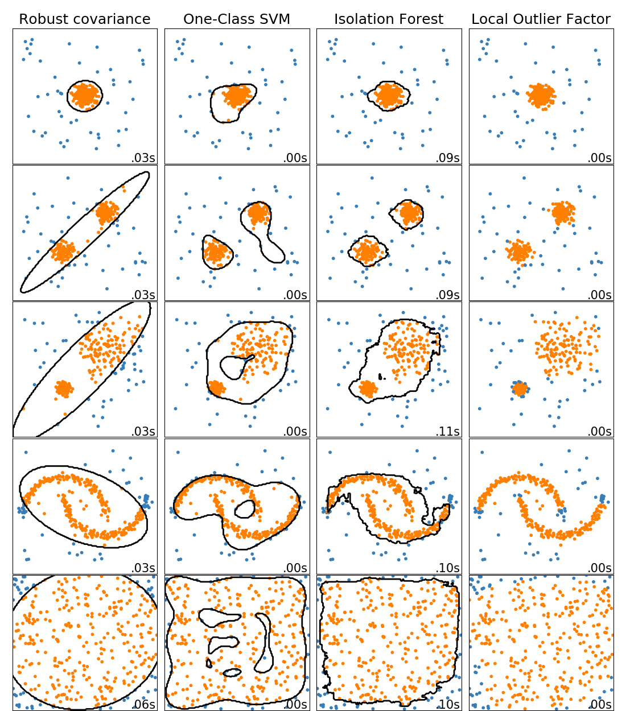
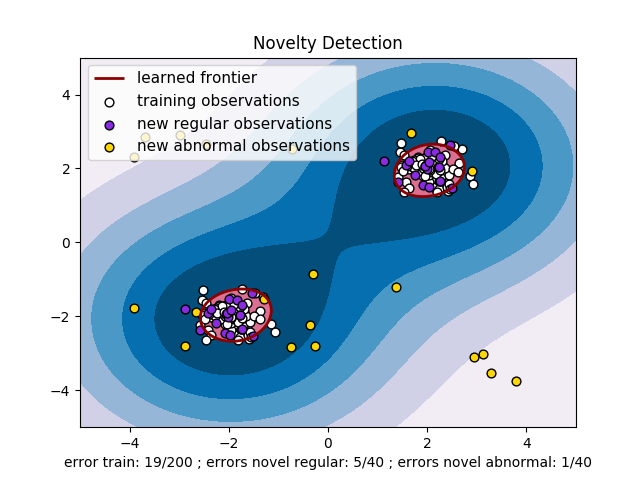
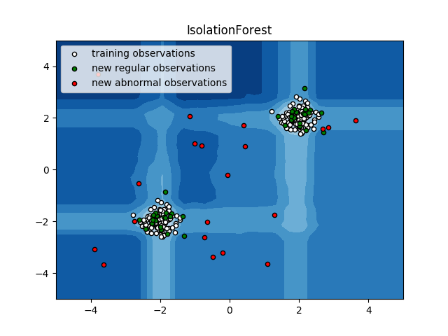
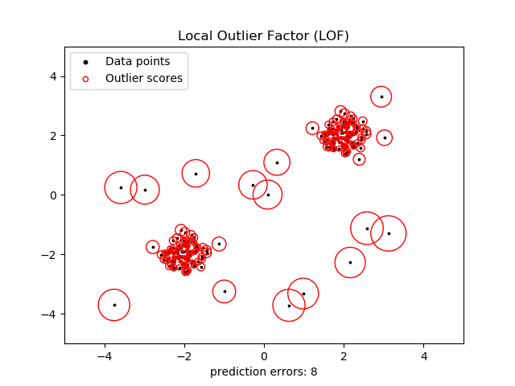
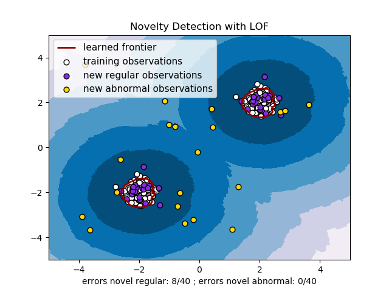

# 2.7. 新奇点和离群点检测

校验者:
        [@RyanZhiNie](https://github.com/RyanZhiNie)
        [@羊三](https://github.com/apachecn/scikit-learn-doc-zh)
        [@Loopy](https://github.com/loopyme)
        [@barrycg](https://github.com/barrycg)
翻译者:
        [@羊三](https://github.com/apachecn/scikit-learn-doc-zh)

许多应用程序需要能够对新观测值(observation _译注:观测到的样本的值_ )进行判断，判断其是否与现有观测值服从同一分布(即新观测值为内围点(inlier))，相反则被认为不服从同一分布(即新观测值为离群点(outlier))。通常，这种能力被用于清理真实数据集, 但它有两种重要区分:

* **离群点检测:** 训练数据包含离群点,即远离其它内围点。离群点检测估计器会尝试拟合出训练数据中内围点聚集的区域, 会忽略有偏离的观测值。
* **新奇点检测:** 训练数据未被离群点污染，我们对新观测值是否为离群点感兴趣。在这个语境下，离群点被认为是新奇点。

离群点检测 和 新奇点检测 都被用于异常检测, 所谓异常检测就是检测反常的观测值或不平常的观测值。离群点检测 也被称之为 无监督异常检测; 而 新奇点检测 被称之为 半监督异常检测。 在离群点检测的语境下,  离群点/异常点 不能够形成一个稠密的聚类簇，因为可用的估计器都假定了 离群点/异常点 位于低密度区域。相反的，在新奇点检测的语境下，新奇点/异常点 是可以形成 稠密聚类簇的，只要它们在训练数据的一个低密度区域，这被认为是正常的。

scikit-learn项目提供了一套可用于新奇点或离群点检测的机器学习工具。该策略是以无监督的方式学习数据中的对象来实现的:

```py
estimator.fit(X_train)

```

然后可以使用 *predict* 方法将新观测值归为内围点或离群点:

```py
estimator.predict(X_test)

```

内围点被标记为1，而离群点被标记为-1。 预测方法在估计器计算出的原始评分函数上使用一个阈值。这个评分函数可以通过方法`score_samples`进行访问，而且这个阈值可以由参数`contamination`控制。

`decision_function`方法也是使用评分函数定义的，这样的话，得分为负值的就是 离群点, 得分为非负的就是 内围点:

```py
estimator.decision_function(X_test)
```

请注意 [neighbors.LocalOutlierFactor](https://scikit-learn.org/stable/modules/generated/sklearn.neighbors.LocalOutlierFactor.html#sklearn.neighbors.LocalOutlierFactor) 类默认不支持 `predict`, `decision_function` 和 `score_samples` 方法，而只支持 `fit_predict` 方法, 因为这个估计器从一开始就是被用到 离群点检测中去的。训练样本的异常性得分可以通过访问 `negative_outlier_factor_`属性来获取。

如果你真的想用 [neighbors.LocalOutlierFactor](https://scikit-learn.org/stable/modules/generated/sklearn.neighbors.LocalOutlierFactor.html#sklearn.neighbors.LocalOutlierFactor) 类进行新奇点检测, 即：对新的未见过的样本 预测其标签或计算其异常性得分, 你可以在实例化这个估计器的时候将其`novelty`参数设为 True ，这一步必须要在拟合之前做。这样的话，`fit_predict`方法就不可用了。

>**警告** ：使用局部离群因子(Local Outlier Factor,LOF)进行新奇点检测
>
>当`novelty`参数被设为 True 时，在新的未见过的数据上，你只能使用 `predict`, `decision_function` 和 `score_samples` ，而不能把这几个函数用在训练数据上， 否则会导致错误的结果。训练样本的异常性得分总是可以通过访问`negative_outlier_factor_`属性来获取。

[neighbors.LocalOutlierFactor](https://scikit-learn.org/stable/modules/generated/sklearn.neighbors.LocalOutlierFactor.html#sklearn.neighbors.LocalOutlierFactor) 类在离群点检测和新奇点检测中的行为被总结在下面的表中。

|　方法 | 离群点检测 | 新奇点检测 |
|---|---|---|
|`fit_predict` | 可用 | 不可用 |
|`predict` | 不可用 | 只能用于新数据 |
|`decision_function` | 不可用 | 只能用于新数据 |
|`score_samples` | 用 `negative_outlier_factor_` | 只能用于新数据 |

## 2.7.1.  离群点检测方法一览

下面这个示例针对scikit-learn 中的所有离群点检测算法进行了对比。 局部离群因子(LOF, Local Outlier Factor) 没有在下图画出黑色的决策边界，因为在离群点检测中使用LOF时 它没有 predict 方法可以用在新数据上（见上面表格）。

[](https://scikit-learn.org/stable/auto_examples/plot_anomaly_comparison.html)

[ensemble.IsolationForest](https://scikit-learn.org/stable/modules/generated/sklearn.ensemble.IsolationForest.html#sklearn.ensemble.IsolationForest) 和 [neighbors.LocalOutlierFactor](https://scikit-learn.org/stable/modules/generated/sklearn.neighbors.LocalOutlierFactor.html#sklearn.neighbors.LocalOutlierFactor) 在这里所用的数据集上表现得相当好。 [svm.OneClassSVM](https://scikit-learn.org/stable/modules/generated/sklearn.svm.OneClassSVM.html#sklearn.svm.OneClassSVM) 类对离群点本来就很敏感，因此在离群点检测中表现的不是很好(_译注: 这里的敏感 应该指的是会把离群点划到决策边界内_)。最后, [covariance.EllipticEnvelope](https://scikit-learn.org/stable/modules/generated/sklearn.covariance.EllipticEnvelope.html#sklearn.covariance.EllipticEnvelope) 类 假定了数据是服从高斯分布的且要学习一个椭圆(ellipse)。关于这个对比试验中各种estimators的更多详细信息,请参考[ Comparing anomaly detection algorithms for outlier detection on toy datasets](https://scikit-learn.org/stable/auto_examples/plot_anomaly_comparison.html#sphx-glr-auto-examples-plot-anomaly-comparison-py)和后续小节。

> **示例**:
>* 查看[ Comparing anomaly detection algorithms for outlier detection on toy datasets](https://scikit-learn.org/stable/auto_examples/plot_anomaly_comparison.html#sphx-glr-auto-examples-plot-anomaly-comparison-py)以对比 [svm.OneClassSVM](https://scikit-learn.org/stable/modules/generated/sklearn.svm.OneClassSVM.html#sklearn.svm.OneClassSVM), [ensemble.IsolationForest](https://scikit-learn.org/stable/modules/generated/sklearn.ensemble.IsolationForest.html#sklearn.ensemble.IsolationForest), [neighbors.LocalOutlierFactor](https://scikit-learn.org/stable/modules/generated/sklearn.neighbors.LocalOutlierFactor.html#sklearn.neighbors.LocalOutlierFactor) 和 [covariance.EllipticEnvelope](https://scikit-learn.org/stable/modules/generated/sklearn.covariance.EllipticEnvelope.html#sklearn.covariance.EllipticEnvelope) 的表现.

## 2.7.2. Novelty Detection（新奇点检测）

考虑一个以  个特征描述、包含  个有着相同分布的观测值的数据集。 现在考虑我们再往该数据集中添加一个观测值。 如果新观测与原有观测有很大差异，我们就可以怀疑它是否是内围值(regular _译注: 应是常规值,这里用已使用过的内围值_)吗？ （即是否来自同一分布？）或者相反，如果新观测与原有观测很相似，我们就无法将其与原有观测区分开吗？ 这就是新奇点检测工具和方法所解决的问题。

一般来说，它将要学习出一个粗略且紧密的边界，界定出初始观测分布的轮廓，绘制在嵌入的  维空间中。那么，如果后续的观测值都落在这个边界划分的子空间内，则它们被认为来自与初始观测值相同的总体。 否则，如果它们在边界之外，我们可以说就我们评估中给定的置信度而言，它们是异常的。

One-Class SVM（单类支持向量机）已经由 Schölkopf 等人采用以实现新奇检测，并在 [支持向量机](svm.html#svm) 模块的 [`svm.OneClassSVM`](https://scikit-learn.org/stable/modules/generated/sklearn.svm.OneClassSVM.html#sklearn.svm.OneClassSVM "sklearn.svm.OneClassSVM") 对象中实现。 需要选择 kernel 和 scalar 参数来定义边界。 通常选择 RBF kernel，即使没有确切的公式或算法来设置其带宽(bandwidth)参数。这是 scikit-learn 实现中的默认值。  参数，也称为单类支持向量机的边沿，对应于在边界之外找到新的但常规的观测值的概率。

> **参考资料**:
>*   [Estimating the support of a high-dimensional distribution](http://dl.acm.org/citation.cfm?id=1119749) Schölkopf, Bernhard, et al. Neural computation 13.7 (2001): 1443-1471.

> **示例**:
>*   参见 [One-class SVM with non-linear kernel (RBF)](https://scikit-learn.org/stable/auto_examples/svm/plot_oneclass.html#sphx-glr-auto-examples-svm-plot-oneclass-py) ，通过 [`svm.OneClassSVM`](https://scikit-learn.org/stable/modules/generated/sklearn.svm.OneClassSVM.html#sklearn.svm.OneClassSVM "sklearn.svm.OneClassSVM") 对象学习一些数据来将边界可视化。
* [Species distribution modeling](https://scikit-learn.org/stable/auto_examples/applications/plot_species_distribution_modeling.html#sphx-glr-auto-examples-applications-plot-species-distribution-modeling-py)

[](https://scikit-learn.org/stable/auto_examples/svm/plot_oneclass.html)

## 2.7.3. Outlier Detection（离群点检测）

 离群点检测类似于新奇点检测，其目的是将内围观测(regular observation)的中心与一些被称为 “离群点” 的污染数据进行分离。 然而，在离群点检测的情况下，我们没有干净且适用于训练任何工具的数据集来代表内围观测的总体。

### 2.7.3.1. Fitting an elliptic envelope（椭圆模型拟合）

实现离群点检测的一种常见方式是假设常规数据来自已知分布（例如，数据服从高斯分布）。 从这个假设来看，我们通常试图定义数据的 “形状”，并且可以将偏远观测(outlying observation)定义为足够远离拟合形状的观测。

scikit-learn 提供了 [`covariance.EllipticEnvelope`](https://scikit-learn.org/stable/modules/generated/sklearn.covariance.EllipticEnvelope.html#sklearn.covariance.EllipticEnvelope "sklearn.covariance.EllipticEnvelope") 对象，它能拟合出数据的稳健协方差估计，从而为中心数据点拟合出一个椭圆，忽略不和该中心模式相关的点。

例如，假设内围数据服从高斯分布，它将稳健地（即不受异常值的影响）估计内围位置和协方差。 从该估计得到的马氏距离用于得出偏远性(outlyingness)度量。 该策略如下图所示。

[](https://scikit-learn.org/stable/auto_examples/covariance/plot_mahalanobis_distances.html)

> **示例**:
>*   参见 [Robust covariance estimation and Mahalanobis distances relevance](https://scikit-learn.org/stable/auto_examples/covariance/plot_mahalanobis_distances.html#sphx-glr-auto-examples-covariance-plot-mahalanobis-distances-py) 说明对位置和协方差使用标准估计 ([`covariance.EmpiricalCovariance`](https://scikit-learn.org/stable/modules/generated/sklearn.covariance.EmpiricalCovariance.html#sklearn.covariance.EmpiricalCovariance "sklearn.covariance.EmpiricalCovariance")) 或稳健估计 ([`covariance.MinCovDet`](https://scikit-learn.org/stable/modules/generated/sklearn.covariance.MinCovDet.html#sklearn.covariance.MinCovDet "sklearn.covariance.MinCovDet")) 来评估观测值的偏远性的差异。

> **参考资料**:
>*   Rousseeuw, P.J., Van Driessen, K. “A fast algorithm for the minimum covariance determinant estimator” Technometrics 41(3), 212 (1999)

### 2.7.3.2. Isolation Forest（隔离森林）

在高维数据集中实现离群点检测的一种有效方法是使用随机森林。[`ensemble.IsolationForest`](https://scikit-learn.org/stable/modules/generated/sklearn.ensemble.IsolationForest.html#sklearn.ensemble.IsolationForest "sklearn.ensemble.IsolationForest") 通过随机选择一个特征,然后随机选择所选特征的最大值和最小值之间的分割值来"隔离"观测。

由于递归划分可以由树形结构表示，因此隔离样本所需的分割次数等同于从根节点到终止节点的路径长度。

在这样的随机树的森林中取平均的路径长度是数据正态性和我们的决策功能的量度。

随机划分能为异常观测产生明显的较短路径。 因此，当随机树的森林共同地为特定样本产生较短的路径长度时，这些样本就很有可能是异常的。

[ensemble.IsolationForest](https://scikit-learn.org/stable/modules/generated/sklearn.ensemble.IsolationForest.html#sklearn.ensemble.IsolationForest)的实现，是基于[tree.ExtraTreeRegressor](https://scikit-learn.org/stable/modules/generated/sklearn.tree.ExtraTreeRegressor.html#sklearn.tree.ExtraTreeRegressor)全体.按照隔离森林的原始论文，每棵树的最大深度设置为log<sub>2</sub>(n),其中ｎ是构建树所用的样本数量（详见：(Liu et al., 2008) ）

该算法在已下示例中进行了说明。

[](https://scikit-learn.org/stable/auto_examples/ensemble/plot_isolation_forest.html)

[`ensemble.IsolationForest`](https://scikit-learn.org/stable/modules/generated/sklearn.ensemble.IsolationForest.html#sklearn.ensemble.IsolationForest "sklearn.ensemble.IsolationForest")支持`warm_start=True`，这让你可以添加更多的树到一个已拟合好的模型中:

``` py
>>> from sklearn.ensemble import # 2.7.4Forest
>>> import numpy as np
>>> X = np.array([[-1, -1], [-2, -1], [-3, -2], [0, 0], [-20, 50], [3, 5]])
>>> clf = IsolationForest(n_estimators=10, warm_start=True)
>>> clf.fit(X)  # fit 10 trees  
>>> clf.set_params(n_estimators=20)  # add 10 more trees  
>>> clf.fit(X)  # fit the added trees  
```

> **示例**:
>*   参见 [IsolationForest example](https://scikit-learn.org/stable/auto_examples/ensemble/plot_isolation_forest.html#sphx-glr-auto-examples-ensemble-plot-isolation-forest-py) 说明隔离森林的用法。
>*   参见 [Outlier detection with several methods.](https://scikit-learn.org/stable/auto_examples/covariance/plot_outlier_detection.html#sphx-glr-auto-examples-covariance-plot-outlier-detection-py) 比较 [`ensemble.IsolationForest`](https://scikit-learn.org/stable/modules/generated/sklearn.ensemble.IsolationForest.html#sklearn.ensemble.IsolationForest "sklearn.ensemble.IsolationForest") 与 [`neighbors.LocalOutlierFactor`](https://scikit-learn.org/stable/modules/generated/sklearn.neighbors.LocalOutlierFactor.html#sklearn.neighbors.LocalOutlierFactor "sklearn.neighbors.LocalOutlierFactor"), [`svm.OneClassSVM`](https://scikit-learn.org/stable/modules/generated/sklearn.svm.OneClassSVM.html#sklearn.svm.OneClassSVM "sklearn.svm.OneClassSVM") (调整为执行类似离群点检测的方法）和基于协方差使用 [`covariance.EllipticEnvelope`](https://scikit-learn.org/stable/modules/generated/sklearn.covariance.EllipticEnvelope.html#sklearn.covariance.EllipticEnvelope "sklearn.covariance.EllipticEnvelope") 进行离群点检测。

> **参考资料**:
>*   Liu, Fei Tony, Ting, Kai Ming and Zhou, Zhi-Hua. “Isolation forest.” Data Mining, 2008. ICDM‘08. Eighth IEEE International Conference on.

### 2.7.3.3. Local Outlier Factor（局部离群因子）

对轻度高维数据集(即维数勉强算是高维)实现异常值检测的另一种有效方法是使用局部离群因子（LOF）算法。

[`neighbors.LocalOutlierFactor`](https://scikit-learn.org/stable/modules/generated/sklearn.neighbors.LocalOutlierFactor.html#sklearn.neighbors.LocalOutlierFactor "sklearn.neighbors.LocalOutlierFactor") （LOF）算法计算出反映观测异常程度的得分（称为局部离群因子）。 它测量给定数据点相对于其邻近点的局部密度偏差。 算法思想是检测出具有比其邻近点明显更低密度的样本。

实际上，局部密度从 k 个最近邻得到。 观测数据的 LOF 得分等于其 k 个最近邻的平均局部密度与其本身密度的比值：正常情况预期与其近邻有着类似的局部密度，而异常数据则预计比近邻的局部密度要小得多。

考虑的k个近邻数（别名参数 n_neighbors ）通常选择 1) 大于一个聚类簇必须包含对象的最小数量，以便其它对象可以成为该聚类簇的局部离散点，并且 2) 小于可能成为聚类簇对象的最大数量, 减少这K个近邻成为离群点的可能性。在实践中，这样的信息通常不可用，并且使 n_neighbors = 20 似乎通常都能使得算法有很好的表现。 当离群点的比例较高时（即大于 10% 时，如下面的示例），n_neighbors 应该较大（在下面的示例中，n_neighbors = 35）。

LOF 算法的优点是考虑到数据集的局部和全局属性：即使在具有不同潜在密度的离群点数据集中，它也能够表现得很好。 问题不在于样本是如何被分离的，而是样本与周围近邻的分离程度有多大。

当使用 LOF 进行离群点检测的时候，不能使用 predict, decision_function 和 score_samples 方法， 只能使用 fit_predict 方法。训练样本的异常性得分可以通过 negative_outlier_factor_ 属性来获得。 注意当使用LOF算法进行新奇点检测的时候(novelty 设为 True)， predict, decision_function 和 score_samples 函数可被用于新的未见过数据。请查看[使用LOF进行新奇点检测](#274-使用LOF进行新奇点检测).

该策略如下图所示。

[](https://scikit-learn.org/stable/auto_examples/neighbors/sphx_glr_plot_lof_outlier_detection.html)

> **示例**:
>*   参见 [Anomaly detection with Local Outlier Factor (LOF)](https://scikit-learn.org/stable/auto_examples/neighbors/plot_lof.html#sphx-glr-auto-examples-neighbors-plot-lof-py) 是 [`neighbors.LocalOutlierFactor`](https://scikit-learn.org/stable/modules/generated/sklearn.neighbors.LocalOutlierFactor.html#sklearn.neighbors.LocalOutlierFactor "sklearn.neighbors.LocalOutlierFactor") 使用示例。
>*   参见 [Outlier detection with several methods.](https://scikit-learn.org/stable/auto_examples/covariance/plot_outlier_detection.html#sphx-glr-auto-examples-covariance-plot-outlier-detection-py) 与其它异常检测方法进行比较。

> **参考资料**:
>*   Breunig, Kriegel, Ng, and Sander (2000) [LOF: identifying density-based local outliers.](http://www.dbs.ifi.lmu.de/Publikationen/Papers/LOF.pdf) Proc. ACM SIGMOD

## 2.7.4. 使用LOF进行新奇点检测
为了使用 [neighbors.LocalOutlierFactor](https://www.studyai.cn/modules/generated/sklearn.neighbors.LocalOutlierFactor.html#sklearn.neighbors.LocalOutlierFactor) 类进行新奇点检测, 即对新的未见过的样本 预测其标签或计算其异常性得分, 你必须在实例化估计器时, 将其`novelty`参数设为 True, 这一步必须要在拟合之前完成:

```py
lof = LocalOutlierFactor(novelty=True)
lof.fit(X_train)
```
请注意`fit_predict` 方法在这情况下就不可用了。
>**警告** ：使用局部离群因子(Local Outlier Factor,LOF)进行新奇点检测
>
>当`novelty`参数被设为 True 时，要当心。在新的未见过的数据上，你只能使用 `predict`, `decision_function` 和 `score_samples` ，而不能把这几个函数用在训练数据上， 否则会导致错误的结果。训练样本的异常性得分总是可以通过 `negative_outlier_factor_`属性来访问获取。

使用局部离群因子(LOF)进行新奇点检测的示例见下图。

[](https://www.studyai.cn/images/sphx_glr_plot_lof_novelty_detection_0011.png)
