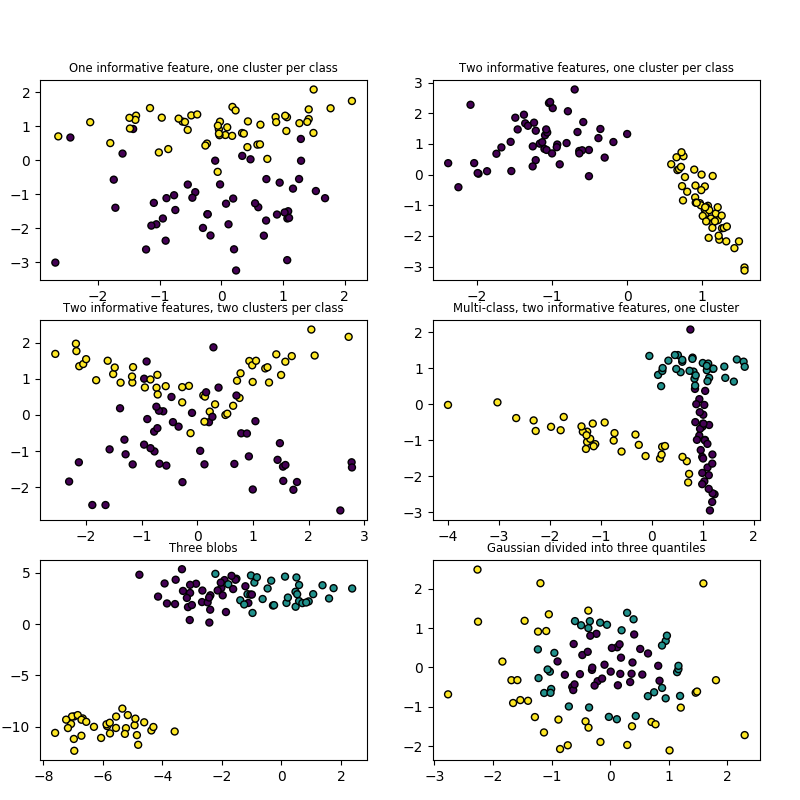
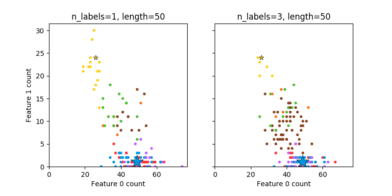

# 6. 数据集加载工具

校验者:
        [@不吃曲奇的趣多多](https://github.com/apachecn/scikit-learn-doc-zh)
        [@A](https://github.com/apachecn/scikit-learn-doc-zh)
        [@火星](https://github.com/apachecn/scikit-learn-doc-zh)
        [@Trembleguy](https://github.com/apachecn/scikit-learn-doc-zh)
        [@Loopy](https://github.com/loopyme)
        [@mahaoyang](https://github.com/mahaoyang)
翻译者:
        [@cowboy](https://github.com/apachecn/scikit-learn-doc-zh)
        [@peels](https://github.com/apachecn/scikit-learn-doc-zh)
        [@t9UhoI](https://github.com/apachecn/scikit-learn-doc-zh)
        [@Sun](https://github.com/apachecn/scikit-learn-doc-zh)

该 `sklearn.datasets` 包装在 [入门指南](50?id=加载示例数据集) 部分中嵌入了介绍一些小型玩具的数据集。

为了在控制数据的统计特性（通常是特征的 correlation （相关性）和 informativeness （信息性））的同时评估数据集 (`n_samples` 和 `n_features`) 的规模的影响，也可以生成综合数据。

这个软件包还具有帮助用户获取更大的数据集的功能，这些数据集通常由机器学习社区使用，用于对来自 ‘real world’ 的数据进行检测算法。

## 6.1. 通用数据集 API

根据所需数据集的类型，有三种主要类型的数据集API接口可用于获取数据集。

* **loaders** 可用来加载小的标准数据集,在[玩具数据集](#62-玩具数据集)中有介绍。
* **fetchers** 可用来下载并加载大的真实数据集,在[真实世界中的数据集](#63-真实世界中的数据集)中有介绍。

loaders和fetchers的所有函数都返回一个字典一样的对象，里面至少包含两项:shape为n_samples*n_features的数组，对应的字典key是data(20news groups数据集除外)以及长度为n_samples的numpy数组,包含了目标值,对应的字典key是`target`。

通过将`return_X_y`参数设置为True，几乎所有这些函数都可以将输出约束为只包含数据和目标的元组。

数据集还包含一些对`DESCR`描述，同时一部分也包含`feature_names`和`target_names`的特征。有关详细信息，请参阅下面的数据集说明

* **generation functions** 它们可以用来生成受控的合成数据集(synthetic datasets),在人工合成的数据集中有介绍。

这些函数返回一个元组(X,y)，该元组由shape为n_samples*n_features的numpy数组X和长度为n_samples的包含目标y的数组组成。

此外，还有一些用于加载其他格式或其他位置的数据集的混合工具(miscellanous tools),在[加载其他类型的数据集](#65-加载其他数据集)中有介绍

## 6.2. 玩具数据集

scikit-learn 内置有一些小型标准数据集，不需要从某个外部网站下载任何文件。

|调用|描述|
|---|---|
| [`load_boston`](https://scikit-learn.org/stable/modules/generated/sklearn.datasets.load_boston.html#sklearn.datasets.load_boston "sklearn.datasets.load_boston")([return_X_y]) | Load and return the boston house-prices dataset (regression). |
| [`load_iris`](https://scikit-learn.org/stable/modules/generated/sklearn.datasets.load_iris.html#sklearn.datasets.load_iris "sklearn.datasets.load_iris")([return_X_y]) | Load and return the iris dataset (classification). |
| [`load_diabetes`](https://scikit-learn.org/stable/modules/generated/sklearn.datasets.load_diabetes.html#sklearn.datasets.load_diabetes "sklearn.datasets.load_diabetes")([return_X_y]) | Load and return the diabetes dataset (regression). |
| [`load_digits`](https://scikit-learn.org/stable/modules/generated/sklearn.datasets.load_digits.html#sklearn.datasets.load_digits "sklearn.datasets.load_digits")([n_class, return_X_y]) | Load and return the digits dataset (classification). |
| [`load_linnerud`](https://scikit-learn.org/stable/modules/generated/sklearn.datasets.load_linnerud.html#sklearn.datasets.load_linnerud "sklearn.datasets.load_linnerud")([return_X_y]) | Load and return the linnerud dataset (multivariate regression). |
| [`load_wine`](https://scikit-learn.org/stable/modules/generated/sklearn.datasets.load_wine.html#sklearn.datasets.load_wine "sklearn.datasets.load_wine")([return_X_y]) | Load and return the wine dataset (classification). |
| [`load_breast_cancer`](https://scikit-learn.org/stable/modules/generated/sklearn.datasets.load_breast_cancer.html#sklearn.datasets.load_breast_cancer "sklearn.datasets.load_breast_cancer")([return_X_y]) | Load and return the breast cancer wisconsin dataset (classification). |

这些数据集有助于快速说明在 scikit 中实现的各种算法的行为。然而，它们数据规模往往太小，无法代表真实世界的机器学习任务。

> **译者注**：各个玩具数据集的具体描述此处不翻译，若需查询请点击链接查看英文描述　[](此处由loopy在commit：8d10578427b31ff93df4e399fe5b100f35c11ced中抛弃了历史翻译，这是由于rst到md的格式转换影响了描述可读性)

  - [6.2.1 boston house prices(波士顿房价)Dataset](https://scikit-learn.org/stable/datasets/index.html#boston-house-prices-dataset)
  - [6.2.2 iris(鸢尾花)Dataset](https://scikit-learn.org/stable/datasets/index.html#iris-plants-dataset)
  - [6.2.3 DiabetesDataset](https://scikit-learn.org/stable/datasets/index.html#diabetes-dataset)
  - [6.2.4 Optical recognition of handwritten digitsDataset](https://scikit-learn.org/stable/datasets/index.html#optical-recognition-of-handwritten-digits-dataset)
  - [6.2.5 LinnerudDataset](https://scikit-learn.org/stable/datasets/index.html#linnerrud-dataset)
  - [6.2.6 Wine recognition Dataset](https://scikit-learn.org/stable/datasets/index.html#wine-recognition-dataset)
  - [6.2.7 Breast cancer wisconsin (diagnostic)Dataset](https://scikit-learn.org/stable/datasets/index.html#breast-cancer-wisconsin-diagnostic-dataset)

## 6.3 真实世界中的数据集
scikit-learn 提供加载较大数据集的工具，并在必要时下载这些数据集。

这些数据集可以用下面的函数加载 :

|调用|描述|
|---|---|
|[fetch_olivetti_faces](https://scikit-learn.org/stable/modules/generated/sklearn.datasets.fetch_olivetti_faces.html#sklearn.datasets.fetch_olivetti_faces)([data_home, shuffle, …])|Load the Olivetti faces data-set from AT&T (classification).|
|[fetch_20newsgroups](https://scikit-learn.org/stable/modules/generated/sklearn.datasets.fetch_20newsgroups.html#sklearn.datasets.fetch_20newsgroups)([data_home, subset, …])|Load the filenames and data from the 20 newsgroups dataset (classification).|
|[fetch_20newsgroups_vectorized](https://scikit-learn.org/stable/modules/generated/sklearn.datasets.fetch_20newsgroups_vectorized.html#sklearn.datasets.fetch_20newsgroups_vectorized)([subset, …])|Load the 20 newsgroups dataset and vectorize it into token counts (classification).|
|[fetch_lfw_people](https://scikit-learn.org/stable/modules/generated/sklearn.datasets.fetch_lfw_people.html#sklearn.datasets.fetch_lfw_people)([data_home, funneled, …])|Load the Labeled Faces in the Wild (LFW) people dataset (classification).|
|[fetch_lfw_pairs](https://scikit-learn.org/stable/modules/generated/sklearn.datasets.fetch_lfw_pairs.html#sklearn.datasets.fetch_lfw_pairs)([subset, data_home, …])|Load the Labeled Faces in the Wild (LFW) pairs dataset (classification).|
|[fetch_covtype](https://scikit-learn.org/stable/modules/generated/sklearn.datasets.fetch_covtype.html#sklearn.datasets.fetch_covtype)([data_home, …])|Load the covertype dataset (classification).|
|[fetch_rcv1](https://scikit-learn.org/stable/modules/generated/sklearn.datasets.fetch_rcv1.html#sklearn.datasets.fetch_rcv1)([data_home, subset, …])|Load the RCV1 multilabel dataset (classification).|
|[fetch_kddcup99](https://scikit-learn.org/stable/modules/generated/sklearn.datasets.fetch_kddcup99.html#sklearn.datasets.fetch_kddcup99)([subset, data_home, shuffle, …])|Load the kddcup99 dataset (classification).|
|[fetch_california_housing](https://scikit-learn.org/stable/modules/generated/sklearn.datasets.fetch_california_housing.html#sklearn.datasets.fetch_california_housing)([data_home, …])|Load the California housing dataset (regression).|

> **译者注**：同样的，各个数据集的具体描述此处不翻译，若需查询请点击链接查看英文描述[](此处由loopy在commit：8d10578427b31ff93df4e399fe5b100f35c11ced中抛弃了历史翻译，这是由于rst到md的格式转换影响了描述可读性)

 - [6.3.1 The Olivetti faces dataset](https://scikit-learn.org/stable/datasets/index.html#the-olivetti-faces-dataset)
 - [6.3.2 The 20 newsgroups text dataset](https://scikit-learn.org/stable/datasets/index.html#the-20-newsgroups-text-dataset)
 - [6.3.3 The Labeled Faces in the Wild face recognition dataset](https://scikit-learn.org/stable/datasets/index.html#the-labeled-faces-in-the-wild-face-recognition-dataset)
 - [6.3.4 Forest covertypes](https://scikit-learn.org/stable/datasets/index.html#forest-covertypes)
 - [6.3.5 RCV1 dataset](https://scikit-learn.org/stable/datasets/index.html#rcv1-dataset)
 - [6.3.6 Kddcup 99 dataset](https://scikit-learn.org/stable/datasets/index.html#kddcup-99-dataset)
 - [6.3.7 California Housing dataset](https://scikit-learn.org/stable/datasets/index.html#california-housing-dataset)

## 6.4. 样本生成器

此外，scikit-learn 包括各种随机样本的生成器，可以用来建立可控制的大小和复杂性人工数据集。

### 6.4.1. 分类和聚类生成器

这些生成器将产生一个相应特征的离散矩阵。

#### 6.4.1.1. 单标签

[`make_blobs`](https://scikit-learn.org/stable/modules/generated/sklearn.datasets.make_blobs.html#sklearn.datasets.make_blobs "sklearn.datasets.make_blobs") 和 [`make_classification`](https://scikit-learn.org/stable/modules/generated/sklearn.datasets.make_classification.html#sklearn.datasets.make_classification "sklearn.datasets.make_classification") 通过分配每个类的一个或多个正态分布的点的群集创建的多类数据集。 [`make_blobs`](https://scikit-learn.org/stable/modules/generated/sklearn.datasets.make_blobs.html#sklearn.datasets.make_blobs "sklearn.datasets.make_blobs") 对于中心和各簇的标准偏差提供了更好的控制，可用于演示聚类。 [`make_classification`](https://scikit-learn.org/stable/modules/generated/sklearn.datasets.make_classification.html#sklearn.datasets.make_classification "sklearn.datasets.make_classification") 专门通过引入相关的，冗余的和未知的噪音特征；将高斯集群的每类复杂化；在特征空间上进行线性变换。

[`make_gaussian_quantiles`](https://scikit-learn.org/stable/modules/generated/sklearn.datasets.make_gaussian_quantiles.html#sklearn.datasets.make_gaussian_quantiles "sklearn.datasets.make_gaussian_quantiles") 将single Gaussian cluster （单高斯簇）分成近乎相等大小的同心超球面分离。 [`make_hastie_10_2`](https://scikit-learn.org/stable/modules/generated/sklearn.datasets.make_hastie_10_2.html#sklearn.datasets.make_hastie_10_2 "sklearn.datasets.make_hastie_10_2") 产生类似的二进制、10维问题。

[](https://scikit-learn.org/stable/auto_examples/datasets/plot_random_dataset.html)

[make_circles](https://scikit-learn.org/stable/modules/generated/sklearn.datasets.make_circles.html#sklearn.datasets.make_circles)和[make_moon](https://scikit-learn.org/stable/modules/generated/sklearn.datasets.make_moons.html#sklearn.datasets.make_moons)生成二维分类数据集时可以帮助确定算法（如质心聚类或线性分类），包括可以选择性加入高斯噪声。它们有利于可视化。[make_circles](https://scikit-learn.org/stable/modules/generated/sklearn.datasets.make_circles.html#sklearn.datasets.make_circles)生成高斯数据，带有球面决策边界以用于二进制分类，而[make_moon](https://scikit-learn.org/stable/modules/generated/sklearn.datasets.make_moons.html#sklearn.datasets.make_moons)生成两个交叉的半圆。

#### 6.4.1.2. 多标签

[`make_multilabel_classification`](https://scikit-learn.org/stable/modules/generated/sklearn.datasets.make_multilabel_classification.html#sklearn.datasets.make_multilabel_classification "sklearn.datasets.make_multilabel_classification") 生成多个标签的随机样本，反映从a mixture of topics（一个混合的主题）中引用a bag of words （一个词袋）。每个文档的主题数是基于泊松分布随机提取的，同时主题本身也是从固定的随机分布中提取的。同样地，单词的数目是基于泊松分布提取的，单词通过多项式被抽取，其中每个主题定义了单词的概率分布。在以下方面真正简化了 bag-of-words mixtures （单词混合包）：

*   独立绘制的每个主题词分布，在现实中，所有这些都会受到稀疏基分布的影响，并将相互关联。
*   对于从文档中生成多个主题，所有主题在生成单词包时都是同等权重的。
*   随机产生没有标签的文件，而不是基于分布（base distribution）来产生文档

[](https://scikit-learn.org/stable/auto_examples/datasets/plot_random_multilabel_dataset.html)

#### 6.4.1.3. 二分聚类

|调用|描述|
|---|---|
| [`make_biclusters`](https://scikit-learn.org/stable/modules/generated/sklearn.datasets.make_biclusters.html#sklearn.datasets.make_biclusters "sklearn.datasets.make_biclusters")(shape, n_clusters[, noise, …]) | Generate an array with constant block diagonal structure for biclustering. |
| [`make_checkerboard`](https://scikit-learn.org/stable/modules/generated/sklearn.datasets.make_checkerboard.html#sklearn.datasets.make_checkerboard "sklearn.datasets.make_checkerboard")(shape, n_clusters[, …]) | Generate an array with block checkerboard structure for biclustering. |

### 6.4.2. 回归生成器

[`make_regression`](https://scikit-learn.org/stable/modules/generated/sklearn.datasets.make_regression.html#sklearn.datasets.make_regression "sklearn.datasets.make_regression") 产生的回归目标作为一个可选择的稀疏线性组合的具有噪声的随机的特征。它的信息特征可能是不相关的或低秩（少数特征占大多数的方差）。

其他回归生成器产生确定性的随机特征函数。 [`make_sparse_uncorrelated`](https://scikit-learn.org/stable/modules/generated/sklearn.datasets.make_sparse_uncorrelated.html#sklearn.datasets.make_sparse_uncorrelated "sklearn.datasets.make_sparse_uncorrelated") 产生目标为一个有四个固定系数的线性组合。其他编码明确的非线性关系：[`make_friedman1`](https://scikit-learn.org/stable/modules/generated/sklearn.datasets.make_friedman1.html#sklearn.datasets.make_friedman1 "sklearn.datasets.make_friedman1") 与多项式和正弦相关变换相联系； [`make_friedman2`](https://scikit-learn.org/stable/modules/generated/sklearn.datasets.make_friedman2.html#sklearn.datasets.make_friedman2 "sklearn.datasets.make_friedman2") 包括特征相乘与交互； [`make_friedman3`](https://scikit-learn.org/stable/modules/generated/sklearn.datasets.make_friedman3.html#sklearn.datasets.make_friedman3 "sklearn.datasets.make_friedman3") 类似与对目标的反正切变换。

### 6.4.3. 流形学习生成器

|调用|描述|
|---|---|
| [`make_s_curve`](https://scikit-learn.org/stable/modules/generated/sklearn.datasets.make_s_curve.html#sklearn.datasets.make_s_curve "sklearn.datasets.make_s_curve")([n_samples, noise, random_state]) | Generate an S curve dataset. |
| [`make_swiss_roll`](https://scikit-learn.org/stable/modules/generated/sklearn.datasets.make_swiss_roll.html#sklearn.datasets.make_swiss_roll "sklearn.datasets.make_swiss_roll")([n_samples, noise, random_state]) | Generate a swiss roll dataset. |

### 6.4.4. 生成器分解

|调用|描述|
|---|---|
| [`make_low_rank_matrix`](https://scikit-learn.org/stable/modules/generated/sklearn.datasets.make_low_rank_matrix.html#sklearn.datasets.make_low_rank_matrix "sklearn.datasets.make_low_rank_matrix")([n_samples, …]) | Generate a mostly low rank matrix with bell-shaped singular values |
| [`make_sparse_coded_signal`](https://scikit-learn.org/stable/modules/generated/sklearn.datasets.make_sparse_coded_signal.html#sklearn.datasets.make_sparse_coded_signal "sklearn.datasets.make_sparse_coded_signal")(n_samples, …[, …]) | Generate a signal as a sparse combination of dictionary elements. |
| [`make_spd_matrix`](https://scikit-learn.org/stable/modules/generated/sklearn.datasets.make_spd_matrix.html#sklearn.datasets.make_spd_matrix "sklearn.datasets.make_spd_matrix")(n_dim[, random_state]) | Generate a random symmetric, positive-definite matrix. |
| [`make_sparse_spd_matrix`](https://scikit-learn.org/stable/modules/generated/sklearn.datasets.make_sparse_spd_matrix.html#sklearn.datasets.make_sparse_spd_matrix "sklearn.datasets.make_sparse_spd_matrix")([dim, alpha, …]) | Generate a sparse symmetric definite positive matrix. |
# 6.5. 加载其他数据集
### 6.5.1. 样本图片

scikit 在通过图片的作者共同授权下嵌入了几个样本 JPEG 图片。这些图像为了方便用户对 test algorithms （测试算法）和 pipeline on 2D data （二维数据管道）进行测试。

|调用|描述|
|---|---|
| [`load_sample_images`](../modules/generated/sklearn.datasets.load_sample_images.html#sklearn.datasets.load_sample_images "sklearn.datasets.load_sample_images")() | Load sample images for image manipulation. |
| [`load_sample_image`](../modules/generated/sklearn.datasets.load_sample_image.html#sklearn.datasets.load_sample_image "sklearn.datasets.load_sample_image")(image_name) | Load the numpy array of a single sample image |

[](../auto_examples/cluster/plot_color_quantization.html)

>**警告** 默认编码的图像是基于 `uint8` dtype 到空闲内存。通常，如果把输入转换为浮点数表示，机器学习算法的效果最好。另外，如果你计划使用 `matplotlib.pyplpt.imshow` 别忘了尺度范围 0 - 1，如下面的示例所做的。

> **示例**:
>*   [Color Quantization using K-Means](../auto_examples/cluster/plot_color_quantization.html#sphx-glr-auto-examples-cluster-plot-color-quantization-py)

### 6.5.2. svmlight或libsvm格式的数据集

scikit-learn 中有加载svmlight / libsvm格式的数据集的功能函数。此种格式中，每行 采用如 `&lt;label&gt; &lt;feature-id&gt;:&lt;feature-value&gt;&lt;feature-id&gt;:&lt;feature-value&gt; ...` 的形式。这种格式尤其适合稀疏数据集，在该模块中，数据集 `X` 使用的是scipy稀疏CSR矩阵， 特征集 `y` 使用的是numpy数组。

你可以通过如下步骤加载数据集:

```py
>>> from sklearn.datasets import load_svmlight_file
>>> X_train, y_train = load_svmlight_file("/path/to/train_dataset.txt")
...                                                         

```

你也可以一次加载两个或多个的数据集:

```py
>>> X_train, y_train, X_test, y_test = load_svmlight_files(
...     ("/path/to/train_dataset.txt", "/path/to/test_dataset.txt"))
...                                                         

```

这种情况下，保证了 `X_train` 和 `X_test` 具有相同的特征数量。 固定特征的数量也可以得到同样的结果:

```py
>>> X_test, y_test = load_svmlight_file(
...     "/path/to/test_dataset.txt", n_features=X_train.shape[1])
...                                                         

```

>**相关链接**:
>
>svmlight / libsvm 格式的公共数据集: [https://www.csie.ntu.edu.tw/~cjlin/libsvmtools/datasets](https://www.csie.ntu.edu.tw/~cjlin/libsvmtools/datasets)
>
>更快的API兼容的实现: [https://github.com/mblondel/svmlight-loader](https://github.com/mblondel/svmlight-loader)

## 6.5.3. 从openml.org下载数据集
[openml.org](https://openml.org/)是一个用于机器学习数据和实验的公共存储库，它允许每个人上传开放的数据集。

在`sklearn.datasets`包中，可以通过[sklearn.datasets.fetch_openml](https://scikit-learn.org/stable/modules/generated/sklearn.datasets.fetch_openml.html#sklearn.datasets.fetch_openml)函数来从openml.org下载数据集．

例如，下载gene expressions in mice brains（老鼠大脑中的基因表达）数据集:
```py
>>> from sklearn.datasets import fetch_openml
>>> mice = fetch_openml(name='miceprotein', version=4)
```
要完全指定数据集，您需要提供名称和版本，尽管版本是可选的，但请参见下面的dataset Versions。数据集共包含8个不同类别的1080个样本:
```py
>>> mice.data.shape
(1080, 77)
>>> mice.target.shape
(1080,)
>>> np.unique(mice.target)
array(['c-CS-m', 'c-CS-s', 'c-SC-m', 'c-SC-s', 't-CS-m', 't-CS-s', 't-SC-m', 't-SC-s'], dtype=object)
```

通过查看`DESCR`和`details`属性，您可以获得关于数据集的更多信息:
```py
>>> print(mice.DESCR)
**Author**: Clara Higuera, Katheleen J. Gardiner, Krzysztof J. Cios
**Source**: [UCI](https://archive.ics.uci.edu/ml/datasets/Mice+Protein+Expression) - 2015
**Please cite**: Higuera C, Gardiner KJ, Cios KJ (2015) Self-Organizing
Feature Maps Identify Proteins Critical to Learning in a Mouse Model of Down
Syndrome. PLoS ONE 10(6): e0129126...

>>> mice.details
{'id': '40966', 'name': 'MiceProtein', 'version': '4', 'format': 'ARFF',
'upload_date': '2017-11-08T16:00:15', 'licence': 'Public',
'url': 'https://www.openml.org/data/v1/download/17928620/MiceProtein.arff',
'file_id': '17928620', 'default_target_attribute': 'class',
'row_id_attribute': 'MouseID',
'ignore_attribute': ['Genotype', 'Treatment', 'Behavior'],
'tag': ['OpenML-CC18', 'study_135', 'study_98', 'study_99'],
'visibility': 'public', 'status': 'active',
'md5_checksum': '3c479a6885bfa0438971388283a1ce32'}
```

`DESCR`包含的自由文本描述数据,而`details`包含openml存储的字典格式的元数据,如数据集id。有关详细信息,请参阅[openml文档](https://docs.openml.org/#data).小鼠蛋白质数据集的`data_id`是40966,你可以使用这个id(或名称),以从openml网站获得更多关于这个数据集的信息:

```py
>>> mice.url
'https://www.openml.org/d/40966'
```

`data_id`是OpenML中数据集的唯一标识:
```py
>>> mice = fetch_openml(data_id=40966)
>>> mice.details
{'id': '4550', 'name': 'MiceProtein', 'version': '1', 'format': 'ARFF',
'creator': ...,
'upload_date': '2016-02-17T14:32:49', 'licence': 'Public', 'url':
'https://www.openml.org/data/v1/download/1804243/MiceProtein.ARFF', 'file_id':
'1804243', 'default_target_attribute': 'class', 'citation': 'Higuera C,
Gardiner KJ, Cios KJ (2015) Self-Organizing Feature Maps Identify Proteins
Critical to Learning in a Mouse Model of Down Syndrome. PLoS ONE 10(6):
e0129126. [Web Link] journal.pone.0129126', 'tag': ['OpenML100', 'study_14',
'study_34'], 'visibility': 'public', 'status': 'active', 'md5_checksum':
'3c479a6885bfa0438971388283a1ce32'}
```

### 6.5.3.1. 数据集版本
数据集由其`data_id`惟一指定，但不一定由其名称指定。可以存在多个具有相同名称的数据集的不同“版本”，它们可以包含完全不同的数据集。如果发现数据集的某个特定版本包含重要问题，则可能将其停用。使用名称指定数据集将生成仍处于活动状态的数据集的最早版本。这意味着，如果早期版本无效，`fetch_openml(name="miceprotein")`可以在不同的时间产生不同的结果。您可以看到，我们在上面获取的`data_id=40966`的数据集是“miceprotein”数据集的版本1:
```py
>>> mice.details['version']  
'1'
```
事实上，这个数据集只有一个版本。而另一方面，iris数据集有多个版本:
```py
>>> iris = fetch_openml(name="iris")
>>> iris.details['version']  
'1'
>>> iris.details['id']  
'61'

>>> iris_61 = fetch_openml(data_id=61)
>>> iris_61.details['version']
'1'
>>> iris_61.details['id']
'61'

>>> iris_969 = fetch_openml(data_id=969)
>>> iris_969.details['version']
'3'
>>> iris_969.details['id']
'969'
```
通过名称“iris”指定数据集将生成最低版本，版本1，即data_id＝61。为了确保总是得到这个准确的数据集，最安全的方法是通过`data_id`指定它。另一个数据集`data_id 969`是版本3(版本2已失效)，包含数据的二进制版本:
```py
>>> np.unique(iris_969.target)
array(['N', 'P'], dtype=object)
```
您还可以指定名称和版本，这也唯一地标识数据集:
```py
>>> iris_version_3 = fetch_openml(name="iris", version=3)
>>> iris_version_3.details['version']
'3'
>>> iris_version_3.details['id']
'969'
```

>**参考**
>* Vanschoren, van Rijn, Bischl and Torgo “[OpenML: networked science in machine learning](https://arxiv.org/pdf/1407.7722.pdf)”, ACM SIGKDD Explorations Newsletter, 15(2), 49-60, 2014.

## 6.5.4. 从外部数据集加载

scikit-learn使用任何存储为numpy数组或者scipy稀疏数组的数值数据。 其他可以转化成数值数组的类型也可以接受，如pandas中的DataFrame。

以下推荐一些将标准纵列形式的数据转换为scikit-learn可以使用的格式的方法:

*   [pandas.io](https://pandas.pydata.org/pandas-docs/stable/io.html) 提供了从常见格式(包括CSV,Excel,JSON,SQL等)中读取数据的工具.DateFrame 也可以从由 元组或者字典组成的列表构建而成.Pandas能顺利的处理异构的数据，并且提供了处理和转换 成方便scikit-learn使用的数值数据的工具。
*   [scipy.io](https://docs.scipy.org/doc/scipy/reference/io.html) 专门处理科学计算领域经常使用的二进制格式，例如.mat和.arff格式的内容。
*   [numpy/routines.io](https://docs.scipy.org/doc/numpy/reference/routines.io.html) 将纵列形式的数据标准的加载为numpy数组
*   scikit-learn的`datasets.load_svmlight_file`处理svmlight或者libSVM稀疏矩阵
*   scikit-learn的 `datasets.load_files` 处理文本文件组成的目录，每个目录名是每个 类别的名称，每个目录内的每个文件对应该类别的一个样本

对于一些杂项数据，例如图像，视屏，音频。您可以参考:

*   [skimage.io](http://scikit-image.org/docs/dev/api/skimage.io.html) 或 [Imageio](https://imageio.readthedocs.io/en/latest/userapi.html) 将图像或者视屏加载为numpy数组
*   [scipy.misc.imread](https://docs.scipy.org/doc/scipy/reference/generated/scipy.misc.imread.html#scipy.misc.imread) (requires the [Pillow](https://pypi.python.org/pypi/Pillow) package)将各种图像文件格式加载为 像素灰度数据
*   [scipy.io.wavfile.read](https://docs.scipy.org/doc/scipy-0.14.0/reference/generated/scipy.io.wavfile.read.html) 将WAV文件读入一个numpy数组

存储为字符串的无序(或者名字)特征(在pandas的DataFrame中很常见)需要转换为整数，当整数类别变量 被编码成独热变量([`sklearn.preprocessing.OneHotEncoder`](https://scikit-learn.org/stable/modules/generated/sklearn.preprocessing.OneHotEncoder.html#sklearn.preprocessing.OneHotEncoder "sklearn.preprocessing.OneHotEncoder"))或类似数据时，它或许可以被最好的利用。 参见[预处理数据](40#53-预处理数据).

注意：如果你要管理你的数值数据，建议使用优化后的文件格式来减少数据加载时间,例如HDF5。像 H5Py, PyTables和pandas等的各种库提供了一个Python接口，来读写该格式的数据。
