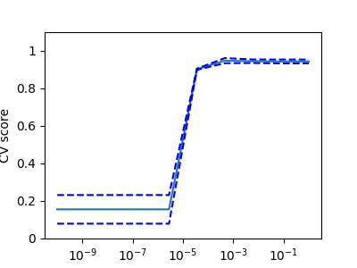

# 模型选择：选择估计量及其参数

校验者:
        [@片刻](https://github.com/apachecn/scikit-learn-doc-zh)
翻译者:
        [@森系](https://github.com/apachecn/scikit-learn-doc-zh)

## 分数和交叉验证分数

如我们所见，每一个估计量都有一个可以在新数据上判定拟合质量(或预期值)的 `score` 方法。**越大越好**.

```py
>>> from sklearn import datasets, svm
>>> digits = datasets.load_digits()
>>> X_digits = digits.data
>>> y_digits = digits.target
>>> svc = svm.SVC(C=1, kernel='linear')
>>> svc.fit(X_digits[:-100], y_digits[:-100]).score(X_digits[-100:], y_digits[-100:])
0.98
```

为了更好地预测精度(我们可以用它作为模型的拟合优度代理)，我们可以连续分解用于我们训练和测试用的 _折叠数据_。

```py
>>> import numpy as np
>>> X_folds = np.array_split(X_digits, 3)
>>> y_folds = np.array_split(y_digits, 3)
>>> scores = list()
>>> for k in range(3):
...     # We use 'list' to copy, in order to 'pop' later on
...     X_train = list(X_folds)
...     X_test = X_train.pop(k)
...     X_train = np.concatenate(X_train)
...     y_train = list(y_folds)
...     y_test = y_train.pop(k)
...     y_train = np.concatenate(y_train)
...     scores.append(svc.fit(X_train, y_train).score(X_test, y_test))
>>> print(scores)  
[0.934..., 0.956..., 0.939...]
```

这被称为 [`KFold`](https://scikit-learn.org/stable/modules/generated/sklearn.model_selection.KFold.html#sklearn.model_selection.KFold "sklearn.model_selection.KFold") 交叉验证.

## 交叉验证生成器

scikit-learn 有可以生成训练/测试索引列表的类，可用于流行的交叉验证策略。

类提供了 `split` 方法，方法允许输入能被分解的数据集，并为每次选择的交叉验证策略迭代生成训练/测试集索引。

下面是使用 `split` 方法的例子。

```py
>>> from sklearn.model_selection import KFold, cross_val_score
>>> X = ["a", "a", "b", "c", "c", "c"]
>>> k_fold = KFold(n_splits=3)
>>> for train_indices, test_indices in k_fold.split(X):
...      print('Train: %s | test: %s' % (train_indices, test_indices))
Train: [2 3 4 5] | test: [0 1]
Train: [0 1 4 5] | test: [2 3]
Train: [0 1 2 3] | test: [4 5]

```

然后就可以很容易地执行交叉验证了:

```py
>>> [svc.fit(X_digits[train], y_digits[train]).score(X_digits[test], y_digits[test])
...  for train, test in k_fold.split(X_digits)]  
[0.963..., 0.922..., 0.963..., 0.963..., 0.930...]

```

交叉验证分数可以使用 [`cross_val_score`](https://scikit-learn.org/stable/modules/generated/sklearn.model_selection.cross_val_score.html#sklearn.model_selection.cross_val_score "sklearn.model_selection.cross_val_score") 直接计算出来。给定一个估计量，交叉验证对象，和输入数据集， [`cross_val_score`](https://scikit-learn.org/stable/modules/generated/sklearn.model_selection.cross_val_score.html#sklearn.model_selection.cross_val_score "sklearn.model_selection.cross_val_score") 函数就会反复分解出训练和测试集的数据，然后使用训练集和为每次迭代交叉验证运算出的基于测试集的分数来训练估计量。

默认情况下，估计器的 `score` 方法被用于运算个体分数。

可以参考 [metrics 模块](45#58-成对的矩阵-类别和核函数) 学习更多可用的评分方法。

```py
>>> cross_val_score(svc, X_digits, y_digits, cv=k_fold, n_jobs=-1)
array([ 0.93489149,  0.95659432,  0.93989983])

```

`n_jobs=-1` 意味着运算会被调度到所有 CPU 上进行。

或者，可以提供 `scoring` 参数来指定替换的评分方法。

```py
>>> cross_val_score(svc, X_digits, y_digits, cv=k_fold,
...                 scoring='precision_macro')
array([0.96578289, 0.92708922, 0.96681476, 0.96362897, 0.93192644])
```

**交叉验证生成器**

|调用|功能|
|---|---|
|[`KFold`](https://scikit-learn.org/stable/modules/generated/sklearn.model_selection.KFold.html#sklearn.model_selection.KFold "sklearn.model_selection.KFold") **(n_splits, shuffle, random_state)**|将其分解为 K 个折叠，在 K-1 上训练，然后排除测试。|
|[`StratifiedKFold`](https://scikit-learn.org/stable/modules/generated/sklearn.model_selection.StratifiedKFold.html#sklearn.model_selection.StratifiedKFold "sklearn.model_selection.StratifiedKFold") **(n_splits, shuffle, random_state)**|和 K-Fold 一样，但会保留每个折叠里的类分布。|
|[`GroupKFold`](https://scikit-learn.org/stable/modules/generated/sklearn.model_selection.GroupKFold.html#sklearn.model_selection.GroupKFold "sklearn.model_selection.GroupKFold") **(n_splits)**|确保相同组不会在测试和训练集里。|
|[`ShuffleSplit`](https://scikit-learn.org/stable/modules/generated/sklearn.model_selection.ShuffleSplit.html#sklearn.model_selection.ShuffleSplit "sklearn.model_selection.ShuffleSplit") **(n_splits, test_size, train_size, random_state)** |生成基于随机排列的训练/测试索引。|
|[`StratifiedShuffleSplit`](https://scikit-learn.org/stable/modules/generated/sklearn.model_selection.StratifiedShuffleSplit.html#sklearn.model_selection.StratifiedShuffleSplit "sklearn.model_selection.StratifiedShuffleSplit")|和 shuffle 分解一样，但会保留每个迭代里的类分布。|
|[`GroupShuffleSplit`](https://scikit-learn.org/stable/modules/generated/sklearn.model_selection.GroupShuffleSplit.html#sklearn.model_selection.GroupShuffleSplit "sklearn.model_selection.GroupShuffleSplit")|确保相同组不会在测试和训练集里。|
|[`LeaveOneGroupOut`](https://scikit-learn.org/stable/modules/generated/sklearn.model_selection.LeaveOneGroupOut.html#sklearn.model_selection.LeaveOneGroupOut "sklearn.model_selection.LeaveOneGroupOut") **()**|使用数组分组来给观察分组。|
|[`LeavePGroupsOut`](https://scikit-learn.org/stable/modules/generated/sklearn.model_selection.LeavePGroupsOut.html#sklearn.model_selection.LeavePGroupsOut "sklearn.model_selection.LeavePGroupsOut") **(n_groups)**| 忽略 P 组。|
|[`LeaveOneOut`](https://scikit-learn.org/stable/modules/generated/sklearn.model_selection.LeaveOneOut.html#sklearn.model_selection.LeaveOneOut "sklearn.model_selection.LeaveOneOut") **()** |忽略一个观察。|
|[`LeavePOut`](https://scikit-learn.org/stable/modules/generated/sklearn.model_selection.LeavePOut.html#sklearn.model_selection.LeavePOut "sklearn.model_selection.LeavePOut") **(p)**|忽略 P 观察。|
|[`PredefinedSplit`](https://scikit-learn.org/stable/modules/generated/sklearn.model_selection.PredefinedSplit.html#sklearn.model_selection.PredefinedSplit "sklearn.model_selection.PredefinedSplit")|生成基于预定义分解的训练/测试索引。|

>**练习**
>
>[](https://scikit-learn.org/stable/auto_examples/exercises/plot_cv_digits.html)
>
>在数字数据集中，用一个线性内核绘制一个 [`SVC`](https://scikit-learn.org/stable/modules/generated/sklearn.svm.SVC.html#sklearn.svm.SVC "sklearn.svm.SVC") 估计器的交叉验证分数来作为 `C` 参数函数(使用从1到10的点对数网格).
>
>```py
import numpy as np
from sklearn.model_selection import cross_val_score
from sklearn import datasets, svm
digits = datasets.load_digits()
X = digits.data
y = digits.target
svc = svm.SVC(kernel='linear')
C_s = np.logspace(-10, 0, 10)
```
>
>**方法：** [Cross-validation on Digits Dataset Exercise](https://scikit-learn.org/stable/auto_examples/exercises/plot_cv_digits.html#sphx-glr-auto-examples-exercises-plot-cv-digits-py)

## 网格搜索和交叉验证估计量

### 网格搜索

scikit-learn 提供了一个对象，在给定数据情况下，在一个参数网格，估计器拟合期间计算分数，并选择参数来最大化交叉验证分数。这个对象在构建过程中获取估计器并提供一个估计器 API。

```py
>>> from sklearn.model_selection import GridSearchCV, cross_val_score
>>> Cs = np.logspace(-6, -1, 10)
>>> clf = GridSearchCV(estimator=svc, param_grid=dict(C=Cs),
...                    n_jobs=-1)
>>> clf.fit(X_digits[:1000], y_digits[:1000])        
GridSearchCV(cv=None,...
>>> clf.best_score_                                  
0.925...
>>> clf.best_estimator_.C                            
0.0077...

>>> # Prediction performance on test set is not as good as on train set
>>> clf.score(X_digits[1000:], y_digits[1000:])      
0.943...

```

默认情况下， [`GridSearchCV`](https://scikit-learn.org/stable/modules/generated/sklearn.model_selection.GridSearchCV.html#sklearn.model_selection.GridSearchCV "sklearn.model_selection.GridSearchCV") 使用一个三倍折叠交叉验证。但是，如果它检测到分类器被传递，而不是回归，它就会使用分层的三倍。

>**嵌套交叉验证**
>```py
>>> cross_val_score(clf, X_digits, y_digits)
...                                               
array([ 0.938...,  0.963...,  0.944...])
```
>
>两个交叉验证循环并行执行：一个由 [`GridSearchCV`](https://scikit-learn.org/stable/modules/generated/sklearn.model_selection.GridSearchCV.html#sklearn.model_selection.GridSearchCV "sklearn.model_selection.GridSearchCV") 估计器设置 `gamma`，另一个 `cross_val_score` 则是测量估计器的预期执行情况。结果分数是对新数据上的预期分数的无偏估计。

>**警告**
>你不可以并行运算嵌套对象(`n_jobs` 不为1)。

### 交叉验证估计量

设置参数的交叉验证可以更有效地完成一个基础算法。这就是为什么对某些估计量来说，scikit-learn 提供了 交叉验证 估计量自动设置它们的参数。

```py
>>> from sklearn import linear_model, datasets
>>> lasso = linear_model.LassoCV()
>>> diabetes = datasets.load_diabetes()
>>> X_diabetes = diabetes.data
>>> y_diabetes = diabetes.target
>>> lasso.fit(X_diabetes, y_diabetes)
LassoCV(alphas=None, copy_X=True, cv=None, eps=0.001, fit_intercept=True,
 max_iter=1000, n_alphas=100, n_jobs=1, normalize=False, positive=False,
 precompute='auto', random_state=None, selection='cyclic', tol=0.0001,
 verbose=False)
>>> # 估计器自动选择它的 lambda:
>>> lasso.alpha_ 
0.01229...

```

这些估计量和它们的副本称呼类似，在名字后加 ‘CV’。

>**练习**
>
>在糖尿病数据集中，找到最优正则化参数 α。
>
>**另外：** 你有多相信 α 的选择？
>```py
from sklearn import datasets
from sklearn.linear_model import LassoCV
from sklearn.linear_model import Lasso
from sklearn.model_selection import KFold
from sklearn.model_selection import GridSearchCV
diabetes = datasets.load_diabetes()
```
>
>**方法：** [Cross-validation on diabetes Dataset Exercise](https://scikit-learn.org/stable/auto_examples/exercises/plot_cv_diabetes.html#sphx-glr-auto-examples-exercises-plot-cv-diabetes-py)
