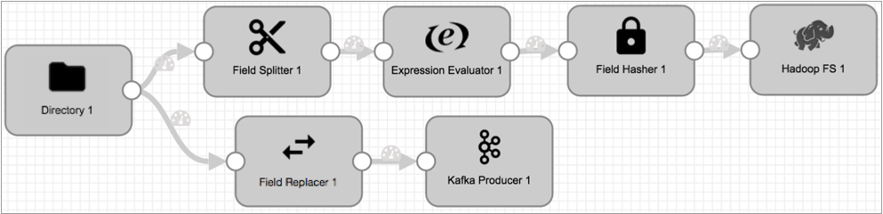
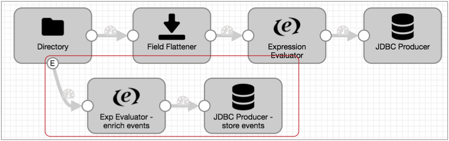
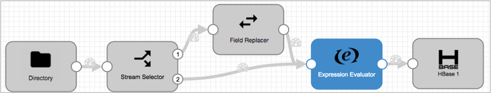

# 设计数据流

您可以在管道中分支和合并流。

## 分支流

将一个阶段连接到多个阶段时，所有数据都会传递到所有连接的阶段。您可以为阶段配置必填字段，以在记录进入阶段之前将其丢弃，但是默认情况下，所有记录都会通过。

例如，在以下管道中，来自“目录”源的所有数据都传递到管道的两个分支以进行不同类型的处理。但是您可以选择配置字段拆分器或字段替换器的必填字段，以丢弃不需要的任何记录。

要基于更复杂的条件路由数据，请使用流选择器。

某些阶段会生成传递到事件流的事件。事件流源自事件生成阶段，例如起点或目的地，并从该阶段通过事件流输出传递，如下所示：

有关事件框架和事件流的更多信息，请参见[数据流触发器概述](https://streamsets.com/documentation/controlhub/latest/help/datacollector/UserGuide/Event_Handling/EventFramework-Title.html#concept_cph_5h4_lx)。

## 合并流

您可以通过将两个或多个阶段连接到同一下游阶段来合并管道中的数据流。合并数据流时，Data Collector会将所有流中的数据引导到同一阶段，但不执行流中记录的联接。

例如，在以下管道中，流选择器阶段将具有空值的数据发送到字段替换器阶段：

来自流选择器默认流的数据和来自字段替换器的所有数据将传递到表达式评估器以进行进一步处理，但顺序不特定且没有记录合并。

**重要：**管道验证不会阻止重复数据。为避免将重复数据写入目标，请配置管道逻辑以删除重复数据或防止生成重复数据。

请注意，您无法将事件流与数据流合并。事件记录必须从事件生成阶段流到目的地或执行者，而不能与数据流合并。有关事件框架和事件流的更多信息，请参见[数据流触发器概述](https://streamsets.com/documentation/controlhub/latest/help/datacollector/UserGuide/Event_Handling/EventFramework-Title.html#concept_cph_5h4_lx)。