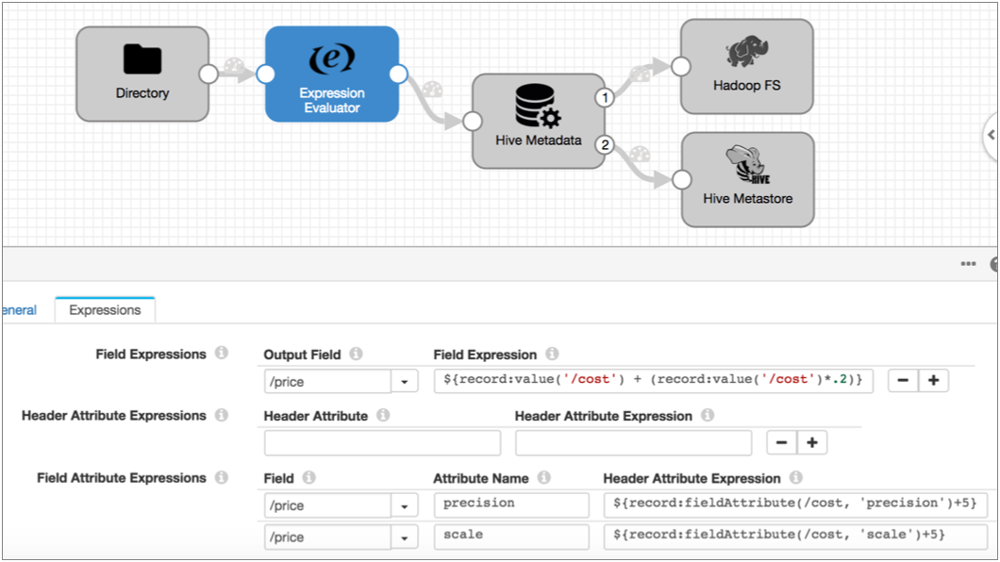

# 字段属性

字段属性是根据需要提供有关可在管道逻辑中使用的每个字段的附加信息的属性。

某些阶段会生成字段属性。例如，Salesforce原点在`salesforce.salesforceType`每个字段的属性中都包含原始Salesforce数据类型。

您可以在管道中创建，修改和评估字段属性。表达式计算器可以创建和修改字段级属性。您可以使用字段属性函数来评估字段属性。

例如，您可以使用表达式评估器基于记录数据创建字段属性，然后将记录传递到基于属性值路由数据的流选择器。

仅当在目标中使用SDC RPC数据格式时，字段属性才会自动包含在写入目标系统的记录中。

要将字段属性包括在记录数据中或在计算中使用字段属性，请使用`record:fieldAttribute` 和`record:fieldAttributeOrDefault`函数。有关字段属性函数的更多信息，请参见[记录函数](https://streamsets.com/documentation/controlhub/latest/help/datacollector/UserGuide/Expression_Language/Functions.html#concept_p1z_ggv_1r)。

使用数据预览时，可以启用查看字段属性和记录标题属性以帮助管道开发。

## 使用字段属性

像记录标题属性一样，您可以使用Expression Evaluator或任何脚本处理器来创建或更新字段属性。例如，在处理Avro数据时，原点会将小数数据的精度和小数位数信息放入字段属性中。如果要在将这些值写入目标系统之前增加这些值，则可以使用Expression Evaluator或任何脚本处理器来设置属性值。

字段属性是字符串值。您还可以`record:fieldAttribute`在任何表达式中使用 函数以在计算中包括属性值。

**要点：**字段属性没有字段路径。在表达式中使用属性时，在指定关联字段的路径后，仅使用带引号的属性名称即可，如下所示：

```
 ${record:fieldAttribute(<path to the field>,'<attribute name>')}
```

例如，假设您正在作为[Avive漂移同步解决方案的](https://streamsets.com/documentation/controlhub/latest/help/datacollector/UserGuide/Hive_Drift_Solution/HiveDriftSolution_title.html#concept_phk_bdf_2w)一部分来处理Avro数据。所有小数字段都包含自动生成的精度和小数位字段属性。在将数据传递到Hive元数据处理器之前，您要基于现有成本数据创建一个新的价格小数字段。

以下表达式评估器创建“价格”字段，并根据现有“成本”精度和小数位数定义精度和小数位数字段属性。



## 字段属性生成阶段

下表列出了生成字段属性以启用特殊处理的阶段：

| 阶段                  | 描述                                                         |
| :-------------------- | :----------------------------------------------------------- |
| 处理Avro数据的来源    | 为每个十进制字段包括“精度”和“比例”字段属性。                 |
| 处理XML数据的来源     | 可以在字段属性中包含字段[XPath信息](https://streamsets.com/documentation/controlhub/latest/help/datacollector/UserGuide/Data_Formats/XMLDFormat.html#concept_w3k_1ch_qz)，XML属性和名称空间声明。 |
| Google BigQuery的来源 | 在[field属性中](https://streamsets.com/documentation/controlhub/latest/help/datacollector/UserGuide/Origins/BigQuery.html#concept_sjp_jy1_l3b)包括Datetime，Time和Timestamp字段的原始精度。 |
| Salesforce来源        | 在[字段属性中](https://streamsets.com/documentation/controlhub/latest/help/datacollector/UserGuide/Origins/Salesforce.html#concept_ysd_532_kz)包括数据类型信息。 |
| Salesforce查找处理器  | 在[字段属性中](https://streamsets.com/documentation/controlhub/latest/help/datacollector/UserGuide/Processors/SalesforceLookup.html#concept_nl4_3q2_kz)包括数据类型信息。 |
| XML解析器             | 可以在字段属性中包含字段XPath信息，XML属性和名称空间声明。   |

## 在数据预览中查看字段属性

与记录标题属性一样，您可以使用数据预览在管道中的任何位置查看字段属性。要查看字段属性，请启用“显示记录/字段标题数据”预览属性。