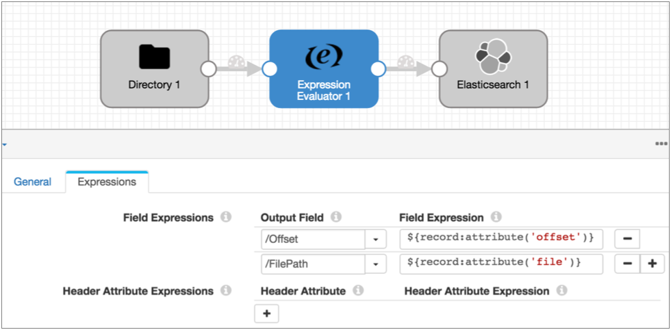

# 记录标题属性

记录标题属性是记录标题中的属性，您可以根据需要在管道逻辑中使用它们。

某些阶段会为特定目的创建记录标题属性。例如，[启用CDC的源](https://streamsets.com/documentation/controlhub/latest/help/datacollector/UserGuide/Pipeline_Design/CDC-Overview.html#concept_iws_mhd_ty)在sdc.operation.type记录头属性中包括CRUD操作类型。这使启用CRUD的目标能够确定在处理记录时要使用的操作类型。类似地，Hive元数据处理器生成记录头属性，某些目的地可以将其用作[Hive漂移同步解决方案的](https://streamsets.com/documentation/controlhub/latest/help/datacollector/UserGuide/Hive_Drift_Solution/HiveDriftSolution_title.html#concept_phk_bdf_2w)一部分。

其他阶段包括在记录标题属性中与处理有关的信息以供一般使用。例如，如果您要基于该信息处理事件，则[事件生成阶段](https://streamsets.com/documentation/controlhub/latest/help/datacollector/UserGuide/Event_Handling/EventFramework-Title.html#concept_zrl_mhn_lx)会将事件类型包括在记录标题属性中。几个来源包括诸如每个记录的来源文件名，位置或分区之类的信息。

您可以使用某些处理器来创建或更新记录头属性。例如，您可以使用表达式计算器来创建[基于记录的写入的](https://streamsets.com/documentation/controlhub/latest/help/datacollector/UserGuide/Pipeline_Design/RecordHeaderAttributes.html#concept_lmn_gdc_1w)属性。

在记录标题中包含属性不需要在管道中使用它们。例如，您可以在非CDC管道中使用启用CDC的Salesforce原点，而忽略自动生成的CDC记录头属性。

在将数据写入目标系统时，仅当使用Google Pub / Sub Publisher目标或将另一个目标使用SDC Record数据格式时，记录标题属性才会与记录一起保留。若要在使用其他数据格式时保留信息，请使用表达式计算器将信息从记录标题属性复制到记录字段。

## 使用标题属性

您可以使用表达式评估器或任何脚本处理器来创建或更新记录头属性。例如，MongoDB目标要求在记录头属性中指定CRUD操作。如果提供数据的原产地不会自动生成该信息，则可以使用表达式计算器或脚本处理器来设置属性值。

记录标题属性是字符串值。您可以在任何表达式中使用[record：attribute函数](https://streamsets.com/documentation/controlhub/latest/help/datacollector/UserGuide/Expression_Language/Functions.html#concept_p1z_ggv_1r)，以在计算中包括属性值。

**要点：**记录标题属性没有字段路径。在表达式中使用属性时，请仅使用属性名称，并用引号将其括起来，因为属性是字符串，如下所示：

```
 ${record:attribute('<attribute name>')}
```

例如，下面的表达式评估器将目录原点创建的文件和偏移记录头属性添加到记录中：



### 内部属性

随着记录在各个阶段之间移动，Data Collector会生成并更新一些只读内部记录头属性。可以查看这些属性以解决调试问题，但只能由Data Collector进行更新。

record：attribute函数不允许访问内部记录头属性。下表描述了内部记录头属性和可用于访问管道中数据的功能：

| 内部记录标题属性   | 描述                                                         | 相关功能                  |
| :----------------- | :----------------------------------------------------------- | :------------------------ |
| stageCreator       | 创建记录的阶段的ID。                                         | 记录：creator（）         |
| sourceId           | 记录的来源。可以根据来源类型包含不同的信息。                 | 记录：id（）              |
| stagePath          | 按阶段名称按顺序处理记录的阶段列表。                         | 记录：路径（）            |
| 跟踪号码           | 记录已通过管道的路线，从sourceId开始，然后列出处理记录的阶段。 | 不适用                    |
| previousTrackingId | 记录进入当前阶段之前的记录的跟踪ID。                         | 不适用                    |
| 错误阶段           | 产生错误的阶段。仅在错误记录中。                             | 记录：errorStage（）      |
| errorStageLabel    | 阶段的用户定义名称。仅在错误记录中。                         | 记录：errorStageLabel（） |
| 错误代码           | 错误代码。仅在错误记录中。                                   | 记录：errorCode（）       |
| errorJobId         | 启动管道的作业的ID。仅在由Control Hub作业启动的管道的错误记录中。 | 不适用                    |
| 错误信息           | 错误消息。仅在错误记录中。                                   | 记录：errorMessage（）    |
| errorTimestamp     | 错误发生的时间。仅在错误记录中。                             | 记录：errorTime（）       |
| errorStackTrace    | 与错误关联的堆栈跟踪。仅在错误记录中。                       | 不适用                    |

## 标头属性生成阶段

下表列出了生成记录标题属性以启用特殊处理的阶段：

| 阶段                                                         | 描述                                                         |
| :----------------------------------------------------------- | :----------------------------------------------------------- |
| 启用CDC的来源                                                | 在sdc.operation.type标头属性中包含CRUD操作类型，并且在记录标头属性中可以包含其他CRUD和CDC信息。有关更多信息，请参见[启用CDC的起源](https://streamsets.com/documentation/controlhub/latest/help/datacollector/UserGuide/Pipeline_Design/CDC-Overview.html#concept_iws_mhd_ty)。 |
| 处理Avro数据和Data Parser处理器的来源                        | 在avroSchema记录标题属性中包括Avro模式。                     |
| 处理XML数据的来源                                            | [启用字段XPaths](https://streamsets.com/documentation/controlhub/latest/help/datacollector/UserGuide/Data_Formats/XMLDFormat.html#concept_w3k_1ch_qz)时，[可以](https://streamsets.com/documentation/controlhub/latest/help/datacollector/UserGuide/Data_Formats/XMLDFormat.html#concept_w3k_1ch_qz)在xmlns记录头属性中包含名称空间。 |
| [产生事件的阶段](https://streamsets.com/documentation/controlhub/latest/help/datacollector/UserGuide/Event_Handling/EventFramework-Title.html#concept_zrl_mhn_lx) | 生成事件记录的记录标题属性。有关事件记录头属性的详细信息，请参见阶段文档中的“事件记录”。 |
| Amazon S3的起源                                              | 可以配置为[在记录标题属性中](https://streamsets.com/documentation/controlhub/latest/help/datacollector/UserGuide/Origins/AmazonS3.html#concept_inh_qjx_yw)包括系统定义的和用户定义的 [对象元数据](https://streamsets.com/documentation/controlhub/latest/help/datacollector/UserGuide/Origins/AmazonS3.html#concept_inh_qjx_yw)。 |
| Amazon SQS消费者来源                                         | 可以配置为在记录头属性中包括[SQS消息](https://streamsets.com/documentation/controlhub/latest/help/datacollector/UserGuide/Origins/AmazonSQS.html#concept_lk3_rfc_vbb)属性。 |
| [Azure Data Lake Storage Gen1来源](https://streamsets.com/documentation/controlhub/latest/help/datacollector/UserGuide/Origins/ADLS-G1.html#concept_dnh_pwp_b3b) | 在记录头属性中包含有关记录的原始文件的信息。                 |
| [Azure Data Lake Storage Gen2的来源](https://streamsets.com/documentation/controlhub/latest/help/datacollector/UserGuide/Origins/ADLS-G2.html#concept_osx_qgz_xhb) | 在记录头属性中包含有关记录的原始文件的信息。                 |
| 目录来源                                                     | 在[记录头属性中](https://streamsets.com/documentation/controlhub/latest/help/datacollector/UserGuide/Origins/Directory.html#concept_tlj_3g1_2z)包含有关记录的原始文件的信息。 |
| 文件尾源                                                     | 在 [记录头属性中](https://streamsets.com/documentation/controlhub/latest/help/datacollector/UserGuide/Origins/FileTail.html#concept_tlj_3g1_2z)包含有关记录的原始文件的信息。可以配置为对文件集使用 [标签属性](https://streamsets.com/documentation/controlhub/latest/help/datacollector/UserGuide/Origins/FileTail.html#concept_crd_tlx_fs)。 |
| Google发布/订阅者来源                                        | 可用时，在[记录头属性中](https://streamsets.com/documentation/controlhub/latest/help/datacollector/UserGuide/Origins/PubSub.html#concept_qvl_y4q_v1b)包括用户定义的消息[属性](https://streamsets.com/documentation/controlhub/latest/help/datacollector/UserGuide/Origins/PubSub.html#concept_qvl_y4q_v1b) |
| Groovy脚本起源                                               | 可以配置为创建[记录标题属性](https://streamsets.com/documentation/controlhub/latest/help/datacollector/UserGuide/Origins/GroovyScripting.html#concept_dyg_zpr_l3b)。 |
| Hadoop FS起源                                                | 在[记录头属性中](https://streamsets.com/documentation/controlhub/latest/help/datacollector/UserGuide/Origins/HadoopFS-origin.html#concept_efs_2fs_fdb)包含有关文件和偏移量的信息。 |
| [Hadoop FS独立版本](https://streamsets.com/documentation/controlhub/latest/help/datacollector/UserGuide/Origins/HDFSStandalone.html#concept_djz_pdm_hdb) | 在记录头属性中包含有关记录的原始文件的信息。                 |
| HTTP客户端来源                                               | 在[记录头属性中](https://streamsets.com/documentation/controlhub/latest/help/datacollector/UserGuide/Origins/HTTPClient.html#concept_etl_bsh_l2b)包括响应头字段。 |
| HTTP服务器来源                                               | 在[记录标题属性中](https://streamsets.com/documentation/controlhub/latest/help/datacollector/UserGuide/Origins/HTTPServer.html#concept_rvj_5qy_4cb)包括有关请求的URL和请求标题字段的信息。 |
| JavaScript脚本起源                                           | 可以配置为创建[记录标题属性](https://streamsets.com/documentation/controlhub/latest/help/datacollector/UserGuide/Origins/JavaScriptScripting.html#concept_ty1_t13_p3b)。 |
| JDBC多表使用者来源                                           | 在[JDBC记录头属性中](https://streamsets.com/documentation/controlhub/latest/help/datacollector/UserGuide/Origins/MultiTableJDBCConsumer.html#concept_xrx_11y_4y)包括表和数据类型信息。 |
| JDBC查询使用者来源                                           | 可以配置为在[JDBC记录头属性中](https://streamsets.com/documentation/controlhub/latest/help/datacollector/UserGuide/Origins/JDBCConsumer.html#concept_egw_d4c_kw)包括表和数据类型信息 。 |
| Jython脚本起源                                               | 可以配置为创建[记录标题属性](https://streamsets.com/documentation/controlhub/latest/help/datacollector/UserGuide/Origins/JythonScripting.html#concept_ydl_j13_p3b)。 |
| 卡夫卡消费者血统                                             | 在[记录标题属性中](https://streamsets.com/documentation/controlhub/latest/help/datacollector/UserGuide/Origins/KConsumer.html#concept_tlj_3g1_2z)包含有关记录来源的信息。 |
| Kafka Multitopic消费者来源                                   | 在[记录标题属性中](https://streamsets.com/documentation/controlhub/latest/help/datacollector/UserGuide/Origins/KafkaMultiConsumer.html#concept_tlj_3g1_2z)包含有关记录来源的信息。 |
| MapR FS来源                                                  | 在[记录头属性中](https://streamsets.com/documentation/controlhub/latest/help/datacollector/UserGuide/Origins/MapRFS.html#concept_efs_2fs_fdb)包含有关文件和偏移量的信息。 |
| MapR FS独立来源                                              | 在[记录头属性中](https://streamsets.com/documentation/controlhub/latest/help/datacollector/UserGuide/Origins/MapRFSStandalone.html#concept_uyy_nsn_ndb)包含有关记录的原始文件的信息。 |
| MapR Multitopic Streams消费者来源                            | 在[记录标题属性中](https://streamsets.com/documentation/controlhub/latest/help/datacollector/UserGuide/Origins/MapRStreamsMultiConsumer.html#concept_tlj_3g1_2z)包含有关记录来源的信息。 |
| MapR流消费者来源                                             | 在[记录标题属性中](https://streamsets.com/documentation/controlhub/latest/help/datacollector/UserGuide/Origins/MapRStreamsCons.html#concept_tlj_3g1_2z)包含有关记录来源的信息。 |
| MQTT订户来源                                                 | 在[记录标题属性中](https://streamsets.com/documentation/controlhub/latest/help/datacollector/UserGuide/Origins/MQTTSubscriber.html#concept_fwm_2kn_scb)包含有关记录来源的信息。 |
| 脉冲星消费者来源                                             | 在[记录头属性](https://streamsets.com/documentation/controlhub/latest/help/datacollector/UserGuide/Origins/PulsarConsumer.html#concept_tvr_r3m_y2b)的消息属性字段中包含信息 。 |
| RabbitMQ消费者来源                                           | 在[记录标题属性中](https://streamsets.com/documentation/controlhub/latest/help/datacollector/UserGuide/Origins/RabbitMQ.html#concept_rg5_yts_y1b)包含RabbitMQ [属性](https://streamsets.com/documentation/controlhub/latest/help/datacollector/UserGuide/Origins/RabbitMQ.html#concept_rg5_yts_y1b)。 |
| REST服务来源                                                 | 在[记录头属性中](https://streamsets.com/documentation/controlhub/latest/help/datacollector/UserGuide/Origins/RESTService.html#concept_rrj_5qy_4cb)包括有关URL和请求头字段的信息 。 |
| Salesforce来源                                               | 在[Salesforce标头属性中](https://streamsets.com/documentation/controlhub/latest/help/datacollector/UserGuide/Origins/Salesforce.html#concept_psx_1wg_cy)包括有关记录来源的Salesforce信息。 |
| SFTP / FTP / FTPS客户端来源                                  | 在[记录头属性中](https://streamsets.com/documentation/controlhub/latest/help/datacollector/UserGuide/Origins/SFTP.html#concept_tlj_3g1_2z)包含有关记录的原始文件的信息。 |
| SQL Server 2019 BDC多表使用者来源                            | 在[JDBC记录头属性中](https://streamsets.com/documentation/controlhub/latest/help/datacollector/UserGuide/Origins/SQLServerBDCMultitable.html#SQLServerBDCMultitable-HeaderAtts)包括表和数据类型信息。 |
| Teradata消费者来源                                           | 在[JDBC记录头属性中](https://streamsets.com/documentation/controlhub/latest/help/datacollector/UserGuide/Origins/Teradata.html#concept_xrx_11y_4y)包括表和数据类型信息。 |
| Couchbase查找处理器                                          | 在[记录标题属性中](https://streamsets.com/documentation/controlhub/latest/help/datacollector/UserGuide/Processors/CouchbaseLookup.html#concept_am3_jjj_j3b)包含有关查找文档状态的信息。 |
| 表达评估器处理器                                             | 可以配置为创建或更新[记录标题属性](https://streamsets.com/documentation/controlhub/latest/help/datacollector/UserGuide/Processors/Expression.html#concept_qf3_mfq_f5)。 |
| Groovy评估器处理器                                           | 可以配置为创建或更新[记录标题属性](https://streamsets.com/documentation/controlhub/latest/help/datacollector/UserGuide/Processors/Groovy.html#concept_uw4_kqw_1y)。 |
| Hive元数据处理器                                             | 为数据记录生成[记录头属性](https://streamsets.com/documentation/controlhub/latest/help/datacollector/UserGuide/Processors/HiveMetadata.html#concept_g3p_sss_dw)。这些属性可作为基于[Hive](https://streamsets.com/documentation/controlhub/latest/help/datacollector/UserGuide/Hive_Drift_Solution/HiveDriftSolution_title.html#concept_phk_bdf_2w)的[Drift Synchronization Solution的](https://streamsets.com/documentation/controlhub/latest/help/datacollector/UserGuide/Hive_Drift_Solution/HiveDriftSolution_title.html#concept_phk_bdf_2w)一部分用于基于记录的写入。可以配置为将[自定义标头属性](https://streamsets.com/documentation/controlhub/latest/help/datacollector/UserGuide/Processors/HiveMetadata.html#concept_jv2_jjn_l1b)添加到元数据记录。 |
| HTTP客户端处理器                                             | 在[记录头属性中](https://streamsets.com/documentation/controlhub/latest/help/datacollector/UserGuide/Processors/HTTPClient.html#concept_ekz_wrz_zw)包括响应头字段。 |
| JavaScript评估程序处理器                                     | 可以配置为创建或更新[记录标题属性](https://streamsets.com/documentation/controlhub/latest/help/datacollector/UserGuide/Processors/JavaScript.html#concept_sh1_khh_cy)。 |
| Jython评估程序处理器                                         | 可以配置为创建或更新[记录标题属性](https://streamsets.com/documentation/controlhub/latest/help/datacollector/UserGuide/Processors/Jython.html#concept_s2k_qhh_cy)。 |
| 模式生成器处理器                                             | [生成模式](https://streamsets.com/documentation/controlhub/latest/help/datacollector/UserGuide/Processors/SchemaGenerator.html#concept_rfz_ks3_x1b)并将其写入用户定义的记录头属性。 |

## 基于记录的写入的记录头属性

目标可以使用记录头属性中的信息来写入数据。写入Avro数据的目标可以在记录头中使用Avro模式。Hadoop FS和MapR FS目标可以使用记录头属性来确定要写入的目录以及何时滚动文件，这是针对Hive的Drift同步解决方案的一部分。有关更多信息，请参见[Hive的漂移同步解决方案](https://streamsets.com/documentation/controlhub/latest/help/datacollector/UserGuide/Hive_Drift_Solution/HiveDriftSolution_title.html#concept_phk_bdf_2w)。

要使用记录标题属性，请将目标配置为使用标题属性，并确保记录包含标题属性。

Hive元数据处理器自动为Hadoop FS和MapR FS生成记录头属性，以用作Hive漂移同步解决方案的一部分。对于所有其他目标，可以使用表达式评估器或脚本处理器来添加记录头属性。

您可以在目标中使用以下记录头属性：

- 所有Azure Data Lake Storage目标以及Hadoop FS，Local FS和MapR FS目标中的targetDirectory属性

  targetDirectory记录标题属性定义记录写入的目录。如果目录不存在，则目的地将创建目录。targetDirectory标头属性替换目标中的“目录模板”属性。

  使用targetDirectory提供目录时，为目标配置的时间基准仅用于确定记录是否延迟。时间基准不用于确定要创建的输出目录或将记录写入目录。

  要使用targetDirectory标头属性，请在**输出**选项卡上的标头中 选择**目录**。

- 写入Avro数据的目标中的avroSchema属性

  avroSchema标头属性定义了记录的Avro模式。使用此标头属性时，无法定义要在目标中使用的Avro模式。

  要使用avroSchema标头属性，请在“ **数据格式”**选项卡上，选择**Avro**数据格式，然后为“ **Avro模式位置”** 属性选择“ **在记录头中”**。

- 所有Azure Data Lake Storage目标以及Hadoop FS，Local FS和MapR FS目标中的roll属性

  当记录标题中存在roll属性时，将触发文件的滚动。

  您可以定义卷标头属性的名称。当您使用Hive Metadata处理器生成滚动标题属性时，请使用默认的“滚动”属性名称。使用表达式计算器时，请使用在处理器中定义的roll属性的名称。

  要使用卷标头属性，请在“ **输出”**选项卡上，选择“ **使用**卷标**属性”**并定义该**属性**的名称。

### 生成基于记录的写入的属性

您可以使用Hive元数据处理器，表达式评估器或脚本处理器为基于记录的写入生成记录头属性。Hive元数据处理器自动为Hadoop FS和MapR FS生成记录头属性，以用作Hive漂移同步解决方案的一部分。对于所有其他目标，可以使用表达式评估器或脚本处理器来添加记录头属性。

要使用Expression Evaluator或脚本处理器，您必须生成目标期望的记录头属性。使用以下准则来生成记录标题属性：

- 生成目标目录

  使用表达式评估器或脚本处理器生成目标目录时，请注意以下详细信息：

  目标期望该目录位于名为“ targetDirectory”的标头属性中。目标使用的目录与targetDirectory标头属性中所写的完全相同。与目录模板不同，targetDirectory属性中指定的目录不应包含任何需要评估的组件，例如运行时参数，变量或运行时属性。当您定义计算结果为目录的表达式时，可以使用任何有效组件，包括计算记录中数据的表达式。

  例如，您要基于运行管道的数据收集器以及发生事务的区域和商店ID 将记录写入不同的目录。您可以设置一个名为DIR的运行时资源，该资源定义目录的基础，并为每个运行管道的Data Collector定义DIR 。然后，可以在Expression Evaluator中使用以下表达式来定义targetDirectory属性：`$ {runtime：conf（'DIR'）/ transactions / $ {record.value（'/ region'）} / $ {record.value（'/ storeID'）}`

- 生成Avro模式

  使用表达式计算器或脚本处理器生成Avro模式时，请注意以下详细信息：目标期望在名为“ avroSchema”的标头属性中使用Avro模式。使用标准的Avro模式格式，例如：`{"type":"record","name":"table_name","namespace":"database_name", "fields":[{"name":"int_val","type":["null","int"],"default":null}, {"name":"str_val","type":["null","string"],"default":null}]}`数据库名称和表名称必须包含在Avro模式中。

  **提示：**您可以使用Avro模式生成器来帮助生成Avro模式。

- 产生侧倾属性

  使用表达式评估器或脚本处理器生成roll属性时，请注意以下详细信息：对属性使用任何名称，然后在目标位置指定属性名称。配置一个定义何时滚动文件的表达式。

要在表达式评估器中定义这些记录头属性，请执行以下步骤：

1. 在“ 

   表达式

   求值器” 的“ **表达式”**选项卡上，指定“ 

   标题属性”

   名称。

   要生成目标目录，请使用`targetDirectory`。

   要生成Avro模式，请使用`avroSchema`。

   您可以为滚动指示器标题属性使用任何名称。

2. 对于“ **标题属性表达式”**，定义一个表达式，该表达式的计算结果为您希望目标使用的信息。

有关使用脚本处理器生成记录头属性的信息，请参阅脚本处理器文档。

## 在数据预览中查看属性

您可以使用数据预览来查看与管道中任何给定点上的记录关联的记录头属性。若要查看记录标题属性，请启用“显示记录/字段标题数据”预览属性。

例如，下图显示了由目录起源在数据预览中生成的记录。


“记录标题”列表在管道的这一点上显示记录中的只读内部属性集。 “值”下的标题属性是由目录来源创建的属性。