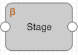

# 技术预览功能

Data Collector 包含某些带有Technology Preview名称的新功能和阶段。Technology Preview功能可用于开发和测试，但不适用于生产。

当技术预览功能被批准用于生产时，发行说明和文档会反映出更改，并且技术预览图标已从UI中删除。

技术预览阶段在预览阶段的左上角显示“技术预览”图标，如下所示：

当前，Data Collector 包括以下技术预览阶段：

- [Cron Scheduler原点](https://streamsets.com/documentation/controlhub/latest/help/datacollector/UserGuide/Origins/CronScheduler.html#concept_nsz_mnr_2jb) -生成具有cron表达式计划的当前日期时间的记录。
- [gRPC客户端来源](https://streamsets.com/documentation/controlhub/latest/help/datacollector/UserGuide/Origins/gRPCClient.html#concept_yp1_4zs_yfb) -通过调用gRPC服务器方法然后读取服务器返回的响应来处理gRPC服务器中的数据。源可以调用一元RPC或服务器流式RPC方法。仅在为边缘执行模式配置的管道中使用此源。
- [启动管道起点](https://streamsets.com/documentation/controlhub/latest/help/datacollector/UserGuide/Origins/StartPipeline.html#concept_h1l_xpr_2jb) -启动Data Collector，Data Collector Edge或Transformer管道。
- [Control Hub API处理器](https://streamsets.com/documentation/controlhub/latest/help/datacollector/UserGuide/Processors/ControlHubAPI.html#concept_akz_zsr_2jb) -调用Control Hub API。
- [启动作业处理器](https://streamsets.com/documentation/controlhub/latest/help/datacollector/UserGuide/Processors/StartJob.html#concept_irv_l5r_2jb) -启动Control Hub作业。
- [启动管道处理器](https://streamsets.com/documentation/controlhub/latest/help/datacollector/UserGuide/Processors/StartPipeline.html#concept_bbc_cxr_2jb) -启动Data Collector，Data Collector Edge或Transformer管道