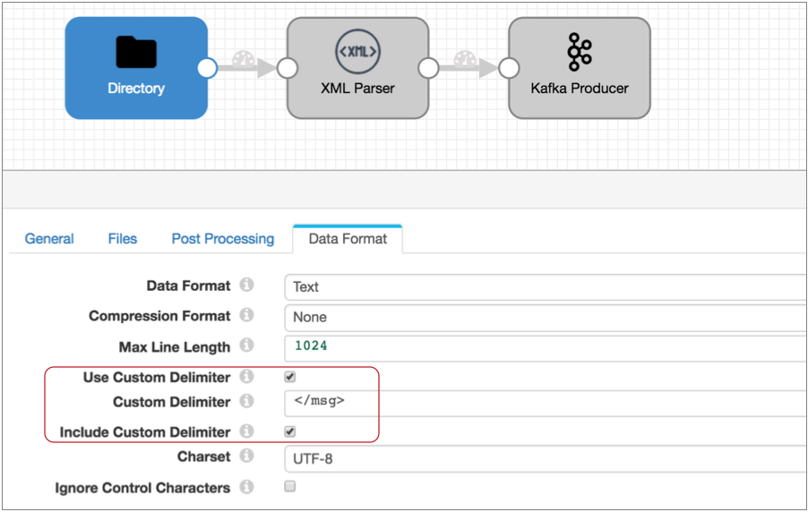

# 具有自定义分隔符的文本数据格式

默认情况下，文本数据格式基于换行符创建记录，为每行文本创建一条记录。您可以配置源以基于自定义定界符创建记录。

当原始系统使用定界符分隔要用作记录的数据的逻辑部分时，请使用自定义定界符。自定义定界符可能像分号一样简单，也可能是一组字符。您甚至可以将XML标记用作自定义定界符来读取XML数据。

**注意：**使用自定义定界符时，原点将使用定界符来创建记录，而忽略换行符。

对于大多数来源，您可以在记录中包括自定义分隔符，也可以删除它们。对于Hadoop FS和MapR FS起源，您不能在记录中包括自定义定界符。

例如，假设您配置目录原点以使用以下文本处理文件，并使用分号作为分隔符，并丢弃该分隔符：

```
8/12/2016 6:01:00 unspecified error message;8/12/2016 
6:01:04 another error message;8/12/2016 6:01:09 just a warning message;
```

原点生成以下记录，并且数据在单个文本字段中：

| 文本                               |
| :--------------------------------- |
| 8/12/2016 6:01:00未指定的错误消息  |
| 2016年8月12日6:01:04另一个错误消息 |
| 8/12/2016 6:01:09只是警告消息      |

请注意，原点保留换行符，但不使用它来创建单独的记录。

## 使用自定义分隔符处理XML数据

您可以将自定义定界符与文本数据格式一起使用来处理XML数据。您可能使用文本数据格式来处理没有根元素的XML数据，而该根元素无法使用XML数据格式进行处理。

在原始位置使用文本数据格式读取XML数据时，可以使用下游的XML Parser处理器来解析XML数据。

例如，以下XML文档是有效的，最好使用XML数据格式进行处理：

```
<?xml version="1.0" encoding="UTF-8"?>
<root>
 <msg>
    <time>8/12/2016 6:01:00</time>
    <request>GET /index.html 200</request>
 </msg>
 <msg>
    <time>8/12/2016 6:03:43</time>
    <request>GET /images/sponsored.gif 304</request>
 </msg>
</root>
```

但是，以下XML文档不包含XML序言或根元素，因此无效：

```
<msg>
    <time>8/12/2016 6:01:00</time>
    <request>GET /index.html 200</request>
</msg>
<msg>
    <time>8/12/2016 6:03:43</time>
    <request>GET /images/sponsored.gif 304</request>
</msg>
```

您可以将文本数据格式与自定义分隔符一起使用来处理无效的XML文档。为此，使用</ msg>作为自定义分隔符将数据分成记录，并确保按如下所示在记录中包含分隔符：



当源处理文本数据时，他们将记录数据写入单个名为“文本”的文本字段中。Directory处理无效的XML文档时，将创建两个记录：

| 文本                                                         |
| :----------------------------------------------------------- |
| <msg> <time> 2016/8/12 6:01:00 </ time> <request> GET /index.html 200 </ request> </ msg> |
| <msg> <time> 2016/8/12 6:03:43 </ time> <request> GET /images/sponsored.gif 304 </ request> </ msg> |

您可以配置XML解析器以解析XML数据，如下所示：


XML解析器将时间和请求属性转换为文本映射字段内的列表字段，如图所示。该表在尖括号（<>）中显示数据类型：

| 文字<MAP>                                                    |
| :----------------------------------------------------------- |
| -时间<列表>：0 <地图>：-值<string>：2016年8月12日6:01:00-请求<列表>：0 <地图>：-值<string>：GET /index.html 200 |
| -时间<列表>：0 <地图>：-值<string> :: 2016/8/12 6:03:43-请求<列表>：0 <地图>：-值<string>：GET /images/sponsored.gif 304 |