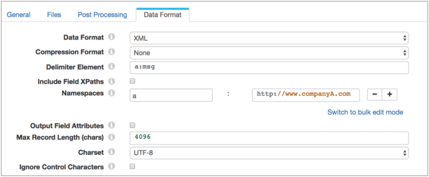
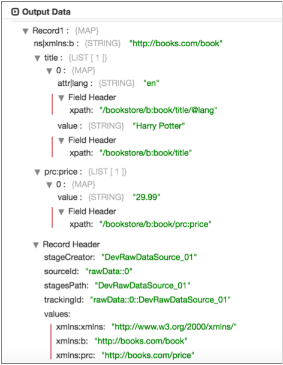
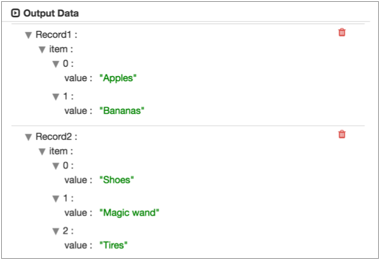

# 读取和处理XML数据

您可以从原始系统解析XML文档，而原始系统已启用XML数据格式。您还可以 使用XML Parser处理器解析数据收集器记录中字段中的XML文档。

您可以使用XML数据格式和XML分析器来处理格式正确的XML文档。 如果要处理无效的XML文档，则可以尝试使用带有自定义分隔符的文本数据格式。有关更多信息，请参见[使用自定义分隔符处理XML数据](https://streamsets.com/documentation/controlhub/latest/help/datacollector/UserGuide/Data_Formats/TextCDelim.html#concept_okt_kmg_jx)。

数据收集器使用用户定义的定界符元素来确定其如何生成记录。处理XML数据时，可以从XML文档生成单个记录或多个记录，如下所示：

- 生成一条记录

  要从XML文档生成单个记录，请不要指定定界符元素。

  当您从XML文档生成单个记录时，整个文档将作为映射写入到记录中。

- 使用XML元素生成多个记录

  通过将XML元素指定为定界符元素，可以从XML文档生成多个记录。

  当元素直接位于根元素下时，可以使用XML元素。

- 使用简化的XPath表达式生成多个记录

  通过将简化的XPath表达式指定为delimiter元素，可以从XML文档生成多个记录。

  使用简化的XPath表达式访问XML文档中元素第一级以下的数据，访问命名空间元素，即复杂XML文档中更深层的元素。

对于支持这种数据格式起源的完整列表，请参阅[起源](https://streamsets.com/documentation/controlhub/latest/help/datacollector/UserGuide/Apx-DataFormats/DataFormat_Title.html#concept_kgd_11c_kv) “数据格式的舞台”附录。

## 使用XML元素创建多个记录

您可以通过将XML元素指定为定界符来生成记录。

当要使用的数据位于根元素正下方的XML元素中时，可以将该元素用作分隔符。例如，在以下有效的XML文档中，可以将该`msg`元素用作分隔符元素：

```
<?xml version="1.0" encoding="UTF-8"?>
<root>
 <msg>
    <time>8/12/2016 6:01:00</time>
    <request>GET /index.html 200</request>
 </msg>
 <msg>
    <time>8/12/2016 6:03:43</time>
    <request>GET /images/sponsored.gif 304</request>
 </msg>
</root>
```

使用msg分隔符元素处理文档会产生两条记录。

**注意：**在配置**Delimiter Element**属性时，仅输入XML元素名称，而不能包含空格字符。也就是说，使用 `msg`代替``。

### 将XML元素与命名空间一起使用

当您使用XML元素作为分隔符时，Data Collector会 使用您指定的确切元素名称来生成记录。

如果在XML元素中包含名称空间前缀，则还必须在阶段中定义名称空间。然后，Data Collector 可以处理带有前缀的指定XML元素。

例如，您使用`a:msg`元素作为定界符元素，并在阶段中定义Company A命名空间。然后，Data Collector 仅处理`a:msg`Company A名称空间中的元素。它为以下文档生成一条记录，而忽略`c:msg`元素中的数据 ：

```
<?xml version="1.0" encoding="UTF-8"?>
<root>
	<a:msg xmlns:a="http://www.companyA.com">
		<time>8/12/2016 6:01:00</time>
		<request>GET /index.html 200</request>
	</a:msg>
	<c:msg xmlns:c="http://www.companyC.com">
		<item>Shoes</item>
		<item>Magic wand</item>
		<item>Tires</item>
	</c:msg>
	<c:msg xmlns:c="http://www.companyC.com">
		<time>8/12/2016 6:03:43</time>
		<request>GET /images/sponsored.gif 304</request>
	</c:msg>
</root>
```

在此阶段，您将使用前缀“ a”和名称空间URI 定义**名称空间**属性：http://www.companyA.com。

下图显示了配置为处理此数据的目录来源：



## 使用XPath表达式创建多个记录

您可以使用简化的XPath表达式作为定界符元素从XML文档生成记录。

使用简化的XPath表达式访问XML文档中第一级元素以下的数据。您还可以使用XPath表达式访问命名空间元素或复杂XML文档中更深层的元素。

例如，假设一个XML文档在第二级`msg` 元素中具有记录数据，如下所示：

```
<?xml version="1.0" encoding="UTF-8"?>
<root>
    <data>
        <msg>
            <time>8/12/2016 6:01:00</time>
            <request>GET /index.html 200</request>
        </msg>
    </data>
    <data>
        <msg>
            <time>8/12/2016 6:03:43</time>
            <request>GET /images/sponsored.gif 304</request>
        </msg>
    </data>
</root>
```

由于该`msg`元素不在根元素的正下方，因此不能将其用作定界符元素。但是您可以使用以下简化的XPath表达式来访问数据：

```
/root/data/msg
```

或者，如果第一级`data`元素有时可以是 `info`，则可以使用以下XPath表达式来访问`msg`元素中两层深的数据：

```
/root/*/msg
```

### 将XPath表达式与命名空间一起使用

使用XPath表达式处理XML文档时，可以处理名称空间中的数据。要访问名称空间中的数据，请定义XPath表达式，然后使用**Namespace** 属性定义**名称空间**的前缀和定义。

例如，以下XML文档包括两个名称空间，一个用于公司A，一个用于公司C：

```
<?xml version="1.0" encoding="UTF-8"?>
<root>
	<a:data xmlns:a="http://www.companyA.com">
		<msg>
			<time>8/12/2016 6:01:00</time>
			<request>GET /index.html 200</request>
		</msg>
	</a:data>
	<c:data xmlns:c="http://www.companyC.com">
		<sale>
			<item>Shoes</item>
			<item>Magic wand</item>
			<item>Tires</item>
		</sale>
	</c:data>
	<a:data xmlns:a="http://www.companyA.com">
		<msg>
			<time>8/12/2016 6:03:43</time>
			<request>GET /images/sponsored.gif 304</request>
		</msg>
	</a:data>
</root>
```

要从Company A命名空间的msg元素中的数据创建记录，可以使用以下XPath表达式之一：

```
/root/a:data/msg
/root/*/msg
```

然后使用前缀“ a”和名称空间URI 定义**名称空间**属性：http://www.companyA.com。

下图显示了配置为处理此数据的目录来源：


### 简化的XPath语法

使用XPath表达式从XML文档生成记录时，请使用[XPath语法](https://en.wikipedia.org/wiki/XPath#Abbreviated_syntax)的简化版本。

使用具有以下限制的缩写XPath语法：

- 运算符和XPath函数

  不要在XPath表达式中使用运算符或XPath函数。

- 轴选择器

  仅使用单个斜杠（/）子选择器。不支持后代或自身的双斜杠选择器（//）。

- 节点测试

  仅支持节点名称测试。请注意以下详细信息：您可以将名称空间与带有XPath名称空间前缀的节点名称一起使用。有关更多信息，请参见[将XPath表达式与命名空间结合使用](https://streamsets.com/documentation/controlhub/latest/help/datacollector/UserGuide/Data_Formats/XMLDFormat.html#concept_mkk_3zj_dy)。不要将名称空间用于属性。元素可以包括谓词。

- 谓词

  您可以将位置谓词或属性值谓词与元素一起使用，不能同时使用。使用以下语法来指定位置谓词：`/[]`使用以下语法来指定属性值谓词：`/[@='']`您可以使用星号通配符作为属性值。用单引号将值引起来。有关更多信息，请参见[XPath表达式中的谓词](https://streamsets.com/documentation/controlhub/latest/help/datacollector/UserGuide/Data_Formats/XMLDFormat.html#concept_bnl_4fh_2y)。

- 通配符

  您可以使用星号（*）表示单个元素，如下所示：`/root/*/msg`

  您也可以使用星号表示任何属性值。使用星号表示整个值，如下所示：`/root/info[@attribute='*']/msg`

### 样本XPath表达式

以下是有效和无效XPath表达式的一些示例：

- 有效表达

  以下表达式选择第一个顶级元素下面的每个元素。`/*[1]/*`以下表达式选择源属性设置为“ XYZ”的allvalues元素下的每个value元素。名为root的顶级元素下面的allvalues元素。每个元素都在abc名称空间中：`/abc:root/abc:allvalues[@source='XYZ']/xyz:value`

- 无效的表达

  以下表达式无效：`/root//value` -无效，因为不支持后代或自身轴（“ //”）。`/root/collections[last()]/value` -无效，因为不支持函数（例如last）。`/root/collections[@source='XYZ'][@sequence='2']` -无效，因为不支持元素的多个谓词。`/root/collections[@source="ABC"]` -无效，因为attribute属性值应该用单引号引起来。`/root/collections[@source]` -无效，因为表达式使用属性而不定义属性值。

### XPath表达式中的谓词

您可以在XPath表达式中使用谓词来处理元素实例的子集。您可以对元素使用位置谓词或属性值谓词，但不能同时使用。您也可以使用通配符来定义属性值。

- 位置谓词

  位置谓词指示要在文件中使用的元素的实例。当元素在文件中多次出现并且您要根据实例在文件中的位置使用特定实例时，请使用位置谓词，例如元素第一次，第二次或第三次出现在文件中。使用以下语法来指定位置谓词：`/[]`

  例如，假设该`contact`元素在文件中出现多次，但是您只关心文件中第一个实例中的地址数据。然后可以对元素使用谓词，如下所示：`/root/contact[1]/address`

- 属性值谓词

  属性值谓词将数据限制为具有指定属性值的元素。当您要指定具有特定属性值的元素或仅定义了属性值的元素时，请使用属性值谓词。使用以下语法来指定属性值谓词：`/[@='']`

  您可以使用星号通配符作为属性值。用单引号将值引起来。

  例如，如果你只是想`server`用数据 `region`属性设置为“西进”，你可以添加如下的区域属性：`/*/server[@region='west']`

### 谓词示例

要处理第二级`collections`元素下一个元素中的所有数据`apps`，可以使用以下简化的XPath表达式：

```
/*/apps/collections
```

如果只希望将数据放在`apps`XML文档的第一个实例下，则可以添加一个位置谓词，如下所示：

```
/*/apps[1]/collections
```

要仅处理`app`文档中`collections`元素的版本属性设置为3的所有元素的 数据，请添加版本属性和值，如下所示：

```
/*/apps/collections[@version='3']
```

如果您不关心属性的值是什么，则可以对属性值使用通配符，如下所示：

```
/root/apps/collections[@version='*']
```

## 包括字段XPath和命名空间

您可以通过启用“包括字段XPaths”属性来在记录中包括字段XPath表达式和名称空间。

启用后，记录将每个字段的XPath表达式作为字段属性，并在xmlns记录头属性中包含每个名称空间。默认情况下，此信息不包含在记录中。

例如，假设您有以下XML文档：

```
<?xml version="1.0" encoding="UTF-8"?>
<bookstore xmlns:prc="http://books.com/price">
   <b:book xmlns:b="http://books.com/book">
      <title lang="en">Harry Potter</title>
      <prc:price>29.99</prc:price>
   </b:book>
   <b:book xmlns:b="http://books.com/book">
      <title lang="en_us">Learning XML</title>
      <prc:price>39.95</prc:price>
   </b:book>
</bookstore>
```

当`/*[1]/*`用作分隔符元素并启用“包含字段XPaths”属性时，Data Collector会 生成带有突出显示的字段XPath表达式和名称空间记录头属性的以下记录：



**注意：** 只有在目标中使用SDC RPC数据格式时，字段属性和记录头属性才会自动写入目标系统。有关使用字段属性和记录标题属性以及如何将它们包括在记录中的更多信息，请参见[字段属性](https://streamsets.com/documentation/controlhub/latest/help/datacollector/UserGuide/Pipeline_Design/FieldAttributes.html#concept_xfm_wtp_1z)和[记录标题属性](https://streamsets.com/documentation/controlhub/latest/help/datacollector/UserGuide/Pipeline_Design/RecordHeaderAttributes.html#concept_wn2_jcz_dz)。

## XML属性和命名空间声明

默认情况下，解析的XML在记录中包括XML属性和名称空间声明作为单独的字段。您可以使用“输出字段属性”属性将信息放置在字段属性中。

将信息放在字段属性中，以避免在记录字段中添加不必要的信息。

**注意：** 只有在目标中使用SDC RPC数据格式时，字段属性才会自动包含在写入目标系统的记录中。有关使用字段属性的更多信息，请参见[字段属性](https://streamsets.com/documentation/controlhub/latest/help/datacollector/UserGuide/Pipeline_Design/FieldAttributes.html#concept_xfm_wtp_1z)。

## 解析的XML

使用XML数据格式或XML Parser处理器解析XML文档时，Data Collector会 生成一个字段，该字段是基于嵌套元素，文本节点和属性的字段映射。注释元素将被忽略。

例如，假设您有以下XML文档：

```
<?xml version="1.0" encoding="UTF-8"?>
<root>
 <a:info xmlns:a="http://www.companyA.com">  
  <sale>  
    <item>Apples</item>  
    <item>Bananas</item> 
  </sale>
</a:info>
<c:info xmlns:c="http://www.companyC.com"> 
  <sale>
    <item>Shoes</item>
    <item>Magic wand</item>  
    <item>Tires</item>
  </sale>
 </c:info>
</root>
```

要为`sale`两个名称空间中的元素中的数据创建记录，可以使用通配符来表示第二级`info`元素，如下所示：

```
/root/*/sale
```

然后，在源中定义两个名称空间。

使用默认XML属性处理XML文档时，Data Collector 会生成两条记录，如以下原始数据预览所示：

