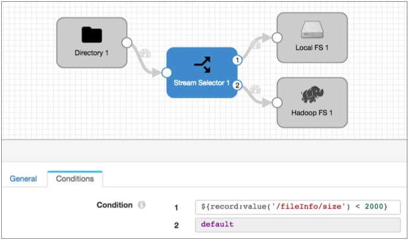

# 整个文件数据格式

您可以使用整个文件数据格式将整个文件从源系统传输到目标系统。使用整个文件数据格式，您可以传输任何类型的文件。

传输整个文件时，Data Collector会 从原始系统流式传输文件数据，并根据目标中定义的目录和文件名将数据写入目标系统。

整个文件记录都包含文件传输的参考信息。它们不包含文件中的数据。虽然可以使用多个处理器读取或修改参考信息，但是不能使用典型的处理器（例如Field Masker或Field Replacer）对文件数据执行处理。唯一可以实质改变整个文件数据的处理器是Whole File Transformer处理器，它将Avro文件转换为Parquet。有关更多信息，请参见[Whole File Transformer](https://streamsets.com/documentation/controlhub/latest/help/datacollector/UserGuide/Processors/WholeFileTransformer.html#concept_nwg_rx4_l2b)。

默认情况下，整个文件传输会根据需要使用可用资源。您可以通过指定传输速率来限制用于传输整个文件数据的资源。

当源系统提供校验和元数据时，您可以配置源以验证校验和。生成事件的目的地可以在事件记录中包括校验和信息。

大多数目标允许您定义对书面文件的访问权限。默认情况下，写入文件使用目标系统的默认权限。

**注意：**在数据预览期间，整个文件管道将显示单个记录，而不是为预览批处理大小配置的记录数。

有关处理此数据格式的来源和目的地的列表，请参见[数据格式支持](https://streamsets.com/documentation/controlhub/latest/help/datacollector/UserGuide/Apx-DataFormats/DataFormat_Title.html#concept_bcw_qzb_kv)。

## 基本管道

处理整个文件的管道包括一个源和一个或多个支持整个文件数据格式的目的地。

您可以包括某些处理器来读取或修改记录中包含的文件参考信息，例如文件名或所有者。您还可以包括[全文件转换器处理器，](https://streamsets.com/documentation/controlhub/latest/help/datacollector/UserGuide/Processors/WholeFileTransformer.html#concept_nwg_rx4_l2b)以将Avro文件转换为Parquet。但是，基本的整个文件管道如下所示：


## 整个档案记录

读取整个文件时，原点会产生一个包含两个字段的记录：

- fileref-包含一个引用，该引用使文件能够从原始系统流到目标系统。您可以使用脚本处理器来读取fileref字段。您不能在fileref字段中修改信息。
- fileInfo-文件属性的映射，例如文件路径，文件名和文件所有者。细节因来源系统而异。您可以根据需要使用处理器来修改fileInfo字段中的信息。

**提示：** 您可以使用数据预览来确定fileInfo字段中包含的信息和字段名称。信息和字段名称可能会因来源系统而异。

### 用于文件参考信息的处理器

您可以使用多个处理器来读取或修改整个文件记录中的文件参考信息。您也可以使用Whole File Transformer处理器将Avro文件转换为Parquet。有关更多信息，请参见[Whole File Transformer](https://streamsets.com/documentation/controlhub/latest/help/datacollector/UserGuide/Processors/WholeFileTransformer.html#concept_nwg_rx4_l2b)。

您可以使用以下处理器来读取或修改整个文件记录中的字段级信息：

- 表达评估器

  用于更新fileInfo字段。

  例如，您可以使用表达式计算器来更新文件的所有者。

- Groovy评估器，JavaScript评估器和Jython评估器

  通过使用getInputStream（）API在代码中创建输入流来用于访问fileref字段。

  例如，您可能使用Groovy评估程序来使用Groovy代码，该代码读取fileref字段中的文件数据，然后使用该数据创建新记录。**注意：**处理器完成读取流后，请确保在代码中关闭输入流。

  有关使用Groovy Evaluator处理整个文件的信息，请参阅 [访问整个文件格式记录](https://streamsets.com/documentation/controlhub/latest/help/datacollector/UserGuide/Processors/Groovy.html#concept_t35_rsy_mx)。

  有关使用JavaScript评估程序处理整个文件的信息，请参阅[访问整个文件格式记录](https://streamsets.com/documentation/controlhub/latest/help/datacollector/UserGuide/Processors/JavaScript.html#concept_bfr_h5y_mx)。

  有关使用Jython评估程序处理整个文件的信息，请参阅 [访问整个文件格式记录](https://streamsets.com/documentation/controlhub/latest/help/datacollector/UserGuide/Processors/Jython.html#concept_jrt_s5y_mx)。

- 流选择器

  用于基于fileInfo字段中的信息来路由文件。

  例如，您可以使用流选择器根据文件的大小将记录路由到不同的目标。以下管道将2 MB以下的文件路由到本地文件系统，并使用默认流将所有较大的文件路由到HDFS：

  

## 定义传输速率

默认情况下，管道使用所有可用资源来传输整个文件数据。定义传输速率以限制整个文件管道使用的资源。例如，您可以指定传输速率以启用同时运行多个完整文件管道或为其他处理保留资源。

通过 在原始文件的整个文件数据格式属性中配置“ **每秒速率”**属性来指定传输速率。

默认情况下，不使用“每秒速率”属性，从而允许管道使用所有可用资源。如果指定传输速率，则默认情况下度量单位为每秒字节数。您可以通过在表达式中使用度量单位来每秒使用不同的度量单位。

例如，如果输入1000，则管道将使用1000字节/秒的传输速率。要指定10 MB /秒的速率，可以使用以下表达式： `${10 * MB}`。

## 写入整个文件

写入整个文件时，可以在目标位置配置“ **文件名表达式”**属性。该表达式定义输出文件的名称。

每个完整的文件源都在fileInfo字段中包含文件信息。因此，您可以轻松地将输出文件名基于源系统中的原始文件名。

下表列出了保存每个来源的输入文件名的字段名称，以及一个基于输入文件名命名输出文件的基本表达式：

| 起源                                                         | 文件名字段路径         | 基本表达                                        |
| :----------------------------------------------------------- | :--------------------- | :---------------------------------------------- |
| 目录                                                         | / fileInfo /文件名     | $ {record：value（'/ fileInfo / filename'）}    |
| SFTP / FTP                                                   | / fileInfo /文件名     | $ {record：value（'/ fileInfo / filename'）}    |
| 亚马逊S3                                                     | / fileInfo / objectKey | $ {record：value（'/ fileInfo / objectKey'）} * |
| *请注意，objectKey字段可以包含字段路径以及文件名。当objectKey只是文件名时，使用此表达式。 |                        |                                                 |

### 例

您希望管道将整个文件从本地目录传递到Amazon S3。对于输出文件名，您想将.json文件扩展名附加到原始文件名。

目录源将原始文件名存储在/ fileInfo / filename字段中，因此您可以对Amazon S3 **File Name Expression**属性使用以下表达式：

```
${str:concat(record:value('/fileInfo/filename'), ".json")}
```

或者，更简单地说...

```
${record:value('/fileInfo/filename’)}.json
```

### 访问权限

默认情况下，当使用整个文件数据格式时，输出文件将使用目标系统中定义的默认访问权限。大多数目标允许您指定输出文件的访问权限。Amazon S3不允许这样做。

您可以输入表达式来定义访问权限。表达式的计算结果应为您要使用的权限的符号或数字/八进制表示形式。例如，要使文件对所有用户只读，则符号表示为 `-r--r--r--`。数字或八进制表示为 `0444`。

要对每个输出文件使用原始源文件权限，可以使用以下表达式：

```
${record:value('/fileInfo/permissions')}
```

例如，这可确保将具有仅文件所有者执行权限的源文件以完全相同的一组权限写入目标系统。

### 在事件中包括校验和

生成事件的目标可以包括每个文件的校验和。

启用校验和使用后，目标将在整个文件事件记录中包括校验和和校验和算法。每当目标完成写入整个文件时，就会生成整个文件事件记录。

您可以使用以下算法来生成校验和：

- MD5
- SHA1
- SHA256
- SHA512
- MURMUR3_32
- MURMUR3_128

有关特定目标的事件生成和事件记录的详细信息，请参阅目标文档。有关事件框架的生成信息，请参见“ [数据流触发器概述”](https://streamsets.com/documentation/controlhub/latest/help/datacollector/UserGuide/Event_Handling/EventFramework-Title.html#concept_cph_5h4_lx)。