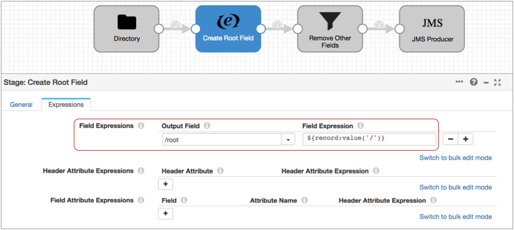
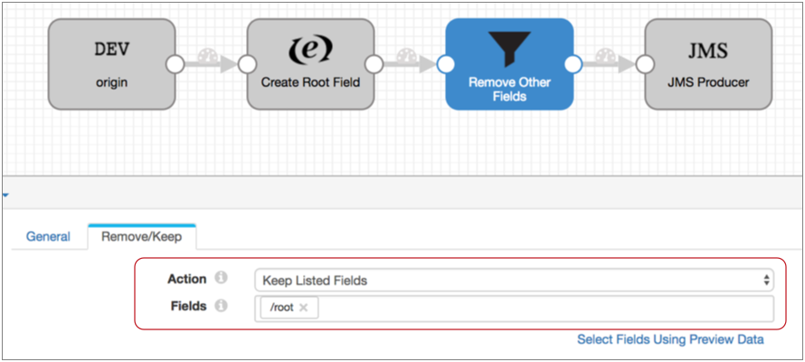

# 编写XML数据

写入XML数据时，目标将为每个记录创建一个有效的XML文档。目标要求记录具有一个包含其余记录数据的单个根字段。

编写XML数据时，可以配置目标以执行以下任务：

- 产生“漂亮的”输出-目标可以添加缩进以使XML数据易于阅读。这将额外的字节添加到记录大小。
- 验证架构-目标可以验证生成的XML是否符合指定的架构定义。具有无效架构的记录将根据为目标配置的错误处理进行处理。

对于支持这种数据格式目的地的完整列表，请参阅[目的地](https://streamsets.com/documentation/controlhub/latest/help/datacollector/UserGuide/Apx-DataFormats/DataFormat_Title.html#concept_odv_w5c_kv) “数据格式的舞台”附录。

## 记录结构要求

写入XML数据时，目标希望所有记录数据都在单个根字段下。必要时，将记录数据合并到管道中较早的根字段中。您可以使用Expression Evaluator和Field Remover处理器执行此任务。

例如，在下面的管道中，表达式计算器使用表达式 `${record:value('/')}`来创建一个根字段，并将整个记录复制到该根字段下：

然后，您可以使用“字段删除器”仅保留根字段，从而删除所有其他字段：

