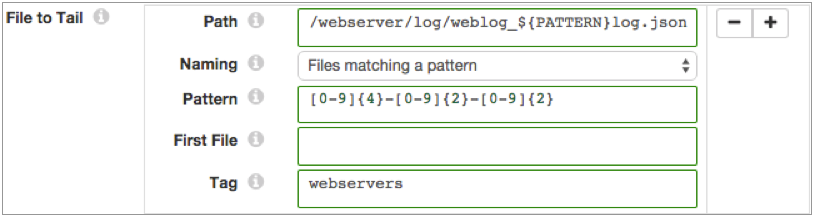

# 文件尾

[支持的管道类型：](https://streamsets.com/documentation/controlhub/latest/help/datacollector/UserGuide/Pipeline_Configuration/ProductIcons_Doc.html#concept_mjg_ly5_pgb) 资料收集器 数据收集器边缘

在读取同一目录中的相关归档文件后，文件尾源将读取数据行，并将它们写入活动文件。文件尾为每行数据生成一条记录。

配置文件尾时，您将定义活动文件的完整路径，已归档文件的命名约定以及要处理的第一个已归档文件。这些属性确定读取的文件集和处理顺序。

例如，将文件尾部配置为尾随名为server.log的日志（从server.log.1开始），并期望以反向计数器顺序命名的归档文件。当管道运行时，它将开始从server.log.1的开头读取行，而忽略较旧的文件。当到达server.log.1的末尾时，它将继续处理server.log中的数据。完成读取server.log中的现有数据后，它将尾随该文件的传入数据。

当您停止管道时，“文件尾部”会记录它停止读取的位置。当您重新启动管道时，即使文件尾已被归档到另一个文件，它也会从中断处开始继续处理。

您可以重置“文件尾”的来源。重置原点时，“文件尾部”将所有属性视为首次启动管道-在继续活动文件之前处理所有请求的文件。

File Tail生成记录头属性，使您能够在管道处理中使用记录的来源。

源可以为事件流生成事件。有关数据流触发器和事件框架的更多信息，请参见[数据流触发器概述](https://streamsets.com/documentation/controlhub/latest/help/datacollector/UserGuide/Event_Handling/EventFramework-Title.html#concept_cph_5h4_lx)。

**注意：**如果将logrotate与copytruncate选项一起使用，请使用目录原点来处理已滚动或已归档的文件。文件尾部不支持copytruncate。

## 文件处理和归档文件名

文件尾根据源服务器生成文件的方式来处理活动文件和存档文件。当指定归档文件的命名约定时，“文件尾”将确定文件生成方法并相应地处理数据。

File Tail可以基于以下常见的文件生成和存档策略来处理数据：

- 服务器将数据写入单个活动文件并根据需要归档文件

  服务器将新数据写入单个文件，例如weblog.log。它将定期将较旧的数据从活动文件滚动到存档文件，例如weblog.log1或weblog.log.2015-10-15。

  File Tail通过新的和存档的数据智能地跟踪其相对进度，并且不受文件名更改的影响。

  文件尾可以处理使用以下命名约定的存档文件：**带有反向计数器的活动文件** -服务器在每个已归档文件的末尾附加一个数字，例如data.1，data.2等。“文件尾部”以相反的数字顺序处理文件，然后再进入活动文件。**带有日期的活动文件** -服务器将日期附加到已归档文件的末尾，例如event.log.2015-11，event.log.2015-12。Log4j服务器通常使用此方法。文件尾提供了一组可用的日期模式。如果日志文件的日期模式不可用，则可以使用字母顺序。“文件尾部”将根据选定的日期模式以相反的顺序处理文件，然后再转换为活动文件。在Data Collector Edge管道中无效。如果将原点配置为使用此命名约定，则原点将使用带有反向计数器的活动文件约定。**带有字母顺序的活动文件** -服务器按字母顺序升序生成文件，例如file.json.a，file.json.b，file.json.c。您可能使用此方法来处理使用logrotate实用工具归档的Apache日志。您还可以使用字母顺序来处理带有附加日期不匹配提供的日期格式的文件。“文件尾”将按字母顺序处理文件，然后再进入活动文件。在Data Collector Edge管道中无效。如果将原点配置为使用此命名约定，则原点将使用带有反向计数器的活动文件约定。

- 服务器根据需要写入一个新的活动文件，将先前的文件存档而不重命名

  服务器写入活动文件，并根据需要创建一个新的活动文件。创建新的活动文件时，它将存档先前的活动文件而不重命名。活动文件已更改，但文件名未更改。

  服务器使用您使用正则表达式定义的模式来生成文件。

  使用**匹配模式**的文件作为存档文件命名约定。

  “文件尾部”将按字母顺序处理文件，然后再处理到最新文件-活动文件。

  例如，如果您使用log_ [0-9] {4}-[0-9] {2}-[0-9] {2} \\ .. json作为文件名模式，文件尾可能会读取log-2015 -5-01.json，然后输入log-2015-05-02.json，依此类推-直到到达当前日期的文件为止。

## 多个路径和文件集

文件尾可以读取不同目录中的文件集。当文件尾处理不同的文件集时，它将合并管道中的所有数据。如果以后需要分隔记录，则可以使用标签记录属性。

要定义一组要处理的文件，请指定活动文件和相关属性的完整路径。您可以通过为每组文件配置一组属性来定义其他文件集。

您还可以使用通配符在路径定义中定义全局模式，以表示多个路径和活动文件。定义全局模式时，请注意以下限制：

- 管道启动时，通配符之前的路径部分必须存在，除非您启用了源可以从最新目录中读取。使用“允许延迟目录”属性允许读取延迟目录。

  例如，在未启用最新目录的情况下，启动管道时，以下目录的/ server /部分必须存在。

  ```
  /server/*/activity.log
  ```

- 虽然您可以在路径中使用多个通配符，但不要连续使用多个通配符。

  例如，此路径有效：

  ```
  /user/*/logs/*/log-*.json
  ```

  但是以下路径未通过验证，因为它包含两个相邻的通配符：

  ```
  /user/*/logs/*/*/log-*.json
  ```

## 第一个要处理的文件

当您希望“文件尾”源忽略目录中的一个或多个现有文件时，请配置第一个文件进行处理。

当您定义要处理的第一个文件时，“文件尾”将开始处理指定的文件，并根据所选的已存档文件命名约定继续进行处理。当您不指定第一个文件时，原始服务器将根据命名约定处理目录中的所有文件。

例如，假设来源读取具有反向计数器归档文件的活动文件。要忽略所有早于特定文件的文件，请将该文件用作要处理的第一个文件。

**注意：**重新启动已停止的管道时，“文件尾”将忽略此属性。除非您重设原点，否则无论文件名如何，它都会从中断处开始。

## 后期目录

您可以将文件尾配置为读取较晚目录中的文件-管道启动后出现的目录。

从较晚的目录中读取时，启动管道时“文件尾”不会验证目录路径。如果在管道启动时不存在有效目录，则“文件尾”将无限期等待有效目录的出现和尾部文件的出现。

例如，假设您要尾随以下文件：

```
/logs/*/server/*/log.json
```

启动管道时不存在有效的目录或文件，因此“文件尾部”将等到出现有效目录和文件后再拖尾文件。

通过此文件路径，源可以将文件拖到以下延迟到达的目录中：

```
/logs/region1/server/8/log.json
/logs/region2/server/15/log.json
/logs/cloud/server/23/log.json
```

## 匹配模式的文件-模式常数

当您使用“文件匹配模式”命名选项时，请使用PATTERN常量作为文件名模式的占位符。然后，您可以使用Pattern属性定义PATTERN常量。

例如，以下属性处理名为weblog_ <yyyy>-<mm>-<dd> .json的文件中的数据，并向每个记录添加“ webservers”标记属性：



## 记录标题属性

File Tail源文件创建记录头属性，该属性包含有关记录源文件的信息。

您可以使用`record:attribute`或 `record:attributeOrDefault`函数来访问属性中的信息。有关使用记录标题属性的更多信息，请参见[使用标题属性](https://streamsets.com/documentation/controlhub/latest/help/datacollector/UserGuide/Pipeline_Design/RecordHeaderAttributes.html#concept_rd2_ghz_dz)。

文件尾源将创建以下记录头属性：

- filename-提供记录起源的文件名。
- 文件-提供记录起源的文件路径和文件名。
- mtime-提供文件的最后修改时间。
- offset-提供文件偏移量（以字节为单位）。文件偏移量是记录在文件中的原始位置。

原点也可以生成用户定义的标签属性。

### 定义和使用标签

标签是可以为文件集定义的可选记录头属性。在管道中，您可以使用一个函数来返回tag属性的值。

定义标记属性，以便您可以轻松引用标记的记录。使用**Tag** 属性为与路径关联的一组文件定义标签。请注意，当您在路径中使用通配符或glob模式来表示几组文件时，这些文件都将使用相同的标记。

在管道中，可以使用以下表达式返回tag属性：

```
record:attribute('tag')
```

例如，当您使用两个不同的路径尾部来自两个服务器的文件时，可以标记记录ServerA和ServerB。在流选择器中，可以使用以下条件将数据分离到管道的两个不同分支：

```
${record:attribute('tag')='ServerA'}
${record:attribute('tag')='ServerB'}
```

## 多线处理

文件尾可以处理包含多行的日志和文本数据。您可以使用多行处理来将堆栈跟踪与日志数据一起包含，或处理MySQL多行日志。

要处理多行数据，请使用正则表达式定义标准行的模式。当文件尾遇到与模式不匹配的数据时，会将不匹配的数据追加到前一行。

评估模式的数据可能会影响性能，因此仅在需要时才使用多行处理。

## 文件尾巴输出

文件尾通过单独的输出流提供数据和相关的元数据。

原点通过以下输出位置传递信息：

- 数据

  传递从原点读取的数据。

- 元数据

  **重要说明：**在将来的版本中将不推荐使用此功能。元数据输出生成的记录与文件尾事件记录相同。最佳做法是将元数据输出连接到垃圾箱目标。然后，要使用事件记录，请配置源以生成事件。有关更多信息，请参见 [事件生成](https://streamsets.com/documentation/controlhub/latest/help/datacollector/UserGuide/Origins/FileTail.html#concept_gwn_c32_px)。

  传递有关文件处理的信息。要保留此信息以供查看，请将元数据输出位置连接到其他任何目的地，或根据需要路由数据。如果不需要此信息，请将元数据输出位置连接到“垃圾箱”目标。

  文件处理元数据包括以下字段：fileName-文件名。inode-文件的索引信息。时间-事件发生的时间。事件-处理事件。START表示文件尾已开始处理指定的文件。END表示文件尾已完成对文件内容的处理。

  **注意：**当服务器重命名存档文件时，Inode最可靠地标识文件。

## 事件产生

File Tail源可以生成可在事件流中使用的事件。启用事件生成后，起源在每次起源开始或完成读取文件时都会生成事件记录。

可以以任何逻辑方式使用文件尾事件。例如：

- 使用电子邮件执行程序在收到事件后发送自定义电子邮件。

  有关示例，请参阅[案例研究：发送电子邮件](https://streamsets.com/documentation/controlhub/latest/help/datacollector/UserGuide/Event_Handling/EventFramework-Title.html#concept_t2t_lp5_xz)。

- 具有用于存储事件信息的目的地。

  有关示例，请参见[案例研究：事件存储](https://streamsets.com/documentation/controlhub/latest/help/datacollector/UserGuide/Event_Handling/EventFramework-Title.html#concept_ocb_nnl_px)。

在Data Collector Edge管道中，您只能将事件传递到目标进行存储。由于Data Collector Edge管道不支持执行程序阶段，因此不能使用事件来触发任务。

有关数据流触发器和事件框架的更多信息，请参见[数据流触发器概述](https://streamsets.com/documentation/controlhub/latest/help/datacollector/UserGuide/Event_Handling/EventFramework-Title.html#concept_cph_5h4_lx)。

### 活动记录

由文件尾源产生的事件记录具有以下字段：

| 领域     | 描述                                                         |
| :------- | :----------------------------------------------------------- |
| 文件名   | 文件名。                                                     |
| 索引节点 | 文件的索引信息。                                             |
| 时间     | 事件发生的时间。                                             |
| 事件     | 生成记录的事件。使用以下值之一：开始-文件尾开始处理指定的文件。结束-文件尾已完成对文件内容的处理。 |

## 资料格式

File Tail源处理数据行。源根据要处理的数据类型不同地处理数据。

在Data Collector Edge管道中， 源仅支持JSON和Text数据格式。

File Tail原始处理数据格式如下：

- JSON格式

  为每个JSON对象生成一条记录。每个JSON对象必须作为一行写入文件。

  当对象超过为原点定义的最大行长时，文件尾会根据为原点配置的错误处理来处理对象。

- 记录

  为每个日志行生成一条记录。

  当一行超过为原点定义的最大行长时，“文件尾”将截断该行。

  您可以将处理后的日志行作为字段包含在记录中。如果日志行被截断，并且您在记录中请求日志行，则文件尾部将包括截断的行。

  您可以定义要读取的日志格式或类型。

- 文本

  为文件中的每一行生成一条记录。

  当一行超过为原点定义的最大行长时，“文件尾”将截断该行。原点添加了一个名为Truncated的布尔字段，以指示该行是否被截断。

## 配置文件尾源

配置文件尾源以在将数据写入文件时读取数据。

1. 在“属性”面板的“ **常规”**选项卡上，配置以下属性：

   | 一般财产                                                     | 描述                                                         |
   | :----------------------------------------------------------- | :----------------------------------------------------------- |
   | 名称                                                         | 艺名。                                                       |
   | 描述                                                         | 可选说明。                                                   |
   | [产生事件](https://streamsets.com/documentation/controlhub/latest/help/datacollector/UserGuide/Origins/FileTail.html#concept_gwn_c32_px) | 发生事件时生成事件记录。用于 [事件处理](https://streamsets.com/documentation/controlhub/latest/help/datacollector/UserGuide/Event_Handling/EventFramework-Title.html#concept_cph_5h4_lx)。 |
   | [记录错误](https://streamsets.com/documentation/controlhub/latest/help/datacollector/UserGuide/Pipeline_Design/ErrorHandling.html#concept_atr_j4y_5r) | 该阶段的错误记录处理：放弃-放弃记录。发送到错误-将记录发送到管道以进行错误处理。停止管道-停止管道。 |

2. 在**文件**选项卡上，配置以下属性：

   | 文件属性                                                     | 描述                                                         |
   | :----------------------------------------------------------- | :----------------------------------------------------------- |
   | 最大批量                                                     | 批处理中包含的最大行数。接受的值最高为Data Collector的最大批处理大小。默认值是1000 数据采集器默认设置为1000。 |
   | [批处理等待时间（秒）](https://streamsets.com/documentation/controlhub/latest/help/datacollector/UserGuide/Origins/Origins_overview.html#concept_ypd_vgr_5q) | 发送批次之前要等待的秒数。                                   |
   | 归档到尾巴                                                   | 目录和要处理的文件集。使用[简单或批量编辑模式](https://streamsets.com/documentation/controlhub/latest/help/datacollector/UserGuide/Pipeline_Configuration/SimpleBulkEdit.html#concept_alb_b3y_cbb)，单击 **添加**图标以输入其他信息集。 |
   | [路径](https://streamsets.com/documentation/controlhub/latest/help/datacollector/UserGuide/Origins/FileTail.html#concept_cyz_kr4_1s) | 活动文件尾部的完整路径。您可以使用通配符来定义全局模式。不要连续使用多个通配符。除非您启用从最新目录中读取，否则通配符之前的路径必须存在。 |
   | [命名](https://streamsets.com/documentation/controlhub/latest/help/datacollector/UserGuide/Origins/FileTail.html#concept_trt_thq_5r) | 存档文件的命名约定。选择描述服务器如何生成文件名的命名约定：带有反向计数器的活动文件- 文件尾部以相反的数字顺序处理文件，然后再进入活动文件。带日期的活动文件-“ 文件尾”将根据选定的日期模式以相反的顺序处理文件，然后再进入活动文件。在Data Collector Edge管道中无效。如果将原点配置为使用此命名约定，则原点将使用带有反向计数器的活动文件约定。具有字母顺序的活动文件-“ 文件尾部”按字母顺序处理文件，然后再进入活动文件。在Data Collector Edge管道中无效。如果将原点配置为使用此命名约定，则原点将使用带有反向计数器的活动文件约定。匹配模式的文件 -“ 文件尾”将按字母顺序处理文件，然后再升级到最新文件-活动文件。 |
   | 图案                                                         | 定义用于创建文件的文件名模式的正则表达式。您可以使用UNIX样式的通配符，例如星号或问号。仅适用于“匹配模式的文件”命名选项。 |
   | [第一个档案](https://streamsets.com/documentation/controlhub/latest/help/datacollector/UserGuide/Origins/FileTail.html#concept_xrx_btm_b1b) | 启动管道时要处理的第一个文件的名称。使用使用文件名模式的名称。保留空白以使用指定的命名约定读取目录中的所有文件。输入文件名时，“文件尾”将读取第一个文件，然后进入活动文件。重新启动已停止的管道时，“文件尾”将忽略此属性。除非您重设源文件，否则无论第一个文件名如何，它都会从中断处开始。 |
   | [标签](https://streamsets.com/documentation/controlhub/latest/help/datacollector/UserGuide/Origins/FileTail.html#concept_crd_tlx_fs) | 可选的记录标题属性，以帮助区分不同的记录集。                 |
   | [允许后期目录](https://streamsets.com/documentation/controlhub/latest/help/datacollector/UserGuide/Origins/FileTail.html#concept_xcd_dxw_mv) | 允许从管道启动后出现的目录中读取文件。启用后，原点将不验证文件路径。 |

3. 在“ **后处理”**选项卡上，配置以下属性：

   | 后处理属性 | 描述                                                         |
   | :--------- | :----------------------------------------------------------- |
   | 文件后处理 | 处理文件后采取的措施：无-将文件保留在原位。存档-将文件移动到存档目录。删除-删除文件。 |
   | 档案目录   | 归档文件的目录。                                             |

4. 在“ **数据格式”**选项卡上，配置以下属性：

   | 数据格式属性                                                 | 描述                                                         |
   | :----------------------------------------------------------- | :----------------------------------------------------------- |
   | [资料格式](https://streamsets.com/documentation/controlhub/latest/help/datacollector/UserGuide/Origins/FileTail.html#concept_pm4_b3q_5r) | 文件中数据的格式。使用以下数据格式之一：JSON格式记录文本在Data Collector Edge管道中， 源仅支持JSON和Text数据格式。 |

5. 对于JSON数据，在**数据格式**选项卡上，配置以下属性：

   | JSON属性                                                     | 描述                                                         |
   | :----------------------------------------------------------- | :----------------------------------------------------------- |
   | [压缩格式](https://streamsets.com/documentation/controlhub/latest/help/datacollector/UserGuide/Data_Formats/DataFormats-Overview.html#concept_uxr_g52_qs) | 文件的压缩格式：无-仅处理未压缩的文件。压缩文件-处理受支持的压缩格式压缩的文件。存档-处理通过支持的存档格式存档的文件。压缩存档-处理通过支持的存档和压缩格式存档和压缩的文件。在Data Collector Edge管道中，源仅支持未压缩和压缩的文件，不支持存档或压缩的存档文件。 |
   | 压缩目录中的文件名模式                                       | 对于归档文件和压缩归档文件，文件名模式表示要在压缩目录中处理的文件。您可以使用UNIX样式的通配符，例如星号或问号。例如，*。json。默认值为*，它处理所有文件。 |
   | JSON内容                                                     | JSON内容的类型。使用以下选项之一：对象数组多个物件           |
   | 最大对象长度（字符）                                         | JSON对象中的最大字符数。较长的对象将转移到管道以进行错误处理。此属性可以受数据收集器解析器缓冲区大小的限制。有关更多信息，请参见[最大记录大小](https://streamsets.com/documentation/controlhub/latest/help/datacollector/UserGuide/Origins/Origins_overview.html#concept_svg_2zl_d1b)。 |
   | 字符集                                                       | 要处理的文件的字符编码。                                     |
   | [忽略控制字符](https://streamsets.com/documentation/controlhub/latest/help/datacollector/UserGuide/Pipeline_Design/ControlCharacters.html#concept_hfs_dkm_js) | 除去制表符，换行符和回车符以外的所有ASCII控制字符。          |

6. 对于日志数据，在“ **数据格式”**选项卡上，配置以下属性：

   | 日志属性                                                     | 描述                                                         |
   | :----------------------------------------------------------- | :----------------------------------------------------------- |
   | [压缩格式](https://streamsets.com/documentation/controlhub/latest/help/datacollector/UserGuide/Data_Formats/DataFormats-Overview.html#concept_uxr_g52_qs) | 文件的压缩格式：无-仅处理未压缩的文件。压缩文件-处理受支持的压缩格式压缩的文件。存档-处理通过支持的存档格式存档的文件。压缩存档-处理通过支持的存档和压缩格式存档和压缩的文件。 |
   | 压缩目录中的文件名模式                                       | 对于归档文件和压缩归档文件，文件名模式表示要在压缩目录中处理的文件。您可以使用UNIX样式的通配符，例如星号或问号。例如，*。json。默认值为*，它处理所有文件。 |
   | [多行模式](https://streamsets.com/documentation/controlhub/latest/help/datacollector/UserGuide/Origins/FileTail.html#concept_mzk_w4v_js) | 定义标准日志行模式的正则表达式。                             |
   | [日志格式](https://streamsets.com/documentation/controlhub/latest/help/datacollector/UserGuide/Data_Formats/LogFormats.html) | 日志文件的格式。使用以下选项之一：通用日志格式合并日志格式Apache错误日志格式Apache访问日志自定义格式正则表达式格罗模式Log4j通用事件格式（CEF）日志事件扩展格式（LEEF） |
   | 最大线长                                                     | 日志行的最大长度。原点将截断较长的行。此属性可以受数据收集器解析器缓冲区大小的限制。有关更多信息，请参见[最大记录大小](https://streamsets.com/documentation/controlhub/latest/help/datacollector/UserGuide/Origins/Origins_overview.html#concept_svg_2zl_d1b)。 |
   | 保留原始行                                                   | 确定如何处理原始日志行。选择以将原始日志行作为字段包含在结果记录中。默认情况下，原始行被丢弃。 |
   | 字符集                                                       | 要处理的文件的字符编码。                                     |
   | [忽略控制字符](https://streamsets.com/documentation/controlhub/latest/help/datacollector/UserGuide/Pipeline_Design/ControlCharacters.html#concept_hfs_dkm_js) | 除去制表符，换行符和回车符以外的所有ASCII控制字符。          |

   - 当选择“ **Apache访问日志自定义格式”时**，请使用Apache日志格式字符串定义“ **自定义日志格式”**。

   - 选择“ **正则表达式”时**，输入描述日志格式的正则表达式，然后将要包括的字段映射到每个正则表达式组。

   - 选择

     Grok Pattern时

     ，可以使用 

     Grok Pattern Definition

     字段定义自定义grok模式。您可以在每行上定义一个模式。

     在“ **Grok模式”**字段中，输入用于解析日志的模式。您可以使用预定义的grok模式，也可以使用**Grok Pattern Definition中定义的**模式创建自定义grok模式 。

     有关定义grok模式和支持的grok模式的更多信息，请参见[定义Grok模式](https://streamsets.com/documentation/controlhub/latest/help/datacollector/UserGuide/Apx-GrokPatterns/GrokPatterns_title.html#concept_vdk_xjb_wr)。

   - 选择

     Log4j时

     ，定义以下属性：

     | Log4j属性          | 描述                                                         |
     | :----------------- | :----------------------------------------------------------- |
     | 解析错误           | 确定如何处理无法解析的信息：跳过并记录错误-跳过读取行并记录阶段错误。跳过，没有错误-跳过读取行并且不记录错误。包括为堆栈跟踪-包含无法解析为先前读取的日志行的堆栈跟踪的信息。该信息将添加到最后一个有效日志行的消息字段中。 |
     | 使用自定义日志格式 | 允许您定义自定义日志格式。                                   |
     | 自定义Log4J格式    | 使用log4j变量定义自定义日志格式。                            |

7. 对于文本数据，在“ **数据格式”**选项卡上，配置以下属性：

   | 文字属性                                                     | 描述                                                         |
   | :----------------------------------------------------------- | :----------------------------------------------------------- |
   | [压缩格式](https://streamsets.com/documentation/controlhub/latest/help/datacollector/UserGuide/Data_Formats/DataFormats-Overview.html#concept_uxr_g52_qs) | 文件的压缩格式：无-仅处理未压缩的文件。压缩文件-处理受支持的压缩格式压缩的文件。存档-处理通过支持的存档格式存档的文件。压缩存档-处理通过支持的存档和压缩格式存档和压缩的文件。在Data Collector Edge管道中，源仅支持未压缩和压缩的文件，不支持存档或压缩的存档文件。 |
   | 压缩目录中的文件名模式                                       | 对于归档文件和压缩归档文件，文件名模式表示要在压缩目录中处理的文件。您可以使用UNIX样式的通配符，例如星号或问号。例如，*。json。默认值为*，它处理所有文件。 |
   | [多行模式](https://streamsets.com/documentation/controlhub/latest/help/datacollector/UserGuide/Origins/FileTail.html#concept_mzk_w4v_js) | 定义标准文本行模式的正则表达式。                             |
   | 最大线长                                                     | 一行允许的最大字符数。较长的行被截断。向记录添加一个布尔字段，以指示该记录是否被截断。字段名称为“截断”。此属性可以受数据收集器解析器缓冲区大小的限制。有关更多信息，请参见[最大记录大小](https://streamsets.com/documentation/controlhub/latest/help/datacollector/UserGuide/Origins/Origins_overview.html#concept_svg_2zl_d1b)。 |
   | [使用自定义分隔符](https://streamsets.com/documentation/controlhub/latest/help/datacollector/UserGuide/Data_Formats/TextCDelim.html#concept_lg2_gcg_jx) | 使用自定义定界符来定义记录而不是换行符。                     |
   | 自定义定界符                                                 | 用于定义记录的一个或多个字符。                               |
   | 包括自定义定界符                                             | 在记录中包括定界符。                                         |
   | 字符集                                                       | 要处理的文件的字符编码。                                     |
   | [忽略控制字符](https://streamsets.com/documentation/controlhub/latest/help/datacollector/UserGuide/Pipeline_Design/ControlCharacters.html#concept_hfs_dkm_js) | 除去制表符，换行符和回车符以外的所有ASCII控制字符。          |