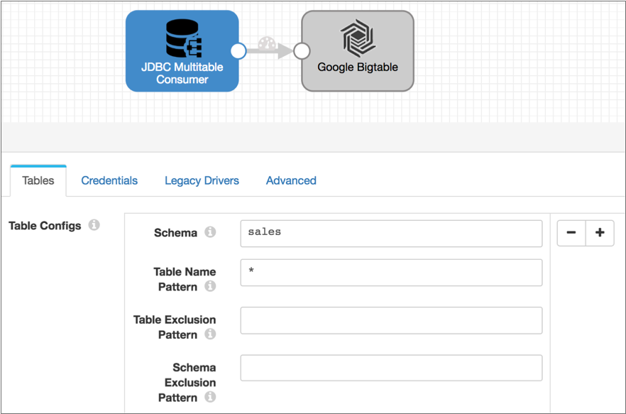
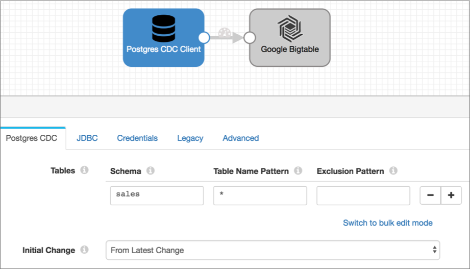

# PostgreSQL CDC客户端

[支持的管道类型：](https://streamsets.com/documentation/controlhub/latest/help/datacollector/UserGuide/Pipeline_Configuration/ProductIcons_Doc.html#concept_mjg_ly5_pgb) 资料收集器

PostgreSQL CDC客户端源处理预写日志记录（WAL）数据，以生成PostgreSQL数据库的更改数据捕获记录。使用PostgreSQL CDC客户端源处理来自PostgreSQL 9.4或更高版本的WAL数据。早期版本不支持WAL。

您可以使用此来源执行数据库复制。您可以将单独的管道与JDBC查询使用者或JDBC多表使用者起源一起使用，以读取现有数据。然后使用 PostgreSQL CDC Client的源启动管道，以处理后续更改。

PostgreSQL CDC客户端将单个事务视为单个记录。它可以生成两种类型的记录：一种用于数据更改，一种用于数据定义语言（DDL）更新。

由于每个数据更改事务都可以包含多个CRUD操作，因此PostgreSQL CDC客户端起源也可以在记录中包含多个操作。 结果，源不将CRUD操作写入sdc.operation.type记录头属性。根据您的用例，您可以使用脚本处理器根据需要转换记录。或者，您可以使用Field Pivoter和其他处理器将数据分开以为每个操作创建一条记录。

在配置PostgreSQL CDC Client时，您将配置更改捕获详细信息，例如要读取的架构和表，要使用的初始更改以及要包括的操作。

您定义要使用的复制插槽的名称，并指定是否在关闭时删除复制插槽。您还可以指定当源遇到不支持的数据类型并将记录中那些字段的数据作为未分析的字符串包括在内时的行为。当源数据库具有高精度时间戳时，可以将源配置为写入字符串值，而不是日期时间值，以保持精度。

要确定源如何连接到数据库，请指定连接信息，查询间隔，重试次数以及所需的任何自定义JDBC配置属性。您可以配置高级连接属性。

**注意：**连接到数据库的用户必须具有复制或超级用户角色。

## 数据库版本


StreamSets 已使用以下数据库版本测试了PostgreSQL CDC Client的来源：

- PostgreSQL 9.4.18
- PostgreSQL 9.6.2
- PostgreSQL 9.6.9
- PostgreSQL 10.4

连接到PostgreSQL数据库时，不需要安装JDBC驱动程序。Data Collector包括PostgreSQL所需的JDBC驱动程序。

## PostgreSQL先决条件

要使PostgreSQL CDC Client源能够读取预写日志记录（WAL）更改的数据捕获信息，必须安装wal2json逻辑解码器。在每个要监视更改的PostgreSQL实例上安装wal2json。

StreamSets [在GitHub上](https://github.com/streamsets/wal2json) 提供了[wal2json逻辑解码器](https://github.com/streamsets/wal2json)。要安装wal2json，请按照[README.md](https://github.com/streamsets/wal2json/blob/master/README.md)文件“构建和安装”部分中的[说明进行](https://github.com/streamsets/wal2json/blob/master/README.md)操作。

然后，按照[README.md](https://github.com/streamsets/wal2json/blob/master/README.md)文件的“配置”部分中的配置说明进行操作。

## 架构，表名称和排除模式

在配置PostgreSQL CDC客户端源时，可以使用要处理的变更捕获数据来指定表。要指定表，请定义模式，表名称模式和可选的排除模式。

定义架构和表名称模式时，可以使用[正则表达式](https://streamsets.com/documentation/controlhub/latest/help/datacollector/UserGuide/Apx-RegEx/RegEx-Title.html#concept_vd4_nsc_gs)定义一组表或跨多个架构的一组表。如果需要，还可以使用正则表达式定义排除模式，以从较大的集合中排除表的子集。

例如，假设您要处理销售模式中以SALES开头的所有表的变更数据捕获数据，而排除以破折号（-）和单字符后缀结尾的表。您可以使用以下配置来指定要处理的表：

- 架构：销售
- 表格名称格式：SALES *
- 排除方式：SALES。*-。

## 初始变更

初始更改是预写日志记录（WAL）数据中要开始处理的点。当您启动管道时，PostgreSQL CDC Client从指定的初始更改开始处理，并继续直到您停止管道。

请注意，PostgreSQL CDC客户端进程仅更改捕获数据。如果需要现有数据，则可以在启动PostgreSQL CDC客户端管道之前，在单独的管道中使用JDBC查询使用者或JDBC多表使用者来读取表数据。

PostgreSQL CDC Client提供了几种配置初始更改的方法：

- 从最新变化

  原点处理在启动管道之后发生的所有更改。

- 从指定的日期时间开始

  源处理在指定的日期时间及以后发生的所有更改。使用以下格式：`DD-MM-YYYY HH24:MI:SS`。

- 从指定的日志序号（LSN）

  源处理指定LSN和更高版本中发生的所有更改。当使用指定的LSN时，起点将使用与LSN关联的时间戳开始处理。如果在WAL数据中找不到LSN，则原点会继续从下一个更高的LSN中读取数据。

  通常，数据库管理员可以提供要使用的LSN。

### 例

您想要处理Sales模式中的所有现有数据，然后捕获更改的数据，并将所有数据写入Google Bigtable。为此，您创建两个管道。

要从架构中读取现有数据，请使用带有JDBC Multitable Consumer和Google Bigtable目标的管道，如下所示：



读取所有现有数据后，您将停止JDBC Multitable Consumer管道并启动以下PostgreSQL CDC Client管道。该管道被配置为接收在启动管道之后发生的更改，但是如果您想防止任何数据丢失的机会，则可以将初始更改配置为确切的日期时间或更早的LSN：



## 产生的记录

PostgreSQL CDC客户端将单个事务视为单个记录。它可以生成两种类型的记录：一种用于数据更改，一种用于数据定义语言（DDL）更新。

由于每个数据更改事务都可以包含多个CRUD操作，因此PostgreSQL CDC客户端起源也可以在记录中包含多个操作。

结果，源不将CRUD操作写入sdc.operation.type记录头属性。根据您的用例，您可以使用脚本处理器根据需要转换记录。或者，您可以使用Field Pivoter和其他处理器将数据分开以为每个操作创建一条记录。

PostgreSQL CDC客户端来源生成的每个记录都包含相同的基本字段。数据更改记录包括`change`字段中的更改数据捕获详细信息 。DDL更改的记录（例如插入新列）在该`change`字段中没有详细信息。

PostgreSQL CDC客户端原始记录包括以下字段：

| 栏位名称 | 描述                                                         |
| :------- | :----------------------------------------------------------- |
| 西德     | 交易编号。                                                   |
| 下一个   | 下一个逻辑序号（LSN）。                                      |
| 时间戳记 | 具有亚秒级粒度的时间戳，包括与UTC的时区偏移量。              |
| 更改     | 一个列表字段，其中包含有关每个数据更改的以下详细信息：种类-操作类型：插入，更新或删除。schema-模式名称。table-表名。columnnames-与更改关联的列的列表。columntypes-列的数据类型列表。columnvalues-列的新值列表。oldkeys-一个映射字段，其中包含已更改字段的先前信息。包括以下字段：keynames-列的名称列表。键类型-列的数据类型列表。keyvalues-列的值列表。DDL更改记录不包含任何更改详细信息。 |

### 更改的数据样本记录

以下是更改数据的示例记录。请注意，此单一xid如何包含六个操作：

```
{
  "xid": 598,
  "nextlsn": "0/16751E8",
  "timestamp": "2018-07-13 13:24:44.152109-07",
  "change": [
    {
      "kind": "update",
      "schema": "public",
      "table": "table1",
      "columnnames": [
        "id",
        "value"
      ],
      "columntypes": [
        "integer",
        "character(33)"
      ],
      "columnvalues": [
        1,
        "a"
      ],
      "oldkeys": {
        "keynames": [
          "value"
        ],
        "keytypes": [
          "character(33)"
        ],
        "keyvalues": [
          "a"
        ]
      }
    },
  {
      "kind": "update",
      "schema": "public",
      "table": "table1",
      "columnnames": [
        "id",
        "value"
      ],
      "columntypes": [
        "integer",
        "character(33)"
      ],
      "columnvalues": [
        2,
        "b                                "
      ],
      "oldkeys": {
        "keynames": [
          "value"
        ],
        "keytypes": [
          "character(33)"
        ],
        "keyvalues": [
          "b                                "
        ]
      }
    },
    {
      "kind": "update",
      "schema": "public",
      "table": "table1",
      "columnnames": [
        "id",
        "value"
      ],
      "columntypes": [
        "integer",
        "character(33)"
      ],
      "columnvalues": [
        3,
        "c                                "
      ],
      "oldkeys": {
        "keynames": [
          "value"
        ],
        "keytypes": [
          "character(33)"
        ],
        "keyvalues": [
          "c                                "
        ]
      }
    },
    {
      "kind": "update",
      "schema": "public",
      "table": "table2",
      "columnnames": [
        "id",
        "name"
      ],
      "columntypes": [
        "integer",
        "character varying(255)"
      ],
      "columnvalues": [
        1,
        "a"
      ],
      "oldkeys": {
        "keynames": [
          "id"
        ],
        "keytypes": [
          "integer"
        ],
        "keyvalues": [
          1
        ]
      }
    },
    {
      "kind": "update",
      "schema": "public",
      "table": "table2",
      "columnnames": [
        "id",
        "name"
      ],
      "columntypes": [
        "integer",
        "character varying(255)"
      ],
      "columnvalues": [
        2,
        "b"
      ],
      "oldkeys": {
        "keynames": [
          "id"
        ],
        "keytypes": [
          "integer"
        ],
        "keyvalues": [
          2
        ]
      }
    },
    {
      "kind": "update",
      "schema": "public",
      "table": "table2",
      "columnnames": [
        "id",
        "name"
      ],
      "columntypes": [
        "integer",
        "character varying(255)"
      ],
      "columnvalues": [
        3,
        "c"
      ],
      "oldkeys": {
        "keynames": [
          "id"
        ],
        "keytypes": [
          "integer"
        ],
        "keyvalues": [
          3
        ]
      }
    }
  ]
}
```

### DDL样本记录

以下是DDL更改的示例记录。注意，该记录在该`change` 字段中不包含任何详细信息 ：

```
{
  "xid":600,
  "nextlsn":"0/16794A8",
  "timestamp":"2018-07-17 09:56:08.115141-07",
  "change":[]
}
```

### CDC标头属性

PostgreSQL CDC客户端在以下记录头属性中包含PostgreSQL更改数据捕获信息：

| CDC标头属性            | 描述                 |
| :--------------------- | :------------------- |
| postgres.cdc.lsn       | 该记录的逻辑序列号。 |
| postgres.cdc.xid       | 交易编号。           |
| postgres.cdc.timestamp | 交易时间戳。         |

## 配置PostgreSQL CDC客户端原点

配置PostgreSQL CDC客户端源，以处理来自PostgreSQL数据库的WAL更改数据捕获数据。

使用原点之前，请完成[先决条件任务](https://streamsets.com/documentation/controlhub/latest/help/datacollector/UserGuide/Origins/PostgreSQL.html#concept_ih5_jp4_n2b)。

1. 在“属性”面板的“ **常规”**选项卡上，配置以下属性：

   | 一般财产                                                     | 描述                                                         |
   | :----------------------------------------------------------- | :----------------------------------------------------------- |
   | 名称                                                         | 艺名。                                                       |
   | 描述                                                         | 可选说明。                                                   |
   | [记录错误](https://streamsets.com/documentation/controlhub/latest/help/datacollector/UserGuide/Pipeline_Design/ErrorHandling.html#concept_atr_j4y_5r) | 该阶段的错误记录处理：放弃-放弃记录。发送到错误-将记录发送到管道以进行错误处理。停止管道-停止管道。 |

2. 在“ **PostgreSQL CDC”**选项卡上，配置以下属性：

   | PostgreSQL CDC属性                                           | 描述                                                         |
   | :----------------------------------------------------------- | :----------------------------------------------------------- |
   | [桌子](https://streamsets.com/documentation/controlhub/latest/help/datacollector/UserGuide/Origins/PostgreSQL.html#concept_wpc_sf5_n2b) | 跟踪表。根据需要指定相关属性。使用[简单或批量编辑模式](https://streamsets.com/documentation/controlhub/latest/help/datacollector/UserGuide/Pipeline_Configuration/SimpleBulkEdit.html#concept_alb_b3y_cbb)，单击 **添加**图标以定义另一个表配置。 |
   | 架构图                                                       | 使用的架构。您可以输入架构名称或使用[正则表达式](https://streamsets.com/documentation/controlhub/latest/help/datacollector/UserGuide/Apx-RegEx/RegEx-Title.html#concept_vd4_nsc_gs)指定一组架构。 |
   | 表名称模式                                                   | 表名称模式，用于指定要跟踪的表。您可以输入表名或使用[正则表达式](https://streamsets.com/documentation/controlhub/latest/help/datacollector/UserGuide/Apx-RegEx/RegEx-Title.html#concept_vd4_nsc_gs)指定一组表。 |
   | 排除方式                                                     | 可选的表排除模式，用于定义要排除的表的子集。您可以输入表名或使用[正则表达式](https://streamsets.com/documentation/controlhub/latest/help/datacollector/UserGuide/Apx-RegEx/RegEx-Title.html#concept_vd4_nsc_gs)指定要排除的表的子集。 |
   | 初始变更                                                     | 读取的起点。使用以下选项之一：来自最新更改-处理在启动管道之后到达的更改。从日期开始-处理从指定日期开始的更改。从LSN-处理更改从指定的日志序列号开始。 |
   | 开始日期                                                     | 从启动管道开始读取的日期时间。使用以下格式：`DD-MM-YYYY HH24:MI:SS`。仅适用于基于日期的初始更改。 |
   | 数据库时区                                                   | 数据库的时区。仅适用于基于日期的初始更改。                   |
   | 启动LSN                                                      | 启动管道时开始读取的日志序列号。如果找不到LSN，则原点会继续从下一个可用的较高LSN读取。仅针对基于LSN的初始更改。 |
   | 关闭时删除复制插槽                                           | 每次使用后删除复制插槽。保留复制插槽会导致该插槽继续产生WAL记录，但可能会导致性能下降。**注意：** PostgreSQL 9.5之前的版本不支持该选项。PostgreSQL的早期版本不包含必需的功能。 |
   | 复制插槽                                                     | 复制插槽的名称。仅包括小写字母和数字。默认值为 `sdc`。       |
   | 运作方式                                                     | 要包括的操作。                                               |
   | 添加不支持的字段                                             | 在记录中包括具有不受支持的数据类型的字段。启用后，原点将添加字段名称，并将数据作为未解析的字符串传递。 |
   | 将时间戳转换为字符串                                         | 使原点能够将时间戳记写为字符串值而不是日期时间值。字符串保持存储在源数据库中的精度。在将时间戳写入不存储纳秒的Data Collector日期或时间数据类型时，原点会将距时间戳的任何纳秒存储在[field属性中](https://streamsets.com/documentation/controlhub/latest/help/datacollector/UserGuide/Pipeline_Design/FieldAttributes.html#concept_xfm_wtp_1z)。 |
   | 查询超时                                                     | 等待超时WAL查询和返回批处理之前的时间。默认值为`${ 5 * MINUTES }` 300秒。 |
   | 轮询间隔                                                     | 检查更新之间的间隔。                                         |

3. 在“ **JDBC”**选项卡上，配置以下JDBC属性：

   | JDBC属性             | 描述                                                         |
   | :------------------- | :----------------------------------------------------------- |
   | JDBC连接字符串       | 用于连接数据库的连接字符串。使用以下语法：`jdbc:postgresql://:/`**注意：**如果在连接字符串中包括JDBC凭据，请使用为源创建的用户帐户。该用户必须具有超级用户或复制角色。 |
   | 最大批次大小（记录） | 一次处理的最大记录数。接受的值最高为Data Collector的最大批处理大小。默认值是1000 数据采集器默认设置为1000。 |
   | 使用凭证             | 在“凭据”选项卡上启用输入凭据。在JDBC连接字符串中不包括凭据时使用。 |
   | 其他JDBC配置属性     | 要使用的其他JDBC配置属性。要添加属性，请单击 **添加**并定义JDBC属性名称和值。使用JDBC期望的属性名称和值。 |

4. 如果在**JDBC**选项卡上将源配置为与JDBC连接字符串分开输入JDBC凭据，则在“ **凭据”** 选项卡上配置以下属性：

   | 凭证属性 | 描述                                                         |
   | :------- | :----------------------------------------------------------- |
   | 用户名   | JDBC连接的用户名。指定的用户必须具有超级用户或复制角色。     |
   | 密码     | JDBC帐户的密码。**提示：** 为了保护敏感信息，例如用户名和密码，可以使用 [运行时资源](https://streamsets.com/documentation/controlhub/latest/help/datacollector/UserGuide/Pipeline_Configuration/RuntimeValues.html#concept_bs4_5nm_2s)或凭据存储。有关凭证存储的更多信息，请参阅Data Collector文档中的[凭证存储](https://streamsets.com/documentation/datacollector/latest/help/#datacollector/UserGuide/Configuration/CredentialStores.html)。 |

5. 使用低于4.0的JDBC版本时，在“ **旧版驱动程序”**选项卡上，可以选择配置以下属性：

   | 旧版驱动程序属性     | 描述                                                         |
   | :------------------- | :----------------------------------------------------------- |
   | JDBC类驱动程序名称   | JDBC驱动程序的类名。早于版本4.0的JDBC版本必需。              |
   | 连接运行状况测试查询 | 可选查询，用于测试连接的运行状况。仅当JDBC版本低于4.0时才建议使用。 |

6. 在“ **高级”**选项卡上，可以选择配置高级选项。

   这些属性的默认值在大多数情况下都应该起作用：

   | 先进物业         | 描述                                                         |
   | :--------------- | :----------------------------------------------------------- |
   | 最大游泳池       | 创建的最大连接数。默认值为1。建议值为1。                     |
   | 最小空闲连接     | 创建和维护的最小连接数。要定义固定连接池，请设置为与“最大池大小”相同的值。默认值为1。 |
   | 连接超时         | 等待连接的最长时间。在表达式中使用时间常数来定义时间增量。默认值为30秒，定义如下：`${30 * SECONDS}` |
   | 空闲超时         | 允许连接空闲的最长时间。在表达式中使用时间常数来定义时间增量。使用0以避免删除任何空闲连接。当输入的值接近或超过连接的最大生存期时，Data Collector将忽略空闲超时。默认值为10分钟，定义如下：`${10 * MINUTES}` |
   | 最大连接寿命     | 连接的最大寿命。在表达式中使用时间常数来定义时间增量。使用0设置最大寿命。设置最大寿命时，最小有效值为30分钟。默认值为30分钟，定义如下：`${30 * MINUTES}` |
   | 强制执行只读连接 | 创建只读连接以避免任何类型的写入。默认启用。不建议禁用此属性。 |
   | 交易隔离         | 用于连接数据库的事务隔离级别。默认是为数据库设置的默认事务隔离级别。您可以通过将级别设置为以下任意值来覆盖数据库默认值：阅读已提交阅读未提交可重复读可序列化 |
   | 初始化查询       | 在阶段连接到数据库后立即执行的SQL查询。用于根据需要设置数据库会话。 |