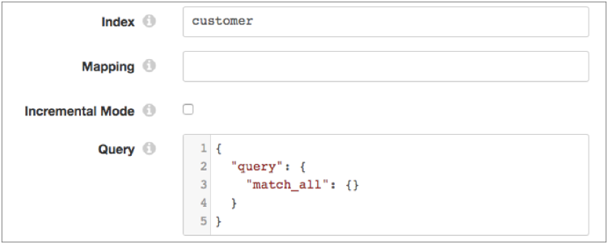

# ElasticSearch

[支持的管道类型：](https://streamsets.com/documentation/controlhub/latest/help/datacollector/UserGuide/Pipeline_Configuration/ProductIcons_Doc.html#concept_mjg_ly5_pgb) 资料收集器

Elasticsearch源是一个多线程源，可从Elasticsearch集群读取数据，包括Elastic Cloud集群（以前称为Found集群）和Amazon Elasticsearch Service集群。原点为每个Elasticsearch文档生成一条记录。

在配置Elasticsearch源时，将配置用于连接到Elasticsearch集群的HTTP URI，并指定是否在集群上启用了安全性。您将原点配置为以批处理或增量模式运行。

原点使用Elasticsearch滚动API来运行您定义的查询。查询可以从Elasticsearch检索大量文档。这使原点可以运行单个查询，然后从滚动条中读取多批数据，直到没有结果为止。您配置滚动超时，该超时定义了搜索上下文保持有效的时间。

当管道停止时，Elasticsearch原点记录它停止读取的位置。当管道再次启动时，原点将从其停止的地方继续进行处理-只要未超过滚动超时，或者原点未配置为在管道停止时删除滚动。您可以重置原点以处理所有请求的文档。

配置Elasticsearch原点时，您可以指定将滚动条分割成的最大切片数。切片的数量决定了原始设备用于读取数据的线程数。

## 安全

为Elasticsearch集群启用安全性后，您必须指定身份验证方法：

- 基本的

  对Amazon Elasticsearch Service外部的Elasticsearch集群使用基本身份验证。使用基本身份验证，源将通过Elasticsearch用户名和密码。

- AWS签名V4

  对Amazon Elasticsearch Service中的Elasticsearch集群使用AWS Signature V4身份验证。源必须使用Amazon Web Services凭据签署HTTP请求。 有关详细信息，请参阅 [Amazon Elasticsearch Service文档](https://docs.aws.amazon.com/elasticsearch-service/latest/developerguide/es-request-signing.html)。使用以下方法之一来使用AWS凭证进行签名：IAM角色当执行数据收集器 在Amazon EC2实例上运行时，您可以使用AWS管理控制台为EC2实例配置IAM角色。Data Collector使用IAM实例配置文件凭证自动连接到AWS。要使用IAM角色，请不要配置“访问密钥ID”和“秘密访问密钥”属性。有关将IAM角色分配给EC2实例的更多信息，请参阅Amazon EC2文档。AWS访问密钥对当执行数据收集器未在Amazon EC2实例上运行或EC2实例不具有IAM角色时，您必须配置**访问密钥ID**和**秘密访问密钥** 属性。**提示：**为了保护敏感信息（例如访问密钥对）的安全，可以使用[运行时资源](https://streamsets.com/documentation/controlhub/latest/help/datacollector/UserGuide/Pipeline_Configuration/RuntimeValues.html#concept_bs4_5nm_2s)或凭据存储。有关凭证存储的更多信息，请参阅Data Collector文档中的[凭证存储](https://streamsets.com/documentation/datacollector/latest/help/#datacollector/UserGuide/Configuration/CredentialStores.html)。

**提示：**为了保护敏感信息，例如用户名和密码或访问密钥对，可以使用[运行时资源](https://streamsets.com/documentation/controlhub/latest/help/datacollector/UserGuide/Pipeline_Configuration/RuntimeValues.html#concept_bs4_5nm_2s)或凭据存储。有关凭证存储的更多信息，请参阅Data Collector文档中的[凭证存储](https://streamsets.com/documentation/datacollector/latest/help/#datacollector/UserGuide/Configuration/CredentialStores.html)。

## 批处理和增量模式

Elasticsearch源可以按以下方式读取数据：

- 批处理模式

  在批处理模式下，原始服务器读取从Elasticsearch查询返回的所有数据，然后管道停止。默认情况下，原点以批处理模式读取。

- 增量模式

  在增量模式下，原始服务器将对从Elasticsearch查询返回的所有数据执行初始读取，然后原始服务器会定期再次运行查询以检查新数据。在增量模式下，管道连续运行，因此可以定期重复查询。

  要使用增量模式，请定义起点在两次查询之间等待的时间，并配置偏移量字段和初始偏移量值。

  原点使用偏移字段和初始偏移值来确定从何处开始读取数据。默认情况下，偏移量字段定义为名为 时间戳记。您可以将任何Elasticsearch字段定义为offset字段，尽管您很可能希望使用date字段。初始偏移值是您希望Elasticsearch原点开始读取的偏移字段中的值。

  在Elasticsearch查询中同时包含offset字段和offset值。

  初始读取后，原点将保存最后的读取偏移值。当原点运行下一个增量查询时，原点将使用最后一个读取的偏移值从其停止处继续进行处理。

## 询问

定义原点用来从Elasticsearch返回数据的查询。您可以定义任何有效的Elasticsearch查询。

默认查询对批处理模式有效，并返回Elasticsearch集群中的所有文档：

```
{
  "query": {
    "match_all": {}
  }
}
```

您可以选择指定Elasticsearch索引或映射类型，以批处理或增量模式定义查询范围。

例如，假设您指定`customer`索引，不指定映射类型，将源配置为使用批处理模式，然后使用默认查询。查询属性的配置如下：



当您运行管道时，查询将返回`customer`索引中的所有文档 。

### 增量模式查询

如果将原点配置为使用增量模式，则必须在Elasticsearch查询中同时包含offset字段和offset值。使用`${OFFSET}`来表示偏移值。

例如，假设您没有定义索引或映射类型，将原点配置为使用增量模式，然后将该`timestamp`字段配置为offset字段。您可以使用Elasticsearch日期数学表达式 `now-1d/d`将初始偏移值设置为当前时间前一天。您在查询中包括偏移量字段和偏移量值，以确定从何处开始读取数据。查询属性的配置如下：


运行管道时，查询将返回所有带有timestamp字段且值大于当前时间一天的文档。该查询按时间戳对结果进行排序。

## 滚动超时

Elasticsearch查询可以从单个搜索请求中检索大量文档。这允许Elasticsearch源运行单个查询，然后从滚动中读取多批数据，直到没有结果为止。Elasticsearch滚动功能类似于传统数据库中的光标。

要使用滚动API运行Elasticsearch查询，您必须设置滚动超时。滚动超时告诉Elasticsearch应该保持搜索上下文存活多长时间。滚动超时必须足够长才能完全读取单个批处理。当原点从结果中读取另一批次时，将重置滚动超时。

如果超过滚动超时值，Elasticsearch将清除滚动和最后保存的偏移量，并且原点必须再次运行查询。在批处理模式下，源读取从查询返回的所有数据。在增量模式下，原点开始从为原点配置的初始偏移量读取。

使用[Elasticsearch持续时间单位](https://www.elastic.co/guide/en/elasticsearch/reference/5.2/common-options.html#time-units)输入滚动超时。例如，输入`1m`以设置一分钟超时，或输入 `1h`以设置一小时超时。

（可选）您可以配置原点以在管道停止时删除滚动。配置后，Data Collector 在管道停止后立即清除滚动，而不是等待滚动超时值被超过。保持滚动窗口打开会消耗Elasticsearch资源。要释放这些资源，请配置原点以在不再使用滚动条时清除滚动条。

清除滚动条也将清除最后保存的偏移，因此本质上类似于重置原点。当管道继续时，原点将处理所有可用数据，而不是处理最后保存的偏移量中的数据。

## 多线程处理

Elasticsearch源执行并行处理，并允许创建多线程管道。

Elasticsearch起点基于“切片数”属性使用多个并发线程。每个线程都连接到原始系统，创建一批数据，并将该批数据传递给可用的管道运行器。

管道运行器是无源管道实例 - 管道的实例，包括管道中的所有处理器，执行程序和目的地，并在源之后处理所有管道处理。 每个管道运行程序一次处理一个批处理，就像在单个线程上运行的管道一样。当数据流减慢时，管道运行器会闲置等待，直到需要它们为止，并定期生成一个空批。您可以配置“运行者空闲时间”管道属性来指定间隔或选择退出空批次生成。

多线程管道保留每个批处理中的记录顺序，就像单线程管道一样。但是由于批处理 是由不同的流水线处理程序处理的，因此无法确保将批处理写入目的地的顺序。

例如，原点运行一个Elasticsearch查询，该查询返回大量文档。为了减少处理时间，您想将滚动条分成多个切片，并并行处理每个切片。将“切片数”属性设置为5。启动管道时，原点将滚动条分成五个切片，然后原点创建5个线程，数据收集器 创建匹配数目的管道运行器。 接收到数据后，原点将批处理传递给每个管道运行器进行处理。

在任何给定的时刻，五个流水线运行者可以分别处理一个批处理，因此该多线程管道一次最多可以处理五个批处理。当传入数据变慢时，管道运行器将处于空闲状态，并在数据流增加时立即可用。

有关多线程管道的更多信息，请参见《[多线程管道概述》](https://streamsets.com/documentation/controlhub/latest/help/datacollector/UserGuide/Multithreaded_Pipelines/MultithreadedPipelines.html#concept_zpp_2xc_py)。

## 配置Elasticsearch来源

配置Elasticsearch源以从Elasticsearch集群读取数据。

1. 在“属性”面板的“ **常规”**选项卡上，配置以下属性：

   | 一般财产                                                     | 描述                                                         |
   | :----------------------------------------------------------- | :----------------------------------------------------------- |
   | 名称                                                         | 艺名。                                                       |
   | 描述                                                         | 可选说明。                                                   |
   | [记录错误](https://streamsets.com/documentation/controlhub/latest/help/datacollector/UserGuide/Pipeline_Design/ErrorHandling.html#concept_atr_j4y_5r) | 该阶段的错误记录处理：放弃-放弃记录。发送到错误-将记录发送到管道以进行错误处理。停止管道-停止管道。 |

2. 在**Elasticsearch**选项卡上，配置以下属性：

   | Elasticsearch属性                                            | 描述                                                         |
   | :----------------------------------------------------------- | :----------------------------------------------------------- |
   | 群集HTTP URI                                                 | 用于连接到集群的HTTP URI。使用以下格式：`:`                  |
   | 其他HTTP参数                                                 | 您想要作为查询字符串参数发送到Elasticsearch的其他HTTP参数。输入Elasticsearch期望的确切参数名称和值。 |
   | 检测群集中的其他节点                                         | 根据配置的集群URI检测集群中的其他节点。选择此属性等效于将client.transport.sniff Elasticsearch属性设置为true。仅在数据收集器与Elasticsearch群集共享同一网络时使用。请勿用于弹性云或Docker群集。 |
   | 使用安全                                                     | 指定是否在Elasticsearch集群上启用安全性。                    |
   | 指数                                                         | 可选索引，用于定义查询范围。输入索引名称或计算结果为该索引名称的表达式。例如，如果输入 `customer`作为索引，查询将返回`customer` 索引中的文档。 |
   | 制图                                                         | 可选的映射类型，用于定义查询范围。输入映射类型或计算结果为该映射类型的表达式。例如，如果输入 `user`作为映射类型，则查询将返回该`user` 映射类型内的文档。 |
   | 增量模式 [](https://streamsets.com/documentation/controlhub/latest/help/datacollector/UserGuide/Origins/Elasticsearch.html#concept_tbz_ywl_3z) | 定义原点如何查询Elasticsearch。选择以执行增量查询。清除以执行批查询。默认为批处理模式。 |
   | 查询间隔                                                     | 源在两次增量查询之间等待的时间。输入基于时间单位的表达式。您可以使用SECONDS，MINUTES或HOURS。在增量模式下必需。默认值为1小时：$ {1 * HOURS}。 |
   | 偏移场                                                       | 用于初始偏移值的字段。在增量模式下必需。                     |
   | 初始偏移                                                     | 管道启动时使用的偏移值。输入常数，Elasticsearch日期数学表达式或数据收集器表达式。在增量模式下必需。 |
   | 询问[](https://streamsets.com/documentation/controlhub/latest/help/datacollector/UserGuide/Origins/Elasticsearch.html#concept_zzw_3pm_3z) | 查询以从Elasticsearch读取。您可以定义任何有效的Elasticsearch查询。 |
   | 滚动超时[](https://streamsets.com/documentation/controlhub/latest/help/datacollector/UserGuide/Origins/Elasticsearch.html#concept_jhw_ttm_3z) | 使搜索上下文保持活动状态的最长时间。使用Elasticsearch持续时间单位输入超时。例如，输入`1m`以设置一分钟超时。 |
   | 删除管道停止滚动[](https://streamsets.com/documentation/controlhub/latest/help/datacollector/UserGuide/Origins/Elasticsearch.html#concept_jhw_ttm_3z) | 管道停止时删除滚动条。                                       |
   | 最大批量                                                     | 批处理中包含的最大记录数。接受的值最高为Data Collector的最大批处理大小。默认值是1000 数据采集器默认设置为1000。 |
   | 片数[](https://streamsets.com/documentation/controlhub/latest/help/datacollector/UserGuide/Origins/Elasticsearch.html#concept_ifs_wtm_3z) | 将Elasticsearch滚动分割成的切片数。此属性确定源生成并用于多线程处理的线程数。 |

3. 如果启用了安全性，请在“ **安全性”**选项卡上配置以下属性：

   | 担保财产                                                     | 描述                                                         |
   | :----------------------------------------------------------- | :----------------------------------------------------------- |
   | [模式](https://streamsets.com/documentation/controlhub/latest/help/datacollector/UserGuide/Origins/Elasticsearch.html#concept_cxd_l1z_xfb) | 使用的身份验证方法：基本-使用Elasticsearch用户名和密码进行身份验证。为Amazon Elasticsearch Service之外的Elasticsearch集群选择此选项。AWS Signature V4-向AWS进行身份验证。为Amazon Elasticsearch Service中的Elasticsearch集群选择此选项。 |
   | 安全用户名/密码                                              | Elasticsearch用户名和密码。使用以下语法输入用户名和密码：`:`使用基本身份验证时可用。 |
   | 区域                                                         | 托管Elasticsearch域的Amazon Web Services区域。使用AWS Signature V4身份验证时可用。 |
   | [访问密钥ID](https://streamsets.com/documentation/controlhub/latest/help/datacollector/UserGuide/Origins/Elasticsearch.html#concept_cxd_l1z_xfb__ph-dt-AWS-Signature-V4) | AWS访问密钥ID。不将IAM角色与IAM实例配置文件凭据一起使用时是必需的。使用AWS Signature V4身份验证时可用。 |
   | [秘密访问密钥](https://streamsets.com/documentation/controlhub/latest/help/datacollector/UserGuide/Origins/Elasticsearch.html#concept_cxd_l1z_xfb__ph-dt-AWS-Signature-V4) | AWS秘密访问密钥。不将IAM角色与IAM实例配置文件凭据一起使用时是必需的。使用AWS Signature V4身份验证时可用。 |
   | SSL信任库路径                                                | 信任库文件的位置。配置此属性等效于配置shield.ssl.truststore.path Elasticsearch属性。对于弹性云集群而言不是必需的。 |
   | SSL信任库密码                                                | 信任库文件的密码。配置此属性等效于配置shield.ssl.truststore.password Elasticsearch属性。对于弹性云集群而言不是必需的。 |