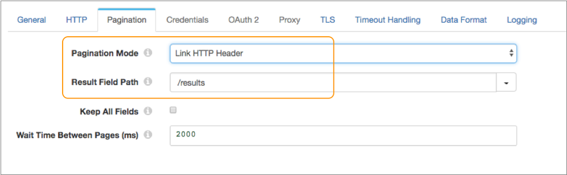
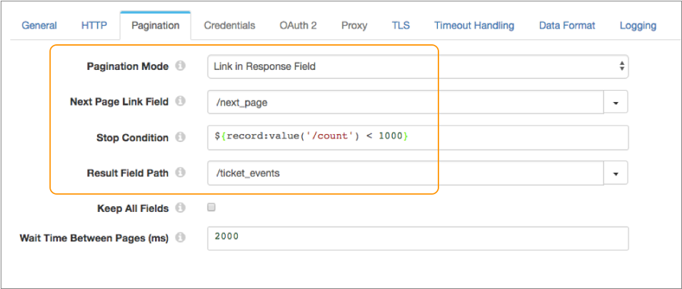
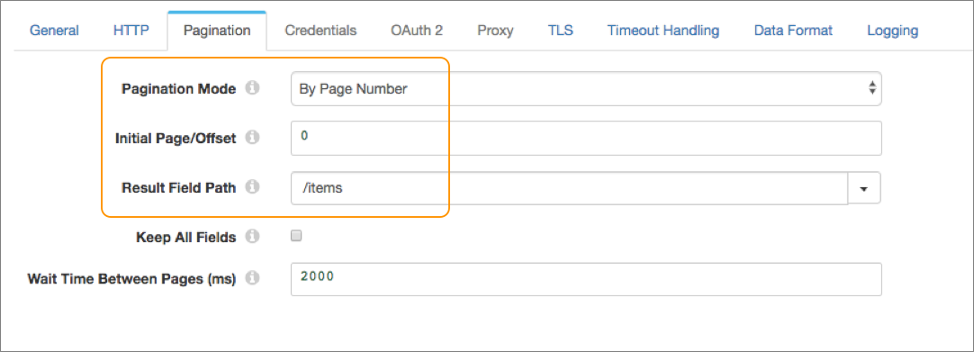
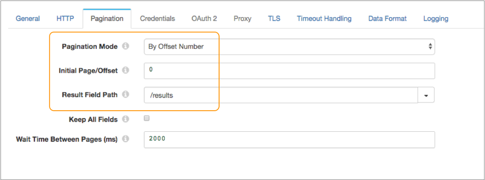
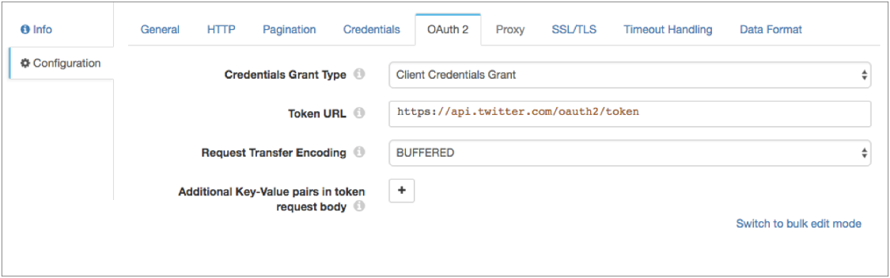
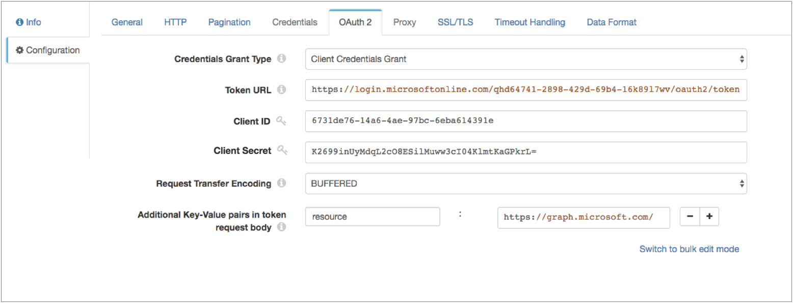
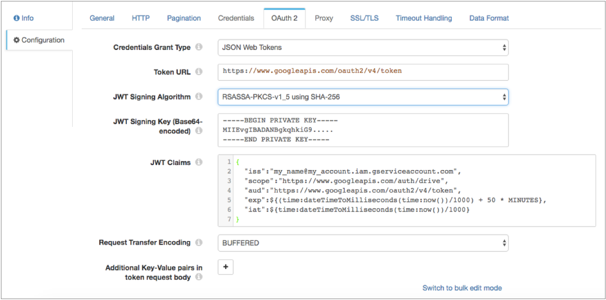

# HTTP客户端

[支持的管道类型：](https://streamsets.com/documentation/controlhub/latest/help/datacollector/UserGuide/Pipeline_Configuration/ProductIcons_Doc.html#concept_mjg_ly5_pgb) 资料收集器 数据收集器边缘

HTTP客户端源从HTTP资源URL读取数据。

配置HTTP客户端时，您可以指定资源URL，可选标头和使用方法。对于某些方法，您可以指定请求正文和默认内容类型。

您可以根据响应状态配置要执行的操作，并配置分页属性以启用处理来自分页API的大量数据。您还可以启用源来读取压缩和存档的文件。

源提供响应头字段作为记录头属性，因此您可以在需要时使用管道中的信息。

源还提供了几种不同的身份验证类型来访问数据。您可以在源中输入凭据，也可以在运行时资源文件中保护凭据并在源中引用文件。您还可以将源配置为使用OAuth 2协议连接到HTTP服务。

您可以选择使用HTTP代理并配置SSL / TLS属性。您还可以配置源来记录请求和响应信息。

**提示：** Data Collector提供了几种HTTP来源来满足不同的需求。有关快速比较表以帮助您选择合适的表，请参阅[比较HTTP起源](https://streamsets.com/documentation/controlhub/latest/help/datacollector/UserGuide/Origins/Origins_overview.html#concept_rsz_cnw_qy)。

当管道停止时，HTTP Client记录停止读取的位置。当管道再次启动时，HTTP客户端默认从其停止处继续进行处理。您可以重置原点以处理所有请求的文件。

## 处理方式

HTTP客户端可以使用以下处理模式之一来读取源数据：

- 流媒体

  HTTP客户端维护连接并在可用时处理数据。用于实时处理流数据。

- 轮询

  HTTP客户端以指定的时间间隔轮询服务器以获取可用数据。用于定期访问数据，例如REST端点上的指标和事件。

  **注意：**经过轮询间隔后，原点将从其停止处继续进行处理。例如，假设您已将原点配置为以两个小时的间隔使用轮询模式并使用页码分页。原点读取25页结果后，第26页不返回任何结果，因此原点停止读取。在两个小时的间隔过去之后，起源将再次轮询服务器，并从第26页开始读取结果。

- 批量

  HTTP客户端处理所有可用数据，然后停止管道。用于根据需要处理数据。

  在Data Collector Edge管道中无效。不要在Data Collector Edge 管道中使用批处理模式。

## 分页

HTTP客户端来源可以使用分页从分页的API检索大量数据。

在Data Collector Edge管道中无效。在Data Collector Edge管道中，HTTP客户端源忽略分页属性。

将HTTP客户端来源配置为使用分页时，可以使用HTTP客户端的API支持的分页类型。您可能需要参考原始系统API的文档，以确定要使用的分页类型和要设置的属性。

HTTP客户端来源支持以下常见的分页类型：

- HTTP标头中的链接

  处理完当前页面后，使用HTTP标头中的链接访问下一页。标头中的链接可以是绝对URL或相对于为原点配置的资源URL的URL。例如，假设您为来源配置以下资源URL：`https://myapp.com/api/objects?page=1`

  HTTP标头中的下一个链接可以包含一个绝对URL，如下所示：`link:; rel="next"`

  或者下一个链接可以包括相对于资源URL的URL，如下所示：`link:; rel="next"`

- 在响应字段中链接

  处理完当前页面后，使用响应正文中字段中的链接访问下一页。响应字段中的链接可以是绝对URL或相对于为原点配置的资源URL的URL。例如，假设您为来源配置以下资源URL：`http://myapp.com/api/tickets.json?start_time=138301982`

  响应字段中的下一个链接可以包括一个绝对URL，如下所示：`"next_page":"http://myapp.com/api/tickets.json?start_time=1389078385",
`

  或者下一个链接可以包括相对于资源URL的URL，如下所示：`"next_page":"tickets.json?start_time=1389078385",
`

- 按页码

  从指定的初始页面开始处理，然后请求下一页。`${startAt}`将资源URL中的变量用作要请求的[页码](https://streamsets.com/documentation/controlhub/latest/help/datacollector/UserGuide/Origins/HTTPClient.html#concept_gn4_klq_xdb)的值。

- 按偏移量

  从指定的初始偏移开始处理，然后请求以下偏移。`${startAt}`将资源URL中的变量用作要请求的[偏移号](https://streamsets.com/documentation/controlhub/latest/help/datacollector/UserGuide/Origins/HTTPClient.html#concept_gn4_klq_xdb)的值。

对于响应字段分页类型中的链接，必须定义一个停止条件，该条件确定何时没有更多要处理的页面。对于所有其他分页类型，原点返回不包含任何更多记录的页面时将停止读取。

使用任何分页类型时，必须指定[结果字段路径，](https://streamsets.com/documentation/controlhub/latest/help/datacollector/UserGuide/Origins/HTTPClient.html#concept_d3b_vn2_bx) 并且可以选择是否[在记录中](https://streamsets.com/documentation/controlhub/latest/help/datacollector/UserGuide/Origins/HTTPClient.html#concept_hdf_bgc_4z)包括[所有其他字段](https://streamsets.com/documentation/controlhub/latest/help/datacollector/UserGuide/Origins/HTTPClient.html#concept_hdf_bgc_4z)。

### 页数或胶版数

使用页码或偏移号分页时，HTTP客户端的API通常要求您在资源URL的末尾包含一个page或offset参数。该参数确定要请求的数据的下一页或偏移量。

API使用的参数名称各不相同。例如，它可能是“偏移”，“页面”，“开始”或“自此”。请查阅原始系统API的文档，以确定页面名称或offset参数。

HTTP客户端来源提供了一个`${startAt}`变量，您可以在URL中使用该变量作为页面或偏移量的值。例如，您的资源URL可以是以下任意一个：

- `http://webservice/object?limit=15&offset=${startAt}`
- `https://myapp.com/product?limit=5&since=${startAt}`
- `https://myotherapp.com/api/v1/products?page=${startAt}`

管道启动时，原点会将“ **初始页/偏移”**属性的`${startAt}`值用作变量值。在按原点读取结果的页面之后，`${startAt}`如果使用页码分页，则原点会将变量加1，如果使用偏移号分页，则原点会将 变量从页面读取的记录数增加。

例如，假设您配置了偏移量分页，将初始偏移量设置为0，并使用以下资源URL：

```
https://myapp.com/product?limit=5&since=${startAt}
```

启动管道时，源将资源URL解析为：

```
https://myapp.com/product?limit=5&since=0
```

结果的第一页包括项目0到4。在原点从第一页读取所有5条记录之后，原点将`${startAt}` 变量加5，从而将下一个资源URL解析为：

```
https://myapp.com/product?limit=5&since=5
```

结果的第二页还包括从第5个项目开始的5个项目。

### 结果字段路径

使用任何分页类型时，必须指定结果字段路径。结果字段路径是响应中包含您要处理的数据的位置。

结果字段路径必须是列表或数组。原点为数组中的每个对象创建一条记录。

例如，要处理以下响应，您将/ results用于结果字段路径：

```
{  
   "count":"1023",
   "startAt":"2",
   "maxResults":"2",
   "total":"6",
   "results":[  
      {  
         "firstName":"Joe",
         "lastName":"Smith",
         "phone":"555-555-5555"
      },
      {  
         "firstName":"Jimmy",
         "lastName":"Smott",
         "phone":"333-333-3333"
      },
      {  
         "firstName":"Joanne",
         "lastName":"Smythe",
         "phone":"777-777-7777"
      }
   ]
}
```

根据此数据，原点创建三个记录。第一条记录：

```
{  
   "firstName":"Joe",
   "lastName":"Smith",
   "phone":"555-555-5555"
}
```

第二条记录：

```
{  
   "firstName":"Jimmy",
   "lastName":"Smott",
   "phone":"333-333-3333"
}
```

第三条记录：

```
{  
   "firstName":"Joanne",
   "lastName":"Smythe",
   "phone":"777-777-7777"
}
```

### 保留所有字段

使用任何分页类型时，您可以配置源以保留除指定结果字段路径中的字段以外的所有其他字段。结果记录包括原始结构中的所有字段以及包括一组数据的结果字段路径。

默认情况下，原点仅返回指定结果字段路径内的数据。

例如，假设我们使用与上面相同的样本数据，结果字段路径带有/ results。并且我们将原点配置为保留所有字段。源生成三个保留现有记录结构的记录，并在/ results字段中包含一组数据。

这是第一条记录：

```
{  
   "count":"1023",
   "startAt":"2",
   "maxResults":"2",
   "total":"6",
   "results":{  
      "firstName":"Joe",
      "lastName":"Smith",
      "phone":"555-555-5555"
   }
}
```

第二条记录：

```
{  
   "count":"1023",
   "startAt":"2",
   "maxResults":"2",
   "total":"6",
   "results":{  
      "firstName":"Jimmy",
      "lastName":"Smott",
      "phone":"333-333-3333"
   }
}
```

第三条记录：

```
{  
   "count":"1023",
   "startAt":"2",
   "maxResults":"2",
   "total":"6",
   "results":{  
      "firstName":"Joanne",
      "lastName":"Smythe",
      "phone":"777-777-7777"
   }
}
```

### 分页示例

让我们看一些如何配置支持的分页类型的示例。

#### HTTP标头中的链接示例

HTTP客户端的API包含用于访问HTTP标头中下一页的链接。例如，HTTP标头可能是：

```
link:<https://myapp.com/api/objects?page=2>; rel="next", 
<https://myapp.com/api/objects?page=9>; rel="last"
```

因此，在原始读取结果的第一页之后，它可以使用HTTP标头中的下一个链接来读取下一页。

API要求您在URL中包括一个page参数，以指定要从结果中返回的初始页码。在来源的“ **HTTP”**选项卡上，为来源配置以下资源URL，以使来源从第一页开始读取：

```
https://myapp.com/api/objects?page=1
```

您希望收到如下响应：

```
{  
   "total":"2000",
   "limit":"10",
   "results":[  
      {  
         "firstName":"Joe",
         "lastName":"Smith"
      },
      ...
      {  
         "firstName":"Joanne",
         "lastName":"Smythe"
      }
   ]
}
```

在源的“ **分页”**选项卡上，只需将“ **分页模式”**设置 为链接到HTTP标头中，然后将结果字段路径设置为该`/results`字段：



#### 响应字段中的链接示例

HTTP客户端的API使用响应正文中的字段来访问下一页。它要求您在资源URL中包含一个时间戳，指示您要开始阅读哪些项目。

在来源的“ **HTTP”**选项卡上，为来源配置以下资源URL：

```
http://myapp.com/api/tickets.json?start_time=138301982
```

您希望收到如下响应：

```
{
  "ticket_events":[
    {
       "ticket_id":27,

       "timestamp":138561439,

       "via":"Email"
     },
     ...
     {
       "ticket_id":30,

       "timestamp":138561445,

       "via":"Phone"
      }
  ]
  "next_page":"http://myapp.com/api/tickets.json?start_time=1389078385",

  "count":1000,

  "end_time":1389078385

}
```

在原点的“ **分页”**选项卡上，将“ **分页模式”**设置为“在响应中链接”字段，然后将“下一页”链接字段设置为该 `/next_page`字段。

响应中的count字段确定每页显示的项目数。如果页面返回的项目少于指定的数量，则它是数据的最后一页。因此，当计数小于1000时，您输入以下停止条件以停止处理：

```
${record:value('/count') < 1000}
```

然后将结果字段路径设置为该`/ticket_events`字段：



#### 页码示例

HTTP客户端的API使用页码分页。它要求您在URL中包括一个page参数，该参数指定要从结果中返回的页码。

在原始**服务器的“ HTTP”**选项卡上，为原始服务器配置以下资源URL，并将page参数设置为 `${startAt}` 变量：

```
https://myotherapp.com/api/v1/products?page=${startAt}
```

您希望收到如下响应：

```
{  
   "total":"2000",
   "items":[  
      {  
         "item":"pencil",
         "cost":"2.00"
      },
      ...
      {  
         "item":"eraser",
         "cost":"1.10"
      }
   ]
}
```

在原点的**分页**选项卡上，将**分页模式**设置为按页码。您要从结果的第一页开始处理，因此将初始页设置为0。然后将结果字段路径设置为该`/items`字段：



#### 偏移号示例

HTTP客户端的API使用偏移号分页。它要求您在资源URL中包括以下参数：

- limit-指定每页的结果数。
- offset-指定偏移值。

在来源的**HTTP**选项卡上，为来源配置以下资源URL，将限制设置为每页10个结果，并将偏移量设置为`${startAt}` 变量：

```
https://myapp.com/product?limit=10&offset=${startAt}
```

您希望收到如下响应，结果列表中有10项：

```
{  
   "total":"2000",
   "limit":"10",
   "results":[  
      {  
         "firstName":"Joe",
         "lastName":"Smith"
      },
      ...
      {  
         "firstName":"Joanne",
         "lastName":"Smythe"
      }
   ]
}
```

在原点的**分页**选项卡上，将**分页模式**设置为按偏移号。您要从结果的第一项开始处理，因此将初始偏移量设置为0。然后将结果字段路径设置为该`/results`字段：



## HTTP方法

要从HTTP资源URL请求数据，请指定要使用的请求方法。大多数服务器都需要GET请求，但是您应该验证要访问的服务器所要求的请求。

您可以使用以下方法：

- 得到
- 放
- 开机自检
- 删除
- 头

## OAuth 2授权

HTTP客户端来源可以使用OAuth 2协议连接到HTTP服务。

在Data Collector Edge管道中无效。在Data Collector Edge管道中，HTTP客户端来源将忽略OAuth 2属性。

源可以使用OAuth 2协议连接到使用基本身份验证，摘要身份验证或通用身份验证，OAuth 2客户端凭据，OAuth 2用户名和密码或OAuth 2 JSON Web令牌（JWT）的HTTP服务。

OAuth 2协议授权第三方访问HTTP服务资源而无需共享凭据。HTTP客户端来源使用凭据从服务请求访问令牌。该服务将令牌返回给源，然后源将令牌包括在对资源URL的每个请求的标头中。

您输入的用于请求访问令牌的凭据取决于HTTP服务所需的凭据授予类型。您可以为HTTP客户端定义以下OAuth 2凭据授予类型：

- 客户凭证授予

  HTTP客户端将其自己的凭据（客户端ID和客户端机密或基本，摘要或通用身份验证凭据）发送到HTTP服务。例如，使用客户端凭据授予来处理来自Twitter API或Microsoft Azure Active Directory（Azure AD）API的数据。有关客户端凭据授予的更多信息，请参阅 https://tools.ietf.org/html/rfc6749#section-4.4。

- 资源所有者密码凭据授予

  HTTP客户端将资源所有者的凭据（资源所有者的用户名和密码）发送到HTTP服务。或者，您可以通过将存储的凭据转换为访问令牌，使用此授权类型将使用基本身份验证，摘要身份验证或通用身份验证的现有客户端迁移到OAuth 2。例如，使用此授权来处理来自Getty Images API的数据。有关使用OAuth 2连接到Getty Images API的更多信息，请参见[http://developers.gettyimages.com/api/docs/v3/oauth2.html](https://developers.gettyimages.com/api/oauth2.html)。有关资源所有者密码凭据授予的更多信息，请参见https://tools.ietf.org/html/rfc6749#section-4.3。

- JSON Web令牌（JWT）

  HTTP客户端将基于JSON的安全令牌编码发送到HTTP服务。例如，使用JSON Web令牌来处理Google API中的数据。

让我们看一下如何配置身份验证和OAuth 2授权以处理来自Twitter，Microsoft Azure AD和Google API的数据的一些示例。

### Twitter示例

要使用OAuth 2授权从Twitter读取信息，请将HTTP客户端配置为使用基本身份验证和客户端凭据授予。

有关为Twitter配置OAuth 2授权的更多信息，请参阅https://dev.twitter.com/oauth/application-only。

1. 在**HTTP**选项卡上，将**身份验证类型**设置为**基本**，然后选择 **使用OAuth 2**。

2. 更改**资源URL**属性的默认值，以定义适用于OAuth 2授权的Twitter URL。

   使用OAuth2授权时，默认网址无效。

   例如，您可以定义以下与OAuth 2授权一起使用的URL： `https://api.twitter.com/1.1/search/tweets.json?q=%23DataOps`

3. 在“ **凭据”**选项卡上，为“ **用户名”**和“ **密码”**属性输入Twitter消费者API密钥和消费者API秘密密钥。

   **提示：**为了保护敏感信息（例如使用者API密钥），可以使用[运行时资源](https://streamsets.com/documentation/controlhub/latest/help/datacollector/UserGuide/Pipeline_Configuration/RuntimeValues.html#concept_bs4_5nm_2s)或凭证存储。有关凭证存储的更多信息，请参阅Data Collector文档中的[凭证存储](https://streamsets.com/documentation/datacollector/latest/help/#datacollector/UserGuide/Configuration/CredentialStores.html)。

4. 在**OAuth 2**标签上，为授予类型选择“ **客户端凭据授予** ”。

5. 在“ **令牌URL”**属性中，输入以下用于请求访问令牌的URL：

   ```
   https://api.twitter.com/oauth2/token
   ```

下图显示了为Twitter配置的**OAuth 2**标签：



### Microsoft Azure AD示例

若要使用OAuth 2授权从Microsoft Azure AD中读取，请将HTTP客户端配置为不使用身份验证，并且将客户端凭据授予。

**注意：**本示例使用Microsoft Azure AD版本1.0。

有关为Microsoft Azure AD配置OAuth 2授权的详细信息，请参阅[https://docs.microsoft.com/zh-cn/azure/active-directory/develop/active-directory-protocols-oauth-code](https://docs.microsoft.com/en-us/azure/active-directory/develop/active-directory-protocols-oauth-code)。

1. 在“ **HTTP”**选项卡上，将“ **身份验证类型”**设置为“ **无”**，然后选择“ **使用OAuth 2”**。

2. 在**OAuth 2**标签上，为授予类型选择“ **客户端凭据授予** ”。

3. 在“ **令牌URL”**属性中，输入以下用于请求访问令牌的URL：

   ```
   https://login.microsoftonline.com/<tenant identifier>/oauth2/token
   ```

   ``Azure AD租户标识符在哪里。

4. 输入OAuth 2客户端ID和密码。

   客户端ID是在Azure经典门户中找到的向Azure AD注册应用程序时分配给您的应用程序的应用程序ID。

   客户端密钥是您在应用程序注册门户中为应用程序创建的应用程序密钥。

   **提示：**为了保护敏感信息，例如客户端ID和机密，可以使用[运行时资源](https://streamsets.com/documentation/controlhub/latest/help/datacollector/UserGuide/Pipeline_Configuration/RuntimeValues.html#concept_bs4_5nm_2s)或凭据存储。有关凭证存储的更多信息，请参阅Data Collector文档中的[凭证存储](https://streamsets.com/documentation/datacollector/latest/help/#datacollector/UserGuide/Configuration/CredentialStores.html)。

5. 在令牌请求中添加HTTP服务所需的所有键值对。

   在我们的示例中，我们正在`graph.microsoft.com`资源URL 中访问API，因此我们需要添加以下键/值对：

   ```
   resource : https://graph.microsoft.com/
   ```

下图显示了为Microsoft Azure AD版本1.0配置的**OAuth 2**选项卡：



### Google示例

要使用OAuth 2授权来读取Google服务帐户，请将HTTP客户端配置为不使用身份验证，并配置JSON Web令牌。

有关Google服务帐户的更多信息，请参阅Google Cloud文档：[了解服务帐户](https://cloud.google.com/iam/docs/understanding-service-accounts)。

有关为Google配置OAuth 2授权的更多信息，请参阅Google Identity Platform文档：[使用OAuth 2.0访问Google API](https://developers.google.com/identity/protocols/OAuth2)。

1. 在“ **HTTP”**选项卡上，将“ **身份验证类型”**设置为“ **无”**，然后选择“ **使用OAuth 2”**。

2. 在**OAuth 2**标签上，为授予类型选择**JSON Web令牌**。

3. 在“ **令牌URL”**属性中，输入以下用于请求访问令牌的URL：

   ```
   https://www.googleapis.com/oauth2/v4/token
   ```

4. 选择以下算法对JWT进行签名：**使用SHA-256的RSASSA-PKCS-v1_5**。

5. 输入用于签名JWT的Base64编码密钥。

   要访问密钥，请在生成Google凭据时下载JSON密钥文件。在文件中找到“ private_key”字段，其中包含密钥的字符串版本。将字符串复制到**JWT Signing Key**属性中，然后用新行替换所有“ \ n”文字。

   **提示：**为了保护诸如JWT签名密钥之类的敏感信息，您可以使用[运行时资源](https://streamsets.com/documentation/controlhub/latest/help/datacollector/UserGuide/Pipeline_Configuration/RuntimeValues.html#concept_bs4_5nm_2s)或凭据存储。有关凭证存储的更多信息，请参阅Data Collector文档中的[凭证存储](https://streamsets.com/documentation/datacollector/latest/help/#datacollector/UserGuide/Configuration/CredentialStores.html)。

6. 在**JWT Claims**属性中，以JSON格式输入要与JWT令牌请求一起使用的必需声明。

   有关调用Google API时的要求要求的信息，请参阅Google Identity Platform文档：[附录：不带OAuth的服务帐户授权](https://developers.google.com/identity/protocols/OAuth2ServiceAccount#jwt-auth)。

   有关范围声明的范围列表，请参阅Google Identity Platform文档：[Google API的OAuth 2.0范围](https://developers.google.com/identity/protocols/googlescopes)。

   例如，以以下JSON格式输入声明：

   ```
   {
      "iss":"my_name@my_account.iam.gserviceaccount.com",
      "scope":"https://www.googleapis.com/auth/drive",
      "aud":"https://www.googleapis.com/oauth2/v4/token",
      "exp":${(time:dateTimeToMilliseconds(time:now())/1000) + 50 * MINUTES},
      "iat":${time:dateTimeToMilliseconds(time:now())/1000}
   }
   ```

   您可以在JWT声明中包含表达语言。例如，在上面的样本索赔中，“ exp”（到期时间）索赔和“ iat”（发出时）索赔都包括Data Collector时间函数，用于设置到期时间和发布时间。

   **提示：** Google访问令牌会在60分钟后过期。结果，将到期时间声明设置为略少于60分钟，以便HTTP客户端可以在时限内请求新令牌。

下图显示了 为Google服务帐户配置的**OAuth 2**标签：



## 记录请求和响应数据

HTTP客户端源可以将请求和响应数据记录到Data Collector 日志中。

启用日志记录时，可以配置以下属性：

- 细度

  要记录的消息中包括的数据类型：Headers_Only-包括请求和响应头。Payload_Text-包括请求和响应头以及任何文本有效载荷。Payload_Any-包括请求和响应头以及有效载荷，与类型无关。

- 日志级别

  要包含在数据收集器日志中的消息级别。选择级别时，还将记录更高级别的消息。即，如果选择警告日志级别，则将严重和警告消息写入数据收集器日志。

  **注意：**为Data Collector配置的日志级别可以限制所记录的详细信息级别。例如，如果将日志级别设置为“最高级”以记录详细的跟踪信息，但是将Data Collector配置为ERROR，则原始消息仅写入严重级别的消息。

  下表描述了启用日志记录所需的阶段日志级别和相应的Data Collector日志级别：阶段日志级别资料收集器描述严重错误仅显示严重故障的消息。警告警告消息警告潜在问题。信息信息信息性消息。精细调试基本跟踪信息。更细调试详细的跟踪信息。最好的跟踪高度详细的跟踪信息。

  此舞台记录器的名称为 `com.streamsets.http.RequestLogger`。

- 最大实体大小

  写入日志的消息数据的最大大小。用于限制任何单个消息写入数据收集器日志的数据量。

## 生成的记录

HTTP客户端源根据收到的响应生成记录。

响应主体中的数据根据所选的数据格式进行解析。对于HEAD响应，当响应主体不包含任何数据时，源将创建一个空记录。从HEAD返回的信息出现在记录头属性中。对于所有其他方法，当响应主体不包含任何数据时，将不会创建任何记录。

在生成的记录中，所有标准响应标头字段（例如Content-Encoding和Content-Type）都写入相应的记录标头属性。自定义响应标题字段也被写入以记录标题属性。记录标题属性名称与原始响应标题名称匹配。

## 资料格式

HTTP客户端源基于数据格式对数据进行不同的处理。

在Data Collector Edge管道中， 原点仅支持Binary，Delimited，JSON，SDC Record和Text数据格式。

HTTP客户端原始处理数据格式如下：

- 二元

  生成一条记录，在记录的根部有一个单字节数组字段。

  当数据超过用户定义的最大数据大小时，原点将无法处理数据。因为未创建记录，所以源无法将记录传递到管道以将其写为错误记录。相反，原点会产生阶段误差。

- 定界

  为每个定界线生成一条记录。您可以使用以下定界格式类型：**默认CSV-**包含逗号分隔值的文件。忽略文件中的空行。**RFC4180 CSV-**严格遵循RFC4180准则的逗号分隔文件。**MS Excel CSV** -Microsoft Excel逗号分隔文件。**MySQL CSV** -MySQL逗号分隔文件。**制表符分隔的值** -包含制表符分隔的值的文件。**PostgreSQL CSV** -PostgreSQL逗号分隔文件。**PostgreSQL文本** -PostgreSQL文本文件。**自定义** -使用用户定义的定界符，转义符和引号字符的文件。**多字符**定界-使用多个用户定义的字符定界字段和行以及单个用户定义的转义和引号字符的文件。

  您可以将列表或列表映射根字段类型用于定界数据，并且可以选择在标题行中包括字段名称（如果有）。有关根字段类型的更多信息，请参见定界[数据根字段类型](https://streamsets.com/documentation/controlhub/latest/help/datacollector/UserGuide/Data_Formats/Delimited.html#concept_zcg_bm4_fs)。

  使用标题行时，可以启用带有其他列的记录处理。其他列使用自定义的前缀和顺序递增的顺序整数，如命名 `_extra_1`， `_extra_2`。当您禁止其他列时，包含其他列的记录将发送到错误。

  您也可以将字符串常量替换为空值。

  当记录超过为该阶段定义的最大记录长度时，该阶段将根据为该阶段配置的错误处理来处理对象。

- JSON格式

  为每个JSON对象生成一条记录。您可以处理包含多个JSON对象或单个JSON数组的JSON文件。

  当对象超过为原点定义的最大对象长度时，原点会根据为阶段配置的错误处理来处理对象。

- 记录

  为每个日志行生成一条记录。

  当一条线超过用户定义的最大线长时，原点会截断更长的线。

  您可以将处理后的日志行作为字段包含在记录中。如果日志行被截断，并且您在记录中请求日志行，则原点包括被截断的行。

  您可以定义要读取的[日志格式](https://streamsets.com/documentation/controlhub/latest/help/datacollector/UserGuide/Data_Formats/LogFormats.html#concept_tr1_spd_sr)或类型。

- SDC记录

  为每条记录生成一条记录。用于处理由数据收集器 管道使用SDC记录数据格式生成的记录。

  对于错误记录，原点提供从原始管道中的原点读取的原始记录，以及可用于更正记录的错误信息。

  处理错误记录时，来源希望原始管道生成的错误文件名和内容。

- 文本

  为每一行文本生成一条记录。

  当一行超过指定的最大行长时，原点会截断该行。原点添加了一个名为Truncated的布尔字段，以指示该行是否被截断。

- XML格式

  根据用户定义的定界符元素生成记录。在根元素下直接使用XML元素或定义简化的XPath表达式。如果未定义定界符元素，则源会将XML文件视为单个记录。

  默认情况下，生成的记录包括XML属性和名称空间声明作为记录中的字段。您可以配置阶段以将它们包括在记录中作为字段属性。

  您可以在字段属性中包含每个解析的XML元素和XML属性的XPath信息。这还将每个名称空间放置在xmlns记录头属性中。**注意：** 只有在目标中使用SDC RPC数据格式时，字段属性和记录头属性才会自动写入目标系统。有关使用字段属性和记录标题属性以及如何将它们包括在记录中的更多信息，请参见[字段属性](https://streamsets.com/documentation/controlhub/latest/help/datacollector/UserGuide/Pipeline_Design/FieldAttributes.html#concept_xfm_wtp_1z)和[记录标题属性](https://streamsets.com/documentation/controlhub/latest/help/datacollector/UserGuide/Pipeline_Design/RecordHeaderAttributes.html#concept_wn2_jcz_dz)。

  当记录超过用户定义的最大记录长度时，原点将跳过该记录并继续处理下一条记录。它将跳过的记录发送到管道以进行错误处理。

  使用XML数据格式来处理有效的XML文档。有关XML处理的更多信息，请参见[阅读和处理XML数据](https://streamsets.com/documentation/controlhub/latest/help/datacollector/UserGuide/Data_Formats/XMLDFormat.html#concept_lty_42b_dy)。

  **提示：** 如果要处理无效的XML文档，则可以尝试将文本数据格式与自定义分隔符一起使用。有关更多信息，请参见 [使用自定义分隔符处理XML数据](https://streamsets.com/documentation/controlhub/latest/help/datacollector/UserGuide/Data_Formats/TextCDelim.html#concept_okt_kmg_jx)。

## 配置HTTP客户端来源

配置HTTP客户端源以从HTTP资源URL读取数据。

1. 在“属性”面板的“ **常规”**选项卡上，配置以下属性：

   | 一般财产                                                     | 描述                                                         |
   | :----------------------------------------------------------- | :----------------------------------------------------------- |
   | 名称                                                         | 艺名。                                                       |
   | 描述                                                         | 可选说明。                                                   |
   | [记录错误](https://streamsets.com/documentation/controlhub/latest/help/datacollector/UserGuide/Pipeline_Design/ErrorHandling.html#concept_atr_j4y_5r) | 该阶段的错误记录处理：放弃-放弃记录。发送到错误-将记录发送到管道以进行错误处理。停止管道-停止管道。 |

2. 在“ **HTTP”**选项卡上，配置以下属性：

   | HTTP属性                                                     | 描述                                                         |
   | :----------------------------------------------------------- | :----------------------------------------------------------- |
   | 资源网址                                                     | 数据所在的URL。使用[页面或偏移量分页时](https://streamsets.com/documentation/controlhub/latest/help/datacollector/UserGuide/Origins/HTTPClient.html#concept_gn4_klq_xdb)，请使用`${startAt}`资源URL中的 变量作为要请求的页面或偏移量的值。 |
   | 标头                                                         | 要包含在请求中的可选标头。使用[简单或批量编辑模式](https://streamsets.com/documentation/controlhub/latest/help/datacollector/UserGuide/Pipeline_Configuration/SimpleBulkEdit.html#concept_alb_b3y_cbb)，单击 **添加**图标以添加其他标题。 |
   | 模式                                                         | 处理方式：流-保持连接并在可用时处理数据。轮询-定期连接以检查数据。批处理-处理所有可用数据，然后停止管道。在Data Collector Edge管道中无效。不要在Data Collector Edge管道中使用批处理模式。 |
   | 轮询间隔（毫秒）                                             | 检查新数据之前要等待的毫秒数。仅在轮询模式下使用。           |
   | 每个状态的动作                                               | 针对特定响应状态采取的措施。例如，可以将源配置为在收到500 HTTP状态代码时以指数补偿重试该请求。单击**添加**以添加其他状态代码的操作。 |
   | HTTP方法                                                     | 用于从服务器请求数据的HTTP方法。                             |
   | 身体时区                                                     | 用于评估请求正文的时区。当请求主体包含日期时间变量或时间函数时使用。 |
   | 请求正文                                                     | 请求数据以指定方法使用。可用于PUT，POST和DELETE方法。您可以在请求正文中使用[时间函数](https://streamsets.com/documentation/controlhub/latest/help/datacollector/UserGuide/Expression_Language/Functions.html#concept_qkr_trf_sw)和[日期](https://streamsets.com/documentation/controlhub/latest/help/datacollector/UserGuide/Expression_Language/DateTimeVariables.html#concept_gh4_qd2_sv)[时间](https://streamsets.com/documentation/controlhub/latest/help/datacollector/UserGuide/Expression_Language/Functions.html#concept_qkr_trf_sw)[变量](https://streamsets.com/documentation/controlhub/latest/help/datacollector/UserGuide/Expression_Language/DateTimeVariables.html#concept_gh4_qd2_sv)，例如$ {YYYY（）}。 |
   | 默认请求内容类型                                             | 要包含在请求中的Content-Type标头。仅当Content-Type标头不存在时使用。可用于PUT，POST和DELETE方法。默认值为application / json。 |
   | 请求传输编码                                                 | 使用以下编码类型之一：缓冲-标准传输编码类型。块-分块传输数据。并非所有服务器都支持。默认为缓冲。 |
   | 连接超时                                                     | 等待连接的最大毫秒数。使用0无限期等待。                      |
   | 读取超时                                                     | 等待数据的最大毫秒数。使用0无限期等待。                      |
   | 认证类型                                                     | 确定用于连接到服务器的身份验证类型：无-不执行身份验证。基本-使用基本身份验证。需要用户名和密码。与HTTPS一起使用，以避免传递未加密的凭据。摘要-使用摘要身份验证。需要用户名和密码。通用-建立匿名连接，然后在收到401状态和WWW-Authenticate标头请求后提供身份验证凭据。需要与基本或摘要身份验证关联的用户名和密码。仅用于响应此工作流程的服务器。OAuth-使用OAuth 1.0身份验证。需要OAuth凭据。 |
   | 使用OAuth 2                                                  | 启用使用OAuth 2授权来请求访问令牌。您可以将OAuth 2授权与无，基本，摘要或通用身份验证一起使用。在Data Collector Edge管道中无效。在Data Collector Edge管道中，HTTP Client会忽略OAuth 2属性。 |
   | 使用代理服务器                                               | 启用使用HTTP代理连接到系统。                                 |
   | 最大批次大小（记录）                                         | 批量包含并一次通过管道发送的最大记录数。                     |
   | [批处理等待时间](https://streamsets.com/documentation/controlhub/latest/help/datacollector/UserGuide/Origins/Origins_overview.html#concept_ypd_vgr_5q)（毫秒） | 发送部分或空批次之前等待的最大毫秒数。                       |

3. 在“ **分页”**选项卡上，可以选择配置分页详细信息。

   在Data Collector Edge管道中无效。在Data Collector Edge管道中，HTTP客户端源忽略分页属性。

   | 分页属性                                                     | 描述                                                         |
   | :----------------------------------------------------------- | :----------------------------------------------------------- |
   | [分页模式](https://streamsets.com/documentation/controlhub/latest/help/datacollector/UserGuide/Origins/HTTPClient.html#concept_edk_j5t_zw) | 使用分页方法。使用HTTP客户端的API支持的方法。                |
   | [初始页面/偏移](https://streamsets.com/documentation/controlhub/latest/help/datacollector/UserGuide/Origins/HTTPClient.html#concept_gn4_klq_xdb) | 用于页码分页的初始页，或用于偏移号分页的初始偏移量。         |
   | 下一页链接字段                                               | 响应中包含下一页URL的字段路径。用于响应字段分页中的链接。    |
   | 停止条件                                                     | 没有更多要处理的页面时，条件为真。用于响应字段分页中的链接。例如，假设HTTP客户端的API包含一个count属性，该属性确定每页显示的项目数。如果计数设置为1000，并且返回的页面少于1000个项目，则它是数据的最后一页。因此，当计数小于1000时，您将输入以下表达式以停止处理：`${record:value('/count') < 1000}` |
   | [结果字段路径](https://streamsets.com/documentation/controlhub/latest/help/datacollector/UserGuide/Origins/HTTPClient.html#concept_d3b_vn2_bx) | 响应中的字段路径，其中包含要处理的数据。必须是列表或数组字段。原点为指定字段中的每个对象生成一条记录。 |
   | [保留所有字段](https://streamsets.com/documentation/controlhub/latest/help/datacollector/UserGuide/Origins/HTTPClient.html#concept_hdf_bgc_4z) | 启用后，在结果记录中包括响应中的所有字段。默认情况下，记录中仅包含指定结果字段路径中的字段。 |
   | 页面之间的等待时间（毫秒）                                   | 请求下一页数据之前要等待的毫秒数。                           |

4. 使用身份验证时，在“ **凭据”**选项卡上，配置以下属性：

   | 凭证属性     | 描述                                                         |
   | :----------- | :----------------------------------------------------------- |
   | 用户名       | 基本，摘要或通用身份验证的用户名。                           |
   | 密码         | 基本，摘要或通用身份验证的密码。**提示：** 为了保护敏感信息，例如用户名和密码，可以使用 [运行时资源](https://streamsets.com/documentation/controlhub/latest/help/datacollector/UserGuide/Pipeline_Configuration/RuntimeValues.html#concept_bs4_5nm_2s)或凭据存储。有关凭证存储的更多信息，请参阅Data Collector文档中的[凭证存储](https://streamsets.com/documentation/datacollector/latest/help/#datacollector/UserGuide/Configuration/CredentialStores.html)。 |
   | 消费者密钥   | OAuth 1.0身份验证的使用者密钥。                              |
   | 消费者的秘密 | OAuth 1.0身份验证的消费者机密。                              |
   | 代币         | 用于OAuth 1.0身份验证的使用者令牌。                          |
   | 令牌秘密     | OAuth 1.0身份验证的令牌密钥。                                |

5. 使用OAuth 2授权时，在**OAuth 2**标签上，配置以下属性。

   有关OAuth 2的详细信息，例如要从Twitter，Microsoft Azure AD或Google API读取的OAuth 2配置，请参阅[OAuth 2授权](https://streamsets.com/documentation/controlhub/latest/help/datacollector/UserGuide/Origins/HTTPClient.html#concept_c13_zz1_5y)。

   在Data Collector Edge管道中无效。在Data Collector Edge管道中，HTTP客户端来源将忽略OAuth 2属性。

   | OAuth 2属性  | 描述                                                         |
   | :----------- | :----------------------------------------------------------- |
   | 凭证授予类型 | HTTP服务所需的客户端凭据授予类型：客户凭证授予资源所有者密码凭据授予JSON Web令牌（JWT） |
   | 令牌网址     | 请求访问令牌的URL。                                          |
   | 客户编号     | HTTP服务用于标识HTTP客户端的客户端ID。输入使用客户端ID和密码进行身份验证的客户端凭据授予。或者，对于资源所有者，密码凭据授予需要客户端ID和机密。 |
   | 客户机密     | HTTP服务用来验证HTTP客户端的客户端密码。输入使用客户端ID和密码进行身份验证的客户端凭据授予。或者，对于资源所有者，密码凭据授予需要客户端ID和机密。**提示：**为了保护敏感信息，例如客户端ID和机密，可以使用[运行时资源](https://streamsets.com/documentation/controlhub/latest/help/datacollector/UserGuide/Pipeline_Configuration/RuntimeValues.html#concept_bs4_5nm_2s)或凭据存储。有关凭证存储的更多信息，请参阅Data Collector文档中的[凭证存储](https://streamsets.com/documentation/datacollector/latest/help/#datacollector/UserGuide/Configuration/CredentialStores.html)。 |
   | 用户名       | 资源所有者用户名。输入资源所有者密码凭据授予。               |
   | 密码         | 资源所有者密码。输入资源所有者密码凭据授予。**提示：** 为了保护敏感信息，例如用户名和密码，可以使用 [运行时资源](https://streamsets.com/documentation/controlhub/latest/help/datacollector/UserGuide/Pipeline_Configuration/RuntimeValues.html#concept_bs4_5nm_2s)或凭据存储。有关凭证存储的更多信息，请参阅Data Collector文档中的[凭证存储](https://streamsets.com/documentation/datacollector/latest/help/#datacollector/UserGuide/Configuration/CredentialStores.html)。 |
   | JWT签名算法  | 用于签署JSON Web令牌（JWT）的算法。默认为无。输入JSON Web令牌授予。 |
   | JWT签名密钥  | 如果选择了签名算法，则用于签名JSON Web令牌的Base64编码密钥。**提示：**为了保护诸如JWT签名密钥之类的敏感信息，您可以使用[运行时资源](https://streamsets.com/documentation/controlhub/latest/help/datacollector/UserGuide/Pipeline_Configuration/RuntimeValues.html#concept_bs4_5nm_2s)或凭据存储。有关凭证存储的更多信息，请参阅Data Collector文档中的[凭证存储](https://streamsets.com/documentation/datacollector/latest/help/#datacollector/UserGuide/Configuration/CredentialStores.html)。输入JSON Web令牌授予。 |
   | 智威汤逊索赔 | 声明要以JSON格式输入的JSON Web令牌请求中使用。输入HTTP服务所需的每个声明。您可以在JWT声明中包含表达语言。例如，要阅读Google服务帐户，请输入以下具有适当值的声明：`{  "iss":"my_name@my_account.iam.gserviceaccount.com",  "scope":"https://www.googleapis.com/auth/drive",  "aud":"https://www.googleapis.com/oauth2/v4/token",  "exp":${(time:dateTimeToMilliseconds(time:now())/1000) + 50 * 60},  "iat":${time:dateTimeToMilliseconds(time:now())/1000} }`输入JSON Web令牌授予。 |
   | 请求传输编码 | 阶段请求访问令牌时使用的编码形式：缓冲或分块。默认为分块。   |
   | 其他键值对   | 请求访问令牌时发送到令牌URL的可选键值对。例如，您可以定义OAuth 2 `scope`请求参数。使用[简单或批量编辑模式](https://streamsets.com/documentation/controlhub/latest/help/datacollector/UserGuide/Pipeline_Configuration/SimpleBulkEdit.html#concept_alb_b3y_cbb)，单击**添加**图标以添加其他键值对。 |

6. 要使用HTTP代理，请在“ **代理”**选项卡上配置以下属性：

   | HTTP代理属性 | 描述                                                         |
   | :----------- | :----------------------------------------------------------- |
   | 代理URI      | 代理URI。                                                    |
   | 用户名       | 代理用户名。                                                 |
   | 密码         | 代理密码。**提示：** 为了保护敏感信息，例如用户名和密码，可以使用 [运行时资源](https://streamsets.com/documentation/controlhub/latest/help/datacollector/UserGuide/Pipeline_Configuration/RuntimeValues.html#concept_bs4_5nm_2s)或凭据存储。有关凭证存储的更多信息，请参阅Data Collector文档中的[凭证存储](https://streamsets.com/documentation/datacollector/latest/help/#datacollector/UserGuide/Configuration/CredentialStores.html)。 |

7. 要使用SSL / TLS，请在“ **TLS”**选项卡上配置以下属性：

   在Data Collector Edge管道中，仅“ **使用TLS”**，“ **密钥库文件** ”和“ **信任库文件”**属性有效。启用TLS后，为使用PEM格式的密钥库或信任库文件输入绝对路径。在Data Collector Edge管道中，HTTP客户端来源始终使用默认协议和密码套件。它忽略所有其他TLS属性。

   | TLS属性                                                      | 描述                                                         |
   | :----------------------------------------------------------- | :----------------------------------------------------------- |
   | 使用TLS                                                      | 启用TLS的使用。                                              |
   | [密钥库文件](https://streamsets.com/documentation/controlhub/latest/help/datacollector/UserGuide/Pipeline_Configuration/SSL-TLS.html#concept_kqb_rqf_5z) | 密钥库文件的路径。输入文件的绝对路径或相对于Data Collector资源目录的路径：$ SDC_RESOURCES。有关环境变量的更多信息，请参阅 Data Collector 文档中的Data Collector [环境配置](https://streamsets.com/documentation/datacollector/latest/help/#datacollector/UserGuide/Configuration/DCEnvironmentConfig.html)。默认情况下，不使用任何密钥库。在Data Collector Edge管道中，输入使用PEM格式的文件的绝对路径。 |
   | 密钥库类型                                                   | 要使用的密钥库的类型。使用以下类型之一：Java密钥库文件（JKS）PKCS＃12（p12文件）默认值为Java密钥库文件（JKS）。 |
   | 密钥库密码                                                   | 密钥库文件的密码。密码是可选的，但建议使用。**提示：**为了保护敏感信息（如密码），可以使用[运行时资源](https://streamsets.com/documentation/controlhub/latest/help/datacollector/UserGuide/Pipeline_Configuration/RuntimeValues.html#concept_bs4_5nm_2s)或凭据存储。有关凭证存储的更多信息，请参阅Data Collector文档中的[凭证存储](https://streamsets.com/documentation/datacollector/latest/help/#datacollector/UserGuide/Configuration/CredentialStores.html)。 |
   | 密钥库密钥算法                                               | 用于管理密钥库的算法。默认值为 SunX509。                     |
   | [信任库文件](https://streamsets.com/documentation/controlhub/latest/help/datacollector/UserGuide/Pipeline_Configuration/SSL-TLS.html#concept_kqb_rqf_5z) | 信任库文件的路径。输入文件的绝对路径或相对于Data Collector资源目录的路径：$ SDC_RESOURCES。有关环境变量的更多信息，请参阅 Data Collector 文档中的Data Collector [环境配置](https://streamsets.com/documentation/datacollector/latest/help/#datacollector/UserGuide/Configuration/DCEnvironmentConfig.html)。默认情况下，不使用任何信任库。在Data Collector Edge管道中，输入使用PEM格式的文件的绝对路径。 |
   | 信任库类型                                                   | 要使用的信任库的类型。使用以下类型之一：Java密钥库文件（JKS）PKCS＃12（p12文件）默认值为Java密钥库文件（JKS）。 |
   | 信任库密码                                                   | 信任库文件的密码。密码是可选的，但建议使用。**提示：**为了保护敏感信息（如密码），可以使用[运行时资源](https://streamsets.com/documentation/controlhub/latest/help/datacollector/UserGuide/Pipeline_Configuration/RuntimeValues.html#concept_bs4_5nm_2s)或凭据存储。有关凭证存储的更多信息，请参阅Data Collector文档中的[凭证存储](https://streamsets.com/documentation/datacollector/latest/help/#datacollector/UserGuide/Configuration/CredentialStores.html)。 |
   | 信任库信任算法                                               | 用于管理信任库的算法。默认值为SunX509。                      |
   | 使用默认协议                                                 | 确定要使用的传输层安全性（TLS）协议。默认协议是TLSv1.2。要使用其他协议，请清除此选项。 |
   | [传输协议](https://streamsets.com/documentation/controlhub/latest/help/datacollector/UserGuide/Pipeline_Configuration/SSL-TLS.html#concept_mvs_cxf_5z) | 要使用的TLS协议。要使用默认TLSv1.2以外的协议，请单击“ **添加”**图标并输入协议名称。您可以使用[简单或批量编辑模式](https://streamsets.com/documentation/controlhub/latest/help/datacollector/UserGuide/Pipeline_Configuration/SimpleBulkEdit.html#concept_alb_b3y_cbb)来添加协议。**注意：**较旧的协议不如TLSv1.2安全。 |
   | [使用默认密码套件](https://streamsets.com/documentation/controlhub/latest/help/datacollector/UserGuide/Pipeline_Configuration/SSL-TLS.html#concept_cwx_dyf_5z) | 对SSL / TLS握手使用默认的密码套件。要使用其他密码套件，请清除此选项。 |
   | 密码套房                                                     | 要使用的密码套件。要使用不属于默认密码集的密码套件，请单击“ **添加”**图标并输入密码套件的名称。您可以使用[简单或批量编辑模式](https://streamsets.com/documentation/controlhub/latest/help/datacollector/UserGuide/Pipeline_Configuration/SimpleBulkEdit.html#concept_alb_b3y_cbb)来添加密码套件。输入要使用的其他密码套件的Java安全套接字扩展（JSSE）名称。 |

8. 在“ **超时处理”**选项卡上，配置以下属性：

   | 超时处理属性 | 描述                                                         |
   | :----------- | :----------------------------------------------------------- |
   | 超时操作     | 由于HTTP服务在读取超时时间内未响应而导致请求超时时采取的操作。 |
   | 最大重试次数 | 在阶段失败之前重试请求的最大次数。负值允许无限次重试。默认值是10。 |

9. 在“ **数据格式”**选项卡上，配置以下属性：

   | 数据格式属性                                                 | 描述                                                         |
   | :----------------------------------------------------------- | :----------------------------------------------------------- |
   | [资料格式](https://streamsets.com/documentation/controlhub/latest/help/datacollector/UserGuide/Origins/HTTPClient.html#concept_mnv_s5r_35) | 数据格式。使用以下数据格式之一：二元定界JSON格式记录[SDC记录](https://streamsets.com/documentation/controlhub/latest/help/datacollector/UserGuide/Data_Formats/SDCRecordFormat.html#concept_qkk_mwk_br)文本XML格式在Data Collector Edge管道中， 原点仅支持Binary，Delimited，JSON，SDC Record和Text数据格式。 |

10. 对于二进制数据，在“ **数据格式”**选项卡上，配置以下属性：

    | 二元性质                                                     | 描述                                                         |
    | :----------------------------------------------------------- | :----------------------------------------------------------- |
    | [压缩格式](https://streamsets.com/documentation/controlhub/latest/help/datacollector/UserGuide/Data_Formats/DataFormats-Overview.html#concept_uxr_g52_qs) | 文件的压缩格式：无-仅处理未压缩的文件。压缩文件-处理受支持的压缩格式压缩的文件。存档-处理通过支持的存档格式存档的文件。压缩存档-处理通过支持的存档和压缩格式存档和压缩的文件。在Data Collector Edge管道中，源仅支持未压缩和压缩的文件，不支持存档或压缩的存档文件。 |
    | 压缩目录中的文件名模式                                       | 对于归档文件和压缩归档文件，文件名模式表示要在压缩目录中处理的文件。您可以使用UNIX样式的通配符，例如星号或问号。例如，*。json。默认值为*，它处理所有文件。 |
    | 最大数据大小（字节）                                         | 消息中的最大字节数。较大的消息无法处理或写入错误。           |

11. 对于定界数据，在“ **数据格式”**选项卡上，配置以下属性：

    | 定界财产                                                     | 描述                                                         |
    | :----------------------------------------------------------- | :----------------------------------------------------------- |
    | [压缩格式](https://streamsets.com/documentation/controlhub/latest/help/datacollector/UserGuide/Data_Formats/DataFormats-Overview.html#concept_uxr_g52_qs) | 文件的压缩格式：无-仅处理未压缩的文件。压缩文件-处理受支持的压缩格式压缩的文件。存档-处理通过支持的存档格式存档的文件。压缩存档-处理通过支持的存档和压缩格式存档和压缩的文件。在Data Collector Edge管道中，源仅支持未压缩和压缩的文件，不支持存档或压缩的存档文件。 |
    | 压缩目录中的文件名模式                                       | 对于归档文件和压缩归档文件，文件名模式表示要在压缩目录中处理的文件。您可以使用UNIX样式的通配符，例如星号或问号。例如，*。json。默认值为*，它处理所有文件。 |
    | 分隔符格式类型                                               | 分隔符格式类型。使用以下选项之一：**默认CSV-**包含逗号分隔值的文件。忽略文件中的空行。**RFC4180 CSV-**严格遵循RFC4180准则的逗号分隔文件。**MS Excel CSV** -Microsoft Excel逗号分隔文件。**MySQL CSV** -MySQL逗号分隔文件。**制表符分隔的值** -包含制表符分隔的值的文件。**PostgreSQL CSV** -PostgreSQL逗号分隔文件。**PostgreSQL文本** -PostgreSQL文本文件。**自定义** -使用用户定义的定界符，转义符和引号字符的文件。**多字符**定界-使用多个用户定义的字符定界字段和行以及单个用户定义的转义和引号字符的文件。 |
    | 标题行                                                       | 指示文件是否包含标题行以及是否使用标题行。                   |
    | 允许额外的列                                                 | 使用标题行处理数据时，允许处理的记录列数超过标题行中的列数。 |
    | 额外的列前缀                                                 | 用于任何其他列的前缀。额外的列使用前缀和顺序递增的整数来命名，如下所示： ``。例如，`_extra_1`。默认值为 `_extra_`。 |
    | 最大记录长度（字符）                                         | 记录的最大长度（以字符为单位）。较长的记录无法读取。此属性可以受数据收集器解析器缓冲区大小的限制。有关更多信息，请参见[最大记录大小](https://streamsets.com/documentation/controlhub/latest/help/datacollector/UserGuide/Origins/Origins_overview.html#concept_svg_2zl_d1b)。 |
    | 分隔符                                                       | 自定义分隔符格式的分隔符。选择一个可用选项，或使用“其他”输入自定义字符。您可以输入使用格式为Unicode控制符\uNNNN，其中*ñ*是数字0-9或字母AF十六进制数字。例如，输入 \u0000以使用空字符作为分隔符或 \u2028使用行分隔符作为分隔符。默认为竖线字符（\|）。 |
    | 多字符字段定界符                                             | 用于分隔多字符定界符格式的字段的字符。默认值为两个竖线字符（\|\|）。 |
    | 多字符行定界符                                               | 以多字符定界符格式分隔行或记录的字符。默认值为换行符（\ n）。 |
    | 转义符                                                       | 自定义或多字符定界符格式的转义字符。                         |
    | 引用字符                                                     | 自定义或多字符定界符格式的引号字符。                         |
    | 启用评论                                                     | 自定义定界符格式允许注释的数据被忽略。                       |
    | 评论标记                                                     | 为自定义定界符格式启用注释时，标记注释的字符。               |
    | 忽略空行                                                     | 对于自定义分隔符格式，允许忽略空行。                         |
    | [根字段类型](https://streamsets.com/documentation/controlhub/latest/help/datacollector/UserGuide/Data_Formats/Delimited.html#concept_zcg_bm4_fs) | 要使用的根字段类型：列表映射-生成数据索引列表。使您能够使用标准功能来处理数据。用于新管道。列表-生成带有索引列表的记录，该列表带有标头和值的映射。需要使用定界数据功能来处理数据。仅用于维护在1.1.0之前创建的管道。 |
    | 跳过的线                                                     | 读取数据前要跳过的行数。                                     |
    | 解析NULL                                                     | 将指定的字符串常量替换为空值。                               |
    | 空常量                                                       | 字符串常量，用空值替换。                                     |
    | 字符集                                                       | 要处理的文件的字符编码。                                     |
    | [忽略控制字符](https://streamsets.com/documentation/controlhub/latest/help/datacollector/UserGuide/Pipeline_Design/ControlCharacters.html#concept_hfs_dkm_js) | 除去制表符，换行符和回车符以外的所有ASCII控制字符。          |

12. 对于JSON数据，在**数据格式**选项卡上，配置以下属性：

    | JSON属性                                                     | 描述                                                         |
    | :----------------------------------------------------------- | :----------------------------------------------------------- |
    | [压缩格式](https://streamsets.com/documentation/controlhub/latest/help/datacollector/UserGuide/Data_Formats/DataFormats-Overview.html#concept_uxr_g52_qs) | 文件的压缩格式：无-仅处理未压缩的文件。压缩文件-处理受支持的压缩格式压缩的文件。存档-处理通过支持的存档格式存档的文件。压缩存档-处理通过支持的存档和压缩格式存档和压缩的文件。在Data Collector Edge管道中，源仅支持未压缩和压缩的文件，不支持存档或压缩的存档文件。 |
    | 压缩目录中的文件名模式                                       | 对于归档文件和压缩归档文件，文件名模式表示要在压缩目录中处理的文件。您可以使用UNIX样式的通配符，例如星号或问号。例如，*。json。默认值为*，它处理所有文件。 |
    | JSON内容                                                     | JSON内容的类型。使用以下选项之一：对象数组多个物件           |
    | 最大对象长度（字符）                                         | JSON对象中的最大字符数。较长的对象将转移到管道以进行错误处理。此属性可以受数据收集器解析器缓冲区大小的限制。有关更多信息，请参见[最大记录大小](https://streamsets.com/documentation/controlhub/latest/help/datacollector/UserGuide/Origins/Origins_overview.html#concept_svg_2zl_d1b)。 |
    | 字符集                                                       | 要处理的文件的字符编码。                                     |
    | [忽略控制字符](https://streamsets.com/documentation/controlhub/latest/help/datacollector/UserGuide/Pipeline_Design/ControlCharacters.html#concept_hfs_dkm_js) | 除去制表符，换行符和回车符以外的所有ASCII控制字符。          |

13. 对于日志数据，在“ **数据格式”**选项卡上，配置以下属性：

    | 日志属性                                                     | 描述                                                         |
    | :----------------------------------------------------------- | :----------------------------------------------------------- |
    | [压缩格式](https://streamsets.com/documentation/controlhub/latest/help/datacollector/UserGuide/Data_Formats/DataFormats-Overview.html#concept_uxr_g52_qs) | 文件的压缩格式：无-仅处理未压缩的文件。压缩文件-处理受支持的压缩格式压缩的文件。存档-处理通过支持的存档格式存档的文件。压缩存档-处理通过支持的存档和压缩格式存档和压缩的文件。 |
    | 压缩目录中的文件名模式                                       | 对于归档文件和压缩归档文件，文件名模式表示要在压缩目录中处理的文件。您可以使用UNIX样式的通配符，例如星号或问号。例如，*。json。默认值为*，它处理所有文件。 |
    | [日志格式](https://streamsets.com/documentation/controlhub/latest/help/datacollector/UserGuide/Data_Formats/LogFormats.html) | 日志文件的格式。使用以下选项之一：通用日志格式合并日志格式Apache错误日志格式Apache访问日志自定义格式正则表达式格罗模式Log4j通用事件格式（CEF）日志事件扩展格式（LEEF） |
    | 最大线长                                                     | 日志行的最大长度。原点将截断较长的行。此属性可以受数据收集器解析器缓冲区大小的限制。有关更多信息，请参见[最大记录大小](https://streamsets.com/documentation/controlhub/latest/help/datacollector/UserGuide/Origins/Origins_overview.html#concept_svg_2zl_d1b)。 |
    | 保留原始行                                                   | 确定如何处理原始日志行。选择以将原始日志行作为字段包含在结果记录中。默认情况下，原始行被丢弃。 |
    | 字符集                                                       | 要处理的文件的字符编码。                                     |
    | [忽略控制字符](https://streamsets.com/documentation/controlhub/latest/help/datacollector/UserGuide/Pipeline_Design/ControlCharacters.html#concept_hfs_dkm_js) | 除去制表符，换行符和回车符以外的所有ASCII控制字符。          |

    - 当选择“ **Apache访问日志自定义格式”时**，请使用Apache日志格式字符串定义“ **自定义日志格式”**。

    - 选择“ **正则表达式”时**，输入描述日志格式的正则表达式，然后将要包括的字段映射到每个正则表达式组。

    - 选择

      Grok Pattern时

      ，可以使用 

      Grok Pattern Definition

      字段定义自定义grok模式。您可以在每行上定义一个模式。

      在“ **Grok模式”**字段中，输入用于解析日志的模式。您可以使用预定义的grok模式，也可以使用**Grok Pattern Definition中定义的**模式创建自定义grok模式 。

      有关定义grok模式和支持的grok模式的更多信息，请参见[定义Grok模式](https://streamsets.com/documentation/controlhub/latest/help/datacollector/UserGuide/Apx-GrokPatterns/GrokPatterns_title.html#concept_vdk_xjb_wr)。

    - 选择

      Log4j时

      ，定义以下属性：

      | Log4j属性          | 描述                                                         |
      | :----------------- | :----------------------------------------------------------- |
      | 解析错误           | 确定如何处理无法解析的信息：跳过并记录错误-跳过读取行并记录阶段错误。跳过，没有错误-跳过读取行并且不记录错误。包括为堆栈跟踪-包含无法解析为先前读取的日志行的堆栈跟踪的信息。该信息将添加到最后一个有效日志行的消息字段中。 |
      | 使用自定义日志格式 | 允许您定义自定义日志格式。                                   |
      | 自定义Log4J格式    | 使用log4j变量定义自定义日志格式。                            |

14. 对于“ SDC记录”数据，在“ **数据格式”**选项卡上，配置以下属性：

    | SDC记录属性                                                  | 描述                                                         |
    | :----------------------------------------------------------- | :----------------------------------------------------------- |
    | [压缩格式](https://streamsets.com/documentation/controlhub/latest/help/datacollector/UserGuide/Data_Formats/DataFormats-Overview.html#concept_uxr_g52_qs) | 文件的压缩格式：无-仅处理未压缩的文件。压缩文件-处理受支持的压缩格式压缩的文件。存档-处理通过支持的存档格式存档的文件。压缩存档-处理通过支持的存档和压缩格式存档和压缩的文件。在Data Collector Edge管道中，源仅支持未压缩和压缩的文件，不支持存档或压缩的存档文件。 |
    | 压缩目录中的文件名模式                                       | 对于归档文件和压缩归档文件，文件名模式表示要在压缩目录中处理的文件。您可以使用UNIX样式的通配符，例如星号或问号。例如，*。json。默认值为*，它处理所有文件。 |

15. 对于文本数据，在“ **数据格式”**选项卡上，配置以下属性：

    | 文字属性                                                     | 描述                                                         |
    | :----------------------------------------------------------- | :----------------------------------------------------------- |
    | [压缩格式](https://streamsets.com/documentation/controlhub/latest/help/datacollector/UserGuide/Data_Formats/DataFormats-Overview.html#concept_uxr_g52_qs) | 文件的压缩格式：无-仅处理未压缩的文件。压缩文件-处理受支持的压缩格式压缩的文件。存档-处理通过支持的存档格式存档的文件。压缩存档-处理通过支持的存档和压缩格式存档和压缩的文件。在Data Collector Edge管道中，源仅支持未压缩和压缩的文件，不支持存档或压缩的存档文件。 |
    | 压缩目录中的文件名模式                                       | 对于归档文件和压缩归档文件，文件名模式表示要在压缩目录中处理的文件。您可以使用UNIX样式的通配符，例如星号或问号。例如，*。json。默认值为*，它处理所有文件。 |
    | 最大线长                                                     | 一行允许的最大字符数。较长的行被截断。向记录添加一个布尔字段，以指示该记录是否被截断。字段名称为“截断”。此属性可以受数据收集器解析器缓冲区大小的限制。有关更多信息，请参见[最大记录大小](https://streamsets.com/documentation/controlhub/latest/help/datacollector/UserGuide/Origins/Origins_overview.html#concept_svg_2zl_d1b)。 |
    | [使用自定义分隔符](https://streamsets.com/documentation/controlhub/latest/help/datacollector/UserGuide/Data_Formats/TextCDelim.html#concept_lg2_gcg_jx) | 使用自定义定界符来定义记录而不是换行符。                     |
    | 自定义定界符                                                 | 用于定义记录的一个或多个字符。                               |
    | 包括自定义定界符                                             | 在记录中包括定界符。                                         |
    | 字符集                                                       | 要处理的文件的字符编码。                                     |
    | [忽略控制字符](https://streamsets.com/documentation/controlhub/latest/help/datacollector/UserGuide/Pipeline_Design/ControlCharacters.html#concept_hfs_dkm_js) | 除去制表符，换行符和回车符以外的所有ASCII控制字符。          |

16. 对于XML数据，在“ **数据格式”**选项卡上，配置以下属性：

    | XML属性                                                      | 描述                                                         |
    | :----------------------------------------------------------- | :----------------------------------------------------------- |
    | [压缩格式](https://streamsets.com/documentation/controlhub/latest/help/datacollector/UserGuide/Data_Formats/DataFormats-Overview.html#concept_uxr_g52_qs) | 文件的压缩格式：无-仅处理未压缩的文件。压缩文件-处理受支持的压缩格式压缩的文件。存档-处理通过支持的存档格式存档的文件。压缩存档-处理通过支持的存档和压缩格式存档和压缩的文件。 |
    | 压缩目录中的文件名模式                                       | 对于归档文件和压缩归档文件，文件名模式表示要在压缩目录中处理的文件。您可以使用UNIX样式的通配符，例如星号或问号。例如，*。json。默认值为*，它处理所有文件。 |
    | [分隔元素](https://streamsets.com/documentation/controlhub/latest/help/datacollector/UserGuide/Data_Formats/XMLDFormat.html#concept_tmc_4bc_dy) | 用于生成记录的定界符。省略定界符，将整个XML文档视为一条记录。使用以下之一：在根元素正下方的XML元素。使用不带尖括号（<>）的XML元素名称。例如，用msg代替<msg>。一个简化的XPath表达式，指定要使用的数据。使用简化的XPath表达式访问XML文档中更深的数据或需要更复杂访问方法的数据。有关有效语法的更多信息，请参见[简化的XPath语法](https://streamsets.com/documentation/controlhub/latest/help/datacollector/UserGuide/Data_Formats/XMLDFormat.html#concept_tmc_4bc_dy)。 |
    | [包含字段XPath](https://streamsets.com/documentation/controlhub/latest/help/datacollector/UserGuide/Data_Formats/XMLDFormat.html#concept_w3k_1ch_qz) | 在字段属性中包括每个解析的XML元素的XPath和XML属性。还包括xmlns记录头属性中的每个名称空间。如果未选中，则此信息不包含在记录中。默认情况下，未选择该属性。**注意：** 只有在目标中使用SDC RPC数据格式时，字段属性和记录头属性才会自动写入目标系统。有关使用字段属性和记录标题属性以及如何将它们包括在记录中的更多信息，请参见[字段属性](https://streamsets.com/documentation/controlhub/latest/help/datacollector/UserGuide/Pipeline_Design/FieldAttributes.html#concept_xfm_wtp_1z)和[记录标题属性](https://streamsets.com/documentation/controlhub/latest/help/datacollector/UserGuide/Pipeline_Design/RecordHeaderAttributes.html#concept_wn2_jcz_dz)。 |
    | 命名空间                                                     | 解析XML文档时使用的命名空间前缀和URI。当所使用的XML元素包含名称空间前缀或XPath表达式包含名称空间时，定义名称空间。有关将名称空间与XML元素一起使用的信息，请参见[将XML元素与名称空间一起使用](https://streamsets.com/documentation/controlhub/latest/help/datacollector/UserGuide/Data_Formats/XMLDFormat.html#concept_ilc_r3g_2y)。有关将名称空间与XPath表达式一起使用的信息，请参阅《[将XPath表达式与名称](https://streamsets.com/documentation/controlhub/latest/help/datacollector/UserGuide/Data_Formats/XMLDFormat.html#concept_mkk_3zj_dy)空间一起[使用》](https://streamsets.com/documentation/controlhub/latest/help/datacollector/UserGuide/Data_Formats/XMLDFormat.html#concept_mkk_3zj_dy)。使用[简单或批量编辑模式](https://streamsets.com/documentation/controlhub/latest/help/datacollector/UserGuide/Pipeline_Configuration/SimpleBulkEdit.html#concept_alb_b3y_cbb)，单击 **添加**图标以添加其他名称空间。 |
    | 输出字段属性                                                 | 在记录中包括XML属性和名称空间声明作为字段属性。如果未选择，则XML属性和名称空间声明作为字段包含在记录中。**注意：** 只有在目标中使用SDC RPC数据格式时，字段属性才会自动包含在写入目标系统的记录中。有关使用字段属性的更多信息，请参见[字段属性](https://streamsets.com/documentation/controlhub/latest/help/datacollector/UserGuide/Pipeline_Design/FieldAttributes.html#concept_xfm_wtp_1z)。默认情况下，未选择该属性。 |
    | 最大记录长度（字符）                                         | 记录中的最大字符数。较长的记录将转移到管道以进行错误处理。此属性可以受数据收集器解析器缓冲区大小的限制。有关更多信息，请参见[最大记录大小](https://streamsets.com/documentation/controlhub/latest/help/datacollector/UserGuide/Origins/Origins_overview.html#concept_svg_2zl_d1b)。 |
    | 字符集                                                       | 要处理的文件的字符编码。                                     |
    | [忽略控制字符](https://streamsets.com/documentation/controlhub/latest/help/datacollector/UserGuide/Pipeline_Design/ControlCharacters.html#concept_hfs_dkm_js) | 除去制表符，换行符和回车符以外的所有ASCII控制字符。          |

17. 在“ **日志记录”**选项卡上，配置以下属性以记录请求和响应数据：

    | 记录属性                                                     | 描述                                                         |
    | :----------------------------------------------------------- | :----------------------------------------------------------- |
    | 启用请求记录                                                 | 启用记录请求和响应数据。                                     |
    | [日志级别](https://streamsets.com/documentation/controlhub/latest/help/datacollector/UserGuide/Origins/HTTPClient.html#concept_uyw_rct_fdb) | 要记录的详细信息级别。选择可用选项之一。以下列表是从最低到最高的日志记录顺序。选择级别时，由所选级别以上的级别生成的消息也将写入日志：严重-仅指示严重故障的消息。警告-消息警告潜在问题。信息-信息性消息。精细-基本跟踪信息。更精细-详细的跟踪信息。最好-高度详细的跟踪信息。**注意：**为Data Collector配置的日志级别可以限制阶段写入的消息级别。验证Data Collector日志级别是否支持您要使用的级别。 |
    | 细度                                                         | 要记录的消息中包括的数据类型：Headers_Only-包括请求和响应头。Payload_Text-包括请求和响应头以及任何文本有效载荷。Payload_Any-包括请求和响应头以及有效载荷，与类型无关。 |
    | 最大实体大小                                                 | 写入日志的消息数据的最大大小。用于限制任何单个消息写入数据收集器日志的数据量。 |