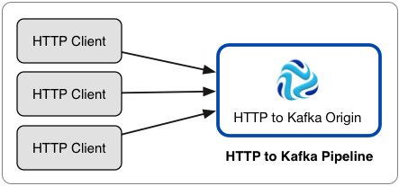
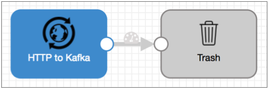
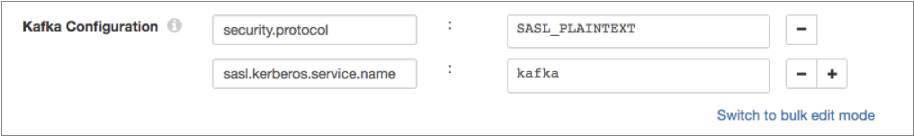

# HTTP到Kafka（已弃用）

HTTP到Kafka的起源侦听HTTP端点，并将所有授权的HTTP POST请求的内容直接写到Kafka。但是，HTTP到Kafka的起源现在已被弃用，并将在以后的版本中删除。我们建议使用[HTTP Server源](https://streamsets.com/documentation/controlhub/latest/help/datacollector/UserGuide/Origins/HTTPServer.html#concept_s2p_5hb_4y)，该[源](https://streamsets.com/documentation/controlhub/latest/help/datacollector/UserGuide/Origins/HTTPServer.html#concept_s2p_5hb_4y)可以使用多个线程来启用并行处理来自多个HTTP客户端的数据。

使用HTTP到Kafka的源将大量HTTP POST请求立即写入Kafka，而无需进行其他处理。要执行处理，您可以创建一个单独的管道，该管道具有从Kafka主题读取的Kafka Consumer来源。

如果您需要在将数据写入Kafka之前进行处理，或者需要写入除Kafka以外的目标系统，请使用HTTP Server源。

您可以配置多个HTTP客户端，以将数据发送到来自Kafka的HTTP。在配置原点之前，只需完成必要的先决条件。这是使用HTTP到Kafka起源的体系结构示例：



在将HTTP配置为Kafka时，您可以指定侦听端口，Kafka配置信息，最大消息大小和应用程序ID。您还可以配置SSL / TLS属性，包括默认的传输协议和密码套件。

您可以添加Kafka配置属性并根据需要启用Kafka安全性。

**提示：** Data Collector提供了几种HTTP来源来满足不同的需求。有关快速比较表以帮助您选择合适的表，请参阅[比较HTTP起源](https://streamsets.com/documentation/controlhub/latest/help/datacollector/UserGuide/Origins/Origins_overview.html#concept_rsz_cnw_qy)。

## 先决条件

在使用HTTP到Kafka来源运行管道之前，请配置以下先决条件：

- 配置HTTP客户端以将数据发送到HTTP到Kafka侦听端口

  配置起点时，您将定义一个监听端口号，起点将在此监听数据。

  要将数据传递到管道，请配置每个HTTP客户端以将数据发送到包含侦听端口号的URL。

  URL使用以下格式：`://:/`

  该URL包括以下组件：<http | https>-使用https进行安全的HTTP连接。<sdc_hostname>- 数据收集器主机名。<listening_port>-源侦听数据的端口号。

  例如： `https://localhost:8000/`

- 在请求标头中包含应用程序ID

  配置原点时，您将定义一个应用程序ID。发送到HTTP到Kafka来源的所有消息都必须在请求标头中包含应用程序ID。

  将以下信息添加到您希望源处理的所有HTTP POST请求的请求标头中：`X-SDC-APPLICATION-ID: `

  例如：`X-SDC-APPLICATION-ID: sdc_http2kafka`

## 管道配置

当您在管道中使用HTTP到Kafka的原点时，请将原点连接到垃圾箱目标。

HTTP到Kafka的起源直接将记录写入Kafka。源服务器不会将记录传递到其输出端口，因此您无法执行其他处理或将数据写入其他目标系统。

但是，由于管道需要目标，因此您应将源连接到“废纸destination”目标，以满足管道验证的要求。

具有HTTP到Kafka起源的管道应如下所示：



## Kafka最大邮件大小

在与相对应的Kafka集群属性相关的原点中配置Kafka最大消息大小。origin属性应等于或小于Kafka群集属性。

HTTP到Kafka的起源将每个HTTP POST请求的内容作为一条消息写入Kafka。因此，在来源中配置的最大消息大小决定了HTTP请求的最大大小，并限制了写入Kafka的消息的大小。

为确保将所有消息都写入Kafka，请将origin属性设置为等于或小于Kafka群集属性。尝试写大于指定的Kafka群集属性的消息失败，将HTTP 500错误返回到原始HTTP客户端。

例如，如果Kafka群集允许最大邮件大小为2 MB，则将原始邮件中的“最大邮件大小”属性配置为2 MB或更小，以避免较大邮件的HTTP 500错误。

默认情况下，由message.max.bytes属性定义，Kafka群集中的最大邮件大小为1 MB。

## 启用Kafka安全

您可以将HTTP配置为来自Kafka的源，以通过SSL / TLS和/或Kerberos安全地连接至Kafka。

### 启用SSL / TLS

执行以下步骤以使HTTP到Kafka的源能够使用SSL / TLS连接到Kafka。

1. 要使用SSL / TLS进行连接，首先请确保按照[Kafka文档](http://kafka.apache.org/documentation.html#security_ssl)中的[说明](http://kafka.apache.org/documentation.html#security_ssl)为Kafka配置了SSL / TLS 。

2. 在阶段的“ **常规”**选项卡上，将“ **阶段库”**属性设置为适当的Apache Kafka版本。

3. 在**Kafka**选项卡上，添加 **security.protocol** Kafka配置属性并将其设置为**SSL**。

4. 然后添加并配置以下SSL Kafka属性：

   - ssl.truststore.location
   - ssl.truststore.password

   当Kafka代理要求客户端身份验证时-ssl.client.auth代理属性设置为“必需”时-添加并配置以下属性：

   - ssl.keystore.location
   - ssl.keystore.password
   - ssl.key.password

   一些经纪人可能还需要添加以下属性：

   - ssl.enabled.protocols
   - ssl.truststore.type
   - ssl.keystore.type

   有关这些属性的详细信息，请参见Kafka文档。

例如，以下属性允许该阶段使用SSL / TLS通过客户端身份验证连接到Kafka：


### 启用Kerberos（SASL）

使用Kerberos身份验证时，Data Collector 使用Kerberos主体和密钥表连接到Kafka。执行以下步骤以使HTTP到Kafka的源能够使用Kerberos连接到Kafka。

1. 要使用Kerberos，首先请确保按照[Kafka文档](http://kafka.apache.org/documentation.html#security_sasl)中的[说明](http://kafka.apache.org/documentation.html#security_sasl)为Kafka配置了Kerberos 。

2. 确保Kerberos身份验证是否启用了数据采集，如在[Kerberos身份验证](https://streamsets.com/documentation/controlhub/latest/help/datacollector/UserGuide/Configuration/Kerberos.html#concept_hnm_n4l_xs)。

3. 根据您的安装和身份验证类型，添加Kafka客户端所需的Java身份验证和授权服务（JAAS）配置属性：

   - 没有LDAP身份验证的RPM，tarball或Cloudera Manager安装

      -如果

     Data Collector

     不使用LDAP身份验证，请在

     Data Collector

      计算机上创建一个单独的JAAS配置文件。将以下

     ```
     KafkaClient
     ```

     登录部分添加到文件中：

     ```
     KafkaClient {
         com.sun.security.auth.module.Krb5LoginModule required
         useKeyTab=true
         keyTab="<keytab path>"
         principal="<principal name>/<host name>@<realm>";
     };
     ```

     例如：

     ```
     KafkaClient {
         com.sun.security.auth.module.Krb5LoginModule required
         useKeyTab=true
         keyTab="/etc/security/keytabs/sdc.keytab"
         principal="sdc/sdc-01.streamsets.net@EXAMPLE.COM";
     };
     ```

     然后修改SDC_JAVA_OPTS环境变量，使其包含以下选项，这些选项定义了JAAS配置文件的路径：

     ```
     -Djava.security.auth.login.config=<JAAS config path>
     ```

     使用安装类型所需的方法。

   - 使用LDAP认证的RPM或tarball安装

      -如果在RPM或tarball的安装中启用了LDAP认证，则将属性添加到

     Data Collector

     使用的JAAS配置文件中-该 

     ```
     $SDC_CONF/ldap-login.conf
     ```

     文件。将以下

     ```
     KafkaClient
     ```

     登录部分添加 到 

     ```
     ldap-login.conf
     ```

      文件末尾：

     ```
     KafkaClient {
         com.sun.security.auth.module.Krb5LoginModule required
         useKeyTab=true
         keyTab="<keytab path>"
         principal="<principal name>/<host name>@<realm>";
     };
     ```

     例如：

     ```
     KafkaClient {
         com.sun.security.auth.module.Krb5LoginModule required
         useKeyTab=true
         keyTab="/etc/security/keytabs/sdc.keytab"
         principal="sdc/sdc-01.streamsets.net@EXAMPLE.COM";
     };
     ```

   - 使用LDAP身份验证的Cloudera Manager安装

      -如果在Cloudera Manager安装中启用了LDAP身份验证，请在Cloudera Manager中为StreamSets服务启用LDAP配置文件替换（ldap.login.file.allow.substitutions）属性。

     如果启用了“使用安全阀编辑LDAP信息（use.ldap.login.file）”属性，并且在ldap-login.conf字段的“数据收集器高级配置代码段（安全阀）”中配置了LDAP身份验证，则添加JAAS配置属性与ldap-login.conf安全阀相同。

     如果通过LDAP属性而不是ldap-login.conf安全值配置LDAP身份验证，则将JAAS配置属性添加到generate-ldap-login-append.conf字段的数据收集器高级配置代码片段（安全阀）中。

     将以下`KafkaClient`登录部分添加 到适当的字段，如下所示：

     ```
     KafkaClient {
         com.sun.security.auth.module.Krb5LoginModule required
         useKeyTab=true
         keyTab="_KEYTAB_PATH"
         principal="<principal name>/_HOST@<realm>";
     };
     ```

     例如：

     ```
     KafkaClient {
         com.sun.security.auth.module.Krb5LoginModule required
         useKeyTab=true
         keyTab="_KEYTAB_PATH"
         principal="sdc/_HOST@EXAMPLE.COM";
     };
     ```

     Cloudera Manager会生成适当的密钥表路径和主机名。

4. 在阶段的“ **常规”**选项卡上，将“ **阶段库”**属性设置为适当的Apache Kafka版本。

5. 在**Kafka**选项卡上，添加 **security.protocol** Kafka配置属性，并将其设置为**SASL_PLAINTEXT**。

6. 然后，添加 **sasl.kerberos.service.name**配置属性，并将其设置为**kafka**。

例如，以下Kafka属性允许使用Kerberos连接到Kafka：



### 启用SSL / TLS和Kerberos

您可以启用HTTP到Kafka的源，以使用SSL / TLS和Kerberos连接到Kafka。

要使用SSL / TLS和Kerberos，请组合所需的步骤以启用每个步骤并按如下所示设置security.protocol属性：

1. 确保Kafka已配置为使用以下Kafka文档中所述的SSL / TLS和Kerberos（SASL）：

   - http://kafka.apache.org/documentation.html#security_ssl
   - http://kafka.apache.org/documentation.html#security_sasl

2. 确保Kerberos身份验证是否启用了数据采集，如在[Kerberos身份验证](https://streamsets.com/documentation/controlhub/latest/help/datacollector/UserGuide/Configuration/Kerberos.html#concept_hnm_n4l_xs)。

3. 根据您的安装和身份验证类型，添加Kafka客户端所需的Java身份验证和授权服务（JAAS）配置属性：

   - 没有LDAP身份验证的RPM，tarball或Cloudera Manager安装

      -如果

     Data Collector

     不使用LDAP身份验证，请在

     Data Collector

      计算机上创建一个单独的JAAS配置文件。将以下

     ```
     KafkaClient
     ```

     登录部分添加到文件中：

     ```
     KafkaClient {
         com.sun.security.auth.module.Krb5LoginModule required
         useKeyTab=true
         keyTab="<keytab path>"
         principal="<principal name>/<host name>@<realm>";
     };
     ```

     例如：

     ```
     KafkaClient {
         com.sun.security.auth.module.Krb5LoginModule required
         useKeyTab=true
         keyTab="/etc/security/keytabs/sdc.keytab"
         principal="sdc/sdc-01.streamsets.net@EXAMPLE.COM";
     };
     ```

     然后修改SDC_JAVA_OPTS环境变量，使其包含以下选项，这些选项定义了JAAS配置文件的路径：

     ```
     -Djava.security.auth.login.config=<JAAS config path>
     ```

     使用安装类型所需的方法。

   - 使用LDAP认证的RPM或tarball安装

      -如果在RPM或tarball的安装中启用了LDAP认证，则将属性添加到

     Data Collector

     使用的JAAS配置文件中-该 

     ```
     $SDC_CONF/ldap-login.conf
     ```

     文件。将以下

     ```
     KafkaClient
     ```

     登录部分添加 到 

     ```
     ldap-login.conf
     ```

      文件末尾：

     ```
     KafkaClient {
         com.sun.security.auth.module.Krb5LoginModule required
         useKeyTab=true
         keyTab="<keytab path>"
         principal="<principal name>/<host name>@<realm>";
     };
     ```

     例如：

     ```
     KafkaClient {
         com.sun.security.auth.module.Krb5LoginModule required
         useKeyTab=true
         keyTab="/etc/security/keytabs/sdc.keytab"
         principal="sdc/sdc-01.streamsets.net@EXAMPLE.COM";
     };
     ```

   - 使用LDAP身份验证的Cloudera Manager安装

      -如果在Cloudera Manager安装中启用了LDAP身份验证，请在Cloudera Manager中为StreamSets服务启用LDAP配置文件替换（ldap.login.file.allow.substitutions）属性。

     如果启用了“使用安全阀编辑LDAP信息（use.ldap.login.file）”属性，并且在ldap-login.conf字段的“数据收集器高级配置代码段（安全阀）”中配置了LDAP身份验证，则添加JAAS配置属性与ldap-login.conf安全阀相同。

     如果通过LDAP属性而不是ldap-login.conf安全值配置LDAP身份验证，则将JAAS配置属性添加到generate-ldap-login-append.conf字段的数据收集器高级配置代码片段（安全阀）中。

     将以下`KafkaClient`登录部分添加 到适当的字段，如下所示：

     ```
     KafkaClient {
         com.sun.security.auth.module.Krb5LoginModule required
         useKeyTab=true
         keyTab="_KEYTAB_PATH"
         principal="<principal name>/_HOST@<realm>";
     };
     ```

     例如：

     ```
     KafkaClient {
         com.sun.security.auth.module.Krb5LoginModule required
         useKeyTab=true
         keyTab="_KEYTAB_PATH"
         principal="sdc/_HOST@EXAMPLE.COM";
     };
     ```

     Cloudera Manager会生成适当的密钥表路径和主机名。

4. 在阶段的“ **常规”**选项卡上，将“ **阶段库”**属性设置为适当的Apache Kafka版本。

5. 在**Kafka**选项卡上，添加 **security.protocol**属性并将其设置为 **SASL_SSL**。

6. 然后，添加 **sasl.kerberos.service.name**配置属性，并将其设置为**kafka**。

7. 然后添加并配置以下SSL Kafka属性：

   - ssl.truststore.location
   - ssl.truststore.password

   当Kafka代理要求客户端身份验证时-ssl.client.auth代理属性设置为“必需”时-添加并配置以下属性：

   - ssl.keystore.location
   - ssl.keystore.password
   - ssl.key.password

   一些经纪人可能还需要添加以下属性：

   - ssl.enabled.protocols
   - ssl.truststore.type
   - ssl.keystore.type

   有关这些属性的详细信息，请参见Kafka文档。

## 配置HTTP到Kafka来源

配置HTTP到Kafka的源，以将大量HTTP POST请求直接写入Kafka。

1. 在“属性”面板的“ **常规”**选项卡上，配置以下属性：

   | 一般财产                                                     | 描述                                                         |
   | :----------------------------------------------------------- | :----------------------------------------------------------- |
   | 名称                                                         | 艺名。                                                       |
   | 描述                                                         | 可选说明。                                                   |
   | 舞台库                                                       | 您要使用的库版本。                                           |
   | [记录错误](https://streamsets.com/documentation/controlhub/latest/help/datacollector/UserGuide/Pipeline_Design/ErrorHandling.html#concept_atr_j4y_5r) | 该阶段的错误记录处理：放弃-放弃记录。发送到错误-将记录发送到管道以进行错误处理。停止管道-停止管道。对群集管道无效。 |

2. 在“ **卡夫卡”**选项卡上，配置以下属性：

   | 卡夫卡房地产                                                 | 描述                                                         |
   | :----------------------------------------------------------- | :----------------------------------------------------------- |
   | 经纪人URI                                                    | Kafka代理的连接字符串。使用以下格式：`:`。要确保连接，请输入以逗号分隔的其他代理URI列表。 |
   | 话题                                                         | 卡夫卡主题阅读。                                             |
   | 邮件大小上限（KB） [](https://streamsets.com/documentation/controlhub/latest/help/datacollector/UserGuide/Origins/HTTPtoKafka.html#concept_skw_zkg_qy) | 要写入Kafka的消息的最大大小。为避免HTTP 500错误，请将此属性配置为等于或小于等效的Kafka群集属性。 |
   | [Kafka配置](https://streamsets.com/documentation/controlhub/latest/help/datacollector/UserGuide/Origins/KConsumer.html#concept_d5f_n2g_vq) | 要使用的其他Kafka配置属性。使用[简单或批量编辑模式](https://streamsets.com/documentation/controlhub/latest/help/datacollector/UserGuide/Pipeline_Configuration/SimpleBulkEdit.html#concept_alb_b3y_cbb)，单击 **添加**图标以添加属性。定义Kafka属性名称和值。使用Kafka期望的属性名称和值。有关启用与Kafka的安全连接的信息，请参阅[启用安全性](https://streamsets.com/documentation/controlhub/latest/help/datacollector/UserGuide/Origins/KConsumer.html#concept_yg3_k31_t5)。 |

3. 在“ **HTTP”**选项卡上，配置以下属性：

   | HTTP属性          | 描述                                                         |
   | :---------------- | :----------------------------------------------------------- |
   | HTTP侦听端口      | HTTP到Kafka来源的侦听端口。该端口号必须包含在HTTP客户端用于传递数据的URL中。有关更多信息，请参见[先决条件](https://streamsets.com/documentation/controlhub/latest/help/datacollector/UserGuide/Origins/HTTPtoKafka.html#concept_uzn_ltp_4y)。 |
   | 并发请求数上限    | 一次允许发送消息到源的最大HTTP客户端数。如果源达到配置的最大值并接收到来自其他客户端的其他请求，则当插槽可用时，它将处理这些请求。 |
   | 申请编号          | 用于将请求传递到HTTP到Kafka来源的应用程序ID。应用程序ID必须包含在HTTP POST请求的标头中。有关更多信息，请参见[先决条件](https://streamsets.com/documentation/controlhub/latest/help/datacollector/UserGuide/Origins/HTTPtoKafka.html#concept_uzn_ltp_4y)。 |
   | URL中的应用程序ID | 允许从URL读取应用程序ID。HTTP客户端在URL查询参数中而不是请求标头中包含应用程序ID时使用。 |

4. 要使用SSL / TLS，请单击“ **TLS”**选项卡并配置以下属性：

   | TLS属性                                                      | 描述                                                         |
   | :----------------------------------------------------------- | :----------------------------------------------------------- |
   | 使用TLS                                                      | 启用TLS的使用。                                              |
   | [密钥库文件](https://streamsets.com/documentation/controlhub/latest/help/datacollector/UserGuide/Pipeline_Configuration/SSL-TLS.html#concept_kqb_rqf_5z) | 密钥库文件的路径。输入文件的绝对路径或相对于Data Collector资源目录的路径：$ SDC_RESOURCES。有关环境变量的更多信息，请参阅 Data Collector 文档中的Data Collector [环境配置](https://streamsets.com/documentation/datacollector/latest/help/#datacollector/UserGuide/Configuration/DCEnvironmentConfig.html)。默认情况下，不使用任何密钥库。 |
   | 密钥库类型                                                   | 要使用的密钥库的类型。使用以下类型之一：Java密钥库文件（JKS）PKCS＃12（p12文件）默认值为Java密钥库文件（JKS）。 |
   | 密钥库密码                                                   | 密钥库文件的密码。密码是可选的，但建议使用。**提示：**为了保护敏感信息（如密码），可以使用[运行时资源](https://streamsets.com/documentation/controlhub/latest/help/datacollector/UserGuide/Pipeline_Configuration/RuntimeValues.html#concept_bs4_5nm_2s)或凭据存储。有关凭证存储的更多信息，请参阅Data Collector文档中的[凭证存储](https://streamsets.com/documentation/datacollector/latest/help/#datacollector/UserGuide/Configuration/CredentialStores.html)。 |
   | 密钥库密钥算法                                               | 用于管理密钥库的算法。默认值为 SunX509。                     |
   | 使用默认协议                                                 | 确定要使用的传输层安全性（TLS）协议。默认协议是TLSv1.2。要使用其他协议，请清除此选项。 |
   | [传输协议](https://streamsets.com/documentation/controlhub/latest/help/datacollector/UserGuide/Pipeline_Configuration/SSL-TLS.html#concept_mvs_cxf_5z) | 要使用的TLS协议。要使用默认TLSv1.2以外的协议，请单击“ **添加”**图标并输入协议名称。您可以使用[简单或批量编辑模式](https://streamsets.com/documentation/controlhub/latest/help/datacollector/UserGuide/Pipeline_Configuration/SimpleBulkEdit.html#concept_alb_b3y_cbb)来添加协议。**注意：**较旧的协议不如TLSv1.2安全。 |
   | [使用默认密码套件](https://streamsets.com/documentation/controlhub/latest/help/datacollector/UserGuide/Pipeline_Configuration/SSL-TLS.html#concept_cwx_dyf_5z) | 对SSL / TLS握手使用默认的密码套件。要使用其他密码套件，请清除此选项。 |
   | 密码套房                                                     | 要使用的密码套件。要使用不属于默认密码集的密码套件，请单击“ **添加”**图标并输入密码套件的名称。您可以使用[简单或批量编辑模式](https://streamsets.com/documentation/controlhub/latest/help/datacollector/UserGuide/Pipeline_Configuration/SimpleBulkEdit.html#concept_alb_b3y_cbb)来添加密码套件。输入要使用的其他密码套件的Java安全套接字扩展（JSSE）名称。 |