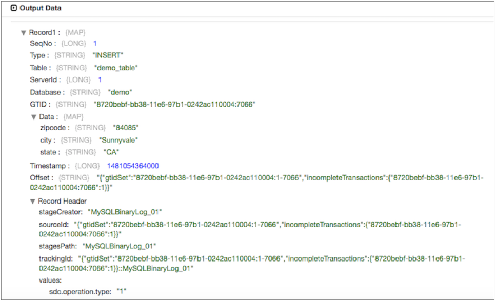

# MySQL二进制日志

[支持的管道类型：](https://streamsets.com/documentation/controlhub/latest/help/datacollector/UserGuide/Pipeline_Configuration/ProductIcons_Doc.html#concept_mjg_ly5_pgb) 资料收集器

MySQL Binary Log起源进程更改MySQL服务器在二进制日志中提供的数据捕获（CDC）信息。

MySQL Binary Log源充当MySQL复制从属。MySQL复制允许您通过将数据从主服务器复制到从服务器来维护MySQL数据的多个副本。源服务器使用复制过程从MySQL主数据库捕获更改，然后将更改的数据传递到Data Collector 管道。

源服务器可以处理来自启用或禁用全局事务标识符（GTID）的MySQL服务器的二进制日志。GTID是分配给MySQL服务器数据库中发生的每个事务的唯一事务ID。

MySQL Binary Log进程仅更改捕获数据。原点为INSERT，UPDATE和DELETE操作创建记录。原始记录为二进制日志中记录的每个更改生成一个记录。

生成的记录包括CDC信息字段的映射。它还在记录头属性中包括CRUD操作类型，因此生成的记录可以由启用CRUD的目标轻松处理。有关Data Collector更改的数据处理的概述以及启用CRUD的目标的列表，请参阅[处理更改的数据](https://streamsets.com/documentation/controlhub/latest/help/datacollector/UserGuide/Pipeline_Design/CDC-Overview.html#concept_apw_l2c_ty)。

在需要时，可以在单独的管道中使用JDBC查询使用者或JDBC多表使用者，以从MySQL二进制日志源启动管道之前，从MySQL数据库读取现有数据。必要时，还应该配置MySQL Binary Log管道来修改生成的记录。在[启用CRUD的目标中](https://streamsets.com/documentation/controlhub/latest/help/datacollector/UserGuide/Pipeline_Design/CDC-Overview.html#concept_lfb_phd_ty)，只有Kudu和JDBC Producer目标包含“更改日志格式”属性，该属性允许处理生成的MySQL二进制日志记录。

在配置原始服务器之前，您必须完成几个先决条件，包括配置MySQL服务器以进行基于行的日志记录和安装JDBC驱动程序。

当配置MySQL Binary Log时，您配置从中读取日志文件的数据库服务器。您可以配置源以从头开始读取二进制日志文件，也可以指定一个偏移量来确定源从何处开始读取数据。

您指定用于连接到MySQL服务器的凭据。您还可以配置高级属性，例如SSL启用，保持活动线程属性，以及在处理过程中原始包含或忽略的其他表。

## 先决条件

在读取MySQL二进制日志以生成更改数据捕获记录之前，必须完成以下先决条件：

- 配置MySQL服务器以使用基于行的日志记录。
- 安装MySQL JDBC驱动程序。

### 配置MySQL Server进行基于行的日志记录

MySQL Binary Log源可以处理来自配置为使用基于行的日志记录的MySQL服务器的二进制日志。

在使用原点之前，请确认MySQL服务器的二进制日志格式已设置为ROW。有关说明，请参见MySQL文档中的[设置二进制日志格式](https://dev.mysql.com/doc/refman/5.7/en/binary-log-setting.html)。

### 安装JDBC驱动程序

在使用MySQL Binary Log原点之前，请安装MySQL JDBC驱动程序。您必须安装所需的驱动程序才能访问数据库。

**注意：** StreamSets已使用以下数据库版本和JDBC驱动程序测试了源：

- 带有MySQL Connector / J 8.0.12驱动程序的MySQL 5.7
- 带有MySQL Connector / J 8.0.12驱动程序的MySQL 8.0

MySQL JDBC驱动程序必须位于外部目录的MySQL Binary Log子目录中，以获取其他驱动程序。例如： `/opt/sdc-extras/streamsets-datacollector-mysql-binlog-lib/lib/`。

有关安装其他驱动程序的信息，请参阅 Data Collector 文档 中的“ [安装外部库](https://streamsets.com/documentation/datacollector/latest/help/#datacollector/UserGuide/Configuration/ExternalLibs.html%23concept_pdv_qlw_ft) ”。

## 初始偏移

您可以将原点配置为从文件开头或文件中的初始偏移量开始读取二进制日志文件。

初始偏移量是二进制日志文件中要开始处理的点。当启动管道时，MySQL Binary Log原点从初始偏移开始处理，并一直持续到您停止管道为止。

用于配置初始偏移量的格式取决于是否为MySQL服务器启用了全局事务标识符（GTID）：

- 启用GTID

  为数据库启用GTID时，MySQL Binary Log原点希望初始偏移包含使用以下格式的GTID：`:`例如，要开始读取GTID处的二进制日志文件 `8720bebf-bb38-11e6-97b1-0242ac110004:7066`，只需输入该GTID作为偏移量即可。

- GTID已停用

  当为GTID禁用数据库时，MySQL Binary Log原点希望初始偏移量包含二进制日志文件名和文件中的位置。使用以下格式来配置偏移量：`:`

  例如，以下偏移量将原点配置为开始读取位置587处的mysql-bin.000004二进制日志文件：`mysql-bin.000004:587`

**注意：**如果在使用MySQL Binary Log原点运行管道之后更改数据库服务器上的GTID模式，则必须重置原点并更改初始偏移值的格式。否则，原点无法正确读取偏移量。

当管道停止时，MySQL Binary Log原点会在停止读取的位置记录偏移量。当管线再次启动时，原点将从上次保存的偏移开始继续处理。您可以重置原点以处理所有请求的对象。

## 生成的记录

MySQL二进制日志源为二进制日志中记录的每个事务生成一个记录。记录包括字段和记录头属性，这些字段和记录头属性包含操作类型，更改数据捕获信息和更改的数据。

**注意：**如果二进制日志中记录的事务已在MySQL数据库中回滚，则MySQL会将原始事务保留在日志中，然后还记录回滚的事务。结果，MySQL Binary Log源可以处理记录在原始事务和回滚事务中的更改。

每个生成的记录包括以下信息：

- CRUD操作类型

  CRUD操作类型存储在“类型”记录字段中，也存储在 `sdc.operation.type`记录头属性中。

  “类型”字段包含以下字符串值之一：INSERT，DELETE或UPDATE。

  该`sdc.operation.type`记录标题属性包含下列数值之一：1用于插入数据2用于删除数据3用于更新数据

  您可以使用“类型”记录字段或sdc.operation.type记录头属性来将记录写入目标系统。启用了CRUD的目标（例如JDBC Producer和Kudu）使用sdc.operation.type标头属性。有关Data Collector CDC 的概述和启用CRUD的目标的列表，请参阅[处理更改的数据](https://streamsets.com/documentation/controlhub/latest/help/datacollector/UserGuide/Pipeline_Design/CDC-Overview.html#concept_apw_l2c_ty)。

- 更改数据捕获信息

  更改数据捕获信息存储在以下记录字段中：BinLogFilename-禁用GTID时BinLogPosition-禁用GTID时SeqNo-启用GTID时GTID-启用GTID时表服务器编号数据库时间戳记偏移量

- 新数据

  包含要插入或更新的新数据的字段将显示在“数据映射”字段中。

- 变更资料

  包含要更新的旧数据的字段或删除记录中的字段将显示在OldData映射字段中。

例如，当原始服务器从启用了GTID的MySQL服务器的二进制日志文件中读取时，它会生成以下记录：



## 处理生成的记录

由于MySQL二进制日志记录的结构，您可能希望使用处理器来重组记录并删除任何不必要的字段。在[启用CRUD的目标中](https://streamsets.com/documentation/controlhub/latest/help/datacollector/UserGuide/Pipeline_Design/CDC-Overview.html#concept_lfb_phd_ty)，只有Kudu和JDBC Producer目标包含“更改日志格式”属性，该属性允许处理生成的MySQL二进制日志记录。

例如，MySQL二进制日志记录在记录字段中包含CDC数据。如果您使用的不是Kudu目的地，而您只需要记录数据，则可以使用Field Remover删除不需要的字段。

同样，更新记录包括OldData映射字段中的先前数据，以及Data映射字段中的更新数据。如果只需要更新的数据，则可以使用字段删除器从记录中删除OldData字段。您可以使用Field Flattener处理器来展平Data字段中的字段。

## 要包含或忽略的表

二进制日志文件捕获对MySQL数据库所做的所有更改。如果要让MySQL Binary Log原点捕获表子集的更改，则可以配置原点以包括特定表的更改或忽略特定表的更改。

在“高级”选项卡上，将表配置为包括或忽略。输入以逗号分隔的数据库和表名称的列表。您可以将百分号（％）用作通配符以匹配任意数量的字符。使用以下格式输入表名称：

```
<database name>.<table name>
```

例如，如果为“ **包含表”** 属性输入以下内容，则原点仅捕获销售数据库中的orders和customers表中的更改：

```
sales.orders,sales.customers
```

如果在“ **忽略表”**属性中输入相同的值，则原点将从日志文件中的所有表中捕获更改，但销售数据库中的orders和customers表除外。

该**忽略表格**属性优先。如果在两个属性中都包含一个表，则原点将忽略该表。

## 配置MySQL二进制日志来源

配置MySQL二进制日志源，以处理MySQL二进制日志提供的更改数据捕获（CDC）信息。 在配置源之前，请确保完成必要的[先决条件](https://streamsets.com/documentation/controlhub/latest/help/datacollector/UserGuide/Origins/MySQLBinaryLog.html#concept_nwf_f4x_1bb)。

1. 在“属性”面板的“ **常规”**选项卡上，配置以下属性：

   | 一般财产                                                     | 描述                                                         |
   | :----------------------------------------------------------- | :----------------------------------------------------------- |
   | 名称                                                         | 艺名。                                                       |
   | 描述                                                         | 可选说明。                                                   |
   | [记录错误](https://streamsets.com/documentation/controlhub/latest/help/datacollector/UserGuide/Pipeline_Design/ErrorHandling.html#concept_atr_j4y_5r) | 该阶段的错误记录处理：放弃-放弃记录。发送到错误-将记录发送到管道以进行错误处理。停止管道-停止管道。 |

2. 在“ **MySQL二进制日志”**选项卡上，配置以下属性：

   | MySQL二进制日志属性                                          | 描述                                                         |
   | :----------------------------------------------------------- | :----------------------------------------------------------- |
   | 主机名                                                       | MySQL服务器主机名。                                          |
   | 港口                                                         | MySQL服务器端口。                                            |
   | 服务器ID                                                     | 原始服务器用于连接到主MySQL服务器的复制服务器ID。对于复制主机和所有其他复制从属服务器的服务器ID，必须是唯一的。为MySQL服务器数据库启用GTID后，服务器ID是可选的。 |
   | 从头开始 [](https://streamsets.com/documentation/controlhub/latest/help/datacollector/UserGuide/Origins/MySQLBinaryLog.html#concept_emp_1tl_dy) | 指定是否从二进制日志的开头开始读取事件。如果未选择，则原点将从上次保存的偏移开始读取事件。 |
   | 初始偏移[](https://streamsets.com/documentation/controlhub/latest/help/datacollector/UserGuide/Origins/MongoDB.html#concept_kx3_zrs_ns) | 从二进制日志中的此偏移处读取事件。如果配置初始偏移值并将原点配置为从头开始，则原点将从初始偏移开始读取。 |

3. 在“ **凭据”**选项卡上，配置以下属性：

   | 凭证属性 | 描述                                                         |
   | :------- | :----------------------------------------------------------- |
   | 用户名   | MySQL用户名。用户必须具有以下MySQL特权：复制客户复制从站     |
   | 密码     | MySQL密码。**提示：** 为了保护敏感信息，例如用户名和密码，可以使用 [运行时资源](https://streamsets.com/documentation/controlhub/latest/help/datacollector/UserGuide/Pipeline_Configuration/RuntimeValues.html#concept_bs4_5nm_2s)或凭据存储。有关凭证存储的更多信息，请参阅Data Collector文档中的[凭证存储](https://streamsets.com/documentation/datacollector/latest/help/#datacollector/UserGuide/Configuration/CredentialStores.html)。 |

4. 在“ **高级”**选项卡上，配置以下属性：

   | 先进物业                                                     | 描述                                                         |
   | :----------------------------------------------------------- | :----------------------------------------------------------- |
   | [批处理等待时间（毫秒）](https://streamsets.com/documentation/controlhub/latest/help/datacollector/UserGuide/Origins/Origins_overview.html#concept_ypd_vgr_5q) | 发送部分或空批次之前要等待的毫秒数。                         |
   | 最大批次大小（记录）                                         | 一次处理的最大记录数。接受的值最高为Data Collector的最大批处理大小。默认值是1000 数据采集器默认设置为1000。 |
   | 连接超时（毫秒）                                             | 等待连接到MySQL服务器的最长时间（以毫秒为单位）。            |
   | 启用KeepAlive线程                                            | 启用使用“保持活动”线程来维护与MySQL服务器的连接。            |
   | 保持活动间隔                                                 | 保持空闲状态的最大毫秒数。在关闭线程之前，请保持活动线程处于活动状态。 |
   | 使用SSL                                                      | 指定是否使用SSL / TLS连接到MySQL服务器。                     |
   | 包括表格[](https://streamsets.com/documentation/controlhub/latest/help/datacollector/UserGuide/Origins/MySQLBinaryLog.html#concept_lgb_nvl_dy) | 读取二进制日志文件中的更改事件时要包括的表的列表。           |
   | 忽略表格[](https://streamsets.com/documentation/controlhub/latest/help/datacollector/UserGuide/Origins/MySQLBinaryLog.html#concept_lgb_nvl_dy) | 读取二进制日志文件中的更改事件时要忽略的表的列表。           |