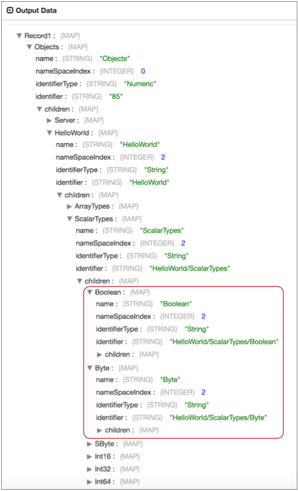
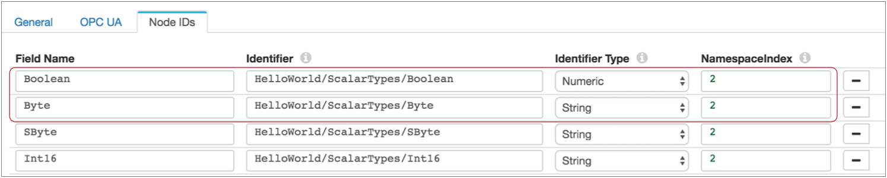

# OPC UA客户端

[支持的管道类型：](https://streamsets.com/documentation/controlhub/latest/help/datacollector/UserGuide/Pipeline_Configuration/ProductIcons_Doc.html#concept_mjg_ly5_pgb) 资料收集器

OPC UA客户端源处理来自OPC UA服务器的数据。OPC UA客户端源可以定期轮询服务器，从所有指定的节点返回最新数据。或者它可以订阅特定的节点，并在每次发生与指定节点有关的更改时从服务器接收消息。

原始服务器还可以浏览所有可用节点，以提供配置原始服务器所需的节点详细信息。

在组态OPC UA客户端来源时，可以指定连接信息和标签信息以与每个客户端请求关联。您为原点选择处理模式，并为要使用的节点指定NodeId。您可以使用几种不同的方法之一来提供NodeId。

您可以配置通道属性，例如最大块或消息大小。您可以选择配置要使用的安全策略，相关的TLS属性以及可选的客户端私钥别名。

## 处理方式

OPC UA客户端原始数据根据您选择的模式以不同的方式处理数据。原点可以使用以下处理模式：

- 轮询

  原点会按用户定义的定期轮询OPC UA服务器，并返回每个指定节点的当前状态。

  在轮询模式下，每个记录都包含来自每个指定节点的数据作为字段。原点一旦生成记录，就会将记录传递到管道，以避免处理延迟。

  例如，假设您将OPC UA客户端设置为每分钟轮询一次服务器，并指定五个NodeId。当管道运行时，起始点每分钟都会生成一条记录，其中每条记录中五个NodeId的状态都是如此，而不管自上次轮询以来是否发生了任何更改。

- 订阅

  原点订阅指定的节点。每当指定节点之一发生更改时，OPC UA服务器都会发送更新。发生节点更改时，服务器会将每个更改分别发送到源。

  在订阅模式下，每个记录都包含一个节点更改。原点一旦生成记录，就会将记录传递到管道，以避免处理延迟。

  例如，假设您将OPC UA客户端源设置为订阅十个节点。启动管道后，管道将处于空闲状态，直到OPC UA服务器将有关更改的数据发送到预订的节点。

- 浏览节点

  浏览节点模式是辅助管道开发的工具。在浏览节点模式下，源连接到OPC UA服务器以检索所有可用的节点详细信息，例如节点标识符和名称空间索引。

  通过此模式，可以轻松访问在原始位置配置NodeId所需的节点详细信息。

  您可以在数据预览中使用浏览节点模式来查看节点详细信息，然后配置原点。或者，您可以在浏览节点模式下运行管道以将节点详细信息写入文件。您也可以使用外部方法从OPC UA服务器检索节点详细信息。

  例如，假设以浏览节点模式预览OPC UA服务器将返回以下信息：然后，您可以使用此信息来配置要订阅的节点，如下所示：

## 提供NodeId

OPC UA客户端来源提供了几种方法来指定要使用的节点的nodeId：

- 手册

  手动输入NodeId信息。当您要使用特定数量的节点且数量较少时，请使用此方法。您可以使用简单或批量编辑模式。

- 文件

  提供一个NodeId信息文件。当您要使用一组相对静态的节点时，请使用此方法。您可以根据需要更新文件，但是需要重新启动管道以捕获最新的节点。

  该文件必须位于Data Collector本地的目录中。默认情况下，来源希望您将信息保护在[运行时资源文件中](https://streamsets.com/documentation/controlhub/latest/help/datacollector/UserGuide/Pipeline_Configuration/RuntimeValues.html#concept_bs4_5nm_2s)。

  使用以下JSON格式在文件中输入NodeId信息：`[ { 	"identifierType": "", 	"namespaceIndex": , 	"field": "", 	"identifier": "" }, { 	"identifierType": "", 	"namespaceIndex": , 	"field": "", 	"identifier": "" } ]`

  **提示：**这与在批量编辑模式下手动输入节点信息时使用的格式相同。要验证格式，您可以以简单格式手动输入两个NodeId，然后切换到批量编辑模式。

- 浏览节点

  指定根NodeId，以允许起点浏览根节点下的所有可用节点。当您要处理来自单个根节点下的一组动态节点的数据时，请使用此方法。

  浏览节点时，可以指定刷新间隔。刷新间隔表示起点在再次浏览以处理更新的节点列表之前应等待的时间。

## 安全

您可以选择将OPC UA客户端来源配置为使用以下标准OPC UA安全策略之一：

- 基本128Rsa15
- 基本256
- 基本256
- 没有

有关OPC UA安全策略的更多信息，请参见[OPC UA文档](http://documentation.unified-automation.com/uasdkhp/1.0.0/html/_l2_ua_discovery_connect.html#DiscoveryConnect_ServerInitialConfig_Endpoints)。

使用安全策略时，必须配置关联的TLS属性。必要时，您可以指定私钥别名。

## 组态OPC UA客户端来源

配置OPC UA客户端源以处理来自OPC UA服务器的数据。

1. 在“属性”面板的“ **常规”**选项卡上，配置以下属性：

   | 一般财产                                                     | 描述                                                         |
   | :----------------------------------------------------------- | :----------------------------------------------------------- |
   | 名称                                                         | 艺名。                                                       |
   | 描述                                                         | 可选说明。                                                   |
   | [记录错误](https://streamsets.com/documentation/controlhub/latest/help/datacollector/UserGuide/Pipeline_Design/ErrorHandling.html#concept_atr_j4y_5r) | 该阶段的错误记录处理：放弃-放弃记录。发送到错误-将记录发送到管道以进行错误处理。停止管道-停止管道。 |

2. 在“ **OPC UA”**选项卡上，配置以下属性：

   | OPC UA属性       | 描述                                                         |
   | :--------------- | :----------------------------------------------------------- |
   | 资源网址         | 要使用的OPC UA资源URL。                                      |
   | 应用名称         | 用于与OPC UA服务器联系的应用程序名称。此名称可以出现在报告工具中，以标识发送请求的应用程序。 |
   | 应用程序URI      | 用于与OPC UA服务器联系的应用程序URI。输入以“ urn”开头的唯一ID，如下所示：`urn:`此名称可以出现在报告工具中，以标识发送请求的应用程序。 |
   | 请求超时         | 超时之前等待响应的毫秒数。                                   |
   | 处理方式         | 用于从OPC UA服务器检索数据的模式：轮询-用于定期请求数据。订阅-仅当订阅节点发生更改时才用于接收数据。浏览节点-在管道开发期间使用，以提供用于配置节点ID的节点详细信息。请勿在生产中使用。有关模式类型和每种模式返回的数据的更多信息，请参见[处理模式](https://streamsets.com/documentation/controlhub/latest/help/datacollector/UserGuide/Origins/OPCUAClient.html#concept_nbk_mkc_h1b)。 |
   | 轮询间隔（毫秒） | 两次轮询之间要等待的毫秒数。仅与轮询模式一起使用。           |

3. 在**NodeIds**选项卡上，选择**NodeId Fetch Mode**。

   有关可以提供节点信息的不同方式的更多信息，请参见[提供NodeIds](https://streamsets.com/documentation/controlhub/latest/help/datacollector/UserGuide/Origins/OPCUAClient.html#concept_p25_wm2_dbb)。

4. 使用“手动”模式时，请使用[简单或批量编辑模式](https://streamsets.com/documentation/controlhub/latest/help/datacollector/UserGuide/Pipeline_Configuration/SimpleBulkEdit.html#concept_alb_b3y_cbb)输入要使用的节点。单击**添加**图标以添加其他节点。

   | 节点属性     | 描述                                                       |
   | :----------- | :--------------------------------------------------------- |
   | 栏位名称     | 节点的名称。                                               |
   | 识别码       | OPC UA服务器地址空间内节点的标识符。                       |
   | 标识符类型   | 标识符的格式和数据类型。使用以下类型之一：数字串UUID不透明 |
   | 命名空间索引 | OPC UA服务器用于名称空间URI的索引。                        |

5. 使用文件模式时，请配置以下属性：

   | 文件属性       | 描述                                                         |
   | :------------- | :----------------------------------------------------------- |
   | NodeId文件路径 | 包含要处理的节点的NodeId信息的文件的路径。使用Data Collector本地文件，该文件以适当的格式包含NodeId信息。有关更多信息，请参见[提供NodeIds](https://streamsets.com/documentation/controlhub/latest/help/datacollector/UserGuide/Origins/OPCUAClient.html#concept_p25_wm2_dbb)。默认值为 `${runtime:loadResource('nodeIdConfigs.json', false)}`，它假定您正在使用名为nodeIdConfigs.json 的 [运行时资源文件](https://streamsets.com/documentation/controlhub/latest/help/datacollector/UserGuide/Pipeline_Configuration/RuntimeValues.html#concept_bs4_5nm_2s)。 |

6. 使用浏览模式时，请配置以下属性：

   | 浏览物业             | 描述                                                         |
   | :------------------- | :----------------------------------------------------------- |
   | 根节点标识符         | OPC UA服务器地址空间内根节点的标识符。源处理来自根节点下所有节点的数据。有关浏览节点的更多信息，请参见[提供NodeIds](https://streamsets.com/documentation/controlhub/latest/help/datacollector/UserGuide/Origins/OPCUAClient.html#concept_p25_wm2_dbb)。 |
   | 根节点标识符类型     | 根节点标识符的格式和数据类型。使用以下类型之一：数字串UUID不透明 |
   | 根节点命名空间索引   | OPC UA服务器用于名称空间URI的索引。                          |
   | NodeId刷新间隔（秒） | 浏览根节点以获取要使用的更新节点列表之前要等待的秒数。       |

7. 在“ **通道配置”**选项卡上，可以配置以下属性：

   | 通道配置属性 | 描述                                                         |
   | :----------- | :----------------------------------------------------------- |
   | 最大块大小   | 单个块的最大大小。必须设置为8192或更大。默认值为65536。      |
   | 最大块数     | 消息中的最大块数。默认值为32。                               |
   | 邮件大小上限 | 组装完所有块后消息的最大大小。默认值为2097152，即<最大块大小> * <最大块数>。 |
   | 最大阵列长度 | 数组的最大长度。默认值为65536。                              |
   | 最大弦长     | 最大字符串长度。默认值为65536。                              |

8. 在“ **安全性”**选项卡上，可以选择配置以下属性：

   | 担保财产                                                     | 描述                                                         |
   | :----------------------------------------------------------- | :----------------------------------------------------------- |
   | 安全政策                                                     | 要使用的安全策略。选择以下策略之一：基本128Rsa15基本256基本256没有使用安全策略时，请启用TLS并配置关联的属性。 |
   | 客户私钥别名                                                 | 要使用的可选私钥别名。                                       |
   | 使用TLS                                                      | 启用TLS的使用。                                              |
   | [密钥库文件](https://streamsets.com/documentation/controlhub/latest/help/datacollector/UserGuide/Pipeline_Configuration/SSL-TLS.html#concept_kqb_rqf_5z) | 密钥库文件的路径。输入文件的绝对路径或相对于Data Collector资源目录的路径：$ SDC_RESOURCES。有关环境变量的更多信息，请参阅 Data Collector 文档中的Data Collector [环境配置](https://streamsets.com/documentation/datacollector/latest/help/#datacollector/UserGuide/Configuration/DCEnvironmentConfig.html)。默认情况下，不使用任何密钥库。 |
   | 密钥库类型                                                   | 要使用的密钥库的类型。使用以下类型之一：Java密钥库文件（JKS）PKCS＃12（p12文件）默认值为Java密钥库文件（JKS）。 |
   | 密钥库密码                                                   | 密钥库文件的密码。密码是可选的，但建议使用。**提示：**为了保护敏感信息（如密码），可以使用[运行时资源](https://streamsets.com/documentation/controlhub/latest/help/datacollector/UserGuide/Pipeline_Configuration/RuntimeValues.html#concept_bs4_5nm_2s)或凭据存储。有关凭证存储的更多信息，请参阅Data Collector文档中的[凭证存储](https://streamsets.com/documentation/datacollector/latest/help/#datacollector/UserGuide/Configuration/CredentialStores.html)。 |
   | 密钥库密钥算法                                               | 用于管理密钥库的算法。默认值为 SunX509。                     |
   | 使用默认协议                                                 | 确定要使用的传输层安全性（TLS）协议。默认协议是TLSv1.2。要使用其他协议，请清除此选项。 |
   | [传输协议](https://streamsets.com/documentation/controlhub/latest/help/datacollector/UserGuide/Pipeline_Configuration/SSL-TLS.html#concept_mvs_cxf_5z) | 要使用的TLS协议。要使用默认TLSv1.2以外的协议，请单击“ **添加”**图标并输入协议名称。您可以使用[简单或批量编辑模式](https://streamsets.com/documentation/controlhub/latest/help/datacollector/UserGuide/Pipeline_Configuration/SimpleBulkEdit.html#concept_alb_b3y_cbb)来添加协议。**注意：**较旧的协议不如TLSv1.2安全。 |
   | [使用默认密码套件](https://streamsets.com/documentation/controlhub/latest/help/datacollector/UserGuide/Pipeline_Configuration/SSL-TLS.html#concept_cwx_dyf_5z) | 对SSL / TLS握手使用默认的密码套件。要使用其他密码套件，请清除此选项。 |
   | 密码套房                                                     | 要使用的密码套件。要使用不属于默认密码集的密码套件，请单击“ **添加”**图标并输入密码套件的名称。您可以使用[简单或批量编辑模式](https://streamsets.com/documentation/controlhub/latest/help/datacollector/UserGuide/Pipeline_Configuration/SimpleBulkEdit.html#concept_alb_b3y_cbb)来添加密码套件。输入要使用的其他密码套件的Java安全套接字扩展（JSSE）名称。 |