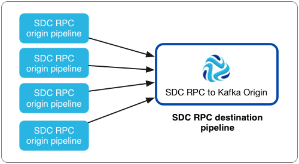
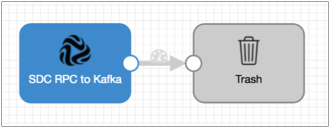
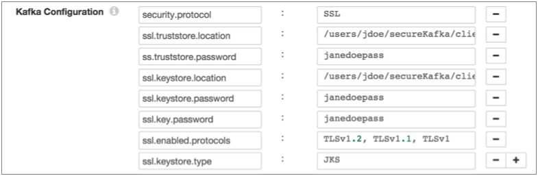

# DC RPC到Kafka（已弃用）

到Kafka的SDC RPC从一个或多个SDC RPC目的地读取数据，并将其立即写入Kafka。使用SDC RPC到SDC RPC目标管道中的Kafka起点。但是，SDC RPC到Kafka的起源现在已被弃用，并将在以后的版本中删除。我们建议使用[SDC RPC origin](https://streamsets.com/documentation/controlhub/latest/help/datacollector/UserGuide/Origins/SDC_RPCorigin.html#concept_agb_5c1_ct)。

当您有多个SDC RPC原始管道具有想要写入Kafka而无需其他处理的数据时，请使用SDC RPC到Kafka原始。

与SDC RPC起源一样，从SDC RPC到Kafka的起源也从另一个管道中的SDC RPC目标读取数据。但是，从SDC RPC到Kafka的来源经过了优化，可以将来自多个管道的数据直接写入Kafka。使用此原点时，无法在写入Kafka之前执行其他处理。

这是使用SDC RPC到Kafka的推荐体系结构示例：



在将SDC RPC配置为Kafka原始服务器时，可以定义原始服务器侦听数据的端口，SDC RPC ID，最大并发请求数以及最大批处理请求大小。您还可以配置SSL / TLS属性，包括默认的传输协议和密码套件。

您还需要配置Kafka的连接信息，包括代理URI，要写入的主题和最大消息大小。您可以添加Kafka配置属性并根据需要启用Kafka安全性。

## 管道配置

当您在管道中使用SDC RPC到Kafka原点时，请将原点连接到垃圾箱目标。

到Kafka的SDC RPC直接将记录写入Kafka。源服务器不会将记录传递到其输出端口，因此您无法执行其他处理或将数据写入其他目标系统。

但是，由于管道需要目标，因此您应将源连接到“废纸destination”目标，以满足管道验证的要求。

具有SDC RPC到Kafka起源的管道应如下所示：



## 并发请求

您可以一次指定SDC RPC到Kafka原始处理的最大请求数。

当原始管道中的SDC RPC目标要将一批数据传递到原始数据时，会将请求发送到SDC RPC到Kafka原始数据。如果您有一个将数据传递到SDC RPC到Kafka原始数据的原始数据管道，则可以将并发请求的最大数量设置为1，因为该目标一次处理一批数据。

通常，您将有多个管道将数据传递到此源。在这种情况下，您应该评估原始管道的数量，管道的预期输出以及Data Collector 计算机的资源，然后根据需要调整属性以提高管道性能。

例如，如果您有100个原始管道将数据传递到SDC RPC到Kafka原始管道，但是这些管道缓慢地生成数据，则可以将最大值设置为20，以防止这些管道 在数量激增期间占用过多的Data Collector资源。或者，如果数据收集器 没有资源问题，并且您希望它尽快处理数据，则可以将最大值设置为90或100。请注意，SDC RPC目标还具有用于重试和退避时间的高级属性，可以用于帮助调整性能。

## 批处理请求大小，Kafka消息大小和Kafka配置

将SDC RPC配置为相互之间以及与Kafka中配置的最大消息大小相关的Kafka最大批处理请求大小和Kafka消息大小属性。

的**最大批处理请求大小（MB）**属性确定批次数据的起源来自每个SDC RPC目的地接受的最大大小。收到一批数据后，原点会立即将数据写入Kafka。

为了提高性能，原始服务器将尽可能多的记录写入单个Kafka消息中。Kafka **最大邮件大小（KB）**属性确定其创建的邮件的最大大小。

**重要信息：**在原始位置中指定的最大邮件大小必须小于在Kafka中配置的最大邮件大小。默认情况下，由message.max.bytes属性定义，Kafka群集中的最大邮件大小为1 MB。 如果源收到的消息大于最大消息大小，它将无法处理批处理，提供批处理的目标将根据为目标配置的错误记录处理来处理该批处理。

例如，假设来源将默认的100 MB用于最大批处理请求大小，将默认的900 KB用于最大消息大小，而Kafka使用1 MB的默认缺省值message.max.bytes。

当源请求一批数据时，它一次最多接收100 MB数据。当源将数据写入Kafka时，它将记录分成尽可能少的消息，每条消息中最多包含900 KB的记录。由于消息大小小于Kafka 1 MB的要求，因此源将所有消息成功写入Kafka。

如果记录大于最大消息大小900 KB，则源将生成错误，并且不会将记录-或包含该记录的批处理-写入Kafka。为批处理提供超大记录的SDC RPC目标根据阶段错误记录处理来处理批处理。

## 卡夫卡的其他属性

您可以将自定义Kafka配置属性添加到SDC到Kafka的RPC。

添加Kafka配置属性时，请输入确切的属性名称和值。该阶段不验证属性名称或值。

默认情况下定义了几个属性，您可以根据需要编辑或删除这些属性。

**注意：**由于该阶段使用多个配置属性，因此它将忽略以下属性的用户定义值：

- key.serializer.class
- metadata.broker.list
- partitioner.class
- 生产者类型
- serializer.class

## 启用Kafka安全

您可以将SDC RPC配置为来自Kafka的源，以通过SSL / TLS，Kerberos或两者安全地连接到Kafka。

### 启用SSL / TLS

执行以下步骤，以使SDC RPC到Kafka的源能够使用SSL / TLS连接到Kafka。

1. 要使用SSL / TLS进行连接，首先请确保按照[Kafka文档](http://kafka.apache.org/documentation.html#security_ssl)中的[说明](http://kafka.apache.org/documentation.html#security_ssl)为Kafka配置了SSL / TLS 。

2. 在阶段的“ **常规”**选项卡上，将“ **阶段库”**属性设置为适当的Apache Kafka版本。

3. 在**Kafka**选项卡上，添加 **security.protocol** Kafka配置属性并将其设置为**SSL**。

4. 然后添加并配置以下SSL Kafka属性：

   - ssl.truststore.location
   - ssl.truststore.password

   当Kafka代理要求客户端身份验证时-ssl.client.auth代理属性设置为“必需”时-添加并配置以下属性：

   - ssl.keystore.location
   - ssl.keystore.password
   - ssl.key.password

   一些经纪人可能还需要添加以下属性：

   - ssl.enabled.protocols
   - ssl.truststore.type
   - ssl.keystore.type

   有关这些属性的详细信息，请参见Kafka文档。

例如，以下属性允许该阶段使用SSL / TLS通过客户端身份验证连接到Kafka：



### 启用Kerberos（SASL）

使用Kerberos身份验证时，Data Collector 使用Kerberos主体和密钥表连接到Kafka。执行以下步骤，以使SDC RPC到Kafka的源能够使用Kerberos连接到Kafka。

1. 要使用Kerberos，首先请确保按照[Kafka文档](http://kafka.apache.org/documentation.html#security_sasl)中的[说明](http://kafka.apache.org/documentation.html#security_sasl)为Kafka配置了Kerberos 。

2. 确保Kerberos身份验证是否启用了数据采集，如在[Kerberos身份验证](https://streamsets.com/documentation/controlhub/latest/help/datacollector/UserGuide/Configuration/Kerberos.html#concept_hnm_n4l_xs)。

3. 根据您的安装和身份验证类型，添加Kafka客户端所需的Java身份验证和授权服务（JAAS）配置属性：

   - 没有LDAP身份验证的RPM，tarball或Cloudera Manager安装

      -如果

     Data Collector

     不使用LDAP身份验证，请在

     Data Collector

      计算机上创建一个单独的JAAS配置文件。将以下

     ```
     KafkaClient
     ```

     登录部分添加到文件中：

     ```
     KafkaClient {
         com.sun.security.auth.module.Krb5LoginModule required
         useKeyTab=true
         keyTab="<keytab path>"
         principal="<principal name>/<host name>@<realm>";
     };
     ```

     例如：

     ```
     KafkaClient {
         com.sun.security.auth.module.Krb5LoginModule required
         useKeyTab=true
         keyTab="/etc/security/keytabs/sdc.keytab"
         principal="sdc/sdc-01.streamsets.net@EXAMPLE.COM";
     };
     ```

     然后修改SDC_JAVA_OPTS环境变量，使其包含以下选项，这些选项定义了JAAS配置文件的路径：

     ```
     -Djava.security.auth.login.config=<JAAS config path>
     ```

     使用安装类型所需的方法。

   - 使用LDAP认证的RPM或tarball安装

      -如果在RPM或tarball的安装中启用了LDAP认证，则将属性添加到

     Data Collector

     使用的JAAS配置文件中-该 

     ```
     $SDC_CONF/ldap-login.conf
     ```

     文件。将以下

     ```
     KafkaClient
     ```

     登录部分添加 到 

     ```
     ldap-login.conf
     ```

      文件末尾：

     ```
     KafkaClient {
         com.sun.security.auth.module.Krb5LoginModule required
         useKeyTab=true
         keyTab="<keytab path>"
         principal="<principal name>/<host name>@<realm>";
     };
     ```

     例如：

     ```
     KafkaClient {
         com.sun.security.auth.module.Krb5LoginModule required
         useKeyTab=true
         keyTab="/etc/security/keytabs/sdc.keytab"
         principal="sdc/sdc-01.streamsets.net@EXAMPLE.COM";
     };
     ```

   - 使用LDAP身份验证的Cloudera Manager安装

      -如果在Cloudera Manager安装中启用了LDAP身份验证，请在Cloudera Manager中为StreamSets服务启用LDAP配置文件替换（ldap.login.file.allow.substitutions）属性。

     如果启用了“使用安全阀编辑LDAP信息（use.ldap.login.file）”属性，并且在ldap-login.conf字段的“数据收集器高级配置代码段（安全阀）”中配置了LDAP身份验证，则添加JAAS配置属性与ldap-login.conf安全阀相同。

     如果通过LDAP属性而不是ldap-login.conf安全值配置LDAP身份验证，则将JAAS配置属性添加到generate-ldap-login-append.conf字段的数据收集器高级配置代码片段（安全阀）中。

     将以下`KafkaClient`登录部分添加 到适当的字段，如下所示：

     ```
     KafkaClient {
         com.sun.security.auth.module.Krb5LoginModule required
         useKeyTab=true
         keyTab="_KEYTAB_PATH"
         principal="<principal name>/_HOST@<realm>";
     };
     ```

     例如：

     ```
     KafkaClient {
         com.sun.security.auth.module.Krb5LoginModule required
         useKeyTab=true
         keyTab="_KEYTAB_PATH"
         principal="sdc/_HOST@EXAMPLE.COM";
     };
     ```

     Cloudera Manager会生成适当的密钥表路径和主机名。

4. 在阶段的“ **常规”**选项卡上，将“ **阶段库”**属性设置为适当的Apache Kafka版本。

5. 在**Kafka**选项卡上，添加 **security.protocol** Kafka配置属性，并将其设置为**SASL_PLAINTEXT**。

6. 然后，添加 **sasl.kerberos.service.name**配置属性，并将其设置为**kafka**。

例如，以下Kafka属性允许使用Kerberos连接到Kafka：


### 启用SSL / TLS和Kerberos

您可以启用SDC RPC到Kafka的源，以使用SSL / TLS和Kerberos连接到Kafka。

要使用SSL / TLS和Kerberos，请组合所需的步骤以启用每个步骤并按如下所示设置security.protocol属性：

1. 确保Kafka已配置为使用以下Kafka文档中所述的SSL / TLS和Kerberos（SASL）：

   - http://kafka.apache.org/documentation.html#security_ssl
   - http://kafka.apache.org/documentation.html#security_sasl

2. 确保Kerberos身份验证是否启用了数据采集，如在[Kerberos身份验证](https://streamsets.com/documentation/controlhub/latest/help/datacollector/UserGuide/Configuration/Kerberos.html#concept_hnm_n4l_xs)。

3. 根据您的安装和身份验证类型，添加Kafka客户端所需的Java身份验证和授权服务（JAAS）配置属性：

   - 没有LDAP身份验证的RPM，tarball或Cloudera Manager安装

      -如果

     Data Collector

     不使用LDAP身份验证，请在

     Data Collector

      计算机上创建一个单独的JAAS配置文件。将以下

     ```
     KafkaClient
     ```

     登录部分添加到文件中：

     ```
     KafkaClient {
         com.sun.security.auth.module.Krb5LoginModule required
         useKeyTab=true
         keyTab="<keytab path>"
         principal="<principal name>/<host name>@<realm>";
     };
     ```

     例如：

     ```
     KafkaClient {
         com.sun.security.auth.module.Krb5LoginModule required
         useKeyTab=true
         keyTab="/etc/security/keytabs/sdc.keytab"
         principal="sdc/sdc-01.streamsets.net@EXAMPLE.COM";
     };
     ```

     然后修改SDC_JAVA_OPTS环境变量，使其包含以下选项，这些选项定义了JAAS配置文件的路径：

     ```
     -Djava.security.auth.login.config=<JAAS config path>
     ```

     使用安装类型所需的方法。

   - 使用LDAP认证的RPM或tarball安装

      -如果在RPM或tarball的安装中启用了LDAP认证，则将属性添加到

     Data Collector

     使用的JAAS配置文件中-该 

     ```
     $SDC_CONF/ldap-login.conf
     ```

     文件。将以下

     ```
     KafkaClient
     ```

     登录部分添加 到 

     ```
     ldap-login.conf
     ```

      文件末尾：

     ```
     KafkaClient {
         com.sun.security.auth.module.Krb5LoginModule required
         useKeyTab=true
         keyTab="<keytab path>"
         principal="<principal name>/<host name>@<realm>";
     };
     ```

     例如：

     ```
     KafkaClient {
         com.sun.security.auth.module.Krb5LoginModule required
         useKeyTab=true
         keyTab="/etc/security/keytabs/sdc.keytab"
         principal="sdc/sdc-01.streamsets.net@EXAMPLE.COM";
     };
     ```

   - 使用LDAP身份验证的Cloudera Manager安装

      -如果在Cloudera Manager安装中启用了LDAP身份验证，请在Cloudera Manager中为StreamSets服务启用LDAP配置文件替换（ldap.login.file.allow.substitutions）属性。

     如果启用了“使用安全阀编辑LDAP信息（use.ldap.login.file）”属性，并且在ldap-login.conf字段的“数据收集器高级配置代码段（安全阀）”中配置了LDAP身份验证，则添加JAAS配置属性与ldap-login.conf安全阀相同。

     如果通过LDAP属性而不是ldap-login.conf安全值配置LDAP身份验证，则将JAAS配置属性添加到generate-ldap-login-append.conf字段的数据收集器高级配置代码片段（安全阀）中。

     将以下`KafkaClient`登录部分添加 到适当的字段，如下所示：

     ```
     KafkaClient {
         com.sun.security.auth.module.Krb5LoginModule required
         useKeyTab=true
         keyTab="_KEYTAB_PATH"
         principal="<principal name>/_HOST@<realm>";
     };
     ```

     例如：

     ```
     KafkaClient {
         com.sun.security.auth.module.Krb5LoginModule required
         useKeyTab=true
         keyTab="_KEYTAB_PATH"
         principal="sdc/_HOST@EXAMPLE.COM";
     };
     ```

     Cloudera Manager会生成适当的密钥表路径和主机名。

4. 在阶段的“ **常规”**选项卡上，将“ **阶段库”**属性设置为适当的Apache Kafka版本。

5. 在**Kafka**选项卡上，添加 **security.protocol**属性并将其设置为 **SASL_SSL**。

6. 然后，添加 **sasl.kerberos.service.name**配置属性，并将其设置为**kafka**。

7. 然后添加并配置以下SSL Kafka属性：

   - ssl.truststore.location
   - ssl.truststore.password

   当Kafka代理要求客户端身份验证时-ssl.client.auth代理属性设置为“必需”时-添加并配置以下属性：

   - ssl.keystore.location
   - ssl.keystore.password
   - ssl.key.password

   一些经纪人可能还需要添加以下属性：

   - ssl.enabled.protocols
   - ssl.truststore.type
   - ssl.keystore.type

   有关这些属性的详细信息，请参见Kafka文档。

## 将SDC RPC配置为Kafka原始

将SDC RPC配置为Kafka原始，以将来自多个SDC RPC目标的数据直接写入Kafka。

1. 在“属性”面板的“ **常规”**选项卡上，配置以下属性：

   | 一般财产                                                     | 描述                                                         |
   | :----------------------------------------------------------- | :----------------------------------------------------------- |
   | 名称                                                         | 艺名。                                                       |
   | 描述                                                         | 可选说明。                                                   |
   | 舞台库                                                       | 您要使用的库版本。                                           |
   | [记录错误](https://streamsets.com/documentation/controlhub/latest/help/datacollector/UserGuide/Pipeline_Design/ErrorHandling.html#concept_atr_j4y_5r) | 该阶段的错误记录处理：放弃-放弃记录。发送到错误-将记录发送到管道以进行错误处理。停止管道-停止管道。对群集管道无效。 |

2. 在“ **卡夫卡”**选项卡上，配置以下属性：

   | 卡夫卡房地产                                                 | 描述                                                         |
   | :----------------------------------------------------------- | :----------------------------------------------------------- |
   | 经纪人URI                                                    | Kafka代理的连接字符串。使用以下格式：`:`。要确保连接，请输入以逗号分隔的其他代理URI列表。 |
   | 话题                                                         | 卡夫卡主题阅读。                                             |
   | 邮件大小上限（KB） [](https://streamsets.com/documentation/controlhub/latest/help/datacollector/UserGuide/Origins/SDCRPCtoKafka.html#concept_ezk_btx_pw) | 写入Kafka的消息的最大大小。**警告：**必须小于在Kafka中配置的最大邮件大小。默认值为900 KB。 |
   | Kafka配置[](https://streamsets.com/documentation/controlhub/latest/help/datacollector/UserGuide/Origins/SDCRPCtoKafka.html#concept_vhc_jgc_rw) | 要使用的其他Kafka配置属性。使用[简单或批量编辑模式](https://streamsets.com/documentation/controlhub/latest/help/datacollector/UserGuide/Pipeline_Configuration/SimpleBulkEdit.html#concept_alb_b3y_cbb)，单击 **添加**图标以添加属性。定义Kafka属性名称和值。使用Kafka期望的属性名称和值。有关启用与Kafka的安全连接的信息，请参阅[启用Kafka安全性](https://streamsets.com/documentation/controlhub/latest/help/datacollector/UserGuide/Origins/SDCRPCtoKafka.html#concept_vhx_2jc_rw)。 |

3. 在“ **RPC”**选项卡上，配置以下属性：

   | SDC RPC属性                                                  | 描述                                                         |
   | :----------------------------------------------------------- | :----------------------------------------------------------- |
   | RPC侦听端口                                                  | 侦听数据的端口号。必须与与提供数据的SDC RPC目标关联的端口号之一匹配。**注意：**没有其他管道或进程已经可以绑定到侦听端口。侦听端口只能由单个管道使用。 |
   | 并发请求数上限[](https://streamsets.com/documentation/controlhub/latest/help/datacollector/UserGuide/Origins/SDCRPCtoKafka.html#concept_p3b_5ms_pw) | 一次允许的最大并发请求数。                                   |
   | RPC ID                                                       | 用户定义的ID。必须与SDC RPC目标中定义的RPC ID匹配。          |
   | 最大批处理请求大小（MB）[](https://streamsets.com/documentation/controlhub/latest/help/datacollector/UserGuide/Origins/SDCRPCtoKafka.html#concept_ezk_btx_pw) | 一次请求和处理的最大数据量。默认值为100 MB。                 |

4. 要使用SSL / TLS，请单击“ **TLS”**选项卡并配置以下属性：

   | TLS属性                                                      | 描述                                                         |
   | :----------------------------------------------------------- | :----------------------------------------------------------- |
   | 使用TLS                                                      | 启用TLS的使用。                                              |
   | [密钥库文件](https://streamsets.com/documentation/controlhub/latest/help/datacollector/UserGuide/Pipeline_Configuration/SSL-TLS.html#concept_kqb_rqf_5z) | 密钥库文件的路径。输入文件的绝对路径或相对于Data Collector资源目录的路径：$ SDC_RESOURCES。有关环境变量的更多信息，请参阅 Data Collector 文档中的Data Collector [环境配置](https://streamsets.com/documentation/datacollector/latest/help/#datacollector/UserGuide/Configuration/DCEnvironmentConfig.html)。默认情况下，不使用任何密钥库。 |
   | 密钥库类型                                                   | 要使用的密钥库的类型。使用以下类型之一：Java密钥库文件（JKS）PKCS＃12（p12文件）默认值为Java密钥库文件（JKS）。 |
   | 密钥库密码                                                   | 密钥库文件的密码。密码是可选的，但建议使用。**提示：**为了保护敏感信息（如密码），可以使用[运行时资源](https://streamsets.com/documentation/controlhub/latest/help/datacollector/UserGuide/Pipeline_Configuration/RuntimeValues.html#concept_bs4_5nm_2s)或凭据存储。有关凭证存储的更多信息，请参阅Data Collector文档中的[凭证存储](https://streamsets.com/documentation/datacollector/latest/help/#datacollector/UserGuide/Configuration/CredentialStores.html)。 |
   | 密钥库密钥算法                                               | 用于管理密钥库的算法。默认值为 SunX509。                     |
   | 使用默认协议                                                 | 确定要使用的传输层安全性（TLS）协议。默认协议是TLSv1.2。要使用其他协议，请清除此选项。 |
   | [传输协议](https://streamsets.com/documentation/controlhub/latest/help/datacollector/UserGuide/Pipeline_Configuration/SSL-TLS.html#concept_mvs_cxf_5z) | 要使用的TLS协议。要使用默认TLSv1.2以外的协议，请单击“ **添加”**图标并输入协议名称。您可以使用[简单或批量编辑模式](https://streamsets.com/documentation/controlhub/latest/help/datacollector/UserGuide/Pipeline_Configuration/SimpleBulkEdit.html#concept_alb_b3y_cbb)来添加协议。**注意：**较旧的协议不如TLSv1.2安全。 |
   | [使用默认密码套件](https://streamsets.com/documentation/controlhub/latest/help/datacollector/UserGuide/Pipeline_Configuration/SSL-TLS.html#concept_cwx_dyf_5z) | 对SSL / TLS握手使用默认的密码套件。要使用其他密码套件，请清除此选项。 |
   | 密码套房                                                     | 要使用的密码套件。要使用不属于默认密码集的密码套件，请单击“ **添加”**图标并输入密码套件的名称。您可以使用[简单或批量编辑模式](https://streamsets.com/documentation/controlhub/latest/help/datacollector/UserGuide/Pipeline_Configuration/SimpleBulkEdit.html#concept_alb_b3y_cbb)来添加密码套件。输入要使用的其他密码套件的Java安全套接字扩展（JSSE）名称。 |