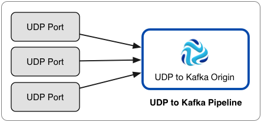

# UDP到Kafka（已弃用）

UDP到Kafka的来源会从一个或多个UDP端口读取消息，并将每条消息直接写入Kafka。但是，不推荐使用从Kafka到UDP的UDP，并且在以后的版本中将其删除。我们建议使用 [UDP多线程源起源](https://streamsets.com/documentation/controlhub/latest/help/datacollector/UserGuide/Origins/UDPMulti.html#concept_wng_g5f_5bb)，它可以使用多个线程来启用来自多个UDP端口的数据并行处理。

使用从UDP到Kafka的UDP可以从多个UDP端口读取大量数据，并将数据立即写入Kafka，而无需进行其他处理。

这是使用UDP到Kafka的推荐架构示例：



如果需要在将数据写入Kafka之前处理数据，需要写入除Kafka以外的目标系统，或者如果原始数据不需要处理大量数据，请使用UDP Source原始数据。

UDP到Kafka 可以处理[收集的](https://collectd.org/)消息，NetFlow 5和NetFlow 9消息以及以下类型的syslog消息：

- [RFC 5424](https://tools.ietf.org/html/rfc5424)
- [RFC 3164](https://tools.ietf.org/html/rfc3164)
- 非标准通用消息，例如RFC 3339日期，没有版本数字

在处理NetFlow消息时，该阶段会根据NetFlow版本生成不同的记录。处理NetFlow 9时，将基于NetFlow 9配置属性生成记录。有关更多信息，请参见[NetFlow数据处理](https://streamsets.com/documentation/controlhub/latest/help/datacollector/UserGuide/Data_Formats/NetFlow_Overview.html#concept_thl_nnr_hbb)。

在将UDP配置为Kafka时，可以指定要使用的UDP端口，Kafka配置信息以及高级属性（例如，最大写入请求数）。

您可以添加Kafka配置属性并根据需要启用Kafka安全性。

## 管道配置

当您在管道中使用UDP转换为Kafka来源时，请将来源连接到垃圾箱目标。

UDP到Kafka的源直接将记录写到Kafka。源服务器不会将记录传递到其输出端口，因此您无法执行其他处理或将数据写入其他目标系统。

但是，由于管道需要目标，因此您应将源连接到“废纸destination”目标，以满足管道验证的要求。

具有UDP到Kafka来源的管道应如下所示：


## 卡夫卡的其他属性

您可以将自定义Kafka配置属性添加到UDP到Kafka的来源。

添加Kafka配置属性时，请输入确切的属性名称和值。该阶段不验证属性名称或值。

默认情况下定义了几个属性，您可以根据需要编辑或删除这些属性。

**注意：**由于该阶段使用多个配置属性，因此它将忽略以下属性的用户定义值：

- key.serializer.class
- metadata.broker.list
- partitioner.class
- 生产者类型
- serializer.class

## 启用Kafka安全

您可以将UDP配置为来自Kafka的源，以通过SSL / TLS和/或Kerberos安全地连接至Kafka。

### 启用SSL / TLS

执行以下步骤以使UDP到Kafka的源能够使用SSL / TLS连接到Kafka。

1. 要使用SSL / TLS进行连接，首先请确保按照[Kafka文档](http://kafka.apache.org/documentation.html#security_ssl)中的[说明](http://kafka.apache.org/documentation.html#security_ssl)为Kafka配置了SSL / TLS 。

2. 在阶段的“ **常规”**选项卡上，将“ **阶段库”**属性设置为适当的Apache Kafka版本。

3. 在**Kafka**选项卡上，添加 **security.protocol** Kafka配置属性并将其设置为**SSL**。

4. 然后添加并配置以下SSL Kafka属性：

   - ssl.truststore.location
   - ssl.truststore.password

   当Kafka代理要求客户端身份验证时-ssl.client.auth代理属性设置为“必需”时-添加并配置以下属性：

   - ssl.keystore.location
   - ssl.keystore.password
   - ssl.key.password

   一些经纪人可能还需要添加以下属性：

   - ssl.enabled.protocols
   - ssl.truststore.type
   - ssl.keystore.type

   有关这些属性的详细信息，请参见Kafka文档。

例如，以下属性允许该阶段使用SSL / TLS通过客户端身份验证连接到Kafka：


### 启用Kerberos（SASL）

使用Kerberos身份验证时，Data Collector 使用Kerberos主体和密钥表连接到Kafka。执行以下步骤以使UDP到Kafka的源能够使用Kerberos连接到Kafka。

1. 要使用Kerberos，首先请确保按照[Kafka文档](http://kafka.apache.org/documentation.html#security_sasl)中的[说明](http://kafka.apache.org/documentation.html#security_sasl)为Kafka配置了Kerberos 。

2. 确保Kerberos身份验证是否启用了数据采集，如在[Kerberos身份验证](https://streamsets.com/documentation/controlhub/latest/help/datacollector/UserGuide/Configuration/Kerberos.html#concept_hnm_n4l_xs)。

3. 根据您的安装和身份验证类型，添加Kafka客户端所需的Java身份验证和授权服务（JAAS）配置属性：

   - 没有LDAP身份验证的RPM，tarball或Cloudera Manager安装

      -如果

     Data Collector

     不使用LDAP身份验证，请在

     Data Collector

      计算机上创建一个单独的JAAS配置文件。将以下

     ```
     KafkaClient
     ```

     登录部分添加到文件中：

     ```
     KafkaClient {
         com.sun.security.auth.module.Krb5LoginModule required
         useKeyTab=true
         keyTab="<keytab path>"
         principal="<principal name>/<host name>@<realm>";
     };
     ```

     例如：

     ```
     KafkaClient {
         com.sun.security.auth.module.Krb5LoginModule required
         useKeyTab=true
         keyTab="/etc/security/keytabs/sdc.keytab"
         principal="sdc/sdc-01.streamsets.net@EXAMPLE.COM";
     };
     ```

     然后修改SDC_JAVA_OPTS环境变量，使其包含以下选项，这些选项定义了JAAS配置文件的路径：

     ```
     -Djava.security.auth.login.config=<JAAS config path>
     ```

     使用安装类型所需的方法。

   - 使用LDAP认证的RPM或tarball安装

      -如果在RPM或tarball的安装中启用了LDAP认证，则将属性添加到

     Data Collector

     使用的JAAS配置文件中-该 

     ```
     $SDC_CONF/ldap-login.conf
     ```

     文件。将以下

     ```
     KafkaClient
     ```

     登录部分添加 到 

     ```
     ldap-login.conf
     ```

      文件末尾：

     ```
     KafkaClient {
         com.sun.security.auth.module.Krb5LoginModule required
         useKeyTab=true
         keyTab="<keytab path>"
         principal="<principal name>/<host name>@<realm>";
     };
     ```

     例如：

     ```
     KafkaClient {
         com.sun.security.auth.module.Krb5LoginModule required
         useKeyTab=true
         keyTab="/etc/security/keytabs/sdc.keytab"
         principal="sdc/sdc-01.streamsets.net@EXAMPLE.COM";
     };
     ```

   - 使用LDAP身份验证的Cloudera Manager安装

      -如果在Cloudera Manager安装中启用了LDAP身份验证，请在Cloudera Manager中为StreamSets服务启用LDAP配置文件替换（ldap.login.file.allow.substitutions）属性。

     如果启用了“使用安全阀编辑LDAP信息（use.ldap.login.file）”属性，并且在ldap-login.conf字段的“数据收集器高级配置代码段（安全阀）”中配置了LDAP身份验证，则添加JAAS配置属性与ldap-login.conf安全阀相同。

     如果通过LDAP属性而不是ldap-login.conf安全值配置LDAP身份验证，则将JAAS配置属性添加到generate-ldap-login-append.conf字段的数据收集器高级配置代码片段（安全阀）中。

     将以下`KafkaClient`登录部分添加 到适当的字段，如下所示：

     ```
     KafkaClient {
         com.sun.security.auth.module.Krb5LoginModule required
         useKeyTab=true
         keyTab="_KEYTAB_PATH"
         principal="<principal name>/_HOST@<realm>";
     };
     ```

     例如：

     ```
     KafkaClient {
         com.sun.security.auth.module.Krb5LoginModule required
         useKeyTab=true
         keyTab="_KEYTAB_PATH"
         principal="sdc/_HOST@EXAMPLE.COM";
     };
     ```

     Cloudera Manager会生成适当的密钥表路径和主机名。

4. 在阶段的“ **常规”**选项卡上，将“ **阶段库”**属性设置为适当的Apache Kafka版本。

5. 在**Kafka**选项卡上，添加 **security.protocol** Kafka配置属性，并将其设置为**SASL_PLAINTEXT**。

6. 然后，添加 **sasl.kerberos.service.name**配置属性，并将其设置为**kafka**。

例如，以下Kafka属性允许使用Kerberos连接到Kafka：


### 启用SSL / TLS和Kerberos

您可以启用UDP至Kafka的源，以使用SSL / TLS和Kerberos连接至Kafka。

要使用SSL / TLS和Kerberos，请组合所需的步骤以启用每个步骤并按如下所示设置security.protocol属性：

1. 确保Kafka已配置为使用以下Kafka文档中所述的SSL / TLS和Kerberos（SASL）：

   - http://kafka.apache.org/documentation.html#security_ssl
   - http://kafka.apache.org/documentation.html#security_sasl

2. 确保Kerberos身份验证是否启用了数据采集，如在[Kerberos身份验证](https://streamsets.com/documentation/controlhub/latest/help/datacollector/UserGuide/Configuration/Kerberos.html#concept_hnm_n4l_xs)。

3. 根据您的安装和身份验证类型，添加Kafka客户端所需的Java身份验证和授权服务（JAAS）配置属性：

   - 没有LDAP身份验证的RPM，tarball或Cloudera Manager安装

      -如果

     Data Collector

     不使用LDAP身份验证，请在

     Data Collector

      计算机上创建一个单独的JAAS配置文件。将以下

     ```
     KafkaClient
     ```

     登录部分添加到文件中：

     ```
     KafkaClient {
         com.sun.security.auth.module.Krb5LoginModule required
         useKeyTab=true
         keyTab="<keytab path>"
         principal="<principal name>/<host name>@<realm>";
     };
     ```

     例如：

     ```
     KafkaClient {
         com.sun.security.auth.module.Krb5LoginModule required
         useKeyTab=true
         keyTab="/etc/security/keytabs/sdc.keytab"
         principal="sdc/sdc-01.streamsets.net@EXAMPLE.COM";
     };
     ```

     然后修改SDC_JAVA_OPTS环境变量，使其包含以下选项，这些选项定义了JAAS配置文件的路径：

     ```
     -Djava.security.auth.login.config=<JAAS config path>
     ```

     使用安装类型所需的方法。

   - 使用LDAP认证的RPM或tarball安装

      -如果在RPM或tarball的安装中启用了LDAP认证，则将属性添加到

     Data Collector

     使用的JAAS配置文件中-该 

     ```
     $SDC_CONF/ldap-login.conf
     ```

     文件。将以下

     ```
     KafkaClient
     ```

     登录部分添加 到 

     ```
     ldap-login.conf
     ```

      文件末尾：

     ```
     KafkaClient {
         com.sun.security.auth.module.Krb5LoginModule required
         useKeyTab=true
         keyTab="<keytab path>"
         principal="<principal name>/<host name>@<realm>";
     };
     ```

     例如：

     ```
     KafkaClient {
         com.sun.security.auth.module.Krb5LoginModule required
         useKeyTab=true
         keyTab="/etc/security/keytabs/sdc.keytab"
         principal="sdc/sdc-01.streamsets.net@EXAMPLE.COM";
     };
     ```

   - 使用LDAP身份验证的Cloudera Manager安装

      -如果在Cloudera Manager安装中启用了LDAP身份验证，请在Cloudera Manager中为StreamSets服务启用LDAP配置文件替换（ldap.login.file.allow.substitutions）属性。

     如果启用了“使用安全阀编辑LDAP信息（use.ldap.login.file）”属性，并且在ldap-login.conf字段的“数据收集器高级配置代码段（安全阀）”中配置了LDAP身份验证，则添加JAAS配置属性与ldap-login.conf安全阀相同。

     如果通过LDAP属性而不是ldap-login.conf安全值配置LDAP身份验证，则将JAAS配置属性添加到generate-ldap-login-append.conf字段的数据收集器高级配置代码片段（安全阀）中。

     将以下`KafkaClient`登录部分添加 到适当的字段，如下所示：

     ```
     KafkaClient {
         com.sun.security.auth.module.Krb5LoginModule required
         useKeyTab=true
         keyTab="_KEYTAB_PATH"
         principal="<principal name>/_HOST@<realm>";
     };
     ```

     例如：

     ```
     KafkaClient {
         com.sun.security.auth.module.Krb5LoginModule required
         useKeyTab=true
         keyTab="_KEYTAB_PATH"
         principal="sdc/_HOST@EXAMPLE.COM";
     };
     ```

     Cloudera Manager会生成适当的密钥表路径和主机名。

4. 在阶段的“ **常规”**选项卡上，将“ **阶段库”**属性设置为适当的Apache Kafka版本。

5. 在**Kafka**选项卡上，添加 **security.protocol**属性并将其设置为 **SASL_SSL**。

6. 然后，添加 **sasl.kerberos.service.name**配置属性，并将其设置为**kafka**。

7. 然后添加并配置以下SSL Kafka属性：

   - ssl.truststore.location
   - ssl.truststore.password

   当Kafka代理要求客户端身份验证时-ssl.client.auth代理属性设置为“必需”时-添加并配置以下属性：

   - ssl.keystore.location
   - ssl.keystore.password
   - ssl.key.password

   一些经纪人可能还需要添加以下属性：

   - ssl.enabled.protocols
   - ssl.truststore.type
   - ssl.keystore.type

   有关这些属性的详细信息，请参见Kafka文档。

## 将UDP配置为Kafka来源

将UDP配置为来自Kafka的源以处理UDP消息并将其直接写入Kafka。

1. 在“属性”面板的“ **常规”**选项卡上，配置以下属性：

   | 一般财产                                                     | 描述                                                         |
   | :----------------------------------------------------------- | :----------------------------------------------------------- |
   | 名称                                                         | 艺名。                                                       |
   | 描述                                                         | 可选说明。                                                   |
   | 舞台库                                                       | 您要使用的库版本。                                           |
   | [记录错误](https://streamsets.com/documentation/controlhub/latest/help/datacollector/UserGuide/Pipeline_Design/ErrorHandling.html#concept_atr_j4y_5r) | 该阶段的错误记录处理：放弃-放弃记录。发送到错误-将记录发送到管道以进行错误处理。停止管道-停止管道。对群集管道无效。 |

2. 在“ **UDP”**选项卡上，配置以下属性：

   | UDP属性  | 描述                                                         |
   | :------- | :----------------------------------------------------------- |
   | 港口     | 侦听数据的端口。使用[简单或批量编辑模式](https://streamsets.com/documentation/controlhub/latest/help/datacollector/UserGuide/Pipeline_Configuration/SimpleBulkEdit.html#concept_alb_b3y_cbb)，单击 **添加**图标以列出其他端口。要监听低于1024的端口，必须由具有root特权的用户运行Data Collector。否则，操作系统不允许Data Collector绑定到端口。**注意：**没有其他管道或进程已经可以绑定到侦听端口。侦听端口只能由单个管道使用。 |
   | 资料格式 | UDP传递的数据格式：已收集网络流系统日志                      |

3. 在“ **卡夫卡”**选项卡上，配置以下属性：

   | UDP属性                                                      | 描述                                                         |
   | :----------------------------------------------------------- | :----------------------------------------------------------- |
   | 经纪人URI                                                    | Kafka代理的连接字符串。使用以下格式：`:`。要确保连接，请输入以逗号分隔的其他代理URI列表。 |
   | 话题                                                         | 卡夫卡主题阅读。                                             |
   | Kafka配置 [](https://streamsets.com/documentation/controlhub/latest/help/datacollector/UserGuide/Origins/UDPtoKafka.html#concept_owg_1hc_rw) | 要使用的其他Kafka配置属性。使用[简单或批量编辑模式](https://streamsets.com/documentation/controlhub/latest/help/datacollector/UserGuide/Pipeline_Configuration/SimpleBulkEdit.html#concept_alb_b3y_cbb)，单击 **添加**图标以添加属性。定义Kafka属性名称和值。使用Kafka期望的属性名称和值。有关启用与Kafka的安全连接的信息，请参阅[启用Kafka安全性](https://streamsets.com/documentation/controlhub/latest/help/datacollector/UserGuide/Origins/UDPtoKafka.html#concept_kn3_tjc_rw)。 |

4. 在“ **高级”**选项卡上，配置以下属性：

   | 先进物业      | 描述                                                         |
   | :------------ | :----------------------------------------------------------- |
   | 启用UDP多线程 | 指定是否对每个端口使用多个接收器线程。使用多个接收器线程可以提高性能。您可以使用epoll使用多个接收器线程，当Data Collector在最新版本的64位Linux上运行时，该线程可以使用。 |
   | 接受线程      | 每个端口要使用的接收器线程数。例如，如果您在每个端口上配置两个线程，并将原始服务器配置为使用三个端口，则原始服务器总共使用六个线程。当epoll在Data Collector计算机上可用时，用于增加将数据传递到源的线程数。默认值为1。 |
   | 写并发        | 源可以用来写入Kafka的最大Kafka客户端数量。配置此属性时，请考虑Kafka代理的数量，分区和要写入的数据量。 |

5. 对于NetFlow 9数据，在**NetFlow 9**选项卡上，配置以下属性：

   处理早期版本的NetFlow数据时，将忽略这些属性。

   | Netflow 9属性                                                | 描述                                                         |
   | :----------------------------------------------------------- | :----------------------------------------------------------- |
   | [记录生成方式](https://streamsets.com/documentation/controlhub/latest/help/datacollector/UserGuide/Data_Formats/NetFlow_Overview.html#concept_jdh_hxk_3bb) | 确定要包含在记录中的值的类型。选择以下选项之一：仅原始仅解释原始和解释 |
   | 缓存中的最大模板数                                           | 模板缓存中存储的最大模板数。有关模板的更多信息，请参见[缓存NetFlow 9模板](https://streamsets.com/documentation/controlhub/latest/help/datacollector/UserGuide/Data_Formats/NetFlow_Overview.html#concept_ivr_j1l_3bb)。对于无限的缓存大小，默认值为-1。 |
   | 模板缓存超时（毫秒）                                         | 缓存空闲模板的最大毫秒数。超过指定时间未使用的模板将从缓存中逐出。有关模板的更多信息，请参见 [缓存NetFlow 9模板](https://streamsets.com/documentation/controlhub/latest/help/datacollector/UserGuide/Data_Formats/NetFlow_Overview.html#concept_ivr_j1l_3bb)。无限期缓存模板的默认值为-1。 |