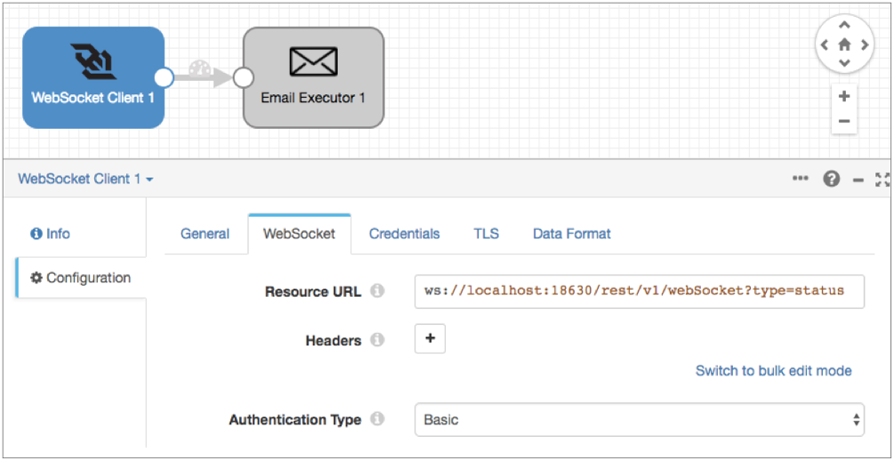

# WebSocket客户端

[支持的管道类型：](https://streamsets.com/documentation/controlhub/latest/help/datacollector/UserGuide/Pipeline_Configuration/ProductIcons_Doc.html#concept_mjg_ly5_pgb) 资料收集器 数据收集器边缘

WebSocket客户端源从WebSocket服务器端点读取数据。使用源从WebSocket资源URL读取数据。当在微服务管道中使用时，起点还可以将响应发送回起点系统。

当管道启动时，WebSocket客户端源将打开与WebSocket服务器端点的连接，并可以选择向服务器发送初始消息。然后，WebSocket服务器将数据推送到WebSocket客户端源。数据到达时，源将创建并发送一批。每批的大小根据服务器端点发送的数据的大小而变化。当管道停止时，原点关闭与端点的连接。

配置WebSocket客户端源时，可以定义用于请求的资源URL和标头。您可以配置源不使用身份验证或基本身份验证来连接到WebSocket服务器端点。

当您希望起点将响应作为微服务管道的一部分发送回起点系统时，可以配置响应的数据格式和其他特征。

您还可以配置SSL / TLS属性，包括默认的传输协议和密码套件。

**提示：** Data Collector提供了两个WebSocket来源来满足不同的需求。有关快速比较表以帮助您选择合适的表，请参阅[比较WebSocket起源](https://streamsets.com/documentation/controlhub/latest/help/datacollector/UserGuide/Origins/Origins_overview.html#concept_wz5_jqm_gbb)。

## 从数据收集器读取REST响应数据

您可以使用WebSocket客户端源读取由Data Collector生成的REST响应 JSON数据。 有关REST响应JSON数据的更多信息，请参阅Data Collector 文档中的[Rest响应](https://streamsets.com/documentation/datacollector/latest/help/#datacollector/UserGuide/Administration/Administration_title.html%23concept_dlh_p15_2r)。

数据收集器可以用作WebSocket服务器端点，因为WebSocket服务器只是侦听遵循特定协议的服务器任何端口上的TCP应用程序。

例如，假设您的数据收集器 运行了二十个管道，并且当任何[管道状态](https://streamsets.com/documentation/controlhub/latest/help/datacollector/UserGuide/Pipeline_Maintenance/PipelineStates-Understanding.html#concept_s4p_ns5_nz)更改为Run_Error 时，您都希望收到一封电子邮件。您不想为所有二十个管道配置电子邮件通知，而是为所有正在运行的管道配置单个全局电子邮件通知。

您可以设计一个管道，该管道使用WebSocket客户端源从Data Collector生成的REST响应数据中读取管道状态。您可以将源连接到电子邮件执行程序，以在每次管道状态更改为Run_Error时发送电子邮件。

**重要说明：** WebSocket客户端来源不会生成事件。通常，您仅在事件生成阶段之后才使用执行程序，因为为每个管道记录运行执行程序是一种不常见的情况，并且会降低性能。但是，在这种情况下，我们管道的唯一目的是仅在另一个管道变为特定状态时才发送电子邮件-我们不希望这种情况经常发生。

设计管道如下：

1. 添加WebSocket客户端源，并将源配置为从以下资源URL读取：

   ```
   ws://<Data Collector host>:<Data Collector port>/rest/v1/webSocket?type=status
   ```

2. 将源配置为使用基本身份验证，然后在“ **凭据”**选项卡上输入有效的Data Collector用户名和密码。

3. 在“ **数据格式”**选项卡上，配置源以处理JSON数据格式。

4. 在画布上添加一个电子邮件执行器，并将其连接到源。

5. 在执行程序的“ 

   电子邮件”

   选项卡上，输入以下条件，以便执行程序仅在管道状态更改为Run_Error时才发送电子邮件：

   ```
   ${record:value('/status') == 'RUN_ERROR'}
   ```

6. 配置执行者的电子邮件ID，主题和正文。

   有关配置执行程序的更多详细信息，请参阅[电子邮件执行程序](https://streamsets.com/documentation/controlhub/latest/help/datacollector/UserGuide/Executors/Email.html#concept_sjs_sfp_qz)。在运行包含Email executor的管道之前，必须启用 Data Collector来[发送email](https://streamsets.com/documentation/controlhub/latest/help/datacollector/UserGuide/Configuration/SendingEmail.html#concept_it1_wwg_xz)。

配置的管道如下所示：



## 生成的微服务响应

在[微服务管道中](https://streamsets.com/documentation/controlhub/latest/help/datacollector/UserGuide/Microservice/Microservice_Title.html#concept_qfh_xdm_p2b)，WebSocket客户端源可以将响应发送回源WebSocket服务器。

生成的响应包含：

- 从[微服务目的地](https://streamsets.com/documentation/controlhub/latest/help/datacollector/UserGuide/Microservice/Microservice_Title.html#concept_wht_tbf_kfb)收到的记录
- 将管道配置为使用“向原点发送响应”管道错误处理时收到的管道错误记录

源为收到的每批记录生成一个响应。源可以生成JSON或XML格式的响应。响应可以包含信封或仅包含原始数据。

### 带信封的响应

当配置为发送带有信封的响应时，源将生成一个响应，其中包括状态码，来自微服务目标的数据，来自管道的错误记录以及第一条错误消息。生成的响应包括以下JSON密钥或XML元素：

| 响应键或元素   | 值                                                           |
| :------------- | :----------------------------------------------------------- |
| httpStatusCode | 与响应中的记录关联的状态代码。如果生成的响应中的记录共享相同的状态代码，则该代码将写入httpStatusCode键或元素。如果记录具有不同的状态代码，则将多个状态的httpStatusCode设置为207。 |
| 数据           | 管道中使用的微服务目的地传递到源的记录的列表。               |
| 错误           | 通过将响应发送到原始管道错误处理传递到原始管道的错误记录的列表。 |
| 错误信息       | 与响应中的第一个错误记录关联的错误消息。仅在响应包含错误记录时使用。 |

例如，以JSON格式生成的带有信封的响应具有以下结构：

```
{
"httpStatusCode":<status code>,
"data":[<list of success records>],
"error":[<list of error records>],
"errorMessage": <error message, if any>
}
```

### 原始回应

配置为发送原始响应时，原始服务器将生成一个响应，其中包含从微服务目的地传递的记录列表或由“将响应发送到原始位置”管道错误处理传递的错误记录列表。如果起点从目的地接收数据记录，而从管道接收错误记录，则起点仅在响应中包括错误记录。如果起点未收到来自目的地的数据记录，也未收到来自管道的错误记录，则起点将生成空响应。

### 样本回应

以下JSON格式的示例显示了当源接收单个记录和多个记录时带信封的响应和不带信封的原始响应：

- 单条记录

  源从发送响应到源目的地接收一条记录。目标配置为使用200状态代码。对于带有信封的响应，源将发送以下响应：`{ "httpStatusCode":200, "data":[{"ID":"103","NAME":"Jack","AGE":"37","STATE":"MD"}], "error":[], "errorMessage":null }`对于原始响应，源将发送以下响应：`{"ID":"103","NAME":"Jack","AGE":"37","STATE":"MD"}`

- 多个数据和错误记录

  原点接收多个记录，数据和错误。因为每个记录都有不同的状态码，所以响应将状态码207用于多个状态。errorMessage关键字包含与第一个记录相关联的错误，该记录具有丢失的ID。原点配置为将多个记录显示为多个JSON对象。对于带有信封的响应，源将发送以下响应：`{ "httpStatusCode":207, "data":[{"ID":"248","NAME":"Pina","AGE":"24","STATE":"RI"}], "error":[{"NAME":"Liz","AGE":"37","STATE":"DE"}, {"ID":"302","NAME":"Roco","AGE":"","STATE":"CA"}], "errorMessage":"COMMON_0001 - Stage precondition: CONTAINER_0051 - Unsatisfied precondition(s) '${record:exists('/ID')}'" }`对于原始响应，源将发送以下响应：`{"NAME":"Liz","AGE":"37","STATE":"DE"}, {"ID":"302","NAME":"Roco","AGE":"","STATE":"CA"}`

## 资料格式

WebSocket客户端起源根据您选择的数据格式对数据进行不同的处理。

在Data Collector Edge管道中， 原点仅支持Binary，Delimited，JSON，SDC Record和Text数据格式。

WebSocket客户端原始处理数据格式如下：

- 二元

  生成一条记录，在记录的根部有一个单字节数组字段。

  当数据超过用户定义的最大数据大小时，原点将无法处理数据。因为未创建记录，所以源无法将记录传递到管道以将其写为错误记录。相反，原点会产生阶段误差。

- 数据报

  为每条消息生成一条记录。源可以处理[收集的](https://collectd.org/)消息，NetFlow 5和NetFlow 9消息以及以下类型的syslog消息：[RFC 5424](https://tools.ietf.org/html/rfc5424)[RFC 3164](https://tools.ietf.org/html/rfc3164)非标准通用消息，例如RFC 3339日期，没有版本数字

  在处理NetFlow消息时，该阶段会根据NetFlow版本生成不同的记录。处理NetFlow 9时，将基于NetFlow 9配置属性生成记录。有关更多信息，请参见[NetFlow数据处理](https://streamsets.com/documentation/controlhub/latest/help/datacollector/UserGuide/Data_Formats/NetFlow_Overview.html#concept_thl_nnr_hbb)。

- 定界

  为每个定界线生成一条记录。您可以使用以下定界格式类型：**默认CSV-**包含逗号分隔值的文件。忽略文件中的空行。**RFC4180 CSV-**严格遵循RFC4180准则的逗号分隔文件。**MS Excel CSV** -Microsoft Excel逗号分隔文件。**MySQL CSV** -MySQL逗号分隔文件。**制表符分隔的值** -包含制表符分隔的值的文件。**PostgreSQL CSV** -PostgreSQL逗号分隔文件。**PostgreSQL文本** -PostgreSQL文本文件。**自定义** -使用用户定义的定界符，转义符和引号字符的文件。**多字符**定界-使用多个用户定义的字符定界字段和行以及单个用户定义的转义和引号字符的文件。

  您可以将列表或列表映射根字段类型用于定界数据，并且可以选择在标题行中包括字段名称（如果有）。有关根字段类型的更多信息，请参见定界[数据根字段类型](https://streamsets.com/documentation/controlhub/latest/help/datacollector/UserGuide/Data_Formats/Delimited.html#concept_zcg_bm4_fs)。

  使用标题行时，可以启用带有其他列的记录处理。其他列使用自定义的前缀和顺序递增的顺序整数，如命名 `_extra_1`， `_extra_2`。当您禁止其他列时，包含其他列的记录将发送到错误。

  您也可以将字符串常量替换为空值。

  当记录超过为该阶段定义的最大记录长度时，该阶段将根据为该阶段配置的错误处理来处理对象。

- JSON格式

  为每个JSON对象生成一条记录。您可以处理包含多个JSON对象或单个JSON数组的JSON文件。

  当对象超过为原点定义的最大对象长度时，原点会根据为阶段配置的错误处理来处理对象。

- 记录

  为每个日志行生成一条记录。

  当一条线超过用户定义的最大线长时，原点会截断更长的线。

  您可以将处理后的日志行作为字段包含在记录中。如果日志行被截断，并且您在记录中请求日志行，则原点包括被截断的行。

  您可以定义要读取的[日志格式](https://streamsets.com/documentation/controlhub/latest/help/datacollector/UserGuide/Data_Formats/LogFormats.html#concept_tr1_spd_sr)或类型。

- 原虫

  为每个protobuf消息生成一条记录。默认情况下，来源假设邮件包含多个protobuf邮件。

  Protobuf消息必须与指定的消息类型匹配，并在描述符文件中进行描述。

  当记录的数据超过1 MB时，源将无法继续处理消息中的数据。源根据阶段错误处理属性处理消息，并继续读取下一条消息。

  有关生成描述符文件的信息，请参阅[Protobuf数据格式先决条件](https://streamsets.com/documentation/controlhub/latest/help/datacollector/UserGuide/Data_Formats/Protobuf-Prerequisites.html)。

- SDC记录

  为每条记录生成一条记录。用于处理由数据收集器 管道使用SDC记录数据格式生成的记录。

  对于错误记录，原点提供从原始管道中的原点读取的原始记录，以及可用于更正记录的错误信息。

  处理错误记录时，来源希望原始管道生成的错误文件名和内容。

- 文本

  根据自定义定界符为每行文本或每段文本生成一条记录。

  当线或线段超过为原点定义的最大线长时，原点会截断它。原点添加了一个名为Truncated的布尔字段，以指示该行是否被截断。

  有关使用自定义定界符处理文本的更多信息，请参见[使用自定义定界符的文本数据格式](https://streamsets.com/documentation/controlhub/latest/help/datacollector/UserGuide/Data_Formats/TextCDelim.html#concept_lg2_gcg_jx)。

- XML格式

  根据用户定义的定界符元素生成记录。在根元素下直接使用XML元素或定义简化的XPath表达式。如果未定义定界符元素，则源会将XML文件视为单个记录。

  默认情况下，生成的记录包括XML属性和名称空间声明作为记录中的字段。您可以配置阶段以将它们包括在记录中作为字段属性。

  您可以在字段属性中包含每个解析的XML元素和XML属性的XPath信息。这还将每个名称空间放置在xmlns记录头属性中。**注意：** 只有在目标中使用SDC RPC数据格式时，字段属性和记录头属性才会自动写入目标系统。有关使用字段属性和记录标题属性以及如何将它们包括在记录中的更多信息，请参见[字段属性](https://streamsets.com/documentation/controlhub/latest/help/datacollector/UserGuide/Pipeline_Design/FieldAttributes.html#concept_xfm_wtp_1z)和[记录标题属性](https://streamsets.com/documentation/controlhub/latest/help/datacollector/UserGuide/Pipeline_Design/RecordHeaderAttributes.html#concept_wn2_jcz_dz)。

  当记录超过用户定义的最大记录长度时，原点将跳过该记录并继续处理下一条记录。它将跳过的记录发送到管道以进行错误处理。

  使用XML数据格式来处理有效的XML文档。有关XML处理的更多信息，请参见[阅读和处理XML数据](https://streamsets.com/documentation/controlhub/latest/help/datacollector/UserGuide/Data_Formats/XMLDFormat.html#concept_lty_42b_dy)。

  **提示：** 如果要处理无效的XML文档，则可以尝试将文本数据格式与自定义分隔符一起使用。有关更多信息，请参见 [使用自定义分隔符处理XML数据](https://streamsets.com/documentation/controlhub/latest/help/datacollector/UserGuide/Data_Formats/TextCDelim.html#concept_okt_kmg_jx)。

## 配置WebSocket客户端起源

配置WebSocket客户端源以从WebSocket服务器端点读取数据。

1. 在“属性”面板的“ **常规”**选项卡上，配置以下属性：

   | 一般财产                                                     | 描述                                                         |
   | :----------------------------------------------------------- | :----------------------------------------------------------- |
   | 名称                                                         | 艺名。                                                       |
   | 描述                                                         | 可选说明。                                                   |
   | [记录错误](https://streamsets.com/documentation/controlhub/latest/help/datacollector/UserGuide/Pipeline_Design/ErrorHandling.html#concept_atr_j4y_5r) | 该阶段的错误记录处理：放弃-放弃记录。发送到错误-将记录发送到管道以进行错误处理。停止管道-停止管道。 |

2. 在“ **WebSocket”**选项卡上，配置以下属性：

   | WebSocket属性 | 描述                                                         |
   | :------------ | :----------------------------------------------------------- |
   | 资源网址      | WebSocket资源URL。输入以下格式：`://:`使用wss通过HTTPS进行安全的WebSocket连接。例如：`ws://localhost:8080`默认情况 `ws://localhost:18630/rest/v1/webSocket?type=status` 下，本地运行的Data Collector将用作WebSocket服务器端点。此默认配置将源配置为侦听此Data Collector上所有正在运行的管道的状态更改。有关此示例的更多详细信息，请[参阅从Data Collector读取REST响应数据](https://streamsets.com/documentation/controlhub/latest/help/datacollector/UserGuide/Origins/WebSocketClient.html#concept_cl3_4w4_gbb)。 |
   | 标头          | 要包含在请求中的可选标头。使用[简单或批量编辑模式](https://streamsets.com/documentation/controlhub/latest/help/datacollector/UserGuide/Pipeline_Configuration/SimpleBulkEdit.html#concept_alb_b3y_cbb)，单击 **添加**图标以添加其他标题。 |
   | 索取资料      | 发送到WebSocket服务器的可选初始消息或命令。输入文本或JSON格式的消息。当WebSocket服务器需要初始消息时使用。例如，如果使用Ripple WebSocket服务器，则可以输入以下初始消息以开始从服务器接收选定的流：`{    "command":"subscribe",    "id":0,    "streams":["ledger"] }` |
   | 认证类型      | 确定用于连接到WebSocket服务器端点的身份验证类型：无-不执行身份验证。基本-使用基本身份验证。需要用户名和密码。通过HTTPS与WebSocket协议一起使用，以避免传递未加密的凭据。 |

3. 在“ **凭据”**选项卡上，输入配置基本身份验证时要使用的凭据。

   **提示：** 为了保护敏感信息，例如用户名和密码，可以使用 [运行时资源](https://streamsets.com/documentation/controlhub/latest/help/datacollector/UserGuide/Pipeline_Configuration/RuntimeValues.html#concept_bs4_5nm_2s)或凭据存储。有关凭证存储的更多信息，请参阅Data Collector文档中的[凭证存储](https://streamsets.com/documentation/datacollector/latest/help/#datacollector/UserGuide/Configuration/CredentialStores.html)。

4. 要使用SSL / TLS，请在“ **TLS”**选项卡上配置以下属性：

   在Data Collector Edge管道中，仅“ **使用TLS”**和“ **信任库文件”**属性有效。启用TLS之后，为使用PEM格式的信任库文件输入绝对路径。在Data Collector Edge管道中，WebSocket客户端源始终使用默认协议和密码套件。它忽略所有其他TLS属性。

   | TLS属性                                                      | 描述                                                         |
   | :----------------------------------------------------------- | :----------------------------------------------------------- |
   | 使用TLS                                                      | 启用TLS的使用。                                              |
   | [信任库文件](https://streamsets.com/documentation/controlhub/latest/help/datacollector/UserGuide/Pipeline_Configuration/SSL-TLS.html#concept_kqb_rqf_5z) | 信任库文件的路径。输入文件的绝对路径或相对于Data Collector资源目录的路径：$ SDC_RESOURCES。有关环境变量的更多信息，请参阅 Data Collector 文档中的Data Collector [环境配置](https://streamsets.com/documentation/datacollector/latest/help/#datacollector/UserGuide/Configuration/DCEnvironmentConfig.html)。默认情况下，不使用任何信任库。在Data Collector Edge管道中，输入使用PEM格式的文件的绝对路径。 |
   | 信任库类型                                                   | 要使用的信任库的类型。使用以下类型之一：Java密钥库文件（JKS）PKCS＃12（p12文件）默认值为Java密钥库文件（JKS）。 |
   | 信任库密码                                                   | 信任库文件的密码。密码是可选的，但建议使用。**提示：**为了保护敏感信息（如密码），可以使用[运行时资源](https://streamsets.com/documentation/controlhub/latest/help/datacollector/UserGuide/Pipeline_Configuration/RuntimeValues.html#concept_bs4_5nm_2s)或凭据存储。有关凭证存储的更多信息，请参阅Data Collector文档中的[凭证存储](https://streamsets.com/documentation/datacollector/latest/help/#datacollector/UserGuide/Configuration/CredentialStores.html)。 |
   | 信任库信任算法                                               | 用于管理信任库的算法。默认值为SunX509。                      |
   | 使用默认协议                                                 | 确定要使用的传输层安全性（TLS）协议。默认协议是TLSv1.2。要使用其他协议，请清除此选项。 |
   | [传输协议](https://streamsets.com/documentation/controlhub/latest/help/datacollector/UserGuide/Pipeline_Configuration/SSL-TLS.html#concept_mvs_cxf_5z) | 要使用的TLS协议。要使用默认TLSv1.2以外的协议，请单击“ **添加”**图标并输入协议名称。您可以使用[简单或批量编辑模式](https://streamsets.com/documentation/controlhub/latest/help/datacollector/UserGuide/Pipeline_Configuration/SimpleBulkEdit.html#concept_alb_b3y_cbb)来添加协议。**注意：**较旧的协议不如TLSv1.2安全。 |
   | [使用默认密码套件](https://streamsets.com/documentation/controlhub/latest/help/datacollector/UserGuide/Pipeline_Configuration/SSL-TLS.html#concept_cwx_dyf_5z) | 对SSL / TLS握手使用默认的密码套件。要使用其他密码套件，请清除此选项。 |
   | 密码套房                                                     | 要使用的密码套件。要使用不属于默认密码集的密码套件，请单击“ **添加”**图标并输入密码套件的名称。您可以使用[简单或批量编辑模式](https://streamsets.com/documentation/controlhub/latest/help/datacollector/UserGuide/Pipeline_Configuration/SimpleBulkEdit.html#concept_alb_b3y_cbb)来添加密码套件。输入要使用的其他密码套件的Java安全套接字扩展（JSSE）名称。 |

5. 在“ **数据格式”**选项卡上，配置以下属性：

   | 数据格式属性                                                 | 描述                                                         |
   | :----------------------------------------------------------- | :----------------------------------------------------------- |
   | [资料格式](https://streamsets.com/documentation/controlhub/latest/help/datacollector/UserGuide/Origins/WebSocketClient.html#concept_k3k_czr_fbb) | 要处理的数据类型。使用以下数据格式之一：二元数据报定界JSON格式记录原虫[SDC记录](https://streamsets.com/documentation/controlhub/latest/help/datacollector/UserGuide/Data_Formats/SDCRecordFormat.html#concept_qkk_mwk_br)文本XML格式在Data Collector Edge管道中， 原点仅支持Binary，Delimited，JSON，SDC Record和Text数据格式。 |

6. 对于二进制数据，在“ **数据格式”**选项卡上，配置以下属性：

   | 二元性质                                                     | 描述                                                         |
   | :----------------------------------------------------------- | :----------------------------------------------------------- |
   | [压缩格式](https://streamsets.com/documentation/controlhub/latest/help/datacollector/UserGuide/Data_Formats/DataFormats-Overview.html#concept_uxr_g52_qs) | 文件的压缩格式：无-仅处理未压缩的文件。压缩文件-处理受支持的压缩格式压缩的文件。存档-处理通过支持的存档格式存档的文件。压缩存档-处理通过支持的存档和压缩格式存档和压缩的文件。在Data Collector Edge管道中，源仅支持未压缩和压缩的文件，不支持存档或压缩的存档文件。 |
   | 压缩目录中的文件名模式                                       | 对于归档文件和压缩归档文件，文件名模式表示要在压缩目录中处理的文件。您可以使用UNIX样式的通配符，例如星号或问号。例如，*。json。默认值为*，它处理所有文件。 |
   | 最大数据大小（字节）                                         | 消息中的最大字节数。较大的消息无法处理或写入错误。           |

7. 对于数据报数据，在“ **数据格式”**选项卡上，配置以下属性：

   | 数据报属性                                                   | 描述                                                         |
   | :----------------------------------------------------------- | :----------------------------------------------------------- |
   | 数据报包格式                                                 | 数据包格式：已收集网络流系统日志原始/分离数据                |
   | TypesDB文件路径                                              | 用户提供的types.db文件的路径。覆盖默认的types.db文件。仅用于收集的数据。 |
   | 转换高分辨率时间和间隔                                       | 将收集的高分辨率时间格式间隔和时间戳转换为UNIX时间（以毫秒为单位）。仅用于收集的数据。 |
   | 排除间隔                                                     | 从输出记录中排除间隔字段。仅用于收集的数据。                 |
   | 认证文件                                                     | 可选身份验证文件的路径。使用认证文件接受签名和加密的数据。仅用于收集的数据。 |
   | [记录生成方式](https://streamsets.com/documentation/controlhub/latest/help/datacollector/UserGuide/Data_Formats/NetFlow_Overview.html#concept_jdh_hxk_3bb) | 确定要包含在记录中的值的类型。选择以下选项之一：仅原始仅解释原始和解释仅适用于NetFlow 9数据。 |
   | 缓存中的最大模板数                                           | 模板缓存中存储的最大模板数。有关模板的更多信息，请参见[缓存NetFlow 9模板](https://streamsets.com/documentation/controlhub/latest/help/datacollector/UserGuide/Data_Formats/NetFlow_Overview.html#concept_ivr_j1l_3bb)。对于无限的缓存大小，默认值为-1。仅适用于NetFlow 9数据。 |
   | 模板缓存超时（毫秒）                                         | 缓存空闲模板的最大毫秒数。超过指定时间未使用的模板将从缓存中逐出。有关模板的更多信息，请参见 [缓存NetFlow 9模板](https://streamsets.com/documentation/controlhub/latest/help/datacollector/UserGuide/Data_Formats/NetFlow_Overview.html#concept_ivr_j1l_3bb)。无限期缓存模板的默认值为-1。仅适用于NetFlow 9数据。 |
   | 字符集                                                       | 要处理的消息的字符编码。                                     |
   | [忽略控制字符](https://streamsets.com/documentation/controlhub/latest/help/datacollector/UserGuide/Pipeline_Design/ControlCharacters.html#concept_hfs_dkm_js) | 除去制表符，换行符和回车符以外的所有ASCII控制字符。          |

8. 对于定界数据，在“ **数据格式”**选项卡上，配置以下属性：

   | 定界财产                                                     | 描述                                                         |
   | :----------------------------------------------------------- | :----------------------------------------------------------- |
   | [压缩格式](https://streamsets.com/documentation/controlhub/latest/help/datacollector/UserGuide/Data_Formats/DataFormats-Overview.html#concept_uxr_g52_qs) | 文件的压缩格式：无-仅处理未压缩的文件。压缩文件-处理受支持的压缩格式压缩的文件。存档-处理通过支持的存档格式存档的文件。压缩存档-处理通过支持的存档和压缩格式存档和压缩的文件。在Data Collector Edge管道中，源仅支持未压缩和压缩的文件，不支持存档或压缩的存档文件。 |
   | 压缩目录中的文件名模式                                       | 对于归档文件和压缩归档文件，文件名模式表示要在压缩目录中处理的文件。您可以使用UNIX样式的通配符，例如星号或问号。例如，*。json。默认值为*，它处理所有文件。 |
   | 分隔符格式类型                                               | 分隔符格式类型。使用以下选项之一：**默认CSV-**包含逗号分隔值的文件。忽略文件中的空行。**RFC4180 CSV-**严格遵循RFC4180准则的逗号分隔文件。**MS Excel CSV** -Microsoft Excel逗号分隔文件。**MySQL CSV** -MySQL逗号分隔文件。**制表符分隔的值** -包含制表符分隔的值的文件。**PostgreSQL CSV** -PostgreSQL逗号分隔文件。**PostgreSQL文本** -PostgreSQL文本文件。**自定义** -使用用户定义的定界符，转义符和引号字符的文件。**多字符**定界-使用多个用户定义的字符定界字段和行以及单个用户定义的转义和引号字符的文件。 |
   | 标题行                                                       | 指示文件是否包含标题行以及是否使用标题行。                   |
   | 允许额外的列                                                 | 使用标题行处理数据时，允许处理的记录列数超过标题行中的列数。 |
   | 额外的列前缀                                                 | 用于任何其他列的前缀。额外的列使用前缀和顺序递增的整数来命名，如下所示： ``。例如，`_extra_1`。默认值为 `_extra_`。 |
   | 最大记录长度（字符）                                         | 记录的最大长度（以字符为单位）。较长的记录无法读取。此属性可以受数据收集器解析器缓冲区大小的限制。有关更多信息，请参见[最大记录大小](https://streamsets.com/documentation/controlhub/latest/help/datacollector/UserGuide/Origins/Origins_overview.html#concept_svg_2zl_d1b)。 |
   | 分隔符                                                       | 自定义分隔符格式的分隔符。选择一个可用选项，或使用“其他”输入自定义字符。您可以输入使用格式为Unicode控制符\uNNNN，其中*ñ*是数字0-9或字母AF十六进制数字。例如，输入 \u0000以使用空字符作为分隔符或 \u2028使用行分隔符作为分隔符。默认为竖线字符（\|）。 |
   | 多字符字段定界符                                             | 用于分隔多字符定界符格式的字段的字符。默认值为两个竖线字符（\|\|）。 |
   | 多字符行定界符                                               | 以多字符定界符格式分隔行或记录的字符。默认值为换行符（\ n）。 |
   | 转义符                                                       | 自定义或多字符定界符格式的转义字符。                         |
   | 引用字符                                                     | 自定义或多字符定界符格式的引号字符。                         |
   | 启用评论                                                     | 自定义定界符格式允许注释的数据被忽略。                       |
   | 评论标记                                                     | 为自定义定界符格式启用注释时，标记注释的字符。               |
   | 忽略空行                                                     | 对于自定义分隔符格式，允许忽略空行。                         |
   | [根字段类型](https://streamsets.com/documentation/controlhub/latest/help/datacollector/UserGuide/Data_Formats/Delimited.html#concept_zcg_bm4_fs) | 要使用的根字段类型：列表映射-生成数据索引列表。使您能够使用标准功能来处理数据。用于新管道。列表-生成带有索引列表的记录，该列表带有标头和值的映射。需要使用定界数据功能来处理数据。仅用于维护在1.1.0之前创建的管道。 |
   | 跳过的线                                                     | 读取数据前要跳过的行数。                                     |
   | 解析NULL                                                     | 将指定的字符串常量替换为空值。                               |
   | 空常量                                                       | 字符串常量，用空值替换。                                     |
   | 字符集                                                       | 要处理的文件的字符编码。                                     |
   | [忽略控制字符](https://streamsets.com/documentation/controlhub/latest/help/datacollector/UserGuide/Pipeline_Design/ControlCharacters.html#concept_hfs_dkm_js) | 除去制表符，换行符和回车符以外的所有ASCII控制字符。          |

9. 对于JSON数据，在**数据格式**选项卡上，配置以下属性：

   | JSON属性                                                     | 描述                                                         |
   | :----------------------------------------------------------- | :----------------------------------------------------------- |
   | [压缩格式](https://streamsets.com/documentation/controlhub/latest/help/datacollector/UserGuide/Data_Formats/DataFormats-Overview.html#concept_uxr_g52_qs) | 文件的压缩格式：无-仅处理未压缩的文件。压缩文件-处理受支持的压缩格式压缩的文件。存档-处理通过支持的存档格式存档的文件。压缩存档-处理通过支持的存档和压缩格式存档和压缩的文件。在Data Collector Edge管道中，源仅支持未压缩和压缩的文件，不支持存档或压缩的存档文件。 |
   | 压缩目录中的文件名模式                                       | 对于归档文件和压缩归档文件，文件名模式表示要在压缩目录中处理的文件。您可以使用UNIX样式的通配符，例如星号或问号。例如，*。json。默认值为*，它处理所有文件。 |
   | 最大对象长度（字符）                                         | JSON对象中的最大字符数。较长的对象将转移到管道以进行错误处理。此属性可以受数据收集器解析器缓冲区大小的限制。有关更多信息，请参见[最大记录大小](https://streamsets.com/documentation/controlhub/latest/help/datacollector/UserGuide/Origins/Origins_overview.html#concept_svg_2zl_d1b)。 |
   | 字符集                                                       | 要处理的文件的字符编码。                                     |
   | [忽略控制字符](https://streamsets.com/documentation/controlhub/latest/help/datacollector/UserGuide/Pipeline_Design/ControlCharacters.html#concept_hfs_dkm_js) | 除去制表符，换行符和回车符以外的所有ASCII控制字符。          |

10. 对于日志数据，在“ **数据格式”**选项卡上，配置以下属性：

    | 日志属性                                                     | 描述                                                         |
    | :----------------------------------------------------------- | :----------------------------------------------------------- |
    | [压缩格式](https://streamsets.com/documentation/controlhub/latest/help/datacollector/UserGuide/Data_Formats/DataFormats-Overview.html#concept_uxr_g52_qs) | 文件的压缩格式：无-仅处理未压缩的文件。压缩文件-处理受支持的压缩格式压缩的文件。存档-处理通过支持的存档格式存档的文件。压缩存档-处理通过支持的存档和压缩格式存档和压缩的文件。 |
    | 压缩目录中的文件名模式                                       | 对于归档文件和压缩归档文件，文件名模式表示要在压缩目录中处理的文件。您可以使用UNIX样式的通配符，例如星号或问号。例如，*。json。默认值为*，它处理所有文件。 |
    | [日志格式](https://streamsets.com/documentation/controlhub/latest/help/datacollector/UserGuide/Data_Formats/LogFormats.html) | 日志文件的格式。使用以下选项之一：通用日志格式合并日志格式Apache错误日志格式Apache访问日志自定义格式正则表达式格罗模式Log4j通用事件格式（CEF）日志事件扩展格式（LEEF） |
    | 最大线长                                                     | 日志行的最大长度。原点将截断较长的行。此属性可以受数据收集器解析器缓冲区大小的限制。有关更多信息，请参见[最大记录大小](https://streamsets.com/documentation/controlhub/latest/help/datacollector/UserGuide/Origins/Origins_overview.html#concept_svg_2zl_d1b)。 |
    | 保留原始行                                                   | 确定如何处理原始日志行。选择以将原始日志行作为字段包含在结果记录中。默认情况下，原始行被丢弃。 |
    | 字符集                                                       | 要处理的文件的字符编码。                                     |
    | [忽略控制字符](https://streamsets.com/documentation/controlhub/latest/help/datacollector/UserGuide/Pipeline_Design/ControlCharacters.html#concept_hfs_dkm_js) | 除去制表符，换行符和回车符以外的所有ASCII控制字符。          |

    - 当选择“ **Apache访问日志自定义格式”时**，请使用Apache日志格式字符串定义“ **自定义日志格式”**。

    - 选择“ **正则表达式”时**，输入描述日志格式的正则表达式，然后将要包括的字段映射到每个正则表达式组。

    - 选择

      Grok Pattern时

      ，可以使用 

      Grok Pattern Definition

      字段定义自定义grok模式。您可以在每行上定义一个模式。

      在“ **Grok模式”**字段中，输入用于解析日志的模式。您可以使用预定义的grok模式，也可以使用**Grok Pattern Definition中定义的**模式创建自定义grok模式 。

      有关定义grok模式和支持的grok模式的更多信息，请参见[定义Grok模式](https://streamsets.com/documentation/controlhub/latest/help/datacollector/UserGuide/Apx-GrokPatterns/GrokPatterns_title.html#concept_vdk_xjb_wr)。

    - 选择

      Log4j时

      ，定义以下属性：

      | Log4j属性          | 描述                                                         |
      | :----------------- | :----------------------------------------------------------- |
      | 解析错误           | 确定如何处理无法解析的信息：跳过并记录错误-跳过读取行并记录阶段错误。跳过，没有错误-跳过读取行并且不记录错误。包括为堆栈跟踪-包含无法解析为先前读取的日志行的堆栈跟踪的信息。该信息将添加到最后一个有效日志行的消息字段中。 |
      | 使用自定义日志格式 | 允许您定义自定义日志格式。                                   |
      | 自定义Log4J格式    | 使用log4j变量定义自定义日志格式。                            |

11. 对于protobuf数据，在“ **数据格式”**选项卡上，配置以下属性：

    | Protobuf属性                                                 | 描述                                                         |
    | :----------------------------------------------------------- | :----------------------------------------------------------- |
    | [压缩格式](https://streamsets.com/documentation/controlhub/latest/help/datacollector/UserGuide/Data_Formats/DataFormats-Overview.html#concept_uxr_g52_qs) | 文件的压缩格式：无-仅处理未压缩的文件。压缩文件-处理受支持的压缩格式压缩的文件。存档-处理通过支持的存档格式存档的文件。压缩存档-处理通过支持的存档和压缩格式存档和压缩的文件。 |
    | 压缩目录中的文件名模式                                       | 对于归档文件和压缩归档文件，文件名模式表示要在压缩目录中处理的文件。您可以使用UNIX样式的通配符，例如星号或问号。例如，*。json。默认值为*，它处理所有文件。 |
    | Protobuf描述符文件                                           | 要使用的描述符文件（.desc）。描述符文件必须位于Data Collector资源目录中 `$SDC_RESOURCES`。有关生成描述符文件的信息，请参阅[Protobuf数据格式先决条件](https://streamsets.com/documentation/controlhub/latest/help/datacollector/UserGuide/Data_Formats/Protobuf-Prerequisites.html)。有关环境变量的更多信息，请参阅 Data Collector 文档中的Data Collector [环境配置](https://streamsets.com/documentation/datacollector/latest/help/#datacollector/UserGuide/Configuration/DCEnvironmentConfig.html)。 |
    | 讯息类型                                                     | 读取数据时使用的消息类型的全限定名称。使用以下格式： `.`。使用在描述符文件中定义的消息类型。 |
    | 分隔消息                                                     | 指示一条消息是否可能包含多个protobuf消息。                   |

12. 对于“ SDC记录”数据，在“ **数据格式”**选项卡上，配置以下属性：

    | SDC记录属性                                                  | 描述                                                         |
    | :----------------------------------------------------------- | :----------------------------------------------------------- |
    | [压缩格式](https://streamsets.com/documentation/controlhub/latest/help/datacollector/UserGuide/Data_Formats/DataFormats-Overview.html#concept_uxr_g52_qs) | 文件的压缩格式：无-仅处理未压缩的文件。压缩文件-处理受支持的压缩格式压缩的文件。存档-处理通过支持的存档格式存档的文件。压缩存档-处理通过支持的存档和压缩格式存档和压缩的文件。在Data Collector Edge管道中，源仅支持未压缩和压缩的文件，不支持存档或压缩的存档文件。 |
    | 压缩目录中的文件名模式                                       | 对于归档文件和压缩归档文件，文件名模式表示要在压缩目录中处理的文件。您可以使用UNIX样式的通配符，例如星号或问号。例如，*。json。默认值为*，它处理所有文件。 |

13. 对于文本数据，在“ **数据格式”**选项卡上，配置以下属性：

    | 文字属性                                                     | 描述                                                         |
    | :----------------------------------------------------------- | :----------------------------------------------------------- |
    | [压缩格式](https://streamsets.com/documentation/controlhub/latest/help/datacollector/UserGuide/Data_Formats/DataFormats-Overview.html#concept_uxr_g52_qs) | 文件的压缩格式：无-仅处理未压缩的文件。压缩文件-处理受支持的压缩格式压缩的文件。存档-处理通过支持的存档格式存档的文件。压缩存档-处理通过支持的存档和压缩格式存档和压缩的文件。在Data Collector Edge管道中，源仅支持未压缩和压缩的文件，不支持存档或压缩的存档文件。 |
    | 压缩目录中的文件名模式                                       | 对于归档文件和压缩归档文件，文件名模式表示要在压缩目录中处理的文件。您可以使用UNIX样式的通配符，例如星号或问号。例如，*。json。默认值为*，它处理所有文件。 |
    | 最大线长                                                     | 一行允许的最大字符数。较长的行被截断。向记录添加一个布尔字段，以指示该记录是否被截断。字段名称为“截断”。此属性可以受数据收集器解析器缓冲区大小的限制。有关更多信息，请参见[最大记录大小](https://streamsets.com/documentation/controlhub/latest/help/datacollector/UserGuide/Origins/Origins_overview.html#concept_svg_2zl_d1b)。 |
    | [使用自定义分隔符](https://streamsets.com/documentation/controlhub/latest/help/datacollector/UserGuide/Data_Formats/TextCDelim.html#concept_lg2_gcg_jx) | 使用自定义定界符来定义记录而不是换行符。                     |
    | 自定义定界符                                                 | 用于定义记录的一个或多个字符。                               |
    | 包括自定义定界符                                             | 在记录中包括定界符。                                         |
    | 字符集                                                       | 要处理的文件的字符编码。                                     |
    | [忽略控制字符](https://streamsets.com/documentation/controlhub/latest/help/datacollector/UserGuide/Pipeline_Design/ControlCharacters.html#concept_hfs_dkm_js) | 除去制表符，换行符和回车符以外的所有ASCII控制字符。          |

14. 对于XML数据，在“ **数据格式”**选项卡上，配置以下属性：

    | XML属性                                                      | 描述                                                         |
    | :----------------------------------------------------------- | :----------------------------------------------------------- |
    | [压缩格式](https://streamsets.com/documentation/controlhub/latest/help/datacollector/UserGuide/Data_Formats/DataFormats-Overview.html#concept_uxr_g52_qs) | 文件的压缩格式：无-仅处理未压缩的文件。压缩文件-处理受支持的压缩格式压缩的文件。存档-处理通过支持的存档格式存档的文件。压缩存档-处理通过支持的存档和压缩格式存档和压缩的文件。 |
    | 压缩目录中的文件名模式                                       | 对于归档文件和压缩归档文件，文件名模式表示要在压缩目录中处理的文件。您可以使用UNIX样式的通配符，例如星号或问号。例如，*。json。默认值为*，它处理所有文件。 |
    | [分隔元素](https://streamsets.com/documentation/controlhub/latest/help/datacollector/UserGuide/Data_Formats/XMLDFormat.html#concept_tmc_4bc_dy) | 用于生成记录的定界符。省略定界符，将整个XML文档视为一条记录。使用以下之一：在根元素正下方的XML元素。使用不带尖括号（<>）的XML元素名称。例如，用msg代替<msg>。一个简化的XPath表达式，指定要使用的数据。使用简化的XPath表达式访问XML文档中更深的数据或需要更复杂访问方法的数据。有关有效语法的更多信息，请参见[简化的XPath语法](https://streamsets.com/documentation/controlhub/latest/help/datacollector/UserGuide/Data_Formats/XMLDFormat.html#concept_tmc_4bc_dy)。 |
    | [包含字段XPath](https://streamsets.com/documentation/controlhub/latest/help/datacollector/UserGuide/Data_Formats/XMLDFormat.html#concept_w3k_1ch_qz) | 在字段属性中包括每个解析的XML元素的XPath和XML属性。还包括xmlns记录头属性中的每个名称空间。如果未选中，则此信息不包含在记录中。默认情况下，未选择该属性。**注意：** 只有在目标中使用SDC RPC数据格式时，字段属性和记录头属性才会自动写入目标系统。有关使用字段属性和记录标题属性以及如何将它们包括在记录中的更多信息，请参见[字段属性](https://streamsets.com/documentation/controlhub/latest/help/datacollector/UserGuide/Pipeline_Design/FieldAttributes.html#concept_xfm_wtp_1z)和[记录标题属性](https://streamsets.com/documentation/controlhub/latest/help/datacollector/UserGuide/Pipeline_Design/RecordHeaderAttributes.html#concept_wn2_jcz_dz)。 |
    | 命名空间                                                     | 解析XML文档时使用的命名空间前缀和URI。当所使用的XML元素包含名称空间前缀或XPath表达式包含名称空间时，定义名称空间。有关将名称空间与XML元素一起使用的信息，请参见[将XML元素与名称空间一起使用](https://streamsets.com/documentation/controlhub/latest/help/datacollector/UserGuide/Data_Formats/XMLDFormat.html#concept_ilc_r3g_2y)。有关将名称空间与XPath表达式一起使用的信息，请参阅《[将XPath表达式与名称](https://streamsets.com/documentation/controlhub/latest/help/datacollector/UserGuide/Data_Formats/XMLDFormat.html#concept_mkk_3zj_dy)空间一起[使用》](https://streamsets.com/documentation/controlhub/latest/help/datacollector/UserGuide/Data_Formats/XMLDFormat.html#concept_mkk_3zj_dy)。使用[简单或批量编辑模式](https://streamsets.com/documentation/controlhub/latest/help/datacollector/UserGuide/Pipeline_Configuration/SimpleBulkEdit.html#concept_alb_b3y_cbb)，单击 **添加**图标以添加其他名称空间。 |
    | 输出字段属性                                                 | 在记录中包括XML属性和名称空间声明作为字段属性。如果未选择，则XML属性和名称空间声明作为字段包含在记录中。**注意：** 只有在目标中使用SDC RPC数据格式时，字段属性才会自动包含在写入目标系统的记录中。有关使用字段属性的更多信息，请参见[字段属性](https://streamsets.com/documentation/controlhub/latest/help/datacollector/UserGuide/Pipeline_Design/FieldAttributes.html#concept_xfm_wtp_1z)。默认情况下，未选择该属性。 |
    | 最大记录长度（字符）                                         | 记录中的最大字符数。较长的记录将转移到管道以进行错误处理。此属性可以受数据收集器解析器缓冲区大小的限制。有关更多信息，请参见[最大记录大小](https://streamsets.com/documentation/controlhub/latest/help/datacollector/UserGuide/Origins/Origins_overview.html#concept_svg_2zl_d1b)。 |
    | 字符集                                                       | 要处理的文件的字符编码。                                     |
    | [忽略控制字符](https://streamsets.com/documentation/controlhub/latest/help/datacollector/UserGuide/Pipeline_Design/ControlCharacters.html#concept_hfs_dkm_js) | 除去制表符，换行符和回车符以外的所有ASCII控制字符。          |

15. 在微服务管道中使用源时，在“ **WebSocket响应”**选项卡上，配置以下属性。在非微服务管道中，这些属性将被忽略。

    | [WebSocket响应属性](https://streamsets.com/documentation/controlhub/latest/help/datacollector/UserGuide/Origins/WebSocketClient.html#concept_mhb_sbv_s2b) | 描述                                                         |
    | :----------------------------------------------------------- | :----------------------------------------------------------- |
    | 发送原始回复                                                 | 使源能够发送不带信封的响应。                                 |
    | 资料格式                                                     | 有效负载的数据格式。选择以下选项之一：JSON格式XML格式        |
    | JSON内容                                                     | 用于在JSON响应中显示多个记录的方法：JSON对象数组多个JSON对象适用于JSON数据格式。 |
    | 字符集                                                       | JSON响应中请求正文的字符集。适用于JSON数据格式。             |
    | 漂亮格式                                                     | 使原点能够编写具有人类可读缩进的XML响应。适用于XML数据格式。 |
    | 验证架构                                                     | 使源能够根据提供的模式验证XML响应。适用于XML数据格式。       |
    | XML模式                                                      | 来源用于验证XML响应的架构。验证XML数据格式的架构时可用。     |