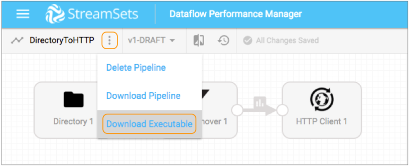

# 下载具有SDC Edge可执行文件的设计管道

从边缘管道画布中，您可以下载SDC Edge 可执行文件以及在画布中打开的边缘管道。如果要在SDC Edge上本地运行管道，请下载并安装Edge可执行文件。

**提示：**在大多数情况下，您的Control Hub 管理员会安装并注册多个Edge Data Collector，并为每个Edge Data Collector分配一个或多个标签。您只需将设计的边缘管道添加到作业中，并为作业添加标签，以便Control Hub 知道应该运行哪一组边缘数据收集器。运行作业时，Control Hub会 在带有所有列出的作业标签的任何SDC Edge上运行远程管道实例。

有关更多信息，请参见[Edge数据收集器](https://streamsets.com/documentation/controlhub/latest/help/controlhub/UserGuide/DataCollectorEdge/Overview.html#concept_aky_2z3_qbb)。

1. 在管道画布中打开边缘管道。

2. 单击“ **更多”**图标（），然后单击“ **下载可执行文件”**。

   

3. 选择要在其中安装SDC Edge的边缘设备的平台，然后单击“ **下载”**。

4. 将下载到计算机上的压缩包移至边缘设备。

5. 解压缩下载的文件。

   例如，在Linux上使用以下命令将压缩包提取到边缘设备上的所需位置，通常是 / opt / local：

   ```
   tar xf streamsets-datacollector-edge-<version>-<os>-<architecture>.tgz
   ```

6. 若要同时启动SDC Edge和边缘管道，请从SDC Edge主目录运行以下命令 ：

   ```
   bin/edge -start=<pipelineID>
   ```

   如果边缘管道使用参数，请使用以下命令：

   ```
   bin/edge -start=<pipelineID> -runtimeParameters='{"<parameter_name1>":"<parameter_value1>","<parameter_name2":"<parameter_value2>"}'
   ```