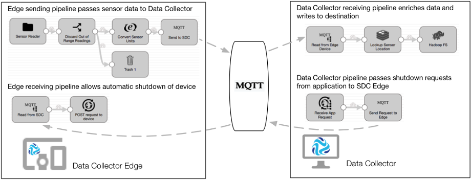

# 边缘管道概述

StreamSets 数据收集器边缘TM（SDC Edge）是一种轻量级的执行代理，不具有在资源有限的边缘设备上运行管道的UI。使用SDC Edge从边缘设备读取数据或从另一个管道接收数据，然后对该数据进行操作以控制边缘设备。

您可以在Data Collector 或Control Hub Pipeline Designer中设计边缘管道 。一个*边缘管道*是在边缘执行模式下运行的管线SDC边缘。设计边缘管道之后，将边缘管道部署到 安装在边缘设备上的SDC Edge。您可以在SDC Edge上运行边缘管道。

边缘管道与在Data Collector上运行的独立执行模式管道协同工作。边缘管道是双向的-它们既可以将数据发送到其他管道，也可以从其他管道接收数据。要使用边缘管道，您将使用以下类型的管道：

- 边缘发送管道

  边缘发送管道在SDC Edge上运行。它使用特定于边缘设备的原点来读取驻留在该设备上的本地数据。在将数据发送到数据收集器接收管道之前，管道可以对数据执行最少的处理。

- 数据收集器接收管道

  一个数据采集器接收的管道运行数据采集器。它从边缘发送管道目标中读取数据。该数据收集器接收管道上进行根据需要，将数据更复杂的处理，然后其将数据写入到最终目的地。

- 边缘接收管道

  边缘接收管道在SDC Edge上运行。它侦听在Data Collector或SDC Edge上运行的另一个管道发送的 数据，然后对该数据进行操作以控制边缘设备。

## 示例：物联网预防性维护

假设您有一个拥有机床网络的工厂。传感器安装在每台机器上，用于测量机器的温度，相对湿度和压力。您需要连续监视此传感器数据，并关闭任何超出允许限制的机器。

您设计了一组管道来收集和丰富传感器数据，然后将数据写入HDFS，然后由第三方应用程序分析和评估数据。您设计了另一组管道以从第三方应用程序读取结果，并在需要时关闭机床。

以下管道共同作用以对机器执行预防性维护：

- 边缘发送管道

  边缘发送管道在每个机床上安装的SDC Edge上运行。它包括一个目录原点，该目录原点读取写入到机器日志文件中的传感器测量值。管道执行最少的处理-使用“流选择器”丢弃超出范围的读数，并使用“表达式评估器”转换传感器的测量单位。管道包括一个MQTT Publisher目标，该目标将数据发送到MQTT代理上名为“ sensorReadings”的主题。每台计算机上运行的每个管道将数据发送到同一主题。

- 数据收集器接收管道

  在数据采集器上接收管道运行数据采集器安装在服务器上。它包括一个MQTT订阅服务器源，该源从所有边缘发送管道向其发布数据的MQTT代理上的“ sensorReadings”主题中读取传感器测量值。管道使用Redis查找处理器通过sensorID字段查找传感器位置。然后，它将丰富的数据写入HDFS。

  第三方应用程序分析写入HDFS的数据。应用程序确定传感器的测量值是否已超过允许的限制，然后将HTTP POST请求发送到HTTP端点以关闭计算机。

- 数据收集器管道

  要读取来自第三方应用程序的请求，另一个Data Collector管道将在同一Data Collector上运行。它包括一个HTTP Server源，该源在第三方应用程序使用的HTTP端点上侦听HTTP POST请求。管道使用MQTT Publisher目标将数据写入MQTT代理上的主题。目的地使用该`${record:attribute('sensorID')}` 功能通过sensorID字段定义主题名称。

- 边缘接收管道

  为了自动关闭边缘设备，每个机床上安装的每个SDC Edge都运行一条边缘接收管道。边缘管道包括MQTT订户源，该源侦听由Data Collector管道写入的传感器ID主题。边缘管道使用HTTP客户端目标将POST请求发送到HTTP资源URL，从而指示计算机自行关闭。

下图显示了边缘和Data Collector 管道如何协同工作以执行IoT预防性维护：

