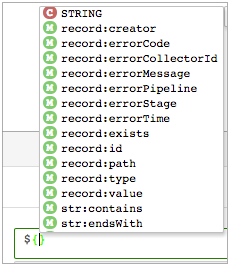
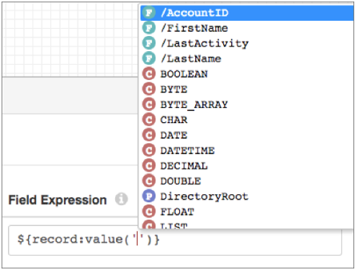
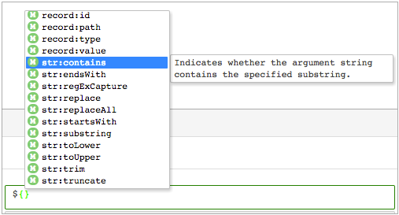
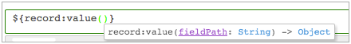

# 表达语言

通过StreamSets表达式语言，您可以创建用于评估或修改数据的表达式。StreamSets表达式语言基于JSP 2.0表达式语言。

使用表达式语言可在处理器中配置表达式和条件，例如表达式评估器或流选择器。一些目标属性还允许使用表达式语言，例如Hadoop FS目标的目录模板。

您可以使用表达式语言来定义表示数字或字符串值的任何阶段或管道属性。您还可以使用字段路径表达式来选择要在某些处理器中使用的字段。

使用[表达式完成](https://streamsets.com/documentation/controlhub/latest/help/datacollector/UserGuide/Expression_Language/ExpressionLanguage_overview.html#concept_tns_krz_sr)功能可以确定可以在哪里使用表达式以及可以在该位置使用的表达式元素。

您可以在表达式中使用以下元素：

- 常数
- 日期时间变量
- 栏位名称
- 功能
- 文字
- 经营者
- 运行时参数
- 运行时属性
- 运行时资源

## 属性中的表达式完成

表达式完成提供了可以使用的数据类型和函数的列表。配置管道时，该列表包括定义时的运行时参数，以及管道有效用于数据预览时的可用字段。

如果元素未显示在列表中，则它在指定位置不是有效元素。

### 完成表达的技巧

调用表达式完成时，请使用以下信息和提示：

1. 要调用表达式完成功能，请将光标放在要创建表达式的位置，然后单击Ctrl +空格键。

   显示有效表达式元素的列表。滚动查看整个列表。

   

   您可以在任何可以使用表达式的地方调用表达式完成。

2. 对于管道，当数据预览可用时，字段名称显示在列表的顶部。定义后，运行时参数将在列表中显示带有紫色“参数”图标。

   在以下示例中，DirectoryRoot是运行时参数：

   

3. 要查看有关元素的更多信息，请单击元素名称：

   

4. 要将元素添加到表达式中，请双击元素名称或按Enter。

5. 您可以通过键入元素名称的前几个字母来过滤元素列表。

6. 要查看功能的语法，请在添加功能后在括号内单击。

   

## 表达例

下表提供了一些示例，说明了如何在Data Collector中使用表达式。

- 条件

  下表包含一些条件示例：样本条件表达式描述$ {record：value（'/ payment_type'）=='CRD'}在流选择器中，此条件会将付款类型为信用卡的记录路由到流。$ {record：value（'[3] / State'）==“ MD”}与上面相同，但用于列表格式的记录。$ {record：errorCode（）==“ FIELD_MERGER_02”}此条件用于错误管道中的流选择器中，此条件会将具有FIELD_MERGER_02错误的记录路由到更正该错误的流。$ {record：value（“ [20] / value”）==“”}在警报中使用时，当指定字段不包含任何数据时触发警报。$ {record：type（'/ ID'）= STRING}在流选择器中，将ID为字符串的记录路由到包含字段类型转换器的分支，以将字段转换为数字数据类型。

- 如果-然后-其他

  下表包含if-then-else表达式的一些示例：样本if-then-else表达式描述$ {record：value（'/ gender'）=='1'？'M':( record：value（'/ gender'）=='2'？'F'：'U'）}将“ 1”替换为“ M”，将2替换为“ F”，并将其他任何值替换为“ U”以表示未知数。$ {record：value（'/ phone_home'）！=“”？record：value（'/ phone_home'）:( record：value（'/ phone_mobile'）！=“”？record：value（'/ phone_mobile'） ：（record：value（'/ phone_work'）！=“”？record：value（'/ phone_work'）：''））}}根据home_phone，mobile_phone和work_phone字段中的电话号码，用于primary_phone字段的电话号码：如果有家庭电话号码，请使用家庭电话。如果没有家庭电话号码，请使用手机号码。如果没有家庭电话或手机号码，请使用办公电话号码。如果没有家庭电话，手机号码或公司号码，请使用空值。

- 字符串操作

  下表包含一些字符串处理示例：样本字符串操作表达式描述$ {record：valueOrDefault（'/ Payment'，'unknown'）}将“付款”字段中的缺失值或空值替换为“未知”。$ {str：toUpper（record：value（'/ STATE'）}大写STATE字段中的所有字符串。

- 数值运算

  下表包含数字运算的示例：样本数值运算 $ {record：value（'/ total_amount'）-（record：value（'/ tip_amount'）+ record：value（'/ tolls'）+ record：value（'/ mta_tax'））}该表达式可通过从总票价中减去小费，税金和通行费来计算旅行收入