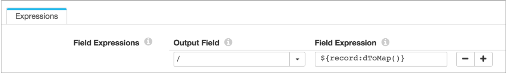
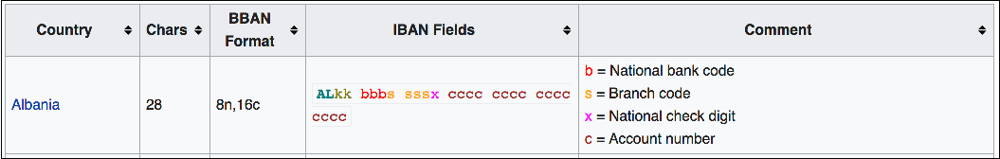

The following table lists all available functions. For details about each function, see the related function type:

| Function Type                                                | Functions                                                    |
| :----------------------------------------------------------- | :----------------------------------------------------------- |
| [Record functions](https://streamsets.com/documentation/controlhub/latest/help/datacollector/UserGuide/Expression_Language/Functions.html#concept_p1z_ggv_1r) | record:attribute(<attribute name>)record:attributeOrDefault(<attribute name>, <default value>)record:creator()record:eventCreation()record:eventType()record:eventVersion()record:exists(<field path>)record:fieldAttribute(<field path>, <field attribute name>)record:fieldAttributeOrDefault(<field path>, <field attribute name>, <default value>)record:id()record:path()record:type(<field path>)record:value(<field path>)record:valueOrDefault(<field path>, <default value>) |
| [Delimited data record functions](https://streamsets.com/documentation/controlhub/latest/help/datacollector/UserGuide/Expression_Language/Functions.html#concept_s2c_q14_fs) | record:dExists(<header>)record:dHasDupHeader()record:dIndex(<header>)record:dIsDupHeader(<header>)record:dToMap()record:dValue(<header>)record:dValueAt(<header index>) |
| [Error record functions](https://streamsets.com/documentation/controlhub/latest/help/datacollector/UserGuide/Expression_Language/Functions.html#concept_ndj_43v_1r) | record:errorCode()record:errorCollectorId()record:errorMessage()record:errorPipeline()record:errorStackTrace()record:errorStage()record:errorStageLabel()record:errorTime() |
| [Base64 functions](https://streamsets.com/documentation/controlhub/latest/help/datacollector/UserGuide/Expression_Language/Functions.html#concept_ylk_v44_jw) | base64:decodeBytes(<string>)base64:decodeString(<string>, <charset>)base64:encodeBytes(<byte array>, <urlSafe: true \| false>)base64:encodeString(<string>, <urlSafe: true \| false>, <charset>) |
| [Category functions](https://streamsets.com/documentation/controlhub/latest/help/datacollector/UserGuide/Expression_Language/Functions.html#concept_ntw_fc5_kfb) | CREDIT_CARD:type()CREDIT_CARD:firstGroup()CREDIT_CARD:secondGroup()CREDIT_CARD:thirdGroup()CREDIT_CARD:fourthGroup()CREDIT_CARD:lastPart()CREDIT_CARD:std()EMAIL:domain()EMAIL:domainTLD()EMAIL:domainWithoutTLD()EMAIL:localPart()EMAIL:std()US_PHONE:areaCode()US_PHONE:areaCodeOrDefault(<default value>)US_PHONE:exchangeCode()US_PHONE:lineNumber()US_PHONE:extension()US_PHONE:extensionOrDefault()US_PHONE:std()US_SSN:areaNumber()US_SSN:groupNumber()US_SSN:serialNumber()US_SSN:std()US_ZIP_CODE:stateGroup()US_ZIP_CODE:region()US_ZIP_CODE:cityArea()US_ZIP_CODE:specificLocation()US_ZIP_CODE:specificLocationOrDefault(<default value>)US_ZIP_CODE:std() |
| [Credential functions](https://streamsets.com/documentation/controlhub/latest/help/datacollector/UserGuide/Expression_Language/Functions.html#concept_yvc_3qs_r1b) | credential:get(<storeId>, <userGroup>, <name>)credential:getWithOptions(<storeId>, <userGroup>, <name>, <storeOptions>) |
| [Data drift functions](https://streamsets.com/documentation/controlhub/latest/help/datacollector/UserGuide/Expression_Language/Functions.html#concept_hpn_xfk_p5) | drift:names(<field path>, <ignoreWhenMissing: true \| false>)drift:order(<field path>, <ignoreWhenMissing: true \| false>)drift:size(<field path>, <ignoreWhenMissing: true \| false>)drift:type(<field path>, <ignoreWhenMissing: true \| false>) |
| [Data generation functions](https://streamsets.com/documentation/controlhub/latest/help/datacollector/UserGuide/Expression_Language/Functions.html#concept_kwf_yqb_lfb) | Address related faker functions:deterministicFaker:country(<input>)randomFaker:country()deterministicFaker:UsCity(<input>)randomFaker:UsCitydeterministicFaker:UsFullAddress(<input>)randomFaker:UsFullAddress()deterministicFaker:UsState(<input>)randomFaker:UsState()deterministicFaker:UsStreetAddress(<input>)randomFaker:UsStreetAddress()deterministicFaker:UsZipCode(<input>)randomFaker:UsZipCode()Finance related faker functions:deterministicFaker:creditCard(<input>)randomFaker:creditCard()deterministicFaker:creditCardOfType(<type>, <input>)randomFaker:creditCardOfType(<type>)deterministicFaker:iban(<input>)randomFaker:iban()deterministicFaker:ibanForCountry(<country code>, <input>)randomFaker:ibanForCountry(<country code>)Internet related faker functions:deterministicFaker:email(<input>)randomFaker:email()deterministicFaker:url(<input>)randomFaker:url()Person related faker functions:deterministicFaker:race(<input>)randomFaker:race()deterministicFaker:UsFirstName(<input>)randomFaker:UsFirstName()deterministicFaker:UsLastName(<input>)randomFaker:UsLastName()deterministicFaker:UsPhone(<input>)randomFaker:UsPhone()deterministicFaker:UsSsn(<input>)randomFaker:UsSsn()Xeger functions:xeger:deterministic(<regular expression>, <input>)xeger:random(<regular expression>) |
| [Field functions](https://streamsets.com/documentation/controlhub/latest/help/datacollector/UserGuide/Expression_Language/Functions.html#concept_gfs_w55_3cb) | f:attribute(<attribute name>)f:getSiblingWithName(<field name>)f:hasSiblingWithName(<field name>)f:hasSiblingWithValue(<field name>, <field value>)f:index()f:name()f:parent()f:parentPath()f:path()f:type()f:value() |
| [File functions](https://streamsets.com/documentation/controlhub/latest/help/datacollector/UserGuide/Expression_Language/Functions.html#concept_kxj_nyl_5x) | file:fileExtension(<filepath>)file:fileName(<filepath>)file:parentPath(<filepath>)file:pathElement(<filepath>, <integer>)file:removeExtension(<filepath>) |
| [Job functions](https://streamsets.com/documentation/controlhub/latest/help/datacollector/UserGuide/Expression_Language/Functions.html#unique_1419196437) | job:id()job:name()job:startTime()job:user()                  |
| [Math functions](https://streamsets.com/documentation/controlhub/latest/help/datacollector/UserGuide/Expression_Language/Functions.html#concept_m2m_s1f_lw) | math:abs(<number>)math:ceil(<number>)math:floor (<number>)math:max(<number1>, <number2>)math:min(<number1>, <number2>)math:round(<number>) |
| [Pipeline functions](https://streamsets.com/documentation/controlhub/latest/help/datacollector/UserGuide/Expression_Language/Functions.html#concept_dvg_nqn_wx) | pipeline:id()pipeline:name()pipeline:startTime()pipeline:title()pipeline:user()pipeline:version() |
| [String functions](https://streamsets.com/documentation/controlhub/latest/help/datacollector/UserGuide/Expression_Language/Functions.html#concept_ahp_f4v_1r) | str:concat(<string1>, <string2>)str:contains(<string>, <subset>)str:endsWith(<string>, <subset>)str:escapeXML10(<string>)str:escapeXML11(<string>)str:indexOf(<string>, <subset>)str:isNullOrEmpty(<string>)str:lastIndexOf(<string>, <subset>)str:length(<string>)str:matches(<string>, <regEx>)str:regexCapture(<string>, <regEx>, <group>)str:replace(<string>, <oldChar>, <newChar>)str:replaceAll(<string>, <regEx>, <newString>)str:split(<string>, <separator>)str:splitKV(<string>, <pairSeparator>, <keyValueSeparator>)str:startsWith(<string>, <subset>)str:substring(<string>, <beginIndex>, <endIndex>)str:toLower(<string>)str:toUpper(<string>)str:trim(<string>)str:truncate(<string>, <length>)str:unescapeJava(<string>)str:unescapeXML(<string>)str:urlDecode(<URL>, <charset>)str:urlEncode(<infoforURL>, <charset>) |
| [Time functions](https://streamsets.com/documentation/controlhub/latest/help/datacollector/UserGuide/Expression_Language/Functions.html#concept_qkr_trf_sw) | time:createDateFromStringTZ(<string>, <time zone>, <date format>)time:dateTimeToMilliseconds(<Date object>)time:dateTimeZoneOffset(<Date object>, <time zone>)time:extractDateFromString(<string>, <format string>)time:extractLongFromDate(<Date object>, <format string>)time:extractStringFromDate(<Date object>, <format string>)time:extractStringFromDateTZ(<Date object>, <time zone>, <format string>)time:millisecondsToDateTime(<long>)time:now()time:timeZoneOffset(<time zone>)time:trimDate(<datetime>)time:trimTime(<datetime>) |
| [Miscellaneous functions](https://streamsets.com/documentation/controlhub/latest/help/datacollector/UserGuide/Expression_Language/Functions.html#concept_ddw_ld1_1s) | alert:info()emptyList()emptyMap()every(<interval>, <mm() \| ss()>)field:field()isEmptyList()isEmptyMap()jvm:maxMemoryMB()length()list:join(<list field>, <separator>)list:joinSkipNulls(<list field>, <separator>)offset:column(<position>)runtime:availableProcessors()runtime:conf(<runtime property>)runtime:loadResource(<file name>, <restricted: true \| false>)runtime:loadResourceRaw(<file name>, <restricted: true \| false>)sdc:hostname()sdc:id()size()uuid:uuid()vault:read(<path>, <key>) *- Deprecated*vault:readWithDelay(<path>, <key>, <delay>) *- Deprecated* |

## Record Functions

Use record functions to determine information about a record, such as the stage that created it or whether a field exists in the record.

You can replace any argument with a literal or an expression that evaluates to the argument. String literals must be enclosed in single or double quotation marks.

 Some functions may not be valid in Data Collector Edge pipelines.

The expression language provides the following general record functions:

- record:attribute(<attribute name>)

  Returns the value of the specified record attribute. Use to return data, for example, for the "tag" attribute that you set using the File Tail origin.

  Uses the following argument:attribute name - Name of the record header attribute.

  Return type: String.

  For example, the following expression returns the value of a tag attribute added by a File Tail origin:`${record:attribute('tag')}`

- record:attributeOrDefault(<attribute name> , <default value>)

  Returns the value of the specified record header attribute. When the attribute does not exist or has no value, returns the specified default value.

  Uses the following arguments:attribute name - Name of the record header attribute.default value - Value to use when the record header attribute does not exist or has no value.

  Return type: Returns a string value when returning the field attribute value. Otherwise, returns the type of the specified default value.

  For example, the following expression returns the value of the tag attribute, and returns NA when no value exists:`${record:attributeOrDefault('tag', 'NA')}`

- record:creator()

  Returns the instance name of the stage that created the record, typically an origin stage. Data is stored in the stageCreator field of a record.

  Return type: String.

  For example, the following expression returns the instance name of the stage that creates each record:`${record:creator()}`

- record:eventCreation()

  Returns the epoch timestamp when an event occurred. Use to return the creation timestamp from an event record. Returns null values when applied to other records.

  Return type: String.

  For example, the following expression returns the time that the event-generating stage generated an event:`${record:eventCreation()}`

- record:eventType()

  Returns the event type from an event record. Returns null values when applied to other records.

  Event generating stages create different event types. For information about the possible event types, see "Event Records" in the stage documentation.

  Return type: String.

  For example, the following expression returns the event type from an event record:`${record:eventType()}`

- record:eventVersion()

  Returns the event version from an event record. Returns null values when applied to other records.

  Return type: String.

  For example, the following expression returns the event version from an event record:`${record:eventVersion()}`

- record:exists(<field path>)

  Determines if the specified field is in a record. When the field is not in the record, returns 0. When the field is in the record, returns 1.

  Return type: Boolean.

  For example, the following expression returns 1 when the Name field exists in a record:`${record:exists('/Name')}`

  It returns 0 when the Name field is not part of the record.

- record:fieldAttribute(<field path>, <field attribute name>)

  Returns the value for the specified field attribute.

  Uses the following arguments:field path - Path to the field with the attribute.field attribute name - Name of the field attribute.

  Return type: String

  For example, the following expression returns the value for the pk attribute on the ID field:`record:fieldAttribute('/ID', 'pk')`

- record:fieldAttributeOrDefault(<field path>, <field attribute name>, <default value>)

  Returns the value for the field attribute when it exists. If the attribute does not exist, returns the specified default value.

  Uses the following arguments:field path - Path to the field with the attribute.field attribute name - Name of the field attribute.default value - Value to use when the field attribute does not exist or has no value.

  Return type: Returns a string value when returning the field attribute value. Otherwise, returns the type of the specified default value.

  For example, the following expression returns the value for the pk attribute on the ID field when available, otherwise, it returns "n".`record:fieldAttributeOrDefault('/ID', 'pk', 'n')`

- record:id()

  Returns the record ID. The record ID is also stored in the sourceId record header attribute.

  Return type: String.

- record:path()

  Returns the stages in the pipeline that processed a record. Data is stored in the stagesPath field of a record. The field path uses the following format:`:::... `

  Return type: String.

- record:type(<field path>)

  Checks the data type of a field. Possible return values are:BooleanCharByteShortIntegerLongFloatDoubleDateDatetimeDecimalStringTimeByte-ArrayMapList

  Return type: String.

- record:value(<field path>)

  Returns the value of the field in the appropriate data type.

  Return type: When the field includes a value, returns the type based on the field value. When the field is null, the function returns no value.

  Nulls are coerced based on the expected return type of the function. For example, if an EL is expected to return a string, null is coerced to an empty string. However, a null integer is coerced to 0.

- record:valueOrDefault(<field path> , <default value>)

  Returns the value of the field in the appropriate data type. If the field does not exist or if the field is null, returns the default value.

  Use to provide a default value when a field does not exist or when a field is null.

  Return type: Variable, based on whether the function returns the field value or default value.

## Delimited Data Record Functions

Use delimited data record functions to process delimited data with the list root field type. If you configured an origin to process the delimited data with the list-map root field type, you can use standard record functions.

 Not valid in Data Collector Edge pipelines. Do not use delimited data record functions in Data Collector Edge pipelines.

For more information about the delimited data root field types, see [Delimited Data Root Field Type](https://streamsets.com/documentation/controlhub/latest/help/datacollector/UserGuide/Data_Formats/Delimited.html#concept_zcg_bm4_fs).

You can replace any argument with a literal or an expression that evaluates to the argument. String literals must be enclosed in single or double quotation marks.

The expression language provides the following delimited data record functions:

- record:dExists(<header name>)

  Determines if the specified header name exists in the record.

  Return type: Boolean.

- record:dHasDupHeader()

  Determines if the record has duplicate header names.

  Return type: Boolean.

- record:dIndex(<header name>)

  Returns the index associated with the specified header name. Use to find the position of a header in the record.

  Return type: Integer, starting with 0 for the first position.

- record:dIsDupHeader(<header name>)

  Determines if the specified header name is used more than once in a record.

  Return type: Boolean.

- record:dToMap()

  Converts a record with a List root field to a List-Map root field. Use to convert delimited List records to List-Map to allow easier use with standard record functions. For more information about root field types, see [Delimited Data Root Field Type](https://streamsets.com/documentation/controlhub/latest/help/datacollector/UserGuide/Data_Formats/Delimited.html#concept_zcg_bm4_fs).

  Return type: Records with a List-Map root field.

  To use record:dToMap(), use a slash as the root output field as follows:

  

- record:dValue(<header name>)

  Returns the value associated with the specified header name.

  Return type: String.

- record:dValueAt(<header index>)

  Returns the value at the specified header index position.

  Return type: String.

## Error Record Functions

Error record functions provide information about error records. Use error functions to process error records.

For example, you might use error functions in a Stream Selector to pass data to different error handling pipelines based on the type of error that occurred.

 Not valid in Data Collector Edge pipelines. Do not use error record functions in Data Collector Edge pipelines.

The expression language provides the following error functions:

- record:errorCode()

  Returns the error code for the error record.

  Return type: String.

- record:errorCollectorId()

  Returns the ID of the Data Collector that sent the record to error.

  By default, the Data Collector ID uses the format <hostname>:<port>. You can verify the Data Collector ID in the Data Collector Configuration page.

  Return type: String.

- record:errorMessage()

  Returns the error message for the error record.

  Return type: String.

- record:errorPipeline()

  The name of pipeline that sent the record to error.

  Return type: String.

- record:errorStackTrace()

  Returns the error stack trace for the error record.

  Return type: String.

- record:errorStage()

  Returns the instance name of the stage that sent the record to error.

  You can verify the instance name on the General tab of the stage.

  Return type: String.

- record:errorStageLabel()

  Returns the user-defined label for the stage that sent the record to error.

  Return type: String.

- record:errorTime()

  The time the record was sent to error.

  Return type: Long.

## Base64 Functions

Use Base64 functions to encode or decode data using Base64.

You can replace any argument with a literal or an expression that evaluates to the argument. String literals must be enclosed in single or double quotation marks.

 Not valid in Data Collector Edge pipelines. Do not use Base64 functions in Data Collector Edge pipelines.

The expression language provides the following Base64 functions:

- base64:decodeBytes(<string>)

  Returns a decoded byte array from a Base64 encoded string.

  Return type: Byte Array.

  Uses the following argument:string - The Base64 encoded string to decode.

  For example, ${base64:decodeBytes(record:value("/ID"))} decodes the Base64 encoded string in the ID field as a byte array value.

- base64:decodeString(<string>, <charset>)

  Returns a decoded string from a Base64 encoded string using the specified character set.

  Return type: String.

  Uses the following arguments:string - The Base64 encoded string to decode.charset - The character set to use to decode the data.

  For example, ${base64:decodeString(record:value("/ID"), "UTF-8")} decodes the Base64 encoded string in the ID field using the UTF-8 character set as a string value.

- base64:encodeBytes(<byte array>, <urlSafe: true | false>)

  Returns a Base64 encoded string value of the specified byte array.

  Return type: String.

  Uses the following arguments:byte array - The byte array to encode using Base64.urlSafe - When set to true, encodes the data so that it can be safely sent in a URL.

  For example, ${base64:encodeBytes(record:value("/ID"), true)} uses Base64 to encode the byte array in the ID field such that the encoded data is URL safe.

- base64:encodeString(<string>, <urlSafe: true | false>, <charset>)

  Returns a Base64 encoded string value of the specified string.

  Return type: String.

  Uses the following arguments:string - The string to encode using Base64.urlSafe - When set to true, encodes the data so that it can be safely sent in a URL.charset - The character set to use to encode the data.

  For example, ${base64:encodeString(record:value("/ID"), false, "UTF-8")} uses Base64 to encode the string in the ID field using the UTF-8 character set such that the encoded data is not URL safe.

## Credential Functions

Use a credential function to retrieve a credential value from the following credential store systems:

- AWS Secrets Manager
- CyberArk
- Hashicorp Vault
- Java keystore
- Microsoft Azure Key Vault

 Not valid in Data Collector Edge pipelines. Do not use credential functions in Data Collector Edge pipelines.

Before you use a credential function, you must configure the Secrets Manager, CyberArk, Hashicorp Vault, Java keystore, or Azure Key Vault credential stores. For more information about credential stores, see [Credential Stores](https://streamsets.com/documentation/datacollector/latest/help/#datacollector/UserGuide/Configuration/CredentialStores.html) in the Data Collector documentation..

You can use credential functions in stages that require credentials - such as user names or passwords - to securely access data in external systems. Credential functions allow pipelines to access external systems without exposing the credential values.

You cannot use credential functions in all stages. For example, we intentionally do not allow the use of credential functions in the Expression Evaluator processor. If credential functions were allowed in stages such as the Expression Evaluator, any user with access to the pipeline could access or print the credential value, compromising the security of the external system.

**Important:** When you use a credential function in a stage property, the function must be the only value defined in the property. For example, you cannot include another function or a literal value along with the credential function.

String literals must be enclosed in single or double quotation marks.

The expression language provides the following credential functions:

- credential:get(<storeId>, <userGroup>, <name>)

  Returns the credential value from the credential store. Uses the following arguments:storeId - Unique ID of the credential store to use. Enter aws to access the AWS Secrets Manager credential store, cyberark to access the CyberArk credential store, jks to access the Java keystore credential store, vault to access the Hashicorp Vault credential store, or azure to access the Azure Key Vault credential store.userGroup - Group that a user must belong to in order to access the credential. Only users that have execute permission on the pipeline and that belong to this group can validate, preview, or run the pipeline that retrieves the credential values.If working with Control Hub, specify the group using the required naming convention: <group ID>@<organization ID>. To grant access to all users, specify the default "all" group when working only with Data Collector or the default "all@<organization ID>" group when working with Control Hub.name - Name of the credential value to retrieve from the credential store. Use the required format for the credential store:AWS Secrets Manager - Enter the credential name using the following format:`""`Where `` is the name of the secret to read, `` is the separator defined in the $SDC_CONF/credential-stores.properties file, and `` is the key for the value that you want returned.CyberArk - Enter the credential name using the following format:`""`Where `` is the CyberArk safe to read, `` is the separator defined in the $SDC_CONF/credential-stores.properties file, `` is the CyberArk folder to read, `` is the CyberArk object to read, and `` is the name for the value that you want returned.Hashicorp Vault - Enter the credential name using the following format:`""`Where `` is the path in Vault to read, `` is the separator defined in the $SDC_CONF/credential-stores.properties file, and `` is the key for the value that you want returned.Java keystore - Enter the credential name added to the Java keystore file using the `jks-cs add` command.Azure Key Vault - Enter the name of the key or secret to retrieve from Azure Key Vault.

  Return type: String.

  For example, the following expression returns the value of the OracleDBPassword credential defined in the Java keystore credential store and allows any user belonging to the devops group access to the credential when validating, previewing, or running the pipeline:`${credential:get("jks", "devops", "OracleDBPassword")}`

- credential:getWithOptions(<storeId>, <userGroup>, <name>, <storeOptions>)

  Returns the credential value from the credential store using additional options to communicate with the credential store. Not applicable for the Java keystore credential store.

  For example, use this function with the CyberArk credential store to define the separator for the credential name within the function. Or use this function with the Hashicorp Vault credential store when you might need a delay of 10 seconds or more before the credentials can be used successfully.

  Uses the following arguments:storeId - Unique ID of the credential store to use. Enter aws to access the Secrets Manager credential store, cyberark to access the CyberArk credential store, vault to access the Hashicorp Vault credential store, or azure to access the Azure Key Vault credential store.userGroup - Group that a user must belong to in order to access the credential. Only users that have execute permission on the pipeline and that belong to this group can validate, preview, or run the pipeline that retrieves the credential values.If working with Control Hub, specify the group using the required naming convention: <group ID>@<organization ID>. To grant access to all users, specify the default "all" group when working only with Data Collector or the default "all@<organization ID>" group when working with Control Hub.name - Name of the credential value to retrieve from the credential store. Use the required format for the credential store:AWS Secrets Manager - Enter the credential name using the following format:`""`Where `` is the name of the secret to read, `` is the separator defined in the $SDC_CONF/credential-stores.properties file or in the store options passed with the function, and `` is the key for the value that you want returned.CyberArk - Enter the credential name using the following format:`""`Where `` is the CyberArk safe to read, `` is the separator defined in the $SDC_CONF/credential-stores.properties file, `` is the CyberArk folder to read, `` is the CyberArk object to read, and `` is the name for the value that you want returned.Hashicorp Vault - Enter the credential name using the following format:`""`Where `` is the path in Vault to read, `` is the separator defined in the $SDC_CONF/credential-stores.properties file, and `` is the key for the value that you want returned.Azure Key Vault - Enter the name of the key or secret to retrieve from Azure Key Vault.storeOptions - Additional options to communicate with the credential store.For AWS Secrets Manager, you can use the following options:`separator` - Specifies the separator for name and key values in the credential functions, overriding the `credentialStore.aws.config.nameKey.separator` property.`alwaysRefresh` - When set to true, forces the key to refresh its cached value before Data Collector retrieves the value, overriding the `credentialStore.aws.config.nameKey.separator` property.For CyberArk, you can use the following options:`separator` - Separator to use for the credential name.`ConnectionTimeout` - Connection timeout value.`FailRequestOnPasswordChange` - Whether to fail the request on a password change, set to true or false.For Hashicorp Vault, you can use the `delay` option to enter a delay in milliseconds to allow time for external processing. Use the delay option when using the Vault AWS secret backend to generate AWS access credentials based on IAM policies. According to Vault documentation, you might need a delay of 10 seconds or more before the credentials can be used successfully.For Azure Key Vault, you can use the following options to override several properties in the $SDC_CONF/credential-stores.properties file:`url` - Overrides the credentialStore.azure.config.vault.url property.`retry` - Overrides the credentialStore.azure.config.credential.retry.millis property.`refresh` - Overrides the credentialStore.azure.config.credential.refresh.millis property.Use the following format to specify options:`"=,="`For example, to use the pipe symbol (|) as the CyberArk separator, enter the following for the options argument:`"separator=|"`Or to set the Vault delay to 1,000 milliseconds, enter the following for the options argument:`"delay=1000"`

  Return type: String.

  For example, the following expression returns the value of the key password stored in the Vault path /secret/databases/oracle after waiting for a delay of 1,000 milliseconds. The credential name argument uses the default ampersand (&) as the separator. The expression allows any user belonging to the devops group access to the credential when validating, previewing, or running the pipeline:`${credential:getWithOptions("vault", "devops", "/secret/databases/oracle&password", "delay=1000")}`

## Category Functions

Category functions are functions that you use only in [Data Protector](https://streamsets.com/documentation/controlhub/latest/help/controlhub/UserGuide/DataProtector/DataProtector-Overview.html#concept_ws1_w2b_v2b) protection procedures when using certain protection methods, such as the [Expression Evaluator](https://streamsets.com/documentation/controlhub/latest/help/controlhub/UserGuide/ProtectionMethods/Method-ExpressionEval.html#concept_gzt_skt_kfb), [Standard Mask](https://streamsets.com/documentation/controlhub/latest/help/controlhub/UserGuide/ProtectionMethods/Method-StandardMask.html#concept_sqj_jyk_4fb), or [Custom Mask](https://streamsets.com/documentation/controlhub/latest/help/controlhub/UserGuide/ProtectionMethods/Method-CustomMask.html#concept_smy_kyk_4fb).

Category functions return parts of certain categories of data, such as the area code of a phone number, or the domain of an email address. Category functions enable you to protect sensitive data while retaining parts of the original data for processing.

For example, to protect phone numbers while retaining the area code, you can configure a protection procedure to use the Expression Evaluator protection method. Then, you might use one of the following expressions in the procedure:

- `Area code ${US_PHONE:areaCode()}` - This replaces phone numbers with `Area code `.

- ```
  ${US_PHONE:areaCode()}-xxx-xxxx
  ```

   

  \- This returns the area code of the phone number with the rest of the number removed, as follows:

   

  ```
  <area code>-xxx-xxxx
  ```

  .

  To achieve this same result, you could alternatively use the Standard Mask protection method and use the following mask: `123-xxx-xxxx`.

When needed, you can use category functions to [standardize the data](https://streamsets.com/documentation/controlhub/latest/help/controlhub/UserGuide/ProtectionPolicies/Procedures-Understanding.html#concept_ckg_mhf_mfb) for available categories.

You can use category functions for the following types of data:

- [Credit card numbers](https://streamsets.com/documentation/controlhub/latest/help/datacollector/UserGuide/Expression_Language/Functions.html#concept_m51_b4w_5fb)
- [Email addresses](https://streamsets.com/documentation/controlhub/latest/help/datacollector/UserGuide/Expression_Language/Functions.html#concept_vbk_wzv_5fb)
- [Phone numbers](https://streamsets.com/documentation/controlhub/latest/help/datacollector/UserGuide/Expression_Language/Functions.html#concept_tmt_g1w_5fb)
- [Social security numbers](https://streamsets.com/documentation/controlhub/latest/help/datacollector/UserGuide/Expression_Language/Functions.html#concept_zbt_k1w_5fb)
- [Zip codes](https://streamsets.com/documentation/controlhub/latest/help/datacollector/UserGuide/Expression_Language/Functions.html#concept_i2h_n1w_5fb)

### Credit Card Numbers

Data Protector provides the following category functions for credit card numbers:

- CREDIT_CARD:type()

  Returns the type of credit card that the number represents: `AMERICAN_EXPRESS`, `MASTERCARD`, or `VISA`.

  Return type: String.

  For example, when evaluating `5200-1200-3400-5600`, this function returns `MASTERCARD`.

- CREDIT_CARD:firstGroup()

  Returns the first numeric group of the credit card number.

  Return type: String.

  For example, when evaluating `5200-1200-3400-5600`, this function returns `5200`.

- CREDIT_CARD:secondGroup()

  Returns the second numeric group of the credit card number.

  Return type: String.

  For example, when evaluating `5200-1200-3400-5600`, this function returns `1200`.

- CREDIT_CARD:thirdGroup()

  Returns the third numeric group of the credit card number.

  Return type: String.

  For example, when evaluating `5200-1200-3400-5600`, this function returns `3400`. When evaluating `3700-000000-00000`, this function returns `00000`.

- CREDIT_CARD:fourthGroup()

  Returns the fourth numeric group of the credit card number. When a credit card number does not include a fourth numeric group - such as American Express numbers, which only have three groups - this function returns an empty string.

  To return the last group of all credit card numbers, use `CREDIT_CARD:lastPart()`.

  Return type: String.

  For example, when evaluating `5200-1200-3400-5600`, this function returns `5600`. When evaluating `3700-000000-00000`, this function returns an empty string.

- CREDIT_CARD:lastPart()

  Returns the last group of the credit card number. For Mastercard and Visa numbers, returns the last four digits. For American Express numbers, returns the last five digits.

  Return type: String.

  For example, when evaluating `5200-1200-3400-5600`, this function returns `5600`. When evaluating `370000000000000`, this function returns `00000`.

- CREDIT_CARD:std()

  Returns credit card numbers in their standard digit groups, separated by hyphens.

  Return type: String.

  For example, when evaluating an American Express number such as `370000000000000`, this function returns `3400-000000-00000`. When evaluating a Visa number such as `5200000000000000`, this function returns `5200-0000-0000-0000`.

### Email Addresses

Data Protector provides the following category functions for email addresses:

- EMAIL:domain()

  Returns the domain of email addresses. The domain is everything after the @ symbol.

  Return type: String

  For example, when evaluating `myname@mydomain.com`, this function returns `mydomain.com`.

- EMAIL:domainTLD()

  Returns the top level domain (TLD) of the email address. The TLD is the last part of the domain, such as com, gov, or org.

  Return type: String.

  For example, when evaluating `myname@mydomain.com`, this function returns `com`.

- EMAIL:domainWithoutTLD()

  Returns the domain without the TLD part of the email address.

  Return type: String.

  For example, when evaluating `myname@mydomain.com`, this function returns `mydomain`.

- EMAIL:localPart()

  Returns the local part of email addresses. The local part is everything before the @ symbol.

  Return type: String.

  For example, when evaluating `myname@mydomain.com`, this function returns `myname`.

- EMAIL:std()

  Returns the email address in the following standard format:`@`

  such as: `name@company.com`.

  Return type: String.

  For example, when evaluating `myname@mydomain.com`, this function returns `myname@mydomain.com`.

### Phone Numbers

Data Protector provides the following category functions for phone numbers:

- US_PHONE:areaCode()

  Returns the area code of United States phone numbers. The area code is the first three digits of a ten digit phone number.

  When a phone number does not include an area code, this function returns an empty string.

  Return type: String.

  For example, when evaluating `444-333-5555`, this function returns `444`.

- US_PHONE:areaCodeOrDefault(<default value>)

  Returns the area code of United States phone numbers. When the data does not include a recognizable area code, the function returns the specified default value.

  Uses the following argument:default value - The default value to use when the phone number does not include an area code.

  Return type: String.

  For example, the following expression returns the default, `xxx`, when evaluating `989-2222` since the phone number does not have an area code:`${US_PHONE:areaCodeOrDefault('xxx')}`

- US_PHONE:exchangeCode()

  Returns the central office code, or exchange code, of United States phone numbers. The exchange code is the second three digits of a ten digit phone number.

  Return type: String.

  For example, when evaluating `444-333-5555`, this function returns `333`.

- US_PHONE:lineNumber()

  Returns the line number, or subscriber number, of United States phone numbers. The line number is the last four digits of a ten digit phone number.

  Return type: String.

  For example, when evaluating `444-333-5555`, this function returns `5555`.

- US_PHONE:extension()

  Returns the extension associated with United States phone numbers. This function expects the extension to be a set of numbers after the phone number, preceded by an `x`. This function recognizes extensions when the phone number uses one of the following formats:`x x`

  When a phone number does not include an extension, this function returns an empty string.

  Return type: String.

  For example, when evaluating `444-333-5555 x123`, this function returns `123`.

- US_PHONE:extensionOrDefault(<default value>)

  Returns the extension associated with United States phone numbers. When the data does not include a recognizable extension, the function returns the specified default value. This function recognizes extensions when the phone number uses one of the following formats:`x x`

  Uses the following argument:default value - The default value to use when the phone number does not include an extension.

  Return type: String.

  For example, the following expression returns `NA` when evaluating `444-333-5555` because the number has no extension:`${US_PHONE:extensionOrDefault('NA')}`

- US_PHONE:std()

  Returns United States phone numbers using the following standard format:`+1 () - [x]`such as: `+1 (xxx)xxx-xxxx`.

  Return type: String.

  For example, when evaluating `555-777-1111`, this function returns `+1 (555) 777-1111`.

  When evaluating a number with an extension, such as `555-777-1111 x 23`, this function returns: `+1 (555) 777-1111 x23`.

### Social Security Numbers

Data Protector provides the following category functions for social security numbers:

- US_SSN:areaNumber()

  Returns the area number of United States social security numbers. The area number is the first three digits of a social security number.

  Return type: String.

  For example, when evaluating `333-22-1111`, this function returns `333`.

- US_SSN:groupNumber()

  Returns the group number of United States social security numbers. The group number is the fourth and fifth numbers of the social security number.

  Return type: String.

  For example, when evaluating `333-22-1111`, this function returns `22`.

- US_SSN:serialNumber()

  Returns the serial number of United States social security numbers. The serial number is the last four digits of the social security number.

  Return type: String.

  For example, when evaluating `333-22-1111`, this function returns `1111`.

- US_SSN:std()

  Returns social security numbers in the following standard format:`--`

  such as: `xxx-xxx-xxxx`.

  Return type: String.

  For example, when evaluating `123456789` , this function returns `123-45-6789`.

### Zip Codes

Data Protector provides the following category functions for zip codes:

- US_ZIP_CODE:stateGroup()

  Returns the state group of United States zip codes. The state group is the first digit of the zip code.

  Return type: String.

  For example, when evaluating `94105-2376`, this function returns `9`.

- US_ZIP_CODE:region()

  Returns the region, or sectional center facility (SCF), numbers of United States zip codes. The region group is the second and third digits of a zip code.

  Return type: String.

  For example, when evaluating `94105-2376`, this function returns `41`.

- US_ZIP_CODE:cityArea()

  Returns the city or town area numbers of United States zip codes. The city or town area is the fourth and fifth digits of a zip code.

  Return type: String.

  For example, when evaluating `94105-2376`, this function returns `05`.

- US_ZIP_CODE:specificLocation()

  Returns the specific geographic location, which is the last four digits of a 9 digit United States zip code. The specific geographic location is also known as the +4 part of a zip code.

  When a zip code does not include the specific geographic location, this function returns an empty string.

  Return type: String.

  For example, when evaluating `94105-2376`, this function returns `2376`.

- US_ZIP_CODE:specificLocationOrDefault(<default>)

  Returns the specific geographic location, which is the last four digits of a 9 digit United States zip code. The specific geographic location is also known as the +4 part of a zip code. When a zip code does not include the specific geographic location, this function returns the user-defined default value.

  Uses the following argument:default - The default value to use when the zip code is 5 digits instead of 9 digits.

  Return type: String.

  For example, `${US_ZIP_CODE:specificLocationOrDefault('no +4')}` returns `no +4` each time the function evaluates a 5 digit zip code.

- US_ZIP_CODE:std()

  Returns zip codes in one of the following standard formats:` -`

  Return type: String.

  For example, when evaluating `32222`, this function returns `32222`. When evaluating `322224444`, this function returns `32222-4444`.

## Data Drift Functions

Use data drift functions to create alerts when data drift occurs. You can use these functions in data drift rules.

You can replace any argument with a literal or an expression that evaluates to the argument. String literals must be enclosed in single or double quotation marks.

 Not valid in Data Collector Edge pipelines. Do not use data drift functions in Data Collector Edge pipelines.

The expression language provides the following data drift functions:

- drift:names(<field path>, <ignoreWhenMissing: true | false>)

  Triggers an alert when key values change in a map or list-map field. When key values are field names, triggers an alert when field names change. Use with list-map or map fields.

  Use the ignoreWhenMissing flag to determine the behavior when the field is missing. When set to "true", a missing field causes no errors. When set to "false", a missing field generates an alert for the record missing the field, and for the next record that includes the field.

  For example, to trigger an alert when any field name in the record changes and ignore empty records, you can use the root field in the expression as follows:`${drift:names('/', true)}`

- drift:order(<field path>, <ignoreWhenMissing: true | false>)

  Triggers an alert when the field order changes for fields within a list-map field. Use only with list-map fields.

  Note that this function triggers alerts when field names change as well.

  Use the ignoreWhenMissing flag to determine the behavior when the field is missing. When set to "true", a missing field causes no errors. When set to "false", a missing field generates an alert for the record missing the field, and for the next record that includes the field.

  To alert on field order or name changes within a delimited record and ignore empty records, use the root field as follows:`${drift:order('/', true)}`

- drift:size(<field path>, <ignoreWhenMissing: true | false>)

  Triggers an alert when the number of fields changes within a list, list-map, or map field. Use with list, list-map, or map fields.

  Use the ignoreWhenMissing flag to determine the behavior when the field is missing. When set to "true", a missing field causes no errors. When set to "false", a missing field generates an alert for the record missing the field, and for the next record that includes the field.

  To alert when the number of columns change within the Depts map field and when a record is missing the Depts field, use the following expression:`${drift:size('/Depts', false)}`

- drift:type(<field path>, <ignoreWhenMissing: true | false>)

  Triggers an alert when the data type of the specified field changes. Evaluates only the specified field.

  Use the ignoreWhenMissing flag to determine the behavior when the field is missing. When set to "true", a missing field causes no errors. When set to "false", a missing field generates an alert for the record missing the field, and for the next record that includes the field.

  For example, to receive alerts when the data type of the ID field changes and when the ID field does not exist in the record, use the following expression:`${drift:type('/ID', false)}`

## Data Generation Functions

Data generation functions are functions that you use only in [Data Protector](https://streamsets.com/documentation/controlhub/latest/help/controlhub/UserGuide/DataProtector/DataProtector-Overview.html#concept_ws1_w2b_v2b) protection procedures when using certain protection methods, such as the [Expression Evaluator](https://streamsets.com/documentation/controlhub/latest/help/controlhub/UserGuide/ProtectionMethods/Method-ExpressionEval.html#concept_gzt_skt_kfb).

Data generation functions generate random fake data that you can use as a replacement for sensitive data. There are two kinds of data generation functions:

- Faker functions - Generate specific types of fake data, such as addresses, names, and credit card numbers.
- Xeger functions - Generate fake data based on user-defined regular expressions.

Both sets of functions provide two types of output:

- Random

  Values are generated randomly, regardless of input value. Each value that is replaced is replaced with a new, random value.

  For example, say you use `randomFaker:email()` to generate fake email addresses to replace user email addresses. In this case, a random email address is generated for each user email address that is replaced.

- Deterministic

  Generated values are reused when the same input values appear. This allows you to determine in downstream processing that values recur, while ensuring that the data is protected.

  When you configure the function, you specify the input value that enables the reuse of generated values.

  You can use any logical expression to define the input value, but here are some common cases:To use the value that is being replaced, use the field function, `f:value()`.For example, say you use the following expression to deterministically generate a replacement URL `${deterministicFaker:url(f:value())}`. And say the expression replaces www.RealCompanyName.com with www.fakename.com. Each time www.RealCompanyName.com appears in a URL field, it is replaced with the same URL, www.fakename.com.To use values in other fields in the record, use the `record:value()` function.For example, say you want to generate the same fake name for matching UserIDs. Then, you might use the following expressions in the Expression Evaluator protection method to generate the first and last names:`${deterministicFaker:firstName(record:value('/UserID'))} ${deterministicFaker:lastName(record:value('/UserID'))}`So if the function generates `Mia Lakier` for the `R2204` user ID, each time `R2204` reappears as an ID, the function replaces the real name with `Mia Lakier`.

  Use deterministic functions to provide insight into the frequency of repeated values while protecting sensitive data.**Note:** Deterministic functions reuse generated values for the exact same input value. Data with differences in formatting, such as a dash instead of parentheses for area codes, are not considered the same. For best results, ensure that the data uses uniform formatting. When necessary, you can use category functions to [standardize](https://streamsets.com/documentation/controlhub/latest/help/controlhub/UserGuide/ProtectionPolicies/Procedures-Understanding.html#concept_ckg_mhf_mfb) certain categories of data.

### Faker Functions

You can use faker functions to generate fake data in [Data Protector](https://streamsets.com/documentation/controlhub/latest/help/controlhub/UserGuide/DataProtector/DataProtector-Overview.html#concept_ws1_w2b_v2b) protection procedures when using certain protection methods, such as the [Expression Evaluator](https://streamsets.com/documentation/controlhub/latest/help/controlhub/UserGuide/ProtectionMethods/Method-ExpressionEval.html#concept_gzt_skt_kfb).

Faker functions have two types of output, [random and deterministic](https://streamsets.com/documentation/controlhub/latest/help/datacollector/UserGuide/Expression_Language/Functions.html#concept_kwf_yqb_lfb).

The following faker functions are listed by category.

#### Address-Related Data

For address-related data, you can use the following faker functions:

- deterministicFaker:country(<input>)

  Generates a fake country name. Reuses the same generated country name for the same input value. Uses the following argument:input - Value to determine when to reuse generated country names.

  Return type: String.

  For example, the following expression generates fake country names and reuses the same fake name for the same input value:`${deterministicFaker:country(f:value)}`So, if the expression generates `Indonesia` to replace `Mexico`, each time that `Mexico` appears in the data, it is replaced by `Indonesia`.

- randomFaker:country()

  Generates a fake country name. Uses a random country name for every input value.

  Return type: String.

- deterministicFaker:UsCity(<input>)

  Generates a fake city in the United States. Reuses the same city name for the same input value. Uses the following argument:input - Value to determine when to reuse generated city names.

  Return type: String.

- randomFaker:UsCity()

  Generates a fake city in the United States. Uses a random city name for every input value.

  Return type: String.

- deterministicFaker:UsFullAddress(<input>)

  Generates a fake full address in the United States. Reuses the same address for the same input value. Uses the following argument:input - Value to determine when to reuse generated addresses.

  Return type: String.

- randomFaker:UsFullAddress()

  Generates a fake full address in the United States. Uses a random address for every input value.

  Return type: String.

- deterministicFaker:UsState(<input>)

  Generates a fake United States state name. Reuses the same name for the same input value. Uses the following argument:input - Value to determine when to reuse generated state names.

  Return type: String.

- randomFaker:UsState()

  Generates a fake United States state name. Uses a random state name for every input value.

  Return type: String.

- deterministicFaker:UsStreetAddress(<input>)

  Generates a fake street address in the United States. Reuses the same address for the same input value. Uses the following argument:input - Value to determine when to reuse generated addresses.

  Return type: String

- randomFaker:UsStreetAddress()

  Generates a fake street address in the United States. Uses a random street address for every input value.

  Return type: String.

- deterministicFaker:UsZipCode(<input>)

  Generates a fake United States 9-digit zip code. Reuses the same zip code for the same input value. Uses the following argument:input - Value to determine when to reuse generated zip codes.

  Return type: String.

- randomFaker:UsZipCode()

  Generates a fake United States 9-digit zip code. Uses a random zip code for every input value.

  Return type: String.

#### Finance-Related Data

For finance-related data, you can use the following faker functions:

- deterministicFaker:creditCard(<input>)

  Generates a fake credit card number. Reuses the same generated number for the same input value. Uses the following argument:input - Value to determine when to reuse generated numbers.

  Return type: String.

  For example, the following expression generates a fake credit card number and reuses the fake number when the `id` field in the record has the same ID:`${deterministicFaker:creditCard(record:value('/id'))}`So say a record has an ID of `0034` and a fake credit card number replaces the real card number in the record. Then, each time a subsequent record has the `0034` ID, the function uses the same fake credit card number to replace the real credit card number.

- randomFaker:creditCard()

  Generates a fake credit card number. Uses a random number for every input value.

  Return type: String.

- deterministicFaker:creditCardOfType(<type>, <input>)

  Generates a fake credit card number of the specified type. Reuses the same generated number for the same input value. Uses the following arguments:type - Credit card type to generate. Use one of the following values: `AMERICAN_EXPRESS`, `MASTERCARD`, or `VISA`.input - Value to determine when to reuse generated numbers. Uses a random number for every input value.

  Return type: String.

  For example, the following expression generates a fake American Express credit card number and reuses the same number each time the same credit card number appears:`${deterministicFaker:creditCard('AMERICAN_EXPRESS', 'f:value()')}`

- randomFaker:creditCardOfType(<type>)

  Generates a fake credit card number of the specified type. Uses a random number for every input value. Uses the following argument:type - Credit card type to generate. Use of the following values: `AMERICAN_EXPRESS`, `MASTERCARD`, or `VISA`.

  Return type: String.

  For example, the following expression generates a random Visa credit card number:`${randomFaker:creditCardOfType('VISA')}`

- deterministicFaker:iban(<input>)

  Generates a fake international bank account number (IBAN). Reuses the same generated number for the same input value. Uses the following argument:input - Value to determine when to reuse generated numbers.

  Return type: String.

- randomFaker:iban()

  Generates a fake IBAN. Uses a random number for every input value.

  Return type: String.

- deterministicFaker:ibanForCountry(<country code>, <input>)

  Generates a fake IBAN for the specified country. Reuses the same generated number for the same input value. Uses the following arguments:country code - An [ISO-3166-1 alpha-2 country code](https://en.wikipedia.org/wiki/ISO_3166-1_alpha-2#Officially_assigned_code_elements) to indicate the IBAN country format to generate. Note that only a subset of all countries have their own IBAN format. For a list, see [this Wikipedia page](https://en.wikipedia.org/wiki/International_Bank_Account_Number#IBAN_formats_by_country).**Tip:** For the country code, you can also use the first two characters listed in the IBAN Fields column in the second link. For example, the country code for Albania is `AL`, as shown below:input - Value to determine when to reuse generated codes.

  Return type: String.

  For example, the following expression creates a fake IBAN for Costa Rica and reuses the same IBAN each time the same country code appears:`${deterministicFaker:ibanForCountry('CR','f:value()')}`

- randomFaker:ibanForCountry(<country code>)

  Generates a fake IBAN for the specified country. Uses a random IBAN for every input value. Uses the following argument:country code - An [ISO-3166-1 alpha-2 country code](https://en.wikipedia.org/wiki/ISO_3166-1_alpha-2#Officially_assigned_code_elements) to indicate the IBAN country format to generate. Note that only a subset of all countries have their own IBAN format. For a list, see [this Wikipedia page](https://en.wikipedia.org/wiki/International_Bank_Account_Number#IBAN_formats_by_country).**Tip:** For the country code, you can also use the first two characters listed in the IBAN Fields column in the second link. For example, the country code for Albania is `AL`, as shown below:

  Return type: String.

  For example, the following expression generates a random Albanian IBAN for every input value:`${randomFaker:ibanForCountry('AL')}`

#### Internet-Related Data

For internet-related data, you can use the following faker functions:

- deterministicFaker:email(<input>)

  Generates a fake email address. Reuses the same generated address for the same input value. Uses the following argument:input - Value to determine when to reuse generated addresses.

  Return type: String.

  For example, the following expression generates fake email addresses and reuses the fake address when it sees the same input email address:`${deterministicFaker:email(f:value)}`So, if the expression generates `jo@nys.com` to replace an email address, each time that same email address appears in the data, it is replaced by `jo@nys.com`.

- randomFaker:email()

  Generates a fake email address. Uses a random email address for every input value.

  Return type: String.

- deterministicFaker:url(<input>)

  Generates a fake URL. Reuses the same generated URL for the same input value. Uses the following argument:input - Value to determine when to reuse generated URLs.

  Return type: String.

- randomFaker:url()

  Generates a fake URL. Uses a random URL for every input value.

  Return type: String.

#### Person-Related Data

For person-related data, you can use the following faker functions:

- deterministicFaker:race(<input>)

  Generates a fake race. Reuses the same generated race for the same input value. Uses the following argument:input - Value to determine when to reuse generated values.

  Return type: String.

  For example, the following expression generates fake races and uses the same fake value when it sees the same input value:`${deterministicFaker:race(f:value)}`So, if the expression generates `Japanese` to replace `Thai`, each time that `Thai` appears in the data, it is replaced by `Japanese`.

- randomFaker:race()

  Generates a fake race. Uses a random race for every input value.

  Return type: String.

- deterministicFaker:UsFirstName(<input>)

  Generates a fake United States first name. Reuses the same generated name for the same input value. Uses the following argument:input - Value to determine when to reuse generated names.

  Return type: String.

  For example, the following expression generates a fake first name and reuses the fake name when the ID field in the record has the same ID:`${deterministicFaker:UsFirstName(record:value('/id'))}`So if the expression generates `Joan` in a record with an ID of `1234`, then each time a subsequent record has the `1234` ID, the function returns `Joan`.

- randomFaker:UsFirstName()

  Generates a fake United States first name. Uses a random name for every input value.

  Return type: String.

- deterministicFaker:UsLastName(<input>)

  Generates a fake United States last name. Reuses the same generated name for the same input value. Uses the following argument:input - Value to determine when to reuse generated names.

  Return type: String.

- randomFaker:UsLastName()

  Generates a fake United States last name. Uses a random name for every input value.

  Return type: String.

- deterministicFaker:UsPhone(<input>)

  Generates a fake United States phone number. Reuses the same number for the same input value. Uses the following argument:input - Value to determine when to reuse generated numbers.

  Return type: String.

- randomFaker:UsPhone()

  Generates a fake United States phone number. Uses a random number for every input value.

  Return type: String.

- deterministicFaker:UsSsn(<input>)

  Generates a fake United States social security number. Reuses the same number for the same input value. Uses the following argument:input - Value to determine when to reuse generated numbers.

  Return type: String.

- randomFaker:UsSsn()

  Generates a fake United States social security number. Uses a random number for every input value.

  Return type: String.

### Xeger Functions

Xeger functions generate fake data based on user-defined regular expressions. You can use xeger functions in in [Data Protector](https://streamsets.com/documentation/controlhub/latest/help/controlhub/UserGuide/DataProtector/DataProtector-Overview.html#concept_ws1_w2b_v2b) protection procedures when using certain protection methods, such as the [Expression Evaluator](https://streamsets.com/documentation/controlhub/latest/help/controlhub/UserGuide/ProtectionMethods/Method-ExpressionEval.html#concept_gzt_skt_kfb).

Before using a xeger function, check if a [faker function](https://streamsets.com/documentation/controlhub/latest/help/datacollector/UserGuide/Expression_Language/Functions.html#concept_mmz_vtd_mfb) generates the type of data that you are looking for.

You can use xeger functions with category functions to generate random data while retaining some parts of the original data. For example, the following expression generates a fake user name based on [a-z]{5,10} and reuses it when the same email address appears in the `email` field. Then, it appends the fake user name to the real domain associated with the input email address:

```
${xeger:deterministic(‘[a-z]{5,10}’, record:value('/email')}@${EMAIL:domain()}
```

This generates user names as follows: <fake username>@<real domain>. To use this expression in a procedure, you set the procedure to evaluate based on field name, set the field name to */email, then use the expression with the Expression Evaluator protection method.

You can use the following xeger functions:

- xeger:deterministic(<regular expression>, <input>)

  Generates fake data based on the structure of the data defined by the regular expression. Reuses the same fake data when the input value is the same. Uses the following arguments:regular expression - A regular expression that defines the structure of the fake data to generate.input - Value to determine when to reuse generated values.

  Return type: String.

  For example, the following expression generates a fake social security number and reuses the number in records that have the same user ID:`${xeger:deterministic('[0-9]{3}-[0-9]{2}-[0-9]{4}', record:value('/userId')}`So when the expression generates a fake social security number for a record with a user ID of `55343`, each time the `55343` user ID appears, the expression returns the same fake social security number. Though the social security numbers may not be strictly valid, the data is protected.

- xeger:random(<regular expression>)

  Generates fake data based on the structure of the data defined by the regular expression. Generates new fake data for every input value. Uses the following argument:regular expression - A regular expression that defines the structure of the fake data to generate.

  Return type: String.

## Field Functions

You can use field functions in field path expressions that determine the set of fields that a processor uses. Each function is evaluated against a set of matching fields individually.

 Not valid in Data Collector Edge pipelines. Do not use field functions in Data Collector Edge pipelines.

For more information about field path expressions, see [Field Path Expressions](https://streamsets.com/documentation/controlhub/latest/help/datacollector/UserGuide/Pipeline_Configuration/Expressions.html#concept_ir4_rxt_3cb). For a list of stages where you can use field functions, see [Supported Stages](https://streamsets.com/documentation/controlhub/latest/help/datacollector/UserGuide/Pipeline_Configuration/Expressions.html#concept_bs3_dm5_3cb).

- f:attribute(<attribute name>)

  Returns the value of the specified field attribute.

  Uses the following argument:attribute name - A string that specifies a field attribute name.

  Return type: String.

  The following field path expression returns only the fields where the region attribute is set to `west`:`/*[${f:attribute('region') == 'west'}]`

- f:getSiblingWithName(<field name>)

  Returns the sibling field - a field with the same parent field - that has the name matching ``, if the field exists.

  Uses the following argument:field name - A string that specifies a field name.

  Return type: Field.**Note:** The returned field object supports the `value()` and `type()` field functions.

  For example, the following expression returns the value from the sibling field named `SalePrice`:`${f:getSiblingWithName('SalePrice').value}`

- f:hasSiblingWithName(<field name>)

  Returns `true` if there is a sibling field with a name matching ``, otherwise returns `false`.

  Uses the following argument:field name - A string that specifies a field name.

  Return type: Boolean.

  For example, the following conditional expression returns `true` if there is a sibling field named `SalePrice`:`${f:hasSiblingWithName('SalePrice')}`

- f:hasSiblingWithValue(<field name>, <field value>)

  Returns `true` if there is a sibling field with a name matching `` that has value matching ``, otherwise returns `false`.

  Uses the following arguments:field name - A string that specifies a field name.field value - The value stored in the field. The field determines the data type.

  Return type: Boolean.

  For example, the following conditional expression returns `true` if there is a sibling field named `SalePrice` that has a Float value of 0.99:`${f:hasSiblingWithValue('SalePrice',0.99)}`

- f:index()

  Returns the index within the parent list field. Returns -1 if the field is not in a list.

  Return type: Integer.

  For example, the following conditional expression returns `true` for the first field - the field with an index of 0 - from a `RankedItem` list field:`${str:endsWith(f:parentPath(),"/RankedItem") && f:index() == 0}`

- f:name()

  Returns the field name.

  Return type: String.

  For example, you might use this function in a [Data Protector](https://streamsets.com/documentation/controlhub/latest/help/controlhub/UserGuide/DataProtector/DataProtector-Overview.html#concept_ws1_w2b_v2b) protection procedure to replace sensitive data such as social security numbers with the name of the field, e.g. `ssn`.

- f:parent()

  Returns the parent field.

  Return type: Field.**Note:** The returned field object supports the `value()` and `type()` field functions.

  For example, the following conditional expression returns `true` if the parent field is a map field:`${f:parent().type =='MAP')}`

- f:parentPath()

  Returns the path of the parent field.

  Return type: String.

  For example, the following conditional expression returns `true` if the parent field path ends in `Item`:`${str:endsWith(f:parentPath(),'Item')}`

- f:path()

  Returns the path of a field. Use to return the fields with a specified path or where the path is as defined in the expression.

  Return type: String.

  For example, the following field path expression returns all datetime fields except for the audit_date field:`/*[${f:type() == 'DATETIME' && f:path() != '/audit_date'}]`

- f:type()

  Returns the data type of a field. Use to return the fields with a specified type or where the field type is as defined in the expression.

  **Important:** Use all caps when specifying a data type in an expression and enclose the string in quotation marks. For a list of valid data types, see [Data Collector Data Types](https://streamsets.com/documentation/controlhub/latest/help/datacollector/UserGuide/Pipeline_Design/DatainMotion.html#concept_hjl_vyd_kcb).

  Return type: String.

  For example, the following field path expression returns all boolean fields:`/*[${f:type() == 'BOOLEAN'}]`

- f:value()

  Returns the value of the field. Use to return the fields with a specified value or where the value is as defined in the expression.

  Return type: Dependent on the field type.

  For example, the following field path expression returns only the fields where the value is greater than 0.`/*[${f:value() > 0}]`

## File Functions

Use file functions to return information about a file name or path. For example, you might use a file function to remove a file extension from a file path or to return part of the path.

You can replace any argument with a literal or an expression that evaluates to the argument. String literals must be enclosed in single or double quotation marks.

 Not valid in Data Collector Edge pipelines. Do not use file functions in Data Collector Edge pipelines.

The expression language provides the following file functions:

- file:fileExtension(<filepath>)

  Returns the file extension from a file path. Uses the following argument:filepath - An absolute path to a file.

  Return type: String.

  For example, the following expression returns `"txt"`:`${file:fileExtension('/logs/weblog.txt')}`

- file:fileName(<filepath>)

  Returns the file name from a file path. Uses the following argument:filepath - An absolute path to a file.

  Return type: String.

  For example, the following expression returns the filename, `"weblog.txt"`:`${file:fileName('/logs/weblog.txt')}`

- file:parentPath(<filepath>)

  When used with a path to a file, returns the path to the file without the final separator, such as `/files` for `/files/file.log`.

  When used with a path to a directory, returns the path to the directory without the final separator, such as `/serverA/logs` for `/serverA/logs/2016`.

  Uses the following argument:filepath - An absolute path to a file.

  Return type: String.

  For example, the following expression, which includes a path to a file, returns `"/serverB/logs"`:`${file:parentPath('/serverB/logs/weblog.txt')}`

  Similarly, the following expression, which includes a path to a directory, returns the parent directory, `"/serverB/logs"`:`${file:parentPath('/serverB/logs/weblogs')}`

- file:pathElement(<filepath>, <integer>)

  Returns the part of a path based on the specified integer. Uses the following arguments:filepath - An absolute path to a file.integer - The section of a path to return. Can return parts starting from the left or right side of the path:To return a section of a path, counting from the left side of the path, use 0 and positive integers and start with 0.To return a section of a path, counting from the right side of the path, use negative integers and start with -1.

  Return type: String.

  For example, to return the logs portion of the path, you can use either of the following expressions:`${file:pathElement('/logs/weblog.txt',0)} ${file:pathElement('/logs/weblog.txt',-2)}`

- file:removeExtension(<filepath>)

  Returns the file path without the file extension. Uses the following argument:filepath - An absolute path to a file.

  Return type: String.

  For example, the following expression returns `"/logs/weblog"`:`${file:removeExtension('/logs/weblog.txt')}`

## Job Functions

Use job functions to return information about a Control Hub job. For example, you might use a job function to return the name of the job running a pipeline.

You can replace any argument with a literal or an expression that evaluates to the argument. String literals must be enclosed in single or double quotation marks.

The expression language includes the following job functions:

- job:id()

  Returns the ID of the job if the pipeline was run from a Control Hub job. Otherwise, returns "UNDEFINED".

  Return type: String.

- job:name()

  Returns the name of the job if the pipeline was run from a Control Hub job. Otherwise, returns "UNDEFINED".

  Return type: String.

- job:startTime()

  Returns the start time of the job if the pipeline was run from a Control Hub job. Otherwise, returns the start time of the pipeline.

  Return type: Datetime.

- job:user()

  Returns the user who started the job if the pipeline was run from a Control Hub job. Otherwise, returns "UNDEFINED".

  Return type: String.

## Math Functions

Use math functions to perform math on numeric values.

You can replace any argument with a literal or an expression that evaluates to the argument. String literals must be enclosed in single or double quotation marks.

You can use the following data types with math functions:

- Double

- Float

- Integer

- Long

- String

  **Note:** Data Collector parses a string as a Double value if the numeric value in a String field contains a dot ( . ). Otherwise, Data Collector parses the string as a Long value.

 Some functions may not be valid in Data Collector Edge pipelines.

The expression language provides the following math functions:

- math:abs(<number>)

  Returns the absolute value, or positive version, of the argument. If the argument is already positive, returns the original number.

  Return type: Double, Float, Int, or Long, based on the data type of the argument.

- math:ceil(<number>)

  Returns the smallest integer greater than or equal to the argument.

  For example, ${math:ceil(8.0+3.6)} returns 12.0.

  Return type: Double.

- math:floor (<number>)

  Returns the largest integer greater than or equal to the argument.

  Return type: Double.

- math:max(<number1>, <number2>)

  Returns the greater of two arguments.

  For example, if the value of the tip_amount field is 2.5 and the value of the fare_amount field is 12.5, then ${math:max(record:value("/tip_amount"), record:value("/fare_amount"))} returns 12.5.

  Return type: Double, Float, Int, or Long, based on the data type of the argument.

- math:min(<number1>, <number2>)

  Returns the lesser of two arguments.

  Return type: Double, Float, Int, or Long, based on the data type of the argument.

- math:round(<number>)

  Returns the closest number to the argument, rounding up for ties.

  Return type: Double or Long.

## Pipeline Functions

Use pipeline functions to determine information about a pipeline, such as the pipeline title or ID. The expression language provides the following pipeline functions:

- pipeline:id()

  Returns the ID of the pipeline. The ID is a UUID automatically generated when the pipeline is created and is used by Data Collector to identify the pipeline. The pipeline ID cannot be changed.

  Return type: String.

  For example, you can include the function in the directory template for the Hadoop FS destination to include the pipeline ID in the output directory name. The following expression creates output directories based on the pipeline ID and timestamp of a record:`/outputfiles/${pipeline:id()}/${YYYY()}-${MM()}-${DD()}-${hh()}`

- pipeline:name()

  Like `pipeline:id`, this function returns the ID of the pipeline. The ID is a UUID automatically generated when the pipeline is created and is used by Data Collector to identify the pipeline. The pipeline ID cannot be changed.

  In Data Collector versions earlier than 2.3.0.0, this function returned the pipeline name. This function is retained for backward compatibility. Use `pipeline:id` for new development.

  Return type: String.

  For example, you can include the function in the directory template for the Hadoop FS destination to include the pipeline ID in the output directory name. The following expression creates output directories based on the pipeline ID and timestamp of a record:`/outputfiles/${pipeline:name()}/${YYYY()}-${MM()}-${DD()}-${hh()}`

- pipeline:startTime()

  Returns the start time of the pipeline.Return type: Datetime.

- pipeline:title()

  Returns the title or name of the pipeline.

  Return type: String.

- pipeline:user()

  Returns the user who started the pipeline.

  Return type: String.

- pipeline:version()

  Returns the pipeline version when the pipeline has been published to StreamSets Control Hub. Returns "UNDEFINED" if the pipeline has not been published to Control Hub. Use this function when you have registered Data Collector to work with Control Hub.

  Return type: String.

## String Functions

Use string functions to transform string data.

You can replace any argument with a literal or an expression that evaluates to the argument. String literals must be enclosed in single or double quotation marks.

 Some functions may not be valid in Data Collector Edge pipelines.

The expression language provides the following string functions:

- str:concat(<string1>, <string2>)

  Concatenates two strings together.

  Uses the following arguments:string1 - The first string to concatenate.string2 - The second string to concatenate.

  Use the str:concat function to concatenate strings within an expression. For example, to concatenate the FirstName field with the LastName field and then check if that result matches a pattern, use the following expression:

  ${str:matches(str:concat(record:value("/FirstName") , record:value("/LastName")) , "[A-Z][a-z]+[A-Z][a-z]+")}

- str:contains(<string>, <subset>)

  Returns true or false based on whether the string contains the configured subset of characters.

  Uses the following arguments:string - The string to evaluate.subset - The subset of characters to look for.

  For example, ${str:contains("Jane", "boo")} returns: false.

- str:endsWith(<string>, <subset>)

  Returns true or false based on whether the string ends with the configured subset of characters.

  Uses the following arguments:string - The string to evaluate.subset - The subset of characters to look for.

  For example, ${str:endsWith("32403-1001", "1001")} returns: true.

- str:escapeXML10(<string>)

  Returns a string that you can embed in an XML 1.0 or 1.1 document.

  Uses the following argument:string - The string to escape.

  Return type: String.

  For example, you can use the following expression to generate XML-safe string data based on the XML in the XMLdata field: `${str:escapeXML10(record:value('/XMLdata'))}`

- str:escapeXML11(<string>)

  Returns a string that you can embed in an XML 1.1 document.

  Uses the following argument:string - The string to escape.

  Return type: String.

  For example, you can use the following expression to generate XML-safe string data based on the XML in the XMLdata field: `${str:escapeXML11(record:value('/XMLdata'))}`

- str:indexOf(<string>, <subset>)

  Returns the index within a string of the first occurrence of the specified subset of characters.

  Return type: Integer.

  Uses the following arguments:string - The string to return the index of.subset - The subset of characters to look for.

  For example, `${str:indexOf("pepper", "pe")}` returns: `0`.

- str:isNullOrEmpty(<string>)

  Returns true or false based on whether a string is null or is the empty string.

  Uses the following argument:string - The string to evaluate.

  For example, ${str:isNullOrEmpty(record:value("/work_phone"))} returns true if the work_phone field is the empty string.

- str:lastIndexOf(<string>, <subset>)

  Returns the index within a string of the last occurrence of the specified subset of characters.

  Return type: Integer.

  Uses the following arguments:string - The string to return the index of.subset - The subset of characters to look for.

  For example, `${str:lastIndexOf("pepper", "pe")}` returns: `3`.

- str:length(<string>)

  Returns the length of a string.

  Return type: Integer.

  Uses the following argument:string - The string to return the length for.

  For example, ${str:length("tomorrow")} returns: 8.

- str:matches(<string>, <regEx>)

  Returns true or false based on whether a string matches a Java regex pattern.

  Uses the following arguments:string - The string to evaluate.regEx - Regular expression that describes the pattern of the string.

  For example, ${str:matches(record:value("/HostName"), ".*\.com$")} checks if the string in the HostName field ends with the characters ".com".

- str:regExCapture(<string>, <regEx>, <group>)

  Parses a complex string into groups based on a Java regex pattern and returns the specified group.

  Uses the following arguments:string - The string that contains a pattern of characters.regEx - Regular expression that describes the pattern of the string, separating it into groups. Use the backslash as an escape character for special characters in the expression. For example, to represent a digit in the expression with the characters `\d`, use `\\d`.group - The number of the group to return, where 1 represents the first group, 2 represents the second group, etc. 0 returns the entire string.For example, to extract the month and day from the Date field that uses the format 'mm-dd-yyyy', use the following function: ${str:regExCapture(record:value('/Date'), '(\\w{2}\\-\\w{2})-\\w*', 1)}

- str:replace(<string>, <oldChar>, <newChar>)

  Replaces all instances of a specified character in a string with a new character.

  Uses the following arguments:string - The string that contains the character to replace.oldChar - Character to replace.newChar - Character to use for replacement.

  For example, ${str:replace("lecucereche", "e", "a")} returns: lacucaracha.

- str:replaceAll(<string>, <regEx>, <newString>)

  Replaces a set of characters in a string with a new set of characters.

  Uses the following arguments:string - The string that contains the group of characters to replace.regEx - A regular expression that describes the string to replace.newString - The set of characters to use for replacement.For example, ${str:replaceAll("shoes_sandals","^shoes","footwear")} returns: footwear_sandals.

- str:split(<string>, <separator>)

  Splits a string into a list of strings based on the specified separator.Uses the following arguments:string - An input string.separator - The set of characters that designate a string split.For example, suppose a record contains a `dimensions` string field that records a height, width, and length: "height=32 width=24 length=36". The function `${str:split(record:value("/dimensions"), " ")}` returns the following list of strings:`"height-32", "width=24", "length=36"`

- str:splitKV(<string>, <pairSeparator>, <keyValueSeparator>)

  Splits key-value pairs in a string into a map of string values.

  Uses the following arguments:string - The string containing the key-value pairs.pairSeparator - The set of characters that separate the key-value pairs.keyValueSeparator - The set of characters that separate each key and value.For example, suppose a record contains a `dimensions` string field that records a height, width, and length: "height=32 width=24 length=36". The function `${str:splitKV(record:value("/dimensions"), " ", "=")}` returns the following map of string values:`"dimensions": {      "height": "32",      "width": "24",      "length": "36"    }`

- str:startsWith(<string>, <subset>)

  Returns true or false based on whether the string starts with the configured subset of characters.

  Uses the following arguments:string - The string to evaluate.subset - The subset of characters to look for.

  For example, ${str:startsWith("Data Collector", "Data")} returns: true.

- str:substring(<string>, <beginIndex>, <endIndex>)

  Returns a subset of the string value that starts with the beginIndex character and ends one character before the endIndex.

  Uses the following arguments:string - The string that contains the return substring that you want.beginIndex - An integer that represents the beginning position of the returned substring. Start the count from the left with 0.endIndex - An integer that represents one position past the end of the substring.

  For example, ${str:substring("Chewing Gum", 0, 5)} returns: Chew.

- str:toLower(<string>)

  Converts string data to all lowercase letters.

  Uses the following argument:string - The string to lower case.

  For example, ${str:toLower("FALSE")} returns: false.

- str:toUpper(<string>)

  Converts string data to all capital letters.

  Uses the following argument:string - The string to capitalize.

  For example, ${str:toUpper("true")} returns: TRUE.

- str:trim(<string>)

  Trims leading and trailing white space characters from a string, including spaces and return characters.

  Uses the following argument:string - The string to return without additional white space characters.

  For example, ${str:trim(record:value("/Address"))} trims leading and trailing white space characters from the Address field.

- str:truncate(<string>, <length>)

  Returns a string truncated to the specified length. Use an integer to specify the length.

  Uses the following arguments:string - The string to truncate.length - An integer that represents the number of characters to keep.

  For example, when a phone number field includes string numbers such as 415-555-5555, ${str:truncate(record:value('/phone'),3)} returns the area code of the phone number.

- str:unescapeJava(<string>)

  Returns an unescaped string from a string with special Java characters. Use to include binary or non-printable characters in any location where you can enter an expression.

  Uses the following argument:string - The string to process.

- str:unescapeXML(<string>)

  Returns an unescaped string from a string that had XML data escaped.

  Uses the following argument:string - The string that includes escaped XML data.

  For example, say you have escaped XML data embedded within an XML document in an additionalXML field. The following expression unescapes the XML: `${str:unescapeXML(record:value('/additionalXML'))}`

- str:urlDecode(<URL>, <charset>)

  Converts characters from a URL to the specified character set, such as UTF-8.

  Uses the following arguments:URL - The URL or field of URLs to decode.charset - The character set to apply to the URL. For information about valid encodings, see https://docs.oracle.com/javase/8/docs/api/java/nio/charset/Charset.html.

  Return value: String.

  For example, to convert a URL to UTF-8, use the following expression:`${str:urlDecode(record:value('/URL'), 'UTF-8')}`

- str:urlEncode(<infoforURL>, <charset>)

  Converts invalid characters to help create a valid URL based on the specified character set, such as UTF-8. You might use this function when using record data to add additional information, like a fragment, to a URL.

  Uses the following arguments:infoforURL - The information to encode for a URL.charset - The character set to convert to, such as UTF-8. For information about valid encodings, see https://docs.oracle.com/javase/8/docs/api/java/nio/charset/Charset.html.

  Return value: String.

  For example, to encode a search result for use in a URL, converting spaces to valid characters, you might use the following expression:`${str:urlEncode(record:value('/result'), 'UTF-8')}`

## Time Functions

Use time functions to return the current time or to transform datetime data.

You can replace any datetime argument with an expression that evaluates to a datetime value. You cannot replace a datetime argument with a datetime literal.

You can replace any long or string argument with a literal or an expression that evaluates to the argument. String literals must be enclosed in single or double quotation marks.

 Not valid in Data Collector Edge pipelines. Do not use time functions in Data Collector Edge pipelines.

The expression language provides the following time functions:

- time:createDateFromStringTZ(<string>, <time zone>, <date format>)

  Creates a Date object based on a datetime in a String field and using the specified time zone. The datetime string should not include the time zone.

  Uses the following arguments:string - String with datetime values, not including the time zone.time zone - Time zone associated with the datetime values. The time zone is used when creating the Date object.You can use the following time zone formats:<area>/<location> - For a list of valid time zones in this format, see https://www.vmware.com/support/developer/vc-sdk/visdk400pubs/ReferenceGuide/timezone.html.Numeric time zones with the GMT prefix, such as GMT-0500 or GMT-8:00. Note that numeric-only time zones such as -500 are not supported.Short time zone IDs such as EST and CST - These time zones should generally be avoided because they can stand for multiple time zones, e.g. CST stands for both Central Standard Time and China Standard Time.date format - The date format used by the string data. For information about date formats, see https://docs.oracle.com/javase/8/docs/api/java/text/SimpleDateFormat.html.

  For example, the following expression converts string values in the Datetime field to a Date object using the time zone specified in the TZ field. It assumes the date is in the format, "03/30/2016 12:15:33 AM":`${time:createDateFromStringTZ(record:value('/Datetime'), 'record:value('/TZ')', 'MM/dd/yyyy hh:mm:ss a')}`

- time:dateTimeToMilliseconds(<Date object>)

  Converts a Date object to an epoch or UNIX time in milliseconds.For example, the following expression converts the current time to epoch or UNIX time in seconds, and then multiplies the value by 1000 to convert the value to milliseconds:`${time:dateTimeToMilliseconds(time:now())}`Return type: Long.

- time:dateTimeZoneOffset(<Date object>, <time zone>)

  Returns the time zone offset in milliseconds for the specified date and time zone. The time zone offset is the difference in hours and minutes from Coordinated Universal Time (UTC).Uses the following arguments:Date object - Date object to use.time zone - Time zone associated with the Date object.You can use the following time zone formats:<area>/<location> - For a list of valid time zones in this format, see https://www.vmware.com/support/developer/vc-sdk/visdk400pubs/ReferenceGuide/timezone.html.Numeric time zones with the GMT prefix, such as GMT-0500 or GMT-8:00. Note that numeric-only time zones such as -500 are not supported.Short time zone IDs such as EST and CST - These time zones should generally be avoided because they can stand for multiple time zones, e.g. CST stands for both Central Standard Time and China Standard Time.For example, the following expression returns the time zone offset of the Date object stored in the Date field using the time zone specified in the TZ field:`${time:dateTimeZoneOffset(record:value('/Date'), record:value('/TZ'))}`Return type: Long.

- time:extractDateFromString(<string>, <format string>)

  Extracts a Date object from a String, based on the specified date format.Uses the following arguments:string - String to extract the Date object from.format string - String that specifies the date format of the data in the <string> argument. For information about creating a date format, see https://docs.oracle.com/javase/8/docs/api/java/text/SimpleDateFormat.html.

  For example, the following expression converts the string '2017-05-01 20:15:30.915' to a Date object:`${time:extractDateFromString('2017-05-01 20:15:30.915','yyyy-MM-dd HH:mm:ss.SSS')}`

  Return type: Date object.

- time:extractLongFromDate(<Date object>, <format string>)

  Extracts a long value from a Date object, based on the specified date format.

  Uses the following arguments:Date object - Date object to extract the long value from.format string - String that specifies the format of the Date data to be extracted. For information about creating a date format, see https://docs.oracle.com/javase/8/docs/api/java/text/SimpleDateFormat.html.

  For example, the following expression returns the month as a long value from the Date object stored in the Timestamp field:`${time:extractLongFromDate(record:value('/Timestamp'), "MM")}`

  Return type: Long.

  **Note:** Because the function returns a long value, you cannot specify non-numeric data in the data format string. For example, the date format "MMM" returns the three character abbreviation for the month (such as "Jul"), which causes the function to return incorrect results.

- time:extractStringFromDate(<Date object>, <format string>)

  Extracts a string value from a Date object based on the specified date format.

  Uses the following arguments:

  Date object - Date object to extract the string value from.format string - String that specifies the format of the Date data to be extracted. For information about creating a date format, see https://docs.oracle.com/javase/8/docs/api/java/text/SimpleDateFormat.html.

  For example, the following expression returns the month as a string value from the Date object stored in the Timestamp field:`${time:extractStringFromDate(record:value('/Timestamp'), "MMM")}`

  Return type: String.

- time:extractStringFromDateTZ(<Date object>, <time zone>, <format string>)

  Extracts a string value from a Date object, converting the GMT time in the Date object to the specified date format and time zone. The function adjusts for daylight savings when given the time zone in the appropriate format.

  Uses the following arguments:Date object - Date object to use.time zone - Time zone to use in the conversion.To convert the time zone and adjust for daylight savings, use the <Area>/<Location> format, such as America/Mexico_City. See the following link for a list of valid time zones in this format: https://www.vmware.com/support/developer/vc-sdk/visdk400pubs/ReferenceGuide/timezone.html.Short time zone IDs such as EST and CST return data, but note that these time zones do not adjust for daylight savings, and should be avoided because they can stand for multiple time zones, e.g. CST stands for both Central Standard Time and China Standard Time.You can use numeric time zones with the GMT prefix, such as GMT-0500 or GMT-8:00, but these time zones also do not account for daylight savings. Note that numeric-only time zones such as -500 are not supported.format string - String that specifies the format to use to express the date. For information about creating a date format, see https://docs.oracle.com/javase/8/docs/api/java/text/SimpleDateFormat.html.

  Return type: String.

  Returns an empty string when the time zone is not specified or invalid.

  For example, the following expression converts a Date object to a string date while adjusting to the America/New_York time zone and daylight savings. It expresses the date in the format, "03/30/2016 12:15:33 AM":`${time:extractStringFromDateTZ(record:value('/datetime'), 'America/New_York', 'MM-dd-yyyy hh:mm:ss a')}`

- time:millisecondsToDateTime(<long>)

  Converts an epoch or UNIX time in milliseconds to a Date object.

  If the epoch or UNIX time is in seconds, multiply the value by 1000 to produce a value in the milliseconds range. For example, the following expression multiplies the epoch time in seconds stored in the epochTime field and then converts the value to a Date object:`${millisecondsToDateTime(record:value("/epochTime")* 1000)}`

  Return type: Date object.

- time:now()

  Returns the current time of the Data Collector machine as a java.util.Date object.

  For example, you might use the function in the Expression Evaluator to create a field with the time of processing.

  Return type: Datetime.

- time:timeZoneOffset(<time zone>)

  Returns the time zone offset in milliseconds for the specified time zone. The time zone offset is the difference in hours and minutes from Coordinated Universal Time (UTC).Uses the following argument:time zone - Time zone to use.You can use the following time zone formats:<area>/<location> - For a list of valid time zones in this format, see https://www.vmware.com/support/developer/vc-sdk/visdk400pubs/ReferenceGuide/timezone.html.Numeric time zones with the GMT prefix, such as GMT-0500 or GMT-8:00. Note that numeric-only time zones such as -500 are not supported.Short time zone IDs such as EST and CST - These time zones should generally be avoided because they can stand for multiple time zones, e.g. CST stands for both Central Standard Time and China Standard Time.For example, the following expression returns the time zone offset using the time zone specified in the TZ field:`${time:timeZoneOffset(record:value('/TZ'))}`Return type: Long.

- time:trimDate(<datetime>)

  Trims the date portion of a datetime value by setting the date portion to January 1, 1970.

  For example, if the current time of the Data Collector machine is Jul 25, 2016 5:18:05 PM, then ${time.trimDate(time:now())} returns: Jan 1, 1970 5:18:05 PM.

  Return type: Datetime.

- time:trimTime(<datetime>)

  Trims the time portion of a datetime value by setting the time portion to 00:00:00.

  For example, if the value of the pickup_datetime field is Jul 22, 2016 11:16:10 AM, then ${time:trimTime(record:value("/pickup_datetime"))} returns: Jul 22, 2016 12:00:00 AM.

  Return type: Datetime.

## Miscellaneous Functions

In miscellaneous functions, you can replace any argument with a literal or an expression that evaluates to the argument. String literals must be enclosed in single or double quotation marks.

 Some functions may not be valid in Data Collector Edge pipelines.

The expression language provides the following miscellaneous functions:

- alert:info()

  Returns information about the trigger for a data drift alert. Use only in alert text for data drift alerts.

- emptyList()

  Creates an empty list.

- emptyMap()

  Creates an empty map.

- every(<interval>, < hh() | mm() | ss() >)

  Represents the interval of hours, minutes, or seconds for generating output directories for the Hadoop FS, Local FS, or MapR FS destination.

  When used, a destination generates output directories for the specified interval beginning on the hour. For example, when generating directories every 30 minutes, it generates a directory on the hour and on the half-hour.

  You can use the function once in the Directory Template property to replace the hour, minute, or second datetime variables.

  Use the function to replace the smallest time interval in the directory template.

  **Note:** Destinations generate a directory for the smallest unit of measure by default, so do not use the `every` function to generate a directory every hour, minute, or second. For more information, see [Directory Templates](https://streamsets.com/documentation/controlhub/latest/help/datacollector/UserGuide/Destinations/HadoopFS-destination.html#concept_cvc_skd_br).

  Uses the following arguments:interval - An integer factor or submultiple of 60 that represents the interval of minutes or seconds to wait between directory generation. Use one of the following values: 1, 2, 3, 4, 5, 6, 10, 12, 15, 20, or 30.< hh() | mm() | ss() > - Use `hh()` for hours, `mm()` for minutes, and `ss()` for seconds.

  For example, the following Directory Template generates a new directory every twelve hours, beginning on the hour:`/outputfiles/${YY()}-${MM()}-${DD()}-${every(12,hh())}`

  The following Directory Template generates a new directory every fifteen minutes, beginning on the hour:`/outputfiles/${YY()}-${MM()}-${DD()}-${hh()}-${every(15,mm())}`

  The following Directory Template generates a new directory every 30 seconds, beginning on the hour:`/outputfiles/${YY()}-${MM()}-${DD()}-${hh()}-${mm()}-${every(30,ss())}`

- field:field()

  Returns the field name. Available only in the Decimal field expression properties of the Hive Metadata processor.

  Return type: String.

- isEmptyList()

  Returns true or false based on whether a list is empty.

  Return type: Boolean.

- isEmptyMap()

  Returns true or false based on whether a map is empty.

  Return type: Boolean.

- jvm:maxMemoryMB()

  Returns the Java heap size allocated to the Data Collector in MB. You can use this function in an expression to specify the maximum amount of memory a pipeline can use.

  For example, since 65% of the Java heap size is the recommended maximum, the following expression is the default memory limit for a pipeline:`${jvm:maxMemoryMB() * 0.65}`

- length()

  Returns the length of a list.

  Return type: Integer.

- list:join(<list field>, <separator>)

  Merges elements in a List field into a String field, using the specified separator between elements.

  Uses the following arguments:list field - The List field that you want to merge.separator - The string to use to separate the elements in the merged field.

  For example, to merge the list in a colors field using a semicolon as a separator character, you can use the following expression:`${list:join(record:value('/colors'), ";")}`

  And if the list field includes "red", "blue", and "yellow" as elements, the expression produces the following string data:`red;blue;yellow`

  Return type: String.

- list:joinSkipNulls(<list field>, <separator>)

  Merges elements in a List field into a String field, using the specified separator between elements and skipping null values.

  Uses the following arguments:list field - The List field that you want to merge.separator - The string to use to separate the elements in the merged field.

  For example, say you use the following expression to merge the list in the colors field:`${list:join(record:value('/colors'), ";")}`

  And if the list field includes "red", "blue, null, "yellow", the expression ignores the null value and produces the following string data:`red;blue;yellow`

  Return type: String.

- offset:column(<position>)

  Returns the value of the positioned offset column for the current table. Available only in the additional offset column conditions of the JDBC Multitable Consumer origin.

  Uses the following argument:position - Position of the offset column. For example, enter 0 for the first offset column defined in the table configuration. Enter 1 for the second defined offset column.

  Return type: String.

- runtime:availableProcessors()

  Returns the number of processors available to the Java virtual machine. You can use this function when you want to configure multithreaded processing based on the number of processors available to Data Collector.Return type: Integer.

- runtime:conf(<runtime property>)

  Returns the value for the specified runtime configuration. Use to call a runtime property.

  Uses the following argument:runtime configuration name - Name of the configuration property to use. The property must defined in the sdc.properties file or in a runtime configuration file specified in the sdc.properties file.

  For more information, see [Using Runtime Properties](https://streamsets.com/documentation/controlhub/latest/help/datacollector/UserGuide/Pipeline_Configuration/RuntimeValues.html#concept_fjx_g31_1s).

- runtime:loadResource(<file name>, <restricted: true | false>)

  Returns the value in the specified file, trimming any leading or trailing whitespace characters from the file. Use to call a runtime resource.

  Uses the following arguments:file name - Name of the file that contains the information to be loaded. The file must reside in the `$SDC_RESOURCES` directory:restricted - Whether the file has restricted permissions. If set to true, the file must be owned by the system user who runs the Data Collector and read and writable only by the owner.

  For example, the following expression returns the contents of the restricted JDBCpassword.txt file, trimming any leading or trailing whitespace characters:`${runtime:loadResource("JDBCpassword.txt", true)}`

  For more information about runtime resources, see [Using Runtime Resources](https://streamsets.com/documentation/controlhub/latest/help/datacollector/UserGuide/Pipeline_Configuration/RuntimeValues.html#concept_bs4_5nm_2s).

- runtime:loadResourceRaw(<file name>, <restricted: true | false>)

  Returns the entire contents in the specified file, including any leading or trailing whitespace characters in the file. Use to call a runtime resource.

  Uses the following arguments:file name - Name of the file that contains the information to be loaded. The file must reside in the `$SDC_RESOURCES` directory.restricted - Whether the file has restricted permissions. If set to true, the file must be owned by the system user who runs the Data Collector and read and writable only by the owner.

  For example, the following expression returns the entire contents of the restricted JDBCpassword.txt file, including any leading or trailing whitespace characters:`${runtime:loadResourceRaw("JDBCpassword.txt", true)}`

  For more information about runtime resources, see [Using Runtime Resources](https://streamsets.com/documentation/controlhub/latest/help/datacollector/UserGuide/Pipeline_Configuration/RuntimeValues.html#concept_bs4_5nm_2s).

- sdc:hostname()

  Returns the host name of the Data Collector or Data Collector Edge machine.

  For example, you might use the function in the directory template for the Hadoop FS destination to write to a directory that includes the Data Collector host name.

  Return type: String.

- sdc:id()

  Returns the Data Collector ID.For a pipeline that runs in standalone execution mode, the ID is a unique identifier associated with the Data Collector, such as 58efbb7c-faf4-4d8e-a056-f38667e325d0. The ID is stored in the following file: $SDC_DATA/sdc.id.For a pipeline that runs in cluster mode, the ID is the Data Collector worker partition ID generated by a cluster application, such as Spark or MapReduce.

- size()

  Returns the size of a map.

  Return type: Integer.

- uuid:uuid()

  Returns a randomly generated UUID. For example, you might use the function in an Expression Evaluator processor to generate a UUID for an ID field added to each record.

  The uuid:uuid() function uses a lot of entropy on Linux systems and can cause your entropy pools to run dry. When this happens, your pipelines slow to a halt but continue to run. Throughput effectively goes to zero while the system waits for entropy to again become available. As a best practice, we recommend running the haveged daemon on any Data Collector node where the uuid:uuid() function is used. The haveged daemon regenerates your entropy pools.

  Return type: String.

- vault:read(<path>, <key>)

  Returns the value for the key on the specified path. You can use the function in username, password, and similar properties such as AWS access key IDs and secret access keys. You can also use the function in HTTP headers and bodies when using HTTPS.**Important:** This function is now deprecated and will be removed in a future release. We recommend using the [credential functions](https://streamsets.com/documentation/controlhub/latest/help/datacollector/UserGuide/Expression_Language/Functions.html#concept_yvc_3qs_r1b) available with the Vault [credential store](https://streamsets.com/documentation/controlhub/latest/help/datacollector/UserGuide/Configuration/CredentialStores.html#concept_bt1_bpj_r1b) integration in pipelines that include JDBC stages.

  Return type: String.

  Uses the following arguments:path - The path in Vault to read.key - The key for the value that you want returned.

- vault:readWithDelay(<path>, <key>, <delay>)

  Returns the value for the key on the specified path after waiting the specified amount of time. Use when you want a delayed response to allow time for external processing.**Important:** This function is now deprecated and will be removed in a future release. We recommend using the [credential functions](https://streamsets.com/documentation/controlhub/latest/help/datacollector/UserGuide/Expression_Language/Functions.html#concept_yvc_3qs_r1b) available with the Vault [credential store](https://streamsets.com/documentation/controlhub/latest/help/datacollector/UserGuide/Configuration/CredentialStores.html#concept_bt1_bpj_r1b) integration in pipelines that include JDBC stages.You can use the function in username, password, and similar properties such as AWS access key IDs and secret access keys. You can also use the function in HTTP headers and bodies when using HTTPS.

  Return type: String.

  Uses the following arguments:path - The path in Vault to read.key - The key for the value that you want returned.delay - Milliseconds to wait before returning the value.