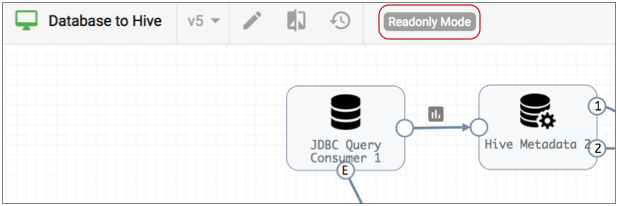
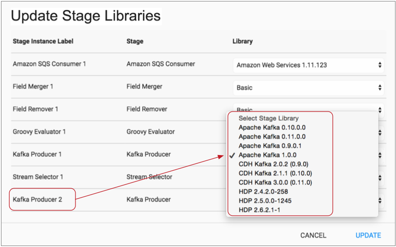
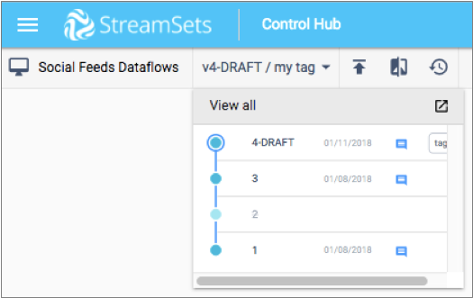

# 管道设计师提示

该控制集线器 管道设计是密切基于对数据收集 管道配置画布。一些功能差异如下所述：

- 创作数据收集器

  在Pipeline Designer中配置管道或管道片段时，请选择要使用的创作数据收集器。您可以使用Control Hub随附的系统Data Collector进行勘探和灯光开发。要执行显式验证或数据预览，请使用您注册的Data Collector之一作为创作Data Collector。

  选择一个注册的Data Collector，该版本与打算用于在生产中运行管道的Data Collector的版本相同。使用不同的Data Collector版本可能会导致开发对于生产Data Collector无效的管道。

  例如，如果您使用的Data Collector开发版本比生产版本使用的是更新版本，则可能包含阶段，阶段库，或者生产Data Collector中不存在阶段功能。

  注册的数据收集器必须满足某些要求才能用作创作数据收集器。欲了解更多信息，请参见[编写数据采集小号](https://streamsets.com/documentation/controlhub/latest/help/#controlhub/UserGuide/Pipelines/Pipelines_title.html%23concept_ygv_l4c_ccb)。

  

- 创建管道或片段

  创建管道或管道片段时，请指定管道将在Data Collector还是SDC Edge上运行。对于管道，可以从空白画布或现有模板开始。

  Pipeline Designer提供了几个Data Collector和SDC Edge模板作为示例管道。您可以使用它们来熟悉Pipeline Designer和管道设计，也可以将它们用作管道开发的基础。

- 编辑已发布的管道或片段

  查看已发布的管道或管道片段时，管道设计器以只读模式显示管道或片段。模式显示在画布上方，如下所示：

  

  要编辑已发布的管道或片段，请单击“编辑”图标：。然后管道或片段进入编辑模式。

- 选择多个阶段

  编辑管道或管道片段时，可以在管道画布中选择多个阶段，然后移动或删除选定的阶段。要在画布中选择多个阶段，请选择Shift键，然后单击每个阶段。

- 更新管道的阶段库

  编辑管道或管道片段时，可以使用“更新阶段库”对话框来更新管道或片段中多个阶段的阶段库。

  这使您可以在更改管道或片段的创作数据收集器时一次更新所有必需的阶段库。如果需要，还可以通过编辑每个阶段来分别更改阶段库。

  为每个阶段显示的阶段库取决于为管道或片段选择的创作数据收集器。例如，如果创作数据收集器安装了MapR 5.0和5.1阶段库，那么这些是为MapR FS目标或MapR FS文件元数据执行程序显示的阶段库。

  要一次更新多个阶段库，请单击“更多”图标（），然后选择“更新阶段库”。

  “更新阶段库”对话框显示管道或片段中每个阶段的阶段名称和类型。右侧是创作数据收集器上可用的舞台对应的舞台库列表 。

  根据需要更新舞台库，然后单击“更新”以保存您的更改。

  

- 使用版本

  当管道或管道片段有多个版本时，管道设计器会指示您正在查看的管道或片段的版本。您可以单击管道或片段版本以选择其他版本来查看，如下所示：

  

  有关使用版本的更多信息，请参见[版本历史](https://streamsets.com/documentation/controlhub/latest/help/datacollector/UserGuide/Pipeline_Configuration/VersionHistory.html#concept_iv5_fjc_lfb)。

- 对管道草图进行测试

  编辑管道时，可以对管道草案进行[测试运行](https://streamsets.com/documentation/controlhub/latest/help/controlhub/UserGuide/Pipelines/ConfigurePipelines_PDesigner.html#task_l5g_34f_t3b)，以快速测试管道逻辑。您可以对完全配置的管道的草稿版本执行测试运行。

- 发布管道或片段

  完成管道或片段的工作后，即可发布管道或片段。发布管道以基于管道创建和运行作业。发布片段以使其可用于测试或在管道中使用。

  使用发布图标发布有效的管道或片段：。输入提交消息，说明此版本中的更改，以便您可以跟踪管道或片段的提交历史记录。

  发布管道后，它将进入只读模式，可用于创建作业。发布片段后，它将进入只读模式，并且可以包含在管道中。

- 创建工作

  发布管道后，您可以创建作业。

  您可以使用创建的作业图标作业管道设计：。或者，您可以从“作业”视图创建作业。

- 数据预览要求

  当管道使用已注册的Data Collector作为创作Data Collector时，可以预览数据。

  如果管道使用无法访问的系统数据收集器或选定的已注册数据收集器，则禁用“预览管道”图标（）。

- 验证要求

  当管道使用注册的Data Collector作为创作Data Collector时，可以执行显式验证。

  使用Validate图标执行显式验证：。