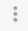

# Pipeline Designer UI

The following image shows the Pipeline Designer UI when you configure a pipeline:

| AREA/ICON                                           | NAME                                   | DESCRIPTION                                                  |
| :-------------------------------------------------- | :------------------------------------- | :----------------------------------------------------------- |
| 1                                                   | Pipeline canvas                        | Displays the pipeline. Use to configure the pipeline data flow. |
| 2                                                   | Pipeline Creation Help Bar             | Offers lists of stages to help complete the pipeline.You can use the help bar to connect a stage to an open node. You can also add a stage between linked stages by clicking the link. |
| 3                                                   | Stage list                             | Lists the stages in the pipeline. Use to select a stage to configure. You can also select the stage in the canvas. |
| 4                                                   | Properties panel                       | Displays the properties of the pipeline or selected stage when you configure a pipeline. |
| 5                                                   | Stage library panel                    | List of available stages. Use to add stages to the pipeline. You can drag a stage to a location on canvas or click a stage to add it to the end of the pipeline.You can view all stages, stages by type, or stages by library. You can also search for a stage by name. |
|                 | Pipeline name display                  | Displays the name of the pipeline in the canvas.             |
|                  | Pipeline version display and selection | The version of the pipeline in the canvas. To select a different version, click the icon and select the version to view. |
|                  | Publish icon                           | Publishes the pipeline or fragment in the canvas. Displays for pipelines only when the pipeline passes [implicit validation](https://streamsets.com/documentation/controlhub/latest/help/datacollector/UserGuide/Pipeline_Configuration/Validation.html#concept_azs_swf_jr).When the pipeline has already been published, the Edit icon displays in the same location.Publish a pipeline to enable creating a job for the pipeline. Publish a fragment to enable using the fragment in a pipeline. |
|                 | Edit icon                              | Enables editing the pipeline or fragment. Displays when the pipeline or fragment has already been published and is being viewed in read only mode.When the pipeline or fragment is already in edit mode, the Publish icon displays in the same location. |
|                  | Compare with Previous Version icon     | Compares the pipeline or fragment in the canvas with a previous version. |
|                      | History icon                           | Displays the history of the pipeline or fragment in the canvas. |
|               | Validation Errors icon                 | Lists the number of validation errors for [implicit validation](https://streamsets.com/documentation/controlhub/latest/help/datacollector/UserGuide/Pipeline_Configuration/Validation.html#concept_azs_swf_jr). Click to view the error messages. |
|                         | More icon                              | Provides additional actions to take.Use to delete or export a pipeline, or to update the stage libraries used in the pipeline.Use to import or export a pipeline fragment. |
|                       | Delete icon                            | Deletes the selected item in the canvas.                     |
|                         | Duplicate Stage icon                   | Duplicates the selected stage.                               |
|                  | Auto Arrange icon                      | Automatically arranges the stages on the canvas.             |
|  | Authoring Data Collector icon          | Authoring Data Collector associated with the pipeline. You can click the icon and select a different Data Collector to use. |
|                     | Validate icon                          | Validates the pipeline. Performs explicit validation.Displays when the pipeline is in edit mode and passes implicit validation. |
|                      | Preview icon                           | Starts data preview. Available for valid pipelines and fragments when using a registered Data Collector as the authoring Data Collector.Not available when using the system Data Collector for authoring. |
|                        | Share icon                             | Shares the pipeline or fragment with users and groups. Use to configure permissions for the pipeline or fragment. |
|                    | Create Job icon                        | Creates a job based on the pipeline. Creates a job for a published pipeline. |
|                    | Stage Library icon                     | Toggles the display of the Stage Library panel.              |
|                | Expand Fragments icon                  | Expands all pipeline fragments in the pipeline, displaying all stages in the fragments. |
|              | Collapse Fragments icon                | Collapses expanded pipeline fragments, displaying a single fragment stage for each fragment. |
|                   | Stream link icon                       | Indicates the flow of data through the pipeline or fragment. Select to configure data rules and alerts.Darker icons indicate that a data rule is configured for the link. |
|                        | Error icon                             | Indicates that one or more required properties are not defined. Can display on a stage for stage properties or in the canvas for pipeline properties.Related error messages display when you hover over the icon. You can also view the messages in the Validation Errors list.The icon can also display on tabs in the properties panel to indicate the location of missing properties. |

**Note:** Some icons and options might not display. The items that display are based on the task that you are performing and roles assigned to your user account.

For example, the Create Job icon displays only for published pipelines when you log in with the Job Operator role. Or, if you log in with only the Pipeline User role configuration-related icons are not available.