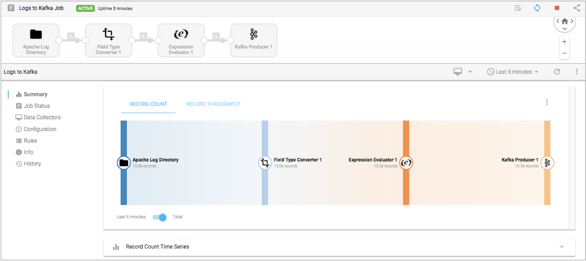

# 管道统计

一个控制中心 工作确定了管道运行和数据收集 S或边缘数据采集器 （SDC边缘）运行的管道。开始作业时，Control Hub会 在Data Collector或Edge Data Collector的组上远程运行管道。要监视Control Hub中的作业统计信息和指标，您必须配置管道以将统计信息写入Control Hub或另一个系统。

当边缘管道的作业在SDC Edge上运行时，或者独立管道的作业在单个Data Collector上运行时，您可以配置管道以将统计信息直接写入Control Hub。

当独立管道的作业在多个Data Collector上运行时，远程管道实例在每个Data Collector上运行。当集群管道的作业在单个Data Collector上运行时，远程管道实例在集群中的多个工作节点上运行。要在Control Hub中查看这些作业的汇总统计信息，必须配置管道以将统计信息写入以下系统之一：

- SDC RPC
- 卡夫卡集群
- Amazon Kinesis Streams
- MapR流

当您启动包含配置为写入Kafka，Kinesis，MapR Streams或SDC RPC的 管道的作业时，Control Hub会自动为该作业生成并运行系统管道。系统管道读取每个正在运行的管道实例向Kafka，Kinesis，MapR Streams或SDC RPC写入的统计信息。然后，系统管道聚合并将统计信息发送到 Control Hub。

**重要提示：**对于生产环境中的独立管道和集群管道，请使用Kafka集群，Amazon Kinesis Streams或MapR Streams汇总统计信息。使用SDC RPC聚合统计信息的可用性不高，并且可能会导致某些数据丢失。它应仅用于开发目的。

当Control Hub作业包括配置为写入统计信息的管道时，您可以在Control Hub中监视作业时查看统计信息和指标：



当控制中心作业包含配置为丢弃统计信息的管道时，控制中心 将无法显示该作业的统计信息和指标。而是， 在监视作业时，控制中心将显示以下警告消息：

```
Aggregated metrics for the job are not available as individual pipeline metrics are discarded.
```

## 管道执行模式

管道可以在独立，群集或边缘执行模式下运行。某些管道执行模式不支持所有统计信息聚合器选项。

下表列出了每种管道执行模式及其支持的统计信息聚合器选项：

| 管道执行模式                                                 | 支持的统计聚合器选项                               |
| :----------------------------------------------------------- | :------------------------------------------------- |
| 单机版                                                       | 支持所有选项。                                     |
| [簇](https://streamsets.com/documentation/controlhub/latest/help/datacollector/UserGuide/Cluster_Mode/ClusterPipelines.html#concept_hmh_kfn_1s) | 写入SDC RPC写给卡夫卡写入Kinesis Streams写入MapR流 |
| [边缘](https://streamsets.com/documentation/controlhub/latest/help/datacollector/UserGuide/Edge_Mode/EdgePipelines_Overview.html#concept_d4h_kkq_4bb) | 直接写入SCH                                        |

**重要提示：**对于生产环境中的独立管道和集群管道，请使用Kafka集群，Amazon Kinesis Streams或MapR Streams汇总统计信息。仅当具有独立管道的作业在单个Data Collector上运行时，才支持将统计信息直接写入 Control Hub。将统计信息写入SDC RPC的可用性不高，可能会导致某些数据丢失。这些方法应仅用于开发目的。

## 直接将统计信息写入Control Hub

将统计信息直接写入Control Hub时，Control Hub不会为该作业生成系统管道。而是，数据收集器或SDC Edge 直接将统计信息发送到Control Hub。

当独立管道或边缘管道的作业在单个Data Collector或 SDC Edge上运行时，将统计信息直接写入开发环境中的Control Hub。如果作业在多个Data Collector或 Edge Data Collector上运行，则Control Hub 可以显示每个单独管道的管道统计信息。但是，Control Hub 无法显示所有正在运行的管道实例的统计信息的聚合视图。

当您直接将统计信息写入Control Hub时， Control Hub 无法为该作业生成[数据传送报告](https://streamsets.com/documentation/controlhub/latest/help/controlhub/UserGuide/Reports/DeliveryReports_title.html)或触发该作业的 [数据SLA警报](https://streamsets.com/documentation/controlhub/latest/help/controlhub/UserGuide/Topologies/MasterDataSLAs.html#concept_zzj_5kh_2z)。

## 将统计信息写入SDC RPC

将统计信息写入SDC RPC时，Data Collector会 有效地将SDC RPC目标添加到您正在配置的管道中。Control Hub会 自动生成作业并运行该作业的系统管道。系统管道是具有带有缓冲源的Dev SDC RPC的管道，该管道读取从SDC RPC目标传递的统计信息，然后聚合并将统计信息发送到Control Hub。

在Data Collector Edge管道中无效。

**重要提示：**对于生产环境中的独立管道和集群管道，请使用Kafka集群，Amazon Kinesis Streams或MapR Streams汇总统计信息。使用SDC RPC聚合统计信息的可用性不高，并且可能会导致某些数据丢失。它应仅用于开发目的。

当您配置管道以将统计信息写入SDC RPC目标时，请指定以下信息：

- SDC RPC连接-Control Hub启动系统管道的

  Data Collector

  计算机的主机和端口号。主机必须是在Control Hub中注册的Data Collector计算机，该计算机可以运行作业的管道。当数据收集器具有与作业关联的所有标签时，它可以运行管道。

  例如，如果您将作业与WestCoast标签关联，则RPC连接中指定的主机必须是一台具有注册的Data Collector的计算机，该计算机也具有WestCoast标签。

- SDC RPC ID-用户定义的标识符，允许SDC RPC阶段相互识别。为避免混淆来自不同作业的统计信息，请为每个作业使用唯一的ID。

您可以选择启用加密以安全地传递数据并定义重试和超时属性。

有关SDC RPC管道的更多信息，请参见[SDC RPC管道概述](https://streamsets.com/documentation/controlhub/latest/help/datacollector/UserGuide/RPC_Pipelines/SDC_RPCpipelines_title.html#concept_lnh_z3z_bt)。

### SDC RPC的最佳做法

配置管道以将统计信息写入SDC RPC目标时，请考虑以下最佳实践：

- 为避免混淆来自不同作业的统计信息，请为每个作业使用唯一的SDC RPC ID。

- 在将记录传递到管道的下一级之前，监视系统管道中具有缓冲源的Dev SDC RPC临时将记录缓冲到磁盘的磁盘空间。

  系统管道中具有缓冲源的Dev SDC RPC临时将统计信息缓冲到磁盘上的队列中。如果系统管道变慢，则磁盘上的临时位置可能已满。临时统计信息将写入`java.io.tmpdir`系统属性中指定的位置 ，并写入具有以下名称的文件中：

  ```
  sdc-fragments<file ID>.queueFile
  ```

## 写统计到卡夫卡

将统计信息写入Kafka集群时，Data Collector会 有效地将Kafka Producer目标添加到您正在配置的管道中。Control Hub会 自动生成作业并运行该作业的系统管道。系统管道从Kafka读取统计信息，然后进行汇总并将统计信息发送到Control Hub。

在Data Collector Edge管道中无效。

将统计信息写入Kafka集群时，您将定义连接信息和要写入的主题。

您还可以配置分区策略。管道根据您选择的分区策略将数据传递到Kafka主题中的分区。您可以根据需要添加其他Kafka配置属性。您还可以配置管道以通过SSL / TLS或Kerberos安全地连接到Kafka。

### 分区策略

分区策略确定如何将统计信息写入Kafka分区。您可以使用分区策略来平衡工作负载或在语义上写入数据。

管道可以使用以下分区策略之一：


- 轮循

  使用循环顺序将统计信息写入另一个分区。用于负载均衡。

- 随机

  使用随机顺序将统计信息写入另一个分区。用于负载均衡。

- 表达

  根据分区表达式的结果将统计信息写入分区。用于执行语义分区。

  配置分区表达式时，请定义该表达式以求出要在其中写入统计信息的分区。

- 默认

  使用Kafka提供的默认分区策略写入统计信息。

### Kafka群集的最佳做法

配置管道以将统计信息写入Kafka集群时，请考虑以下最佳做法：

- 为避免混淆来自不同作业的统计信息，请为每个作业使用唯一的主题名称。

- 考虑一下Kafka保留政策。

  每个正在运行的管道实例将统计信息写入Kafka，然后系统管道使用来自Kafka的统计信息。如果系统管道意外关闭，Kafka将保留统计信息，其保留时间由Kafka保留策略确定。如果系统管道关闭的时间长于Kafka保留数据的时间，则统计信息将丢失。

## 将统计数据写入Kinesis流

当您将统计信息写入Amazon Kinesis Streams时，Data Collector会 有效地将Kinesis Producer目标添加到您正在配置的管道中。 Control Hub会 自动生成作业并运行该作业的系统管道。系统管道从Kinesis Streams读取统计信息，然后进行汇总并将统计信息发送到Control Hub。

在Data Collector Edge管道中无效。

将统计信息写入Kinesis Streams时，您将定义连接信息和要写入的流。

您还可以配置分区策略。管道根据您选择的分区策略将数据传递到Kinesis分片中的分区。您可以根据需要添加其他Kinesis配置属性。

### AWS凭证

当管道将汇总统计信息写入Amazon Kinesis Streams时，它必须将凭证传递给Amazon Web Services。

使用以下方法之一来传递AWS凭证：

- IAM角色

  当Data Collector在Amazon EC2实例上运行时，您可以使用AWS管理控制台为EC2实例配置IAM角色。Data Collector使用IAM实例配置文件凭证自动连接到AWS。

  使用IAM角色时，在为管道配置统计信息时，无需指定访问密钥ID和秘密访问密钥属性。

  有关将IAM角色分配给EC2实例的更多信息，请参阅Amazon EC2文档。

- AWS访问密钥对

  当Data Collector未在Amazon EC2实例上运行或EC2实例不具有IAM角色时，在为管道配置统计信息时必须指定**访问密钥ID** 和**秘密访问密钥**属性。

### Kinesis Streams的最佳做法

在配置管道以将统计信息写入Amazon Kinesis Streams时，请考虑以下最佳实践：

- 为避免混淆来自不同作业的统计信息，请为每个作业使用唯一的流名称。

- 考虑Kinesis Streams保留策略。

  每个正在运行的管道实例将统计信息写入Kinesis Streams，然后系统管道从Kinesis Streams读取统计信息。如果系统管道意外关闭，则Kinesis Streams会保留统计信息达Kinesis Streams保留策略确定的时间。如果系统管道关闭的时间长于Kinesis Streams保留数据的时间，则统计信息将丢失。

## 将统计信息写入MapR流

将统计信息写入MapR Streams时，Data Collector会 有效地将MapR Streams Producer目标添加到您正在配置的管道中。Control Hub会 自动生成作业并运行该作业的系统管道。系统管道从MapR流读取统计信息，然后进行汇总并将统计信息发送到Control Hub。

在Data Collector Edge管道中无效。

将统计信息写入MapR Streams时，您将定义要写入的主题。您还可以配置分区策略。管道根据您选择的分区策略将数据传递到MapR Streams主题中的分区。您可以根据需要添加其他MapR Streams配置属性。

在将统计信息写入MapR流之前，必须执行其他步骤以使Data Collector能够处理MapR数据。有关更多信息，请参阅Data Collector 文档中的 [MapR先决条件](https://streamsets.com/documentation/datacollector/latest/help/#datacollector/UserGuide/Installation/MapR-Prerequisites.html%23concept_jgs_qpg_2v)。

### 分区策略

分区策略确定如何将统计信息写入MapR Streams分区。您可以使用分区策略来平衡工作负载或在语义上写入数据。

管道可以使用以下分区策略之一：


- 轮循

  使用循环顺序将每个记录写入不同的分区。用于负载均衡。

- 随机

  使用随机顺序将每个记录写入不同的分区。用于负载均衡。

- 表达

  根据分区表达式的结果将每个记录写入分区。用于执行语义分区。

  配置分区表达式时，请定义该表达式以求出要在其中写入每个记录的分区。该表达式必须返回一个数值。

- 默认

  使用MapR Streams提供的默认分区策略写入每个记录。

### MapR流的最佳做法

配置管道以将统计信息写入MapR流时，请考虑以下最佳做法：

- 为避免混淆来自不同作业的统计信息，请为每个作业使用唯一的主题名称。

- 考虑MapR Streams保留策略。

  每个正在运行的管道实例将统计信息写入MapR Streams，然后系统管道使用MapR Streams中的统计信息。如果系统管道意外关闭，则MapR Streams会保留统计信息达MapR Streams保留策略所确定的时间。如果系统管道关闭的时间长于MapR Streams保留数据的时间，则统计信息将丢失。

## 配置管道以写入统计信息

您可以配置管道以写入统计信息。

1. 打开管道。

2. 在“ **统计信息”**选项卡上，选择要使用的统计信息聚合器：

   - 丢弃-丢弃管道统计信息。Control Hub无法显示作业的统计信息和指标。

   - 直接写入

     Control Hub-

     将管道统计信息直接写入

     Control Hub

     。用于在

     SDC Edge

     上运行的边缘管道。当具有独立管道的作业在单个

     Data Collector

     上运行时，也可用于开发目的。

     在Data Collector Edge管道中，必须使用此选项。其他选项无效。

   - 写入SDC RPC-将管道统计信息写入SDC RPC目标。仅用于开发目的。

   - 写入Kafka-将管道统计信息写入Kafka集群。

   - 写入Kinesis-将管道统计信息写入Amazon Kinesis Streams。

   - 写入MapR流-将管道统计信息写入MapR流。

3. 要将统计信息写入SDC RPC目标，请在“ **统计聚合器-写入SDC RPC”**选项卡上，配置以下属性：

   | SDC RPC属性            | 描述                                                         |
   | :--------------------- | :----------------------------------------------------------- |
   | SDC RPC连接            | 系统管道运行的主机和端口。主机必须是具有注册的Data Collector的计算机，该计算机运行该作业的管道实例。使用以下格式：`:`。 |
   | 每批重试               | SDC RPC目标尝试将批处理写入具有系统源中缓冲源的Dev SDC RPC的次数。当SDC RPC目标无法在配置的重试次数内写入批处理时，它将使该批处理失败。默认值为3。 |
   | 退避期                 | 要等待的毫秒数，然后再尝试将批处理写入到系统管道中具有缓冲源的Dev SDC RPC中。每次重试后，输入的值将呈指数增长。例如，如果将退避周期设置为10，则SDC RPC目标将在等待10毫秒后尝试第一次重试，在等待100毫秒后尝试第二次重试，并在等待1000毫秒后尝试第三次重试。设置为0可立即重试。默认值为0。 |
   | SDC RPC ID             | 用户定义的ID，以允许SDC RPC目标将统计信息传递到系统管道。为避免混淆来自不同作业的统计信息，请为每个作业使用唯一的ID。您不能定义一个计算结果为ID的表达式。 |
   | 连接超时（毫秒）       | 建立与系统管道的连接的毫秒数。SDC RPC目标根据“每批重试”属性重试连接。默认值为5000毫秒。 |
   | 启用TLS                | 启用使用TLS的数据安全传输。                                  |
   | 信任库文件             | TLS的信任库文件。如果密钥库文件是自签名证书，则为必需。必须存储在运行作业的管道实例的每台Data Collector计算机上的Data Collector资源目录 $ SDC_RESOURCES中。 |
   | 信任库密码             | 信任库文件的密码。**提示：** 为了保护敏感信息，例如用户名和密码，可以使用 [运行时资源](https://streamsets.com/documentation/controlhub/latest/help/datacollector/UserGuide/Pipeline_Configuration/RuntimeValues.html#concept_bs4_5nm_2s)或凭据存储。有关凭证存储的更多信息，请参阅Data Collector文档中的[凭证存储](https://streamsets.com/documentation/datacollector/latest/help/#datacollector/UserGuide/Configuration/CredentialStores.html)。 |
   | 读取超时（毫秒）       | 等待系统管道中具有缓冲源的Dev SDC RPC的毫秒数，以从批处理中读取数据。SDC RPC目标根据“每批重试次数”属性重试写入。默认值为2000毫秒。 |
   | 使用压缩               | 使SDC RPC目标能够使用压缩将数据传递到系统管道中具有缓冲源的Dev SDC RPC。默认启用。 |
   | 验证服务器证书中的主机 | 在运行系统管道的Data Collector计算机上的密钥库文件中验证主机。 |

4. 要将统计信息写入Kafka，请在**Stats Aggregator-写入Kafka**选项卡上，配置以下属性：

   | 卡夫卡房产                                                   | 描述                                                         |
   | :----------------------------------------------------------- | :----------------------------------------------------------- |
   | 经纪人URI                                                    | Kafka代理的连接字符串。使用以下格式： `:`。要确保连接，请输入其他代理URI的逗号分隔列表。 |
   | 运行时主题解析                                               | 此时请勿使用。                                               |
   | 话题                                                         | 要使用的主题。为避免混淆来自不同作业的统计信息，请为每个作业使用唯一的主题名称。您不能定义一个以主题名称为准的表达式。 |
   | [分区策略](https://streamsets.com/documentation/controlhub/latest/help/datacollector/UserGuide/Destinations/KProducer.html#concept_qpm_xp4_4r) | 用于写入分区的策略：Round Robin-轮流写入不同的分区。随机-随机写入分区。表达式-使用表达式将数据写入不同的分区。将记录写到表达式结果指定的分区中。默认-使用表达式从记录中提取分区键。根据分区键的哈希将记录写入分区。 |
   | 分区表达                                                     | 使用表达式分区策略时要使用的表达式。定义表达式以求值到要写入统计信息的分区。分区号以0开头。（可选）单击 **Ctrl +空格键**以帮助创建表达式。 |
   | Kafka配置                                                    | 要使用的其他Kafka属性。使用[简单或批量编辑模式](https://streamsets.com/documentation/controlhub/latest/help/datacollector/UserGuide/Pipeline_Configuration/SimpleBulkEdit.html#concept_alb_b3y_cbb)，单击 **添加**图标，然后定义Kafka属性名称和值。使用Kafka期望的属性名称和值。不要使用broker.list属性。 |
   | ZooKeeper URI                                                | Kafka集群的ZooKeeper的连接字符串。使用以下格式： `:`。要使用ZooKeeper仲裁，请输入以逗号分隔的列表。要使用ZooKeeper chroot路径，请在列表末尾添加路径，如下所示：`:, :, .../` |

5. 要将统计信息写入Amazon Kinesis Streams，请在**Stats Aggregator-写入Kinesis**选项卡上，配置以下属性：

   | 运动特性                                                     | 描述                                                         |
   | :----------------------------------------------------------- | :----------------------------------------------------------- |
   | 访问密钥ID [](https://streamsets.com/documentation/controlhub/latest/help/datacollector/UserGuide/DPM/AggregatedStatistics.html#concept_m3j_2kb_fx) | AWS访问密钥ID。不将IAM角色与IAM实例配置文件凭据一起使用时是必需的。 |
   | 秘密访问密钥 [](https://streamsets.com/documentation/controlhub/latest/help/datacollector/UserGuide/DPM/AggregatedStatistics.html#concept_m3j_2kb_fx) | AWS秘密访问密钥。不将IAM角色与IAM实例配置文件凭据一起使用时是必需的。 |
   | 区域                                                         | 托管Kinesis集群的Amazon Web Services地区。                   |
   | 终点                                                         | 当您为区域选择“其他”时要连接的端点。输入端点名称。           |
   | 流名称                                                       | Kinesis流名称。为避免混淆来自不同作业的统计信息，请为每个作业使用唯一的流名称。您不能定义计算结果为流名称的表达式。 |
   | 分区策略                                                     | 将数据写入Kinesis分片的策略：随机-生成随机分区密钥。表达式-使用表达式的结果作为分区键。 |
   | 分区表达                                                     | 用于生成用于将数据传递到不同分片的分区键的表达式。用于表达式分区策略。 |
   | Kinesis生产者配置                                            | 其他Kinesis属性。添加配置属性时，输入确切的属性名称和值。管道不验证属性名称或值。 |

6. 要将统计信息写入MapR Streams，请在“ **统计聚合器-写入MapR Streams”**选项卡上，配置以下属性：

   | MapR Streams属性                                             | 描述                                                         |
   | :----------------------------------------------------------- | :----------------------------------------------------------- |
   | 运行时主题解析                                               | 此时请勿使用。                                               |
   | 话题                                                         | 要使用的主题。为避免混淆来自不同作业的统计信息，请为每个作业使用唯一的主题名称。您不能定义一个以主题名称为准的表达式。 |
   | [分区策略](https://streamsets.com/documentation/controlhub/latest/help/datacollector/UserGuide/Destinations/KProducer.html#concept_qpm_xp4_4r) | 用于写入分区的策略：Round Robin-轮流写入不同的分区。随机-随机写入分区。表达式-使用表达式将数据写入不同的分区。将记录写到表达式结果指定的分区中。默认-使用表达式从记录中提取分区键。根据分区键的哈希将记录写入分区。 |
   | 分区表达                                                     | 使用表达式分区策略时要使用的表达式。定义表达式以求值到要写入统计信息的分区。分区号以0开头。（可选）单击 **Ctrl +空格键**以帮助创建表达式。 |
   | MapR流配置                                                   | 要使用的其他配置属性。使用[简单或批量编辑模式](https://streamsets.com/documentation/controlhub/latest/help/datacollector/UserGuide/Pipeline_Configuration/SimpleBulkEdit.html#concept_alb_b3y_cbb)，单击 **添加**图标，然后定义MapR Streams属性名称和值。使用MapR Streams期望的属性名称和值。您可以使用MapR Streams属性和MapR Streams支持的Kafka属性集。 |